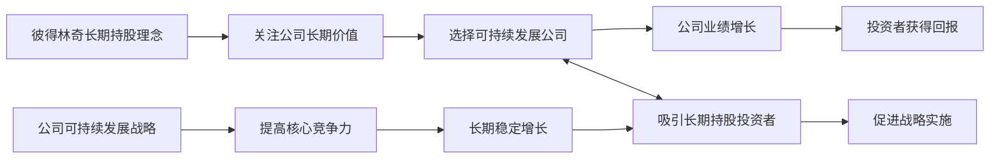

# 彼得林奇的“长期持股”与公司可持续发展战略的关联性分析

> 关键词：彼得林奇、长期持股、公司可持续发展战略、价值投资、财务分析

> 摘要：本文旨在深入分析彼得林奇所倡导的“长期持股”投资理念与公司可持续发展战略之间的关联性。通过对相关核心概念的阐述、算法原理的剖析、数学模型的构建以及实际案例的研究，揭示两者在企业价值创造和投资者收益实现过程中的相互作用。同时，探讨了这种关联性在实际应用场景中的体现，推荐了相关的学习资源、开发工具和研究论文，最后对未来发展趋势与挑战进行了总结，并提供了常见问题的解答和扩展阅读的参考资料。

## 1. 背景介绍 
### 1.1 目的和范围
本文的主要目的是全面分析彼得林奇的“长期持股”投资理念与公司可持续发展战略之间的内在联系。通过研究两者的关联性，为投资者提供更深入的投资决策依据，帮助企业制定更符合长期价值创造的可持续发展战略。研究范围涵盖了彼得林奇投资思想的核心要点、公司可持续发展战略的构成要素，以及两者在不同行业和市场环境下的相互影响。

### 1.2 预期读者
本文预期读者包括专业投资者、企业管理者、金融分析师、学术研究人员以及对投资和企业管理感兴趣的普通读者。专业投资者可以从中获取关于长期投资策略的新视角，企业管理者可以借鉴公司可持续发展战略与投资者关系的处理方法，金融分析师可以用于更准确地评估企业价值，学术研究人员可以开展相关领域的深入研究，普通读者则可以了解投资和企业管理的基本原理。

### 1.3 文档结构概述
本文将按照以下结构展开：首先介绍核心概念与联系，阐述“长期持股”和公司可持续发展战略的基本原理和相互关系；接着分析核心算法原理和具体操作步骤，通过 Python 代码示例说明如何评估相关因素；然后构建数学模型和公式，详细讲解并举例说明；再通过项目实战展示实际案例和代码解读；探讨实际应用场景；推荐相关的工具和资源；总结未来发展趋势与挑战；提供常见问题解答和扩展阅读参考资料。

### 1.4 术语表
#### 1.4.1 核心术语定义
- **长期持股**：指投资者在较长的时间周期内持有某一公司的股票，不轻易因短期市场波动而卖出，以获取公司长期成长带来的收益。
- **公司可持续发展战略**：是企业为了实现长期稳定的发展，在经济、社会和环境等多个方面进行综合考虑和规划的战略体系，旨在平衡短期利益和长期目标，确保企业在未来具有持续的竞争力和价值创造能力。
- **价值投资**：一种投资策略，强调通过对公司基本面的分析，寻找被低估的股票，并长期持有，以分享公司价值增长带来的收益。

#### 1.4.2 相关概念解释
- **基本面分析**：通过研究公司的财务报表、行业地位、管理团队等基本信息，评估公司的内在价值和发展潜力。
- **现金流折现模型**：一种评估企业价值的方法，通过预测企业未来的现金流，并将其折现到当前时刻，来确定企业的内在价值。

#### 1.4.3 缩略词列表
- **PE**：市盈率（Price-to-Earnings Ratio），是指股票价格与每股收益的比率，用于衡量股票的估值水平。
- **ROE**：净资产收益率（Return on Equity），是指公司净利润与股东权益的比率，反映了公司运用自有资本的效率。

## 2. 核心概念与联系 
### 2.1 彼得林奇的“长期持股”理念
彼得林奇是美国著名的投资家，他在管理富达麦哲伦基金期间取得了卓越的投资业绩。他的“长期持股”理念基于对公司基本面的深入研究和对企业长期发展潜力的信心。林奇认为，只要公司的基本面没有发生根本性变化，并且具有持续增长的潜力，投资者就应该长期持有其股票，而不是被短期的市场波动所左右。

### 2.2 公司可持续发展战略
公司可持续发展战略是企业为了实现长期生存和发展而制定的一系列战略规划。它不仅关注企业的经济利益，还考虑到社会和环境因素。可持续发展战略包括产品创新、市场拓展、人才培养、环境保护等多个方面，旨在提高企业的核心竞争力和抗风险能力，确保企业在长期内保持稳定的增长。

### 2.3 两者的联系
彼得林奇的“长期持股”理念与公司可持续发展战略之间存在着密切的联系。一方面，具有可持续发展战略的公司更有可能在长期内实现业绩的稳定增长，从而为长期持股的投资者带来丰厚的回报。另一方面，长期持股的投资者对公司的稳定性和可持续发展具有积极的促进作用，因为他们更关注公司的长期价值，而不是短期的股价波动，这有助于公司管理层更加专注于长期战略的实施。

### 2.4 文本示意图
以下是“长期持股”与公司可持续发展战略的联系示意图：

长期持股理念 -> 关注公司长期价值 -> 选择具有可持续发展战略的公司 -> 公司业绩增长 -> 投资者获得回报
公司可持续发展战略 -> 提高核心竞争力 -> 实现长期稳定增长 -> 吸引长期持股投资者 -> 促进战略实施

### 2.5 Mermaid 流程图


## 3. 核心算法原理 & 具体操作步骤 
### 3.1 核心算法原理
在评估彼得林奇的“长期持股”与公司可持续发展战略的关联性时，我们可以运用一些基本的财务分析算法。例如，通过计算市盈率（PE）、净资产收益率（ROE）等指标来评估公司的估值和盈利能力。同时，我们可以使用现金流折现模型（DCF）来评估公司的内在价值。

### 3.2 Python 代码实现
以下是一个简单的 Python 代码示例，用于计算市盈率和净资产收益率：

```python
# 定义公司财务数据
stock_price = 50  # 股票价格
earnings_per_share = 5  # 每股收益
shareholders_equity = 1000  # 股东权益
net_income = 200  # 净利润

# 计算市盈率
pe_ratio = stock_price / earnings_per_share

# 计算净资产收益率
roe = (net_income / shareholders_equity) * 100

# 输出结果
print(f"市盈率 (PE): {pe_ratio}")
print(f"净资产收益率 (ROE): {roe}%")
```

### 3.3 具体操作步骤
1. **数据收集**：收集公司的财务报表数据，包括股票价格、每股收益、股东权益、净利润等。
2. **指标计算**：根据收集到的数据，计算市盈率、净资产收益率等指标。
3. **分析评估**：根据计算结果，评估公司的估值和盈利能力。一般来说，较低的市盈率和较高的净资产收益率表明公司具有较好的投资价值。
4. **决策制定**：结合公司的可持续发展战略，判断是否适合长期持股。如果公司具有良好的可持续发展战略，并且估值和盈利能力也较好，那么可以考虑长期持有其股票。

## 4. 数学模型和公式 & 详细讲解 & 举例说明 
### 4.1 市盈率（PE）
市盈率是指股票价格与每股收益的比率，计算公式为：

$$PE = \frac{P}{EPS}$$

其中，$P$ 表示股票价格，$EPS$ 表示每股收益。

市盈率反映了投资者为获取公司每一元盈利所愿意支付的价格。一般来说，较低的市盈率意味着股票被低估，具有较高的投资价值；而较高的市盈率则可能意味着股票被高估，投资风险较大。

**举例说明**：假设某公司的股票价格为 50 元，每股收益为 5 元，则该公司的市盈率为：

$$PE = \frac{50}{5} = 10$$

这意味着投资者为获取该公司每一元盈利愿意支付 10 元的价格。

### 4.2 净资产收益率（ROE）
净资产收益率是指公司净利润与股东权益的比率，计算公式为：

$$ROE = \frac{Net Income}{Shareholders' Equity} \times 100\%$$

其中，$Net Income$ 表示净利润，$Shareholders' Equity$ 表示股东权益。

净资产收益率反映了公司运用自有资本的效率，是衡量公司盈利能力的重要指标。一般来说，较高的净资产收益率表明公司具有较强的盈利能力和较好的经营管理水平。

**举例说明**：假设某公司的净利润为 200 万元，股东权益为 1000 万元，则该公司的净资产收益率为：

$$ROE = \frac{200}{1000} \times 100\% = 20\%$$

这意味着该公司每 100 元的股东权益可以创造 20 元的净利润。

### 4.3 现金流折现模型（DCF）
现金流折现模型是一种评估企业价值的方法，通过预测企业未来的现金流，并将其折现到当前时刻，来确定企业的内在价值。其基本公式为：

$$V = \sum_{t=1}^{n} \frac{CF_t}{(1 + r)^t} + \frac{TV}{(1 + r)^n}$$

其中，$V$ 表示企业的内在价值，$CF_t$ 表示第 $t$ 期的现金流，$r$ 表示折现率，$TV$ 表示终值，$n$ 表示预测期数。

**举例说明**：假设某公司未来 5 年的现金流分别为 100 万元、120 万元、140 万元、160 万元和 180 万元，折现率为 10%，终值为 2000 万元。则该公司的内在价值为：

$$V = \frac{100}{(1 + 0.1)^1} + \frac{120}{(1 + 0.1)^2} + \frac{140}{(1 + 0.1)^3} + \frac{160}{(1 + 0.1)^4} + \frac{180}{(1 + 0.1)^5} + \frac{2000}{(1 + 0.1)^5}$$

通过计算可得该公司的内在价值。

## 5. 项目实战：代码实际案例和详细解释说明 
### 5.1  开发环境搭建
为了进行项目实战，我们需要搭建一个 Python 开发环境。可以使用 Anaconda 来管理 Python 环境和安装相关的库。具体步骤如下：
1. 下载并安装 Anaconda：从 Anaconda 官方网站（https://www.anaconda.com/products/individual）下载适合自己操作系统的 Anaconda 安装包，并按照提示进行安装。
2. 创建虚拟环境：打开 Anaconda Prompt，输入以下命令创建一个新的虚拟环境：

```sh
conda create -n stock_analysis python=3.8
```

3. 激活虚拟环境：输入以下命令激活虚拟环境：

```sh
conda activate stock_analysis
```

4. 安装必要的库：输入以下命令安装必要的库，如 pandas、numpy、matplotlib 等：

```sh
conda install pandas numpy matplotlib
```

### 5.2  源代码详细实现和代码解读
以下是一个完整的 Python 代码示例，用于分析某公司的财务数据，并评估其是否适合长期持股：

```python
import pandas as pd
import numpy as np
import matplotlib.pyplot as plt

# 读取公司财务数据
data = pd.read_csv('company_financial_data.csv')

# 计算市盈率和净资产收益率
data['PE'] = data['Stock Price'] / data['Earnings per Share']
data['ROE'] = (data['Net Income'] / data['Shareholders Equity']) * 100

# 绘制市盈率和净资产收益率的时间序列图
plt.figure(figsize=(12, 6))
plt.subplot(2, 1, 1)
plt.plot(data['Year'], data['PE'], label='PE Ratio')
plt.title('Price-to-Earnings Ratio')
plt.xlabel('Year')
plt.ylabel('PE Ratio')
plt.legend()

plt.subplot(2, 1, 2)
plt.plot(data['Year'], data['ROE'], label='ROE')
plt.title('Return on Equity')
plt.xlabel('Year')
plt.ylabel('ROE (%)')
plt.legend()

plt.tight_layout()
plt.show()

# 评估公司是否适合长期持股
average_pe = data['PE'].mean()
average_roe = data['ROE'].mean()

if average_pe < 15 and average_roe > 15:
    print("该公司具有较好的投资价值，适合长期持股。")
else:
    print("该公司的投资价值有待进一步评估，需谨慎考虑长期持股。")
```

### 5.3  代码解读与分析
1. **数据读取**：使用 `pandas` 库的 `read_csv` 函数读取公司的财务数据。
2. **指标计算**：计算市盈率和净资产收益率，并将结果添加到数据框中。
3. **可视化分析**：使用 `matplotlib` 库绘制市盈率和净资产收益率的时间序列图，直观地展示公司的估值和盈利能力的变化趋势。
4. **评估决策**：计算市盈率和净资产收益率的平均值，并根据设定的阈值判断公司是否适合长期持股。

## 6. 实际应用场景 
### 6.1 投资者决策
对于投资者来说，彼得林奇的“长期持股”理念和公司可持续发展战略的关联性分析可以帮助他们做出更明智的投资决策。通过分析公司的可持续发展战略和财务指标，投资者可以选择具有长期增长潜力的公司进行长期持股，从而获得稳定的投资回报。

### 6.2 企业战略制定
企业管理者可以借鉴“长期持股”理念，制定更符合长期价值创造的可持续发展战略。他们可以关注投资者的需求，提高公司的透明度和信息披露质量，以吸引更多的长期持股投资者，为公司的长期发展提供稳定的资金支持。

### 6.3 金融机构评估
金融机构在评估企业的信用风险和投资价值时，可以将公司的可持续发展战略和“长期持股”理念纳入考虑范围。这有助于金融机构更准确地评估企业的长期稳定性和发展潜力，从而做出更合理的信贷决策和投资建议。

## 7. 工具和资源推荐
### 7.1 学习资源推荐
#### 7.1.1 书籍推荐
- 《彼得林奇的成功投资》（One Up on Wall Street）：彼得林奇的经典著作，详细阐述了他的投资理念和方法。
- 《聪明的投资者》（The Intelligent Investor）：本杰明·格雷厄姆的著作，是价值投资领域的经典之作。
- 《可持续发展战略》（Sustainable Development Strategies）：介绍了企业可持续发展战略的理论和实践。

#### 7.1.2 在线课程
- Coursera 上的“投资学原理”（Principles of Investing）：提供了系统的投资学知识。
- edX 上的“企业可持续发展”（Corporate Sustainability）：讲解了企业可持续发展的相关理论和实践。

#### 7.1.3 技术博客和网站
- 雪球网（https://xueqiu.com/）：国内知名的投资社区，提供了丰富的股票分析和投资讨论。
- Seeking Alpha（https://seekingalpha.com/）：美国的投资研究网站，提供了大量的股票分析和投资建议。

### 7.2 开发工具框架推荐
#### 7.2.1 IDE和编辑器
- PyCharm：一款专业的 Python 集成开发环境，提供了丰富的代码编辑和调试功能。
- Jupyter Notebook：一个交互式的编程环境，适合进行数据分析和可视化。

#### 7.2.2 调试和性能分析工具
- pdb：Python 自带的调试工具，用于调试 Python 代码。
- cProfile：Python 自带的性能分析工具，用于分析 Python 代码的性能瓶颈。

#### 7.2.3 相关框架和库
- pandas：用于数据处理和分析的 Python 库。
- numpy：用于科学计算的 Python 库。
- matplotlib：用于数据可视化的 Python 库。

### 7.3 相关论文著作推荐
#### 7.3.1 经典论文
- “The Capital Asset Pricing Model: Theory and Evidence”（资本资产定价模型：理论与实证）：介绍了资本资产定价模型的理论和实证研究。
- “The Efficient Market Hypothesis: A Review of Theory and Empirical Work”（有效市场假说：理论与实证研究综述）：对有效市场假说进行了全面的综述。

#### 7.3.2 最新研究成果
- 关注顶级金融期刊，如《Journal of Finance》《Review of Financial Studies》等，了解该领域的最新研究成果。

#### 7.3.3 应用案例分析
- 分析一些知名企业的可持续发展战略和投资者关系管理案例，如苹果公司、特斯拉公司等，从中获取启示和经验。

## 8. 总结：未来发展趋势与挑战
### 8.1 未来发展趋势
- **可持续投资的兴起**：随着社会对环境保护和社会责任的关注度不断提高，可持续投资将成为未来投资的重要趋势。投资者将更加关注公司的可持续发展战略，选择具有良好社会和环境表现的公司进行投资。
- **科技的应用**：科技的不断发展将为投资分析和企业战略制定提供更多的工具和方法。例如，人工智能和大数据技术可以帮助投资者更准确地评估公司的价值和风险，企业可以利用数字化技术更好地实施可持续发展战略。
- **全球合作的加强**：在全球化的背景下，企业的可持续发展需要全球范围内的合作。各国政府、企业和投资者将加强合作，共同推动可持续发展目标的实现。

### 8.2 挑战
- **信息不对称**：投资者和企业之间可能存在信息不对称的问题，导致投资者难以准确评估公司的可持续发展战略和真实价值。企业需要提高信息披露的质量和透明度，以减少信息不对称。
- **短期利益与长期目标的冲突**：企业在追求短期利益时可能会忽视长期可持续发展目标。企业管理者需要在短期利益和长期目标之间找到平衡，制定合理的发展战略。
- **市场波动的影响**：市场波动可能会影响投资者的长期持股决策。投资者需要具备较强的心理素质和风险承受能力，避免因短期市场波动而做出错误的决策。

## 9. 附录：常见问题与解答
### 9.1 如何判断公司的可持续发展战略是否有效？
可以从以下几个方面判断公司的可持续发展战略是否有效：
- **业绩表现**：观察公司的财务指标，如营收、利润、现金流等是否呈现稳定增长的趋势。
- **市场竞争力**：分析公司在行业中的地位和市场份额是否不断提升。
- **社会和环境影响**：关注公司在环境保护、社会责任等方面的表现，是否得到社会的认可。

### 9.2 长期持股是否意味着不进行任何操作？
长期持股并不意味着不进行任何操作。投资者可以根据公司的基本面变化和市场情况，适时调整持股比例。例如，当公司的基本面发生恶化时，可以考虑减持或卖出股票；当市场出现低估机会时，可以适当增加持股。

### 9.3 如何选择适合长期持股的公司？
选择适合长期持股的公司可以从以下几个方面入手：
- **行业前景**：选择具有良好发展前景的行业，如科技、医疗、消费等。
- **公司竞争力**：选择具有核心竞争力的公司，如技术领先、品牌优势、管理团队优秀等。
- **财务状况**：选择财务状况良好的公司，如盈利能力强、资产负债率低等。

## 10. 扩展阅读 & 参考资料
### 10.1 扩展阅读
- 《金融炼金术》（The Alchemy of Finance）：乔治·索罗斯的著作，介绍了他的投资哲学和方法。
- 《巴菲特致股东的信》（Letters to Shareholders of Berkshire Hathaway）：沃伦·巴菲特的经典著作，包含了他对投资和企业管理的深刻见解。

### 10.2 参考资料
- 相关金融数据库，如 Wind、Bloomberg 等，提供了丰富的金融数据和研究报告。
- 公司的官方网站和年报，是获取公司信息的重要来源。