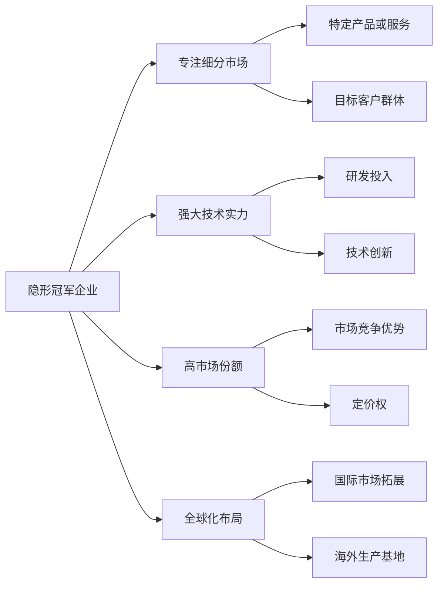

# 彼得林奇的"隐形冠军"发掘方法

> 关键词：彼得林奇、隐形冠军、发掘方法、投资策略、企业分析

> 摘要：本文围绕彼得林奇的“隐形冠军”发掘方法展开深入探讨。首先介绍了该方法的背景，包括目的、预期读者、文档结构和相关术语。接着阐述了“隐形冠军”的核心概念及联系，分析其核心算法原理并给出具体操作步骤，通过数学模型和公式进一步说明。在项目实战部分，提供代码实际案例及详细解释。还探讨了该方法的实际应用场景，推荐了相关的学习资源、开发工具框架和论文著作。最后总结了未来发展趋势与挑战，解答常见问题并提供扩展阅读和参考资料，旨在帮助投资者掌握发掘“隐形冠军”的有效方法，提升投资决策能力。

## 1. 背景介绍 
### 1.1 目的和范围
彼得林奇是投资界的传奇人物，他在投资生涯中取得了惊人的业绩。其“隐形冠军”发掘方法旨在帮助投资者寻找那些在细分市场中占据领先地位，但尚未被市场充分关注的企业。这些企业往往具有较高的成长性和投资价值。本文的目的是详细剖析彼得林奇的“隐形冠军”发掘方法，从理论到实践进行全面阐述，涵盖该方法的原理、操作步骤、实际应用等方面，为投资者提供一套系统的发掘“隐形冠军”的思路和方法。

### 1.2 预期读者
本文预期读者主要包括以下几类人群：一是普通投资者，希望通过学习彼得林奇的方法，提高自己的投资水平，发现具有潜力的投资标的；二是金融从业者，如基金经理、分析师等，可从本文中获取新的投资理念和分析方法，完善自己的投资策略；三是企业管理者，了解“隐形冠军”的特质和发掘方法，有助于企业在市场中找准定位，提升自身竞争力。

### 1.3 文档结构概述
本文将按照以下结构进行阐述：首先介绍核心概念与联系，明确“隐形冠军”的定义、特点以及与其他类型企业的区别；接着讲解核心算法原理和具体操作步骤，通过 Python 代码详细说明如何运用该方法进行企业筛选；然后给出数学模型和公式，并结合实际例子进行讲解；在项目实战部分，介绍开发环境搭建、源代码实现及代码解读；之后探讨该方法的实际应用场景；推荐相关的工具和资源，包括学习资源、开发工具框架和论文著作；最后总结未来发展趋势与挑战，解答常见问题并提供扩展阅读和参考资料。

### 1.4 术语表
#### 1.4.1 核心术语定义
- **隐形冠军**：指那些在某个细分市场中占据绝对领先地位，但由于市场相对狭窄或企业低调经营等原因，不为大众所熟知的企业。这些企业通常具有较强的技术实力、高市场份额和良好的盈利能力。
- **细分市场**：是指根据消费者需求、行为、特征等因素，将整个市场划分为若干个具有相似需求和特征的子市场。

#### 1.4.2 相关概念解释
- **利基市场**：与细分市场类似，是指被大企业所忽略的某些细小市场，企业可以通过专注于这些利基市场，获得竞争优势。
- **护城河**：是指企业所拥有的可持续竞争优势，如品牌、技术、成本、渠道等，能够抵御竞争对手的入侵，保护企业的利润和市场份额。

#### 1.4.3 缩略词列表
- **ROE**：Return on Equity，净资产收益率，衡量企业运用自有资本的效率。
- **EPS**：Earnings Per Share，每股收益，反映企业的盈利能力。

## 2. 核心概念与联系 
### 核心概念原理
“隐形冠军”企业通常具有以下几个核心特点：
1. **专注细分市场**：它们往往专注于某个特定的细分领域，将全部精力和资源投入其中，从而在该领域取得技术、产品和服务的领先地位。例如，德国的伍尔特集团，专注于紧固件和组装材料领域，是全球该领域的领导者。
2. **强大的技术实力**：通过持续的研发投入，不断提升产品的技术含量和质量，保持在行业内的技术领先优势。比如，一些半导体设备制造商，在芯片制造的特定环节拥有先进的技术和设备。
3. **高市场份额**：由于专注于细分市场，“隐形冠军”企业能够在该领域占据较高的市场份额，甚至处于垄断地位。这使得它们在定价、供应链等方面具有较强的话语权。
4. **全球化布局**：许多“隐形冠军”企业虽然规模相对较小，但具有全球化的视野和布局，通过在全球范围内开展业务，扩大市场份额和影响力。

### 架构的文本示意图
```plaintext
隐形冠军企业
|--专注细分市场
|   |--特定产品或服务
|   |--目标客户群体
|--强大技术实力
|   |--研发投入
|   |--技术创新
|--高市场份额
|   |--市场竞争优势
|   |--定价权
|--全球化布局
|   |--国际市场拓展
|   |--海外生产基地
```

### Mermaid 流程图


## 3. 核心算法原理 & 具体操作步骤 
### 核心算法原理
彼得林奇的“隐形冠军”发掘方法的核心算法原理是通过对企业的多个关键指标进行综合评估，筛选出具有“隐形冠军”特质的企业。这些关键指标包括但不限于以下几个方面：
1. **财务指标**：如 ROE、EPS、毛利率、净利率等，反映企业的盈利能力和运营效率。
2. **市场指标**：市场份额、行业排名等，体现企业在细分市场中的地位。
3. **研发指标**：研发投入占比、专利数量等，衡量企业的技术创新能力。

### 具体操作步骤
1. **确定细分市场**：首先需要对市场进行细分，找出那些具有发展潜力的细分领域。可以通过行业研究、市场调研等方式来确定。
2. **筛选企业**：在确定的细分市场中，筛选出符合一定条件的企业。可以使用财务数据库、行业报告等工具进行筛选。
3. **指标评估**：对筛选出的企业进行关键指标评估，计算各项指标的值，并与行业平均水平进行比较。
4. **综合分析**：根据指标评估结果，对企业进行综合分析，判断其是否具有“隐形冠军”的特质。

### Python 源代码实现
```python
import pandas as pd

# 假设我们有一个包含企业信息的 CSV 文件，文件名为 'companies.csv'
# 文件包含以下列：'company_name', 'roe', 'eps', 'gross_margin', 'net_margin', 'market_share', 'rd_ratio', 'patent_count'
data = pd.read_csv('companies.csv')

# 步骤 1: 确定细分市场（这里假设已经确定了细分市场，数据集中的企业都属于该细分市场）

# 步骤 2: 筛选企业
# 例如，筛选出 ROE 大于 15%，EPS 大于 1 的企业
filtered_data = data[(data['roe'] > 15) & (data['eps'] > 1)]

# 步骤 3: 指标评估
# 计算各项指标的行业平均水平
industry_avg_roe = data['roe'].mean()
industry_avg_eps = data['eps'].mean()
industry_avg_gross_margin = data['gross_margin'].mean()
industry_avg_net_margin = data['net_margin'].mean()
industry_avg_market_share = data['market_share'].mean()
industry_avg_rd_ratio = data['rd_ratio'].mean()
industry_avg_patent_count = data['patent_count'].mean()

# 比较企业指标与行业平均水平
filtered_data['roe_above_avg'] = filtered_data['roe'] > industry_avg_roe
filtered_data['eps_above_avg'] = filtered_data['eps'] > industry_avg_eps
filtered_data['gross_margin_above_avg'] = filtered_data['gross_margin'] > industry_avg_gross_margin
filtered_data['net_margin_above_avg'] = filtered_data['net_margin'] > industry_avg_net_margin
filtered_data['market_share_above_avg'] = filtered_data['market_share'] > industry_avg_market_share
filtered_data['rd_ratio_above_avg'] = filtered_data['rd_ratio'] > industry_avg_rd_ratio
filtered_data['patent_count_above_avg'] = filtered_data['patent_count'] > industry_avg_patent_count

# 步骤 4: 综合分析
# 计算企业指标高于行业平均水平的数量
filtered_data['above_avg_count'] = filtered_data[['roe_above_avg', 'eps_above_avg', 'gross_margin_above_avg',
                                                 'net_margin_above_avg', 'market_share_above_avg',
                                                 'rd_ratio_above_avg', 'patent_count_above_avg']].sum(axis=1)

# 筛选出指标高于行业平均水平数量较多的企业（这里假设选择高于 4 个指标的企业）
potential_champions = filtered_data[filtered_data['above_avg_count'] > 4]

print(potential_champions[['company_name', 'above_avg_count']])
```

## 4. 数学模型和公式 & 详细讲解 & 举例说明 
### 数学模型和公式
1. **净资产收益率（ROE）**
    - 公式：$ROE = \frac{净利润}{净资产} \times 100\%$
    - 讲解：ROE 反映了企业运用自有资本的效率，是衡量企业盈利能力的重要指标。ROE 越高，说明企业利用自有资本创造利润的能力越强。
    - 举例：假设企业 A 的净利润为 1000 万元，净资产为 5000 万元，则其 ROE 为 $\frac{1000}{5000} \times 100\% = 20\%$。

2. **每股收益（EPS）**
    - 公式：$EPS = \frac{净利润}{总股本}$
    - 讲解：EPS 反映了普通股股东每股所能享有的企业净利润，是评估企业盈利能力和股东回报的重要指标。
    - 举例：假设企业 B 的净利润为 2000 万元，总股本为 1000 万股，则其 EPS 为 $\frac{2000}{1000} = 2$ 元/股。

3. **毛利率**
    - 公式：$毛利率 = \frac{营业收入 - 营业成本}{营业收入} \times 100\%$
    - 讲解：毛利率反映了企业产品或服务的盈利能力，体现了企业在生产和销售过程中的成本控制能力。
    - 举例：假设企业 C 的营业收入为 5000 万元，营业成本为 3000 万元，则其毛利率为 $\frac{5000 - 3000}{5000} \times 100\% = 40\%$。

### 详细讲解
在发掘“隐形冠军”企业时，这些数学模型和公式可以帮助我们从不同角度评估企业的财务状况和经营能力。例如，ROE 可以反映企业的盈利能力和资本运作效率；EPS 可以让我们了解股东的回报情况；毛利率则可以体现企业产品或服务的竞争力。通过对这些指标的综合分析，我们可以筛选出具有潜力的“隐形冠军”企业。

### 举例说明
假设我们要分析两家企业 D 和 E，相关财务数据如下表所示：
| 企业 | 净利润（万元） | 净资产（万元） | 总股本（万股） | 营业收入（万元） | 营业成本（万元） |
| ---- | ---- | ---- | ---- | ---- | ---- |
| D | 1500 | 6000 | 800 | 4000 | 2500 |
| E | 1200 | 5000 | 700 | 3500 | 2000 |

计算各项指标：
- 企业 D 的 ROE：$\frac{1500}{6000} \times 100\% = 25\%$
- 企业 D 的 EPS：$\frac{1500}{800} = 1.875$ 元/股
- 企业 D 的毛利率：$\frac{4000 - 2500}{4000} \times 100\% = 37.5\%$

- 企业 E 的 ROE：$\frac{1200}{5000} \times 100\% = 24\%$
- 企业 E 的 EPS：$\frac{1200}{700} \approx 1.71$ 元/股
- 企业 E 的毛利率：$\frac{3500 - 2000}{3500} \times 100\% \approx 42.86\%$

从以上计算结果可以看出，企业 D 的 ROE 和 EPS 略高于企业 E，但企业 E 的毛利率更高。综合来看，两家企业都具有一定的盈利能力，但在不同方面表现有所差异。在实际发掘“隐形冠军”企业时，需要结合更多的指标和因素进行综合判断。

## 5. 项目实战：代码实际案例和详细解释说明 
### 5.1  开发环境搭建
#### 安装 Python
首先，需要安装 Python 环境。可以从 Python 官方网站（https://www.python.org/downloads/）下载适合自己操作系统的 Python 安装包，并按照安装向导进行安装。建议安装 Python 3.7 及以上版本。

#### 安装必要的库
在项目中，我们使用了 Pandas 库进行数据处理。可以使用以下命令安装 Pandas：
```sh
pip install pandas
```

#### 准备数据
准备一个包含企业信息的 CSV 文件，文件格式如下：
```plaintext
company_name,roe,eps,gross_margin,net_margin,market_share,rd_ratio,patent_count
Company A,20,2,40,20,30,5,10
Company B,18,1.5,35,18,25,4,8
...
```

### 5.2  源代码详细实现和代码解读
```python
import pandas as pd

# 读取 CSV 文件
data = pd.read_csv('companies.csv')

# 筛选企业
filtered_data = data[(data['roe'] > 15) & (data['eps'] > 1)]

# 计算行业平均水平
industry_avg_roe = data['roe'].mean()
industry_avg_eps = data['eps'].mean()
industry_avg_gross_margin = data['gross_margin'].mean()
industry_avg_net_margin = data['net_margin'].mean()
industry_avg_market_share = data['market_share'].mean()
industry_avg_rd_ratio = data['rd_ratio'].mean()
industry_avg_patent_count = data['patent_count'].mean()

# 比较企业指标与行业平均水平
filtered_data['roe_above_avg'] = filtered_data['roe'] > industry_avg_roe
filtered_data['eps_above_avg'] = filtered_data['eps'] > industry_avg_eps
filtered_data['gross_margin_above_avg'] = filtered_data['gross_margin'] > industry_avg_gross_margin
filtered_data['net_margin_above_avg'] = filtered_data['net_margin'] > industry_avg_net_margin
filtered_data['market_share_above_avg'] = filtered_data['market_share'] > industry_avg_market_share
filtered_data['rd_ratio_above_avg'] = filtered_data['rd_ratio'] > industry_avg_rd_ratio
filtered_data['patent_count_above_avg'] = filtered_data['patent_count'] > industry_avg_patent_count

# 计算企业指标高于行业平均水平的数量
filtered_data['above_avg_count'] = filtered_data[['roe_above_avg', 'eps_above_avg', 'gross_margin_above_avg',
                                                 'net_margin_above_avg', 'market_share_above_avg',
                                                 'rd_ratio_above_avg', 'patent_count_above_avg']].sum(axis=1)

# 筛选出指标高于行业平均水平数量较多的企业
potential_champions = filtered_data[filtered_data['above_avg_count'] > 4]

print(potential_champions[['company_name', 'above_avg_count']])
```

### 代码解读与分析
1. **导入库**：使用 `import pandas as pd` 导入 Pandas 库，用于数据处理和分析。
2. **读取数据**：使用 `pd.read_csv('companies.csv')` 读取包含企业信息的 CSV 文件。
3. **筛选企业**：使用条件筛选出 ROE 大于 15% 且 EPS 大于 1 的企业。
4. **计算行业平均水平**：使用 `mean()` 方法计算各项指标的行业平均水平。
5. **比较指标**：将筛选出的企业的各项指标与行业平均水平进行比较，判断是否高于行业平均水平。
6. **计算高于平均水平的指标数量**：使用 `sum()` 方法计算每个企业高于行业平均水平的指标数量。
7. **筛选潜在“隐形冠军”企业**：筛选出高于行业平均水平的指标数量大于 4 的企业，作为潜在的“隐形冠军”企业。
8. **输出结果**：打印出潜在“隐形冠军”企业的名称和高于行业平均水平的指标数量。

通过以上代码，我们可以从大量企业数据中筛选出具有“隐形冠军”特质的企业，为投资决策提供参考。

## 6. 实际应用场景 
### 投资领域
在投资领域，彼得林奇的“隐形冠军”发掘方法具有重要的应用价值。投资者可以运用该方法筛选出那些在细分市场中具有潜力的企业，进行投资布局。这些“隐形冠军”企业往往具有较高的成长性和投资回报率，能够为投资者带来丰厚的收益。例如，一些新兴行业中的细分领域，如新能源汽车的零部件供应商、人工智能的特定应用领域等，可能存在许多尚未被市场充分发掘的“隐形冠军”企业。

### 企业战略规划
对于企业来说，了解“隐形冠军”的特质和发掘方法，有助于企业制定战略规划。企业可以通过专注于某个细分市场，打造自己的核心竞争力，成为该领域的“隐形冠军”。例如，一些中小企业可以避开与大企业的正面竞争，选择在细分市场中深耕细作，通过技术创新和产品优化，提高市场份额和盈利能力。

### 行业研究
在行业研究中，“隐形冠军”发掘方法可以帮助研究人员发现行业中的潜在领导者。通过对细分市场的深入分析和企业的评估，研究人员可以了解行业的发展趋势和竞争格局，为行业发展提供有价值的建议。例如，在半导体行业中，研究人员可以通过发掘“隐形冠军”企业，了解该行业在特定技术领域的发展情况和竞争态势。

## 7. 工具和资源推荐
### 7.1 学习资源推荐
#### 7.1.1 书籍推荐
- 《彼得林奇的成功投资》：彼得林奇的经典著作，详细介绍了他的投资理念和方法，包括如何发掘“隐形冠军”企业。
- 《隐形冠军：未来全球化的先锋》：赫尔曼·西蒙的著作，深入研究了全球“隐形冠军”企业的特点和发展模式。
- 《财务报表分析与证券定价》：帮助读者掌握财务报表分析的方法和技巧，以便更好地评估企业的财务状况和投资价值。

#### 7.1.2 在线课程
- Coursera 上的“投资学原理”：系统介绍了投资学的基本原理和方法，包括股票投资、债券投资等。
- 网易云课堂上的“财务分析实战课程”：通过实际案例讲解财务分析的方法和技巧，提高学员的财务分析能力。

#### 7.1.3 技术博客和网站
- 雪球网：提供丰富的股票投资资讯和分析，投资者可以在上面交流投资经验和分享研究成果。
- 东方财富网：提供全面的金融信息和数据，包括股票行情、财务报表、行业研究等。

### 7.2 开发工具框架推荐
#### 7.2.1 IDE和编辑器
- PyCharm：一款专业的 Python 集成开发环境，具有强大的代码编辑、调试和项目管理功能。
- Jupyter Notebook：一种交互式的开发环境，适合进行数据分析和可视化，方便代码的编写和分享。

#### 7.2.2 调试和性能分析工具
- PDB：Python 自带的调试工具，可以帮助开发者定位代码中的问题。
- cProfile：Python 的性能分析工具，可以分析代码的运行时间和资源消耗情况。

#### 7.2.3 相关框架和库
- Pandas：用于数据处理和分析的 Python 库，提供了丰富的数据结构和数据操作方法。
- NumPy：用于科学计算的 Python 库，提供了高效的数组操作和数学函数。

### 7.3 相关论文著作推荐
#### 7.3.1 经典论文
- 《Competitive Strategy: Techniques for Analyzing Industries and Competitors》：迈克尔·波特的经典论文，介绍了企业竞争战略的分析方法和工具。
- 《The Theory of Industrial Organization》：产业组织理论的经典著作，对企业的市场行为和产业结构进行了深入研究。

#### 7.3.2 最新研究成果
- 一些学术期刊如《Journal of Financial Economics》《The Review of Financial Studies》等，会发表关于投资和企业分析的最新研究成果。

#### 7.3.3 应用案例分析
- 一些商业杂志如《哈佛商业评论》《福布斯》等，会刊登“隐形冠军”企业的应用案例分析，为读者提供实际的参考和借鉴。

## 8. 总结：未来发展趋势与挑战
### 未来发展趋势
1. **数字化转型加速**：随着信息技术的快速发展，“隐形冠军”企业将加速数字化转型，通过大数据、人工智能等技术提升企业的运营效率和创新能力。例如，一些制造业的“隐形冠军”企业将利用工业互联网实现生产过程的智能化管理。
2. **全球化竞争加剧**：“隐形冠军”企业将面临更加激烈的全球化竞争。随着贸易自由化和跨国投资的增加，企业需要不断提升自身的竞争力，拓展国际市场。
3. **绿色发展成为趋势**：在全球环保意识不断提高的背景下，“隐形冠军”企业将更加注重绿色发展，推出环保型产品和服务，实现可持续发展。

### 挑战
1. **技术创新压力**：为了保持在细分市场的领先地位，“隐形冠军”企业需要不断进行技术创新。然而，技术创新需要大量的资金和人力投入，对于一些中小企业来说，面临着较大的压力。
2. **人才短缺**：随着企业的发展，对高素质人才的需求越来越大。“隐形冠军”企业在吸引和留住人才方面可能面临一定的挑战，特别是在一些新兴技术领域。
3. **市场波动风险**：“隐形冠军”企业通常专注于某个细分市场，市场波动对其影响较大。例如，宏观经济环境的变化、行业政策的调整等，都可能对企业的经营业绩产生不利影响。

## 9. 附录：常见问题与解答
### 问题 1：如何确定细分市场？
答：可以通过以下几种方式确定细分市场：一是进行行业研究，了解行业的发展趋势和市场结构；二是进行市场调研，分析消费者的需求和行为；三是关注新兴技术和趋势，寻找潜在的细分市场机会。

### 问题 2：“隐形冠军”企业一定具有投资价值吗？
答：虽然“隐形冠军”企业通常具有较高的成长性和竞争力，但并不意味着一定具有投资价值。在进行投资决策时，还需要考虑企业的估值、财务状况、行业前景等因素。

### 问题 3：如何获取企业的财务数据？
答：可以通过以下途径获取企业的财务数据：一是企业的官方网站，通常会公布企业的财务报表；二是金融数据提供商，如东方财富、同花顺等；三是证券交易所的官方网站，会披露上市公司的财务信息。

### 问题 4：“隐形冠军”企业与大企业有什么区别？
答：“隐形冠军”企业通常规模相对较小，专注于某个细分市场；而大企业业务多元化，市场覆盖面广。“隐形冠军”企业在细分市场中具有较强的竞争力，但在品牌知名度和资源整合能力方面可能不如大企业。

## 10. 扩展阅读 & 参考资料
### 扩展阅读
- 《创新者的窘境》：探讨了企业在面对技术创新和市场变革时的困境和应对策略。
- 《从 0 到 1：开启商业与未来的秘密》：介绍了创业公司如何从无到有，创造独特的价值。

### 参考资料
- 彼得林奇的官方网站和相关访谈资料。
- 赫尔曼·西蒙的研究报告和论文。
- 相关金融数据库和行业研究报告。