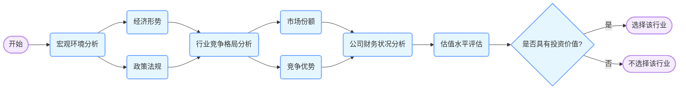

# 彼得林奇的行业选择标准

> 关键词：彼得林奇、行业选择标准、投资策略、股票投资、行业分析、成长型行业、周期型行业

> 摘要：本文深入探讨了彼得林奇的行业选择标准。彼得林奇作为投资界的传奇人物，其独特的行业选择理念和方法对投资者有着极高的借鉴价值。文章从背景介绍出发，阐述了研究彼得林奇行业选择标准的目的、范围、预期读者等内容。接着详细剖析了核心概念，包括彼得林奇所关注的不同行业类型及其特点，并通过流程图展示其行业分析的逻辑。在核心算法原理部分，虽投资并非严格意义算法，但以 Python 代码模拟其行业分析思路。还介绍了相关数学模型和公式，帮助理解投资中的估值等概念。通过项目实战，以实际案例呈现如何运用其标准进行行业选择。同时探讨了该标准在不同场景下的应用，推荐了相关学习资源、开发工具框架以及论文著作。最后总结了未来投资行业选择的发展趋势与挑战，并对常见问题进行解答，提供扩展阅读和参考资料，旨在帮助投资者更好地掌握和运用彼得林奇的行业选择标准。

## 1. 背景介绍 
### 1.1 目的和范围
彼得林奇在投资领域取得了辉煌成就，他的投资理念和行业选择标准一直备受关注。本文章的目的在于深入剖析彼得林奇的行业选择标准，让投资者能够更好地理解和运用这些标准来指导自己的投资决策。研究范围涵盖了彼得林奇对不同行业的分析方法、判断标准，以及这些标准在实际投资中的应用。

### 1.2 预期读者
本文预期读者主要包括对股票投资感兴趣的个人投资者、金融专业的学生和研究人员、从事投资行业的专业人士等。无论是新手投资者希望学习基本的行业分析方法，还是专业人士想要深入研究投资大师的理念，都能从本文中获得有价值的信息。

### 1.3 文档结构概述
本文首先介绍背景信息，让读者了解研究的目的和范围。接着阐述核心概念，包括彼得林奇所关注的不同行业类型及其特点。然后讲解核心算法原理和具体操作步骤，以 Python 代码模拟其行业分析思路。再介绍相关数学模型和公式，帮助理解投资中的关键概念。通过项目实战，以实际案例展示如何运用其标准进行行业选择。探讨实际应用场景，推荐相关学习资源、开发工具框架以及论文著作。最后总结未来发展趋势与挑战，解答常见问题，并提供扩展阅读和参考资料。

### 1.4 术语表
#### 1.4.1 核心术语定义
- **成长型行业**：指那些发展速度快于整个经济增长速度的行业，通常具有创新能力强、市场需求增长迅速等特点。
- **周期型行业**：行业的发展与经济周期密切相关，在经济繁荣时表现良好，在经济衰退时业绩下滑。
- **稳定型行业**：受经济周期影响较小，业绩相对稳定，通常提供生活必需品或服务。
- **困境反转型行业**：处于困境中的行业，可能由于经营不善、行业竞争等原因导致业绩不佳，但存在反转的可能性。

#### 1.4.2 相关概念解释
- **市盈率（P/E）**：股票价格与每股收益的比率，用于衡量股票的估值水平。较高的市盈率可能表示市场对该股票的预期较高，但也可能存在高估风险。
- **市净率（P/B）**：股票价格与每股净资产的比率，反映了股票的账面价值与市场价格的关系。
- **股息率**：股息与股票价格的比率，是投资者获得的现金收益与投资成本的比例。

#### 1.4.3 缩略词列表
- **P/E**：市盈率（Price-to-Earnings Ratio）
- **P/B**：市净率（Price-to-Book Ratio）

## 2. 核心概念与联系 
彼得林奇在进行行业选择时，主要关注以下几种行业类型：
- **成长型行业**：这类行业通常处于快速发展阶段，具有较高的增长潜力。例如科技行业中的互联网、人工智能等领域，随着技术的不断进步和市场需求的增长，相关企业的业绩可能会实现快速增长。
- **周期型行业**：与经济周期紧密相关，如汽车、钢铁等行业。在经济繁荣时期，消费者对汽车的需求增加，汽车企业的业绩也会随之提升；而在经济衰退时，需求下降，企业业绩下滑。
- **稳定型行业**：受经济周期影响较小，业绩相对稳定。像食品、饮料等行业，人们对这些产品的需求相对稳定，不会因为经济的波动而有太大变化。
- **困境反转型行业**：处于困境中的行业，如果能够成功实现反转，投资者可能会获得巨大的收益。例如一些传统制造业企业，通过技术创新、管理变革等方式实现业绩的改善。

### 核心概念原理和架构的文本示意图
彼得林奇的行业选择标准是一个综合的体系，他会根据不同行业的特点，运用多种分析方法来评估行业的投资价值。首先，他会对行业的宏观环境进行分析，包括经济形势、政策法规等因素。然后，深入研究行业的竞争格局，了解行业内企业的市场份额、竞争优势等。最后，结合公司的财务状况、估值水平等因素，判断该行业是否具有投资价值。

### Mermaid 流程图


## 3. 核心算法原理 & 具体操作步骤 
虽然投资行业选择并非严格意义上的算法，但我们可以用 Python 代码模拟彼得林奇的行业分析思路。以下是一个简单的示例，用于评估不同行业的投资价值：

```python
# 定义行业类
class Industry:
    def __init__(self, name, growth_rate, cycle_sensitivity, stability, turnaround_potential):
        self.name = name
        self.growth_rate = growth_rate
        self.cycle_sensitivity = cycle_sensitivity
        self.stability = stability
        self.turnaround_potential = turnaround_potential

    def evaluate(self):
        # 简单的评估函数，根据不同因素加权计算得分
        score = (self.growth_rate * 0.3 + 
                 (1 - self.cycle_sensitivity) * 0.2 + 
                 self.stability * 0.2 + 
                 self.turnaround_potential * 0.3)
        return score

# 定义一些行业示例
growth_industry = Industry("科技行业", 0.8, 0.6, 0.4, 0.3)
cycle_industry = Industry("汽车行业", 0.5, 0.8, 0.3, 0.2)
stable_industry = Industry("食品行业", 0.3, 0.2, 0.8, 0.1)
turnaround_industry = Industry("传统制造业", 0.2, 0.7, 0.3, 0.6)

# 评估每个行业的得分
industries = [growth_industry, cycle_industry, stable_industry, turnaround_industry]
for industry in industries:
    score = industry.evaluate()
    print(f"{industry.name} 的投资价值得分: {score}")
```

### 具体操作步骤
1. **数据收集**：收集不同行业的相关数据，包括增长率、对经济周期的敏感度、稳定性和反转潜力等。
2. **定义评估函数**：根据彼得林奇的行业选择标准，定义一个评估函数，对每个行业进行综合评估。
3. **计算得分**：将收集到的数据代入评估函数，计算每个行业的投资价值得分。
4. **选择行业**：根据得分高低，选择投资价值较高的行业。

## 4. 数学模型和公式 & 详细讲解 & 举例说明 
### 市盈率（P/E）模型
市盈率是衡量股票估值的常用指标，其计算公式为：
$$P/E = \frac{股票价格}{每股收益}$$

#### 详细讲解
市盈率反映了投资者为获取每单位收益所愿意支付的价格。较高的市盈率可能表示市场对该股票的预期较高，但也可能存在高估风险；较低的市盈率可能表示股票被低估，但也可能反映出公司的业绩不佳。

#### 举例说明
假设某公司的股票价格为 50 元，每股收益为 5 元，则该股票的市盈率为：
$$P/E = \frac{50}{5} = 10$$
这意味着投资者为获取该公司每 1 元的收益，愿意支付 10 元的价格。

### 市净率（P/B）模型
市净率的计算公式为：
$$P/B = \frac{股票价格}{每股净资产}$$

#### 详细讲解
市净率反映了股票的账面价值与市场价格的关系。较低的市净率可能表示股票被低估，具有一定的投资价值；较高的市净率可能表示市场对该股票的预期较高，但也可能存在泡沫。

#### 举例说明
假设某公司的股票价格为 30 元，每股净资产为 10 元，则该股票的市净率为：
$$P/B = \frac{30}{10} = 3$$
这表示该股票的市场价格是其账面价值的 3 倍。

### 股息率模型
股息率的计算公式为：
$$股息率 = \frac{每股股息}{股票价格} \times 100\%$$

#### 详细讲解
股息率反映了投资者获得的现金收益与投资成本的比例。较高的股息率可能表示该股票具有较好的投资回报，但也需要考虑公司的盈利能力和股息政策的稳定性。

#### 举例说明
假设某公司的股票价格为 40 元，每股股息为 2 元，则该股票的股息率为：
$$股息率 = \frac{2}{40} \times 100\% = 5\%$$
这意味着投资者每年可以获得 5%的现金收益。

## 5. 项目实战：代码实际案例和详细解释说明 
### 5.1  开发环境搭建
- **Python 安装**：确保你的系统中安装了 Python 3.x 版本。可以从 Python 官方网站（https://www.python.org/downloads/） 下载并安装。
- **开发工具**：推荐使用 PyCharm 或 Jupyter Notebook 作为开发工具。PyCharm 是一款功能强大的 Python 集成开发环境，提供了丰富的代码编辑、调试等功能；Jupyter Notebook 则适合进行交互式编程和数据分析。

### 5.2  源代码详细实现和代码解读
以下是一个更完整的 Python 代码示例，用于模拟彼得林奇的行业选择过程：

```python
import pandas as pd

# 定义行业类
class Industry:
    def __init__(self, name, growth_rate, cycle_sensitivity, stability, turnaround_potential, pe_ratio, pb_ratio, dividend_yield):
        self.name = name
        self.growth_rate = growth_rate
        self.cycle_sensitivity = cycle_sensitivity
        self.stability = stability
        self.turnaround_potential = turnaround_potential
        self.pe_ratio = pe_ratio
        self.pb_ratio = pb_ratio
        self.dividend_yield = dividend_yield

    def evaluate(self):
        # 综合评估函数，根据不同因素加权计算得分
        score = (self.growth_rate * 0.3 + 
                 (1 - self.cycle_sensitivity) * 0.2 + 
                 self.stability * 0.2 + 
                 self.turnaround_potential * 0.3)
        
        # 考虑估值因素
        if self.pe_ratio < 15:
            score += 0.1
        if self.pb_ratio < 2:
            score += 0.1
        if self.dividend_yield > 0.03:
            score += 0.1
        
        return score

# 定义一些行业示例
industry_data = [
    ["科技行业", 0.8, 0.6, 0.4, 0.3, 20, 3, 0.02],
    ["汽车行业", 0.5, 0.8, 0.3, 0.2, 12, 1.5, 0.04],
    ["食品行业", 0.3, 0.2, 0.8, 0.1, 18, 2.5, 0.03],
    ["传统制造业", 0.2, 0.7, 0.3, 0.6, 10, 1.2, 0.05]
]

# 创建 DataFrame 存储行业数据
df = pd.DataFrame(industry_data, columns=["name", "growth_rate", "cycle_sensitivity", "stability", "turnaround_potential", "pe_ratio", "pb_ratio", "dividend_yield"])

# 计算每个行业的得分
scores = []
for index, row in df.iterrows():
    industry = Industry(row["name"], row["growth_rate"], row["cycle_sensitivity"], row["stability"], row["turnaround_potential"], row["pe_ratio"], row["pb_ratio"], row["dividend_yield"])
    score = industry.evaluate()
    scores.append(score)

# 将得分添加到 DataFrame 中
df["score"] = scores

# 按照得分排序
df = df.sort_values(by="score", ascending=False)

# 输出结果
print(df)
```

### 5.3  代码解读与分析
1. **行业类定义**：`Industry` 类用于表示一个行业，包含行业的基本信息和评估方法。
2. **数据准备**：使用 `pandas` 库创建一个 DataFrame 来存储行业数据，包括增长率、对经济周期的敏感度、稳定性、反转潜力、市盈率、市净率和股息率等。
3. **评估得分计算**：遍历 DataFrame 中的每一行，创建 `Industry` 对象并调用 `evaluate` 方法计算得分。
4. **得分排序**：将计算得到的得分添加到 DataFrame 中，并按照得分从高到低进行排序。
5. **结果输出**：打印排序后的 DataFrame，显示每个行业的得分情况。

通过这个代码示例，我们可以模拟彼得林奇的行业选择过程，根据不同行业的特点和估值水平，评估其投资价值。

## 6. 实际应用场景 
### 个人投资者
对于个人投资者来说，彼得林奇的行业选择标准可以帮助他们在众多行业中筛选出具有投资价值的行业。例如，在经济增长较快的时期，个人投资者可以关注成长型行业，如科技、医疗等，以获取较高的投资回报；而在经济不稳定时期，可以选择稳定型行业，如食品、公用事业等，以降低投资风险。

### 机构投资者
机构投资者通常管理着大量的资金，需要进行多元化的投资。彼得林奇的行业选择标准可以为机构投资者提供一个系统的行业分析框架，帮助他们合理配置资产。例如，机构投资者可以同时投资于成长型、周期型、稳定型和困境反转型行业，以实现风险分散和收益最大化。

### 行业研究人员
行业研究人员可以运用彼得林奇的行业选择标准来深入研究不同行业的发展趋势和投资价值。通过对行业的宏观环境、竞争格局、公司财务状况等方面的分析，行业研究人员可以为投资者提供专业的投资建议和研究报告。

## 7. 工具和资源推荐
### 7.1 学习资源推荐
#### 7.1.1 书籍推荐
- 《彼得林奇的成功投资》：彼得林奇的经典著作，详细介绍了他的投资理念和方法，包括行业选择标准、公司分析等内容。
- 《战胜华尔街》：进一步阐述了彼得林奇的投资策略，通过实际案例展示了他如何在不同市场环境下进行投资决策。
- 《聪明的投资者》：本杰明·格雷厄姆的经典著作，对价值投资理论进行了深入探讨，对理解彼得林奇的投资理念有很大帮助。

#### 7.1.2 在线课程
- Coursera 上的“投资学原理”：该课程由知名大学的教授授课，系统介绍了投资学的基本原理和方法，包括行业分析、股票估值等内容。
- edX 上的“金融市场”：提供了关于金融市场的全面知识，包括不同行业的特点、投资策略等，有助于深入理解彼得林奇的行业选择标准。

#### 7.1.3 技术博客和网站
- 雪球网：国内知名的投资社区，提供了丰富的行业分析、公司研究等内容，投资者可以在这里交流投资经验和分享观点。
- Seeking Alpha：国外的投资研究网站，提供了大量的行业分析报告和投资建议，对了解国际市场的行业动态有很大帮助。

### 7.2 开发工具框架推荐
#### 7.2.1 IDE和编辑器
- PyCharm：功能强大的 Python 集成开发环境，提供了丰富的代码编辑、调试等功能，适合进行 Python 编程和数据分析。
- Jupyter Notebook：交互式编程环境，适合进行数据探索和可视化，方便快速验证投资分析思路。

#### 7.2.2 调试和性能分析工具
- PDB：Python 自带的调试工具，可以帮助开发者定位代码中的问题。
- cProfile：Python 的性能分析工具，用于分析代码的运行时间和资源消耗情况。

#### 7.2.3 相关框架和库
- Pandas：用于数据处理和分析的 Python 库，提供了强大的数据结构和数据操作功能，方便处理行业数据。
- NumPy：用于科学计算的 Python 库，提供了高效的数组操作和数学函数，在投资分析中经常用于计算统计指标。
- Matplotlib：用于数据可视化的 Python 库，可以绘制各种图表，直观展示行业数据和分析结果。

### 7.3 相关论文著作推荐
#### 7.3.1 经典论文
- Fama, E. F., & French, K. R. (1992). The cross-section of expected stock returns. Journal of Finance, 47(2), 427-465. 该论文提出了著名的 Fama-French 三因子模型，对股票收益率的影响因素进行了深入研究，对理解行业选择和股票投资有重要意义。
- Sharpe, W. F. (1964). Capital asset prices: A theory of market equilibrium under conditions of risk. The Journal of Finance, 19(3), 425-442. 该论文提出了资本资产定价模型（CAPM），为投资组合理论和资产定价提供了重要的理论基础。

#### 7.3.2 最新研究成果
- 关注《Journal of Financial Economics》、《Review of Financial Studies》等顶级金融学术期刊，及时了解投资领域的最新研究成果和行业动态。

#### 7.3.3 应用案例分析
- 可以参考一些投资机构的研究报告和案例分析，了解他们如何运用行业分析方法进行投资决策，以及在实际应用中遇到的问题和解决方案。

## 8. 总结：未来发展趋势与挑战
### 未来发展趋势
- **科技驱动的行业变革**：随着科技的不断进步，新兴行业如人工智能、大数据、区块链等将继续快速发展，成为未来投资的热点。彼得林奇的行业选择标准需要不断适应这些新兴行业的特点，关注技术创新和市场需求的变化。
- **可持续投资的兴起**：越来越多的投资者开始关注企业的社会责任和可持续发展，可持续投资将成为未来的发展趋势。在行业选择中，需要考虑行业的环境、社会和治理（ESG）因素，选择具有可持续发展潜力的行业。
- **全球化投资的加强**：随着全球经济的一体化，投资者可以更加方便地进行全球化投资。在选择行业时，需要考虑全球市场的动态和不同国家的政策环境，把握全球经济发展的机遇。

### 挑战
- **信息过载**：在信息爆炸的时代，投资者面临着大量的信息，如何从海量信息中筛选出有价值的信息，运用彼得林奇的行业选择标准进行准确的分析和判断，是一个挑战。
- **市场不确定性增加**：全球政治、经济环境的不确定性增加，如贸易摩擦、地缘政治冲突等，会对不同行业产生不同程度的影响。投资者需要更加灵活地运用行业选择标准，应对市场的变化。
- **新兴行业的估值难题**：新兴行业的发展具有较大的不确定性，其估值方法与传统行业有所不同。如何准确评估新兴行业的投资价值，是投资者面临的一个难题。

## 9. 附录：常见问题与解答
### 问题 1：彼得林奇的行业选择标准适用于所有市场吗？
解答：彼得林奇的行业选择标准是基于他多年的投资经验总结出来的，具有一定的普遍性。但不同市场的特点和环境有所不同，在应用这些标准时，需要结合当地市场的实际情况进行调整和分析。

### 问题 2：如何判断一个行业是成长型行业还是周期型行业？
解答：可以从行业的发展趋势、市场需求、与经济周期的相关性等方面进行判断。成长型行业通常具有较高的增长率和创新能力，市场需求不断扩大；而周期型行业的发展与经济周期密切相关，业绩会随着经济的波动而变化。

### 问题 3：在进行行业选择时，应该更注重行业的当前表现还是未来潜力？
解答：两者都需要考虑。行业的当前表现可以反映其目前的竞争力和盈利能力，但未来潜力更为重要。投资者应该关注行业的发展趋势、技术创新、政策支持等因素，选择具有长期增长潜力的行业。

### 问题 4：如何运用彼得林奇的行业选择标准进行投资组合的构建？
解答：可以根据不同行业的特点和投资价值，将资金分散投资于成长型、周期型、稳定型和困境反转型行业，以实现风险分散和收益最大化。同时，需要根据市场的变化和行业的发展情况，及时调整投资组合。

## 10. 扩展阅读 & 参考资料
### 扩展阅读
- 《金融炼金术》：乔治·索罗斯的著作，探讨了金融市场的运行规律和投资策略，对理解市场的复杂性和不确定性有很大帮助。
- 《黑天鹅》：纳西姆·尼古拉斯·塔勒布的著作，介绍了不可预测的重大事件对金融市场和投资的影响，提醒投资者要关注极端事件的风险。

### 参考资料
- 彼得林奇的官方网站和相关访谈资料。
- 各大金融媒体和财经网站的行业分析报告和投资研究文章。
- 相关的金融学术期刊和研究论文。