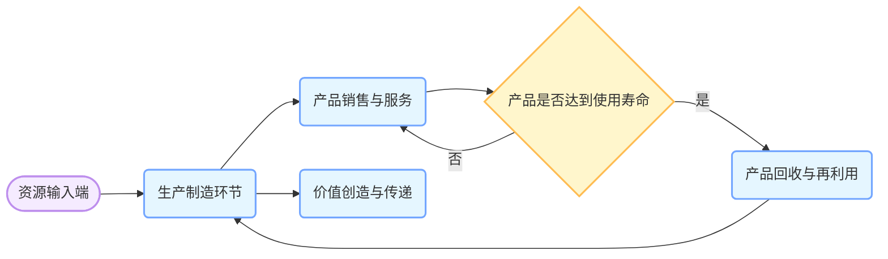

# 循环经济商业模式的规模化挑战与机遇

> 关键词：循环经济、商业模式、规模化、挑战、机遇、可持续发展、资源再利用

> 摘要：本文深入探讨了循环经济商业模式在规模化过程中面临的挑战与蕴含的机遇。首先介绍了循环经济商业模式的背景，包括其目的、预期读者等内容。接着阐述了循环经济商业模式的核心概念与联系，通过原理和架构的文本示意图以及 Mermaid 流程图进行清晰呈现。然后详细讲解了相关核心算法原理和具体操作步骤，并结合数学模型和公式进行分析。通过项目实战案例，展示了循环经济商业模式的实际应用和代码实现。分析了循环经济商业模式的实际应用场景，推荐了相关的工具和资源。最后总结了其未来发展趋势与挑战，还提供了常见问题与解答以及扩展阅读和参考资料，旨在为循环经济商业模式的规模化发展提供全面的技术和理论支持。

## 1. 背景介绍 
### 1.1 目的和范围
循环经济商业模式旨在通过资源的高效利用和循环利用，实现经济活动与生态环境的和谐共生。其范围涵盖了从原材料的采购、生产制造、产品销售到产品回收再利用的整个生命周期。本研究的目的在于深入分析循环经济商业模式在规模化过程中所面临的各种挑战，并挖掘其中潜藏的机遇，为企业和相关政策制定者提供理论和实践指导，促进循环经济的广泛推广和可持续发展。

### 1.2 预期读者
本文的预期读者包括从事循环经济研究的学者、企业管理人员、政策制定者、环保从业者以及对可持续发展感兴趣的各界人士。对于学者而言，本文可为其研究提供新的思路和方向；企业管理人员可以从中获取关于循环经济商业模式规模化的实践经验和策略建议；政策制定者能够依据本文的分析制定更加科学合理的政策；环保从业者可借鉴相关内容推动环保项目的实施；而对可持续发展感兴趣的人士则能通过本文深入了解循环经济商业模式的重要性和发展前景。

### 1.3 文档结构概述
本文首先介绍循环经济商业模式的背景信息，包括目的、预期读者和文档结构概述等内容。接着阐述核心概念与联系，通过文本示意图和 Mermaid 流程图清晰展示其原理和架构。然后详细讲解核心算法原理和具体操作步骤，结合 Python 源代码进行说明。再通过数学模型和公式对循环经济商业模式进行深入分析，并举例说明。之后通过项目实战案例，介绍开发环境搭建、源代码实现和代码解读。分析实际应用场景，推荐相关的工具和资源。最后总结未来发展趋势与挑战，提供常见问题与解答以及扩展阅读和参考资料。

### 1.4 术语表
#### 1.4.1 核心术语定义
- **循环经济**：是一种以资源的高效利用和循环利用为核心，以“减量化、再利用、资源化”为原则，以低消耗、低排放、高效率为基本特征，符合可持续发展理念的经济增长模式。
- **商业模式**：是企业为了创造价值、传递价值和获取价值而建立的一种逻辑架构和运营方式。
- **规模化**：指企业或项目在规模上不断扩大，包括生产规模、市场规模、业务范围等方面的扩张。

#### 1.4.2 相关概念解释
- **资源再利用**：是指将生产和消费过程中产生的废弃物通过一定的技术手段进行处理，使其重新成为可利用的资源。
- **闭环供应链**：是一种将产品的正向供应链和逆向供应链有机结合的供应链模式，旨在实现资源的循环利用和价值的最大化。
- **可持续发展**：是指既满足当代人的需求，又不损害后代人满足其需求的能力的发展。

#### 1.4.3 缩略词列表
- **CE**：Circular Economy（循环经济）
- **BM**：Business Model（商业模式）

## 2. 核心概念与联系 
### 2.1 循环经济商业模式的核心概念原理
循环经济商业模式的核心原理在于打破传统线性经济“资源 - 产品 - 废弃物”的模式，构建“资源 - 产品 - 再生资源”的闭环系统。在这个系统中，企业通过优化产品设计、改进生产工艺、建立回收渠道等方式，实现资源的高效利用和循环利用。例如，企业可以设计易于拆解和回收的产品，采用可回收材料进行生产，建立产品回收网络，将回收的产品进行再加工和再利用，从而减少对自然资源的依赖，降低废弃物的排放。

### 2.2 架构的文本示意图
循环经济商业模式的架构主要包括以下几个部分：
1. **资源输入端**：包括原材料的采购、资源的回收等，确保资源的可持续供应。
2. **生产制造环节**：采用绿色生产技术和工艺，提高资源利用效率，减少废弃物的产生。
3. **产品销售与服务**：向消费者提供环保、可持续的产品和服务，引导消费者形成绿色消费观念。
4. **产品回收与再利用**：建立产品回收渠道，对回收的产品进行分类、拆解和再加工，使其重新进入生产环节。
5. **价值创造与传递**：通过循环经济商业模式的运营，实现企业价值的创造和传递，同时为社会和环境带来效益。

### 2.3 Mermaid 流程图


这个流程图展示了循环经济商业模式的闭环流程。从资源输入端开始，经过生产制造、产品销售与服务，当产品达到使用寿命后进行回收与再利用，再回到生产制造环节，形成一个闭环。在这个过程中，不断实现价值的创造和传递。

## 3. 核心算法原理 & 具体操作步骤 
### 3.1 核心算法原理
在循环经济商业模式中，一个重要的算法是资源分配优化算法。其目的是在满足生产需求的前提下，最大限度地利用回收资源，减少对新资源的依赖。以下是一个简单的资源分配优化算法的 Python 实现：

```python
# 定义资源分配优化函数
def resource_allocation_optimization(new_resources, recycled_resources, production_demand):
    # 首先使用回收资源满足生产需求
    if recycled_resources >= production_demand:
        used_recycled_resources = production_demand
        used_new_resources = 0
    else:
        used_recycled_resources = recycled_resources
        used_new_resources = production_demand - recycled_resources
    
    # 计算剩余资源
    remaining_recycled_resources = recycled_resources - used_recycled_resources
    remaining_new_resources = new_resources - used_new_resources
    
    return used_new_resources, used_recycled_resources, remaining_new_resources, remaining_recycled_resources

# 示例数据
new_resources = 100
recycled_resources = 50
production_demand = 80

# 调用资源分配优化函数
used_new, used_recycled, remaining_new, remaining_recycled = resource_allocation_optimization(new_resources, recycled_resources, production_demand)

print(f"使用的新资源: {used_new}")
print(f"使用的回收资源: {used_recycled}")
print(f"剩余的新资源: {remaining_new}")
print(f"剩余的回收资源: {remaining_recycled}")
```

### 3.2 具体操作步骤
1. **数据收集**：收集新资源的数量、回收资源的数量以及生产需求的信息。
2. **算法调用**：将收集到的数据作为参数传递给资源分配优化函数。
3. **结果分析**：根据函数的返回结果，分析使用的新资源和回收资源的数量，以及剩余资源的数量。
4. **决策制定**：根据分析结果，制定下一步的资源采购和生产计划。例如，如果回收资源剩余较多，可以考虑增加对可回收产品的设计和生产；如果新资源使用较多，可以探索更多的资源回收渠道。

## 4. 数学模型和公式 & 详细讲解 & 举例说明 
### 4.1 数学模型
设 $N$ 表示新资源的数量，$R$ 表示回收资源的数量，$D$ 表示生产需求。使用的新资源数量为 $U_N$，使用的回收资源数量为 $U_R$，剩余的新资源数量为 $S_N$，剩余的回收资源数量为 $S_R$。

### 4.2 数学公式
根据资源分配优化算法的原理，可以得到以下公式：

当 $R \geq D$ 时：
$$
\begin{cases}
U_R = D \\
U_N = 0 \\
S_R = R - U_R \\
S_N = N
\end{cases}
$$

当 $R < D$ 时：
$$
\begin{cases}
U_R = R \\
U_N = D - U_R \\
S_R = 0 \\
S_N = N - U_N
\end{cases}
$$

### 4.3 详细讲解
这些公式的含义是，首先尝试使用回收资源满足生产需求。如果回收资源足够，则全部使用回收资源，不使用新资源；如果回收资源不足，则先使用全部回收资源，再用新资源补充剩余的需求。最后计算剩余的新资源和回收资源数量。

### 4.4 举例说明
假设新资源数量 $N = 100$，回收资源数量 $R = 30$，生产需求 $D = 50$。

由于 $R < D$，根据公式可得：
$U_R = R = 30$
$U_N = D - U_R = 50 - 30 = 20$
$S_R = 0$
$S_N = N - U_N = 100 - 20 = 80$

即使用了 20 单位的新资源和 30 单位的回收资源，剩余 80 单位的新资源，没有剩余的回收资源。

## 5. 项目实战：代码实际案例和详细解释说明 
### 5.1  开发环境搭建
在进行循环经济商业模式的项目实战时，我们可以使用 Python 语言进行开发。以下是开发环境搭建的步骤：
1. **安装 Python**：从 Python 官方网站（https://www.python.org/downloads/）下载并安装适合你操作系统的 Python 版本。建议安装 Python 3.7 及以上版本。
2. **安装开发工具**：可以选择使用 PyCharm、Visual Studio Code 等集成开发环境（IDE），或者使用 Jupyter Notebook 进行交互式开发。这里以 PyCharm 为例，从 JetBrains 官方网站（https://www.jetbrains.com/pycharm/download/）下载并安装 PyCharm 社区版。
3. **创建虚拟环境**：在命令行中使用以下命令创建虚拟环境：
```sh
python -m venv myenv
```
其中 `myenv` 是虚拟环境的名称，可以根据需要进行修改。
4. **激活虚拟环境**：
在 Windows 系统中，使用以下命令激活虚拟环境：
```sh
myenv\Scripts\activate
```
在 Linux 或 macOS 系统中，使用以下命令激活虚拟环境：
```sh
source myenv/bin/activate
```
5. **安装必要的库**：在激活的虚拟环境中，使用以下命令安装必要的库，如 `numpy`、`pandas` 等：
```sh
pip install numpy pandas
```

### 5.2  源代码详细实现和代码解读
以下是一个更复杂的循环经济商业模式项目实战的 Python 代码示例，模拟了一个产品生产和回收的过程，并使用资源分配优化算法进行资源管理：

```python
import numpy as np
import pandas as pd

# 定义产品类
class Product:
    def __init__(self, name, resource_requirement, lifespan):
        self.name = name
        self.resource_requirement = resource_requirement
        self.lifespan = lifespan
        self.age = 0

    def age_product(self):
        self.age += 1
        if self.age >= self.lifespan:
            return True
        return False

# 定义资源管理类
class ResourceManager:
    def __init__(self, new_resources, recycled_resources):
        self.new_resources = new_resources
        self.recycled_resources = recycled_resources

    def allocate_resources(self, production_demand):
        if self.recycled_resources >= production_demand:
            used_recycled_resources = production_demand
            used_new_resources = 0
        else:
            used_recycled_resources = self.recycled_resources
            used_new_resources = production_demand - used_recycled_resources

        self.new_resources -= used_new_resources
        self.recycled_resources -= used_recycled_resources

        return used_new_resources, used_recycled_resources

    def recycle_resources(self, products):
        recycled_amount = 0
        for product in products:
            if product.age_product():
                recycled_amount += product.resource_requirement
        self.recycled_resources += recycled_amount
        return recycled_amount

# 模拟循环经济过程
def simulate_circular_economy(num_products, new_resources, recycled_resources, product_lifespan, resource_requirement):
    products = []
    resource_manager = ResourceManager(new_resources, recycled_resources)
    results = []

    for _ in range(num_products):
        product = Product("Product", resource_requirement, product_lifespan)
        used_new, used_recycled = resource_manager.allocate_resources(product.resource_requirement)
        products.append(product)
        recycled_amount = resource_manager.recycle_resources(products)
        results.append({
            "Used New Resources": used_new,
            "Used Recycled Resources": used_recycled,
            "Recycled Amount": recycled_amount,
            "Remaining New Resources": resource_manager.new_resources,
            "Remaining Recycled Resources": resource_manager.recycled_resources
        })

    df = pd.DataFrame(results)
    return df

# 示例参数
num_products = 10
new_resources = 100
recycled_resources = 20
product_lifespan = 3
resource_requirement = 10

# 运行模拟
result_df = simulate_circular_economy(num_products, new_resources, recycled_resources, product_lifespan, resource_requirement)
print(result_df)
```

### 5.3  代码解读与分析
1. **Product 类**：定义了产品的基本属性，包括名称、资源需求和使用寿命。`age_product` 方法用于模拟产品的老化过程，当产品达到使用寿命时返回 `True`，表示产品需要回收。
2. **ResourceManager 类**：负责资源的管理和分配。`allocate_resources` 方法实现了资源分配优化算法，根据回收资源和生产需求的情况分配资源。`recycle_resources` 方法用于回收达到使用寿命的产品，将回收的资源添加到回收资源池中。
3. **simulate_circular_economy 函数**：模拟了循环经济的过程，创建产品、分配资源、回收资源，并记录每一步的结果。最后将结果存储在一个 Pandas DataFrame 中并返回。
4. **示例参数和运行模拟**：设置了示例参数，包括产品数量、新资源数量、回收资源数量、产品使用寿命和资源需求，然后调用 `simulate_circular_economy` 函数进行模拟，并打印结果。

通过这个项目实战，我们可以看到如何使用 Python 代码模拟循环经济商业模式的运行过程，以及如何使用资源分配优化算法进行资源管理。

## 6. 实际应用场景 
### 6.1 制造业
在制造业中，循环经济商业模式可以应用于多个方面。例如，汽车制造企业可以采用可回收材料设计和生产汽车，建立汽车回收网络，将回收的汽车进行拆解和再利用。零部件制造商可以对废旧零部件进行修复和再制造，降低生产成本，减少对新零部件的需求。通过循环经济商业模式，制造业企业可以提高资源利用效率，降低环境影响，增强企业的竞争力。

### 6.2 电子行业
电子行业是一个资源消耗大、废弃物产生多的行业。循环经济商业模式在电子行业的应用具有重要意义。电子企业可以设计易于拆解和回收的电子产品，建立电子废弃物回收体系，对回收的电子废弃物进行分类、拆解和再加工。例如，从废旧手机中回收贵金属、塑料等资源，再用于生产新的电子产品。这样不仅可以减少资源的浪费，还可以降低电子废弃物对环境的污染。

### 6.3 农业
在农业领域，循环经济商业模式可以实现农业资源的循环利用。例如，采用生态农业模式，将农作物秸秆、畜禽粪便等农业废弃物进行堆肥处理，作为有机肥料还田，减少化学肥料的使用。发展农产品深加工产业，将农产品加工过程中的废渣、废水等进行综合利用，生产饲料、生物燃料等产品。通过循环经济商业模式，农业可以实现可持续发展，提高农业生产的经济效益和生态效益。

### 6.4 建筑行业
建筑行业是一个资源密集型行业，循环经济商业模式在建筑行业的应用可以带来显著的效益。建筑企业可以采用可回收建筑材料进行建筑设计和施工，建立建筑废弃物回收处理系统，对建筑废弃物进行分类、破碎和再加工，生产再生建筑材料。例如，将废弃混凝土加工成再生骨料，用于生产新的混凝土。这样可以减少建筑废弃物的排放，降低对天然建筑材料的需求，实现建筑行业的可持续发展。

## 7. 工具和资源推荐
### 7.1 学习资源推荐
#### 7.1.1 书籍推荐
- 《循环经济：理念、模式与实践》：本书系统介绍了循环经济的基本理念、发展模式和实践案例，对于深入了解循环经济具有重要的参考价值。
- 《可持续发展经济学》：从经济学的角度探讨了可持续发展的理论和实践，包括循环经济的相关内容，有助于读者理解循环经济的经济原理。
- 《绿色供应链管理》：介绍了绿色供应链的概念、管理方法和实践经验，对于循环经济商业模式中供应链环节的优化具有指导意义。

#### 7.1.2 在线课程
- Coursera 平台上的“Circular Economy: Concepts and Applications”课程：由知名教授授课，详细讲解了循环经济的概念、理论和应用案例，提供了丰富的学习资源和互动交流机会。
- edX 平台上的“Introduction to Sustainable Business”课程：介绍了可持续发展的商业理念和实践，包括循环经济商业模式的相关内容，帮助学习者了解可持续商业的发展趋势。
- 中国大学 MOOC 平台上的“循环经济与可持续发展”课程：由国内高校的专家授课，结合中国的实际情况，讲解了循环经济的理论和实践，具有较强的针对性和实用性。

#### 7.1.3 技术博客和网站
- 循环经济网（https://www.cycle-economy.com/）：提供了循环经济领域的最新资讯、政策法规、技术动态和实践案例等内容，是了解循环经济发展的重要平台。
- 世界可持续发展工商理事会（https://www.wbcsd.org/）：发布了关于可持续发展和循环经济的研究报告、案例分析和最佳实践等内容，具有较高的权威性和参考价值。
- 零废弃联盟（https://zerowastecoalition.org/）：专注于零废弃理念和实践的推广，提供了关于废弃物管理、资源回收和循环利用的相关信息和资源。

### 7.2 开发工具框架推荐
#### 7.2.1 IDE和编辑器
- PyCharm：一款专业的 Python 集成开发环境，具有代码编辑、调试、版本控制等强大功能，适合开发循环经济相关的 Python 项目。
- Visual Studio Code：一款轻量级的代码编辑器，支持多种编程语言，具有丰富的插件扩展功能，可以方便地进行循环经济项目的开发和调试。
- Jupyter Notebook：一种交互式的开发环境，适合进行数据分析、算法验证和项目演示等工作，对于循环经济项目的研究和实践具有很大的帮助。

#### 7.2.2 调试和性能分析工具
- PDB：Python 自带的调试工具，可以帮助开发者在代码执行过程中进行调试，定位问题和解决错误。
- cProfile：Python 标准库中的性能分析工具，可以分析代码的运行时间和函数调用情况，帮助开发者优化代码性能。
- Py-Spy：一个跨平台的 Python 性能分析工具，可以实时监控 Python 程序的性能，找出性能瓶颈。

#### 7.2.3 相关框架和库
- NumPy：一个用于科学计算的 Python 库，提供了高效的数组操作和数学函数，对于循环经济项目中的数据分析和算法实现具有重要作用。
- Pandas：一个用于数据处理和分析的 Python 库，提供了数据结构和数据操作工具，方便对循环经济项目中的数据进行处理和分析。
- Scikit-learn：一个用于机器学习的 Python 库，提供了各种机器学习算法和工具，可用于循环经济项目中的预测和优化等任务。

### 7.3 相关论文著作推荐
#### 7.3.1 经典论文
- “The Circular Economy – A New Sustainability Paradigm?”（《循环经济——一种新的可持续发展范式？》）：该论文探讨了循环经济的概念、理论和实践，对循环经济的发展进行了深入的思考和分析。
- “Towards the Circular Economy”（《迈向循环经济》）：介绍了循环经济的发展趋势和实现路径，为循环经济的研究和实践提供了重要的参考。
- “Circular Economy: A Conceptual Definition”（《循环经济：一个概念性定义》）：对循环经济的概念进行了清晰的界定，为循环经济的研究奠定了理论基础。

#### 7.3.2 最新研究成果
- 关注《Journal of Industrial and Production Engineering》、《Resources, Conservation and Recycling》等期刊，这些期刊发表了许多关于循环经济的最新研究成果，包括循环经济商业模式、资源管理、废弃物处理等方面的研究。
- 参加国际循环经济会议，如国际循环经济论坛（International Circular Economy Forum）等，了解循环经济领域的最新研究动态和前沿技术。

#### 7.3.3 应用案例分析
- 参考一些知名企业的循环经济实践案例，如 Interface 公司的地毯回收再利用项目、飞利浦公司的产品服务系统等。这些案例展示了循环经济商业模式在实际应用中的成功经验和效果，具有很强的借鉴意义。
- 关注政府部门发布的循环经济示范项目案例，了解政府在推动循环经济发展方面的政策措施和实践经验。

## 8. 总结：未来发展趋势与挑战
### 8.1 未来发展趋势
- **技术创新推动**：随着科技的不断进步，如人工智能、大数据、物联网等技术的发展，将为循环经济商业模式的规模化提供更强大的技术支持。例如，通过物联网技术可以实现对产品全生命周期的跟踪和管理，提高资源回收和再利用的效率；利用大数据分析可以优化资源分配和生产计划，降低成本。
- **政策支持加强**：政府将越来越重视循环经济的发展，出台更多的政策措施来鼓励企业采用循环经济商业模式。例如，给予税收优惠、财政补贴等支持，推动循环经济产业的发展。同时，加强法律法规的制定和执行，规范循环经济市场秩序。
- **消费者意识提高**：消费者对环保和可持续发展的意识不断增强，将更加倾向于购买环保、可持续的产品和服务。这将促使企业加快向循环经济商业模式转型，以满足消费者的需求。
- **跨行业合作增多**：循环经济的发展需要不同行业之间的合作和协同。未来，将出现更多的跨行业合作项目，实现资源的共享和循环利用。例如，制造业与废弃物处理行业合作，实现废旧产品的高效回收和再利用。

### 8.2 挑战
- **技术难题**：虽然技术创新为循环经济发展带来了机遇，但也面临一些技术难题。例如，某些材料的回收和再利用技术还不够成熟，导致回收成本高、效率低。此外，如何实现不同行业之间的数据共享和协同也是一个技术挑战。
- **经济成本**：循环经济商业模式的初期投资较大，包括设备购置、技术研发、回收网络建设等方面的成本。对于一些中小企业来说，可能难以承受这些成本。此外，回收资源的市场价格波动较大，也会影响循环经济项目的经济效益。
- **市场机制不完善**：目前，循环经济市场机制还不够完善，缺乏统一的标准和规范。例如，回收资源的质量标准、交易价格等缺乏明确的规定，导致市场秩序混乱。此外，消费者对循环经济产品的认可度和接受度还不够高，影响了循环经济产品的市场需求。
- **政策执行不到位**：虽然政府出台了一系列支持循环经济发展的政策，但在政策执行过程中可能存在一些问题。例如，政策落实不到位、监管不力等，影响了政策的实施效果。

## 9. 附录：常见问题与解答
### 9.1 循环经济商业模式与传统商业模式有什么区别？
循环经济商业模式与传统商业模式的主要区别在于资源利用方式和价值创造方式。传统商业模式采用线性经济模式，即“资源 - 产品 - 废弃物”，资源在生产和消费过程中被一次性使用，最终成为废弃物。而循环经济商业模式采用闭环经济模式，即“资源 - 产品 - 再生资源”，通过资源的循环利用，实现资源的高效利用和价值的最大化。

### 9.2 循环经济商业模式的规模化需要具备哪些条件？
循环经济商业模式的规模化需要具备以下条件：
- **技术支持**：需要有先进的资源回收、再利用技术和管理技术，以提高资源利用效率和降低成本。
- **政策支持**：政府需要出台相关的政策措施，如税收优惠、财政补贴等，鼓励企业采用循环经济商业模式。
- **市场需求**：消费者需要对循环经济产品和服务有足够的认可度和接受度，形成市场需求。
- **产业链协同**：需要不同行业之间的协同合作，形成完整的循环经济产业链。

### 9.3 如何评估循环经济商业模式的经济效益和环境效益？
评估循环经济商业模式的经济效益可以从成本、收益、利润等方面进行分析。例如，计算资源回收和再利用的成本、产品销售的收益、企业的利润等。评估环境效益可以从资源节约、废弃物减排等方面进行分析。例如，计算减少的资源消耗、降低的废弃物排放量等。可以采用生命周期评价（LCA）等方法对循环经济商业模式的经济效益和环境效益进行综合评估。

### 9.4 循环经济商业模式在实施过程中可能会遇到哪些风险？
循环经济商业模式在实施过程中可能会遇到以下风险：
- **技术风险**：如回收和再利用技术不成熟，导致资源利用效率低、成本高。
- **市场风险**：如回收资源的市场价格波动、循环经济产品的市场需求不足等。
- **政策风险**：如政策变化、政策执行不到位等，影响循环经济项目的实施和发展。
- **管理风险**：如企业内部管理不善、供应链协同不畅等，影响循环经济商业模式的运行效率。

## 10. 扩展阅读 & 参考资料
### 10.1 扩展阅读
- 《从摇篮到摇篮：循环经济设计原则》：进一步探讨了循环经济的设计原则和方法，对于企业进行循环经济商业模式的设计和创新具有重要的指导意义。
- 《蓝色经济》：介绍了一种全新的经济发展模式，强调通过创新和合作实现资源的高效利用和可持续发展，与循环经济商业模式有一定的关联。
- 《第三次工业革命》：探讨了未来工业发展的趋势和方向，其中包括循环经济在工业革命中的作用和地位，对于理解循环经济商业模式的发展前景具有启发作用。

### 10.2 参考资料
- 相关政府部门发布的政策文件和统计数据，如国家发展和改革委员会、生态环境部等发布的关于循环经济发展的政策和报告。
- 行业协会和研究机构发布的研究报告和行业动态，如中国循环经济协会发布的《中国循环经济发展报告》等。
- 学术期刊和会议论文，如《Journal of Cleaner Production》、《Circular Economy and Sustainability》等期刊发表的关于循环经济的研究论文。