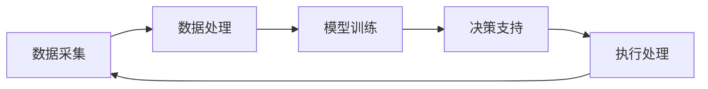

# 技术债务管理：智能化解决方案

> 关键词：技术债务管理、智能化解决方案、软件开发、代码质量、自动化工具

> 摘要：本文聚焦于技术债务管理的智能化解决方案。首先介绍了技术债务管理的背景，包括目的、预期读者、文档结构和相关术语。接着阐述了核心概念与联系，给出了原理和架构的文本示意图及 Mermaid 流程图。详细讲解了核心算法原理和具体操作步骤，并用 Python 代码进行了说明。通过数学模型和公式进一步深入剖析，结合实际例子进行解释。在项目实战部分，展示了开发环境搭建、源代码实现及代码解读。探讨了实际应用场景，推荐了学习资源、开发工具框架和相关论文著作。最后总结了未来发展趋势与挑战，提供了常见问题解答和扩展阅读参考资料，旨在帮助开发者和企业更有效地管理技术债务。

## 1. 背景介绍 
### 1.1 目的和范围
技术债务在软件开发过程中是一个普遍存在的问题，它如同金融债务一样，如果不加以管理，会随着时间的推移不断累积，给项目带来各种隐患，如增加维护成本、降低开发效率、影响系统稳定性等。本文的目的是探讨如何利用智能化解决方案来有效管理技术债务。范围涵盖了技术债务的定义、产生原因、影响，以及智能化解决方案的原理、实现和应用。我们将深入研究各种智能化工具和算法，以及它们在实际项目中的应用，帮助开发者和企业更好地理解和应对技术债务问题。

### 1.2 预期读者
本文的预期读者包括软件开发人员、软件项目经理、软件架构师、质量保证人员以及对技术债务管理感兴趣的企业管理人员。软件开发人员可以从本文中学习到如何在日常开发中避免和处理技术债务，提高代码质量；项目经理和架构师可以了解如何从项目整体层面进行技术债务的规划和管理；质量保证人员可以借助智能化解决方案更有效地检测和评估技术债务；企业管理人员可以认识到技术债务对企业的影响，以及如何通过智能化手段降低技术债务带来的风险。

### 1.3 文档结构概述
本文将按照以下结构进行阐述：首先介绍技术债务管理的核心概念与联系，包括相关的原理和架构；接着详细讲解核心算法原理和具体操作步骤，并给出 Python 代码示例；然后通过数学模型和公式进一步分析技术债务管理；在项目实战部分，展示如何搭建开发环境、实现源代码并进行代码解读；探讨技术债务管理的实际应用场景；推荐相关的学习资源、开发工具框架和论文著作；最后总结未来发展趋势与挑战，提供常见问题解答和扩展阅读参考资料。

### 1.4 术语表
#### 1.4.1 核心术语定义
- **技术债务**：指在软件开发过程中，为了加快项目进度或应对紧急需求，开发团队采取了一些权宜之计，而这些权宜之计可能会导致软件系统在未来需要花费额外的时间和精力来修复或改进，类似于金融债务，需要在未来偿还。
- **智能化解决方案**：利用人工智能、机器学习、自动化等技术，对技术债务进行自动检测、评估、预测和管理的一系列方法和工具。
- **代码异味**：代码中存在的一些不良设计或实现方式，虽然不会影响代码的正常运行，但会增加代码的复杂度和维护难度，是技术债务的一种表现形式。

#### 1.4.2 相关概念解释
- **技术债务的产生**：技术债务的产生通常有多种原因，如时间紧迫、需求变更频繁、缺乏经验的开发人员、不合理的架构设计等。开发团队为了满足短期目标，可能会选择一些快速但不完美的解决方案，从而积累技术债务。
- **技术债务的影响**：技术债务会对软件项目产生多方面的影响，包括增加维护成本、降低开发效率、影响系统稳定性和可扩展性等。随着技术债务的不断累积，项目的风险也会逐渐增加。
- **技术债务的管理**：技术债务管理是指通过一系列的方法和工具，对技术债务进行识别、评估、监控和处理的过程。目的是在保证项目进度的前提下，尽可能地降低技术债务的影响。

#### 1.4.3 缩略词列表
- **TD**：技术债务（Technical Debt）
- **AI**：人工智能（Artificial Intelligence）
- **ML**：机器学习（Machine Learning）

## 2. 核心概念与联系 

### 核心概念原理
技术债务管理的核心概念基于对软件系统的质量评估和风险控制。首先，需要对技术债务进行识别，这可以通过分析代码的结构、复杂度、可维护性等指标来实现。例如，代码中存在大量的重复代码、过长的方法、复杂的嵌套逻辑等都可能是技术债务的表现。

一旦识别出技术债务，就需要对其进行评估。评估的目的是确定技术债务的严重程度和影响范围，以便制定合理的处理策略。评估指标可以包括代码的复杂度、缺陷密度、变更频率等。

智能化解决方案则是利用人工智能和机器学习技术，对技术债务进行自动检测、评估和预测。通过对大量代码数据的学习，智能化工具可以识别出潜在的技术债务模式，并预测其未来的发展趋势。

### 架构的文本示意图
以下是技术债务管理智能化解决方案的架构文本示意图：

- **数据采集层**：负责收集软件项目的各种数据，包括代码文件、版本控制信息、测试报告等。
- **数据处理层**：对采集到的数据进行清洗、转换和特征提取，以便后续的分析和处理。
- **模型训练层**：利用机器学习算法对处理后的数据进行训练，建立技术债务的识别、评估和预测模型。
- **决策支持层**：根据训练好的模型，对技术债务进行实时监测和分析，为开发团队提供决策支持。
- **执行层**：开发团队根据决策支持层的建议，对技术债务进行处理，如重构代码、修复缺陷等。

### Mermaid 流程图

该流程图展示了技术债务管理智能化解决方案的整体流程。从数据采集开始，经过数据处理和模型训练，得到决策支持信息，然后由开发团队进行执行处理。处理结果又会反馈到数据采集阶段，形成一个闭环的管理过程。

## 3. 核心算法原理 & 具体操作步骤 

### 核心算法原理
在技术债务管理的智能化解决方案中，常用的核心算法包括机器学习算法，如决策树、支持向量机、神经网络等。以决策树算法为例，决策树是一种基于树结构进行决策的算法，它通过对数据的特征进行划分，构建一个决策树模型，用于分类和预测。

在技术债务管理中，决策树可以用于识别代码中的技术债务模式。例如，我们可以将代码的各种特征作为输入，如代码行数、圈复杂度、注释率等，将是否存在技术债务作为输出。决策树算法会根据这些输入和输出数据，构建一个决策树模型，通过对新的代码数据进行预测，判断是否存在技术债务。

### 具体操作步骤
#### 步骤 1：数据收集
首先，需要收集软件项目的代码数据。可以使用版本控制系统（如 Git）来获取代码的历史版本信息，同时收集代码的静态分析结果、测试报告等数据。

#### 步骤 2：数据预处理
对收集到的数据进行预处理，包括数据清洗、特征提取和数据划分。数据清洗是去除数据中的噪声和异常值；特征提取是从原始数据中提取出与技术债务相关的特征，如代码复杂度、缺陷密度等；数据划分是将数据分为训练集和测试集，用于模型的训练和评估。

#### 步骤 3：模型训练
使用预处理后的数据对决策树模型进行训练。可以使用 Python 中的 Scikit-learn 库来实现决策树模型的训练。以下是一个简单的 Python 代码示例：

```python
from sklearn.tree import DecisionTreeClassifier
from sklearn.model_selection import train_test_split
from sklearn.metrics import accuracy_score
import pandas as pd

# 读取数据
data = pd.read_csv('code_data.csv')

# 划分特征和标签
X = data.drop('has_td', axis=1)
y = data['has_td']

# 划分训练集和测试集
X_train, X_test, y_train, y_test = train_test_split(X, y, test_size=0.2, random_state=42)

# 创建决策树模型
model = DecisionTreeClassifier()

# 训练模型
model.fit(X_train, y_train)

# 预测
y_pred = model.predict(X_test)

# 评估模型
accuracy = accuracy_score(y_test, y_pred)
print(f"模型准确率: {accuracy}")
```

#### 步骤 4：模型评估
使用测试集对训练好的模型进行评估，评估指标可以包括准确率、召回率、F1 值等。根据评估结果，可以对模型进行调整和优化。

#### 步骤 5：决策支持
将训练好的模型应用到实际项目中，对新的代码数据进行预测，为开发团队提供决策支持。例如，当模型预测某段代码存在技术债务时，开发团队可以根据预测结果决定是否对该代码进行重构。

## 4. 数学模型和公式 & 详细讲解 & 举例说明 

### 数学模型和公式
在技术债务管理中，我们可以使用一些数学模型和公式来评估技术债务的严重程度和影响范围。以下是一些常见的数学模型和公式：

#### 圈复杂度（Cyclomatic Complexity）
圈复杂度是一种衡量代码复杂度的指标，它表示代码中独立路径的数量。圈复杂度的计算公式为：

$$V(G) = E - N + 2$$

其中，$V(G)$ 表示圈复杂度，$E$ 表示代码中的边数，$N$ 表示代码中的节点数。圈复杂度越高，代码的复杂度和维护难度就越大，技术债务也就越高。

#### 缺陷密度（Defect Density）
缺陷密度是指单位代码中发现的缺陷数量。缺陷密度的计算公式为：

$$DD = \frac{D}{S}$$

其中，$DD$ 表示缺陷密度，$D$ 表示发现的缺陷数量，$S$ 表示代码的规模（如代码行数）。缺陷密度越高，说明代码的质量越低，技术债务也就越高。

### 详细讲解
圈复杂度可以帮助我们评估代码的控制结构复杂度。例如，一个简单的顺序执行代码的圈复杂度为 1，而一个包含多个条件判断和循环的代码的圈复杂度会更高。通过计算圈复杂度，我们可以识别出那些复杂度较高的代码模块，这些模块可能存在较多的技术债务。

缺陷密度则可以反映代码的质量状况。如果一个代码模块的缺陷密度较高，说明该模块存在较多的缺陷，需要花费更多的时间和精力来修复，从而增加了技术债务。

### 举例说明
假设我们有一个代码模块，其节点数 $N = 10$，边数 $E = 12$。根据圈复杂度的计算公式，可得：

$$V(G) = 12 - 10 + 2 = 4$$

这表示该代码模块的圈复杂度为 4，说明该代码的控制结构相对复杂，可能存在一定的技术债务。

再假设该代码模块的代码行数为 1000，发现的缺陷数量为 10。根据缺陷密度的计算公式，可得：

$$DD = \frac{10}{1000} = 0.01$$

这表示该代码模块的缺陷密度为 0.01，即每 100 行代码中发现 1 个缺陷。如果该缺陷密度高于项目的平均水平，说明该代码模块的质量较低，需要进行改进。

## 5. 项目实战：代码实际案例和详细解释说明 

### 5.1  开发环境搭建
#### 操作系统
可以选择 Windows、Linux 或 macOS 操作系统。这里以 Ubuntu 18.04 为例进行说明。

#### 编程语言和工具
- **Python**：Python 是一种广泛使用的编程语言，具有丰富的机器学习和数据分析库。可以使用 Anaconda 来管理 Python 环境，安装步骤如下：
  1. 从 Anaconda 官方网站下载适用于 Linux 的 Anaconda 安装包。
  2. 打开终端，进入下载目录，执行以下命令进行安装：
```bash
bash Anaconda3-2023.03-Linux-x86_64.sh
```
  3. 按照安装向导的提示完成安装。
- **Git**：用于代码版本控制。可以使用以下命令进行安装：
```bash
sudo apt-get install git
```

#### 开发库和框架
- **Scikit-learn**：用于机器学习模型的训练和评估。可以使用以下命令进行安装：
```bash
pip install scikit-learn
```
- **Pandas**：用于数据处理和分析。可以使用以下命令进行安装：
```bash
pip install pandas
```

### 5.2  源代码详细实现和代码解读
#### 数据收集
假设我们已经从版本控制系统中获取了代码的历史版本信息，并将其保存为 CSV 文件 `code_data.csv`。该文件包含以下列：
- `lines_of_code`：代码行数
- `cyclomatic_complexity`：圈复杂度
- `comment_rate`：注释率
- `has_td`：是否存在技术债务（0 表示不存在，1 表示存在）

#### 数据预处理
```python
import pandas as pd
from sklearn.model_selection import train_test_split

# 读取数据
data = pd.read_csv('code_data.csv')

# 划分特征和标签
X = data.drop('has_td', axis=1)
y = data['has_td']

# 划分训练集和测试集
X_train, X_test, y_train, y_test = train_test_split(X, y, test_size=0.2, random_state=42)
```
代码解读：
- `pd.read_csv('code_data.csv')`：使用 Pandas 库读取 CSV 文件。
- `data.drop('has_td', axis=1)`：从数据中删除 `has_td` 列，得到特征矩阵 `X`。
- `data['has_td']`：提取 `has_td` 列作为标签向量 `y`。
- `train_test_split(X, y, test_size=0.2, random_state=42)`：将数据划分为训练集和测试集，测试集占比为 20%。

#### 模型训练
```python
from sklearn.tree import DecisionTreeClassifier

# 创建决策树模型
model = DecisionTreeClassifier()

# 训练模型
model.fit(X_train, y_train)
```
代码解读：
- `DecisionTreeClassifier()`：创建一个决策树分类器模型。
- `model.fit(X_train, y_train)`：使用训练集数据对模型进行训练。

#### 模型评估
```python
from sklearn.metrics import accuracy_score

# 预测
y_pred = model.predict(X_test)

# 评估模型
accuracy = accuracy_score(y_test, y_pred)
print(f"模型准确率: {accuracy}")
```
代码解读：
- `model.predict(X_test)`：使用训练好的模型对测试集数据进行预测。
- `accuracy_score(y_test, y_pred)`：计算模型的准确率。

### 5.3  代码解读与分析
通过上述代码，我们实现了一个简单的技术债务识别模型。首先，我们对数据进行了预处理，将其划分为训练集和测试集。然后，使用决策树算法对模型进行训练，并使用测试集对模型进行评估。

从代码中可以看出，决策树算法的实现相对简单，只需要几行代码就可以完成模型的训练和预测。同时，我们可以通过调整决策树的参数，如树的深度、最小样本数等，来优化模型的性能。

需要注意的是，在实际应用中，我们可能需要使用更复杂的模型和算法，以及更多的特征和数据，来提高模型的准确率和可靠性。

## 6. 实际应用场景 
### 软件开发项目管理
在软件开发项目中，技术债务管理的智能化解决方案可以帮助项目经理更好地掌握项目的技术状况。通过对代码的实时监测和分析，项目经理可以及时发现潜在的技术债务问题，并制定相应的处理策略。例如，当发现某个模块的圈复杂度过高或缺陷密度过大时，项目经理可以安排专门的时间进行代码重构，以降低技术债务的影响。

### 代码审查和质量保证
智能化解决方案可以辅助代码审查人员更高效地进行代码审查。通过自动检测代码中的技术债务模式，代码审查人员可以将注意力集中在那些存在潜在问题的代码上，提高审查效率和质量。同时，质量保证人员可以利用智能化工具对代码进行全面的质量评估，及时发现和修复技术债务问题，确保软件系统的稳定性和可靠性。

### 技术团队培训和知识传承
技术债务管理的智能化解决方案可以作为技术团队培训的工具。通过对代码数据的分析和展示，新员工可以更好地了解项目的技术架构和代码规范，学习如何避免和处理技术债务。同时，智能化工具可以记录和分析团队成员的代码行为，为团队的知识传承和经验积累提供支持。

## 7. 工具和资源推荐
### 7.1 学习资源推荐
#### 7.1.1 书籍推荐
- 《代码整洁之道》：本书介绍了编写高质量代码的原则和实践，帮助开发者避免技术债务的产生。
- 《重构：改善既有代码的设计》：详细讲解了代码重构的方法和技巧，是处理技术债务的重要参考书籍。
- 《机器学习》：周志华著，全面介绍了机器学习的基本概念、算法和应用，为智能化解决方案提供了理论基础。

#### 7.1.2 在线课程
- Coursera 上的“机器学习”课程：由 Andrew Ng 教授授课，是机器学习领域的经典课程。
- edX 上的“人工智能基础”课程：介绍了人工智能的基本概念和技术，对理解智能化解决方案有很大帮助。
- Udemy 上的“Python 数据分析实战”课程：学习如何使用 Python 进行数据处理和分析，是技术债务管理中数据处理的重要技能。

#### 7.1.3 技术博客和网站
- Medium：上面有很多关于技术债务管理和智能化解决方案的文章，可以及时了解最新的技术动态和实践经验。
- InfoQ：提供了丰富的软件开发和技术管理方面的资讯和文章，对技术债务管理有深入的探讨。
- Stack Overflow：是一个开发者社区，上面有很多关于技术债务管理和相关技术的问题和解答，可以帮助解决实际问题。

### 7.2 开发工具框架推荐
#### 7.2.1 IDE和编辑器
- PyCharm：是一款专门为 Python 开发设计的集成开发环境，具有强大的代码编辑、调试和版本控制功能。
- Visual Studio Code：是一款轻量级的代码编辑器，支持多种编程语言，具有丰富的插件生态系统，可以方便地进行开发和调试。

#### 7.2.2 调试和性能分析工具
- PDB：Python 自带的调试工具，可以帮助开发者定位和解决代码中的问题。
- cProfile：Python 标准库中的性能分析工具，可以分析代码的执行时间和资源消耗情况。

#### 7.2.3 相关框架和库
- Scikit-learn：是一个广泛使用的机器学习库，提供了丰富的机器学习算法和工具，方便进行模型的训练和评估。
- Pandas：是一个用于数据处理和分析的库，提供了高效的数据结构和数据操作方法，适合处理大规模的代码数据。

### 7.3 相关论文著作推荐
#### 7.3.1 经典论文
- 《Technical Debt: From Metaphor to Theory and Practice》：对技术债务的概念、理论和实践进行了系统的阐述，是技术债务领域的经典论文。
- 《A Survey on Software Technical Debt》：对软件技术债务的研究现状进行了全面的综述，介绍了技术债务的定义、分类、度量和管理方法。

#### 7.3.2 最新研究成果
- 在 ACM SIGSOFT 等软件领域的顶级会议上，经常会有关于技术债务管理和智能化解决方案的最新研究成果发表，可以关注这些会议的论文。
- 一些知名的学术期刊，如《Journal of Software: Evolution and Process》《Empirical Software Engineering》等，也会刊登相关的研究论文。

#### 7.3.3 应用案例分析
- 在一些软件开发企业的官方博客或技术分享平台上，会有关于技术债务管理的应用案例分析。这些案例可以帮助我们了解实际项目中如何应用智能化解决方案来管理技术债务。

## 8. 总结：未来发展趋势与挑战
### 未来发展趋势
#### 智能化程度不断提高
随着人工智能和机器学习技术的不断发展，技术债务管理的智能化解决方案将变得更加智能和高效。未来的工具将能够自动学习和适应不同的项目和代码风格，更准确地识别和预测技术债务。

#### 与 DevOps 集成
技术债务管理将与 DevOps 流程更加紧密地集成。通过自动化的代码检测和分析工具，可以在代码提交、构建和部署的各个环节及时发现和处理技术债务，实现持续的技术债务管理。

#### 跨领域融合
技术债务管理将与其他领域的技术进行融合，如区块链、物联网等。例如，利用区块链技术可以实现技术债务的可追溯性和不可篡改，提高技术债务管理的可信度。

### 挑战
#### 数据质量和隐私问题
智能化解决方案依赖于大量的代码数据，数据的质量和隐私问题是一个重要的挑战。如何保证数据的准确性、完整性和安全性，以及如何处理数据的隐私问题，是需要解决的关键问题。

#### 模型解释性
机器学习模型通常是黑盒模型，难以解释其决策过程。在技术债务管理中，需要能够解释模型的预测结果，以便开发团队能够理解和接受。如何提高模型的解释性是一个亟待解决的问题。

#### 文化和组织变革
技术债务管理不仅仅是技术问题，还涉及到文化和组织变革。开发团队需要改变传统的开发思维和工作方式，重视技术债务的管理。如何推动文化和组织变革，提高团队的技术债务意识，是一个长期的挑战。

## 9. 附录：常见问题与解答
### 问题 1：智能化解决方案能否完全消除技术债务？
解答：智能化解决方案可以帮助我们更好地识别、评估和管理技术债务，但不能完全消除技术债务。技术债务的产生是由于软件开发过程中的各种因素，如时间限制、需求变更等，这些因素是难以完全避免的。智能化解决方案可以帮助我们及时发现和处理技术债务，降低其对项目的影响。

### 问题 2：如何选择适合的智能化工具？
解答：选择适合的智能化工具需要考虑多个因素，如工具的功能、性能、易用性、成本等。首先，需要明确自己的需求，例如是需要代码检测工具、技术债务评估工具还是预测工具。然后，对市场上的工具进行调研和比较，选择符合自己需求的工具。可以参考其他用户的评价和案例，了解工具的实际应用效果。

### 问题 3：智能化解决方案是否需要大量的专业知识？
解答：智能化解决方案的使用并不一定需要大量的专业知识。现在有很多商业化的工具和平台，提供了简单易用的界面和操作流程，即使是没有专业技术背景的人员也可以使用。当然，如果需要对工具进行定制和优化，或者开发自己的智能化解决方案，就需要一定的专业知识，如机器学习、数据分析等。

## 10. 扩展阅读 & 参考资料
### 扩展阅读
- 《软件架构设计：大型网站技术架构与业务架构融合之道》：深入介绍了软件架构设计的原则和方法，对理解技术债务与架构设计的关系有很大帮助。
- 《敏捷软件开发：原则、模式与实践》：介绍了敏捷开发的理念和方法，如何在敏捷开发过程中管理技术债务是一个重要的话题。

### 参考资料
- 技术债务相关的研究论文和报告，可以从学术数据库（如 IEEE Xplore、ACM Digital Library 等）中获取。
- 软件开发工具和平台的官方文档，如 Scikit-learn、Pandas 等库的官方文档。
- 开源项目的代码和文档，如一些开源的技术债务管理工具的代码和文档，可以参考其实现原理和方法。