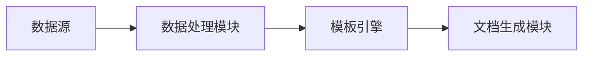

# 技术文档自动化：知识管理革新

> 关键词：技术文档自动化、知识管理、自动化工具、革新、工作流

> 摘要：本文聚焦于技术文档自动化在知识管理领域所带来的革新。首先介绍了技术文档自动化的背景，包括其目的、预期读者、文档结构等。详细阐述了核心概念及相互联系，分析了核心算法原理和具体操作步骤，借助 Python 代码进行说明。同时，深入探讨了相关的数学模型和公式，并通过实际案例进行解释。在项目实战部分，展示了开发环境搭建、源代码实现与解读。还介绍了技术文档自动化的实际应用场景，推荐了相关的工具和资源。最后总结了未来发展趋势与挑战，提供了常见问题解答和扩展阅读参考资料，旨在帮助读者全面了解技术文档自动化如何推动知识管理的变革。

## 1. 背景介绍 
### 1.1 目的和范围
技术文档自动化在当今数字化时代具有重要意义。其目的在于提高技术文档的生成效率、减少人工错误、提升文档质量，并实现知识的有效管理和共享。通过自动化技术，能够将繁琐的文档编写、更新和维护工作转化为高效、准确的流程。

本文章的范围涵盖了技术文档自动化的各个方面，包括核心概念、算法原理、实际应用场景、开发工具和资源等。旨在为读者提供一个全面的视角，了解如何利用自动化技术革新知识管理。

### 1.2 预期读者
本文的预期读者包括技术文档编写人员、知识管理专家、软件开发工程师、项目经理以及对技术文档自动化和知识管理感兴趣的专业人士。无论是希望提高工作效率的一线人员，还是关注企业知识资产优化的管理人员，都能从本文中获得有价值的信息。

### 1.3 文档结构概述
本文将按照以下结构进行阐述：首先介绍核心概念与联系，让读者了解技术文档自动化的基本原理和架构；接着讲解核心算法原理和具体操作步骤，并结合 Python 代码进行说明；然后深入探讨相关的数学模型和公式；通过项目实战部分展示实际应用案例；介绍技术文档自动化的实际应用场景；推荐相关的工具和资源；最后总结未来发展趋势与挑战，提供常见问题解答和扩展阅读参考资料。

### 1.4 术语表
#### 1.4.1 核心术语定义
- **技术文档自动化**：利用计算机技术和自动化工具，实现技术文档的自动生成、更新和管理的过程。
- **知识管理**：对组织内的知识进行收集、整理、存储、共享和应用的一系列活动，以提高组织的创新能力和竞争力。
- **自动化工具**：用于实现技术文档自动化的软件或系统，如脚本语言、文档生成器等。

#### 1.4.2 相关概念解释
- **元数据**：描述数据的数据，在技术文档自动化中，元数据可用于标识文档的属性、作者、版本等信息。
- **模板引擎**：一种将数据和模板结合生成文档的工具，通过模板引擎可以快速生成具有统一格式的文档。

#### 1.4.3 缩略词列表
- **API**：Application Programming Interface，应用程序编程接口
- **XML**：eXtensible Markup Language，可扩展标记语言
- **JSON**：JavaScript Object Notation，轻量级的数据交换格式

## 2. 核心概念与联系 
### 核心概念原理
技术文档自动化的核心原理是将文档生成过程中的重复、规律性任务通过编程的方式实现自动化。它基于数据驱动的思想，将文档内容的各个部分抽象为数据，通过模板引擎将数据与预先定义的模板相结合，生成最终的文档。

例如，在软件开发项目中，技术文档可能包括需求规格说明书、设计文档、测试报告等。这些文档通常具有一定的格式和结构，并且部分内容是重复的，如项目名称、版本号等。通过技术文档自动化，可以将这些重复的内容存储在数据文件中，利用模板引擎根据不同的需求生成相应的文档。

### 架构的文本示意图
以下是技术文档自动化的架构示意图：

```plaintext
+-------------------+
| 数据源            |
| (如数据库、文件)  |
+-------------------+
          |
          v
+-------------------+
| 数据处理模块      |
| (数据提取、转换)  |
+-------------------+
          |
          v
+-------------------+
| 模板引擎          |
| (结合数据和模板)  |
+-------------------+
          |
          v
+-------------------+
| 文档生成模块      |
| (生成最终文档)    |
+-------------------+
```

### Mermaid 流程图


在这个流程图中，数据源可以是数据库、文件等，数据处理模块负责对数据源中的数据进行提取和转换，模板引擎将处理后的数据与预先定义的模板相结合，最终由文档生成模块生成最终的文档。

## 3. 核心算法原理 & 具体操作步骤 
### 核心算法原理
技术文档自动化的核心算法主要涉及数据处理和模板渲染。数据处理包括数据的提取、清洗和转换，以确保数据的准确性和一致性。模板渲染则是将处理后的数据填充到预先定义的模板中，生成最终的文档。

以下是一个简单的 Python 示例，演示如何使用 Jinja2 模板引擎实现技术文档自动化：

```python
from jinja2 import Template

# 定义数据
data = {
    "project_name": "技术文档自动化项目",
    "version": "1.0",
    "author": "John Doe"
}

# 定义模板
template_str = """
# {{ project_name }} 文档

## 项目信息
- 项目名称: {{ project_name }}
- 版本号: {{ version }}
- 作者: {{ author }}
"""

# 创建模板对象
template = Template(template_str)

# 渲染模板
output = template.render(data)

# 输出结果
print(output)
```

### 具体操作步骤
1. **数据准备**：确定文档所需的数据，并将其存储在合适的数据源中，如数据库、JSON 文件等。
2. **模板设计**：根据文档的格式和结构，设计相应的模板。模板可以使用 HTML、Markdown 等格式。
3. **数据处理**：使用编程语言（如 Python）编写代码，从数据源中提取数据，并进行必要的清洗和转换。
4. **模板渲染**：使用模板引擎将处理后的数据填充到模板中，生成最终的文档。
5. **文档保存**：将生成的文档保存到指定的位置，可以是本地文件系统或远程服务器。

## 4. 数学模型和公式 & 详细讲解 & 举例说明 
### 数学模型和公式
在技术文档自动化中，虽然不像数学和物理学领域那样有复杂的数学模型和公式，但也有一些基本的概念可以用数学语言来描述。

#### 文档生成函数
设 $D$ 表示最终生成的文档，$T$ 表示模板，$D_i$ 表示第 $i$ 个数据项，$n$ 表示数据项的数量。则文档生成函数可以表示为：

$$D = f(T, D_1, D_2, \cdots, D_n)$$

其中，$f$ 是模板引擎的渲染函数，它将模板 $T$ 和数据项 $D_i$ 相结合，生成最终的文档 $D$。

#### 数据处理函数
设 $D_{in}$ 表示输入的数据，$D_{out}$ 表示输出的处理后的数据，$g$ 表示数据处理函数。则数据处理过程可以表示为：

$$D_{out} = g(D_{in})$$

### 详细讲解
文档生成函数 $f$ 描述了模板引擎如何将模板和数据相结合生成文档的过程。模板 $T$ 定义了文档的结构和格式，数据项 $D_i$ 提供了具体的内容。模板引擎根据模板中的占位符，将数据项填充到相应的位置，从而生成最终的文档。

数据处理函数 $g$ 用于对输入的数据进行清洗、转换等操作，以确保数据的准确性和一致性。例如，可能需要对数据进行格式转换、去除重复项等操作。

### 举例说明
假设我们有一个模板 $T$ 如下：

```plaintext
# {{ project_name }} 报告

## 项目信息
- 项目名称: {{ project_name }}
- 开始日期: {{ start_date }}
- 结束日期: {{ end_date }}
```

数据项如下：

$$D_1 = \text{"技术文档自动化项目"}, D_2 = \text{"2024-01-01"}, D_3 = \text{"2024-06-01"}$$

则文档生成函数 $f$ 的计算过程为：

将 $D_1$ 填充到模板中的 `{{ project_name }}` 位置，$D_2$ 填充到 `{{ start_date }}` 位置，$D_3$ 填充到 `{{ end_date }}` 位置，得到最终的文档：

```plaintext
# 技术文档自动化项目 报告

## 项目信息
- 项目名称: 技术文档自动化项目
- 开始日期: 2024-01-01
- 结束日期: 2024-06-01
```

## 5. 项目实战：代码实际案例和详细解释说明 
### 5.1  开发环境搭建
为了实现技术文档自动化的项目实战，我们需要搭建以下开发环境：

#### 安装 Python
Python 是一种广泛使用的编程语言，适合用于实现技术文档自动化。可以从 Python 官方网站（https://www.python.org/downloads/）下载并安装 Python。

#### 安装 Jinja2 模板引擎
Jinja2 是一个流行的 Python 模板引擎，可以使用以下命令进行安装：

```bash
pip install jinja2
```

#### 安装 Markdown 库（可选）
如果需要生成 Markdown 格式的文档，可以安装 Markdown 库：

```bash
pip install markdown
```

### 5.2  源代码详细实现和代码解读
以下是一个完整的 Python 代码示例，实现了从 JSON 文件中读取数据，使用 Jinja2 模板引擎生成 Markdown 文档的功能：

```python
import json
from jinja2 import Template

# 读取 JSON 数据文件
def read_json_data(file_path):
    with open(file_path, 'r', encoding='utf-8') as file:
        data = json.load(file)
    return data

# 生成 Markdown 文档
def generate_markdown_document(template_str, data):
    template = Template(template_str)
    output = template.render(data)
    return output

# 主函数
def main():
    # 数据文件路径
    data_file_path = 'data.json'
    # 读取数据
    data = read_json_data(data_file_path)

    # 定义模板
    template_str = """
# {{ project_name }} 文档

## 项目信息
- 项目名称: {{ project_name }}
- 版本号: {{ version }}
- 作者: {{ author }}

## 项目描述
{{ description }}
"""

    # 生成 Markdown 文档
    markdown_doc = generate_markdown_document(template_str, data)

    # 保存文档
    with open('output.md', 'w', encoding='utf-8') as file:
        file.write(markdown_doc)

if __name__ == "__main__":
    main()
```

### 代码解读与分析
1. **读取 JSON 数据文件**：`read_json_data` 函数用于读取 JSON 数据文件，并将其解析为 Python 字典。
2. **生成 Markdown 文档**：`generate_markdown_document` 函数使用 Jinja2 模板引擎将数据填充到模板中，生成 Markdown 文档。
3. **主函数**：`main` 函数是程序的入口点，它调用 `read_json_data` 函数读取数据，定义模板，调用 `generate_markdown_document` 函数生成文档，并将文档保存到 `output.md` 文件中。

通过这个示例，我们可以看到如何使用 Python 和 Jinja2 模板引擎实现技术文档自动化。

## 6. 实际应用场景 
### 软件开发项目
在软件开发项目中，技术文档自动化可以用于生成需求规格说明书、设计文档、测试报告等。通过自动化生成文档，可以减少人工编写的工作量，提高文档的准确性和一致性。例如，开发团队可以使用代码注释和元数据自动生成 API 文档，方便开发人员和测试人员使用。

### 企业知识管理
企业可以利用技术文档自动化来管理内部的知识资产，如操作手册、培训资料等。通过自动化生成和更新文档，可以确保员工获取到最新的知识信息，提高工作效率。例如，企业可以使用模板引擎根据不同的部门和岗位生成个性化的培训文档。

### 科研项目
科研项目中通常需要撰写大量的研究报告、论文等文档。技术文档自动化可以帮助科研人员快速生成文档，提高科研工作的效率。例如，科研人员可以使用 LaTeX 模板和自动化工具生成高质量的学术论文。

## 7. 工具和资源推荐
### 7.1 学习资源推荐
#### 7.1.1 书籍推荐
- 《Python 编程从入门到实践》：适合初学者学习 Python 编程语言，为实现技术文档自动化打下基础。
- 《Jinja2 模板引擎实战》：深入介绍 Jinja2 模板引擎的使用方法和技巧。
- 《知识管理：原理与实践》：全面介绍知识管理的理论和方法，帮助读者理解技术文档自动化在知识管理中的应用。

#### 7.1.2 在线课程
- Coursera 上的“Python 基础课程”：提供系统的 Python 编程培训。
- Udemy 上的“Jinja2 模板引擎教程”：详细讲解 Jinja2 模板引擎的使用。
- edX 上的“知识管理与创新”：介绍知识管理的最新理论和实践。

#### 7.1.3 技术博客和网站
- Python 官方文档：提供 Python 编程语言的详细文档和教程。
- Jinja2 官方文档：介绍 Jinja2 模板引擎的使用方法和 API。
- InfoQ：关注软件开发和技术趋势，提供有关技术文档自动化和知识管理的文章和案例。

### 7.2 开发工具框架推荐
#### 7.2.1 IDE和编辑器
- PyCharm：专业的 Python 集成开发环境，提供代码编辑、调试、版本控制等功能。
- Visual Studio Code：轻量级的代码编辑器，支持多种编程语言和插件扩展，适合快速开发。

#### 7.2.2 调试和性能分析工具
- PDB：Python 内置的调试器，用于调试 Python 代码。
- cProfile：Python 标准库中的性能分析工具，用于分析代码的性能瓶颈。

#### 7.2.3 相关框架和库
- Jinja2：流行的 Python 模板引擎，用于实现模板渲染。
- Markdown：Python 库，用于处理 Markdown 格式的文档。
- Sphinx：用于生成技术文档的工具，支持多种输出格式。

### 7.3 相关论文著作推荐
#### 7.3.1 经典论文
- "Knowledge Management in Organizations: An Integrative Framework"：提出了知识管理的综合框架，对理解知识管理的理论基础有重要意义。
- "Automating Technical Documentation Generation in Software Development"：探讨了软件开发中技术文档自动化的方法和实践。

#### 7.3.2 最新研究成果
- 关注 ACM、IEEE 等学术会议和期刊上发表的关于技术文档自动化和知识管理的最新研究成果。

#### 7.3.3 应用案例分析
- 一些知名企业的技术博客和案例分享，如 Google、Microsoft 等公司关于技术文档自动化和知识管理的实践经验。

## 8. 总结：未来发展趋势与挑战
### 未来发展趋势
- **智能化**：随着人工智能技术的发展，技术文档自动化将更加智能化。例如，利用自然语言处理技术实现文档内容的自动生成和优化，提高文档的质量和可读性。
- **集成化**：技术文档自动化将与其他软件开发工具和流程更加紧密地集成。例如，与版本控制系统、项目管理工具等集成，实现文档的自动更新和同步。
- **个性化**：根据用户的需求和偏好，提供个性化的文档生成服务。例如，根据用户的角色和权限生成不同级别的技术文档。

### 挑战
- **数据质量**：技术文档自动化依赖于准确、完整的数据。确保数据的质量是一个挑战，需要建立有效的数据管理机制。
- **模板设计**：设计合理的模板需要考虑文档的多样性和灵活性。如何设计出通用、可扩展的模板是一个需要解决的问题。
- **人员培训**：推广技术文档自动化需要对相关人员进行培训，提高他们的技术水平和使用意愿。

## 9. 附录：常见问题与解答
### 问题 1：技术文档自动化是否会完全取代人工编写文档？
答：不会。虽然技术文档自动化可以提高文档生成的效率和准确性，但在一些需要创造性和专业性的文档编写中，人工编写仍然是必要的。技术文档自动化更适合处理重复性、规律性的文档编写任务。

### 问题 2：如何选择合适的模板引擎？
答：选择模板引擎时，需要考虑以下因素：语言支持、功能特性、性能、社区支持等。常见的模板引擎有 Jinja2、Mustache、Handlebars 等。可以根据具体的需求和项目特点选择合适的模板引擎。

### 问题 3：技术文档自动化需要具备哪些技术知识？
答：需要具备一定的编程语言知识，如 Python、Java 等；了解模板引擎的使用方法；掌握数据处理和存储的基本技术，如数据库操作、JSON 处理等。

## 10. 扩展阅读 & 参考资料
### 扩展阅读
- 《软件工程：实践者的研究方法》：深入介绍软件工程的理论和实践，对理解技术文档在软件开发中的作用有帮助。
- 《自然语言处理入门》：了解自然语言处理技术，为实现智能化的技术文档自动化提供参考。

### 参考资料
- Python 官方文档：https://docs.python.org/
- Jinja2 官方文档：https://jinja.palletsprojects.com/
- Markdown 官方文档：https://daringfireball.net/projects/markdown/