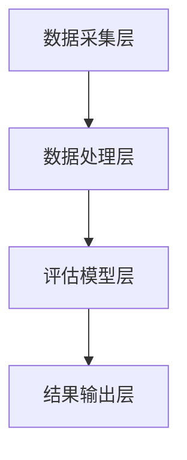

# 技术资产管理：价值评估系统

> 关键词：技术资产、价值评估系统、资产管理、评估模型、资产价值

> 摘要：本文聚焦于技术资产管理中的价值评估系统，深入探讨其相关概念、原理、算法及实际应用。首先介绍了技术资产管理价值评估系统的背景，包括目的、预期读者等内容。接着阐述核心概念及联系，通过文本示意图和 Mermaid 流程图进行清晰展示。详细讲解了核心算法原理并给出 Python 源代码示例，同时介绍了相关数学模型和公式。通过项目实战，给出代码实际案例并进行详细解释。分析了该系统的实际应用场景，推荐了学习资源、开发工具框架以及相关论文著作。最后总结了未来发展趋势与挑战，提供常见问题解答和扩展阅读参考资料，旨在为读者全面呈现技术资产管理价值评估系统的全貌。

## 1. 背景介绍 
### 1.1 目的和范围
在当今高度竞争的商业环境中，技术资产已成为企业核心竞争力的重要组成部分。技术资产管理的价值评估系统旨在准确衡量技术资产的价值，为企业的决策提供科学依据。其范围涵盖了各种类型的技术资产，包括专利、软件、技术秘密、商标等。通过对这些技术资产的价值评估，企业可以更好地进行资产配置、投资决策、并购重组等活动，提高资源利用效率，增强市场竞争力。

### 1.2 预期读者
本文的预期读者包括企业的管理人员、技术研发人员、财务人员、投资人员以及对技术资产管理和价值评估感兴趣的学者和研究人员。企业管理人员可以通过本文了解如何利用价值评估系统来优化企业的技术资产战略；技术研发人员可以认识到技术资产价值评估的重要性，从而在研发过程中注重资产的价值创造；财务人员可以掌握技术资产价值评估的方法和流程，为企业的财务报表提供准确的资产信息；投资人员可以借助价值评估系统评估投资项目的潜在价值；学者和研究人员可以从中获取相关的理论和实践知识，开展进一步的研究。

### 1.3 文档结构概述
本文首先介绍技术资产管理价值评估系统的背景信息，包括目的、预期读者和文档结构概述。接着阐述核心概念与联系，通过文本示意图和 Mermaid 流程图展示系统的原理和架构。然后详细讲解核心算法原理，并给出 Python 源代码示例。之后介绍相关的数学模型和公式，并进行详细讲解和举例说明。通过项目实战，给出代码实际案例并进行详细解释。分析该系统的实际应用场景，推荐学习资源、开发工具框架以及相关论文著作。最后总结未来发展趋势与挑战，提供常见问题解答和扩展阅读参考资料。

### 1.4 术语表
#### 1.4.1 核心术语定义
- **技术资产**：指企业拥有或控制的、能够为企业带来经济利益的技术资源，包括专利、软件、技术秘密、商标等。
- **价值评估系统**：是一种用于评估技术资产价值的工具或方法体系，通过收集、分析相关数据，运用特定的模型和算法，计算出技术资产的价值。
- **资产价值**：指技术资产在特定时间和市场条件下所具有的经济价值，通常以货币形式表示。

#### 1.4.2 相关概念解释
- **无形资产**：指企业拥有或控制的没有实物形态的可辨认非货币性资产，技术资产属于无形资产的范畴。
- **知识产权**：指人们对其智力劳动成果所享有的法定权利，技术资产中的专利、商标等属于知识产权的保护对象。

#### 1.4.3 缩略词列表
- **NPV**：Net Present Value，净现值
- **IRR**：Internal Rate of Return，内部收益率

## 2. 核心概念与联系 

### 核心概念原理
技术资产管理价值评估系统的核心原理是基于资产的未来收益能力、市场需求、技术先进性等因素来确定其价值。该系统通过收集和分析与技术资产相关的各种数据，如研发成本、市场份额、技术寿命周期等，运用特定的评估模型和算法，计算出技术资产的价值。其基本原理可以概括为以下几点：
- **收益法**：根据技术资产未来预期收益的现值来确定其价值。该方法基于资产的获利能力，认为资产的价值在于其能够为企业带来未来的经济利益。
- **市场法**：通过比较类似技术资产在市场上的交易价格来确定评估对象的价值。该方法基于市场的供求关系和公平交易原则，认为市场上类似资产的交易价格可以作为评估对象价值的参考。
- **成本法**：根据重新开发或购置与评估对象相同或类似的技术资产所需的成本来确定其价值。该方法基于资产的重置成本，认为资产的价值不应超过其重置成本。

### 架构的文本示意图
技术资产管理价值评估系统的架构主要包括数据采集层、数据处理层、评估模型层和结果输出层。
- **数据采集层**：负责收集与技术资产相关的各种数据，包括企业内部数据（如研发成本、财务报表等）和外部数据（如市场调研数据、行业报告等）。
- **数据处理层**：对采集到的数据进行清洗、整理和分析，去除噪声数据，提取有用信息，为评估模型提供准确的数据输入。
- **评估模型层**：根据不同的评估目的和资产类型，选择合适的评估模型和算法，对技术资产的价值进行计算。
- **结果输出层**：将评估结果以直观的方式输出，如报告、图表等，为企业的决策提供支持。

### Mermaid 流程图


## 3. 核心算法原理 & 具体操作步骤 

### 收益法核心算法原理
收益法的核心思想是将技术资产未来预期收益折现到评估基准日，以确定其价值。其基本公式为：
$$V = \sum_{i=1}^{n} \frac{R_i}{(1 + r)^i}$$
其中，$V$ 表示技术资产的价值，$R_i$ 表示第 $i$ 年的预期收益，$r$ 表示折现率，$n$ 表示收益期限。

### Python 源代码示例
```python
def income_approach(R, r, n):
    value = 0
    for i in range(1, n + 1):
        value += R / (1 + r) ** i
    return value

# 示例数据
R = 100000  # 每年预期收益
r = 0.1  # 折现率
n = 5  # 收益期限

result = income_approach(R, r, n)
print("技术资产的价值为:", result)
```

### 具体操作步骤
1. **确定预期收益**：通过市场调研、行业分析、企业历史数据等方法，预测技术资产未来每年的预期收益。
2. **确定折现率**：折现率反映了资金的时间价值和投资风险。可以参考市场利率、行业平均收益率等因素来确定折现率。
3. **确定收益期限**：收益期限是指技术资产能够为企业带来经济利益的时间长度。可以根据技术的寿命周期、市场需求变化等因素来确定收益期限。
4. **计算价值**：将预期收益、折现率和收益期限代入收益法公式，计算出技术资产的价值。

## 4. 数学模型和公式 & 详细讲解 & 举例说明 

### 收益法数学模型和公式
收益法的数学模型为：
$$V = \sum_{i=1}^{n} \frac{R_i}{(1 + r)^i}$$
详细讲解：
- $V$：技术资产的价值，是我们最终要计算的结果。
- $R_i$：第 $i$ 年的预期收益，预期收益的预测需要综合考虑市场需求、技术竞争力、企业经营策略等因素。
- $r$：折现率，折现率的大小直接影响到资产价值的计算结果。折现率越高，未来收益的现值越低，资产价值也就越低；反之，折现率越低，资产价值越高。
- $n$：收益期限，收益期限的确定需要考虑技术的更新换代速度、市场竞争情况等因素。

### 举例说明
假设某企业拥有一项专利技术，预计未来 5 年每年可为企业带来 200000 元的收益，折现率为 10%。则该专利技术的价值为：
$$V = \frac{200000}{(1 + 0.1)^1} + \frac{200000}{(1 + 0.1)^2} + \frac{200000}{(1 + 0.1)^3} + \frac{200000}{(1 + 0.1)^4} + \frac{200000}{(1 + 0.1)^5}$$
```python
R = 200000
r = 0.1
n = 5
value = 0
for i in range(1, n + 1):
    value += R / (1 + r) ** i
print("该专利技术的价值为:", value)
```

### 市场法数学模型和公式
市场法的数学模型为：
$$V = P \times K_1 \times K_2 \times \cdots \times K_m$$
其中，$V$ 表示评估对象的价值，$P$ 表示类似技术资产的市场交易价格，$K_1, K_2, \cdots, K_m$ 表示各项调整系数，用于调整类似资产与评估对象之间的差异。

### 详细讲解
- $P$：类似技术资产的市场交易价格，需要从市场上寻找与评估对象具有相似特征的技术资产的交易案例。
- $K_i$：调整系数，调整系数的确定需要考虑技术资产的技术先进性、市场份额、使用寿命等因素。例如，如果评估对象的技术先进性高于类似资产，则调整系数应大于 1；反之，则调整系数应小于 1。

### 举例说明
假设市场上有一项类似的专利技术，交易价格为 500000 元。经分析，评估对象的技术先进性比类似资产高 10%，市场份额比类似资产高 5%。则调整系数 $K_1 = 1.1$，$K_2 = 1.05$。该评估对象的价值为：
$$V = 500000 \times 1.1 \times 1.05 = 577500$$

### 成本法数学模型和公式
成本法的数学模型为：
$$V = C - D$$
其中，$V$ 表示技术资产的价值，$C$ 表示重置成本，$D$ 表示贬值。

### 详细讲解
- $C$：重置成本，指重新开发或购置与评估对象相同或类似的技术资产所需的成本，包括研发成本、购置成本、安装调试成本等。
- $D$：贬值，贬值包括实体性贬值、功能性贬值和经济性贬值。实体性贬值是指由于资产的物理磨损而导致的价值降低；功能性贬值是指由于技术进步而导致的资产价值降低；经济性贬值是指由于外部经济环境变化而导致的资产价值降低。

### 举例说明
假设重新开发一项与评估对象相同的技术资产所需的成本为 300000 元，经评估，该技术资产的实体性贬值为 20000 元，功能性贬值为 30000 元，经济性贬值为 10000 元。则该技术资产的价值为：
$$V = 300000 - (20000 + 30000 + 10000) = 240000$$

## 5. 项目实战：代码实际案例和详细解释说明 

### 5.1  开发环境搭建
- **操作系统**：Windows 10 或 Linux（如 Ubuntu）
- **编程语言**：Python 3.x
- **开发工具**：PyCharm 或 VS Code
- **相关库**：pandas、numpy

### 5.2  源代码详细实现和代码解读
以下是一个综合运用收益法、市场法和成本法进行技术资产价值评估的 Python 代码示例：

```python
import pandas as pd
import numpy as np

# 收益法函数
def income_approach(R, r, n):
    value = 0
    for i in range(1, n + 1):
        value += R / (1 + r) ** i
    return value

# 市场法函数
def market_approach(P, K_list):
    value = P
    for K in K_list:
        value *= K
    return value

# 成本法函数
def cost_approach(C, D_list):
    D = sum(D_list)
    value = C - D
    return value

# 示例数据
# 收益法数据
R = 150000  # 每年预期收益
r = 0.1  # 折现率
n = 4  # 收益期限

# 市场法数据
P = 400000  # 类似技术资产的市场交易价格
K_list = [1.08, 1.03]  # 调整系数列表

# 成本法数据
C = 250000  # 重置成本
D_list = [15000, 20000, 8000]  # 贬值列表

# 计算各方法的评估价值
income_value = income_approach(R, r, n)
market_value = market_approach(P, K_list)
cost_value = cost_approach(C, D_list)

# 综合评估价值（简单平均）
total_value = (income_value + market_value + cost_value) / 3

# 输出结果
print("收益法评估价值:", income_value)
print("市场法评估价值:", market_value)
print("成本法评估价值:", cost_value)
print("综合评估价值:", total_value)
```

### 代码解读与分析
- **收益法函数 `income_approach`**：该函数接受每年预期收益 `R`、折现率 `r` 和收益期限 `n` 作为输入，通过循环计算未来收益的现值之和，返回技术资产的价值。
- **市场法函数 `market_approach`**：该函数接受类似技术资产的市场交易价格 `P` 和调整系数列表 `K_list` 作为输入，通过循环将交易价格乘以各个调整系数，返回评估对象的价值。
- **成本法函数 `cost_approach`**：该函数接受重置成本 `C` 和贬值列表 `D_list` 作为输入，先计算贬值之和，再用重置成本减去贬值，返回技术资产的价值。
- **综合评估价值**：通过简单平均的方法，将收益法、市场法和成本法的评估价值相加并除以 3，得到综合评估价值。

## 6. 实际应用场景 
### 企业并购重组
在企业并购重组过程中，准确评估技术资产的价值至关重要。通过技术资产管理价值评估系统，可以对目标企业的技术资产进行全面评估，为并购价格的确定提供依据。例如，在收购一家拥有先进专利技术的企业时，通过评估该专利技术的价值，可以合理确定收购价格，避免过高或过低的估值。

### 技术投资决策
企业在进行技术投资时，需要评估投资项目的潜在价值。技术资产管理价值评估系统可以帮助企业分析技术项目的未来收益、市场前景等因素，从而做出明智的投资决策。例如，企业考虑投资一项新的软件技术，通过评估该技术的价值，可以判断投资是否具有可行性和盈利性。

### 知识产权交易
在知识产权交易市场中，技术资产的价值评估是交易的关键环节。买卖双方需要了解技术资产的真实价值，才能达成公平合理的交易价格。技术资产管理价值评估系统可以为知识产权交易提供专业的评估服务，促进技术资产的合理流动和优化配置。

### 企业内部管理
企业内部的技术资产管理也需要价值评估系统的支持。通过对技术资产的价值评估，企业可以了解各项技术资产的贡献和价值，合理分配研发资源，优化技术资产结构。例如，企业可以根据技术资产的价值评估结果，决定是否继续投入资源进行技术研发或对某些技术资产进行转让。

## 7. 工具和资源推荐
### 7.1 学习资源推荐
#### 7.1.1 书籍推荐
- 《无形资产评估》：详细介绍了无形资产评估的理论、方法和实践，对技术资产价值评估有深入的阐述。
- 《资产评估学》：系统讲解了资产评估的基本原理、方法和流程，包括技术资产的评估。
- 《技术创新管理》：从技术创新的角度，探讨了技术资产的管理和价值评估。

#### 7.1.2 在线课程
- Coursera 上的“资产评估基础”课程：由知名高校的教授授课，全面介绍了资产评估的知识和技能。
- edX 上的“无形资产评估与管理”课程：专注于无形资产的评估和管理，包括技术资产的相关内容。

#### 7.1.3 技术博客和网站
- 中国资产评估协会官网：提供了大量的资产评估行业资讯、政策法规和专业知识，对技术资产价值评估有重要的参考价值。
- 资产评估专业论坛：汇聚了众多资产评估领域的专业人士，可在论坛上交流经验、获取最新信息。

### 7.2 开发工具框架推荐
#### 7.2.1 IDE和编辑器
- PyCharm：一款专业的 Python 集成开发环境，具有强大的代码编辑、调试和自动补全功能。
- VS Code：一款轻量级的代码编辑器，支持多种编程语言，可通过安装插件扩展功能。

#### 7.2.2 调试和性能分析工具
- Py-Spy：用于分析 Python 程序的性能，找出性能瓶颈。
- pdb：Python 内置的调试器，可用于调试 Python 代码。

#### 7.2.3 相关框架和库
- pandas：用于数据处理和分析，可方便地处理技术资产相关的数据。
- numpy：提供了高效的数值计算功能，在技术资产价值评估的算法实现中经常使用。

### 7.3 相关论文著作推荐
#### 7.3.1 经典论文
- 《无形资产价值评估方法研究》：对无形资产价值评估的方法进行了系统的研究和比较。
- 《技术资产价值评估的理论与实践》：探讨了技术资产价值评估的理论基础和实践应用。

#### 7.3.2 最新研究成果
- 关注《资产评估研究》《管理世界》等学术期刊，可获取技术资产价值评估领域的最新研究成果。

#### 7.3.3 应用案例分析
- 《企业并购中技术资产价值评估案例分析》：通过实际案例分析，介绍了企业并购中技术资产价值评估的方法和流程。

## 8. 总结：未来发展趋势与挑战
### 未来发展趋势
- **智能化**：随着人工智能技术的发展，技术资产管理价值评估系统将越来越智能化。系统可以自动收集、分析大量的数据，运用机器学习算法优化评估模型，提高评估的准确性和效率。
- **数字化**：数字化技术的应用将使技术资产的管理和价值评估更加便捷和高效。例如，通过区块链技术可以实现技术资产的数字化登记和追溯，提高资产的透明度和可信度。
- **国际化**：随着经济全球化的发展，技术资产的跨国流动日益频繁。技术资产管理价值评估系统需要适应国际化的需求，遵循国际评估准则和标准，实现评估结果的国际认可。

### 挑战
- **数据质量问题**：技术资产价值评估需要大量准确的数据支持，但数据的收集、整理和分析存在一定的难度。数据质量不高可能导致评估结果不准确。
- **评估方法的局限性**：现有的评估方法存在一定的局限性，如收益法对未来收益的预测具有不确定性，市场法难以找到完全相同的类似资产。需要不断改进和完善评估方法。
- **法律法规的不完善**：目前关于技术资产管理和价值评估的法律法规还不够完善，在实践中可能会遇到法律风险。需要加强法律法规的建设，保障技术资产价值评估的合法性和规范性。

## 9. 附录：常见问题与解答
### 问题 1：技术资产价值评估的结果是否具有唯一性？
解答：技术资产价值评估的结果不是唯一的。评估结果受到评估目的、评估方法、数据质量等多种因素的影响。不同的评估人员可能会采用不同的评估方法和参数，从而得出不同的评估结果。

### 问题 2：如何选择合适的评估方法？
解答：选择合适的评估方法需要考虑评估目的、资产类型、数据可用性等因素。一般来说，收益法适用于具有明确收益预期的技术资产；市场法适用于市场上有类似交易案例的技术资产；成本法适用于新开发的技术资产或难以确定收益的技术资产。在实际评估中，也可以综合运用多种评估方法，以提高评估结果的准确性。

### 问题 3：技术资产价值评估的有效期是多久？
解答：技术资产价值评估的有效期一般根据评估目的和市场情况确定。通常情况下，评估报告的有效期为一年。在有效期内，如果市场情况发生重大变化，可能需要重新进行评估。

## 10. 扩展阅读 & 参考资料
- 《资产评估准则》
- 《企业会计准则》
- 相关行业报告和统计数据
- 国内外知名企业的技术资产管理案例分析报告