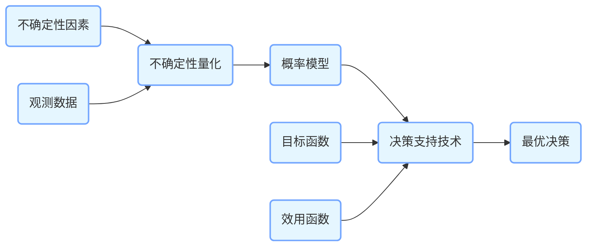

# 推理过程中的不确定性量化与决策支持技术

> 关键词：不确定性量化、推理过程、决策支持技术、概率模型、风险评估

> 摘要：本文聚焦于推理过程中的不确定性量化与决策支持技术，深入探讨了不确定性量化的原理、方法及其在决策支持中的关键作用。首先介绍了相关背景知识，包括目的范围、预期读者等内容。接着详细阐述了核心概念与联系，给出了相应的原理和架构示意图以及流程图。在核心算法原理部分，使用Python代码进行了详细阐述。同时，对涉及的数学模型和公式进行了讲解与举例说明。通过项目实战展示了代码实际案例及详细解释。分析了该技术的实际应用场景，推荐了相关的工具和资源。最后总结了未来发展趋势与挑战，并对常见问题进行了解答，提供了扩展阅读和参考资料，旨在为相关领域的研究和实践提供全面而深入的指导。

## 1. 背景介绍 
### 1.1 目的和范围
在众多实际应用场景中，推理过程往往伴随着各种不确定性因素。这些不确定性可能来自数据的不完整性、测量误差、模型的近似性等。不确定性量化的目的在于对这些不确定性进行精确的描述和度量，以便更好地理解推理结果的可靠性。决策支持技术则是基于不确定性量化的结果，为决策者提供合理的决策建议，帮助他们在充满不确定性的环境中做出更优的决策。

本文的范围涵盖了不确定性量化的基本概念、常用方法，以及如何将不确定性量化与决策支持技术相结合。同时，通过具体的项目实战案例展示了该技术在实际应用中的实现过程和效果。

### 1.2 预期读者
本文预期读者包括从事人工智能、机器学习、统计学、运筹学等领域的研究人员和工程师，以及对决策分析、风险管理等实际应用场景感兴趣的专业人士。对于希望深入了解推理过程中不确定性处理和决策优化的读者，本文将提供有价值的参考。

### 1.3 文档结构概述
本文首先介绍相关背景知识，为后续内容奠定基础。接着详细阐述核心概念与联系，帮助读者理解不确定性量化和决策支持技术的基本原理和相互关系。核心算法原理部分使用Python代码深入讲解具体算法。数学模型和公式部分给出理论依据并进行举例说明。项目实战部分展示实际代码案例和详细解释。实际应用场景部分分析该技术在不同领域的应用。工具和资源推荐部分为读者提供学习和实践的参考。最后总结未来发展趋势与挑战，解答常见问题，并提供扩展阅读和参考资料。

### 1.4 术语表
#### 1.4.1 核心术语定义
- **不确定性量化**：对推理过程中各种不确定性因素进行精确描述和度量的过程，通常使用概率分布等数学工具来表示不确定性。
- **决策支持技术**：基于不确定性量化的结果，为决策者提供决策建议的一系列方法和技术，旨在帮助决策者在不确定性环境中做出最优决策。
- **概率模型**：用于描述随机变量之间关系的数学模型，通过概率分布来表示不确定性。
- **风险评估**：对决策可能带来的风险进行评估和分析的过程，通常基于不确定性量化的结果进行。

#### 1.4.2 相关概念解释
- **随机变量**：取值具有随机性的变量，其取值由概率分布决定。
- **概率分布**：描述随机变量取值概率的函数，常见的概率分布包括正态分布、均匀分布、泊松分布等。
- **贝叶斯推理**：一种基于贝叶斯定理的推理方法，通过结合先验知识和观测数据来更新对未知参数的概率分布。

#### 1.4.3 缩略词列表
- **PDF**：概率密度函数（Probability Density Function）
- **CDF**：累积分布函数（Cumulative Distribution Function）
- **MCMC**：马尔可夫链蒙特卡罗（Markov Chain Monte Carlo）

## 2. 核心概念与联系 

### 不确定性量化的原理
不确定性量化的核心原理是使用概率模型来描述推理过程中的不确定性。在实际应用中，我们通常面临两种类型的不确定性：认知不确定性和随机不确定性。认知不确定性是由于我们对系统的不完全了解而产生的，例如模型参数的不确定性；随机不确定性是由于系统本身的随机性而产生的，例如测量误差。

通过概率模型，我们可以将这些不确定性表示为随机变量的概率分布。例如，对于一个未知的参数 $\theta$，我们可以用一个概率分布 $p(\theta)$ 来表示对它的不确定性。当有新的观测数据 $D$ 时，我们可以使用贝叶斯定理来更新这个概率分布：

$$p(\theta|D)=\frac{p(D|\theta)p(\theta)}{p(D)}$$

其中，$p(\theta|D)$ 是后验概率分布，表示在观测到数据 $D$ 后对参数 $\theta$ 的不确定性；$p(D|\theta)$ 是似然函数，表示在给定参数 $\theta$ 的情况下观测到数据 $D$ 的概率；$p(\theta)$ 是先验概率分布，表示在观测数据之前对参数 $\theta$ 的不确定性；$p(D)$ 是边缘似然，是一个归一化常数。

### 决策支持技术的原理
决策支持技术的核心原理是在不确定性环境中选择最优的决策方案。通常，我们需要定义一个目标函数来衡量不同决策方案的优劣，同时考虑不确定性因素对目标函数的影响。

一种常见的决策准则是期望效用最大化。假设我们有一个决策变量 $a$，一个状态变量 $s$，以及一个效用函数 $u(a,s)$ 表示在状态 $s$ 下选择决策 $a$ 的效用。由于状态 $s$ 通常是不确定的，我们可以使用概率分布 $p(s)$ 来表示对状态的不确定性。那么，选择决策 $a$ 的期望效用为：

$$E[u(a)]=\int u(a,s)p(s)ds$$

最优决策 $a^*$ 就是使得期望效用 $E[u(a)]$ 最大的决策：

$$a^*=\arg\max_a E[u(a)]$$

### 核心概念的架构示意图


这个架构示意图展示了不确定性量化与决策支持技术的核心流程。不确定性因素通过不确定性量化得到概率模型，概率模型为决策支持技术提供输入。观测数据用于更新概率模型，目标函数和效用函数则用于在决策支持技术中选择最优决策。

## 3. 核心算法原理 & 具体操作步骤 

### 蒙特卡罗采样算法
蒙特卡罗采样是一种常用的不确定性量化方法，它通过随机采样来估计概率分布的各种统计量。下面是一个使用Python实现的简单蒙特卡罗采样示例，用于估计正态分布的均值和方差。

```python
import numpy as np

# 定义正态分布的参数
mu = 0  # 均值
sigma = 1  # 标准差

# 采样次数
num_samples = 10000

# 进行蒙特卡罗采样
samples = np.random.normal(mu, sigma, num_samples)

# 计算样本均值和方差
sample_mean = np.mean(samples)
sample_var = np.var(samples)

print(f"估计的均值: {sample_mean}")
print(f"估计的方差: {sample_var}")
```

### 具体操作步骤
1. **确定概率分布**：首先需要确定要采样的概率分布，例如正态分布、均匀分布等。
2. **生成随机样本**：使用随机数生成器从确定的概率分布中生成大量的随机样本。
3. **计算统计量**：根据生成的随机样本，计算所需的统计量，例如均值、方差、中位数等。
4. **评估估计误差**：可以通过增加采样次数来减小估计误差，同时可以使用置信区间等方法来评估估计的可靠性。

### 贝叶斯推理算法
贝叶斯推理是一种基于贝叶斯定理的不确定性量化方法，它通过结合先验知识和观测数据来更新对未知参数的概率分布。下面是一个使用Python实现的简单贝叶斯推理示例，用于估计抛硬币正面朝上的概率。

```python
import numpy as np
import matplotlib.pyplot as plt

# 定义先验分布（均匀分布）
alpha = 1
beta = 1

# 观测数据（抛硬币结果）
num_heads = 3
num_tails = 2

# 更新后验分布
alpha_post = alpha + num_heads
beta_post = beta + num_tails

# 生成后验分布的样本
num_samples = 1000
samples = np.random.beta(alpha_post, beta_post, num_samples)

# 绘制后验分布的直方图
plt.hist(samples, bins=30, density=True)
plt.xlabel('概率')
plt.ylabel('密度')
plt.title('抛硬币正面朝上概率的后验分布')
plt.show()
```

### 具体操作步骤
1. **确定先验分布**：根据先验知识选择合适的先验分布，例如均匀分布、正态分布等。
2. **收集观测数据**：进行实验或收集相关数据，得到观测结果。
3. **更新后验分布**：使用贝叶斯定理结合先验分布和观测数据来更新对未知参数的概率分布。
4. **分析后验分布**：可以通过计算后验分布的统计量、绘制后验分布的图像等方法来分析后验分布，从而得到对未知参数的不确定性估计。

## 4. 数学模型和公式 & 详细讲解 & 举例说明 

### 概率分布的基本概念
概率分布是描述随机变量取值概率的函数。常见的概率分布包括离散概率分布和连续概率分布。

#### 离散概率分布
离散概率分布用于描述取值为离散值的随机变量。例如，抛硬币的结果（正面或反面）可以用伯努利分布来描述。伯努利分布的概率质量函数为：

$$P(X = k) = p^k(1 - p)^{1 - k}, k = 0, 1$$

其中，$X$ 是随机变量，$k$ 是取值，$p$ 是正面朝上的概率。

#### 连续概率分布
连续概率分布用于描述取值为连续值的随机变量。例如，正态分布是一种常见的连续概率分布，其概率密度函数为：

$$f(x)=\frac{1}{\sigma\sqrt{2\pi}}e^{-\frac{(x - \mu)^2}{2\sigma^2}}$$

其中，$x$ 是随机变量的取值，$\mu$ 是均值，$\sigma$ 是标准差。

### 贝叶斯定理
贝叶斯定理是贝叶斯推理的核心公式，它描述了如何根据先验知识和观测数据来更新对未知参数的概率分布。贝叶斯定理的公式为：

$$p(\theta|D)=\frac{p(D|\theta)p(\theta)}{p(D)}$$

其中，$p(\theta|D)$ 是后验概率分布，表示在观测到数据 $D$ 后对参数 $\theta$ 的不确定性；$p(D|\theta)$ 是似然函数，表示在给定参数 $\theta$ 的情况下观测到数据 $D$ 的概率；$p(\theta)$ 是先验概率分布，表示在观测数据之前对参数 $\theta$ 的不确定性；$p(D)$ 是边缘似然，是一个归一化常数。

### 举例说明
假设我们有一个抛硬币的实验，我们想估计硬币正面朝上的概率 $p$。在实验之前，我们对 $p$ 没有任何先验知识，因此可以假设 $p$ 服从均匀分布，即 $p(p) = 1, 0 \leq p \leq 1$。

现在我们进行了 5 次抛硬币实验，得到了 3 次正面和 2 次反面的结果。根据贝叶斯定理，我们可以计算 $p$ 的后验概率分布。

似然函数为：

$$p(D|p) = p^3(1 - p)^2$$

先验概率分布为：

$$p(p) = 1$$

边缘似然为：

$$p(D)=\int_0^1 p^3(1 - p)^2 dp=\frac{1}{60}$$

后验概率分布为：

$$p(p|D)=\frac{p(D|p)p(p)}{p(D)} = 60p^3(1 - p)^2$$

这是一个 Beta 分布，其参数为 $\alpha = 4$ 和 $\beta = 3$。

## 5. 项目实战：代码实际案例和详细解释说明 

### 5.1  开发环境搭建
在进行项目实战之前，需要搭建相应的开发环境。以下是一些基本的步骤：

1. **安装Python**：可以从Python官方网站（https://www.python.org/downloads/）下载并安装Python 3.x 版本。
2. **安装必要的库**：在项目中，我们将使用一些常见的Python库，例如 `numpy`、`matplotlib` 等。可以使用 `pip` 命令来安装这些库：

```sh
pip install numpy matplotlib
```

### 5.2  源代码详细实现和代码解读
以下是一个完整的项目实战案例，用于估计一个线性回归模型的参数，并考虑参数的不确定性。

```python
import numpy as np
import matplotlib.pyplot as plt
from scipy.stats import norm

# 生成模拟数据
np.random.seed(0)
true_slope = 2
true_intercept = 1
num_samples = 100
x = np.linspace(0, 10, num_samples)
y_true = true_slope * x + true_intercept
noise = np.random.normal(0, 1, num_samples)
y = y_true + noise

# 定义先验分布
prior_mean_slope = 0
prior_std_slope = 10
prior_mean_intercept = 0
prior_std_intercept = 10

# 定义似然函数
def likelihood(slope, intercept, x, y):
    y_pred = slope * x + intercept
    residuals = y - y_pred
    log_likelihood = np.sum(norm.logpdf(residuals, 0, 1))
    return log_likelihood

# 定义先验概率
def prior(slope, intercept):
    log_prior_slope = norm.logpdf(slope, prior_mean_slope, prior_std_slope)
    log_prior_intercept = norm.logpdf(intercept, prior_mean_intercept, prior_std_intercept)
    return log_prior_slope + log_prior_intercept

# 定义后验概率
def posterior(slope, intercept, x, y):
    log_likelihood = likelihood(slope, intercept, x, y)
    log_prior = prior(slope, intercept)
    return log_likelihood + log_prior

# 蒙特卡罗采样
num_samples_mcmc = 10000
slope_samples = np.zeros(num_samples_mcmc)
intercept_samples = np.zeros(num_samples_mcmc)
current_slope = prior_mean_slope
current_intercept = prior_mean_intercept
current_posterior = posterior(current_slope, current_intercept, x, y)

for i in range(num_samples_mcmc):
    proposed_slope = np.random.normal(current_slope, 0.1)
    proposed_intercept = np.random.normal(current_intercept, 0.1)
    proposed_posterior = posterior(proposed_slope, proposed_intercept, x, y)
    
    acceptance_ratio = np.exp(proposed_posterior - current_posterior)
    if np.random.uniform(0, 1) < acceptance_ratio:
        current_slope = proposed_slope
        current_intercept = proposed_intercept
        current_posterior = proposed_posterior
    
    slope_samples[i] = current_slope
    intercept_samples[i] = current_intercept

# 绘制后验分布
plt.figure(figsize=(12, 6))
plt.subplot(1, 2, 1)
plt.hist(slope_samples, bins=30, density=True)
plt.xlabel('斜率')
plt.ylabel('密度')
plt.title('斜率的后验分布')

plt.subplot(1, 2, 2)
plt.hist(intercept_samples, bins=30, density=True)
plt.xlabel('截距')
plt.ylabel('密度')
plt.title('截距的后验分布')

plt.show()
```

### 5.3  代码解读与分析
1. **数据生成**：首先生成了一组模拟数据，包括自变量 $x$、真实的因变量 $y_{true}$ 和加入噪声后的因变量 $y$。
2. **先验分布定义**：定义了斜率和截距的先验分布，使用正态分布来表示。
3. **似然函数定义**：定义了似然函数，用于计算在给定参数下观测到数据的概率。
4. **先验概率和后验概率定义**：定义了先验概率和后验概率，后验概率是似然函数和先验概率的乘积。
5. **蒙特卡罗采样**：使用马尔可夫链蒙特卡罗（MCMC）方法进行采样，得到斜率和截距的后验分布样本。
6. **结果可视化**：绘制了斜率和截距的后验分布直方图，直观地展示了参数的不确定性。

## 6. 实际应用场景 
### 金融领域
在金融领域，不确定性量化和决策支持技术有着广泛的应用。例如，在投资决策中，投资者需要考虑市场的不确定性，包括股票价格的波动、利率的变化等。通过不确定性量化，可以对这些不确定性进行建模，计算投资组合的风险和收益的概率分布。决策支持技术可以帮助投资者根据自己的风险偏好选择最优的投资组合。

### 医疗领域
在医疗领域，不确定性量化和决策支持技术可以用于疾病诊断、治疗方案选择等方面。例如，在疾病诊断中，医生需要根据患者的症状、检查结果等信息来判断患者是否患有某种疾病。由于这些信息存在不确定性，通过不确定性量化可以对诊断结果的不确定性进行评估。决策支持技术可以帮助医生根据患者的具体情况选择最优的治疗方案。

### 工程领域
在工程领域，不确定性量化和决策支持技术可以用于结构可靠性分析、系统优化等方面。例如，在桥梁设计中，工程师需要考虑各种不确定性因素，如材料性能的不确定性、荷载的不确定性等。通过不确定性量化，可以对桥梁的可靠性进行评估，决策支持技术可以帮助工程师选择最优的设计方案，以确保桥梁的安全性和经济性。

## 7. 工具和资源推荐
### 7.1 学习资源推荐
#### 7.1.1 书籍推荐
- 《概率论与数理统计》：这本书系统地介绍了概率论和数理统计的基本概念、方法和应用，是学习不确定性量化的基础书籍。
- 《贝叶斯数据分析》：详细介绍了贝叶斯推理的原理、方法和应用，对于深入理解不确定性量化和决策支持技术非常有帮助。
- 《决策分析原理与应用》：讲解了决策分析的基本原理和方法，以及如何在不确定性环境中做出最优决策。

#### 7.1.2 在线课程
- Coursera上的“Probabilistic Graphical Models”：该课程介绍了概率图模型的基本概念和算法，是学习不确定性量化的重要课程。
- edX上的“Bayesian Methods for Machine Learning”：课程深入讲解了贝叶斯方法在机器学习中的应用，对于理解贝叶斯推理和不确定性量化有很大帮助。

#### 7.1.3 技术博客和网站
- Towards Data Science：这是一个专注于数据科学和机器学习的技术博客，上面有很多关于不确定性量化和决策支持技术的文章和教程。
- arXiv：一个预印本数据库，上面有很多最新的关于不确定性量化和决策支持技术的研究论文。

### 7.2 开发工具框架推荐
#### 7.2.1 IDE和编辑器
- PyCharm：一款功能强大的Python集成开发环境，提供了丰富的代码编辑、调试和版本控制等功能。
- Jupyter Notebook：一个交互式的开发环境，非常适合进行数据分析和模型实验，方便代码的展示和分享。

#### 7.2.2 调试和性能分析工具
- PDB：Python自带的调试器，可以帮助开发者定位代码中的问题。
- cProfile：Python的性能分析工具，可以帮助开发者分析代码的性能瓶颈。

#### 7.2.3 相关框架和库
- PyMC3：一个用于贝叶斯统计建模和概率编程的Python库，提供了丰富的概率分布和采样算法。
- TensorFlow Probability：一个基于TensorFlow的概率编程库，支持大规模的概率模型训练和推理。

### 7.3 相关论文著作推荐
#### 7.3.1 经典论文
- “Bayesian Data Analysis” by Andrew Gelman et al.：这篇论文是贝叶斯数据分析领域的经典之作，系统地介绍了贝叶斯推理的理论和方法。
- “Decision Analysis: A Bayesian Approach” by Ronald A. Howard：该论文奠定了决策分析的理论基础，详细介绍了决策分析的基本原理和方法。

#### 7.3.2 最新研究成果
- “Uncertainty Quantification in Machine Learning” by Yarin Gal：这篇论文探讨了机器学习中的不确定性量化问题，提出了一些新的方法和技术。
- “Robust Decision Making under Uncertainty” by Benjamín T. Bauch：该论文研究了在不确定性环境下的鲁棒决策问题，提出了一些新的决策准则和算法。

#### 7.3.3 应用案例分析
- “Uncertainty Quantification in Financial Risk Management” by Peter J. Huber：该论文分析了不确定性量化在金融风险管理中的应用案例，展示了如何使用不确定性量化和决策支持技术来管理金融风险。
- “Medical Decision Making under Uncertainty” by Mark A. Hlatky：这篇论文介绍了不确定性量化和决策支持技术在医疗决策中的应用案例，为医疗领域的决策提供了有益的参考。

## 8. 总结：未来发展趋势与挑战
### 未来发展趋势
- **多学科融合**：不确定性量化和决策支持技术将与人工智能、机器学习、统计学、运筹学等多个学科进一步融合，形成更加综合和强大的技术体系。
- **实时决策支持**：随着计算能力的不断提高和数据处理技术的发展，未来的决策支持系统将能够实现实时的不确定性量化和决策建议，为决策者提供更加及时和准确的支持。
- **复杂系统应用**：将更多地应用于复杂系统的分析和决策，如交通系统、能源系统、生态系统等，帮助解决这些系统中的不确定性和决策难题。

### 挑战
- **数据质量和数量**：不确定性量化和决策支持技术需要大量高质量的数据作为输入，但在实际应用中，数据往往存在不完整、不准确等问题，这给技术的应用带来了挑战。
- **模型复杂度**：随着系统的复杂性增加，不确定性量化和决策支持模型的复杂度也会相应增加，这使得模型的训练和求解变得更加困难。
- **解释性和可信赖性**：在实际应用中，决策者需要了解决策建议的依据和不确定性来源，因此模型的解释性和可信赖性是未来需要解决的重要问题。

## 9. 附录：常见问题与解答
### 问题1：不确定性量化和传统的统计分析有什么区别？
不确定性量化更强调对不确定性的精确描述和度量，通常使用概率模型来表示不确定性。而传统的统计分析主要关注数据的均值、方差等统计量，对不确定性的处理相对较为简单。

### 问题2：如何选择合适的概率分布来表示不确定性？
选择合适的概率分布需要考虑数据的特点和实际应用场景。常见的概率分布有正态分布、均匀分布、泊松分布等。可以通过对数据的分析和先验知识来选择合适的概率分布。

### 问题3：决策支持技术在实际应用中如何考虑决策者的偏好？
可以通过定义效用函数来考虑决策者的偏好。效用函数可以根据决策者的风险偏好、目标等因素进行设计，使得决策支持技术能够为不同的决策者提供个性化的决策建议。

## 10. 扩展阅读 & 参考资料
### 扩展阅读
- “Probabilistic Machine Learning: An Introduction” by Kevin P. Murphy：这本书深入介绍了概率机器学习的基本概念和方法，对于进一步理解不确定性量化和决策支持技术有很大帮助。
- “Risk Analysis and Decision Making under Uncertainty” by Michael D. Shields：该书详细介绍了风险分析和在不确定性环境下的决策方法，提供了很多实际应用案例。

### 参考资料
- Gelman, A., Carlin, J. B., Stern, H. S., Dunson, D. B., Vehtari, A., & Rubin, D. B. (2013). Bayesian data analysis (Third Edition). CRC Press.
- Howard, R. A. (1966). Decision analysis: Applied decision theory. In Proceedings of the Fourth International Conference on Operational Research.
- Gal, Y. (2016). Uncertainty in deep learning. University of Cambridge.