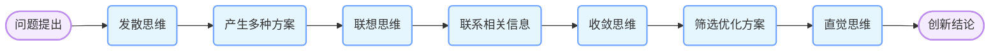

# 推理过程中的创新思维模式识别与培养

> 关键词：推理过程、创新思维模式、模式识别、思维培养、认知心理学、人工智能、创造力

> 摘要：本文聚焦于推理过程中的创新思维模式，旨在深入探讨其识别与培养方法。首先介绍了相关背景知识，包括研究目的、预期读者和文档结构等。接着阐述了创新思维模式的核心概念与联系，通过文本示意图和 Mermaid 流程图进行形象展示。详细讲解了核心算法原理，结合 Python 代码说明。引入数学模型和公式进行理论剖析，并举例说明。通过项目实战，提供代码案例及详细解释。探讨了实际应用场景，推荐了相关工具和资源。最后总结未来发展趋势与挑战，解答常见问题并给出扩展阅读和参考资料，为提升创新思维能力提供全面且深入的指导。

## 1. 背景介绍 
### 1.1 目的和范围
在当今快速发展的时代，创新已成为推动各个领域进步的关键因素。推理过程中的创新思维模式对于解决复杂问题、创造新的知识和技术具有至关重要的作用。本研究的目的在于深入理解创新思维模式在推理过程中的表现形式、内在机制，以及如何有效地识别和培养这些模式。研究范围涵盖了认知心理学、人工智能、教育等多个领域，旨在综合多学科的理论和方法，为创新思维的研究和实践提供全面的视角。

### 1.2 预期读者
本文预期读者包括从事认知科学、人工智能、教育等领域的研究人员和学者，他们可以从理论和方法的角度深入探讨创新思维模式。对于企业中的创新团队、产品研发人员等实践工作者，本文提供的创新思维培养方法和实际应用案例具有一定的指导意义。此外，对创新思维感兴趣的普通读者也可以通过阅读本文，了解创新思维的基本原理和培养途径，提升自身的创新能力。

### 1.3 文档结构概述
本文共分为十个部分。第一部分为背景介绍，阐述研究目的、预期读者和文档结构等。第二部分介绍创新思维模式的核心概念与联系，通过文本示意图和 Mermaid 流程图进行说明。第三部分讲解核心算法原理，结合 Python 代码详细阐述。第四部分引入数学模型和公式进行理论分析，并举例说明。第五部分通过项目实战，提供代码案例及详细解释。第六部分探讨实际应用场景。第七部分推荐相关工具和资源，包括学习资源、开发工具框架和相关论文著作。第八部分总结未来发展趋势与挑战。第九部分为附录，解答常见问题。第十部分提供扩展阅读和参考资料。

### 1.4 术语表
#### 1.4.1 核心术语定义
- **创新思维模式**：指在推理过程中，个体运用独特、新颖的方式进行思考和解决问题的思维方式和行为模式。
- **推理过程**：指个体从已知信息出发，通过逻辑推导、分析、综合等方式得出结论的思维过程。
- **模式识别**：指对事物的特征、规律和模式进行感知、分析和判断的过程。
- **思维培养**：指通过教育、训练、实践等方式，促进个体思维能力的发展和提升的过程。

#### 1.4.2 相关概念解释
- **认知心理学**：研究人类认知过程的心理学分支，包括感知、注意、记忆、思维等方面，为理解创新思维模式提供理论基础。
- **人工智能**：研究如何使计算机模拟人类智能的技术领域，其中的机器学习、深度学习等方法可用于创新思维模式的识别和分析。
- **创造力**：指个体产生新颖、独特且有价值的想法、产品或解决方案的能力，与创新思维模式密切相关。

#### 1.4.3 缩略词列表
- **AI**：Artificial Intelligence，人工智能
- **ML**：Machine Learning，机器学习
- **DL**：Deep Learning，深度学习

## 2. 核心概念与联系 

### 创新思维模式的核心概念
创新思维模式是一种复杂的认知现象，它涉及到多个方面的心理过程和认知机制。从认知心理学的角度来看，创新思维模式包括发散思维、收敛思维、联想思维、直觉思维等多种思维方式。发散思维是指从一个问题出发，尽可能地产生多种不同的想法和解决方案；收敛思维则是指对发散产生的想法进行筛选、整合，找到最适合的解决方案。联想思维是指通过将不同的事物、概念联系起来，产生新的想法和创意；直觉思维则是指在没有明确的逻辑推理过程的情况下，直接得出结论的思维方式。

### 创新思维模式与推理过程的联系
创新思维模式在推理过程中起着重要的作用。在推理的初始阶段，发散思维可以帮助我们从不同的角度思考问题，发现更多的潜在信息和解决途径。例如，在解决一个数学问题时，通过发散思维，我们可以尝试不同的解题方法和思路。在推理的中间阶段，联想思维可以帮助我们将已有的知识和经验与当前的问题联系起来，为解决问题提供新的线索和启示。在推理的最后阶段，收敛思维和直觉思维可以帮助我们对各种想法和方案进行评估和选择，得出最终的结论。

### 文本示意图
创新思维模式与推理过程的关系可以用以下文本示意图表示：

推理过程始于问题的提出，在这个阶段，发散思维发挥作用，产生大量的可能解决方案。随着推理的进行，联想思维将不同的概念和信息联系起来，丰富了推理的内容。在推理的后期，收敛思维对各种方案进行筛选和优化，直觉思维则在关键时刻提供快速的判断。最终，得出创新的结论。

### Mermaid 流程图


## 3. 核心算法原理 & 具体操作步骤 

### 创新思维模式识别的核心算法原理
创新思维模式的识别可以借助机器学习和自然语言处理的方法。一种常用的方法是基于特征提取和分类器的方法。首先，从文本、行为等数据中提取与创新思维模式相关的特征，例如词汇的多样性、句子的结构、思维的跳跃性等。然后，使用分类器对提取的特征进行分类，判断其属于哪种创新思维模式。

### 具体操作步骤
1. **数据收集**：收集与推理过程相关的数据，例如会议记录、讨论文本、实验报告等。
2. **数据预处理**：对收集到的数据进行清洗、分词、去除停用词等预处理操作，以便后续的特征提取。
3. **特征提取**：从预处理后的数据中提取与创新思维模式相关的特征。例如，可以使用词频 - 逆文档频率（TF - IDF）算法提取文本的关键词特征，使用句法分析提取句子的结构特征。
4. **分类器训练**：选择合适的分类器，如支持向量机（SVM）、决策树等，使用提取的特征对分类器进行训练。
5. **模式识别**：使用训练好的分类器对新的数据进行分类，识别其中的创新思维模式。

### Python 源代码实现
```python
import pandas as pd
from sklearn.feature_extraction.text import TfidfVectorizer
from sklearn.svm import SVC
from sklearn.model_selection import train_test_split
from sklearn.metrics import accuracy_score

# 数据收集和预处理
data = pd.read_csv('innovation_data.csv')
X = data['text']
y = data['pattern']

# 特征提取
vectorizer = TfidfVectorizer()
X_features = vectorizer.fit_transform(X)

# 数据集划分
X_train, X_test, y_train, y_test = train_test_split(X_features, y, test_size=0.2, random_state=42)

# 分类器训练
clf = SVC()
clf.fit(X_train, y_train)

# 模式识别
y_pred = clf.predict(X_test)

# 评估模型
accuracy = accuracy_score(y_test, y_pred)
print(f"模型准确率: {accuracy}")
```

## 4. 数学模型和公式 & 详细讲解 & 举例说明 

### 词频 - 逆文档频率（TF - IDF）模型
词频 - 逆文档频率（TF - IDF）是一种常用的文本特征提取方法，用于衡量一个词在文档中的重要性。其数学公式如下：

$$TF - IDF(t, d, D) = TF(t, d) \times IDF(t, D)$$

其中：
- $TF(t, d)$ 表示词 $t$ 在文档 $d$ 中的词频，即词 $t$ 在文档 $d$ 中出现的次数除以文档 $d$ 中词的总数。
- $IDF(t, D)$ 表示词 $t$ 的逆文档频率，计算公式为：

$$IDF(t, D) = \log\frac{N}{n_t + 1}$$

其中 $N$ 是文档集合 $D$ 中的文档总数，$n_t$ 是包含词 $t$ 的文档数。

### 详细讲解
词频（TF）反映了一个词在文档中的出现频率，出现频率越高，说明该词在文档中越重要。逆文档频率（IDF）反映了一个词在整个文档集合中的普遍程度，一个词在越多的文档中出现，其逆文档频率越低，说明该词的区分度越低。TF - IDF 综合考虑了词频和逆文档频率，能够更好地反映一个词在文档中的重要性。

### 举例说明
假设有一个文档集合 $D$ 包含三个文档：
- $d_1$: "创新思维是解决问题的关键"
- $d_2$: "创新思维需要不断培养"
- $d_3$: "解决问题需要方法和技巧"

计算词 "创新思维" 的 TF - IDF 值：
- 文档总数 $N = 3$。
- 包含词 "创新思维" 的文档数 $n_{创新思维} = 2$。
- 在文档 $d_1$ 中，词 "创新思维" 的词频 $TF(创新思维, d_1)=\frac{1}{6}$。
- 逆文档频率 $IDF(创新思维, D)=\log\frac{3}{2 + 1}=\log1 = 0$。
- 则词 "创新思维" 在文档 $d_1$ 中的 TF - IDF 值为 $TF - IDF(创新思维, d_1, D)=\frac{1}{6} \times 0 = 0$。

## 5. 项目实战：代码实际案例和详细解释说明 

### 5.1  开发环境搭建
- **操作系统**：Windows 10 或 Ubuntu 18.04 及以上版本。
- **Python 版本**：Python 3.7 及以上版本。
- **开发工具**：PyCharm 或 VS Code。
- **依赖库**：安装 pandas、scikit - learn 等库，可以使用以下命令进行安装：
```bash
pip install pandas scikit-learn
```

### 5.2  源代码详细实现和代码解读
```python
import pandas as pd
from sklearn.feature_extraction.text import TfidfVectorizer
from sklearn.svm import SVC
from sklearn.model_selection import train_test_split
from sklearn.metrics import accuracy_score

# 数据收集和预处理
# 读取包含文本和创新思维模式标签的数据文件
data = pd.read_csv('innovation_data.csv')
# 提取文本数据
X = data['text']
# 提取标签数据
y = data['pattern']

# 特征提取
# 创建 TfidfVectorizer 对象，用于将文本转换为特征向量
vectorizer = TfidfVectorizer()
# 对文本数据进行特征提取
X_features = vectorizer.fit_transform(X)

# 数据集划分
# 将数据集划分为训练集和测试集，测试集占比 20%
X_train, X_test, y_train, y_test = train_test_split(X_features, y, test_size=0.2, random_state=42)

# 分类器训练
# 创建支持向量机分类器对象
clf = SVC()
# 使用训练集对分类器进行训练
clf.fit(X_train, y_train)

# 模式识别
# 使用训练好的分类器对测试集进行预测
y_pred = clf.predict(X_test)

# 评估模型
# 计算模型的准确率
accuracy = accuracy_score(y_test, y_pred)
print(f"模型准确率: {accuracy}")
```

### 5.3  代码解读与分析
1. **数据收集和预处理**：使用 `pandas` 库读取包含文本和标签的数据文件，提取文本数据和标签数据。
2. **特征提取**：使用 `TfidfVectorizer` 类将文本数据转换为特征向量，以便后续的机器学习算法处理。
3. **数据集划分**：使用 `train_test_split` 函数将数据集划分为训练集和测试集，方便对模型进行评估。
4. **分类器训练**：使用支持向量机（SVM）分类器对训练集进行训练，学习文本特征与创新思维模式之间的关系。
5. **模式识别**：使用训练好的分类器对测试集进行预测，得到预测结果。
6. **评估模型**：使用 `accuracy_score` 函数计算模型的准确率，评估模型的性能。

## 6. 实际应用场景 
### 教育领域
在教育领域，创新思维模式的识别与培养可以帮助教师更好地了解学生的思维特点和创新能力。通过分析学生的课堂发言、作业、考试等数据，识别学生的创新思维模式，为教师提供个性化的教学建议。例如，对于具有发散思维的学生，可以提供更多的开放性问题和项目，鼓励他们发挥创造力；对于具有收敛思维的学生，可以提供更多的结构化学习任务，帮助他们提高逻辑推理能力。

### 企业创新
在企业创新过程中，创新思维模式的识别与培养可以帮助企业发现和培养创新人才，提高企业的创新能力。通过分析员工的会议记录、项目报告、创意提案等数据，识别员工的创新思维模式，为企业的人才选拔、团队组建和项目分配提供依据。例如，将具有不同创新思维模式的员工组成创新团队，发挥他们的优势，提高团队的创新效率。

### 科学研究
在科学研究中，创新思维模式的识别与培养可以帮助科学家更好地进行科学探索和发现。通过分析科研人员的研究论文、实验报告、学术讨论等数据，识别科研人员的创新思维模式，为科研团队的合作和科研项目的开展提供指导。例如，在跨学科研究中，将具有不同创新思维模式的科研人员组合在一起，促进不同学科之间的交流和融合，推动科学研究的创新发展。

## 7. 工具和资源推荐
### 7.1 学习资源推荐
#### 7.1.1 书籍推荐
- 《创新思维训练》：系统介绍了创新思维的基本原理和训练方法，提供了丰富的案例和练习。
- 《思考，快与慢》：从认知心理学的角度探讨了人类的思维方式，对理解创新思维的内在机制有很大帮助。
- 《创造力：心流与创新心理学》：深入研究了创造力的本质和影响因素，提供了培养创造力的方法和策略。

#### 7.1.2 在线课程
- Coursera 上的“创新思维与创造力”课程：由知名教授授课，介绍了创新思维的理论和实践方法。
- edX 上的“认知心理学与创新思维”课程：结合认知心理学的知识，讲解创新思维的形成和发展机制。
- 中国大学 MOOC 上的“创新方法与实践”课程：提供了创新方法的具体应用案例和实践指导。

#### 7.1.3 技术博客和网站
- 开源中国：提供了大量的技术文章和案例，涉及人工智能、机器学习等领域，对创新思维模式的研究有一定的参考价值。
- 博客园：汇集了众多开发者的技术博客，分享了创新思维在实际项目中的应用经验。
- 知乎：有很多关于创新思维的讨论和问答，用户可以从中获取不同的观点和思路。

### 7.2 开发工具框架推荐
#### 7.2.1 IDE和编辑器
- PyCharm：功能强大的 Python 集成开发环境，提供了代码编辑、调试、版本控制等功能，方便开发创新思维模式识别相关的程序。
- VS Code：轻量级的代码编辑器，支持多种编程语言和插件，可用于快速开发和调试代码。

#### 7.2.2 调试和性能分析工具
- PDB：Python 自带的调试工具，可用于调试 Python 代码，帮助开发者定位和解决问题。
- cProfile：Python 的性能分析工具，可用于分析代码的性能瓶颈，优化代码性能。

#### 7.2.3 相关框架和库
- scikit - learn：强大的机器学习库，提供了多种分类、聚类、回归等算法，可用于创新思维模式的识别和分析。
- NLTK：自然语言处理工具包，提供了文本处理、词性标注、句法分析等功能，可用于创新思维模式相关文本数据的处理。

### 7.3 相关论文著作推荐
#### 7.3.1 经典论文
- "The Structure of Scientific Revolutions" by Thomas S. Kuhn：探讨了科学革命的结构和机制，对理解创新思维在科学研究中的作用有重要意义。
- "Creativity and Problem Solving in Engineering Design" by Nigel Cross：研究了工程设计中的创造力和问题解决方法，为创新思维在工程领域的应用提供了理论支持。

#### 7.3.2 最新研究成果
- 近年来关于认知神经科学、人工智能等领域的研究成果，如利用 fMRI 技术研究创新思维的神经机制，利用深度学习算法进行创新思维模式的识别等。

#### 7.3.3 应用案例分析
- 分析谷歌、苹果等科技公司的创新案例，研究它们在产品研发、团队管理等方面的创新思维模式和实践经验。

## 8. 总结：未来发展趋势与挑战
### 未来发展趋势
- **跨学科融合**：创新思维模式的研究将越来越多地与认知科学、神经科学、人工智能等学科进行融合，从多个角度深入理解创新思维的本质和机制。
- **个性化培养**：借助大数据和人工智能技术，实现对个体创新思维模式的精准识别和个性化培养，提高创新思维培养的效果和效率。
- **智能化应用**：创新思维模式识别技术将在更多领域得到智能化应用，如智能教育、智能医疗、智能金融等，推动各领域的创新发展。

### 挑战
- **数据隐私和安全**：在收集和分析与创新思维模式相关的数据时，需要保护用户的隐私和数据安全，避免数据泄露和滥用。
- **模型解释性**：目前的机器学习和深度学习模型大多是黑盒模型，缺乏解释性，难以理解模型的决策过程和依据，这给创新思维模式的识别和应用带来了一定的困难。
- **文化差异**：不同文化背景下的创新思维模式可能存在差异，如何在跨文化的环境中准确识别和培养创新思维模式是一个亟待解决的问题。

## 9. 附录：常见问题与解答
### 问题 1：创新思维模式识别的准确率有多高？
创新思维模式识别的准确率受到多种因素的影响，如数据质量、特征提取方法、分类器选择等。一般来说，通过合理选择特征和分类器，优化模型参数，可以达到较高的准确率。但由于创新思维模式的复杂性和多样性，目前还难以达到 100% 的准确率。

### 问题 2：如何培养创新思维能力？
培养创新思维能力可以从多个方面入手，如学习创新思维的理论和方法，参加创新实践活动，与不同背景的人交流合作，培养好奇心和探索精神等。同时，还可以借助一些创新思维训练工具和资源，如创新思维游戏、在线课程等。

### 问题 3：创新思维模式识别技术在实际应用中存在哪些问题？
创新思维模式识别技术在实际应用中存在一些问题，如数据获取困难、数据标注成本高、模型泛化能力不足等。此外，由于创新思维模式的主观性和多样性，不同的人对创新思维模式的理解和判断可能存在差异，这也给模式识别带来了一定的挑战。

## 10. 扩展阅读 & 参考资料
### 扩展阅读
- 《创新者的窘境》：探讨了企业在创新过程中面临的挑战和困境，以及如何应对这些挑战。
- 《从 0 到 1》：介绍了创业公司如何实现从无到有的创新和突破。

### 参考资料
- 相关学术期刊和会议论文，如《Journal of Creative Behavior》《Proceedings of the ACM SIGKDD Conference on Knowledge Discovery and Data Mining》等。
- 政府报告和行业研究报告，如《国家创新驱动发展战略纲要》《全球创新指数报告》等。