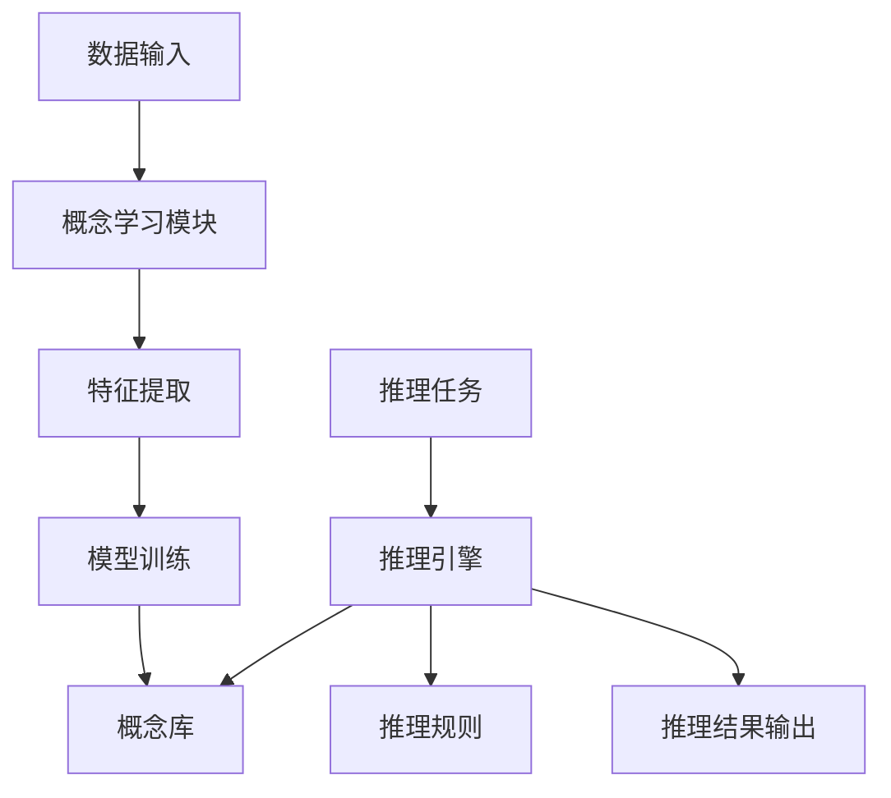

# 推理过程中的概念学习与应用

> 关键词：推理过程、概念学习、概念应用、认知模型、知识表示

> 摘要：本文深入探讨了推理过程中的概念学习与应用这一核心主题。首先介绍了相关的背景知识，包括目的、预期读者、文档结构和术语表等。接着详细阐述了核心概念及其联系，通过文本示意图和 Mermaid 流程图进行直观呈现。在核心算法原理部分，运用 Python 源代码展开讲解。对于数学模型和公式，进行了详细说明并举例。通过项目实战，展示了代码实现和解读。分析了实际应用场景，推荐了学习资源、开发工具框架以及相关论文著作。最后总结了未来发展趋势与挑战，还提供了常见问题解答和扩展阅读参考资料，旨在为读者全面深入地理解推理过程中的概念学习与应用提供有价值的内容。

## 1. 背景介绍 
### 1.1 目的和范围
推理是人类智能的重要组成部分，在各个领域都有着广泛的应用，如科学研究、决策制定、自然语言处理等。概念学习与应用是推理过程中的关键环节，理解和掌握它们对于提高推理能力、实现人工智能系统的高效运行具有重要意义。本文的目的在于全面深入地探讨推理过程中概念学习与应用的原理、方法和技术，涵盖从基本概念的阐述到实际应用案例的分析，以及相关工具和资源的推荐等方面，为读者提供一个系统的知识体系。

### 1.2 预期读者
本文预期读者包括对人工智能、认知科学、机器学习等领域感兴趣的研究人员、学生，以及从事相关技术开发的工程师和程序员。对于希望深入了解推理机制、提升自身推理能力和开发智能系统的人士都具有参考价值。

### 1.3 文档结构概述
本文将按照以下结构进行阐述：首先介绍相关背景知识，包括目的、读者群体、文档结构和术语表；接着详细讲解核心概念及其联系，通过直观的示意图和流程图展示；然后深入探讨核心算法原理，并给出具体操作步骤的 Python 源代码；随后介绍数学模型和公式，并举例说明；通过项目实战展示代码实现和详细解读；分析实际应用场景；推荐相关的学习资源、开发工具框架和论文著作；最后总结未来发展趋势与挑战，提供常见问题解答和扩展阅读参考资料。

### 1.4 术语表
#### 1.4.1 核心术语定义
- **推理过程**：指从已知信息出发，通过一定的逻辑规则和方法得出结论的过程。
- **概念学习**：是指从数据或经验中获取概念的过程，包括概念的定义、特征提取等。
- **概念应用**：将所学的概念应用到具体的推理任务中，以实现问题的解决。
- **认知模型**：用于描述人类认知过程和机制的模型，在推理过程中起着重要作用。
- **知识表示**：将知识以某种形式进行表示，以便计算机能够处理和利用。

#### 1.4.2 相关概念解释
- **归纳推理**：从个别事例中概括出一般结论的推理方法。
- **演绎推理**：从一般原理推出个别结论的推理方法。
- **概念层次结构**：概念之间存在的一种层次关系，如动物 - 哺乳动物 - 猫等。
- **特征向量**：用于表示概念特征的向量，在机器学习中常用于概念的表示和分类。

#### 1.4.3 缩略词列表
- **AI**：Artificial Intelligence，人工智能
- **ML**：Machine Learning，机器学习
- **NLP**：Natural Language Processing，自然语言处理

## 2. 核心概念与联系 

### 核心概念原理
推理过程是一个复杂的认知活动，它依赖于已有的知识和概念。概念学习是获取这些知识和概念的重要途径，通过对大量数据的分析和处理，提取出具有代表性的特征，从而形成概念。概念学习可以分为有监督学习和无监督学习等不同方式。有监督学习是在已知标签的情况下进行学习，通过训练数据来调整模型参数，以实现对概念的准确分类；无监督学习则是在没有标签的情况下，通过数据的内在结构来发现概念。

概念应用则是将所学的概念运用到具体的推理任务中。在推理过程中，根据问题的描述，从已有的概念库中选取合适的概念，并通过一定的推理规则进行组合和推导，得出结论。例如，在医疗诊断中，医生根据患者的症状（问题描述），结合所学的医学知识（概念），运用医学推理规则（推理规则），对患者的疾病进行诊断（得出结论）。

### 架构的文本示意图
推理过程中的概念学习与应用架构可以描述为：数据输入经过概念学习模块，该模块包括特征提取、模型训练等子模块，学习得到的概念存储在概念库中。当有推理任务时，推理引擎从概念库中选取相关概念，并结合推理规则进行推理，最终输出推理结果。

### Mermaid 流程图


## 3. 核心算法原理 & 具体操作步骤 

### 核心算法原理
在概念学习中，常用的算法有决策树算法、支持向量机算法、神经网络算法等。这里以决策树算法为例进行说明。决策树是一种基于树结构进行决策的算法，它通过对数据的属性进行划分，构建出一棵决策树。每个内部节点表示一个属性上的测试，每个分支表示一个测试输出，每个叶节点表示一个类别或值。

### 具体操作步骤及 Python 源代码
以下是一个使用 Python 的 `scikit-learn` 库实现决策树分类的示例代码：
```python
from sklearn.datasets import load_iris
from sklearn.model_selection import train_test_split
from sklearn.tree import DecisionTreeClassifier
from sklearn.metrics import accuracy_score

# 加载数据集
iris = load_iris()
X = iris.data  # 特征数据
y = iris.target  # 标签数据

# 划分训练集和测试集
X_train, X_test, y_train, y_test = train_test_split(X, y, test_size=0.3, random_state=42)

# 创建决策树分类器
clf = DecisionTreeClassifier()

# 训练模型
clf.fit(X_train, y_train)

# 预测
y_pred = clf.predict(X_test)

# 计算准确率
accuracy = accuracy_score(y_test, y_pred)
print(f"Accuracy: {accuracy}")
```
### 代码解释
1. **数据加载**：使用 `load_iris` 函数加载鸢尾花数据集，该数据集包含 150 个样本，每个样本有 4 个特征和 1 个类别标签。
2. **数据划分**：使用 `train_test_split` 函数将数据集划分为训练集和测试集，测试集占总数据的 30%。
3. **模型创建**：创建一个 `DecisionTreeClassifier` 对象作为决策树分类器。
4. **模型训练**：使用 `fit` 方法对决策树分类器进行训练，将训练集的特征数据和标签数据作为输入。
5. **预测**：使用 `predict` 方法对测试集的特征数据进行预测，得到预测结果。
6. **准确率计算**：使用 `accuracy_score` 函数计算预测结果的准确率，即预测正确的样本数占总样本数的比例。

## 4. 数学模型和公式 & 详细讲解 & 举例说明 

### 信息熵
在决策树算法中，信息熵是一个重要的概念，用于衡量数据的不确定性。信息熵的计算公式为：
$$H(X)=-\sum_{i=1}^{n}p(x_i)\log_2p(x_i)$$
其中，$X$ 是一个随机变量，$p(x_i)$ 是 $X$ 取值为 $x_i$ 的概率，$n$ 是 $X$ 可能取值的个数。

### 详细讲解
信息熵的值越大，表示数据的不确定性越大；信息熵的值越小，表示数据的不确定性越小。在决策树的构建过程中，我们希望通过对属性的划分，使得划分后的子集的信息熵尽可能小，即数据的不确定性尽可能小。

### 举例说明
假设有一个数据集，包含 10 个样本，其中 6 个样本属于类别 A，4 个样本属于类别 B。则该数据集的信息熵为：
$$H(X)=-\left(\frac{6}{10}\log_2\frac{6}{10}+\frac{4}{10}\log_2\frac{4}{10}\right)\approx 0.971$$

### 信息增益
信息增益是决策树算法中用于选择最优划分属性的指标，它表示划分前后信息熵的减少量。信息增益的计算公式为：
$$Gain(D,a)=H(D)-\sum_{v=1}^{V}\frac{|D^v|}{|D|}H(D^v)$$
其中，$D$ 是数据集，$a$ 是划分属性，$V$ 是属性 $a$ 可能取值的个数，$D^v$ 是属性 $a$ 取值为 $v$ 的样本子集，$|D|$ 和 $|D^v|$ 分别表示数据集 $D$ 和子集 $D^v$ 的样本数。

### 举例说明
假设有一个属性 $a$，它有两个取值 $v_1$ 和 $v_2$，划分后 $D^{v_1}$ 包含 4 个样本，其中 3 个属于类别 A，1 个属于类别 B；$D^{v_2}$ 包含 6 个样本，其中 3 个属于类别 A，3 个属于类别 B。则 $H(D^{v_1})=-\left(\frac{3}{4}\log_2\frac{3}{4}+\frac{1}{4}\log_2\frac{1}{4}\right)\approx 0.811$，$H(D^{v_2})=-\left(\frac{3}{6}\log_2\frac{3}{6}+\frac{3}{6}\log_2\frac{3}{6}\right)=1$。
$$Gain(D,a)=0.971-\left(\frac{4}{10}\times 0.811+\frac{6}{10}\times 1\right)\approx 0.134$$

## 5. 项目实战：代码实际案例和详细解释说明 

### 5.1  开发环境搭建
- **Python 安装**：确保系统中安装了 Python 3.x 版本，可以从 Python 官方网站（https://www.python.org/downloads/）下载并安装。
- **库安装**：使用 `pip` 命令安装所需的库，如 `scikit-learn`、`numpy`、`pandas` 等。示例命令：
```sh
pip install scikit-learn numpy pandas
```

### 5.2  源代码详细实现和代码解读
以下是一个更复杂的项目实战示例，使用决策树算法对信用卡欺诈检测数据集进行分类：
```python
import pandas as pd
from sklearn.model_selection import train_test_split
from sklearn.tree import DecisionTreeClassifier
from sklearn.metrics import classification_report, confusion_matrix

# 加载数据集
data = pd.read_csv('creditcard.csv')

# 分离特征和标签
X = data.drop('Class', axis=1)
y = data['Class']

# 划分训练集和测试集
X_train, X_test, y_train, y_test = train_test_split(X, y, test_size=0.3, random_state=42)

# 创建决策树分类器
clf = DecisionTreeClassifier()

# 训练模型
clf.fit(X_train, y_train)

# 预测
y_pred = clf.predict(X_test)

# 评估模型
print("Classification Report:")
print(classification_report(y_test, y_pred))
print("Confusion Matrix:")
print(confusion_matrix(y_test, y_pred))
```
### 代码解读
1. **数据加载**：使用 `pandas` 库的 `read_csv` 函数加载信用卡欺诈检测数据集。
2. **特征和标签分离**：使用 `drop` 方法将标签列（`Class`）从数据集中分离出来，得到特征数据 `X` 和标签数据 `y`。
3. **数据划分**：使用 `train_test_split` 函数将数据集划分为训练集和测试集，测试集占总数据的 30%。
4. **模型创建**：创建一个 `DecisionTreeClassifier` 对象作为决策树分类器。
5. **模型训练**：使用 `fit` 方法对决策树分类器进行训练，将训练集的特征数据和标签数据作为输入。
6. **预测**：使用 `predict` 方法对测试集的特征数据进行预测，得到预测结果。
7. **模型评估**：使用 `classification_report` 函数和 `confusion_matrix` 函数对模型的性能进行评估，输出分类报告和混淆矩阵。

### 5.3  代码解读与分析
- **分类报告**：分类报告包含了精确率、召回率、F1 值等指标，用于评估模型在各个类别上的性能。精确率表示预测为正例的样本中实际为正例的比例，召回率表示实际为正例的样本中被预测为正例的比例，F1 值是精确率和召回率的调和平均数。
- **混淆矩阵**：混淆矩阵是一个二维矩阵，用于展示模型的预测结果与真实标签之间的关系。矩阵的行表示真实标签，列表示预测标签。通过混淆矩阵可以直观地看到模型的分类情况，如真正例、假正例、真反例、假反例的数量。

## 6. 实际应用场景 
### 医疗诊断
在医疗领域，医生可以通过对患者的症状、检查结果等数据进行分析，运用所学的医学概念和推理规则，对患者的疾病进行诊断。例如，根据患者的体温、咳嗽、呼吸困难等症状，结合医学知识中关于感冒、肺炎等疾病的概念，判断患者可能患有哪种疾病。

### 金融风险评估
在金融领域，银行和金融机构可以通过对客户的信用记录、收入情况、负债情况等数据进行分析，运用信用风险评估的概念和推理规则，评估客户的信用风险。例如，根据客户的信用评分、还款历史等信息，判断客户是否有违约的风险。

### 自然语言处理
在自然语言处理领域，通过对文本数据的分析和处理，运用语义理解的概念和推理规则，实现文本分类、情感分析、机器翻译等任务。例如，根据文本中的关键词和语法结构，判断文本的主题和情感倾向。

### 智能交通
在智能交通领域，通过对交通流量、车辆位置、道路状况等数据进行分析，运用交通规则和交通管理的概念和推理规则，实现交通信号控制、路径规划等任务。例如，根据实时交通流量信息，调整交通信号灯的时间，以提高交通效率。

## 7. 工具和资源推荐
### 7.1 学习资源推荐
#### 7.1.1 书籍推荐
- 《机器学习》（周志华著）：全面介绍了机器学习的基本概念、算法和应用，是机器学习领域的经典教材。
- 《人工智能：一种现代的方法》（Stuart Russell、Peter Norvig 著）：系统地介绍了人工智能的各个方面，包括知识表示、推理、学习等，是人工智能领域的权威著作。
- 《Python 机器学习》（Sebastian Raschka 著）：结合 Python 语言，详细介绍了机器学习的算法和实现，适合初学者学习。

#### 7.1.2 在线课程
- Coursera 上的“机器学习”课程（Andrew Ng 教授）：由机器学习领域的知名专家授课，内容丰富，讲解详细，是学习机器学习的优质课程。
- edX 上的“人工智能基础”课程：系统地介绍了人工智能的基本概念和方法，适合对人工智能感兴趣的初学者。
- 中国大学 MOOC 上的“Python 数据分析与挖掘实战”课程：结合 Python 语言，介绍了数据分析和挖掘的方法和技术，对于学习概念学习和推理应用有很大帮助。

#### 7.1.3 技术博客和网站
- Medium：上面有很多关于人工智能、机器学习的技术博客，作者们分享了自己的研究成果和实践经验。
- Towards Data Science：专注于数据科学和机器学习领域，提供了大量的技术文章和案例分析。
- 机器之心：关注人工智能领域的最新动态和技术进展，提供了丰富的资讯和深度报道。

### 7.2 开发工具框架推荐
#### 7.2.1 IDE和编辑器
- PyCharm：是一款专门为 Python 开发设计的集成开发环境，具有代码编辑、调试、自动完成等功能，提高开发效率。
- Jupyter Notebook：是一个交互式的开发环境，适合进行数据探索、模型训练和可视化等工作，方便用户进行实验和分享。
- Visual Studio Code：是一款轻量级的代码编辑器，支持多种编程语言，具有丰富的插件生态系统，可以满足不同的开发需求。

#### 7.2.2 调试和性能分析工具
- PDB：Python 自带的调试工具，可以帮助用户定位代码中的问题，进行单步调试和变量查看。
- cProfile：Python 标准库中的性能分析工具，可以分析代码的运行时间和函数调用情况，帮助用户优化代码性能。
- TensorBoard：是 TensorFlow 提供的可视化工具，可以用于可视化模型的训练过程、网络结构等，方便用户进行模型调试和优化。

#### 7.2.3 相关框架和库
- Scikit-learn：是一个简单易用的机器学习库，提供了多种机器学习算法的实现，如分类、回归、聚类等，适合初学者和快速开发。
- TensorFlow：是一个开源的深度学习框架，广泛应用于图像识别、自然语言处理等领域，提供了高效的计算和分布式训练功能。
- PyTorch：是另一个流行的深度学习框架，具有动态图的特点，易于使用和调试，在学术界和工业界都有广泛的应用。

### 7.3 相关论文著作推荐
#### 7.3.1 经典论文
- “A Decision-Theoretic Generalization of On-Line Learning and an Application to Boosting”（Yoav Freund、Robert E. Schapire 著）：介绍了 AdaBoost 算法，是机器学习领域的经典论文之一。
- “Gradient-Based Learning Applied to Document Recognition”（Yann LeCun、Léon Bottou 等著）：介绍了卷积神经网络（CNN）在手写数字识别中的应用，是深度学习领域的奠基性论文。
- “Long Short-Term Memory”（Sepp Hochreiter、Jürgen Schmidhuber 著）：介绍了长短期记忆网络（LSTM），解决了传统循环神经网络中的梯度消失问题，在自然语言处理领域有重要应用。

#### 7.3.2 最新研究成果
- 关注顶级学术会议，如 NeurIPS（神经信息处理系统大会）、ICML（国际机器学习会议）、CVPR（计算机视觉与模式识别会议）等，这些会议上会发布人工智能和机器学习领域的最新研究成果。
- 阅读相关的学术期刊，如 Journal of Artificial Intelligence Research（JAIR）、Artificial Intelligence（AI）等，了解最新的学术进展。

#### 7.3.3 应用案例分析
- 可以参考一些实际应用案例的分析报告，如 Kaggle 上的竞赛案例，这些案例展示了如何运用机器学习和人工智能技术解决实际问题，具有很强的参考价值。
- 一些大型科技公司的技术博客也会分享他们在实际项目中的应用案例和经验，如 Google AI Blog、Facebook AI Research 等。

## 8. 总结：未来发展趋势与挑战
### 未来发展趋势
- **多模态融合**：未来的推理系统将不仅仅依赖于单一的数据源，而是会融合多种模态的数据，如图像、语音、文本等，以获取更全面的信息，提高推理的准确性和可靠性。
- **强化学习与推理的结合**：强化学习可以通过与环境的交互来学习最优策略，将强化学习与推理相结合，可以使推理系统更加智能和灵活，能够在动态环境中做出更好的决策。
- **知识图谱的应用**：知识图谱可以表示实体之间的关系和语义信息，将知识图谱应用到推理过程中，可以丰富推理的知识来源，提高推理的效率和质量。

### 挑战
- **数据隐私和安全**：在推理过程中，需要处理大量的数据，这些数据可能包含用户的隐私信息。如何在保证推理效果的同时，保护数据的隐私和安全是一个重要的挑战。
- **可解释性**：随着人工智能技术的发展，一些复杂的模型如深度学习模型在推理任务中取得了很好的效果，但这些模型往往缺乏可解释性。如何让推理系统的决策过程更加透明和可解释，是当前研究的热点问题。
- **计算资源需求**：一些复杂的推理算法和模型需要大量的计算资源，如 GPU 等。如何在有限的计算资源下，提高推理的效率和性能，是一个需要解决的问题。

## 9. 附录：常见问题与解答
### 问题 1：概念学习和概念应用有什么区别？
概念学习是获取概念的过程，通过对数据的分析和处理，提取出概念的特征和定义；概念应用则是将所学的概念运用到具体的推理任务中，以实现问题的解决。

### 问题 2：决策树算法有哪些优缺点？
优点：决策树算法简单易懂，可解释性强，能够处理非线性数据，不需要对数据进行预处理。缺点：容易过拟合，对数据的变化比较敏感，在处理高维数据时效率较低。

### 问题 3：如何提高推理系统的准确性？
可以通过以下方法提高推理系统的准确性：使用更多的训练数据，选择合适的算法和模型，进行模型调优，融合多种数据源，利用知识图谱等。

### 问题 4：如何处理推理过程中的不确定性？
可以使用概率推理方法，如贝叶斯网络、马尔可夫决策过程等，来处理推理过程中的不确定性。这些方法可以通过对概率的计算和更新，来得到更合理的推理结果。

## 10. 扩展阅读 & 参考资料
### 扩展阅读
- 《深度学习》（Ian Goodfellow、Yoshua Bengio、Aaron Courville 著）：深入介绍了深度学习的理论和方法，对于理解推理过程中的深度学习模型有很大帮助。
- 《统计学习方法》（李航著）：系统地介绍了统计学习的基本概念、算法和理论，是学习机器学习的重要参考书籍。
- 《人工智能前沿技术》（郑南宁等著）：介绍了人工智能领域的前沿技术和研究方向，对于了解推理过程中的最新发展趋势有重要意义。

### 参考资料
- 相关的学术论文和研究报告，可以从学术数据库如 IEEE Xplore、ACM Digital Library 等获取。
- 开源项目和代码库，如 GitHub 上的相关项目，可以参考其中的实现细节和代码示例。
- 官方文档和教程，如 Python、Scikit-learn、TensorFlow 等的官方文档，是学习和使用这些工具和库的重要参考资料。