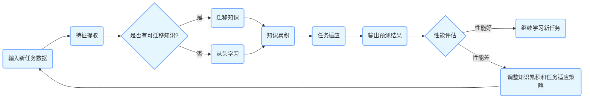

# 提升AI模型在多任务终身学习中的知识累积能力

> 关键词：AI模型、多任务终身学习、知识累积能力、持续学习、迁移学习、遗忘问题、元学习

> 摘要：本文聚焦于提升AI模型在多任务终身学习中的知识累积能力这一核心问题。多任务终身学习旨在让AI模型像人类一样持续学习多个任务，并不断累积知识。然而，当前AI模型在这一过程中面临着诸多挑战，如灾难性遗忘、知识负迁移等。文章深入探讨了相关核心概念与联系，详细介绍了核心算法原理及具体操作步骤，通过数学模型和公式进行理论支撑，并结合项目实战案例进行详细解释说明。此外，还分析了实际应用场景，推荐了相关的工具和资源，最后对未来发展趋势与挑战进行了总结，为提升AI模型在多任务终身学习中的知识累积能力提供了全面且深入的技术指导。

## 1. 背景介绍 
### 1.1 目的和范围
在当今人工智能快速发展的时代，多任务终身学习已成为一个重要的研究方向。传统的AI模型往往是针对单一任务进行训练，当面临多个不同任务时，需要重新进行训练，这不仅效率低下，而且无法充分利用之前学习到的知识。提升AI模型在多任务终身学习中的知识累积能力的目的在于让模型能够持续、高效地学习多个任务，不断丰富自身的知识体系，提高泛化能力和适应性。本文章的范围涵盖了多任务终身学习的基本概念、核心算法、数学模型、实际应用以及相关工具和资源等方面，旨在为研究人员和开发者提供全面的技术参考。

### 1.2 预期读者
本文预期读者包括人工智能领域的研究人员、高校相关专业的学生、从事AI开发的工程师以及对多任务终身学习感兴趣的技术爱好者。研究人员可以从文中获取最新的研究思路和方法，学生可以借此深入学习多任务终身学习的相关知识，工程师可以将文中的技术应用到实际项目中，技术爱好者则可以了解多任务终身学习的前沿动态。

### 1.3 文档结构概述
本文首先介绍背景信息，包括目的、预期读者和文档结构概述等内容。接着阐述多任务终身学习的核心概念与联系，通过文本示意图和Mermaid流程图进行清晰展示。然后详细讲解核心算法原理和具体操作步骤，并给出Python源代码。之后通过数学模型和公式进行理论分析，并举例说明。再结合项目实战案例，介绍开发环境搭建、源代码实现和代码解读。随后分析实际应用场景，推荐相关的工具和资源。最后总结未来发展趋势与挑战，提供常见问题与解答以及扩展阅读和参考资料。

### 1.4 术语表
#### 1.4.1 核心术语定义
- **多任务终身学习（Multi - task Lifelong Learning）**：指AI模型在整个生命周期内，能够持续不断地学习多个不同的任务，并在学习新任务的过程中保留和利用之前学习到的知识。
- **知识累积（Knowledge Accumulation）**：模型在学习过程中不断获取新的知识，并将其整合到已有的知识体系中，从而逐步提高自身的能力。
- **灾难性遗忘（Catastrophic Forgetting）**：当模型学习新任务时，会迅速忘记之前学习的任务的相关知识，导致在旧任务上的性能急剧下降。
- **迁移学习（Transfer Learning）**：将在一个或多个源任务上学习到的知识迁移到目标任务上，以提高目标任务的学习效率和性能。
- **元学习（Meta - learning）**：学习如何学习，即模型通过学习多个任务的元知识，能够快速适应新的任务。

#### 1.4.2 相关概念解释
- **持续学习（Continuous Learning）**：与多任务终身学习类似，强调模型的学习过程是持续不断的，但多任务终身学习更侧重于学习多个不同的任务。
- **泛化能力（Generalization Ability）**：模型在未见过的数据上能够表现出良好的性能，即能够将学习到的知识应用到新的场景中。

#### 1.4.3 缩略词列表
- **DNN**：深度神经网络（Deep Neural Network）
- **CNN**：卷积神经网络（Convolutional Neural Network）
- **RNN**：循环神经网络（Recurrent Neural Network）
- **LSTM**：长短期记忆网络（Long Short - Term Memory Network）

## 2. 核心概念与联系 

### 核心概念原理
多任务终身学习的核心思想是让AI模型能够在不断变化的任务环境中持续学习和进步。在这个过程中，知识累积是关键目标。模型需要不断接收新的任务数据，从中提取有用的知识，并将其与已有的知识进行融合。

迁移学习在多任务终身学习中起着重要作用。通过迁移学习，模型可以将在一个任务中学习到的特征、模式或参数等知识迁移到其他任务中，从而加快学习速度和提高性能。例如，在图像识别任务中，已经训练好的CNN模型的底层卷积层可以学习到一些通用的图像特征，如边缘、纹理等。当模型需要学习新的图像识别任务时，可以将这些底层卷积层的参数迁移过来，只需要对上层的全连接层进行微调，就可以快速适应新任务。

元学习则是从更高的层次来解决多任务终身学习的问题。元学习的目标是学习到一种通用的学习策略，使得模型能够快速适应新的任务。通过在多个任务上进行训练，元学习算法可以发现任务之间的共性和差异，从而生成一种能够在不同任务上都表现良好的学习机制。

灾难性遗忘是多任务终身学习中面临的主要挑战之一。当模型不断学习新任务时，由于神经网络的可塑性，新的任务数据可能会覆盖之前学习到的知识，导致在旧任务上的性能下降。为了克服灾难性遗忘，需要采用一些特殊的方法，如正则化、记忆回放等。

### 架构的文本示意图
```plaintext
多任务终身学习系统架构

输入层：接收不同任务的输入数据
特征提取层：从输入数据中提取特征，可利用迁移学习共享部分特征提取模块
知识累积模块：将新学习的知识与已有知识进行融合和存储
任务适应层：根据不同任务对特征进行进一步处理和调整
输出层：输出每个任务的预测结果

反馈机制：用于监测模型在不同任务上的性能，并根据性能调整知识累积和任务适应策略
```

### Mermaid流程图


## 3. 核心算法原理 & 具体操作步骤 

### 基于正则化的方法
#### 算法原理
正则化方法的核心思想是在模型学习新任务时，对模型的参数更新进行约束，使得模型在学习新任务的同时，尽量保留之前学习到的知识。一种常用的正则化方法是弹性权重巩固（Elastic Weight Consolidation, EWC）。

EWC通过计算每个参数的重要性来确定在学习新任务时对该参数的约束程度。具体来说，对于每个参数 $\theta$，EWC计算其在旧任务上的Fisher信息矩阵 $F(\theta)$，该矩阵表示了参数 $\theta$ 对旧任务的重要性。在学习新任务时，目标函数中会加入一个正则化项，该项惩罚参数 $\theta$ 与旧任务最优参数 $\theta_0$ 之间的差异，惩罚的程度由 $F(\theta)$ 决定。

#### Python源代码实现
```python
import torch
import torch.nn as nn
import torch.optim as optim

# 定义一个简单的神经网络模型
class SimpleNet(nn.Module):
    def __init__(self, input_size, hidden_size, output_size):
        super(SimpleNet, self).__init__()
        self.fc1 = nn.Linear(input_size, hidden_size)
        self.relu = nn.ReLU()
        self.fc2 = nn.Linear(hidden_size, output_size)

    def forward(self, x):
        out = self.fc1(x)
        out = self.relu(out)
        out = self.fc2(out)
        return out

# 计算Fisher信息矩阵
def compute_fisher(model, dataloader, criterion):
    fisher = {}
    for n, p in model.named_parameters():
        fisher[n] = torch.zeros_like(p.data)
    model.eval()
    for inputs, labels in dataloader:
        model.zero_grad()
        outputs = model(inputs)
        loss = criterion(outputs, labels)
        loss.backward()
        for n, p in model.named_parameters():
            if p.grad is not None:
                fisher[n] += p.grad.data ** 2
    for n, p in fisher.items():
        fisher[n] /= len(dataloader)
    return fisher

# 训练模型，使用EWC正则化
def train_with_ewc(model, dataloader, criterion, optimizer, fisher, importance=1000):
    model.train()
    for inputs, labels in dataloader:
        optimizer.zero_grad()
        outputs = model(inputs)
        loss = criterion(outputs, labels)
        # 加入EWC正则化项
        for n, p in model.named_parameters():
            if n in fisher:
                loss += 0.5 * importance * (fisher[n] * (p - p.detach()) ** 2).sum()
        loss.backward()
        optimizer.step()
    return model
```

### 具体操作步骤
1. **模型初始化**：定义一个神经网络模型，如上述的 `SimpleNet`，并初始化其参数。
2. **训练旧任务**：使用旧任务的数据集对模型进行训练，得到旧任务的最优参数 $\theta_0$。
3. **计算Fisher信息矩阵**：使用旧任务的数据集调用 `compute_fisher` 函数计算每个参数的Fisher信息矩阵 $F(\theta)$。
4. **训练新任务**：使用新任务的数据集调用 `train_with_ewc` 函数对模型进行训练，在目标函数中加入EWC正则化项，以保留旧任务的知识。

## 4. 数学模型和公式 & 详细讲解 & 举例说明 

### 弹性权重巩固（EWC）的数学模型
在多任务终身学习中，假设模型的参数为 $\theta$，旧任务的数据集为 $\mathcal{D}_{old}$，新任务的数据集为 $\mathcal{D}_{new}$。模型在旧任务上的损失函数为 $\mathcal{L}_{old}(\theta; \mathcal{D}_{old})$，在新任务上的损失函数为 $\mathcal{L}_{new}(\theta; \mathcal{D}_{new})$。

EWC的目标是在学习新任务时，尽量保留旧任务的知识。其目标函数可以表示为：

$$\mathcal{L}_{ewc}(\theta) = \mathcal{L}_{new}(\theta; \mathcal{D}_{new}) + \lambda \sum_{i} F_i (\theta_i - \theta_{i,0})^2$$

其中，$\lambda$ 是一个超参数，用于控制正则化项的强度；$F_i$ 是参数 $\theta_i$ 的Fisher信息矩阵的对角元素，表示参数 $\theta_i$ 对旧任务的重要性；$\theta_{i,0}$ 是旧任务的最优参数。

### 详细讲解
- **$\mathcal{L}_{new}(\theta; \mathcal{D}_{new})$**：这是模型在新任务上的损失函数，用于衡量模型在新任务上的预测结果与真实标签之间的差异。通过最小化这个损失函数，模型可以学习到新任务的知识。
- **$\lambda \sum_{i} F_i (\theta_i - \theta_{i,0})^2$**：这是EWC的正则化项。$\lambda$ 是一个超参数，需要根据具体任务进行调整。$F_i$ 表示参数 $\theta_i$ 对旧任务的重要性，$F_i$ 越大，说明参数 $\theta_i$ 对旧任务越重要，在学习新任务时就越不应该改变。$(\theta_i - \theta_{i,0})^2$ 表示参数 $\theta_i$ 与旧任务最优参数 $\theta_{i,0}$ 之间的差异，通过惩罚这个差异，可以使得模型在学习新任务时尽量保留旧任务的知识。

### 举例说明
假设我们有一个简单的线性回归模型 $y = \theta_1 x + \theta_2$，其中 $\theta_1$ 和 $\theta_2$ 是模型的参数。我们首先在一个旧任务上训练这个模型，得到旧任务的最优参数 $\theta_{1,0}$ 和 $\theta_{2,0}$。然后，我们使用EWC方法在新任务上训练这个模型。

在计算Fisher信息矩阵时，我们可以通过对旧任务的损失函数求二阶导数来得到 $F_1$ 和 $F_2$。假设 $F_1 = 10$，$F_2 = 5$，$\lambda = 100$。在学习新任务时，目标函数为：

$$\mathcal{L}_{ewc}(\theta) = \mathcal{L}_{new}(\theta; \mathcal{D}_{new}) + 100\times(10\times(\theta_1 - \theta_{1,0})^2 + 5\times(\theta_2 - \theta_{2,0})^2)$$

通过最小化这个目标函数，模型在学习新任务的同时，会尽量保留旧任务的知识。

## 5. 项目实战：代码实际案例和详细解释说明 

### 5.1  开发环境搭建
- **操作系统**：推荐使用Ubuntu 18.04或更高版本，或者Windows 10操作系统。
- **Python环境**：安装Python 3.7或更高版本。可以使用Anaconda来管理Python环境，创建一个新的虚拟环境：
```bash
conda create -n lifelong_learning python=3.8
conda activate lifelong_learning
```
- **深度学习框架**：安装PyTorch深度学习框架。根据自己的CUDA版本选择合适的安装命令，例如：
```bash
pip install torch torchvision torchaudio --extra-index-url https://download.pytorch.org/whl/cu113
```
- **其他依赖库**：安装 `numpy`、`matplotlib` 等常用库：
```bash
pip install numpy matplotlib
```

### 5.2  源代码详细实现和代码解读
```python
import torch
import torch.nn as nn
import torch.optim as optim
import numpy as np
import matplotlib.pyplot as plt

# 定义一个简单的神经网络模型
class SimpleNet(nn.Module):
    def __init__(self, input_size, hidden_size, output_size):
        super(SimpleNet, self).__init__()
        self.fc1 = nn.Linear(input_size, hidden_size)
        self.relu = nn.ReLU()
        self.fc2 = nn.Linear(hidden_size, output_size)

    def forward(self, x):
        out = self.fc1(x)
        out = self.relu(out)
        out = self.fc2(out)
        return out

# 计算Fisher信息矩阵
def compute_fisher(model, dataloader, criterion):
    fisher = {}
    for n, p in model.named_parameters():
        fisher[n] = torch.zeros_like(p.data)
    model.eval()
    for inputs, labels in dataloader:
        model.zero_grad()
        outputs = model(inputs)
        loss = criterion(outputs, labels)
        loss.backward()
        for n, p in model.named_parameters():
            if p.grad is not None:
                fisher[n] += p.grad.data ** 2
    for n, p in fisher.items():
        fisher[n] /= len(dataloader)
    return fisher

# 训练模型，使用EWC正则化
def train_with_ewc(model, dataloader, criterion, optimizer, fisher, importance=1000):
    model.train()
    for inputs, labels in dataloader:
        optimizer.zero_grad()
        outputs = model(inputs)
        loss = criterion(outputs, labels)
        # 加入EWC正则化项
        for n, p in model.named_parameters():
            if n in fisher:
                loss += 0.5 * importance * (fisher[n] * (p - p.detach()) ** 2).sum()
        loss.backward()
        optimizer.step()
    return model

# 生成模拟数据集
def generate_data(num_samples, input_size):
    inputs = torch.randn(num_samples, input_size)
    labels = torch.randint(0, 2, (num_samples,))
    return inputs, labels

# 主函数
if __name__ == '__main__':
    # 定义模型参数
    input_size = 10
    hidden_size = 20
    output_size = 2
    model = SimpleNet(input_size, hidden_size, output_size)

    # 定义损失函数和优化器
    criterion = nn.CrossEntropyLoss()
    optimizer = optim.Adam(model.parameters(), lr=0.001)

    # 生成旧任务数据集
    num_samples_old = 1000
    inputs_old, labels_old = generate_data(num_samples_old, input_size)
    dataset_old = torch.utils.data.TensorDataset(inputs_old, labels_old)
    dataloader_old = torch.utils.data.DataLoader(dataset_old, batch_size=32, shuffle=True)

    # 训练旧任务
    num_epochs_old = 10
    for epoch in range(num_epochs_old):
        model.train()
        for inputs, labels in dataloader_old:
            optimizer.zero_grad()
            outputs = model(inputs)
            loss = criterion(outputs, labels)
            loss.backward()
            optimizer.step()

    # 计算Fisher信息矩阵
    fisher = compute_fisher(model, dataloader_old, criterion)

    # 生成新任务数据集
    num_samples_new = 1000
    inputs_new, labels_new = generate_data(num_samples_new, input_size)
    dataset_new = torch.utils.data.TensorDataset(inputs_new, labels_new)
    dataloader_new = torch.utils.data.DataLoader(dataset_new, batch_size=32, shuffle=True)

    # 训练新任务，使用EWC正则化
    num_epochs_new = 10
    for epoch in range(num_epochs_new):
        model = train_with_ewc(model, dataloader_new, criterion, optimizer, fisher)

    # 评估模型在旧任务上的性能
    model.eval()
    correct = 0
    total = 0
    with torch.no_grad():
        for inputs, labels in dataloader_old:
            outputs = model(inputs)
            _, predicted = torch.max(outputs.data, 1)
            total += labels.size(0)
            correct += (predicted == labels).sum().item()
    accuracy_old = 100 * correct / total
    print(f"Accuracy on old task: {accuracy_old}%")
```

### 5.3  代码解读与分析
- **模型定义**：`SimpleNet` 类定义了一个简单的两层神经网络，包括一个输入层、一个隐藏层和一个输出层。
- **Fisher信息矩阵计算**：`compute_fisher` 函数用于计算每个参数的Fisher信息矩阵。通过对旧任务的损失函数求梯度，并将梯度的平方累加，最后除以数据集的大小得到每个参数的Fisher信息矩阵。
- **EWC训练**：`train_with_ewc` 函数在训练新任务时加入了EWC正则化项，通过惩罚参数与旧任务最优参数之间的差异，保留旧任务的知识。
- **数据集生成**：`generate_data` 函数用于生成模拟的数据集，包括输入数据和标签。
- **主函数**：在主函数中，首先定义了模型、损失函数和优化器。然后生成旧任务数据集并训练模型，计算Fisher信息矩阵。接着生成新任务数据集，使用EWC方法训练模型。最后评估模型在旧任务上的性能。

通过这个项目实战案例，我们可以看到如何使用EWC方法来提升模型在多任务终身学习中的知识累积能力，减少灾难性遗忘的影响。

## 6. 实际应用场景 
### 智能客服系统
智能客服系统需要处理多种类型的用户问题，如产品咨询、售后投诉、账户管理等。在多任务终身学习的框架下，智能客服模型可以不断学习新的问题类型和解决方案，同时保留之前学习到的知识。例如，当有新的产品上线时，模型可以快速学习关于该产品的相关知识，而不会忘记之前处理其他问题的能力。通过知识累积，智能客服系统可以提供更加准确和全面的服务，提高用户满意度。

### 自动驾驶汽车
自动驾驶汽车需要同时处理多个任务，如目标检测、路径规划、交通信号识别等。在其整个生命周期内，可能会遇到不同的道路场景和交通规则。多任务终身学习可以让自动驾驶汽车模型不断学习新的场景和规则，提高其安全性和适应性。例如，当汽车进入一个新的城市时，模型可以快速学习该城市的特殊交通规则，同时保留在其他城市中学习到的通用驾驶知识。

### 医疗诊断系统
医疗诊断系统需要处理多种疾病的诊断任务。随着医学研究的不断发展，新的疾病和诊断方法不断涌现。多任务终身学习可以让医疗诊断模型持续学习新的疾病知识和诊断技术，同时保留对已有疾病的诊断能力。例如，当出现一种新的传染病时，模型可以快速学习该疾病的症状、诊断标准等知识，而不会影响对其他常见疾病的诊断准确性。

### 金融风险评估系统
金融风险评估系统需要评估多种类型的风险，如信用风险、市场风险、操作风险等。金融市场环境不断变化，新的风险因素不断出现。多任务终身学习可以让金融风险评估模型不断学习新的风险因素和评估方法，同时保留对已有风险的评估能力。例如，当出现新的金融产品或市场波动时，模型可以快速学习相关的风险特征，提高风险评估的准确性。

## 7. 工具和资源推荐
### 7.1 学习资源推荐
#### 7.1.1 书籍推荐
- 《深度学习》（Deep Learning）：由Ian Goodfellow、Yoshua Bengio和Aaron Courville所著，是深度学习领域的经典教材，涵盖了深度学习的基本概念、算法和应用。
- 《模式识别与机器学习》（Pattern Recognition and Machine Learning）：由Christopher M. Bishop所著，详细介绍了模式识别和机器学习的理论和方法，对于理解多任务终身学习的基础理论有很大帮助。
- 《终身机器学习》（Lifelong Machine Learning）：由Zhi - Hua Zhou和Min - Lin Zhang主编，专门探讨了终身机器学习的相关问题，包括多任务终身学习的算法和应用。

#### 7.1.2 在线课程
- Coursera上的“深度学习专项课程”（Deep Learning Specialization）：由Andrew Ng教授授课，包括深度学习的基础、卷积神经网络、循环神经网络等内容，是学习深度学习的优质课程。
- edX上的“人工智能基础”（Introduction to Artificial Intelligence）：介绍了人工智能的基本概念、算法和应用，对于理解多任务终身学习的背景和原理有很大帮助。
- Udemy上的“多任务学习实战”（Multi - Task Learning in Practice）：专门讲解多任务学习的算法和实践案例，适合想要深入学习多任务终身学习的开发者。

#### 7.1.3 技术博客和网站
- Medium上的“Towards Data Science”：有很多关于人工智能、机器学习和深度学习的技术文章，包括多任务终身学习的最新研究成果和实践经验。
- arXiv.org：是一个预印本平台，提供了大量关于人工智能和机器学习的研究论文，可以及时了解多任务终身学习的前沿动态。
- PapersWithCode.com：收集了大量的机器学习和深度学习的开源代码和论文，方便查找多任务终身学习相关的代码实现和研究成果。

### 7.2 开发工具框架推荐
#### 7.2.1 IDE和编辑器
- PyCharm：是一款专门为Python开发设计的集成开发环境（IDE），具有强大的代码编辑、调试和自动补全功能，适合开发多任务终身学习的Python代码。
- Jupyter Notebook：是一个交互式的开发环境，支持Python、R等多种编程语言。可以方便地进行代码编写、数据可视化和模型训练，适合进行多任务终身学习的实验和研究。
- Visual Studio Code：是一款轻量级的代码编辑器，支持多种编程语言和插件。可以通过安装Python插件来进行Python代码的开发，具有良好的代码编辑和调试功能。

#### 7.2.2 调试和性能分析工具
- PyTorch Profiler：是PyTorch提供的性能分析工具，可以帮助开发者分析模型的性能瓶颈，优化模型的训练和推理速度。
- TensorBoard：是TensorFlow提供的可视化工具，也可以与PyTorch结合使用。可以用于可视化模型的训练过程、损失函数曲线、准确率曲线等，方便开发者监控模型的训练情况。
- cProfile：是Python标准库中的性能分析工具，可以帮助开发者分析Python代码的性能瓶颈，找出耗时较长的函数和代码段。

#### 7.2.3 相关框架和库
- PyTorch：是一个开源的深度学习框架，提供了丰富的神经网络模块和优化算法，支持GPU加速。可以方便地实现多任务终身学习的算法和模型。
- TensorFlow：是另一个广泛使用的深度学习框架，具有强大的分布式训练和部署能力。可以用于开发多任务终身学习的大规模应用。
- Scikit - learn：是一个用于机器学习的Python库，提供了多种机器学习算法和工具，如分类、回归、聚类等。可以用于多任务终身学习中的数据预处理和模型评估。

### 7.3 相关论文著作推荐
#### 7.3.1 经典论文
- "Overcoming catastrophic forgetting in neural networks" by James Kirkpatrick et al.：提出了弹性权重巩固（EWC）方法，是解决灾难性遗忘问题的经典论文。
- "Learning without forgetting" by Zhizhong Li and Derek Hoiem：提出了学习不遗忘（LwF）方法，通过知识蒸馏的方式来保留旧任务的知识。
- "An overview of multi - task learning in deep neural networks" by Sebastian Ruder：对多任务学习在深度神经网络中的应用进行了全面的综述，介绍了多任务学习的基本概念、算法和应用场景。

#### 7.3.2 最新研究成果
- 关注arXiv.org上的最新论文，如关于元学习在多任务终身学习中的应用、基于记忆回放的多任务终身学习算法等。
- 关注顶级机器学习会议（如NeurIPS、ICML、CVPR等）上的最新研究成果，了解多任务终身学习的前沿技术和发展趋势。

#### 7.3.3 应用案例分析
- 一些实际应用领域的论文，如智能客服、自动驾驶、医疗诊断等领域中多任务终身学习的应用案例分析。可以通过IEEE Xplore、ACM Digital Library等数据库查找相关论文。

## 8. 总结：未来发展趋势与挑战
### 未来发展趋势
- **更强大的元学习算法**：元学习将在多任务终身学习中发挥越来越重要的作用。未来的研究将致力于开发更强大的元学习算法，能够更好地学习任务之间的共性和差异，从而更快地适应新任务。
- **结合知识图谱**：知识图谱可以提供丰富的语义信息，将知识图谱与多任务终身学习相结合，可以让模型更好地理解和利用知识，提高知识累积的效率和质量。
- **跨模态多任务终身学习**：目前的多任务终身学习主要集中在单模态数据上，未来的研究将扩展到跨模态数据，如图像、文本、语音等。跨模态多任务终身学习可以让模型从不同的模态中获取知识，提高模型的泛化能力和适应性。
- **强化学习与多任务终身学习的融合**：强化学习可以让模型在动态环境中进行学习和决策。将强化学习与多任务终身学习相结合，可以让模型在不断变化的任务环境中更好地累积知识，提高学习效率和性能。

### 挑战
- **灾难性遗忘问题仍然存在**：尽管已经提出了多种方法来解决灾难性遗忘问题，但目前的方法仍然存在一定的局限性。在某些复杂的任务环境中，模型仍然可能会出现严重的遗忘现象。
- **计算资源需求大**：多任务终身学习需要处理大量的数据和复杂的模型，对计算资源的需求非常大。如何在有限的计算资源下实现高效的多任务终身学习是一个亟待解决的问题。
- **知识表示和融合困难**：不同任务的知识具有不同的表示形式，如何将这些不同形式的知识有效地表示和融合是一个挑战。此外，在知识累积过程中，如何保证知识的一致性和准确性也是一个需要解决的问题。
- **伦理和安全问题**：随着多任务终身学习的发展，模型的能力越来越强大，其决策和行为可能会对人类社会产生重大影响。如何确保模型的伦理和安全，避免模型的错误决策和行为对人类造成伤害，是一个需要重视的问题。

## 9. 附录：常见问题与解答
### 问题1：什么是灾难性遗忘？
答：灾难性遗忘是指当模型学习新任务时，会迅速忘记之前学习的任务的相关知识，导致在旧任务上的性能急剧下降。这是多任务终身学习中面临的主要挑战之一。

### 问题2：如何解决灾难性遗忘问题？
答：可以采用多种方法来解决灾难性遗忘问题，如正则化方法（如弹性权重巩固EWC）、记忆回放方法、知识蒸馏方法等。这些方法的核心思想是在学习新任务时，尽量保留之前学习到的知识。

### 问题3：多任务终身学习与传统的单任务学习有什么区别？
答：传统的单任务学习是针对单一任务进行训练，当面临新任务时，需要重新进行训练。而多任务终身学习可以让模型在整个生命周期内持续学习多个不同的任务，并在学习新任务的过程中保留和利用之前学习到的知识，提高学习效率和泛化能力。

### 问题4：多任务终身学习需要哪些计算资源？
答：多任务终身学习需要处理大量的数据和复杂的模型，对计算资源的需求较大。通常需要使用GPU或TPU等加速设备来提高训练和推理速度。此外，还需要足够的内存和存储空间来存储数据和模型参数。

### 问题5：如何评估多任务终身学习模型的性能？
答：可以从多个方面评估多任务终身学习模型的性能，如在不同任务上的准确率、召回率、F1值等指标，以及模型的泛化能力、知识累积能力等。还可以通过对比模型在学习新任务前后在旧任务上的性能变化来评估模型的灾难性遗忘程度。

## 10. 扩展阅读 & 参考资料
- Goodfellow, I., Bengio, Y., & Courville, A. (2016). Deep Learning. MIT Press.
- Bishop, C. M. (2006). Pattern Recognition and Machine Learning. Springer.
- Zhou, Z. H., & Zhang, M. L. (Eds.). (2018). Lifelong Machine Learning. Morgan & Claypool Publishers.
- Kirkpatrick, J., Pascanu, R., Rabinowitz, N., Veness, J., Desjardins, G., Rusu, A. A., ... & Hassabis, D. (2017). Overcoming catastrophic forgetting in neural networks. Proceedings of the national academy of sciences, 114(13), 3521 - 3526.
- Li, Z., & Hoiem, D. (2017). Learning without forgetting. IEEE transactions on pattern analysis and machine intelligence, 40(12), 2935 - 2947.
- Ruder, S. (2017). An overview of multi - task learning in deep neural networks. arXiv preprint arXiv:1706.05098.
- PyTorch官方文档：https://pytorch.org/docs/stable/index.html
- TensorFlow官方文档：https://www.tensorflow.org/api_docs
- Scikit - learn官方文档：https://scikit - learn.org/stable/documentation.html