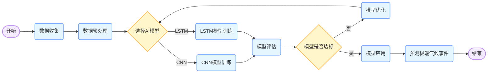

# 提升AI模型在极端气候事件预测中的准确性

> 关键词：AI模型、极端气候事件、预测准确性、气候数据、机器学习算法

> 摘要：极端气候事件的频发对人类社会和生态环境造成了严重影响，准确预测极端气候事件具有重要意义。本文围绕提升AI模型在极端气候事件预测中的准确性展开，详细介绍了相关背景知识，深入剖析核心概念与联系，阐述核心算法原理及操作步骤，借助数学模型和公式进行理论分析，通过项目实战展示代码实现与解读，探讨实际应用场景，推荐学习资源、开发工具和相关论文著作，最后总结未来发展趋势与挑战，并对常见问题进行解答。旨在为提升AI模型在极端气候事件预测的准确性提供全面的技术指导和理论支持。

## 1. 背景介绍 
### 1.1 目的和范围
极端气候事件，如暴雨、飓风、热浪等，往往伴随着巨大的破坏力，可能导致人员伤亡、财产损失以及生态环境的严重破坏。准确预测这些极端气候事件，能够提前做好防范措施，减少灾害带来的损失。本文章的目的在于探讨如何提升AI模型在极端气候事件预测中的准确性，范围涵盖了从AI模型的基本原理、相关算法，到实际应用案例以及未来发展趋势等多个方面。

### 1.2 预期读者
本文预期读者包括对气象学、人工智能、机器学习等领域感兴趣的科研人员、工程师、学生以及关注气候变化的相关人士。对于希望深入了解AI技术在极端气候事件预测中应用的专业人士，本文提供了全面的技术知识和实践指导；对于初学者，本文也以通俗易懂的方式介绍了基本概念和原理，帮助他们快速入门。

### 1.3 文档结构概述
本文首先介绍背景知识，让读者对极端气候事件预测的重要性和本文的研究范围有清晰的认识。接着阐述核心概念与联系，包括AI模型、极端气候事件等关键概念的原理和它们之间的关系。然后详细讲解核心算法原理及具体操作步骤，并结合Python源代码进行说明。通过数学模型和公式进一步分析预测的理论基础，并举例说明。之后通过项目实战展示代码实现和解读，帮助读者理解如何在实际中应用相关技术。探讨实际应用场景，让读者了解AI模型在极端气候事件预测中的具体应用。推荐学习资源、开发工具和相关论文著作，为读者提供进一步学习和研究的方向。最后总结未来发展趋势与挑战，解答常见问题，并提供扩展阅读和参考资料。

### 1.4 术语表
#### 1.4.1 核心术语定义
- **AI模型**：人工智能模型，是利用机器学习、深度学习等技术构建的能够模拟人类智能的计算模型，可用于数据处理、模式识别、预测等任务。
- **极端气候事件**：指在一定地区和时间内出现的严重偏离平均状态的气候现象，如极端高温、极端低温、暴雨、暴雪、飓风等。
- **预测准确性**：指模型预测结果与实际发生情况的符合程度，通常用准确率、召回率、均方误差等指标来衡量。
- **气候数据**：包括气温、降水、风速、气压等气象要素的观测数据，以及卫星遥感数据、气候模式模拟数据等，是进行极端气候事件预测的基础。

#### 1.4.2 相关概念解释
- **机器学习**：是一门多领域交叉学科，涉及概率论、统计学、逼近论、凸分析、算法复杂度理论等多门学科。它专门研究计算机怎样模拟或实现人类的学习行为，以获取新的知识或技能，重新组织已有的知识结构使之不断改善自身的性能。
- **深度学习**：是机器学习的一个分支领域，它是一种基于对数据进行表征学习的方法。深度学习通过构建具有很多层的神经网络模型，自动从大量数据中学习特征和模式，从而实现对数据的分类、预测等任务。
- **数据预处理**：在将原始数据用于AI模型训练之前，对数据进行清洗、转换、归一化等操作，以提高数据质量和模型性能。

#### 1.4.3 缩略词列表
- **ML**：Machine Learning，机器学习
- **DL**：Deep Learning，深度学习
- **CNN**：Convolutional Neural Network，卷积神经网络
- **RNN**：Recurrent Neural Network，循环神经网络
- **LSTM**：Long Short - Term Memory，长短期记忆网络

## 2. 核心概念与联系 

### 核心概念原理
#### AI模型
AI模型是基于数据驱动的智能系统，通过对大量历史数据的学习，发现数据中的规律和模式，从而对未来的事件进行预测。常见的AI模型包括机器学习模型和深度学习模型。机器学习模型如决策树、支持向量机等，通过手工提取特征，利用统计学习方法进行模型训练。深度学习模型如卷积神经网络（CNN）、循环神经网络（RNN）及其变体长短期记忆网络（LSTM）等，能够自动从原始数据中学习特征，具有更强的表达能力。

#### 极端气候事件
极端气候事件的发生是多种气象因素相互作用的结果。例如，暴雨的形成通常与大气环流、水汽输送、垂直上升运动等因素有关。极端气候事件具有突发性、不确定性和复杂性等特点，这使得准确预测变得困难。

#### 预测准确性
预测准确性是衡量AI模型性能的重要指标。它反映了模型预测结果与实际情况的接近程度。常用的评估指标包括准确率、召回率、均方误差（MSE）、均方根误差（RMSE）等。准确率是指预测正确的样本数占总样本数的比例；召回率是指实际为正样本且被预测为正样本的比例；均方误差是预测值与真实值之差的平方的平均值；均方根误差是均方误差的平方根。

### 架构的文本示意图
AI模型在极端气候事件预测中的架构可以分为数据层、模型层和应用层。数据层负责收集、存储和预处理气候数据，包括历史观测数据、卫星遥感数据等。模型层选择合适的AI模型，如CNN、LSTM等，对预处理后的数据进行训练和优化。应用层将训练好的模型用于极端气候事件的预测，并将预测结果提供给相关部门和用户。

### Mermaid流程图


## 3. 核心算法原理 & 具体操作步骤 

### 卷积神经网络（CNN）原理
卷积神经网络是一种专门为处理具有网格结构数据（如图像、时间序列数据）而设计的深度学习模型。它的核心组件包括卷积层、池化层和全连接层。

#### 卷积层
卷积层通过卷积核在输入数据上滑动，进行卷积操作，提取数据的局部特征。卷积操作可以表示为：
```python
import numpy as np

def convolution(input_data, kernel):
    input_height, input_width = input_data.shape
    kernel_height, kernel_width = kernel.shape
    output_height = input_height - kernel_height + 1
    output_width = input_width - kernel_width + 1
    output = np.zeros((output_height, output_width))
    for i in range(output_height):
        for j in range(output_width):
            output[i, j] = np.sum(input_data[i:i+kernel_height, j:j+kernel_width] * kernel)
    return output
```

#### 池化层
池化层用于降低数据的维度，减少计算量，同时保留重要的特征信息。常见的池化操作有最大池化和平均池化。以下是最大池化的Python实现：
```python
def max_pooling(input_data, pool_size):
    input_height, input_width = input_data.shape
    output_height = input_height // pool_size
    output_width = input_width // pool_size
    output = np.zeros((output_height, output_width))
    for i in range(output_height):
        for j in range(output_width):
            output[i, j] = np.max(input_data[i*pool_size:(i+1)*pool_size, j*pool_size:(j+1)*pool_size])
    return output
```

#### 全连接层
全连接层将卷积层和池化层提取的特征进行整合，输出最终的预测结果。全连接层的计算可以表示为矩阵乘法：
```python
def fully_connected(input_data, weights, biases):
    return np.dot(input_data.flatten(), weights) + biases
```

### 长短期记忆网络（LSTM）原理
长短期记忆网络是一种特殊的循环神经网络，能够处理序列数据中的长期依赖关系。LSTM的核心是细胞状态和门控机制。

#### 门控机制
LSTM包含输入门、遗忘门和输出门。输入门决定哪些新信息将被添加到细胞状态中；遗忘门决定哪些信息将从细胞状态中被遗忘；输出门决定细胞状态的哪些部分将被输出。以下是LSTM单元的Python实现：
```python
import numpy as np

class LSTMCell:
    def __init__(self, input_size, hidden_size):
        self.input_size = input_size
        self.hidden_size = hidden_size
        self.W_ii = np.random.randn(hidden_size, input_size)
        self.W_hi = np.random.randn(hidden_size, hidden_size)
        self.b_i = np.zeros((hidden_size, 1))
        self.W_if = np.random.randn(hidden_size, input_size)
        self.W_hf = np.random.randn(hidden_size, hidden_size)
        self.b_f = np.zeros((hidden_size, 1))
        self.W_ig = np.random.randn(hidden_size, input_size)
        self.W_hg = np.random.randn(hidden_size, hidden_size)
        self.b_g = np.zeros((hidden_size, 1))
        self.W_io = np.random.randn(hidden_size, input_size)
        self.W_ho = np.random.randn(hidden_size, hidden_size)
        self.b_o = np.zeros((hidden_size, 1))

    def sigmoid(self, x):
        return 1 / (1 + np.exp(-x))

    def tanh(self, x):
        return np.tanh(x)

    def forward(self, x, h_prev, c_prev):
        i = self.sigmoid(np.dot(self.W_ii, x) + np.dot(self.W_hi, h_prev) + self.b_i)
        f = self.sigmoid(np.dot(self.W_if, x) + np.dot(self.W_hf, h_prev) + self.b_f)
        g = self.tanh(np.dot(self.W_ig, x) + np.dot(self.W_hg, h_prev) + self.b_g)
        o = self.sigmoid(np.dot(self.W_io, x) + np.dot(self.W_ho, h_prev) + self.b_o)
        c_next = f * c_prev + i * g
        h_next = o * self.tanh(c_next)
        return h_next, c_next
```

### 具体操作步骤
1. **数据收集**：收集历史气候数据，包括气温、降水、风速等气象要素的观测数据，以及卫星遥感数据、气候模式模拟数据等。
2. **数据预处理**：对收集到的数据进行清洗，去除缺失值和异常值；进行数据转换，如将数据进行归一化处理，使数据具有相同的尺度；将数据划分为训练集、验证集和测试集。
3. **模型选择**：根据数据的特点和任务需求，选择合适的AI模型，如CNN、LSTM等。
4. **模型训练**：使用训练集对模型进行训练，通过优化算法（如随机梯度下降）不断调整模型的参数，使模型的预测误差最小化。
5. **模型评估**：使用验证集对训练好的模型进行评估，计算评估指标（如准确率、召回率、均方误差等），评估模型的性能。
6. **模型优化**：根据评估结果，对模型进行优化，如调整模型的超参数、增加训练数据等。
7. **模型应用**：将优化后的模型应用于实际的极端气候事件预测中，使用测试集对模型的预测效果进行验证。

## 4. 数学模型和公式 & 详细讲解 & 举例说明 

### 均方误差（MSE）
均方误差是衡量预测值与真实值之间差异的常用指标，其计算公式为：
$$MSE = \frac{1}{n} \sum_{i=1}^{n} (y_i - \hat{y}_i)^2$$
其中，$n$ 是样本数量，$y_i$ 是真实值，$\hat{y}_i$ 是预测值。

#### 详细讲解
均方误差通过对每个样本的预测误差的平方求和，再取平均值，得到整体的误差度量。平方操作的目的是为了避免正负误差相互抵消，同时加大了较大误差的权重，使模型更加关注误差较大的样本。

#### 举例说明
假设有一组真实值 $y = [1, 2, 3, 4, 5]$ 和对应的预测值 $\hat{y} = [1.2, 1.8, 3.1, 3.9, 5.2]$，则均方误差为：
```python
import numpy as np

y = np.array([1, 2, 3, 4, 5])
y_hat = np.array([1.2, 1.8, 3.1, 3.9, 5.2])
mse = np.mean((y - y_hat) ** 2)
print("均方误差：", mse)
```

### 均方根误差（RMSE）
均方根误差是均方误差的平方根，其计算公式为：
$$RMSE = \sqrt{\frac{1}{n} \sum_{i=1}^{n} (y_i - \hat{y}_i)^2}$$

#### 详细讲解
均方根误差与均方误差的含义相似，但它的量纲与原始数据相同，更直观地反映了预测误差的大小。

#### 举例说明
对于上述例子，均方根误差为：
```python
import numpy as np

y = np.array([1, 2, 3, 4, 5])
y_hat = np.array([1.2, 1.8, 3.1, 3.9, 5.2])
rmse = np.sqrt(np.mean((y - y_hat) ** 2))
print("均方根误差：", rmse)
```

### 准确率
准确率是指预测正确的样本数占总样本数的比例，其计算公式为：
$$Accuracy = \frac{TP + TN}{TP + TN + FP + FN}$$
其中，$TP$ 是真正例（预测为正样本且实际为正样本）的数量，$TN$ 是真反例（预测为反样本且实际为反样本）的数量，$FP$ 是假正例（预测为正样本但实际为反样本）的数量，$FN$ 是假反例（预测为反样本但实际为正样本）的数量。

#### 详细讲解
准确率是一个直观的评估指标，它反映了模型在整体上的预测能力。但在数据不平衡的情况下，准确率可能不能很好地反映模型的性能。

#### 举例说明
假设有一个二分类问题，总样本数为 100，其中真正例为 30，真反例为 60，假正例为 5，假反例为 5，则准确率为：
```python
TP = 30
TN = 60
FP = 5
FN = 5
accuracy = (TP + TN) / (TP + TN + FP + FN)
print("准确率：", accuracy)
```

## 5. 项目实战：代码实际案例和详细解释说明 

### 5.1  开发环境搭建
- **操作系统**：推荐使用Linux或Windows操作系统。
- **编程语言**：Python 3.x
- **深度学习框架**：TensorFlow或PyTorch
- **开发工具**：Jupyter Notebook或PyCharm

### 5.2  源代码详细实现和代码解读
以下是一个使用TensorFlow实现的基于LSTM的极端气候事件预测的示例代码：
```python
import tensorflow as tf
from tensorflow.keras.models import Sequential
from tensorflow.keras.layers import LSTM, Dense
import numpy as np
import pandas as pd
from sklearn.preprocessing import MinMaxScaler
from sklearn.model_selection import train_test_split

# 数据加载
data = pd.read_csv('climate_data.csv')
# 假设数据的最后一列是目标变量（极端气候事件标签）
X = data.iloc[:, :-1].values
y = data.iloc[:, -1].values

# 数据预处理
scaler = MinMaxScaler()
X = scaler.fit_transform(X)

# 数据划分
X_train, X_test, y_train, y_test = train_test_split(X, y, test_size=0.2, random_state=42)

# 调整数据形状以适应LSTM输入要求（样本数，时间步长，特征数）
X_train = np.reshape(X_train, (X_train.shape[0], 1, X_train.shape[1]))
X_test = np.reshape(X_test, (X_test.shape[0], 1, X_test.shape[1]))

# 构建LSTM模型
model = Sequential()
model.add(LSTM(50, input_shape=(1, X_train.shape[2])))
model.add(Dense(1, activation='sigmoid'))

# 编译模型
model.compile(optimizer='adam', loss='binary_crossentropy', metrics=['accuracy'])

# 训练模型
model.fit(X_train, y_train, epochs=50, batch_size=32, validation_data=(X_test, y_test))

# 模型评估
loss, accuracy = model.evaluate(X_test, y_test)
print("测试集损失：", loss)
print("测试集准确率：", accuracy)
```

### 5.3  代码解读与分析
1. **数据加载**：使用`pandas`库读取气候数据文件`climate_data.csv`，将特征数据存储在`X`中，目标变量（极端气候事件标签）存储在`y`中。
2. **数据预处理**：使用`MinMaxScaler`对特征数据进行归一化处理，将数据缩放到0到1的范围内，以提高模型的训练效果。
3. **数据划分**：使用`train_test_split`将数据划分为训练集和测试集，测试集占总数据的20%。
4. **数据形状调整**：将训练集和测试集的特征数据调整为LSTM模型所需的三维形状（样本数，时间步长，特征数）。
5. **模型构建**：使用`Sequential`模型构建一个简单的LSTM模型，包含一个LSTM层和一个全连接层，全连接层的激活函数为`sigmoid`，用于二分类任务。
6. **模型编译**：使用`adam`优化器和`binary_crossentropy`损失函数编译模型，并将准确率作为评估指标。
7. **模型训练**：使用训练集对模型进行训练，训练50个周期，每个批次包含32个样本，并使用测试集进行验证。
8. **模型评估**：使用测试集对训练好的模型进行评估，计算测试集的损失和准确率。

## 6. 实际应用场景 
### 气象部门
气象部门可以利用AI模型对极端气候事件进行预测，提前发布预警信息，为政府决策和公众防范提供支持。例如，通过准确预测暴雨、飓风等极端天气，政府可以提前组织人员疏散、做好防洪防风准备工作，减少灾害带来的损失。

### 农业领域
极端气候事件对农业生产有着重要影响，如干旱、洪涝、低温等可能导致农作物减产甚至绝收。AI模型可以帮助农民提前了解未来的气候情况，合理安排农事活动，选择合适的农作物品种，采取有效的防灾减灾措施，提高农业生产的稳定性和效益。

### 能源行业
极端气候事件可能会影响能源的供应和需求。例如，高温天气可能导致电力需求大幅增加，而飓风等灾害可能会破坏电力设施，影响电力供应。能源公司可以利用AI模型预测极端气候事件，提前做好电力调度和设备维护工作，保障能源的稳定供应。

### 保险行业
保险公司可以利用AI模型对极端气候事件的发生概率和损失程度进行评估，合理制定保险费率，降低保险风险。同时，在极端气候事件发生后，AI模型可以帮助保险公司快速评估损失情况，提高理赔效率。

## 7. 工具和资源推荐
### 7.1 学习资源推荐
#### 7.1.1 书籍推荐
- 《深度学习》（Deep Learning）：由Ian Goodfellow、Yoshua Bengio和Aaron Courville合著，是深度学习领域的经典教材，系统地介绍了深度学习的基本概念、算法和应用。
- 《Python机器学习》（Python Machine Learning）：由Sebastian Raschka和Vahid Mirjalili合著，详细介绍了Python在机器学习中的应用，包括各种机器学习算法的实现和优化。
- 《气象学与气候学基础》：帮助读者了解气象学和气候学的基本原理和知识，为理解极端气候事件的形成机制提供基础。

#### 7.1.2 在线课程
- Coursera上的“深度学习专项课程”（Deep Learning Specialization）：由Andrew Ng教授主讲，涵盖了深度学习的各个方面，包括神经网络、卷积神经网络、循环神经网络等。
- edX上的“气象学导论”（Introduction to Meteorology）：介绍了气象学的基本概念、大气运动、天气系统等知识，有助于了解极端气候事件的相关背景。
- 中国大学MOOC上的“机器学习”课程：由国内知名高校的教授授课，系统地讲解了机器学习的理论和实践。

#### 7.1.3 技术博客和网站
- Medium：有许多关于人工智能、机器学习和气象学的技术博客，作者们会分享最新的研究成果和实践经验。
- arXiv：是一个预印本服务器，提供了大量关于人工智能、气象学等领域的研究论文，能够及时了解最新的研究动态。
- 中国气象数据网：提供了丰富的气象数据和相关的研究报告，是了解气象领域知识和获取数据的重要资源。

### 7.2 开发工具框架推荐
#### 7.2.1 IDE和编辑器
- PyCharm：是一款专门为Python开发设计的集成开发环境，具有代码编辑、调试、版本控制等功能，能够提高开发效率。
- Jupyter Notebook：是一个交互式的开发环境，支持多种编程语言，适合进行数据探索、模型训练和可视化等工作。
- Visual Studio Code：是一款轻量级的代码编辑器，支持多种编程语言和插件，具有丰富的扩展功能。

#### 7.2.2 调试和性能分析工具
- TensorBoard：是TensorFlow提供的可视化工具，可用于监控模型的训练过程、查看模型的结构和性能指标等。
- PyTorch Profiler：是PyTorch提供的性能分析工具，可用于分析模型的计算效率、内存使用情况等，帮助优化模型性能。
- Scikit-learn的交叉验证和网格搜索功能：可用于模型的调优和评估，通过交叉验证选择最优的模型参数，提高模型的性能。

#### 7.2.3 相关框架和库
- TensorFlow：是一个开源的深度学习框架，提供了丰富的工具和函数，可用于构建和训练各种深度学习模型。
- PyTorch：是另一个流行的深度学习框架，具有动态图的特点，易于使用和调试，适合进行研究和开发。
- Scikit-learn：是一个用于机器学习的Python库，提供了各种机器学习算法和工具，如数据预处理、模型选择、模型评估等。

### 7.3 相关论文著作推荐
#### 7.3.1 经典论文
- “Long Short-Term Memory”：由Sepp Hochreiter和Jürgen Schmidhuber发表，介绍了长短期记忆网络（LSTM）的原理和结构，是LSTM领域的经典论文。
- “Gradient-based learning applied to document recognition”：由Yann LeCun等人发表，介绍了卷积神经网络（CNN）的原理和应用，是CNN领域的奠基性论文。
- “The Climate Machine: A New Dynamical Core for General Circulation Models”：介绍了气候模式的相关理论和方法，为理解极端气候事件的模拟和预测提供了理论基础。

#### 7.3.2 最新研究成果
- 关注Nature、Science、Journal of Climate等顶级学术期刊上发表的关于极端气候事件预测和AI技术应用的研究论文，了解最新的研究动态和成果。
- 参加相关的学术会议，如美国气象学会年会、国际人工智能联合会议等，获取最新的研究报告和交流机会。

#### 7.3.3 应用案例分析
- 分析国内外气象部门、科研机构等在极端气候事件预测中应用AI技术的成功案例，学习他们的经验和方法，为实际应用提供参考。
- 研究能源、农业、保险等行业利用AI模型应对极端气候事件的案例，了解不同行业的需求和应用场景。

## 8. 总结：未来发展趋势与挑战
### 未来发展趋势
- **多源数据融合**：未来的AI模型将融合更多来源的数据，如卫星遥感数据、气象站观测数据、物联网传感器数据等，以获取更全面、准确的气候信息，提高预测的准确性。
- **跨学科融合**：AI技术将与气象学、统计学、物理学等多学科进行深度融合，结合不同学科的优势，开发出更先进的预测模型和方法。
- **实时预测与动态调整**：随着计算能力的提升和数据传输速度的加快，AI模型将实现实时预测，并根据新的数据动态调整预测结果，提高预测的及时性和准确性。
- **可解释性AI**：提高AI模型的可解释性将成为未来的研究重点，使气象学家和决策者能够理解模型的预测过程和依据，增强对预测结果的信任。

### 挑战
- **数据质量和稀缺性**：气候数据的质量参差不齐，存在缺失值、异常值等问题，同时一些极端气候事件的发生频率较低，导致相关数据稀缺，这给模型的训练和评估带来了困难。
- **模型复杂度和计算资源**：为了提高预测准确性，AI模型的复杂度不断增加，需要大量的计算资源和时间进行训练和优化，这对硬件设备和计算能力提出了更高的要求。
- **不确定性和可解释性**：极端气候事件本身具有很大的不确定性，AI模型的预测结果也存在一定的误差。此外，深度学习模型通常是黑盒模型，缺乏可解释性，难以理解模型的决策过程。
- **社会接受度和政策支持**：将AI模型应用于极端气候事件预测需要得到社会的广泛接受和政策的支持。一些人可能对AI模型的预测结果存在疑虑，需要加强宣传和教育，提高公众的认知和信任。

## 9. 附录：常见问题与解答
### 问题1：如何选择合适的AI模型进行极端气候事件预测？
答：选择合适的AI模型需要考虑数据的特点和任务需求。如果数据具有时空结构，如气象数据，卷积神经网络（CNN）和长短期记忆网络（LSTM）可能是比较合适的选择；如果数据维度较低且任务相对简单，传统的机器学习模型如决策树、支持向量机等也可以尝试。此外，还可以通过模型选择和调优的方法，比较不同模型的性能，选择最优的模型。

### 问题2：数据预处理对模型性能有多大影响？
答：数据预处理对模型性能有很大影响。清洗数据可以去除噪声和异常值，提高数据质量；数据转换和归一化可以使数据具有相同的尺度，加快模型的训练速度；数据划分可以合理分配训练集、验证集和测试集，避免过拟合和欠拟合。因此，做好数据预处理是提高模型性能的关键步骤。

### 问题3：如何评估AI模型在极端气候事件预测中的准确性？
答：可以使用多种评估指标来评估AI模型的准确性，如准确率、召回率、均方误差、均方根误差等。不同的指标适用于不同的任务和数据特点。例如，在二分类问题中，准确率和召回率可以反映模型的分类能力；在回归问题中，均方误差和均方根误差可以衡量模型的预测误差。此外，还可以使用交叉验证等方法来提高评估的可靠性。

### 问题4：AI模型在极端气候事件预测中存在哪些局限性？
答：AI模型在极端气候事件预测中存在一些局限性。首先，极端气候事件的发生具有很大的不确定性，模型难以完全捕捉所有的影响因素；其次，AI模型通常是基于历史数据进行训练的，对于罕见的极端气候事件，由于数据稀缺，模型的预测能力可能有限；此外，深度学习模型的可解释性较差，难以理解模型的决策过程，这在一定程度上影响了模型的可信度和应用范围。

## 10. 扩展阅读 & 参考资料
### 扩展阅读
- 《人工智能时代的气象服务》：探讨了AI技术在气象服务中的应用和发展趋势，为进一步了解AI在气象领域的应用提供了更广阔的视野。
- 《气候变化与极端天气事件》：深入分析了气候变化与极端天气事件之间的关系，有助于理解极端气候事件的形成机制和影响因素。
- 《深度学习实战》：通过实际案例介绍了深度学习的应用和实践技巧，对提高AI模型的开发和应用能力有很大帮助。

### 参考资料
- 中国气象科学研究院的相关研究报告和论文。
- 国际权威气象组织（如世界气象组织）发布的气候数据和研究成果。
- 各深度学习框架（如TensorFlow、PyTorch）的官方文档和教程。