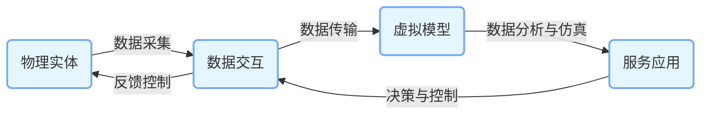

# 数字孪生技术在工业领域的应用与投资机会

> 关键词：数字孪生技术、工业领域、应用场景、投资机会、智能制造

> 摘要：本文深入探讨了数字孪生技术在工业领域的应用与投资机会。首先介绍了数字孪生技术的背景和相关概念，包括其目的、预期读者、文档结构等。接着阐述了数字孪生的核心概念、算法原理、数学模型等内容。通过项目实战展示了数字孪生技术在实际工业场景中的应用，分析了不同的应用场景。同时，推荐了学习数字孪生技术的工具和资源，包括书籍、在线课程、开发工具等。最后总结了数字孪生技术在工业领域的未来发展趋势与挑战，为相关从业者和投资者提供了全面且深入的参考。

## 1. 背景介绍 
### 1.1 目的和范围
数字孪生技术作为近年来兴起的前沿技术，在工业领域展现出了巨大的潜力和应用价值。本文的目的在于全面、深入地探讨数字孪生技术在工业领域的各种应用场景，以及由此带来的投资机会。范围涵盖了数字孪生技术的基本概念、核心算法、数学模型，通过实际项目案例分析其在工业生产、设备管理、供应链优化等多个工业环节的具体应用，并从市场趋势、技术发展等角度分析投资数字孪生技术相关项目的可行性和潜在回报。

### 1.2 预期读者
本文预期读者包括工业领域的从业者，如工程师、技术管理人员、企业决策者等，他们可以通过本文了解数字孪生技术如何应用于实际工业场景，为企业的数字化转型和智能化升级提供思路。同时，也适合投资者，包括风险投资机构、天使投资人等，帮助他们把握数字孪生技术在工业领域的投资机会和潜在风险。此外，对数字孪生技术感兴趣的科研人员、学生等也可以从本文中获取相关知识和研究方向。

### 1.3 文档结构概述
本文将按照以下结构展开：首先介绍数字孪生技术的背景信息，包括目的、预期读者和术语表等。接着深入讲解数字孪生的核心概念与联系，通过文本示意图和 Mermaid 流程图展示其原理和架构。然后阐述核心算法原理和具体操作步骤，并给出相应的 Python 源代码。之后介绍数字孪生的数学模型和公式，结合实际例子进行详细讲解。通过项目实战部分展示代码实际案例并进行详细解释。分析数字孪生技术在工业领域的实际应用场景。推荐相关的学习工具和资源，包括书籍、在线课程、开发工具等。最后总结数字孪生技术在工业领域的未来发展趋势与挑战，并提供常见问题解答和扩展阅读参考资料。

### 1.4 术语表
#### 1.4.1 核心术语定义
- **数字孪生（Digital Twin）**：是充分利用物理模型、传感器更新、运行历史等数据，集成多学科、多物理量、多尺度、多概率的仿真过程，在虚拟空间中完成映射，从而反映相对应的实体装备的全生命周期过程。
- **工业物联网（IIoT）**：是将具有感知、监控能力的各类采集、控制传感器或控制器，以及移动通信、智能分析等技术不断融入到工业生产过程各个环节，从而大幅提高制造效率，改善产品质量，降低产品成本和资源消耗，最终实现将传统工业提升到智能化的新阶段。
- **智能制造（Intelligent Manufacturing）**：是一种由智能机器和人类专家共同组成的人机一体化智能系统，它在制造过程中能进行智能活动，诸如分析、推理、判断、构思和决策等。通过人与智能机器的合作共事，去扩大、延伸和部分地取代人类专家在制造过程中的脑力劳动。

#### 1.4.2 相关概念解释
- **物理实体**：指现实世界中的工业设备、生产线、工厂等实际存在的物体和系统。
- **虚拟模型**：是对物理实体的数字化表示，通过计算机建模和仿真技术构建，能够模拟物理实体的行为和性能。
- **数据交互**：物理实体和虚拟模型之间通过传感器、网络等手段进行数据的传输和共享，以实现虚拟模型对物理实体状态的实时反映和预测。

#### 1.4.3 缩略词列表
- **IIoT**：Industrial Internet of Things（工业物联网）
- **PLC**：Programmable Logic Controller（可编程逻辑控制器）
- **CAD**：Computer - Aided Design（计算机辅助设计）

## 2. 核心概念与联系 

数字孪生技术的核心在于构建一个与物理实体相对应的虚拟模型，通过数据交互实现两者之间的实时映射和协同。其基本原理是利用传感器收集物理实体的各种数据，如温度、压力、振动等，将这些数据传输到虚拟模型中，虚拟模型根据这些数据进行实时仿真和分析，预测物理实体的状态和性能，并将分析结果反馈给物理实体，实现对物理实体的优化和控制。

### 文本示意图
数字孪生系统主要由物理实体、虚拟模型、数据交互和服务应用四个部分组成。物理实体是实际的工业设备或系统，通过传感器采集其运行数据。数据交互模块负责将物理实体的数据传输到虚拟模型中，同时将虚拟模型的分析结果反馈给物理实体。虚拟模型是物理实体的数字化映射，通过建模和仿真技术模拟物理实体的行为和性能。服务应用则是基于虚拟模型和数据交互的结果，为用户提供各种应用服务，如设备故障预测、生产过程优化等。

### Mermaid 流程图


## 3. 核心算法原理 & 具体操作步骤 

### 核心算法原理
数字孪生技术中常用的算法包括机器学习算法、深度学习算法和仿真算法等。以设备故障预测为例，我们可以使用机器学习中的支持向量机（SVM）算法。支持向量机是一种二分类模型，其基本思想是在特征空间中找到一个最优的超平面，使得不同类别的样本能够被最大程度地分开。在设备故障预测中，我们可以将设备的正常运行状态和故障状态作为两个类别，通过训练 SVM 模型来对设备的运行状态进行分类预测。

### Python 源代码实现
```python
import numpy as np
from sklearn import svm
from sklearn.model_selection import train_test_split
from sklearn.metrics import accuracy_score

# 生成示例数据
# 假设我们有 100 个样本，每个样本有 5 个特征
X = np.random.rand(100, 5)
# 随机生成标签，0 表示正常状态，1 表示故障状态
y = np.random.randint(0, 2, 100)

# 划分训练集和测试集
X_train, X_test, y_train, y_test = train_test_split(X, y, test_size=0.2, random_state=42)

# 创建 SVM 分类器
clf = svm.SVC(kernel='linear')

# 训练模型
clf.fit(X_train, y_train)

# 预测测试集
y_pred = clf.predict(X_test)

# 计算准确率
accuracy = accuracy_score(y_test, y_pred)
print(f"Accuracy: {accuracy}")
```

### 具体操作步骤
1. **数据采集**：使用传感器收集物理实体的各种运行数据，如温度、压力、电流等。
2. **数据预处理**：对采集到的数据进行清洗、归一化、特征提取等处理，以提高数据的质量和可用性。
3. **模型训练**：选择合适的算法，如 SVM、神经网络等，使用预处理后的数据进行模型训练。
4. **模型评估**：使用测试集对训练好的模型进行评估，计算模型的准确率、召回率、F1 值等指标，评估模型的性能。
5. **模型部署**：将训练好的模型部署到实际系统中，实现对物理实体的实时监测和故障预测。

## 4. 数学模型和公式 & 详细讲解 & 举例说明 

### 支持向量机数学模型
支持向量机的目标是找到一个最优的超平面 $w^T x + b = 0$，使得不同类别的样本能够被最大程度地分开。对于线性可分的情况，支持向量机的优化问题可以表示为：

$$
\begin{aligned}
\min_{w,b} &\quad \frac{1}{2}w^T w \\
\text{s.t.} &\quad y_i(w^T x_i + b) \geq 1, \quad i = 1, \cdots, n
\end{aligned}
$$

其中，$w$ 是超平面的法向量，$b$ 是偏置项，$x_i$ 是第 $i$ 个样本的特征向量，$y_i \in \{-1, 1\}$ 是第 $i$ 个样本的标签，$n$ 是样本的数量。

### 详细讲解
上述优化问题的目标是最小化 $w$ 的模长，即最大化不同类别样本之间的间隔。约束条件 $y_i(w^T x_i + b) \geq 1$ 保证了所有样本都被正确分类，并且离超平面的距离不小于 1。

### 举例说明
假设我们有两个类别，分别用 $y = 1$ 和 $y = -1$ 表示，样本的特征向量为二维向量 $x = (x_1, x_2)$。我们可以通过求解上述优化问题得到最优的超平面 $w_1 x_1 + w_2 x_2 + b = 0$，从而实现对样本的分类。

## 5. 项目实战：代码实际案例和详细解释说明 

### 5.1  开发环境搭建
- **操作系统**：可以选择 Windows、Linux 或 macOS 等主流操作系统。
- **编程语言**：Python，版本建议使用 3.7 及以上。
- **开发工具**：推荐使用 PyCharm 作为集成开发环境（IDE），它提供了丰富的代码编辑、调试和管理功能。
- **相关库**：安装 `numpy`、`pandas`、`scikit - learn` 等库，可以使用 `pip` 命令进行安装，例如：
```sh
pip install numpy pandas scikit-learn
```

### 5.2  源代码详细实现和代码解读
以下是一个基于数字孪生技术的设备故障预测的完整代码示例：
```python
import numpy as np
import pandas as pd
from sklearn.model_selection import train_test_split
from sklearn.preprocessing import StandardScaler
from sklearn.svm import SVC
from sklearn.metrics import accuracy_score

# 加载数据
# 假设数据文件为 csv 格式，包含特征和标签列
data = pd.read_csv('device_data.csv')

# 分离特征和标签
X = data.drop('label', axis=1).values
y = data['label'].values

# 数据预处理：标准化
scaler = StandardScaler()
X = scaler.fit_transform(X)

# 划分训练集和测试集
X_train, X_test, y_train, y_test = train_test_split(X, y, test_size=0.2, random_state=42)

# 创建 SVM 分类器
clf = SVC(kernel='rbf', C=1.0, gamma='scale')

# 训练模型
clf.fit(X_train, y_train)

# 预测测试集
y_pred = clf.predict(X_test)

# 计算准确率
accuracy = accuracy_score(y_test, y_pred)
print(f"Accuracy: {accuracy}")
```
### 代码解读与分析
1. **数据加载**：使用 `pandas` 库的 `read_csv` 函数加载设备运行数据，假设数据文件名为 `device_data.csv`，其中包含特征列和标签列。
2. **数据预处理**：使用 `StandardScaler` 对特征数据进行标准化处理，将特征数据的均值变为 0，标准差变为 1，以提高模型的训练效果。
3. **划分训练集和测试集**：使用 `train_test_split` 函数将数据集划分为训练集和测试集，测试集占比为 20%。
4. **模型创建与训练**：创建一个基于径向基函数（RBF）核的 SVM 分类器，并使用训练集数据进行训练。
5. **模型预测与评估**：使用训练好的模型对测试集进行预测，并计算预测准确率。

## 6. 实际应用场景 

### 设备预测性维护
通过数字孪生技术，可以实时监测设备的运行状态，收集设备的各种数据，如温度、振动、压力等。利用机器学习和数据分析算法对这些数据进行分析，预测设备可能出现的故障，提前安排维护计划，减少设备停机时间，降低维护成本。例如，在航空发动机的运行过程中，通过数字孪生模型可以实时监测发动机的性能参数，预测发动机的剩余使用寿命，及时进行维护和更换部件，提高飞行安全性。

### 生产过程优化
数字孪生技术可以对整个生产过程进行建模和仿真，分析生产过程中的瓶颈和问题，优化生产流程和参数设置，提高生产效率和产品质量。例如，在汽车制造工厂中，通过数字孪生模型可以模拟不同的生产方案，评估其对生产效率、成本和质量的影响，选择最优的生产方案。

### 供应链管理
在供应链管理中，数字孪生技术可以创建虚拟的供应链模型，实时跟踪货物的运输状态、库存水平等信息，预测供应链中的风险和问题，提前采取措施进行应对。例如，通过数字孪生模型可以模拟不同的需求场景，优化库存管理策略，减少库存积压和缺货现象。

### 新产品研发
数字孪生技术可以在产品研发阶段创建虚拟的产品模型，进行虚拟测试和验证，减少实物原型的制作次数，缩短研发周期，降低研发成本。例如，在电子产品的研发过程中，通过数字孪生模型可以模拟产品的性能和可靠性，提前发现设计中的问题并进行改进。

## 7. 工具和资源推荐
### 7.1 学习资源推荐
#### 7.1.1 书籍推荐
- 《数字孪生：助力企业数字化转型》：全面介绍了数字孪生技术的概念、原理、应用和发展趋势，结合实际案例详细阐述了数字孪生在不同行业的应用场景和实施方法。
- 《机器学习》（周志华著）：作为机器学习领域的经典教材，详细介绍了各种机器学习算法的原理和实现，为理解数字孪生技术中的数据分析和建模提供了理论基础。

#### 7.1.2 在线课程
- Coursera 上的“Machine Learning”（Andrew Ng 教授授课）：该课程是机器学习领域的经典在线课程，通过视频讲解、作业和考试等方式，系统地介绍了机器学习的基本概念、算法和应用。
- edX 上的“Digital Twin Technology”：专门介绍数字孪生技术的在线课程，涵盖了数字孪生的原理、建模方法、应用案例等内容。

#### 7.1.3 技术博客和网站
- IEEE Spectrum：该网站提供了大量关于数字孪生、人工智能、物联网等前沿技术的最新研究成果和行业动态。
- Medium 上的相关技术博客：许多技术专家和学者在 Medium 上分享数字孪生技术的研究心得和实践经验。

### 7.2 开发工具框架推荐
#### 7.2.1 IDE和编辑器
- PyCharm：功能强大的 Python 集成开发环境，提供了代码编辑、调试、版本控制等丰富的功能，适合开发数字孪生相关的 Python 代码。
- Visual Studio Code：轻量级的代码编辑器，支持多种编程语言和插件扩展，可用于开发和调试数字孪生项目。

#### 7.2.2 调试和性能分析工具
- TensorBoard：用于可视化深度学习模型训练过程的工具，可以帮助开发者分析模型的性能和训练效果。
- Profiler：Python 内置的性能分析工具，可以帮助开发者找出代码中的性能瓶颈。

#### 7.2.3 相关框架和库
- TensorFlow：开源的深度学习框架，提供了丰富的工具和接口，可用于构建数字孪生中的深度学习模型。
- PyTorch：另一个流行的深度学习框架，具有动态计算图等优点，适合快速开发和实验数字孪生相关的模型。

### 7.3 相关论文著作推荐
#### 7.3.1 经典论文
- “Digital Twin: Mitigating Unpredictable, Undesirable Emergent Behavior in Complex Systems”：该论文首次提出了数字孪生的概念，并阐述了其在复杂系统中的应用。
- “A Review of Digital Twin: Definitions, Characteristics, Applications, and Design Approaches”：对数字孪生的定义、特点、应用和设计方法进行了全面的综述。

#### 7.3.2 最新研究成果
- 可以通过 IEEE Xplore、ACM Digital Library 等学术数据库搜索关于数字孪生技术的最新研究论文，了解该领域的前沿动态。

#### 7.3.3 应用案例分析
- 许多企业和研究机构会发布数字孪生技术的应用案例报告，例如西门子、GE 等公司的官方网站上可以找到他们在工业领域应用数字孪生技术的案例分析。

## 8. 总结：未来发展趋势与挑战

### 未来发展趋势
- **与人工智能深度融合**：数字孪生技术将与人工智能技术更加紧密地结合，利用人工智能的强大数据分析和决策能力，实现对物理实体的更智能、更精准的监测和控制。例如，通过深度学习算法对数字孪生模型中的大量数据进行分析，挖掘潜在的规律和模式，为企业的决策提供更有力的支持。
- **多领域集成应用**：数字孪生技术将不再局限于工业领域，而是向医疗、交通、城市管理等多个领域拓展，实现跨领域的集成应用。例如，在医疗领域，数字孪生技术可以创建患者的虚拟模型，帮助医生进行疾病诊断和治疗方案的制定。
- **云平台化发展**：随着云计算技术的发展，数字孪生模型将更多地部署在云平台上，实现数据的共享和协同。企业可以通过云平台获取更强大的计算资源和存储能力，降低数字孪生项目的实施成本。

### 挑战
- **数据安全与隐私问题**：数字孪生技术涉及大量的物理实体数据，这些数据包含了企业的核心机密和用户的隐私信息。如何保证数据的安全性和隐私性是数字孪生技术面临的重要挑战之一。
- **标准和规范缺失**：目前数字孪生技术还缺乏统一的标准和规范，不同企业和研究机构的数字孪生模型和系统之间难以实现互操作性和数据共享。制定统一的标准和规范是推动数字孪生技术大规模应用的关键。
- **技术人才短缺**：数字孪生技术涉及多学科的知识和技能，包括计算机科学、控制工程、物理学等。目前，掌握数字孪生技术的专业人才短缺，制约了数字孪生技术的发展和应用。

## 9. 附录：常见问题与解答
### 数字孪生技术与传统仿真技术有什么区别？
传统仿真技术主要是基于物理模型和数学模型对系统进行静态或动态的模拟分析，而数字孪生技术不仅包含了仿真功能，还强调与物理实体的实时数据交互和映射，能够实时反映物理实体的状态和性能，并通过反馈控制对物理实体进行优化和调整。

### 数字孪生技术的实施成本高吗？
数字孪生技术的实施成本取决于多个因素，如系统的规模、复杂程度、数据采集和处理的要求等。一般来说，实施数字孪生项目需要投入一定的硬件设备、软件系统和人力成本。但是，从长期来看，数字孪生技术可以通过提高生产效率、降低维护成本等方式为企业带来显著的经济效益。

### 数字孪生技术对数据质量有什么要求？
数字孪生技术依赖于大量的物理实体数据，数据的质量直接影响数字孪生模型的准确性和可靠性。因此，数据必须具有准确性、完整性、一致性和实时性等特点。在数据采集过程中，需要对传感器进行校准和维护，确保数据的质量。

## 10. 扩展阅读 & 参考资料
- [1] Tao, F., Zhang, M., Liu, Q., & Nee, A. Y. C. (2018). Digital twin shop-floor: A new generation of manufacturing system architecture. Robotics and Computer-Integrated Manufacturing, 52, 148 - 161.
- [2] Grieves, M., & Vickers, J. (2017). Digital twin: Mitigating unpredictable, undesirable emergent behavior in complex systems. In System of Systems Engineering (pp. 85 - 113). Springer, Cham.
- [3] 李伯虎, 张霖, 柴旭东, 等. 数字孪生体技术及其应用探索[J]. 计算机集成制造系统, 2017, 23(1): 1 - 18.