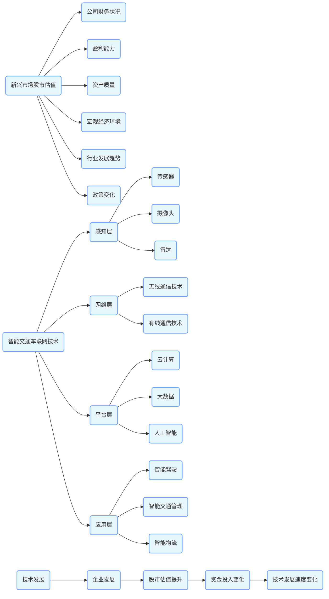

# 新兴市场股市估值与智能交通车联网技术的互动

> 关键词：新兴市场股市估值、智能交通车联网技术、互动关系、经济影响、技术驱动

> 摘要：本文聚焦于新兴市场股市估值与智能交通车联网技术之间的互动关系。通过深入剖析两者的核心概念、算法原理、数学模型等，结合项目实战案例，探讨智能交通车联网技术的发展如何影响新兴市场股市估值，以及股市估值变化又怎样反作用于车联网技术的创新与应用。同时，分析其在实际场景中的应用，推荐相关工具和资源，总结未来发展趋势与挑战，旨在为投资者、技术开发者和政策制定者提供全面且深入的参考。

## 1. 背景介绍 
### 1.1 目的和范围
随着全球经济的发展，新兴市场在国际经济格局中的地位日益重要，其股市的表现也备受关注。与此同时，智能交通车联网技术作为一种新兴的科技领域，正以前所未有的速度改变着交通行业的面貌。本研究的目的在于探究新兴市场股市估值与智能交通车联网技术之间的互动关系，明确这种互动对经济发展、企业战略和投资决策的影响。研究范围涵盖新兴市场的主要股市，包括亚洲、非洲和拉丁美洲等地区，以及智能交通车联网技术的各个方面，如车辆通信、自动驾驶、智能交通管理系统等。

### 1.2 预期读者
本文预期读者包括金融投资者、股票分析师、交通行业从业者、科技企业管理者、政策制定者以及对新兴市场和智能交通车联网技术感兴趣的研究人员。通过阅读本文，读者能够深入了解新兴市场股市估值与智能交通车联网技术之间的内在联系，从而做出更明智的投资决策、制定合理的企业战略和政策规划。

### 1.3 文档结构概述
本文共分为十个部分。第一部分为背景介绍，阐述研究的目的、范围、预期读者和文档结构；第二部分介绍核心概念与联系，包括新兴市场股市估值和智能交通车联网技术的原理和架构；第三部分讲解核心算法原理及具体操作步骤，通过 Python 代码进行详细阐述；第四部分介绍数学模型和公式，并举例说明；第五部分通过项目实战，展示代码实际案例并进行详细解释；第六部分探讨实际应用场景；第七部分推荐相关工具和资源；第八部分总结未来发展趋势与挑战；第九部分为附录，解答常见问题；第十部分提供扩展阅读和参考资料。

### 1.4 术语表
#### 1.4.1 核心术语定义
- **新兴市场股市估值**：指对新兴市场中上市公司股票价值的评估，通常基于公司的财务状况、盈利能力、市场前景等因素。
- **智能交通车联网技术**：是指将先进的传感器、通信、计算机和控制技术应用于交通运输领域，实现车辆与车辆、车辆与基础设施之间的信息交互和协同控制，以提高交通效率、安全性和舒适性的技术。
- **市盈率（P/E）**：是指股票价格与每股收益的比率，是衡量股票估值的常用指标之一。
- **市净率（P/B）**：是指股票价格与每股净资产的比率，反映了市场对公司净资产的估值。
- **车路协同**：是指车辆与道路基础设施之间的协同工作，通过信息交互实现交通的优化和安全。

#### 1.4.2 相关概念解释
- **新兴市场**：通常是指发展中国家或地区的金融市场，具有较高的经济增长率和发展潜力，但也面临着较高的风险。
- **股市估值方法**：包括相对估值法和绝对估值法。相对估值法通过与同行业或其他公司的比较来评估股票价值，如市盈率法、市净率法等；绝对估值法通过对公司未来现金流的折现来评估股票价值，如股息折现模型、自由现金流折现模型等。
- **车联网架构**：包括感知层、网络层、平台层和应用层。感知层负责采集车辆和环境信息；网络层负责信息的传输；平台层负责数据的处理和分析；应用层负责提供各种车联网服务。

#### 1.4.3 缩略词列表
- **V2V**：Vehicle-to-Vehicle，车辆与车辆之间的通信。
- **V2I**：Vehicle-to-Infrastructure，车辆与基础设施之间的通信。
- **V2P**：Vehicle-to-Pedestrian，车辆与行人之间的通信。
- **V2N**：Vehicle-to-Network，车辆与网络之间的通信。
- **ITS**：Intelligent Transportation System，智能交通系统。

## 2. 核心概念与联系 
### 新兴市场股市估值原理
新兴市场股市估值是一个复杂的过程，涉及多个因素的综合考量。其基本原理是基于公司的内在价值和市场预期来评估股票的合理价格。公司的内在价值主要取决于其财务状况、盈利能力、资产质量等因素；市场预期则受到宏观经济环境、行业发展趋势、政策变化等因素的影响。

常见的股市估值方法包括相对估值法和绝对估值法。相对估值法通过与同行业或其他公司的比较来评估股票价值，如市盈率法、市净率法等。市盈率法是将股票价格与每股收益进行比较，市盈率越高，说明市场对公司未来盈利的预期越高；市净率法是将股票价格与每股净资产进行比较，市净率越高，说明市场对公司净资产的估值越高。绝对估值法通过对公司未来现金流的折现来评估股票价值，如股息折现模型、自由现金流折现模型等。股息折现模型是将公司未来的股息按照一定的折现率折现到当前，得到股票的内在价值；自由现金流折现模型是将公司未来的自由现金流按照一定的折现率折现到当前，得到公司的内在价值。

### 智能交通车联网技术架构
智能交通车联网技术是一个多层次的系统架构，主要包括感知层、网络层、平台层和应用层。

感知层是车联网的基础，负责采集车辆和环境信息。感知层的设备包括传感器、摄像头、雷达等，能够实时获取车辆的速度、位置、姿态、周围环境等信息。

网络层是车联网的通信枢纽，负责信息的传输。网络层的技术包括无线通信技术、有线通信技术等，能够实现车辆与车辆、车辆与基础设施之间的信息交互。

平台层是车联网的数据处理和分析中心，负责对感知层采集的信息进行处理和分析。平台层的技术包括云计算、大数据、人工智能等，能够实现对交通数据的实时处理、分析和挖掘。

应用层是车联网的服务提供层，负责提供各种车联网服务。应用层的服务包括智能驾驶、智能交通管理、智能物流等，能够提高交通效率、安全性和舒适性。

### 两者的联系
新兴市场股市估值与智能交通车联网技术之间存在着密切的联系。一方面，智能交通车联网技术的发展会对新兴市场股市估值产生影响。智能交通车联网技术的创新和应用会推动相关企业的发展，提高企业的盈利能力和市场竞争力，从而提升企业的股票价值。例如，随着自动驾驶技术的发展，相关的汽车制造商和科技企业的股票价格可能会上涨。另一方面，新兴市场股市估值的变化也会对智能交通车联网技术的发展产生影响。股市估值的上升会吸引更多的资金投入到智能交通车联网技术领域，促进技术的创新和应用；股市估值的下降则可能导致资金的撤离，影响技术的发展速度。

### 文本示意图
```plaintext
新兴市场股市估值
|-- 公司财务状况
|-- 盈利能力
|-- 资产质量
|-- 宏观经济环境
|-- 行业发展趋势
|-- 政策变化

智能交通车联网技术
|-- 感知层
|   |-- 传感器
|   |-- 摄像头
|   |-- 雷达
|-- 网络层
|   |-- 无线通信技术
|   |-- 有线通信技术
|-- 平台层
|   |-- 云计算
|   |-- 大数据
|   |-- 人工智能
|-- 应用层
|   |-- 智能驾驶
|   |-- 智能交通管理
|   |-- 智能物流

互动关系
|-- 技术发展 -> 企业发展 -> 股市估值提升
|-- 股市估值变化 -> 资金投入变化 -> 技术发展速度变化
```

### Mermaid 流程图


## 3. 核心算法原理 & 具体操作步骤 
### 新兴市场股市估值算法
在新兴市场股市估值中，我们可以使用市盈率法和自由现金流折现模型进行估值。

#### 市盈率法
市盈率法是一种相对估值法，其基本原理是将股票价格与每股收益进行比较，通过与同行业或其他公司的市盈率进行对比，来评估股票的价值。

Python 代码实现：
```python
def pe_ratio_valuation(eps, industry_pe):
    """
    市盈率法估值
    :param eps: 每股收益
    :param industry_pe: 行业平均市盈率
    :return: 股票估值
    """
    return eps * industry_pe

# 示例
eps = 2.0  # 每股收益
industry_pe = 15  # 行业平均市盈率
stock_value = pe_ratio_valuation(eps, industry_pe)
print(f"股票估值: {stock_value}")
```
#### 自由现金流折现模型
自由现金流折现模型是一种绝对估值法，其基本原理是将公司未来的自由现金流按照一定的折现率折现到当前，得到公司的内在价值。

Python 代码实现：
```python
def free_cash_flow_discount_model(fcf, discount_rate, growth_rate, n_years):
    """
    自由现金流折现模型
    :param fcf: 初始自由现金流
    :param discount_rate: 折现率
    :param growth_rate: 自由现金流增长率
    :param n_years: 预测年限
    :return: 公司内在价值
    """
    value = 0
    for year in range(1, n_years + 1):
        future_fcf = fcf * (1 + growth_rate) ** year
        discounted_fcf = future_fcf / (1 + discount_rate) ** year
        value += discounted_fcf
    return value

# 示例
fcf = 1000000  # 初始自由现金流
discount_rate = 0.1  # 折现率
growth_rate = 0.05  # 自由现金流增长率
n_years = 5  # 预测年限
company_value = free_cash_flow_discount_model(fcf, discount_rate, growth_rate, n_years)
print(f"公司内在价值: {company_value}")
```

### 智能交通车联网技术相关算法
在智能交通车联网技术中，我们可以使用车辆轨迹预测算法和车路协同优化算法。

#### 车辆轨迹预测算法
车辆轨迹预测算法可以帮助我们预测车辆未来的行驶轨迹，为智能交通管理和自动驾驶提供支持。这里我们使用简单的线性回归算法进行车辆轨迹预测。

Python 代码实现：
```python
import numpy as np
from sklearn.linear_model import LinearRegression

# 示例数据
x = np.array([1, 2, 3, 4, 5]).reshape(-1, 1)  # 时间
y = np.array([2, 4, 6, 8, 10])  # 车辆位置

# 创建线性回归模型
model = LinearRegression()
model.fit(x, y)

# 预测未来车辆位置
future_time = np.array([6]).reshape(-1, 1)
predicted_position = model.predict(future_time)
print(f"预测未来车辆位置: {predicted_position}")
```

#### 车路协同优化算法
车路协同优化算法可以优化车辆的行驶路线和交通信号控制，提高交通效率。这里我们使用遗传算法进行车路协同优化。

Python 代码实现：
```python
import random
import numpy as np

# 定义问题参数
num_vehicles = 5
num_roads = 3
max_generations = 100
population_size = 50
mutation_rate = 0.1

# 初始化种群
def initialize_population():
    population = []
    for _ in range(population_size):
        individual = [random.randint(0, num_roads - 1) for _ in range(num_vehicles)]
        population.append(individual)
    return population

# 定义适应度函数
def fitness_function(individual):
    # 简单示例：计算总行驶距离
    total_distance = 0
    for i in range(num_vehicles):
        road_index = individual[i]
        # 假设每条路的距离不同
        road_distances = [10, 15, 20]
        total_distance += road_distances[road_index]
    return 1 / total_distance

# 选择操作
def selection(population):
    fitness_values = [fitness_function(individual) for individual in population]
    total_fitness = sum(fitness_values)
    probabilities = [fitness / total_fitness for fitness in fitness_values]
    selected_indices = np.random.choice(len(population), size=2, p=probabilities)
    return [population[i] for i in selected_indices]

# 交叉操作
def crossover(parent1, parent2):
    crossover_point = random.randint(1, num_vehicles - 1)
    child1 = parent1[:crossover_point] + parent2[crossover_point:]
    child2 = parent2[:crossover_point] + parent1[crossover_point:]
    return child1, child2

# 变异操作
def mutation(individual):
    for i in range(num_vehicles):
        if random.random() < mutation_rate:
            individual[i] = random.randint(0, num_roads - 1)
    return individual

# 遗传算法主循环
population = initialize_population()
for generation in range(max_generations):
    new_population = []
    for _ in range(population_size // 2):
        parents = selection(population)
        child1, child2 = crossover(parents[0], parents[1])
        child1 = mutation(child1)
        child2 = mutation(child2)
        new_population.extend([child1, child2])
    population = new_population

# 找到最优个体
best_individual = max(population, key=fitness_function)
best_fitness = fitness_function(best_individual)
print(f"最优个体: {best_individual}")
print(f"最优适应度: {best_fitness}")
```

## 4. 数学模型和公式 & 详细讲解 & 举例说明 
### 新兴市场股市估值数学模型
#### 市盈率法
市盈率法的数学模型为：
$$V = EPS \times PE$$
其中，$V$ 表示股票估值，$EPS$ 表示每股收益，$PE$ 表示市盈率。

举例说明：假设某公司的每股收益为 2 元，行业平均市盈率为 15 倍，则该公司的股票估值为：
$$V = 2 \times 15 = 30$$（元）

#### 自由现金流折现模型
自由现金流折现模型的数学模型为：
$$V = \sum_{t=1}^{n} \frac{FCF_t}{(1 + r)^t}$$
其中，$V$ 表示公司内在价值，$FCF_t$ 表示第 $t$ 年的自由现金流，$r$ 表示折现率，$n$ 表示预测年限。

举例说明：假设某公司初始自由现金流为 100 万元，折现率为 10%，自由现金流增长率为 5%，预测年限为 5 年，则该公司的内在价值为：

第 1 年自由现金流：$FCF_1 = 100 \times (1 + 0.05) = 105$（万元）
第 2 年自由现金流：$FCF_2 = 105 \times (1 + 0.05) = 110.25$（万元）
第 3 年自由现金流：$FCF_3 = 110.25 \times (1 + 0.05) = 115.7625$（万元）
第 4 年自由现金流：$FCF_4 = 115.7625 \times (1 + 0.05) = 121.550625$（万元）
第 5 年自由现金流：$FCF_5 = 121.550625 \times (1 + 0.05) = 127.62815625$（万元）

公司内在价值：
$$
\begin{align*}
V &= \frac{105}{(1 + 0.1)^1} + \frac{110.25}{(1 + 0.1)^2} + \frac{115.7625}{(1 + 0.1)^3} + \frac{121.550625}{(1 + 0.1)^4} + \frac{127.62815625}{(1 + 0.1)^5}\\
&= \frac{105}{1.1} + \frac{110.25}{1.21} + \frac{115.7625}{1.331} + \frac{121.550625}{1.4641} + \frac{127.62815625}{1.61051}\\
&\approx 95.45 + 91.11 + 86.98 + 83.03 + 79.24\\
&\approx 435.81
\end{align*}
$$（万元）

### 智能交通车联网技术数学模型
#### 车辆轨迹预测算法
线性回归模型的数学模型为：
$$y = \beta_0 + \beta_1x + \epsilon$$
其中，$y$ 表示车辆位置，$x$ 表示时间，$\beta_0$ 和 $\beta_1$ 是模型的参数，$\epsilon$ 是误差项。

通过最小二乘法可以求解模型的参数 $\beta_0$ 和 $\beta_1$：
$$\hat{\beta}_1 = \frac{\sum_{i=1}^{n}(x_i - \bar{x})(y_i - \bar{y})}{\sum_{i=1}^{n}(x_i - \bar{x})^2}$$
$$\hat{\beta}_0 = \bar{y} - \hat{\beta}_1\bar{x}$$
其中，$\hat{\beta}_0$ 和 $\hat{\beta}_1$ 是参数的估计值，$\bar{x}$ 和 $\bar{y}$ 分别是 $x$ 和 $y$ 的均值。

举例说明：假设我们有以下数据：
| 时间 $x$ | 车辆位置 $y$ |
| ---- | ---- |
| 1 | 2 |
| 2 | 4 |
| 3 | 6 |
| 4 | 8 |
| 5 | 10 |

计算均值：
$$\bar{x} = \frac{1 + 2 + 3 + 4 + 5}{5} = 3$$
$$\bar{y} = \frac{2 + 4 + 6 + 8 + 10}{5} = 6$$

计算 $\hat{\beta}_1$：
$$
\begin{align*}
\hat{\beta}_1 &= \frac{(1 - 3)(2 - 6) + (2 - 3)(4 - 6) + (3 - 3)(6 - 6) + (4 - 3)(8 - 6) + (5 - 3)(10 - 6)}{(1 - 3)^2 + (2 - 3)^2 + (3 - 3)^2 + (4 - 3)^2 + (5 - 3)^2}\\
&= \frac{(-2)(-4) + (-1)(-2) + 0 + 1 \times 2 + 2 \times 4}{4 + 1 + 0 + 1 + 4}\\
&= \frac{8 + 2 + 0 + 2 + 8}{10}\\
&= 2
\end{align*}
$$

计算 $\hat{\beta}_0$：
$$\hat{\beta}_0 = 6 - 2 \times 3 = 0$$

所以，线性回归模型为 $y = 2x$。当时间 $x = 6$ 时，预测车辆位置 $y = 2 \times 6 = 12$。

#### 车路协同优化算法
遗传算法的数学模型主要涉及适应度函数、选择操作、交叉操作和变异操作。

适应度函数用于评估每个个体的优劣程度，例如在车路协同优化中，适应度函数可以是总行驶距离的倒数：
$$f(x) = \frac{1}{d(x)}$$
其中，$f(x)$ 表示适应度值，$d(x)$ 表示个体 $x$ 的总行驶距离。

选择操作基于适应度值进行概率选择，每个个体被选中的概率为：
$$P(x_i) = \frac{f(x_i)}{\sum_{j=1}^{N}f(x_j)}$$
其中，$P(x_i)$ 表示个体 $x_i$ 被选中的概率，$N$ 表示种群大小。

交叉操作和变异操作是遗传算法的核心操作，用于生成新的个体。交叉操作通过交换两个父个体的部分基因来生成新的个体，变异操作通过随机改变个体的某个基因来生成新的个体。

## 5. 项目实战：代码实际案例和详细解释说明 
### 5.1  开发环境搭建
#### 安装 Python
首先，确保你已经安装了 Python 环境。可以从 Python 官方网站（https://www.python.org/downloads/） 下载并安装最新版本的 Python。

#### 安装必要的库
在本项目中，我们需要使用一些 Python 库，如 `numpy`、`pandas`、`scikit-learn` 等。可以使用以下命令进行安装：
```sh
pip install numpy pandas scikit-learn
```

### 5.2  源代码详细实现和代码解读
#### 新兴市场股市估值案例
我们以一个简单的股票估值案例为例，使用市盈率法和自由现金流折现模型进行股票估值。

```python
import pandas as pd

# 定义市盈率法估值函数
def pe_ratio_valuation(eps, industry_pe):
    """
    市盈率法估值
    :param eps: 每股收益
    :param industry_pe: 行业平均市盈率
    :return: 股票估值
    """
    return eps * industry_pe

# 定义自由现金流折现模型估值函数
def free_cash_flow_discount_model(fcf, discount_rate, growth_rate, n_years):
    """
    自由现金流折现模型
    :param fcf: 初始自由现金流
    :param discount_rate: 折现率
    :param growth_rate: 自由现金流增长率
    :param n_years: 预测年限
    :return: 公司内在价值
    """
    value = 0
    for year in range(1, n_years + 1):
        future_fcf = fcf * (1 + growth_rate) ** year
        discounted_fcf = future_fcf / (1 + discount_rate) ** year
        value += discounted_fcf
    return value

# 示例数据
data = {
    '公司名称': ['A公司', 'B公司', 'C公司'],
    '每股收益': [2.0, 3.0, 1.5],
    '行业平均市盈率': [15, 18, 12],
    '初始自由现金流': [1000000, 1500000, 800000],
    '折现率': [0.1, 0.12, 0.08],
    '自由现金流增长率': [0.05, 0.06, 0.04],
    '预测年限': [5, 5, 5]
}

df = pd.DataFrame(data)

# 计算市盈率法估值
df['市盈率法估值'] = df.apply(lambda row: pe_ratio_valuation(row['每股收益'], row['行业平均市盈率']), axis=1)

# 计算自由现金流折现模型估值
df['自由现金流折现模型估值'] = df.apply(lambda row: free_cash_flow_discount_model(
    row['初始自由现金流'], row['折现率'], row['自由现金流增长率'], row['预测年限']), axis=1)

print(df)
```
代码解读：
1. 首先，我们定义了两个估值函数 `pe_ratio_valuation` 和 `free_cash_flow_discount_model`，分别用于实现市盈率法和自由现金流折现模型的估值。
2. 然后，我们创建了一个包含示例数据的 `DataFrame`，其中包含公司名称、每股收益、行业平均市盈率、初始自由现金流、折现率、自由现金流增长率和预测年限等信息。
3. 接着，我们使用 `apply` 方法对 `DataFrame` 中的每一行数据进行处理，分别计算市盈率法估值和自由现金流折现模型估值，并将结果添加到 `DataFrame` 中。
4. 最后，我们打印出包含估值结果的 `DataFrame`。

#### 智能交通车联网技术案例
我们以车辆轨迹预测为例，使用线性回归算法进行车辆轨迹预测。

```python
import numpy as np
from sklearn.linear_model import LinearRegression
import matplotlib.pyplot as plt

# 示例数据
x = np.array([1, 2, 3, 4, 5]).reshape(-1, 1)  # 时间
y = np.array([2, 4, 6, 8, 10])  # 车辆位置

# 创建线性回归模型
model = LinearRegression()
model.fit(x, y)

# 预测未来车辆位置
future_time = np.array([6]).reshape(-1, 1)
predicted_position = model.predict(future_time)

# 绘制原始数据和预测结果
plt.scatter(x, y, color='blue', label='原始数据')
plt.plot(x, model.predict(x), color='red', label='拟合直线')
plt.scatter(future_time, predicted_position, color='green', label='预测结果')
plt.xlabel('时间')
plt.ylabel('车辆位置')
plt.title('车辆轨迹预测')
plt.legend()
plt.show()
```
代码解读：
1. 首先，我们导入了必要的库，包括 `numpy`、`sklearn.linear_model` 和 `matplotlib.pyplot`。
2. 然后，我们创建了示例数据，包括时间和车辆位置。
3. 接着，我们创建了一个线性回归模型，并使用示例数据进行训练。
4. 之后，我们使用训练好的模型预测未来车辆位置。
5. 最后，我们使用 `matplotlib` 库绘制原始数据、拟合直线和预测结果，以便直观地观察车辆轨迹预测的结果。

### 5.3  代码解读与分析
#### 新兴市场股市估值案例分析
在新兴市场股市估值案例中，我们使用了市盈率法和自由现金流折现模型进行股票估值。市盈率法是一种相对简单的估值方法，它通过与同行业或其他公司的市盈率进行对比，来评估股票的价值。自由现金流折现模型则是一种更复杂的估值方法，它考虑了公司未来的自由现金流和折现率，能够更准确地评估公司的内在价值。

通过对示例数据的处理，我们可以得到不同公司的市盈率法估值和自由现金流折现模型估值结果。这些结果可以为投资者提供参考，帮助他们做出更明智的投资决策。

#### 智能交通车联网技术案例分析
在智能交通车联网技术案例中，我们使用了线性回归算法进行车辆轨迹预测。线性回归是一种简单而有效的机器学习算法，它可以通过对历史数据的学习，建立时间和车辆位置之间的线性关系，从而预测未来车辆位置。

通过绘制原始数据、拟合直线和预测结果，我们可以直观地观察到线性回归模型的拟合效果和预测结果。这有助于我们评估模型的准确性和可靠性，为智能交通管理和自动驾驶提供支持。

## 6. 实际应用场景 
### 新兴市场股市估值的应用场景
#### 投资决策
投资者可以使用新兴市场股市估值方法来评估股票的价值，从而做出投资决策。例如，当股票的估值低于其内在价值时，投资者可以考虑买入该股票；当股票的估值高于其内在价值时，投资者可以考虑卖出该股票。

#### 公司战略规划
公司管理者可以使用新兴市场股市估值方法来评估公司的价值，从而制定合理的公司战略规划。例如，当公司的估值较低时，公司管理者可以考虑进行资产重组、并购等活动，以提高公司的价值；当公司的估值较高时，公司管理者可以考虑进行股权融资、扩张等活动，以实现公司的快速发展。

#### 政策制定
政策制定者可以使用新兴市场股市估值方法来评估股市的整体估值水平，从而制定合理的政策措施。例如，当股市的整体估值过高时，政策制定者可以考虑采取加息、收紧货币政策等措施，以抑制股市泡沫；当股市的整体估值过低时，政策制定者可以考虑采取降息、放松货币政策等措施，以刺激股市上涨。

### 智能交通车联网技术的应用场景
#### 智能驾驶
智能交通车联网技术可以为智能驾驶提供支持，实现车辆的自动驾驶和辅助驾驶。例如，通过车辆与车辆、车辆与基础设施之间的信息交互，智能驾驶车辆可以实时获取周围环境信息，从而做出更加安全、高效的驾驶决策。

#### 智能交通管理
智能交通车联网技术可以为智能交通管理提供支持，实现交通的优化和安全。例如，通过车路协同技术，交通管理部门可以实时获取交通流量信息，从而优化交通信号控制，减少交通拥堵；通过车辆轨迹预测技术，交通管理部门可以提前预警交通事故，采取相应的措施，提高交通安全性。

#### 智能物流
智能交通车联网技术可以为智能物流提供支持，实现物流的智能化和高效化。例如，通过车辆与货物之间的信息交互，智能物流车辆可以实时获取货物的状态信息，从而优化物流路线，提高物流效率；通过车路协同技术，智能物流车辆可以实时获取交通信息，从而避免交通拥堵，提高物流配送的及时性。

### 两者互动的应用场景
#### 投资新兴市场车联网相关企业
投资者可以关注新兴市场中智能交通车联网技术相关企业的发展，通过对这些企业的股市估值分析，做出投资决策。例如，当智能交通车联网技术处于快速发展阶段时，相关企业的业绩可能会大幅增长，其股票估值也可能会随之上升，投资者可以考虑买入这些企业的股票。

#### 企业战略调整
智能交通车联网技术相关企业可以根据新兴市场股市估值的变化，调整企业的战略规划。例如，当股市估值上升时，企业可以考虑进行股权融资，加大研发投入，加速技术创新和应用；当股市估值下降时，企业可以考虑进行资产重组、降低成本，以提高企业的竞争力。

#### 政策支持与引导
政策制定者可以根据新兴市场股市估值与智能交通车联网技术的互动关系，制定相应的政策措施，支持和引导智能交通车联网技术的发展。例如，当股市估值较低时，政策制定者可以出台相关政策，鼓励投资者投资智能交通车联网技术相关企业，促进技术的创新和应用；当股市估值较高时，政策制定者可以加强对相关企业的监管，防止股市泡沫的产生。

## 7. 工具和资源推荐
### 7.1 学习资源推荐
#### 7.1.1 书籍推荐
- 《金融市场与金融机构》：这本书全面介绍了金融市场和金融机构的基本概念、理论和实践，对于理解新兴市场股市估值有很大的帮助。
- 《智能交通系统概论》：这本书系统地介绍了智能交通系统的基本概念、技术和应用，对于学习智能交通车联网技术有很大的帮助。
- 《机器学习》：这本书详细介绍了机器学习的基本概念、算法和应用，对于学习智能交通车联网技术中的相关算法有很大的帮助。

#### 7.1.2 在线课程
- Coursera 上的“Financial Markets”：这门课程由耶鲁大学教授罗伯特·席勒（Robert Shiller）主讲，介绍了金融市场的基本概念、理论和实践。
- edX 上的“Intelligent Transportation Systems”：这门课程由麻省理工学院（MIT）教授丹尼尔·鲁斯（Daniela Rus）主讲，介绍了智能交通系统的基本概念、技术和应用。
- 中国大学 MOOC 上的“机器学习基础”：这门课程由清华大学教授周志华主讲，介绍了机器学习的基本概念、算法和应用。

#### 7.1.3 技术博客和网站
- 雪球网：这是一个专注于股票投资的社区，提供了丰富的股票分析和投资策略，对于了解新兴市场股市估值有很大的帮助。
- 智能交通网：这是一个专注于智能交通领域的网站，提供了智能交通技术的最新动态、研究成果和应用案例，对于了解智能交通车联网技术有很大的帮助。
- 开源中国：这是一个开源技术社区，提供了大量的开源代码和技术文章，对于学习智能交通车联网技术中的相关算法有很大的帮助。

### 7.2 开发工具框架推荐
#### 7.2.1 IDE和编辑器
- PyCharm：这是一款专门为 Python 开发设计的集成开发环境（IDE），提供了丰富的功能和插件，对于开发智能交通车联网技术相关的 Python 代码有很大的帮助。
- Visual Studio Code：这是一款轻量级的代码编辑器，支持多种编程语言，提供了丰富的插件和扩展，对于开发智能交通车联网技术相关的代码有很大的帮助。

#### 7.2.2 调试和性能分析工具
- Py-Spy：这是一个用于 Python 代码性能分析的工具，可以帮助开发者找出代码中的性能瓶颈，提高代码的运行效率。
- PDB：这是 Python 自带的调试工具，可以帮助开发者调试 Python 代码，找出代码中的错误。

#### 7.2.3 相关框架和库
- TensorFlow：这是一个开源的机器学习框架，提供了丰富的机器学习算法和工具，对于开发智能交通车联网技术中的机器学习算法有很大的帮助。
- PyTorch：这是一个开源的深度学习框架，提供了丰富的深度学习算法和工具，对于开发智能交通车联网技术中的深度学习算法有很大的帮助。
- Scikit-learn：这是一个开源的机器学习库，提供了丰富的机器学习算法和工具，对于开发智能交通车联网技术中的机器学习算法有很大的帮助。

### 7.3 相关论文著作推荐
#### 7.3.1 经典论文
- Fama, E. F., & French, K. R. (1992). The cross-section of expected stock returns. The Journal of Finance, 47(2), 427-465. 这篇论文提出了著名的 Fama-French 三因子模型，对于理解股票收益率的影响因素有很大的帮助。
- Lee, J. H., & Whang, S. (2002). Vehicle-to-vehicle communication: a tutorial and survey. Proceedings of the IEEE, 90(7), 1101-1122. 这篇论文系统地介绍了车辆与车辆之间的通信技术，对于了解智能交通车联网技术有很大的帮助。

#### 7.3.2 最新研究成果
- Chen, X., & Zhang, Y. (2020). A survey on intelligent transportation systems: recent advances and future trends. IEEE Transactions on Intelligent Transportation Systems, 21(10), 4182-4202. 这篇论文对智能交通系统的最新研究成果和未来发展趋势进行了综述，对于了解智能交通车联网技术的发展方向有很大的帮助。
- Huang, J., & Wang, Y. (2021). Stock market valuation and economic growth in emerging markets. Journal of International Financial Markets, Institutions and Money, 72, 101344. 这篇论文研究了新兴市场股市估值与经济增长之间的关系，对于理解新兴市场股市估值的影响因素有很大的帮助。

#### 7.3.3 应用案例分析
- Wang, L., & Li, S. (2019). Application of intelligent transportation systems in urban traffic management: a case study of Beijing. Transportation Research Part C: Emerging Technologies, 106, 102391. 这篇论文以北京为例，分析了智能交通系统在城市交通管理中的应用案例，对于了解智能交通车联网技术的实际应用有很大的帮助。
- Zhang, X., & Liu, Y. (2020). Investment strategy based on stock market valuation in emerging markets: a case study of China. Journal of Asian Economics, 71, 101293. 这篇论文以中国为例，分析了基于新兴市场股市估值的投资策略，对于了解新兴市场股市估值的应用有很大的帮助。

## 8. 总结：未来发展趋势与挑战
### 未来发展趋势
#### 新兴市场股市估值
- 随着新兴市场国家经济的不断发展，其股市规模和影响力将不断扩大，股市估值方法也将不断完善和创新。
- 人工智能、大数据等技术将在新兴市场股市估值中得到更广泛的应用，提高估值的准确性和效率。
- 新兴市场股市与全球股市的联动性将不断增强，股市估值将受到全球经济和金融市场的影响越来越大。

#### 智能交通车联网技术
- 智能交通车联网技术将不断向智能化、自动化、网联化方向发展，实现车辆的自动驾驶和交通的智能管理。
- 5G 技术的普及将为智能交通车联网技术的发展提供更强大的通信支持，加速技术的创新和应用。
- 智能交通车联网技术将与新能源汽车、共享出行等领域深度融合，推动交通行业的变革和发展。

#### 两者互动
- 智能交通车联网技术的发展将为新兴市场股市带来新的投资机会，相关企业的股票估值将不断上升。
- 新兴市场股市的资金将为智能交通车联网技术的发展提供支持，加速技术的创新和应用。
- 政府将加强对新兴市场股市和智能交通车联网技术的政策支持和引导，促进两者的良性互动和协同发展。

### 挑战
#### 新兴市场股市估值
- 新兴市场股市的信息披露制度不够完善，信息不对称问题较为严重，给股市估值带来了一定的困难。
- 新兴市场股市的波动性较大，市场风险较高，给股市估值带来了一定的不确定性。
- 新兴市场股市的估值方法和标准存在差异，不同的估值方法和标准可能会导致不同的估值结果。

#### 智能交通车联网技术
- 智能交通车联网技术的安全性和可靠性是一个重要的挑战，需要加强技术研发和测试，确保技术的安全可靠。
- 智能交通车联网技术的标准和规范不够统一，不同的技术标准和规范可能会导致技术的兼容性问题。
- 智能交通车联网技术的应用需要大量的基础设施建设和投资，需要政府和企业共同努力，加大投资力度。

#### 两者互动
- 新兴市场股市的波动可能会影响智能交通车联网技术相关企业的融资和发展，给技术的创新和应用带来一定的困难。
- 智能交通车联网技术的发展可能会导致相关企业的竞争加剧，股市估值的波动可能会加大。
- 政府的政策支持和引导需要更加精准和有效，以促进新兴市场股市和智能交通车联网技术的良性互动和协同发展。

## 9. 附录：常见问题与解答
### 新兴市场股市估值相关问题
#### 问：新兴市场股市估值与成熟市场股市估值有什么区别？
答：新兴市场股市估值与成熟市场股市估值存在一些区别。新兴市场股市通常具有较高的经济增长率和发展潜力，但也面临着较高的风险，如政治风险、经济风险、市场风险等。因此，新兴市场股市的估值通常会受到这些风险因素的影响，估值水平可能会相对较低。成熟市场股市则通常具有较为完善的市场制度和监管体系，市场风险相对较低，估值水平可能会相对较高。

#### 问：如何选择合适的股市估值方法？
答：选择合适的股市估值方法需要考虑多个因素，如公司的行业特点、财务状况、发展阶段、市场环境等。一般来说，对于盈利稳定的公司，可以使用市盈率法进行估值；对于盈利不稳定或处于成长阶段的公司，可以使用自由现金流折现模型进行估值。此外，还可以结合多种估值方法进行综合分析，以提高估值的准确性和可靠性。

### 智能交通车联网技术相关问题
#### 问：智能交通车联网技术的发展面临哪些技术挑战？
答：智能交通车联网技术的发展面临着多个技术挑战，如传感器技术、通信技术、云计算技术、人工智能技术等。传感器技术需要提高传感器的精度和可靠性，以获取更准确的车辆和环境信息；通信技术需要提高通信的速度和稳定性，以实现车辆与车辆、车辆与基础设施之间的实时信息交互；云计算技术需要提高云计算的处理能力和存储能力，以实现对大量交通数据的实时处理和分析；人工智能技术需要提高人工智能的算法和模型，以实现对交通数据的智能分析和决策。

#### 问：智能交通车联网技术的应用需要哪些基础设施支持？
答：智能交通车联网技术的应用需要多个方面的基础设施支持，如道路基础设施、通信基础设施、数据中心等。道路基础设施需要安装传感器、摄像头、雷达等设备，以获取车辆和环境信息；通信基础设施需要建设 5G 基站、光纤网络等，以实现车辆与车辆、车辆与基础设施之间的信息交互；数据中心需要建设云计算平台、大数据平台等，以实现对大量交通数据的实时处理和分析。

### 两者互动相关问题
#### 问：新兴市场股市估值的变化如何影响智能交通车联网技术的发展？
答：新兴市场股市估值的变化会对智能交通车联网技术的发展产生影响。当股市估值上升时，智能交通车联网技术相关企业的股价会上涨，企业的融资能力会增强，企业可以获得更多的资金用于技术研发和创新，从而加速技术的发展。当股市估值下降时，智能交通车联网技术相关企业的股价会下跌，企业的融资能力会减弱，企业可能会减少技术研发和创新的投入，从而影响技术的发展速度。

#### 问：智能交通车联网技术的发展如何影响新兴市场股市估值？
答：智能交通车联网技术的发展会对新兴市场股市估值产生影响。当智能交通车联网技术取得重大突破和应用时，相关企业的业绩会大幅增长，企业的市场竞争力会增强，企业的股票估值也会随之上升。当智能交通车联网技术发展遇到瓶颈或挫折时，相关企业的业绩会受到影响，企业的市场竞争力会减弱，企业的股票估值也会随之下降。

## 10. 扩展阅读 & 参考资料
### 扩展阅读
- 《金融炼金术》：这本书由乔治·索罗斯（George Soros）所著，介绍了他的投资哲学和金融市场理论，对于理解金融市场的运行机制和股票估值