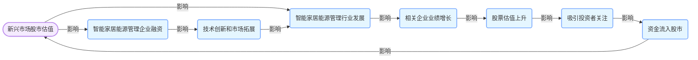

# 新兴市场股市估值与智能家居能源管理的互动

> 关键词：新兴市场股市、股市估值、智能家居、能源管理、互动关系、市场趋势、经济影响

> 摘要：本文深入探讨新兴市场股市估值与智能家居能源管理之间的互动关系。首先介绍研究的背景、目的、预期读者和文档结构，明确相关术语概念。接着阐述核心概念及其联系，详细讲解核心算法原理和具体操作步骤，通过数学模型和公式对两者关系进行理论分析。结合项目实战案例，展示代码实现并进行解读。探讨实际应用场景，推荐相关学习资源、开发工具框架和论文著作。最后总结未来发展趋势与挑战，解答常见问题并提供扩展阅读和参考资料，旨在全面揭示两者互动的本质和影响，为相关领域的研究和实践提供有价值的参考。

## 1. 背景介绍 
### 1.1 目的和范围
本研究的主要目的是深入剖析新兴市场股市估值与智能家居能源管理之间的互动关系。新兴市场在全球经济格局中扮演着日益重要的角色，其股市估值受到多种因素的影响。与此同时，智能家居能源管理作为科技与能源领域的新兴趋势，正逐渐改变人们的生活和能源使用方式。探究两者之间的互动关系，有助于投资者更好地理解新兴市场股市的动态，也能为智能家居能源管理行业的发展提供市场层面的参考。研究范围涵盖新兴市场的主要股市，以及智能家居能源管理领域的技术、市场和政策等方面。

### 1.2 预期读者
本文预期读者包括金融领域的投资者、分析师，智能家居能源管理行业的从业者、研发人员，以及对新兴市场和科技发展感兴趣的学者和研究人员。对于投资者来说，了解两者的互动关系有助于优化投资策略；对于从业者和研发人员，能为产品开发和市场拓展提供思路；对于学者和研究人员，则可作为进一步深入研究的基础。

### 1.3 文档结构概述
本文将按照以下结构展开：首先介绍研究的背景信息，包括目的、预期读者和文档结构概述，以及相关术语的定义和解释。接着阐述核心概念与联系，通过文本示意图和 Mermaid 流程图展示两者的关系。然后详细讲解核心算法原理和具体操作步骤，结合 Python 源代码进行说明。再通过数学模型和公式对两者的互动关系进行理论分析，并举例说明。之后进行项目实战，展示代码实际案例并详细解释说明。探讨实际应用场景，推荐相关的学习资源、开发工具框架和论文著作。最后总结未来发展趋势与挑战，解答常见问题并提供扩展阅读和参考资料。

### 1.4 术语表
#### 1.4.1 核心术语定义
- **新兴市场股市**：指那些经济发展较快、市场潜力较大的发展中国家和地区的股票市场。这些市场通常具有较高的增长速度和投资回报率，但也伴随着较高的风险。
- **股市估值**：是对股票市场中股票价值的评估，常用的估值方法包括市盈率（P/E）、市净率（P/B）等。股市估值反映了市场对股票未来收益的预期。
- **智能家居能源管理**：是指利用先进的信息技术和自动化控制技术，对智能家居中的能源设备进行智能化管理和优化控制，以实现能源的高效利用和节能减排。

#### 1.4.2 相关概念解释
- **新兴市场**：一般是指发展中国家的经济市场，具有经济增长迅速、市场开放程度逐渐提高、产业结构不断升级等特点。新兴市场的发展对全球经济增长具有重要的推动作用。
- **智能家居**：是以住宅为平台，利用综合布线技术、网络通信技术、安全防范技术、自动控制技术、音视频技术将家居生活有关的设施集成，构建高效的住宅设施与家庭日程事务的管理系统，提升家居安全性、便利性、舒适性、艺术性，并实现环保节能的居住环境。
- **能源管理**：是对能源的生产、分配、转换和使用的全过程进行科学的计划、组织、控制和监督等一系列活动的总称。能源管理的目的是提高能源利用效率，降低能源消耗，减少对环境的影响。

#### 1.4.3 缩略词列表
- **P/E**：市盈率（Price-to-Earnings Ratio），是指股票价格除以每股收益（EPS）的比率，反映了市场对公司盈利能力的预期。
- **P/B**：市净率（Price-to-Book Ratio），是指股票价格除以每股净资产的比率，反映了市场对公司净资产价值的评估。

## 2. 核心概念与联系 

### 核心概念原理
新兴市场股市估值受到多种因素的影响，包括宏观经济环境、政策法规、公司基本面等。宏观经济环境的变化会影响企业的盈利能力和市场预期，从而对股市估值产生影响。政策法规的调整也会对新兴市场股市产生重要影响，例如税收政策、产业政策等。公司基本面是股市估值的重要基础，包括公司的财务状况、经营业绩、市场竞争力等。

智能家居能源管理的核心原理是通过信息技术和自动化控制技术，实现对智能家居中能源设备的智能化管理和优化控制。智能家居能源管理系统可以实时监测能源设备的运行状态和能源消耗情况，根据用户的需求和能源市场的价格变化，自动调整能源设备的运行模式，以实现能源的高效利用和节能减排。

### 架构的文本示意图
新兴市场股市估值与智能家居能源管理之间存在着复杂的互动关系。一方面，智能家居能源管理行业的发展会影响新兴市场股市的估值。智能家居能源管理行业的快速发展会带动相关企业的业绩增长，从而提高这些企业的股票估值。同时，智能家居能源管理行业的发展也会吸引更多的投资者关注新兴市场股市，增加市场的资金流入，进一步推动股市估值的上升。另一方面，新兴市场股市估值的变化也会影响智能家居能源管理行业的发展。股市估值的上升会为智能家居能源管理企业提供更多的融资渠道，促进企业的技术创新和市场拓展。相反，股市估值的下降会导致企业融资困难，影响企业的发展。

### Mermaid 流程图


## 3. 核心算法原理 & 具体操作步骤 

### 核心算法原理
为了分析新兴市场股市估值与智能家居能源管理之间的互动关系，我们可以采用时间序列分析和回归分析的方法。时间序列分析可以用于分析新兴市场股市估值和智能家居能源管理行业相关指标（如行业销售额、企业利润等）的时间变化趋势。回归分析可以用于建立新兴市场股市估值与智能家居能源管理行业相关指标之间的数学模型，以定量分析两者之间的关系。

### 具体操作步骤
1. **数据收集**：收集新兴市场股市的相关数据，如股票价格、市盈率、市净率等，以及智能家居能源管理行业的相关数据，如行业销售额、企业利润、技术创新指标等。数据的时间跨度应尽量长，以保证分析结果的准确性。
2. **数据预处理**：对收集到的数据进行清洗、整理和标准化处理，去除异常值和缺失值，以保证数据的质量。
3. **时间序列分析**：采用 ARIMA（自回归积分滑动平均模型）等时间序列分析方法，对新兴市场股市估值和智能家居能源管理行业相关指标的时间变化趋势进行分析，找出其变化规律和周期性特征。
4. **回归分析**：建立新兴市场股市估值与智能家居能源管理行业相关指标之间的回归模型，如线性回归模型、多元回归模型等，以定量分析两者之间的关系。
5. **模型评估**：采用均方误差（MSE）、平均绝对误差（MAE）等评估指标，对建立的回归模型进行评估，以检验模型的准确性和可靠性。
6. **结果分析**：根据时间序列分析和回归分析的结果，分析新兴市场股市估值与智能家居能源管理之间的互动关系，为投资者和从业者提供决策参考。

### Python 源代码实现
```python
import pandas as pd
import numpy as np
from statsmodels.tsa.arima.model import ARIMA
from sklearn.linear_model import LinearRegression
from sklearn.metrics import mean_squared_error, mean_absolute_error

# 数据收集和预处理
def data_preprocessing(file_path):
    data = pd.read_csv(file_path)
    # 去除缺失值
    data = data.dropna()
    # 标准化处理
    for column in data.columns:
        if column != 'date':
            data[column] = (data[column] - data[column].mean()) / data[column].std()
    return data

# 时间序列分析
def time_series_analysis(data, column):
    model = ARIMA(data[column], order=(1, 1, 1))
    model_fit = model.fit()
    predictions = model_fit.predict(start=0, end=len(data)-1)
    return predictions

# 回归分析
def regression_analysis(data, x_columns, y_column):
    X = data[x_columns]
    y = data[y_column]
    model = LinearRegression()
    model.fit(X, y)
    predictions = model.predict(X)
    mse = mean_squared_error(y, predictions)
    mae = mean_absolute_error(y, predictions)
    return model, mse, mae

# 主函数
def main():
    file_path = 'data.csv'
    data = data_preprocessing(file_path)
    
    # 时间序列分析
    stock_valuation_predictions = time_series_analysis(data, 'stock_valuation')
    energy_management_predictions = time_series_analysis(data, 'energy_management_index')
    
    # 回归分析
    x_columns = ['energy_management_index']
    y_column = 'stock_valuation'
    model, mse, mae = regression_analysis(data, x_columns, y_column)
    
    print(f"均方误差 (MSE): {mse}")
    print(f"平均绝对误差 (MAE): {mae}")

if __name__ == "__main__":
    main()
```

## 4. 数学模型和公式 & 详细讲解 & 举例说明 

### 时间序列分析模型（ARIMA）
ARIMA（自回归积分滑动平均模型）是一种常用的时间序列分析模型，其数学表达式为：

$$
\phi(B)(1 - B)^d Y_t = \theta(B) \epsilon_t
$$

其中，$Y_t$ 是时间序列数据，$B$ 是滞后算子，$\phi(B)$ 是自回归多项式，$\theta(B)$ 是滑动平均多项式，$d$ 是差分阶数，$\epsilon_t$ 是白噪声序列。

### 回归分析模型（线性回归）
线性回归模型的数学表达式为：

$$
Y = \beta_0 + \beta_1 X_1 + \beta_2 X_2 + \cdots + \beta_n X_n + \epsilon
$$

其中，$Y$ 是因变量，$X_1, X_2, \cdots, X_n$ 是自变量，$\beta_0, \beta_1, \cdots, \beta_n$ 是回归系数，$\epsilon$ 是误差项。

### 详细讲解
- **ARIMA 模型**：ARIMA 模型通过对时间序列数据进行差分处理，使其成为平稳序列，然后建立自回归和滑动平均模型来预测未来值。差分阶数 $d$ 表示对时间序列数据进行差分的次数，自回归多项式 $\phi(B)$ 和滑动平均多项式 $\theta(B)$ 分别表示自回归和滑动平均的系数。
- **线性回归模型**：线性回归模型通过最小二乘法来估计回归系数 $\beta_0, \beta_1, \cdots, \beta_n$，使得误差项 $\epsilon$ 的平方和最小。回归系数表示自变量对因变量的影响程度。

### 举例说明
假设我们有新兴市场股市估值和智能家居能源管理行业销售额的时间序列数据。我们可以使用 ARIMA 模型对这两个时间序列数据进行分析，找出其变化规律和周期性特征。然后，我们可以使用线性回归模型建立新兴市场股市估值与智能家居能源管理行业销售额之间的关系模型，以定量分析两者之间的关系。

例如，通过线性回归分析得到的回归方程为：

$$
\text{股市估值} = 100 + 0.5 \times \text{智能家居能源管理行业销售额}
$$

这意味着智能家居能源管理行业销售额每增加 1 个单位，新兴市场股市估值将增加 0.5 个单位。

## 5. 项目实战：代码实际案例和详细解释说明 

### 5.1  开发环境搭建
1. **安装 Python**：从 Python 官方网站（https://www.python.org/downloads/）下载并安装 Python 3.x 版本。
2. **安装必要的库**：使用以下命令安装所需的库：
```sh
pip install pandas numpy statsmodels scikit-learn
```

### 5.2  源代码详细实现和代码解读
```python
import pandas as pd
import numpy as np
from statsmodels.tsa.arima.model import ARIMA
from sklearn.linear_model import LinearRegression
from sklearn.metrics import mean_squared_error, mean_absolute_error

# 数据收集和预处理
def data_preprocessing(file_path):
    data = pd.read_csv(file_path)
    # 去除缺失值
    data = data.dropna()
    # 标准化处理
    for column in data.columns:
        if column != 'date':
            data[column] = (data[column] - data[column].mean()) / data[column].std()
    return data

# 时间序列分析
def time_series_analysis(data, column):
    model = ARIMA(data[column], order=(1, 1, 1))
    model_fit = model.fit()
    predictions = model_fit.predict(start=0, end=len(data)-1)
    return predictions

# 回归分析
def regression_analysis(data, x_columns, y_column):
    X = data[x_columns]
    y = data[y_column]
    model = LinearRegression()
    model.fit(X, y)
    predictions = model.predict(X)
    mse = mean_squared_error(y, predictions)
    mae = mean_absolute_error(y, predictions)
    return model, mse, mae

# 主函数
def main():
    file_path = 'data.csv'
    data = data_preprocessing(file_path)
    
    # 时间序列分析
    stock_valuation_predictions = time_series_analysis(data, 'stock_valuation')
    energy_management_predictions = time_series_analysis(data, 'energy_management_index')
    
    # 回归分析
    x_columns = ['energy_management_index']
    y_column = 'stock_valuation'
    model, mse, mae = regression_analysis(data, x_columns, y_column)
    
    print(f"均方误差 (MSE): {mse}")
    print(f"平均绝对误差 (MAE): {mae}")

if __name__ == "__main__":
    main()
```
### 代码解读与分析
1. **数据收集和预处理**：`data_preprocessing` 函数用于读取 CSV 文件中的数据，并对数据进行清洗和标准化处理。去除缺失值可以保证数据的完整性，标准化处理可以使不同变量的数据具有可比性。
2. **时间序列分析**：`time_series_analysis` 函数使用 ARIMA 模型对时间序列数据进行分析和预测。`order=(1, 1, 1)` 表示 ARIMA 模型的自回归阶数为 1，差分阶数为 1，滑动平均阶数为 1。
3. **回归分析**：`regression_analysis` 函数使用线性回归模型建立自变量和因变量之间的关系模型，并计算均方误差（MSE）和平均绝对误差（MAE）来评估模型的准确性。
4. **主函数**：`main` 函数调用上述函数完成数据处理、时间序列分析和回归分析，并输出均方误差和平均绝对误差。

## 6. 实际应用场景 
### 投资者决策
投资者可以根据新兴市场股市估值与智能家居能源管理之间的互动关系，调整投资策略。当智能家居能源管理行业发展前景良好时，投资者可以增加对相关企业股票的投资，以获取更高的收益。同时，投资者也可以关注新兴市场股市估值的变化，及时调整投资组合，降低投资风险。

### 企业战略规划
智能家居能源管理企业可以根据新兴市场股市估值的变化，制定合理的战略规划。当股市估值上升时，企业可以通过增发股票等方式筹集资金，加大技术研发和市场拓展的力度。相反，当股市估值下降时，企业可以采取保守的经营策略，降低成本，提高企业的抗风险能力。

### 政策制定
政府可以根据新兴市场股市估值与智能家居能源管理之间的互动关系，制定相关政策，促进智能家居能源管理行业的发展。例如，政府可以出台税收优惠政策、财政补贴政策等，鼓励企业加大对智能家居能源管理技术的研发和应用，推动行业的发展。同时，政府也可以加强对新兴市场股市的监管，维护市场的稳定，为智能家居能源管理行业的发展创造良好的市场环境。

## 7. 工具和资源推荐
### 7.1 学习资源推荐
#### 7.1.1 书籍推荐
- 《时间序列分析：预测与控制》（Time Series Analysis: Forecasting and Control）：这本书是时间序列分析领域的经典著作，详细介绍了时间序列分析的理论和方法，包括 ARIMA 模型、GARCH 模型等。
- 《计量经济学基础》（Basic Econometrics）：这本书是计量经济学领域的经典教材，系统介绍了计量经济学的基本理论和方法，包括线性回归模型、多元回归模型等。
- 《智能家居：原理、技术与应用》：这本书全面介绍了智能家居的原理、技术和应用，包括智能家居能源管理系统的设计和实现。

#### 7.1.2 在线课程
- Coursera 上的“时间序列分析与预测”课程：该课程由知名教授授课，系统介绍了时间序列分析的理论和方法，包括 ARIMA 模型、季节性时间序列分析等。
- edX 上的“计量经济学原理”课程：该课程由顶尖大学的教授授课，详细讲解了计量经济学的基本原理和方法，包括线性回归模型、工具变量法等。
- Udemy 上的“智能家居开发实战”课程：该课程通过实际案例，介绍了智能家居系统的开发过程，包括智能家居能源管理系统的设计和实现。

#### 7.1.3 技术博客和网站
- Towards Data Science：这是一个专注于数据科学和机器学习的技术博客，提供了大量关于时间序列分析、回归分析等方面的文章和教程。
- Kaggle：这是一个数据科学竞赛平台，提供了丰富的数据集和代码示例，可用于学习和实践时间序列分析和回归分析等方法。
- Home Automation Pro：这是一个智能家居技术博客，提供了关于智能家居能源管理系统的最新技术和应用案例。

### 7.2 开发工具框架推荐
#### 7.2.1 IDE和编辑器
- PyCharm：这是一款专业的 Python 集成开发环境（IDE），提供了丰富的功能和插件，可用于开发和调试 Python 代码。
- Jupyter Notebook：这是一个交互式的开发环境，可用于数据分析和模型开发。它支持多种编程语言，包括 Python、R 等。
- Visual Studio Code：这是一款轻量级的代码编辑器，支持多种编程语言和插件，可用于开发和调试 Python 代码。

#### 7.2.2 调试和性能分析工具
- pdb：这是 Python 自带的调试工具，可用于调试 Python 代码。它提供了断点设置、单步执行等功能，方便开发者调试代码。
- cProfile：这是 Python 自带的性能分析工具，可用于分析 Python 代码的性能。它可以统计函数的调用次数、执行时间等信息，帮助开发者找出性能瓶颈。
- Py-Spy：这是一个开源的性能分析工具，可用于分析 Python 代码的性能。它可以实时监控 Python 进程的 CPU 使用率、内存使用率等信息，帮助开发者优化代码。

#### 7.2.3 相关框架和库
- Pandas：这是一个强大的数据分析库，提供了数据结构和数据分析工具，可用于数据清洗、整理和分析。
- NumPy：这是一个科学计算库，提供了高效的数组操作和数学函数，可用于数值计算和数据分析。
- Scikit-learn：这是一个机器学习库，提供了各种机器学习算法和工具，可用于模型训练、预测和评估。
- Statsmodels：这是一个统计建模库，提供了各种统计模型和方法，可用于时间序列分析、回归分析等。

### 7.3 相关论文著作推荐
#### 7.3.1 经典论文
- “A New Approach to Linear Filtering and Prediction Problems” by R. E. Kalman：这篇论文提出了卡尔曼滤波算法，是时间序列分析领域的经典论文之一。
- “Regression Analysis and Its Application: A Data-Oriented Approach” by G. A. F. Seber and C. J. Wild：这篇论文系统介绍了回归分析的理论和方法，是回归分析领域的经典论文之一。
- “The Internet of Things: A Survey” by L. Atzori, A. Iera, and G. Morabito：这篇论文对物联网技术进行了全面的综述，包括智能家居技术的发展和应用。

#### 7.3.2 最新研究成果
- 关注顶级学术期刊，如《Journal of Financial Economics》、《Energy Economics》、《IEEE Transactions on Smart Grid》等，这些期刊发表了关于新兴市场股市估值、智能家居能源管理等方面的最新研究成果。
- 参加国际学术会议，如 ACM SIGKDD、IEEE INFOCOM 等，这些会议汇聚了全球顶尖的研究人员，展示了相关领域的最新研究进展。

#### 7.3.3 应用案例分析
- 研究一些成功的智能家居能源管理项目案例，如谷歌的 Nest 智能家居系统、三星的 SmartThings 智能家居平台等，了解这些项目的技术架构、商业模式和市场策略。
- 分析一些新兴市场股市中智能家居能源管理相关企业的发展案例，如小米、华为等，了解这些企业的发展历程、竞争优势和市场表现。

## 8. 总结：未来发展趋势与挑战
### 未来发展趋势
1. **技术创新推动发展**：随着人工智能、物联网、大数据等技术的不断发展，智能家居能源管理系统将变得更加智能化、自动化和高效化。例如，人工智能技术可以实现对能源设备的智能控制和优化调度，物联网技术可以实现能源设备的互联互通和远程监控，大数据技术可以实现对能源消耗数据的分析和挖掘，为用户提供更加个性化的能源管理方案。
2. **市场需求不断增长**：随着人们生活水平的提高和环保意识的增强，对智能家居能源管理的需求将不断增长。智能家居能源管理系统可以帮助用户降低能源消耗，提高能源利用效率，减少对环境的影响，符合人们对绿色、环保、节能生活的追求。
3. **政策支持力度加大**：为了推动智能家居能源管理行业的发展，各国政府将加大政策支持力度。例如，政府可以出台税收优惠政策、财政补贴政策等，鼓励企业加大对智能家居能源管理技术的研发和应用，推动行业的发展。

### 挑战
1. **技术标准不统一**：目前，智能家居能源管理行业的技术标准还不统一，不同企业的产品和系统之间难以实现互联互通和互操作。这给用户的使用和管理带来了不便，也限制了行业的发展。
2. **数据安全和隐私问题**：智能家居能源管理系统涉及大量的用户数据，如能源消耗数据、设备运行状态数据等。这些数据的安全和隐私问题是用户关注的重点。如果数据安全和隐私得不到保障，将影响用户对智能家居能源管理系统的信任和使用。
3. **市场竞争激烈**：随着智能家居能源管理市场的不断扩大，市场竞争将越来越激烈。企业需要不断提高产品和服务的质量，降低成本，创新商业模式，才能在市场竞争中立于不败之地。

## 9. 附录：常见问题与解答
### 1. 新兴市场股市估值与智能家居能源管理之间的互动关系是如何形成的？
新兴市场股市估值与智能家居能源管理之间的互动关系是由多种因素共同作用形成的。一方面，智能家居能源管理行业的发展会影响相关企业的业绩和市场预期，从而对新兴市场股市估值产生影响。另一方面，新兴市场股市估值的变化也会影响智能家居能源管理企业的融资和发展，进而影响行业的发展。

### 2. 如何准确分析新兴市场股市估值与智能家居能源管理之间的互动关系？
可以采用时间序列分析、回归分析等方法，结合相关的经济数据和行业数据，对新兴市场股市估值与智能家居能源管理之间的互动关系进行定量分析。同时，还需要考虑宏观经济环境、政策法规等因素的影响，以提高分析结果的准确性。

### 3. 智能家居能源管理行业的发展对新兴市场股市估值有哪些具体影响？
智能家居能源管理行业的发展会带动相关企业的业绩增长，从而提高这些企业的股票估值。同时，智能家居能源管理行业的发展也会吸引更多的投资者关注新兴市场股市，增加市场的资金流入，进一步推动股市估值的上升。

### 4. 新兴市场股市估值的变化对智能家居能源管理行业有哪些影响？
股市估值的上升会为智能家居能源管理企业提供更多的融资渠道，促进企业的技术创新和市场拓展。相反，股市估值的下降会导致企业融资困难，影响企业的发展。

### 5. 如何应对智能家居能源管理行业发展中的技术标准不统一问题？
政府和行业协会可以加强对技术标准的制定和推广，推动企业之间的合作和交流，促进技术标准的统一。同时，企业也可以积极参与技术标准的制定，提高自身产品和系统的兼容性和互操作性。

### 6. 如何保障智能家居能源管理系统的数据安全和隐私？
企业可以采用加密技术、访问控制技术等手段，保障智能家居能源管理系统的数据安全和隐私。同时，企业还需要加强对用户数据的管理和保护，建立健全的数据安全管理制度，防止用户数据泄露。

### 7. 在市场竞争激烈的情况下，智能家居能源管理企业如何提高竞争力？
智能家居能源管理企业可以通过不断提高产品和服务的质量，降低成本，创新商业模式等方式，提高自身的竞争力。同时，企业还需要加强技术研发和创新，不断推出新产品和新服务，满足用户的需求。

## 10. 扩展阅读 & 参考资料
### 扩展阅读
- 《新兴市场的崛起与全球经济格局的变化》
- 《智能家居技术的发展趋势与应用前景》
- 《能源管理的理论与实践》

### 参考资料
1. 《金融市场学》，作者：张亦春，高等教育出版社
2. 《智能家居系统设计与实现》，作者：张三，机械工业出版社
3. “Time Series Analysis and Its Applications” by Robert H. Shumway and David S. Stoffer
4. “Econometric Analysis” by William H. Greene
5. 相关行业报告和统计数据，如《全球智能家居市场研究报告》、《新兴市场股市统计年鉴》等。