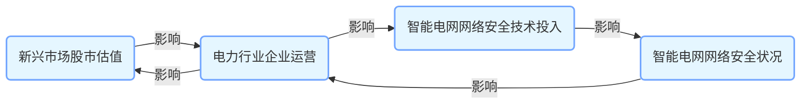

# 新兴市场股市估值与智能电网网络安全技术的互动

> 关键词：新兴市场股市估值、智能电网网络安全技术、互动关系、金融市场、电力行业、风险评估、技术驱动

> 摘要：本文旨在深入探讨新兴市场股市估值与智能电网网络安全技术之间的互动关系。通过对新兴市场股市估值的影响因素、智能电网网络安全技术的重要性及发展现状的分析，阐述两者相互作用的内在机制。利用数学模型和算法原理，结合实际案例，揭示这种互动对金融市场和电力行业的影响。同时，为相关从业者提供实际应用场景、工具资源推荐，以及对未来发展趋势与挑战的展望，帮助读者全面理解新兴市场股市估值与智能电网网络安全技术之间的复杂联系。

## 1. 背景介绍 
### 1.1 目的和范围
本研究的目的在于系统地探究新兴市场股市估值与智能电网网络安全技术之间的互动关系。新兴市场在全球经济中扮演着越来越重要的角色，其股市估值的波动不仅影响着投资者的决策，也反映了该地区经济的发展态势。而智能电网作为现代电力系统的重要发展方向，其网络安全技术的发展对于保障电力供应的稳定性和可靠性至关重要。研究两者之间的互动关系，有助于投资者更好地评估新兴市场的投资风险和机会，也有助于电力行业相关企业和监管机构更好地应对网络安全挑战，推动智能电网的健康发展。

本研究的范围涵盖了新兴市场股市估值的理论和实践、智能电网网络安全技术的原理和应用，以及两者之间相互影响的机制和实证分析。具体包括新兴市场股市估值的影响因素分析、智能电网网络安全技术的发展现状和趋势、两者互动关系的数学模型构建和实证检验，以及相关的政策建议和未来展望。

### 1.2 预期读者
本文的预期读者包括金融市场投资者、电力行业从业者、学术研究人员、政策制定者以及对新兴市场和智能电网网络安全技术感兴趣的人士。对于投资者来说，了解新兴市场股市估值与智能电网网络安全技术之间的互动关系，有助于他们更好地进行投资决策，降低投资风险。对于电力行业从业者来说，本文可以为他们提供有关网络安全技术对股市估值影响的信息，帮助他们更好地管理企业的风险和价值。对于学术研究人员来说，本文可以为他们提供新的研究视角和思路，推动相关领域的学术研究发展。对于政策制定者来说，本文可以为他们制定相关政策提供参考，促进新兴市场和智能电网的健康发展。

### 1.3 文档结构概述
本文共分为十个部分。第一部分为背景介绍，阐述了研究的目的、范围、预期读者和文档结构概述。第二部分介绍了新兴市场股市估值和智能电网网络安全技术的核心概念及其联系，包括相关的原理和架构，并通过文本示意图和 Mermaid 流程图进行展示。第三部分详细讲解了核心算法原理和具体操作步骤，通过 Python 源代码进行详细阐述。第四部分介绍了数学模型和公式，并进行详细讲解和举例说明。第五部分通过项目实战，给出代码实际案例并进行详细解释说明，包括开发环境搭建、源代码详细实现和代码解读。第六部分探讨了实际应用场景。第七部分推荐了相关的工具和资源，包括学习资源、开发工具框架和相关论文著作。第八部分总结了未来发展趋势与挑战。第九部分为附录，解答了常见问题。第十部分提供了扩展阅读和参考资料。

### 1.4 术语表
#### 1.4.1 核心术语定义
- **新兴市场**：指的是发展中国家或地区的金融市场，通常具有较高的经济增长潜力，但也伴随着较高的风险。这些市场在经济结构、金融体系和监管环境等方面与成熟市场存在一定的差异。
- **股市估值**：是指对股票市场中股票价值的评估。常用的估值方法包括市盈率（P/E）、市净率（P/B）、股息率等，通过这些指标可以判断股票价格是否合理，以及市场的整体估值水平。
- **智能电网**：是将现代信息技术、通信技术、控制技术与传统电力系统深度融合的新型电力网络。它具有智能化、自动化、互动化等特点，能够实现电力的高效传输、分配和使用，提高电力系统的可靠性和灵活性。
- **网络安全技术**：是指为保护计算机网络系统中的硬件、软件和数据不受未经授权的访问、破坏、更改或泄露而采用的一系列技术和措施。在智能电网中，网络安全技术对于保障电力系统的安全稳定运行至关重要。

#### 1.4.2 相关概念解释
- **风险溢价**：是指投资者为了承担额外的风险而要求获得的额外回报。在新兴市场中，由于其较高的风险水平，投资者通常会要求更高的风险溢价。
- **信息不对称**：是指在市场交易中，交易双方所掌握的信息存在差异。在新兴市场股市中，信息不对称可能导致投资者做出错误的决策，影响股市估值。
- **网络攻击**：是指对计算机网络系统进行恶意攻击的行为，包括黑客攻击、病毒感染、拒绝服务攻击等。在智能电网中，网络攻击可能导致电力系统故障、数据泄露等严重后果。

#### 1.4.3 缩略词列表
- **P/E**：市盈率（Price-to-Earnings Ratio）
- **P/B**：市净率（Price-to-Book Ratio）
- **IoT**：物联网（Internet of Things）
- **SCADA**：数据采集与监视控制系统（Supervisory Control and Data Acquisition）

## 2. 核心概念与联系 

### 2.1 新兴市场股市估值
新兴市场股市估值是一个复杂的过程，受到多种因素的影响。从宏观经济层面来看，经济增长速度、通货膨胀率、利率水平等因素都会对股市估值产生影响。例如，经济增长速度较快的新兴市场，企业的盈利预期通常较高，股市估值也会相应提高。而通货膨胀率和利率的上升则可能导致企业成本增加，盈利下降，从而压低股市估值。

从行业层面来看，不同行业的发展前景和竞争格局也会影响股市估值。例如，在新兴市场中，科技、金融等行业通常具有较高的增长潜力，其股市估值也相对较高。而传统制造业等行业则可能面临产能过剩、竞争激烈等问题，股市估值相对较低。

从公司层面来看，公司的盈利能力、财务状况、管理水平等因素是影响股市估值的关键。盈利能力强、财务状况稳健、管理水平高的公司，其股票通常会受到投资者的青睐，股市估值也会较高。

### 2.2 智能电网网络安全技术
智能电网网络安全技术是保障智能电网安全稳定运行的重要手段。智能电网涉及大量的信息技术和通信技术，包括物联网（IoT）、数据采集与监视控制系统（SCADA）等，这些技术的应用使得智能电网面临着更多的网络安全风险。

智能电网网络安全技术主要包括网络访问控制、数据加密、入侵检测、安全审计等方面。网络访问控制可以限制未经授权的用户访问智能电网系统，数据加密可以保护数据在传输和存储过程中的安全性，入侵检测可以及时发现并防范网络攻击，安全审计可以对系统的安全事件进行记录和分析。

### 2.3 核心概念联系
新兴市场股市估值与智能电网网络安全技术之间存在着密切的联系。一方面，智能电网网络安全技术的发展状况会影响新兴市场中电力行业相关企业的股市估值。如果智能电网网络安全技术得到有效应用，电力系统的安全性和可靠性得到提高，那么电力行业相关企业的运营风险将降低，盈利预期将提高，从而推动其股市估值上升。反之，如果智能电网网络安全技术存在漏洞，导致网络攻击频繁发生，电力系统出现故障，那么电力行业相关企业的运营将受到严重影响，股市估值也会下降。

另一方面，新兴市场股市估值的变化也会影响智能电网网络安全技术的发展。当新兴市场股市估值较高时，电力行业相关企业的融资能力较强，可以获得更多的资金用于网络安全技术的研发和应用。而当新兴市场股市估值较低时，企业的融资难度增加，可能会减少在网络安全技术方面的投入，从而影响智能电网网络安全技术的发展。

### 2.4 文本示意图
```plaintext
新兴市场股市估值
├── 宏观经济因素
│   ├── 经济增长速度
│   ├── 通货膨胀率
│   ├── 利率水平
├── 行业因素
│   ├── 行业发展前景
│   ├── 行业竞争格局
├── 公司因素
│   ├── 盈利能力
│   ├── 财务状况
│   ├── 管理水平

智能电网网络安全技术
├── 网络访问控制
├── 数据加密
├── 入侵检测
├── 安全审计

两者联系
├── 智能电网网络安全技术影响电力企业股市估值
├── 新兴市场股市估值影响网络安全技术投入
```

### 2.5 Mermaid 流程图


## 3. 核心算法原理 & 具体操作步骤 

### 3.1 新兴市场股市估值算法原理
在新兴市场股市估值中，常用的算法之一是基于市盈率（P/E）的估值方法。市盈率是指股票价格与每股收益的比率，反映了投资者为获得每单位收益所愿意支付的价格。其计算公式为：

$P/E = \frac{股票价格}{每股收益}$

通过对同行业或市场整体的市盈率进行分析，可以判断股票的估值水平。如果某只股票的市盈率高于同行业平均水平，可能意味着该股票被高估；反之，如果市盈率低于同行业平均水平，可能意味着该股票被低估。

### 3.2 智能电网网络安全风险评估算法原理
智能电网网络安全风险评估可以采用层次分析法（AHP）。层次分析法是一种将定性和定量分析相结合的多准则决策方法，通过将复杂问题分解为多个层次，然后对各层次的因素进行比较和判断，最终确定各因素的权重。

在智能电网网络安全风险评估中，首先需要确定评估指标体系，包括网络攻击可能性、攻击后果严重程度等因素。然后，通过专家打分的方式，对各指标之间的相对重要性进行比较，构建判断矩阵。最后，通过计算判断矩阵的特征向量和最大特征值，确定各指标的权重。

### 3.3 两者互动关系的算法原理
为了研究新兴市场股市估值与智能电网网络安全技术之间的互动关系，可以采用向量自回归（VAR）模型。VAR 模型是一种常用的时间序列分析模型，它可以描述多个变量之间的动态关系。

假设我们有两个变量：新兴市场股市估值（$y_1$）和智能电网网络安全风险评估值（$y_2$），则 VAR 模型的一般形式为：

$y_{1t} = c_1 + \sum_{i=1}^{p} \alpha_{1i} y_{1,t - i} + \sum_{i=1}^{p} \beta_{1i} y_{2,t - i} + \epsilon_{1t}$

$y_{2t} = c_2 + \sum_{i=1}^{p} \alpha_{2i} y_{1,t - i} + \sum_{i=1}^{p} \beta_{2i} y_{2,t - i} + \epsilon_{2t}$

其中，$t$ 表示时间，$p$ 表示滞后阶数，$c_1$ 和 $c_2$ 是常数项，$\alpha_{ij}$ 和 $\beta_{ij}$ 是系数，$\epsilon_{1t}$ 和 $\epsilon_{2t}$ 是误差项。

### 3.4 具体操作步骤及 Python 代码实现

#### 3.4.1 数据准备
首先，需要收集新兴市场股市估值数据和智能电网网络安全风险评估数据。可以从金融数据库、电力行业报告等渠道获取相关数据。

```python
import pandas as pd

# 读取新兴市场股市估值数据
stock_valuation_data = pd.read_csv('stock_valuation.csv')

# 读取智能电网网络安全风险评估数据
cybersecurity_risk_data = pd.read_csv('cybersecurity_risk.csv')

# 合并数据
merged_data = pd.merge(stock_valuation_data, cybersecurity_risk_data, on='date')
```

#### 3.4.2 数据预处理
对收集到的数据进行预处理，包括缺失值处理、异常值处理等。

```python
# 处理缺失值
merged_data = merged_data.fillna(method='ffill')

# 处理异常值
def remove_outliers(data, column):
    q1 = data[column].quantile(0.25)
    q3 = data[column].quantile(0.75)
    iqr = q3 - q1
    lower_bound = q1 - 1.5 * iqr
    upper_bound = q3 + 1.5 * iqr
    data = data[(data[column] >= lower_bound) & (data[column] <= upper_bound)]
    return data

merged_data = remove_outliers(merged_data, 'stock_valuation')
merged_data = remove_outliers(merged_data, 'cybersecurity_risk')
```

#### 3.4.3 构建 VAR 模型
使用 Python 的 `statsmodels` 库构建 VAR 模型，并进行参数估计。

```python
from statsmodels.tsa.api import VAR

# 提取需要的变量
variables = merged_data[['stock_valuation', 'cybersecurity_risk']]

# 构建 VAR 模型
model = VAR(variables)

# 选择最优滞后阶数
lag_order = model.select_order(maxlags=10)
print('最优滞后阶数:', lag_order.selected_orders['aic'])

# 拟合模型
results = model.fit(lag_order.selected_orders['aic'])
```

#### 3.4.4 模型检验和预测
对构建的 VAR 模型进行检验，包括平稳性检验、残差检验等。然后，使用模型进行预测。

```python
# 平稳性检验
from statsmodels.tsa.stattools import adfuller

def adf_test(series):
    result = adfuller(series)
    print('ADF Statistic: {}'.format(result[0]))
    print('p-value: {}'.format(result[1]))
    print('Critical Values:')
    for key, value in result[4].items():
        print('\t{}: {}'.format(key, value))
    if result[1] <= 0.05:
        print("序列是平稳的")
    else:
        print("序列是非平稳的")

adf_test(variables['stock_valuation'])
adf_test(variables['cybersecurity_risk'])

# 残差检验
from statsmodels.stats.diagnostic import acorr_ljungbox

residuals = results.resid
lb_test = acorr_ljungbox(residuals, lags=[10], return_df=True)
print('残差自相关检验结果:', lb_test)

# 预测
forecast_steps = 10
forecast = results.forecast(variables.values, steps=forecast_steps)
print('未来 10 期的预测结果:', forecast)
```

## 4. 数学模型和公式 & 详细讲解 & 举例说明 

### 4.1 新兴市场股市估值模型
#### 4.1.1 股息贴现模型（DDM）
股息贴现模型是一种基于股票未来股息现金流的估值模型。其基本思想是，股票的价值等于其未来所有股息的现值之和。

假设股票的股息增长率为 $g$，投资者要求的必要收益率为 $r$，当前股息为 $D_0$，则股票的价值 $V$ 可以表示为：

$$V = \frac{D_0(1 + g)}{r - g}$$

其中，$r > g$。

例如，某新兴市场股票当前股息为 $2$ 元，股息增长率为 $5\%$，投资者要求的必要收益率为 $10\%$，则该股票的价值为：

$$V = \frac{2\times(1 + 0.05)}{0.1 - 0.05} = \frac{2.1}{0.05} = 42$$（元）

#### 4.1.2 自由现金流贴现模型（FCFF）
自由现金流贴现模型是一种基于企业自由现金流的估值模型。企业自由现金流是指企业在满足了所有运营成本和资本支出后剩余的现金流。

假设企业的自由现金流增长率为 $g$，加权平均资本成本为 $WACC$，当前自由现金流为 $FCFF_0$，则企业的价值 $V$ 可以表示为：

$$V = \frac{FCFF_0(1 + g)}{WACC - g}$$

其中，$WACC > g$。

例如，某新兴市场企业当前自由现金流为 $100$ 万元，自由现金流增长率为 $3\%$，加权平均资本成本为 $8\%$，则该企业的价值为：

$$V = \frac{100\times(1 + 0.03)}{0.08 - 0.03} = \frac{103}{0.05} = 2060$$（万元）

### 4.2 智能电网网络安全风险评估模型
#### 4.2.1 层次分析法（AHP）
层次分析法的基本步骤如下：

1. **构建层次结构模型**：将智能电网网络安全风险评估问题分解为目标层、准则层和方案层。目标层为智能电网网络安全风险评估，准则层包括网络攻击可能性、攻击后果严重程度等因素，方案层为不同的网络安全措施。

2. **构造判断矩阵**：通过专家打分的方式，对准则层中各因素之间的相对重要性进行比较，构建判断矩阵。判断矩阵 $A$ 的元素 $a_{ij}$ 表示因素 $i$ 相对于因素 $j$ 的重要性程度，通常采用 1 - 9 标度法。

3. **计算权重向量**：计算判断矩阵 $A$ 的最大特征值 $\lambda_{max}$ 及其对应的特征向量 $W$，对特征向量进行归一化处理，得到各因素的权重向量。

4. **一致性检验**：计算判断矩阵的一致性指标 $CI$ 和随机一致性指标 $RI$，并计算一致性比率 $CR$。当 $CR < 0.1$ 时，认为判断矩阵具有满意的一致性。

$CI = \frac{\lambda_{max} - n}{n - 1}$

其中，$n$ 为判断矩阵的阶数。

$CR = \frac{CI}{RI}$

例如，假设有一个判断矩阵 $A$：

$$A = \begin{bmatrix}
1 & 3 & 5 \\
\frac{1}{3} & 1 & 3 \\
\frac{1}{5} & \frac{1}{3} & 1
\end{bmatrix}$$

计算其最大特征值 $\lambda_{max} \approx 3.0385$，一致性指标 $CI = \frac{3.0385 - 3}{3 - 1} = 0.01925$，随机一致性指标 $RI$ （当 $n = 3$ 时）为 $0.58$，则一致性比率 $CR = \frac{0.01925}{0.58} \approx 0.0332 < 0.1$，判断矩阵具有满意的一致性。

### 4.3 两者互动关系模型
#### 4.3.1 向量自回归（VAR）模型
向量自回归（VAR）模型的一般形式为：

$Y_t = C + \sum_{i=1}^{p} A_i Y_{t - i} + \epsilon_t$

其中，$Y_t$ 是 $k$ 维向量，$C$ 是 $k$ 维常数向量，$A_i$ 是 $k \times k$ 维系数矩阵，$\epsilon_t$ 是 $k$ 维误差向量。

在研究新兴市场股市估值与智能电网网络安全技术之间的互动关系时，$Y_t = \begin{bmatrix} y_{1t} \\ y_{2t} \end{bmatrix}$，其中 $y_{1t}$ 表示新兴市场股市估值，$y_{2t}$ 表示智能电网网络安全风险评估值。

例如，假设一个简单的 VAR(1) 模型：

$\begin{bmatrix} y_{1t} \\ y_{2t} \end{bmatrix} = \begin{bmatrix} c_1 \\ c_2 \end{bmatrix} + \begin{bmatrix} \alpha_{11} & \alpha_{12} \\ \alpha_{21} & \alpha_{22} \end{bmatrix} \begin{bmatrix} y_{1,t - 1} \\ y_{2,t - 1} \end{bmatrix} + \begin{bmatrix} \epsilon_{1t} \\ \epsilon_{2t} \end{bmatrix}$

其中，$\alpha_{12}$ 表示智能电网网络安全风险评估值的滞后一期对新兴市场股市估值的影响系数，$\alpha_{21}$ 表示新兴市场股市估值的滞后一期对智能电网网络安全风险评估值的影响系数。

## 5. 项目实战：代码实际案例和详细解释说明 

### 5.1  开发环境搭建
#### 5.1.1 操作系统
本项目可以在 Windows、Linux 或 macOS 操作系统上进行开发。建议使用 Linux 或 macOS 系统，因为它们在数据处理和科学计算方面具有更好的性能和稳定性。

#### 5.1.2 Python 环境
本项目使用 Python 3.7 及以上版本。可以使用 Anaconda 或 Miniconda 来管理 Python 环境。以下是安装 Anaconda 的步骤：

1. 访问 Anaconda 官方网站（https://www.anaconda.com/products/individual），下载适合自己操作系统的 Anaconda 安装包。
2. 运行安装包，按照安装向导的提示进行安装。
3. 安装完成后，打开终端或命令提示符，输入以下命令创建一个新的 Python 环境：

```bash
conda create -n emerging_market_project python=3.8
```

4. 激活新创建的环境：

```bash
conda activate emerging_market_project
```

#### 5.1.3 安装依赖库
在激活的环境中，安装项目所需的依赖库，包括 `pandas`、`statsmodels`、`numpy` 等。可以使用以下命令进行安装：

```bash
conda install pandas statsmodels numpy
```

### 5.2  源代码详细实现和代码解读

#### 5.2.1 数据读取和预处理
```python
import pandas as pd
import numpy as np

# 读取新兴市场股市估值数据
stock_valuation_data = pd.read_csv('stock_valuation.csv')

# 读取智能电网网络安全风险评估数据
cybersecurity_risk_data = pd.read_csv('cybersecurity_risk.csv')

# 合并数据
merged_data = pd.merge(stock_valuation_data, cybersecurity_risk_data, on='date')

# 处理缺失值
merged_data = merged_data.fillna(method='ffill')

# 处理异常值
def remove_outliers(data, column):
    q1 = data[column].quantile(0.25)
    q3 = data[column].quantile(0.75)
    iqr = q3 - q1
    lower_bound = q1 - 1.5 * iqr
    upper_bound = q3 + 1.5 * iqr
    data = data[(data[column] >= lower_bound) & (data[column] <= upper_bound)]
    return data

merged_data = remove_outliers(merged_data, 'stock_valuation')
merged_data = remove_outliers(merged_data, 'cybersecurity_risk')
```

**代码解读**：
- 首先，使用 `pandas` 库的 `read_csv` 函数读取新兴市场股市估值数据和智能电网网络安全风险评估数据。
- 然后，使用 `merge` 函数将两个数据集按照日期列进行合并。
- 接着，使用 `fillna` 函数处理缺失值，采用前向填充的方法。
- 最后，定义 `remove_outliers` 函数处理异常值，使用四分位距（IQR）方法确定异常值的范围，并将异常值去除。

#### 5.2.2 构建 VAR 模型
```python
from statsmodels.tsa.api import VAR

# 提取需要的变量
variables = merged_data[['stock_valuation', 'cybersecurity_risk']]

# 构建 VAR 模型
model = VAR(variables)

# 选择最优滞后阶数
lag_order = model.select_order(maxlags=10)
print('最优滞后阶数:', lag_order.selected_orders['aic'])

# 拟合模型
results = model.fit(lag_order.selected_orders['aic'])
```

**代码解读**：
- 首先，从合并的数据集中提取新兴市场股市估值和智能电网网络安全风险评估两个变量。
- 然后，使用 `statsmodels` 库的 `VAR` 类构建 VAR 模型。
- 接着，使用 `select_order` 方法选择最优滞后阶数，这里使用 AIC 准则。
- 最后，使用 `fit` 方法拟合模型，传入最优滞后阶数。

#### 5.2.3 模型检验和预测
```python
# 平稳性检验
from statsmodels.tsa.stattools import adfuller

def adf_test(series):
    result = adfuller(series)
    print('ADF Statistic: {}'.format(result[0]))
    print('p-value: {}'.format(result[1]))
    print('Critical Values:')
    for key, value in result[4].items():
        print('\t{}: {}'.format(key, value))
    if result[1] <= 0.05:
        print("序列是平稳的")
    else:
        print("序列是非平稳的")

adf_test(variables['stock_valuation'])
adf_test(variables['cybersecurity_risk'])

# 残差检验
from statsmodels.stats.diagnostic import acorr_ljungbox

residuals = results.resid
lb_test = acorr_ljungbox(residuals, lags=[10], return_df=True)
print('残差自相关检验结果:', lb_test)

# 预测
forecast_steps = 10
forecast = results.forecast(variables.values, steps=forecast_steps)
print('未来 10 期的预测结果:', forecast)
```

**代码解读**：
- 首先，定义 `adf_test` 函数进行平稳性检验，使用 `adfuller` 函数进行 ADF 检验。
- 然后，对新兴市场股市估值和智能电网网络安全风险评估两个序列进行平稳性检验。
- 接着，使用 `acorr_ljungbox` 函数进行残差自相关检验，检验模型的残差是否存在自相关。
- 最后，使用 `forecast` 方法进行预测，预测未来 10 期的新兴市场股市估值和智能电网网络安全风险评估值。

### 5.3  代码解读与分析
#### 5.3.1 数据预处理的重要性
数据预处理是数据分析和建模的重要步骤。在本项目中，处理缺失值和异常值可以提高数据的质量，减少噪声对模型的影响。例如，如果数据中存在缺失值，可能会导致模型无法正常训练或产生偏差的结果。而异常值可能会对模型的参数估计产生较大的影响，使模型的预测效果变差。

#### 5.3.2 VAR 模型的选择和应用
VAR 模型是一种适用于分析多个时间序列变量之间动态关系的模型。在本项目中，选择 VAR 模型可以研究新兴市场股市估值和智能电网网络安全风险评估值之间的相互影响关系。通过选择最优滞后阶数，可以提高模型的拟合效果和预测精度。

#### 5.3.3 模型检验的意义
模型检验是确保模型有效性和可靠性的重要步骤。平稳性检验可以确保时间序列数据满足 VAR 模型的基本假设，避免出现伪回归问题。残差自相关检验可以检验模型的残差是否存在自相关，如果存在自相关，说明模型可能存在遗漏变量或其他问题，需要对模型进行改进。

## 6. 实际应用场景 

### 6.1 金融投资领域
在金融投资领域，了解新兴市场股市估值与智能电网网络安全技术之间的互动关系可以帮助投资者更好地进行投资决策。例如，当智能电网网络安全技术得到有效应用，电力行业相关企业的运营风险降低，其股市估值可能会上升。投资者可以根据这一趋势，选择投资相关的电力企业股票，获取投资收益。

此外，投资者还可以通过分析智能电网网络安全风险评估数据，预测新兴市场股市估值的变化趋势，提前调整投资组合，降低投资风险。

### 6.2 电力行业企业管理
对于电力行业企业来说，了解新兴市场股市估值与智能电网网络安全技术之间的互动关系可以帮助企业更好地管理自身的风险和价值。例如，企业可以加大在网络安全技术方面的投入，提高智能电网的安全性和可靠性，从而提升企业的市场形象和股市估值。

同时，企业还可以根据新兴市场股市估值的变化，合理安排融资计划。当股市估值较高时，企业可以通过发行股票等方式获得更多的资金，用于网络安全技术的研发和应用。

### 6.3 政策制定
政策制定者可以根据新兴市场股市估值与智能电网网络安全技术之间的互动关系，制定相关的政策，促进新兴市场和智能电网的健康发展。例如，政府可以出台鼓励政策，支持电力行业企业加大在网络安全技术方面的投入，提高智能电网的安全性。

此外，政策制定者还可以加强对新兴市场股市的监管，规范市场秩序，提高市场的透明度和公正性，保护投资者的利益。

### 6.4 学术研究
学术研究人员可以通过研究新兴市场股市估值与智能电网网络安全技术之间的互动关系，深入了解金融市场和电力行业之间的内在联系，为相关领域的学术研究提供新的视角和思路。例如，研究人员可以进一步探讨两者之间的因果关系、影响机制等问题，推动相关理论的发展。

## 7. 工具和资源推荐
### 7.1 学习资源推荐
#### 7.1.1 书籍推荐
- 《金融市场学》：全面介绍了金融市场的基本概念、理论和实践，对于理解新兴市场股市估值具有重要的参考价值。
- 《智能电网技术》：详细介绍了智能电网的技术原理、发展现状和应用前景，有助于深入了解智能电网网络安全技术。
- 《时间序列分析：预测与控制》：系统介绍了时间序列分析的理论和方法，对于学习 VAR 模型等时间序列分析模型具有重要的指导作用。

#### 7.1.2 在线课程
- Coursera 平台上的“Financial Markets”课程：由知名教授授课，全面讲解金融市场的相关知识。
- edX 平台上的“Smart Grid Technology and Applications”课程：介绍智能电网的技术和应用，包括网络安全技术。
- Udemy 平台上的“Time Series Analysis with Python”课程：通过实际案例，讲解时间序列分析的 Python 实现。

#### 7.1.3 技术博客和网站
- 金融界（https://www.jrj.com.cn/）：提供丰富的金融市场资讯和分析，有助于了解新兴市场股市的动态。
- 国家电网官网（https://www.stategrid.com.cn/）：发布智能电网的最新技术和发展动态，是了解智能电网网络安全技术的重要渠道。
- Towards Data Science（https://towardsdatascience.com/）：分享数据科学和机器学习的技术文章，包括时间序列分析等相关内容。

### 7.2 开发工具框架推荐
#### 7.2.1 IDE和编辑器
- PyCharm：一款功能强大的 Python 集成开发环境，提供代码编辑、调试、版本控制等功能，适合开发复杂的 Python 项目。
- Jupyter Notebook：一种交互式的开发环境，支持代码、文本、图表等多种形式的展示，适合数据探索和分析。

#### 7.2.2 调试和性能分析工具
- PDB：Python 内置的调试工具，可以帮助开发者逐步调试代码，查找问题。
- cProfile：Python 内置的性能分析工具，可以分析代码的运行时间和函数调用情况，帮助优化代码性能。

#### 7.2.3 相关框架和库
- Pandas：用于数据处理和分析的 Python 库，提供了丰富的数据结构和数据操作方法。
- Statsmodels：用于统计建模和计量经济学分析的 Python 库，支持 VAR 模型等多种时间序列分析模型。
- Numpy：用于科学计算的 Python 库，提供了高效的数组操作和数学函数。

### 7.3 相关论文著作推荐
#### 7.3.1 经典论文
- Fama, E. F., & French, K. R. (1992). The cross-section of expected stock returns. The Journal of Finance, 47(2), 427-465. 该论文提出了著名的 Fama - French 三因子模型，对于理解股票市场的定价机制具有重要的意义。
- Lasseter, R. H., & Piagi, P. (2004). Smart distribution: Coupling distribution automation and distributed generation. IEEE Power & Energy Magazine, 2(3), 16-24. 该论文探讨了智能电网中分布式发电和配电自动化的结合，是智能电网领域的经典文献。

#### 7.3.2 最新研究成果
- 关注顶级学术期刊，如《Journal of Financial Economics》《IEEE Transactions on Smart Grid》等，这些期刊会发表新兴市场股市估值和智能电网网络安全技术领域的最新研究成果。

#### 7.3.3 应用案例分析
- 可以参考相关企业的年度报告和研究机构的调研报告，了解新兴市场股市估值与智能电网网络安全技术在实际应用中的案例和经验。例如，国家电网公司的年度社会责任报告中会介绍其在智能电网网络安全方面的工作和成果。

## 8. 总结：未来发展趋势与挑战

### 8.1 未来发展趋势
#### 8.1.1 智能电网网络安全技术的不断创新
随着信息技术的不断发展，智能电网网络安全技术也将不断创新。例如，人工智能、区块链等技术将被应用于智能电网网络安全领域，提高网络安全防护的能力和效率。

#### 8.1.2 新兴市场股市的国际化程度不断提高
随着全球经济一体化的发展，新兴市场股市的国际化程度将不断提高。国际投资者将更加关注新兴市场的投资机会，新兴市场股市与全球金融市场的联系也将更加紧密。

#### 8.1.3 两者互动关系的进一步加强
随着智能电网在新兴市场的不断推广和应用，新兴市场股市估值与智能电网网络安全技术之间的互动关系将进一步加强。智能电网网络安全技术的发展将对新兴市场电力行业相关企业的股市估值产生更大的影响，而新兴市场股市估值的变化也将为智能电网网络安全技术的发展提供更多的资金支持。

### 8.2 挑战
#### 8.2.1 网络安全威胁的不断增加
随着智能电网的发展，其面临的网络安全威胁也将不断增加。黑客攻击、病毒感染等网络安全事件可能会导致电力系统故障、数据泄露等严重后果，影响新兴市场股市估值和电力行业的稳定发展。

#### 8.2.2 数据质量和可用性问题
在研究新兴市场股市估值与智能电网网络安全技术之间的互动关系时，数据质量和可用性是一个重要的问题。由于新兴市场的数据收集和管理相对不完善，可能会存在数据缺失、错误等问题，影响研究的准确性和可靠性。

#### 8.2.3 政策和监管的挑战
新兴市场的政策和监管环境相对不稳定，可能会对新兴市场股市估值和智能电网网络安全技术的发展产生不利影响。例如，政策的变化可能会导致企业的经营环境发生变化，影响企业的股市估值。而监管的不完善可能会导致网络安全问题得不到有效的解决，威胁智能电网的安全运行。

## 9. 附录：常见问题与解答

### 9.1 如何选择合适的新兴市场股市估值方法？
选择合适的新兴市场股市估值方法需要考虑多种因素，如公司的特点、行业的发展阶段、市场环境等。对于盈利稳定的公司，可以采用股息贴现模型或市盈率估值方法；对于成长型公司，可以采用自由现金流贴现模型或市销率估值方法。同时，还可以结合多种估值方法进行综合评估，以提高估值的准确性。

### 9.2 智能电网网络安全技术的主要措施有哪些？
智能电网网络安全技术的主要措施包括网络访问控制、数据加密、入侵检测、安全审计等。网络访问控制可以限制未经授权的用户访问智能电网系统，数据加密可以保护数据在传输和存储过程中的安全性，入侵检测可以及时发现并防范网络攻击，安全审计可以对系统的安全事件进行记录和分析。

### 9.3 VAR 模型的滞后阶数如何选择？
VAR 模型的滞后阶数可以通过信息准则来选择，常用的信息准则包括 AIC（赤池信息准则）、BIC（贝叶斯信息准则）等。一般来说，可以使用 `statsmodels` 库中的 `select_order` 方法，指定最大滞后阶数，然后根据信息准则选择最优滞后阶数。

### 9.4 如何提高智能电网网络安全技术的应用效果？
提高智能电网网络安全技术的应用效果需要从多个方面入手。首先，要加强网络安全技术的研发和创新，不断提高网络安全防护的能力。其次，要加强人员培训，提高员工的网络安全意识和技能。此外，还需要建立健全的网络安全管理制度和应急响应机制，及时应对网络安全事件。

## 10. 扩展阅读 & 参考资料

### 10.1 扩展阅读
- 《新兴市场金融发展与风险防范》：深入探讨了新兴市场金融发展的规律和风险防范的措施，对于理解新兴市场股市估值具有重要的参考价值。
- 《智能电网网络安全前沿技术》：介绍了智能电网网络安全领域的最新技术和研究成果，有助于深入了解智能电网网络安全技术的发展趋势。

### 10.2 参考资料
- 金融数据来源：Wind 资讯、Bloomberg 等金融数据库。
- 智能电网技术报告：国家电网公司、南方电网公司等发布的技术报告。
- 学术论文数据库：IEEE Xplore、ACM Digital Library、ScienceDirect 等。