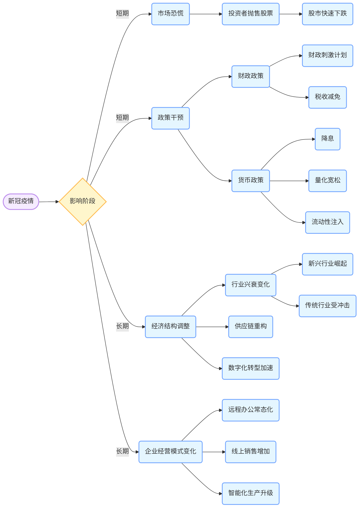

# 新冠疫情对全球股市估值的短期和长期影响

> 关键词：新冠疫情、全球股市估值、短期影响、长期影响、金融市场、经济复苏、风险因素

> 摘要：本文旨在深入探讨新冠疫情对全球股市估值的短期和长期影响。通过对疫情期间全球股市表现的背景分析，阐述核心概念及联系，详细剖析相关算法原理、数学模型，结合项目实战案例进行解读，分析实际应用场景，推荐相关工具和资源，最后总结未来发展趋势与挑战并解答常见问题。新冠疫情作为全球性的重大公共卫生事件，给全球经济和金融市场带来了巨大冲击，股市估值的变化不仅反映了短期的市场恐慌和波动，也对长期的经济结构和企业发展产生了深远影响，理解这些影响对于投资者、政策制定者和金融从业者具有重要意义。

## 1. 背景介绍 
### 1.1 目的和范围
本研究的主要目的是全面且深入地探究新冠疫情对全球股市估值在短期和长期两个维度上的影响。范围覆盖全球主要股票市场，包括但不限于美国的纳斯达克、纽约证券交易所，欧洲的伦敦证券交易所、法兰克福证券交易所，亚洲的东京证券交易所、香港证券交易所等。通过对这些市场的综合分析，揭示疫情背景下股市估值变化的规律和特点，为投资者提供决策参考，为政策制定者提供经济调控依据。

### 1.2 预期读者
本文的预期读者包括金融市场投资者，如个人投资者、机构投资者等，他们可以通过了解疫情对股市估值的影响，优化投资策略，降低投资风险；金融从业者，如股票分析师、基金经理等，有助于他们深入分析市场动态，提高专业服务水平；政策制定者，如各国政府的经济决策部门、中央银行等，可根据研究结果制定合理的经济政策和金融监管措施；以及对金融市场和宏观经济感兴趣的学者和研究人员，为他们的学术研究提供有价值的参考资料。

### 1.3 文档结构概述
本文首先对新冠疫情对全球股市估值影响的研究背景进行介绍，包括目的、预期读者和文档结构概述等内容。接着阐述核心概念与联系，明确相关术语和概念，并用示意图和流程图展示其内在逻辑。然后深入讲解核心算法原理和具体操作步骤，结合Python代码进行详细说明。之后介绍数学模型和公式，并通过举例进行详细讲解。再通过项目实战，展示代码实际案例并进行详细解释说明。随后分析实际应用场景，为读者提供实际参考。接着推荐相关的工具和资源，包括学习资源、开发工具框架和相关论文著作等。最后总结未来发展趋势与挑战，解答常见问题，并提供扩展阅读和参考资料。

### 1.4 术语表
#### 1.4.1 核心术语定义
- **新冠疫情**：指2019年底开始爆发的由新型冠状病毒（SARS - CoV - 2）引起的全球性传染病疫情，给全球公共卫生、经济、社会等各个领域带来了重大影响。
- **股市估值**：是对股票市场中股票价值的评估，通常通过各种估值方法，如市盈率（P/E）、市净率（P/B）、现金流折现模型（DCF）等，来判断股票价格是否合理，反映股票市场的整体价值水平。
- **短期影响**：一般指在新冠疫情爆发后的几个月内，股市因疫情引发的短期市场恐慌、政策调整等因素而产生的快速、剧烈的波动和变化。
- **长期影响**：指在疫情持续较长时间（通常为一年以上）后，对全球经济结构、企业经营模式、行业发展趋势等产生的深层次影响，进而反映在股市估值的长期变化上。

#### 1.4.2 相关概念解释
- **市盈率（P/E）**：是指股票价格除以每股收益（EPS）的比率，反映了投资者为获取公司每一元盈利所愿意支付的价格，是衡量股票估值的常用指标之一。较高的市盈率可能表示市场对该股票的未来盈利增长预期较高，也可能意味着股票被高估；较低的市盈率则可能表示股票被低估或市场对其未来盈利前景不乐观。
- **市净率（P/B）**：是股票价格与每股净资产的比率，反映了市场对公司净资产的估值水平。市净率小于1时，通常表示股票价格低于公司的净资产价值，可能存在投资机会；市净率大于1时，说明市场对公司的预期较高，但也可能存在估值泡沫。
- **现金流折现模型（DCF）**：是一种基于企业未来现金流量和折现率来估算企业内在价值的估值方法。该模型认为，企业的价值等于其未来各期现金流量按照一定的折现率折现到当前的现值之和。通过预测企业未来的现金流量，并选择合适的折现率，可以计算出企业的内在价值，从而判断股票的估值是否合理。

#### 1.4.3 缩略词列表
- **P/E**：Price - Earnings Ratio，市盈率
- **P/B**：Price - to - Book Ratio，市净率
- **DCF**：Discounted Cash Flow，现金流折现模型

## 2. 核心概念与联系 
### 核心概念原理
新冠疫情对全球股市估值的影响是一个复杂的过程，涉及多个因素的相互作用。从短期来看，疫情的爆发引发了市场的恐慌情绪，投资者对未来经济增长的预期变得悲观，纷纷抛售股票，导致股市迅速下跌。同时，各国政府为了应对疫情对经济的冲击，出台了一系列财政和货币政策，如降息、量化宽松、财政刺激计划等，这些政策会对股市产生直接或间接的影响。直接影响表现为资金流入股市，推动股价上涨；间接影响则通过改善宏观经济环境，提高企业的盈利预期，从而提升股市估值。

从长期来看，疫情改变了全球经济的结构和企业的经营模式。一些行业，如线上办公、电子商务、医疗保健等，因疫情得到了快速发展，其业绩和估值也相应提升；而另一些行业，如航空、旅游、餐饮等，受到疫情的严重冲击，业绩下滑，估值下降。此外，疫情还加速了一些趋势的发展，如数字化转型、供应链重构等，这些变化会对企业的长期盈利能力和市场竞争力产生影响，进而影响股市估值。

### 架构的文本示意图
```plaintext
新冠疫情
|
|-- 短期影响
|   |-- 市场恐慌
|   |   |-- 投资者抛售股票
|   |   |-- 股市快速下跌
|   |-- 政策干预
|   |   |-- 财政政策
|   |   |   |-- 财政刺激计划
|   |   |   |-- 税收减免
|   |   |-- 货币政策
|   |       |-- 降息
|   |       |-- 量化宽松
|   |       |-- 流动性注入
|
|-- 长期影响
|   |-- 经济结构调整
|   |   |-- 行业兴衰变化
|   |   |   |-- 新兴行业崛起（线上办公、电子商务、医疗保健等）
|   |   |   |-- 传统行业受冲击（航空、旅游、餐饮等）
|   |   |-- 供应链重构
|   |   |-- 数字化转型加速
|   |-- 企业经营模式变化
|   |   |-- 远程办公常态化
|   |   |-- 线上销售增加
|   |   |-- 智能化生产升级
```

### Mermaid 流程图


## 3. 核心算法原理 & 具体操作步骤 
### 算法原理
为了分析新冠疫情对全球股市估值的影响，我们可以采用时间序列分析方法，通过建立自回归积分滑动平均模型（ARIMA）来预测股市指数的走势，并对比疫情前后的预测结果，以评估疫情对股市估值的影响。

ARIMA模型是一种广泛应用于时间序列预测的统计模型，它结合了自回归（AR）、差分（I）和滑动平均（MA）三个部分。其基本形式可以表示为：

$$ARIMA(p, d, q)$$

其中，$p$ 表示自回归阶数，$d$ 表示差分阶数，$q$ 表示滑动平均阶数。

自回归部分（AR）表示当前时刻的时间序列值与过去若干时刻的值之间的线性关系，其数学表达式为：

$$y_t = c + \sum_{i = 1}^{p} \phi_i y_{t - i}+\epsilon_t$$

其中，$y_t$ 表示当前时刻的时间序列值，$c$ 是常数项，$\phi_i$ 是自回归系数，$y_{t - i}$ 是过去 $i$ 时刻的时间序列值，$\epsilon_t$ 是误差项。

差分部分（I）用于处理非平稳时间序列，通过对时间序列进行差分操作，使其变为平稳序列。差分阶数 $d$ 表示进行差分的次数。

滑动平均部分（MA）表示当前时刻的时间序列值与过去若干时刻的误差项之间的线性关系，其数学表达式为：

$$y_t = c+\epsilon_t+\sum_{i = 1}^{q} \theta_i \epsilon_{t - i}$$

其中，$\theta_i$ 是滑动平均系数。

### 具体操作步骤
1. **数据收集**：收集全球主要股票市场的指数数据，如美国的标普500指数、欧洲的斯托克50指数、亚洲的日经225指数等，以及新冠疫情相关数据，如每日新增确诊病例数、死亡病例数等。数据的时间范围应覆盖疫情爆发前后的一段时间，以确保能够全面分析疫情对股市的影响。
2. **数据预处理**：对收集到的数据进行清洗和整理，处理缺失值和异常值。将股票指数数据转换为对数收益率序列，以消除数据的异方差性。同时，对疫情数据进行标准化处理，使其具有可比性。
3. **模型选择**：使用自相关函数（ACF）和偏自相关函数（PACF）来确定ARIMA模型的阶数 $p$、$d$ 和 $q$。一般来说，可以通过观察ACF和PACF图的截尾和拖尾情况来初步确定阶数，然后使用信息准则（如AIC、BIC）来选择最优的模型参数。
4. **模型训练**：根据选择的模型参数，使用疫情爆发前的数据对ARIMA模型进行训练，得到模型的参数估计值。
5. **模型预测**：使用训练好的模型对疫情期间的股市指数进行预测，并将预测结果与实际值进行对比。通过计算预测误差（如均方误差、平均绝对误差等）来评估模型的预测性能。
6. **影响分析**：对比疫情前后的预测结果，分析疫情对股市指数走势的影响。可以通过计算预测误差的变化、股市指数的波动率变化等指标来量化疫情对股市估值的影响。

### Python源代码实现
```python
import pandas as pd
import numpy as np
from statsmodels.tsa.arima.model import ARIMA
from statsmodels.graphics.tsaplots import plot_acf, plot_pacf
import matplotlib.pyplot as plt

# 1. 数据收集（假设数据已经保存为CSV文件）
stock_data = pd.read_csv('stock_index.csv', index_col='Date', parse_dates=True)
pandemic_data = pd.read_csv('pandemic_data.csv', index_col='Date', parse_dates=True)

# 2. 数据预处理
# 计算股票指数的对数收益率
stock_returns = np.log(stock_data / stock_data.shift(1)).dropna()

# 标准化疫情数据
pandemic_data_scaled = (pandemic_data - pandemic_data.mean()) / pandemic_data.std()

# 3. 模型选择
# 绘制自相关函数和偏自相关函数图
fig, axes = plt.subplots(2, 1, figsize=(10, 8))
plot_acf(stock_returns, lags=20, ax=axes[0])
axes[0].set_title('Autocorrelation Function')
plot_pacf(stock_returns, lags=20, ax=axes[1])
axes[1].set_title('Partial Autocorrelation Function')
plt.show()

# 根据ACF和PACF图选择合适的p、d、q值
p = 1
d = 0
q = 1

# 4. 模型训练
# 划分训练集和测试集（以疫情爆发时间为分割点）
pandemic_start_date = '2020-01-01'
train_data = stock_returns[stock_returns.index < pandemic_start_date]
test_data = stock_returns[stock_returns.index >= pandemic_start_date]

# 训练ARIMA模型
model = ARIMA(train_data, order=(p, d, q))
model_fit = model.fit()

# 5. 模型预测
predictions = model_fit.get_forecast(steps=len(test_data))
predicted_mean = predictions.predicted_mean

# 6. 影响分析
# 计算预测误差
mse = ((test_data.values - predicted_mean.values) ** 2).mean()
mae = np.abs(test_data.values - predicted_mean.values).mean()

print(f'Mean Squared Error: {mse}')
print(f'Mean Absolute Error: {mae}')

# 绘制实际值和预测值的对比图
plt.figure(figsize=(12, 6))
plt.plot(train_data, label='Training Data')
plt.plot(test_data, label='Actual Data')
plt.plot(test_data.index, predicted_mean, label='Predicted Data', color='r')
plt.title('Stock Index Forecast')
plt.xlabel('Date')
plt.ylabel('Log Returns')
plt.legend()
plt.show()
```

## 4. 数学模型和公式 & 详细讲解 & 举例说明 
### 数学模型和公式
#### 1. 对数收益率公式
在金融时间序列分析中，通常使用对数收益率来衡量股票价格的变化。对数收益率的计算公式为：

$$r_t=\ln\left(\frac{P_t}{P_{t - 1}}\right)$$

其中，$r_t$ 表示 $t$ 时刻的对数收益率，$P_t$ 表示 $t$ 时刻的股票价格，$P_{t - 1}$ 表示 $t - 1$ 时刻的股票价格。

对数收益率具有以下优点：
- 可以将乘法运算转换为加法运算，便于进行数学处理。
- 对数收益率是连续复利收益率，更符合金融市场的实际情况。
- 对数收益率序列通常具有更稳定的统计性质，有助于提高模型的预测性能。

#### 2. ARIMA模型公式
如前文所述，ARIMA模型的基本形式为 $ARIMA(p, d, q)$，其数学表达式为：

$$(1 - \sum_{i = 1}^{p} \phi_i L^i)(1 - L)^d y_t = c+(1+\sum_{i = 1}^{q} \theta_i L^i) \epsilon_t$$

其中，$L$ 是滞后算子，$(1 - L)^d$ 表示对时间序列进行 $d$ 阶差分操作，$\phi_i$ 是自回归系数，$\theta_i$ 是滑动平均系数，$\epsilon_t$ 是误差项。

#### 3. 信息准则公式
在选择ARIMA模型的参数 $p$、$d$ 和 $q$ 时，常用的信息准则有赤池信息准则（AIC）和贝叶斯信息准则（BIC）。

AIC的计算公式为：

$$AIC = - 2\ln(L)+2k$$

其中，$L$ 是模型的似然函数值，$k$ 是模型的参数个数。

BIC的计算公式为：

$$BIC = - 2\ln(L)+k\ln(n)$$

其中，$n$ 是样本数量。

在选择模型时，通常选择AIC或BIC值最小的模型作为最优模型。

### 详细讲解
#### 对数收益率的计算
对数收益率的计算非常简单，只需要将当前时刻的股票价格除以过去时刻的股票价格，然后取自然对数即可。例如，假设某股票在 $t - 1$ 时刻的价格为 $P_{t - 1}=100$ 元，在 $t$ 时刻的价格为 $P_t = 105$ 元，则 $t$ 时刻的对数收益率为：

$$r_t=\ln\left(\frac{105}{100}\right)\approx 0.0488$$

#### ARIMA模型的参数估计
ARIMA模型的参数估计通常使用最大似然估计方法。最大似然估计的基本思想是找到一组参数值，使得样本数据出现的概率最大。在Python中，可以使用 `statsmodels` 库中的 `ARIMA` 类来估计模型的参数。

#### 信息准则的应用
信息准则的作用是在多个候选模型中选择最优模型。AIC和BIC都考虑了模型的拟合优度和复杂度，通过在似然函数值的基础上加上一个惩罚项来避免过拟合。例如，假设有两个ARIMA模型，模型1的AIC值为 - 100，模型2的AIC值为 - 110，则模型2的AIC值更小，说明模型2在拟合优度和复杂度之间取得了更好的平衡，因此选择模型2作为最优模型。

### 举例说明
假设我们有一个时间序列数据 $y = [10, 12, 15, 18, 20, 22, 25, 28, 30, 32]$，我们要使用ARIMA模型对其进行预测。

1. **数据预处理**：计算对数收益率序列。

```python
import numpy as np

y = np.array([10, 12, 15, 18, 20, 22, 25, 28, 30, 32])
r = np.log(y[1:] / y[:-1])
print(r)
```

2. **模型选择**：使用ACF和PACF图来确定 $p$、$d$ 和 $q$ 的值。

```python
from statsmodels.graphics.tsaplots import plot_acf, plot_pacf
import matplotlib.pyplot as plt

fig, axes = plt.subplots(2, 1, figsize=(10, 8))
plot_acf(r, lags=5, ax=axes[0])
axes[0].set_title('Autocorrelation Function')
plot_pacf(r, lags=5, ax=axes[1])
axes[1].set_title('Partial Autocorrelation Function')
plt.show()
```

3. **模型训练**：根据选择的参数训练ARIMA模型。

```python
from statsmodels.tsa.arima.model import ARIMA

p = 1
d = 0
q = 1

model = ARIMA(r, order=(p, d, q))
model_fit = model.fit()
```

4. **模型预测**：使用训练好的模型进行预测。

```python
predictions = model_fit.get_forecast(steps=3)
predicted_mean = predictions.predicted_mean
print(predicted_mean)
```

通过以上步骤，我们可以使用ARIMA模型对时间序列数据进行预测，并根据预测结果分析数据的变化趋势。

## 5. 项目实战：代码实际案例和详细解释说明 
### 5.1  开发环境搭建
#### 操作系统
本项目可以在多种操作系统上运行，如Windows、Linux和macOS。建议使用较新的操作系统版本，以确保系统的稳定性和兼容性。

#### Python环境
安装Python 3.7及以上版本。可以从Python官方网站（https://www.python.org/downloads/） 下载安装包，按照安装向导进行安装。

#### 依赖库安装
使用 `pip` 包管理工具安装项目所需的依赖库，主要包括：
- `pandas`：用于数据处理和分析。
- `numpy`：用于数值计算。
- `statsmodels`：用于时间序列分析和建模。
- `matplotlib`：用于数据可视化。

可以使用以下命令进行安装：

```sh
pip install pandas numpy statsmodels matplotlib
```

### 5.2  源代码详细实现和代码解读
```python
import pandas as pd
import numpy as np
from statsmodels.tsa.arima.model import ARIMA
from statsmodels.graphics.tsaplots import plot_acf, plot_pacf
import matplotlib.pyplot as plt

# 1. 数据收集（假设数据已经保存为CSV文件）
stock_data = pd.read_csv('stock_index.csv', index_col='Date', parse_dates=True)
pandemic_data = pd.read_csv('pandemic_data.csv', index_col='Date', parse_dates=True)

# 代码解读：使用pandas的read_csv函数读取股票指数数据和疫情数据，并将日期列设置为索引，同时将日期数据解析为日期时间类型。

# 2. 数据预处理
# 计算股票指数的对数收益率
stock_returns = np.log(stock_data / stock_data.shift(1)).dropna()

# 标准化疫情数据
pandemic_data_scaled = (pandemic_data - pandemic_data.mean()) / pandemic_data.std()

# 代码解读：使用numpy的log函数计算股票指数的对数收益率，并使用dropna函数去除缺失值。对疫情数据进行标准化处理，使其均值为0，标准差为1。

# 3. 模型选择
# 绘制自相关函数和偏自相关函数图
fig, axes = plt.subplots(2, 1, figsize=(10, 8))
plot_acf(stock_returns, lags=20, ax=axes[0])
axes[0].set_title('Autocorrelation Function')
plot_pacf(stock_returns, lags=20, ax=axes[1])
axes[1].set_title('Partial Autocorrelation Function')
plt.show()

# 根据ACF和PACF图选择合适的p、d、q值
p = 1
d = 0
q = 1

# 代码解读：使用statsmodels的plot_acf和plot_pacf函数绘制自相关函数和偏自相关函数图，通过观察图形来初步确定ARIMA模型的阶数p、d、q。

# 4. 模型训练
# 划分训练集和测试集（以疫情爆发时间为分割点）
pandemic_start_date = '2020-01-01'
train_data = stock_returns[stock_returns.index < pandemic_start_date]
test_data = stock_returns[stock_returns.index >= pandemic_start_date]

# 训练ARIMA模型
model = ARIMA(train_data, order=(p, d, q))
model_fit = model.fit()

# 代码解读：根据疫情爆发时间将数据划分为训练集和测试集，使用训练集数据训练ARIMA模型。

# 5. 模型预测
predictions = model_fit.get_forecast(steps=len(test_data))
predicted_mean = predictions.predicted_mean

# 代码解读：使用训练好的模型对测试集数据进行预测，得到预测结果的均值。

# 6. 影响分析
# 计算预测误差
mse = ((test_data.values - predicted_mean.values) ** 2).mean()
mae = np.abs(test_data.values - predicted_mean.values).mean()

print(f'Mean Squared Error: {mse}')
print(f'Mean Absolute Error: {mae}')

# 绘制实际值和预测值的对比图
plt.figure(figsize=(12, 6))
plt.plot(train_data, label='Training Data')
plt.plot(test_data, label='Actual Data')
plt.plot(test_data.index, predicted_mean, label='Predicted Data', color='r')
plt.title('Stock Index Forecast')
plt.xlabel('Date')
plt.ylabel('Log Returns')
plt.legend()
plt.show()

# 代码解读：计算预测误差（均方误差和平均绝对误差），并使用matplotlib绘制实际值和预测值的对比图，直观展示模型的预测效果。
```

### 5.3  代码解读与分析
#### 数据处理
数据处理是整个项目的基础，通过计算对数收益率和标准化处理，将原始数据转换为适合模型分析的形式。对数收益率的计算可以消除数据的异方差性，提高模型的稳定性；标准化处理可以使不同变量具有可比性，便于模型的训练和预测。

#### 模型选择
模型选择是ARIMA模型应用的关键步骤。通过绘制自相关函数和偏自相关函数图，我们可以观察到时间序列数据的自相关性和偏自相关性，从而初步确定模型的阶数 $p$、$d$ 和 $q$。在实际应用中，还可以结合信息准则（如AIC、BIC）来选择最优的模型参数。

#### 模型训练和预测
使用训练集数据对ARIMA模型进行训练，得到模型的参数估计值。然后使用训练好的模型对测试集数据进行预测，得到预测结果。预测误差的计算可以评估模型的预测性能，误差越小，说明模型的预测效果越好。

#### 结果分析
通过绘制实际值和预测值的对比图，我们可以直观地观察到模型的预测效果。如果预测值与实际值的走势较为接近，说明模型能够较好地捕捉时间序列数据的变化趋势；如果预测值与实际值存在较大偏差，可能需要调整模型的参数或选择其他模型进行分析。

## 6. 实际应用场景 
### 投资者决策
对于股票投资者来说，了解新冠疫情对全球股市估值的影响可以帮助他们优化投资策略。在疫情爆发初期，股市往往会出现大幅下跌，投资者可以根据市场的恐慌情绪和政策变化，合理调整投资组合，增加防御性资产（如债券、黄金等）的配置比例，降低股票资产的风险暴露。在疫情后期，随着经济的逐步复苏，一些受疫情影响较小或受益于疫情的行业（如科技、医疗等）可能会有较好的表现，投资者可以适时增加对这些行业的投资。

### 金融机构风险管理
金融机构（如银行、证券公司、基金公司等）需要对股市波动带来的风险进行有效管理。通过分析新冠疫情对股市估值的影响，金融机构可以建立更加完善的风险预警模型，及时调整风险敞口，降低潜在的损失。例如，银行可以根据股市估值的变化，调整对企业的信贷政策，对受疫情影响较大的企业采取更加谨慎的信贷措施；证券公司可以加强对客户的风险提示，引导客户合理投资。

### 政策制定
政府和监管机构可以根据新冠疫情对股市估值的影响，制定相应的财政和货币政策。在疫情期间，政府可以通过出台财政刺激计划、降低利率、量化宽松等政策，稳定股市信心，促进经济复苏。例如，美国政府在疫情期间推出了大规模的财政刺激计划，向企业和个人提供资金支持，同时美联储多次降息并实施量化宽松政策，这些政策对稳定美国股市起到了重要作用。此外，监管机构还可以加强对金融市场的监管，防范系统性金融风险的发生。

### 企业战略规划
企业可以根据新冠疫情对股市估值的影响，调整自身的战略规划。对于受疫情冲击较大的企业，如航空、旅游、餐饮等行业的企业，可以通过优化成本结构、拓展线上业务、加强供应链管理等方式，提高企业的抗风险能力。对于受益于疫情的企业，如线上办公、电子商务、医疗保健等行业的企业，可以加大研发投入、扩大市场份额、加强品牌建设等，进一步提升企业的竞争力。

## 7. 工具和资源推荐
### 7.1 学习资源推荐
#### 7.1.1 书籍推荐
- 《金融学》（兹维·博迪、亚历克斯·凯恩、艾伦·马库斯著）：本书是金融学领域的经典教材，全面介绍了金融学的基本概念、理论和方法，包括金融市场、投资组合理论、资产定价模型等内容，对于理解股市估值和金融市场运行机制具有重要帮助。
- 《时间序列分析：预测与控制》（乔治·E.P. 博克斯、格威利姆·M. 詹金斯、格雷戈里·C. 瑞内塞尔著）：该书是时间序列分析领域的权威著作，详细介绍了时间序列分析的基本理论和方法，包括ARIMA模型、GARCH模型等，对于使用时间序列分析方法研究股市估值具有重要参考价值。
- 《金融市场与金融机构基础》（弗兰克·J. 法博齐、弗朗哥·莫迪利亚尼、迈克尔·G. 戈德斯坦著）：本书系统介绍了金融市场和金融机构的基本概念、运作机制和监管政策，有助于读者全面了解金融市场的结构和功能，为分析股市估值提供宏观背景知识。

#### 7.1.2 在线课程
- Coursera平台上的“Financial Markets”（由耶鲁大学的罗伯特·席勒教授授课）：该课程深入探讨了金融市场的运作机制、资产定价理论和投资策略等内容，通过案例分析和实际操作，帮助学员提高金融市场分析和投资决策能力。
- edX平台上的“Time Series Analysis”（由宾夕法尼亚大学的统计系教授授课）：此课程系统介绍了时间序列分析的基本理论和方法，包括ARIMA模型、VAR模型等，通过大量的实例和编程练习，帮助学员掌握时间序列分析的实际应用。
- 中国大学MOOC平台上的“投资学”（由清华大学的朱武祥教授授课）：该课程全面介绍了投资学的基本概念、理论和方法，包括股票投资、债券投资、基金投资等内容，结合中国金融市场的实际情况，帮助学员了解投资市场的运作规律和投资策略。

#### 7.1.3 技术博客和网站
- Seeking Alpha（https://seekingalpha.com/）：这是一个专业的金融投资网站，提供全球股市的实时行情、分析评论、研究报告等内容，涵盖了股票、债券、基金等多个领域，对于投资者了解股市动态和分析股市估值具有重要参考价值。
- FRED（https://fred.stlouisfed.org/）：由圣路易斯联邦储备银行维护的经济数据网站，提供了全球范围内的宏观经济数据、金融市场数据等，数据丰富、更新及时，是研究金融市场和经济形势的重要数据源。
- 雪球（https://xueqiu.com/）：国内知名的财经社交平台，汇聚了众多的投资者和金融专家，提供股票、基金、债券等金融产品的实时行情、分析评论、投资策略等内容，用户可以通过交流和分享，了解市场动态和投资经验。

### 7.2 开发工具框架推荐
#### 7.2.1 IDE和编辑器
- PyCharm：是一款专业的Python集成开发环境（IDE），具有强大的代码编辑、调试、代码分析等功能，支持多种Python库和框架，适合Python开发人员进行数据处理、建模和分析等工作。
- Jupyter Notebook：是一个基于Web的交互式计算环境，支持多种编程语言（如Python、R等），可以将代码、文本、图表等内容整合在一起，方便进行数据分析和可视化展示，适合数据科学家和研究人员进行快速原型开发和实验。
- Visual Studio Code：是一款轻量级的代码编辑器，具有丰富的插件生态系统，支持多种编程语言和开发框架，适合快速开发和调试Python代码。

#### 7.2.2 调试和性能分析工具
- PDB：Python自带的调试工具，可以在代码中设置断点，逐步执行代码，查看变量的值和程序的执行流程，帮助开发人员定位和解决代码中的问题。
- cProfile：Python标准库中的性能分析工具，可以统计程序中各个函数的执行时间和调用次数，帮助开发人员找出程序中的性能瓶颈，进行优化。
- Py-Spy：是一个跨平台的Python性能分析工具，可以在不修改代码的情况下，实时分析Python程序的性能，生成火焰图等可视化报告，帮助开发人员快速定位性能问题。

#### 7.2.3 相关框架和库
- Pandas：是Python中用于数据处理和分析的核心库，提供了高效的数据结构（如DataFrame、Series等）和丰富的数据处理功能（如数据读取、清洗、转换、统计分析等），在金融数据分析中广泛应用。
- Numpy：是Python中用于数值计算的基础库，提供了高效的多维数组对象和各种数学函数，是许多科学计算和数据分析库的基础。
- Statsmodels：是Python中用于统计建模和分析的库，提供了多种统计模型（如线性回归、时间序列分析、广义线性模型等）和统计检验方法，适合进行金融时间序列分析和建模。
- Matplotlib：是Python中用于数据可视化的库，提供了丰富的绘图函数和工具，支持多种图形类型（如折线图、柱状图、散点图等），可以帮助开发人员直观地展示数据和分析结果。

### 7.3 相关论文著作推荐
#### 7.3.1 经典论文
- Fama, E. F., & French, K. R. (1992). The cross - section of expected stock returns. The Journal of Finance, 47(2), 427 - 465.：该论文提出了著名的Fama - French三因子模型，对股票收益率的横截面差异进行了深入研究，为股票估值和投资组合理论提供了重要的理论基础。
- Campbell, J. Y., & Shiller, R. J. (1988). The dividend - price ratio and expectations of future dividends and discount factors. The Review of Financial Studies, 1(3), 195 - 228.：这篇论文研究了股息 - 价格比率与未来股息和贴现因子之间的关系，对股票估值的理论和实证研究具有重要贡献。
- Engle, R. F. (1982). Autoregressive conditional heteroscedasticity with estimates of the variance of United Kingdom inflation. Econometrica, 50(4), 987 - 1007.：该论文提出了自回归条件异方差（ARCH）模型，用于描述金融时间序列的波动聚集性，为金融风险管理和资产定价提供了重要的工具。

#### 7.3.2 最新研究成果
- Baker, S. R., Bloom, N., Davis, S. J., Kost, K., Sammon, M., & Viratyosin, T. (2020). The unprecedented stock market reaction to COVID - 19. The Review of Asset Pricing Studies, 10(4), 742 - 758.：该论文研究了新冠疫情对股票市场的影响，分析了疫情期间股市的异常波动和市场反应，为理解疫情对股市估值的短期影响提供了实证依据。
- Gormsen, N. J., & Koijen, R. S. (2020). Covid - 19 and the markets. NBER Working Paper No. 27189.：这篇工作论文探讨了新冠疫情对金融市场的影响机制，分析了疫情对企业盈利预期、利率水平和风险偏好等因素的影响，进而影响股市估值的过程。
- Ramelli, S., & Wagner, A. F. (2020). Corporate exposure to COVID - 19: International evidence from the stock market. Journal of Financial Economics, 138(3), 715 - 734.：该论文研究了企业对新冠疫情的暴露程度与股市表现之间的关系，通过实证分析发现，不同行业和企业受到疫情的影响程度不同，其股市表现也存在差异。

#### 7.3.3 应用案例分析
- 世界银行发布的《Global Economic Prospects: The Long Road to Recovery》：该报告分析了新冠疫情对全球经济和金融市场的影响，包括股市估值的变化情况，并对未来经济复苏的前景进行了展望，提供了丰富的案例和数据支持。
- 国际货币基金组织（IMF）发布的《World Economic Outlook》：该报告定期对全球经济形势进行分析和预测，其中包含了对新冠疫情背景下金融市场和股市估值的分析，通过对不同国家和地区的案例研究，揭示了疫情对股市估值的影响机制和特点。
- 各大投资银行（如高盛、摩根大通等）发布的研究报告：这些报告通常会对新冠疫情期间的股市表现进行深入分析，提供具体的投资策略和建议，结合实际案例分析疫情对不同行业和企业的影响，对投资者具有重要的参考价值。

## 8. 总结：未来发展趋势与挑战
### 未来发展趋势
#### 行业结构调整持续深化
新冠疫情加速了全球经济结构的调整，未来这种调整将持续深化。线上经济、数字经济、绿色经济等新兴行业将继续保持快速发展的态势，其在股市中的估值也有望进一步提升。而传统的线下服务业、制造业等行业将面临更大的转型升级压力，其股市估值可能会受到一定的抑制。

#### 科技驱动创新发展
科技进步将继续推动股市的发展。人工智能、大数据、云计算、区块链等新兴技术的应用将不断拓展企业的业务边界，提高企业的生产效率和竞争力，从而提升企业的估值。同时，科技创新也将催生新的商业模式和投资机会，为股市带来新的活力。

#### 全球经济复苏带动股市回升
随着全球疫苗接种的推进和疫情防控措施的逐步放松，全球经济有望逐步复苏。经济的复苏将提高企业的盈利水平，增强投资者的信心，从而推动股市估值的回升。但不同国家和地区的经济复苏速度可能存在差异，这也将导致股市表现的分化。

#### 可持续投资理念深入人心
越来越多的投资者开始关注企业的社会责任和可持续发展能力，可持续投资理念将深入人心。具有良好环境、社会和治理（ESG）表现的企业将更容易获得投资者的青睐，其股市估值也将得到提升。这将促使企业更加注重可持续发展，推动整个社会的绿色转型。

### 挑战
#### 疫情反复的不确定性
新冠病毒不断变异，疫情存在反复的可能性。疫情的反复将给全球经济和金融市场带来新的冲击，增加股市估值的不确定性。投资者的信心可能会受到影响，股市可能会出现剧烈波动。

#### 政策调整的影响
为了应对疫情和促进经济复苏，各国政府出台了一系列财政和货币政策。未来随着经济形势的变化，这些政策可能会进行调整。政策的调整可能会对股市估值产生重大影响，例如加息、缩减量化宽松等政策可能会导致股市资金回流，股市估值下降。

#### 地缘政治风险
地缘政治冲突不断加剧，如贸易摩擦、地区冲突等，这些因素将增加全球经济和金融市场的不确定性。地缘政治风险可能会影响企业的供应链和市场需求，进而影响企业的盈利水平和股市估值。

#### 金融市场泡沫风险
在疫情期间，由于大量资金流入股市，部分股票的估值出现了泡沫化的迹象。如果泡沫破裂，将导致股市大幅下跌，给投资者带来巨大损失。同时，金融市场的泡沫化也可能会引发系统性金融风险，威胁金融稳定。

## 9. 附录：常见问题与解答
### 1. 新冠疫情对不同国家和地区的股市估值影响有何差异？
不同国家和地区的股市估值受到新冠疫情的影响存在差异。一般来说，经济结构较为单一、对旅游业等受疫情冲击较大行业依赖程度较高的国家和地区，其股市估值受到的影响相对较大；而经济结构多元化、科技实力较强、医疗体系完善的国家和地区，其股市估值的抗风险能力相对较强。此外，各国政府的政策响应速度和力度也会影响股市估值的变化，政策支持力度大的国家和地区，股市估值的恢复可能相对较快。

### 2. 如何判断股市估值是否合理？
判断股市估值是否合理可以采用多种方法。常用的估值指标包括市盈率（P/E）、市净率（P/B）、股息率等。一般来说，与历史平均水平相比，如果这些估值指标处于较低水平，可能表示股市估值相对合理或被低估；如果处于较高水平，则可能表示股市估值偏高。此外，还可以结合企业的盈利前景、行业发展趋势、宏观经济环境等因素进行综合判断。

### 3. 疫情期间哪些行业的股市估值表现较好？
疫情期间，一些受益于疫情的行业股市估值表现较好。例如，线上办公、电子商务、医疗保健、游戏等行业。线上办公和电子商务行业因疫情导致人们的工作和生活方式发生改变，需求大幅增加；医疗保健行业在疫情防控中发挥了重要作用，其研发、生产和销售等环节都得到了快速发展；游戏行业则因人们居家时间增加，娱乐需求上升而受益。

### 4. 新冠疫情对股市估值的长期影响是否会持续下去？
新冠疫情对股市估值的长期影响可能会持续下去。疫情改变了全球经济的结构和企业的经营模式，这些变化是长期的、深层次的。例如，数字化转型、供应链重构等趋势将持续影响企业的盈利能力和市场竞争力，进而影响股市估值。同时，疫情也促使投资者更加关注企业的抗风险能力和可持续发展能力，这也将对股市估值的长期变化产生影响。

### 5. 投资者应该如何应对新冠疫情对股市估值的影响？
投资者可以采取以下措施应对新冠疫情对股市估值的影响：
- 分散投资：通过投资不同行业、不同地区的股票和其他资产，降低单一资产的风险。
- 关注宏观经济和政策变化：及时了解宏观经济形势和政策动态，调整投资策略。
- 注重基本面分析：关注企业的盈利前景、财务状况、行业地位等基本面因素，选择具有投资价值的股票。
- 长期投资：避免短期波动的影响，坚持长期投资理念，分享企业成长和经济发展的红利。

## 10. 扩展阅读 & 参考资料
### 扩展阅读
- 《金融炼金术》（乔治·索罗斯著）：本书介绍了索罗斯的投资哲学和方法，通过对金融市场的深入分析和实践经验的分享，帮助读者理解金融市场的运行规律和投资策略。
- 《聪明的投资者》（本杰明·格雷厄姆著）：这是一本投资领域的经典著作，强调了价值投资的理念和方法，为投资者提供了实用的投资指导。
- 《黑天鹅：如何应对不可预知的未来》（纳西姆·尼古拉斯·塔勒布著）：该书探讨了不可预测的重大事件（黑天鹅事件）对金融市场和经济的影响，提醒投资者要做好风险管理和应对不确定性的准备。

### 参考资料
- 世界卫生组织（WHO）官方网站（https://www.who.int/）：提供了全球新冠疫情的最新数据和防控信息。
- 国际货币基金组织（IMF）官方网站（https://www.imf.org/）：发布了全球经济形势和金融市场的相关报告和数据。
- 世界银行官方网站（https://www.worldbank.org/）：提供了全球经济发展和金融市场的研究报告和数据。
- 各国证券交易所官方网站：如纽约证券交易所（https://www.nyse.com/）、伦敦证券交易所（https://www.londonstockexchange.com/）、东京证券交易所（https://www.jpx.co.jp/）等，提供了各自市场的股票行情、上市公司信息等数据。