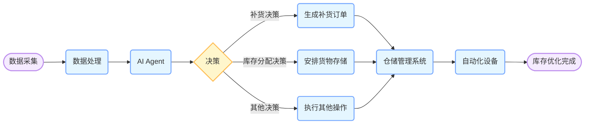

# 智能仓储：AI Agent的库存优化管理

> 关键词：智能仓储、AI Agent、库存优化管理、人工智能、物流管理、供应链、算法应用

> 摘要：本文聚焦于智能仓储领域中AI Agent的库存优化管理。随着物流行业的快速发展，传统的库存管理方式已难以满足高效、精准的需求。AI Agent凭借其智能决策和学习能力，为库存优化带来了新的解决方案。文章详细阐述了相关核心概念、算法原理、数学模型，通过项目实战展示其应用，分析实际应用场景，推荐学习资源和开发工具，最后总结未来发展趋势与挑战，旨在为智能仓储的库存优化管理提供全面且深入的技术参考。

## 1. 背景介绍 
### 1.1 目的和范围
在当今数字化和智能化的时代，仓储管理作为供应链环节中的关键部分，其效率和准确性直接影响着企业的运营成本和客户满意度。本文章的目的在于深入探讨如何利用AI Agent实现智能仓储中的库存优化管理。范围涵盖了从AI Agent的基本概念和原理，到具体的算法实现和数学模型，再到实际项目中的应用案例，以及相关的工具资源推荐和未来发展趋势分析。

### 1.2 预期读者
本文预期读者包括物流和供应链领域的从业者，如仓库管理人员、物流规划师等，他们可以从文中获取关于智能仓储库存管理的新技术和方法，以提升实际工作效率和管理水平。同时，计算机科学和人工智能领域的研究者和开发者也能从中找到关于AI Agent在特定领域应用的深入分析和技术实现细节，为相关研究和开发提供参考。此外，对智能仓储和人工智能感兴趣的学生和爱好者也能通过本文了解该领域的前沿知识和发展动态。

### 1.3 文档结构概述
本文将按照以下结构展开：首先介绍相关背景知识，包括目的、预期读者和文档结构概述以及术语表。接着阐述核心概念与联系，通过文本示意图和Mermaid流程图清晰展示AI Agent与库存优化管理的关系。然后详细讲解核心算法原理及具体操作步骤，并使用Python源代码进行阐述。之后介绍数学模型和公式，通过举例说明其在库存优化中的应用。再通过项目实战展示代码实际案例并进行详细解释。随后分析实际应用场景，推荐相关的工具和资源。最后总结未来发展趋势与挑战，提供常见问题与解答以及扩展阅读和参考资料。

### 1.4 术语表
#### 1.4.1 核心术语定义
- **智能仓储**：利用物联网、人工智能等技术实现仓储管理的自动化、智能化，包括货物的自动存储、检索、分拣等功能，以提高仓储效率和准确性。
- **AI Agent**：人工智能代理，是一种能够感知环境、进行决策并采取行动以实现特定目标的智能实体。在智能仓储中，AI Agent可以根据库存数据、订单信息等环境因素，做出库存管理的决策。
- **库存优化管理**：通过合理的策略和方法，对库存水平进行调整和控制，以达到降低库存成本、提高库存周转率、满足客户需求等目标。

#### 1.4.2 相关概念解释
- **供应链**：围绕核心企业，通过对信息流、物流、资金流的控制，从采购原材料开始，制成中间产品以及最终产品，最后由销售网络把产品送到消费者手中的将供应商、制造商、分销商、零售商、直到最终用户连成一个整体的功能网链结构。
- **物联网（IoT）**：通过各种信息传感器、射频识别技术、全球定位系统、红外感应器、激光扫描器等各种装置与技术，实时采集任何需要监控、 连接、互动的物体或过程，采集其声、光、热、电、力学、化学、生物、位置等各种需要的信息，通过各类可能的网络接入，实现物与物、物与人的泛在连接，实现对物品和过程的智能化感知、识别和管理。

#### 1.4.3 缩略词列表
- **IoT**：Internet of Things（物联网）
- **AI**：Artificial Intelligence（人工智能）

## 2. 核心概念与联系 
### 核心概念原理
智能仓储的库存优化管理是一个复杂的系统工程，涉及到多个环节和因素。AI Agent作为其中的关键角色，其核心原理是基于人工智能的感知、决策和行动能力。

AI Agent通过传感器、物联网设备等手段感知仓储环境中的各种信息，如库存数量、货物位置、订单需求等。这些信息被收集和处理后，AI Agent利用机器学习、深度学习等算法进行数据分析和建模，以预测未来的库存需求和趋势。

基于预测结果，AI Agent根据预设的目标和规则进行决策，例如确定最佳的补货时间、补货数量、库存分配策略等。最后，AI Agent通过与仓储管理系统、自动化设备等进行交互，采取实际的行动来实现库存的优化管理，如自动生成补货订单、控制机器人进行货物搬运等。

### 架构的文本示意图
智能仓储中AI Agent的库存优化管理架构主要包括以下几个部分：

1. **数据采集层**：通过各种传感器、物联网设备收集仓储环境中的数据，如库存数据、订单数据、设备状态数据等。
2. **数据处理层**：对采集到的数据进行清洗、转换和存储，以便后续的分析和处理。
3. **AI Agent层**：包括感知模块、决策模块和行动模块。感知模块接收处理后的数据，决策模块根据预设的算法和规则进行决策，行动模块将决策结果转化为实际的行动。
4. **仓储管理系统层**：与AI Agent进行交互，执行AI Agent下达的指令，如生成补货订单、安排货物存储和搬运等。
5. **自动化设备层**：包括自动存储设备、自动分拣设备、机器人等，根据仓储管理系统的指令进行实际的操作。

### Mermaid流程图


## 3. 核心算法原理 & 具体操作步骤 
### 核心算法原理
在智能仓储的库存优化管理中，常用的算法包括预测算法和优化算法。

#### 预测算法 - 时间序列分析
时间序列分析是一种基于历史数据预测未来趋势的方法。在库存管理中，可以利用时间序列分析预测未来的库存需求。常用的时间序列分析模型包括ARIMA（Autoregressive Integrated Moving Average）模型。

ARIMA模型的基本原理是通过对时间序列数据的自回归（AR）、差分（I）和移动平均（MA）进行建模，来预测未来的值。其数学表达式为：

$$
\phi(B)(1 - B)^d Y_t = \theta(B) \epsilon_t
$$

其中，$\phi(B)$ 是自回归多项式，$(1 - B)^d$ 是差分算子，$\theta(B)$ 是移动平均多项式，$Y_t$ 是时间序列数据，$\epsilon_t$ 是白噪声序列。

#### 优化算法 - 遗传算法
遗传算法是一种基于生物进化原理的优化算法。在库存优化中，可以利用遗传算法寻找最优的库存管理策略，如补货时间、补货数量等。

遗传算法的基本步骤包括编码、初始化种群、适应度评估、选择、交叉和变异。通过不断迭代，逐步逼近最优解。

### 具体操作步骤及Python源代码实现
#### 时间序列分析（ARIMA模型）
以下是使用Python的`statsmodels`库实现ARIMA模型进行库存需求预测的示例代码：

```python
import pandas as pd
from statsmodels.tsa.arima.model import ARIMA
import matplotlib.pyplot as plt

# 生成示例数据
data = pd.Series([10, 12, 15, 13, 16, 18, 20, 22, 25, 23], index=pd.date_range(start='2023-01-01', periods=10))

# 拟合ARIMA模型
model = ARIMA(data, order=(1, 1, 1))
model_fit = model.fit()

# 预测未来值
forecast_steps = 3
forecast = model_fit.get_forecast(steps=forecast_steps)
forecast_mean = forecast.predicted_mean

# 绘制结果
plt.plot(data, label='Historical Data')
plt.plot(pd.date_range(start='2023-01-11', periods=forecast_steps), forecast_mean, label='Forecast')
plt.legend()
plt.show()
```

#### 遗传算法优化库存管理策略
以下是一个简单的遗传算法示例，用于优化库存的补货数量：

```python
import random
import numpy as np

# 定义目标函数（库存成本最小化）
def inventory_cost(reorder_point, order_quantity, demand):
    inventory_level = 0
    total_cost = 0
    for d in demand:
        inventory_level -= d
        if inventory_level < reorder_point:
            inventory_level += order_quantity
            total_cost += 10  # 补货成本
        total_cost += max(0, inventory_level) * 0.1  # 库存持有成本
    return total_cost

# 遗传算法参数
population_size = 50
generations = 100
mutation_rate = 0.1

# 初始化种群
population = []
for _ in range(population_size):
    reorder_point = random.randint(0, 20)
    order_quantity = random.randint(10, 50)
    population.append((reorder_point, order_quantity))

# 遗传算法主循环
for _ in range(generations):
    # 计算适应度
    fitness_scores = []
    demand = np.random.randint(5, 15, 30)  # 生成随机需求
    for individual in population:
        cost = inventory_cost(individual[0], individual[1], demand)
        fitness_scores.append(1 / (cost + 1))  # 适应度越高越好

    # 选择
    total_fitness = sum(fitness_scores)
    selection_probs = [score / total_fitness for score in fitness_scores]
    selected_indices = np.random.choice(population_size, size=population_size, p=selection_probs)
    selected_population = [population[i] for i in selected_indices]

    # 交叉
    new_population = []
    for i in range(0, population_size, 2):
        parent1 = selected_population[i]
        parent2 = selected_population[i + 1]
        crossover_point = random.randint(1, 1)
        child1 = parent1[:crossover_point] + parent2[crossover_point:]
        child2 = parent2[:crossover_point] + parent1[crossover_point:]
        new_population.extend([child1, child2])

    # 变异
    for i in range(population_size):
        if random.random() < mutation_rate:
            gene_index = random.randint(0, 1)
            if gene_index == 0:
                new_population[i] = (random.randint(0, 20), new_population[i][1])
            else:
                new_population[i] = (new_population[i][0], random.randint(10, 50))

    population = new_population

# 找到最优解
best_individual = max(population, key=lambda x: 1 / (inventory_cost(x[0], x[1], demand) + 1))
print("最优补货点:", best_individual[0])
print("最优补货数量:", best_individual[1])
```

## 4. 数学模型和公式 & 详细讲解 & 举例说明 
### 库存成本模型
库存成本主要包括采购成本、库存持有成本和缺货成本。其数学模型可以表示为：

$$
TC = PC + HC + SC
$$

其中，$TC$ 是总成本，$PC$ 是采购成本，$HC$ 是库存持有成本，$SC$ 是缺货成本。

#### 采购成本
采购成本是指购买货物的成本，通常与采购数量和单价有关。其公式为：

$$
PC = c \times Q
$$

其中，$c$ 是货物的单价，$Q$ 是采购数量。

#### 库存持有成本
库存持有成本是指持有库存所产生的成本，包括仓储费用、资金占用成本等。其公式为：

$$
HC = h \times \frac{Q}{2}
$$

其中，$h$ 是单位库存的持有成本，$\frac{Q}{2}$ 是平均库存水平。

#### 缺货成本
缺货成本是指由于库存不足导致无法满足客户需求而产生的成本，如失去销售机会、客户满意度下降等。其公式为：

$$
SC = s \times D_{short}
$$

其中，$s$ 是单位缺货成本，$D_{short}$ 是缺货数量。

### 经济订货量模型（EOQ）
经济订货量模型是一种经典的库存管理模型，用于确定最优的补货数量，以最小化库存总成本。其公式为：

$$
EOQ = \sqrt{\frac{2DS}{h}}
$$

其中，$D$ 是年需求量，$S$ 是每次补货的固定成本，$h$ 是单位库存的持有成本。

### 举例说明
假设某企业每年需要采购某种货物 1000 件，每次补货的固定成本为 50 元，单位货物的单价为 10 元，单位库存的持有成本为 2 元/件/年，单位缺货成本为 10 元/件。

#### 计算采购成本
如果每次采购 100 件，则采购成本为：

$$
PC = 10 \times 100 = 1000 \text{ 元}
$$

#### 计算库存持有成本
平均库存水平为 $\frac{100}{2} = 50$ 件，则库存持有成本为：

$$
HC = 2 \times 50 = 100 \text{ 元}
$$

#### 计算缺货成本
假设在采购周期内没有缺货，则缺货成本为 0 元。

#### 计算总成本
$$
TC = PC + HC + SC = 1000 + 100 + 0 = 1100 \text{ 元}
$$

#### 计算经济订货量
$$
EOQ = \sqrt{\frac{2 \times 1000 \times 50}{2}} = \sqrt{50000} \approx 224 \text{ 件}
$$

当每次采购数量为 224 件时，库存总成本最小。

## 5. 项目实战：代码实际案例和详细解释说明 
### 5.1  开发环境搭建
#### 操作系统
本项目可以在多种操作系统上进行开发，如Windows、Linux（如Ubuntu）、macOS等。建议使用Linux或macOS，因为它们对Python和相关库的支持更好。

#### Python环境
安装Python 3.7及以上版本。可以从Python官方网站（https://www.python.org/downloads/）下载并安装。

#### 依赖库安装
使用`pip`命令安装项目所需的依赖库：

```sh
pip install pandas statsmodels numpy matplotlib
```

### 5.2  源代码详细实现和代码解读
以下是一个完整的智能仓储库存优化管理的项目示例，结合了时间序列预测和遗传算法优化：

```python
import pandas as pd
from statsmodels.tsa.arima.model import ARIMA
import numpy as np
import random
import matplotlib.pyplot as plt

# 生成示例历史需求数据
def generate_historical_data():
    data = pd.Series([10, 12, 15, 13, 16, 18, 20, 22, 25, 23], index=pd.date_range(start='2023-01-01', periods=10))
    return data

# 时间序列预测（ARIMA模型）
def time_series_forecast(data, steps):
    model = ARIMA(data, order=(1, 1, 1))
    model_fit = model.fit()
    forecast = model_fit.get_forecast(steps=steps)
    forecast_mean = forecast.predicted_mean
    return forecast_mean

# 定义目标函数（库存成本最小化）
def inventory_cost(reorder_point, order_quantity, demand):
    inventory_level = 0
    total_cost = 0
    for d in demand:
        inventory_level -= d
        if inventory_level < reorder_point:
            inventory_level += order_quantity
            total_cost += 10  # 补货成本
        total_cost += max(0, inventory_level) * 0.1  # 库存持有成本
    return total_cost

# 遗传算法优化库存管理策略
def genetic_algorithm_optimization(demand):
    # 遗传算法参数
    population_size = 50
    generations = 100
    mutation_rate = 0.1

    # 初始化种群
    population = []
    for _ in range(population_size):
        reorder_point = random.randint(0, 20)
        order_quantity = random.randint(10, 50)
        population.append((reorder_point, order_quantity))

    # 遗传算法主循环
    for _ in range(generations):
        # 计算适应度
        fitness_scores = []
        for individual in population:
            cost = inventory_cost(individual[0], individual[1], demand)
            fitness_scores.append(1 / (cost + 1))  # 适应度越高越好

        # 选择
        total_fitness = sum(fitness_scores)
        selection_probs = [score / total_fitness for score in fitness_scores]
        selected_indices = np.random.choice(population_size, size=population_size, p=selection_probs)
        selected_population = [population[i] for i in selected_indices]

        # 交叉
        new_population = []
        for i in range(0, population_size, 2):
            parent1 = selected_population[i]
            parent2 = selected_population[i + 1]
            crossover_point = random.randint(1, 1)
            child1 = parent1[:crossover_point] + parent2[crossover_point:]
            child2 = parent2[:crossover_point] + parent1[crossover_point:]
            new_population.extend([child1, child2])

        # 变异
        for i in range(population_size):
            if random.random() < mutation_rate:
                gene_index = random.randint(0, 1)
                if gene_index == 0:
                    new_population[i] = (random.randint(0, 20), new_population[i][1])
                else:
                    new_population[i] = (new_population[i][0], random.randint(10, 50))

        population = new_population

    # 找到最优解
    best_individual = max(population, key=lambda x: 1 / (inventory_cost(x[0], x[1], demand) + 1))
    return best_individual

# 主函数
def main():
    # 生成历史数据
    historical_data = generate_historical_data()

    # 进行时间序列预测
    forecast_steps = 3
    forecasted_demand = time_series_forecast(historical_data, forecast_steps)

    # 遗传算法优化
    best_reorder_point, best_order_quantity = genetic_algorithm_optimization(forecasted_demand)

    print("预测的未来需求:", forecasted_demand)
    print("最优补货点:", best_reorder_point)
    print("最优补货数量:", best_order_quantity)

    # 绘制历史数据和预测结果
    plt.plot(historical_data, label='Historical Data')
    plt.plot(pd.date_range(start='2023-01-11', periods=forecast_steps), forecasted_demand, label='Forecast')
    plt.legend()
    plt.show()

if __name__ == "__main__":
    main()
```

### 5.3  代码解读与分析
#### 生成历史数据
`generate_historical_data` 函数生成了一个示例的历史需求数据，使用`pandas`的`Series`对象存储，并设置了时间索引。

#### 时间序列预测
`time_series_forecast` 函数使用ARIMA模型对历史数据进行拟合，并预测未来的需求。通过`statsmodels`库的`ARIMA`类实现。

#### 库存成本计算
`inventory_cost` 函数计算了给定补货点和补货数量下的库存成本，包括补货成本和库存持有成本。

#### 遗传算法优化
`genetic_algorithm_optimization` 函数实现了遗传算法的主要逻辑，包括种群初始化、适应度评估、选择、交叉和变异等步骤，最终找到最优的补货点和补货数量。

#### 主函数
`main` 函数调用了上述函数，完成了历史数据生成、时间序列预测、遗传算法优化等步骤，并输出预测结果和最优的库存管理策略，同时绘制了历史数据和预测结果的图表。

## 6. 实际应用场景 
### 电商仓储
在电商行业，订单量波动较大，库存管理的准确性和及时性至关重要。AI Agent可以通过分析历史订单数据、促销活动信息、季节性因素等，预测未来的订单需求，从而优化库存水平。例如，在“双11”等购物节前夕，AI Agent可以提前预测订单量的增长，自动调整补货计划，确保有足够的库存满足消费者需求，同时避免库存积压。

### 制造业仓储
制造业的生产过程中需要大量的原材料和零部件，库存管理直接影响到生产的连续性和成本。AI Agent可以根据生产计划、供应链状态等信息，实时监控库存水平，自动生成补货订单，确保原材料和零部件的及时供应。此外，AI Agent还可以优化库存布局，提高仓储空间的利用率，降低仓储成本。

### 冷链物流仓储
冷链物流仓储对温度、湿度等环境条件要求严格，库存管理不仅要考虑货物的数量，还要考虑货物的质量和保鲜期。AI Agent可以通过物联网传感器实时监测货物的温度、湿度等信息，根据货物的保鲜期和需求预测，合理安排货物的存储和配送，确保货物的质量安全。

### 医药仓储
医药仓储对药品的存储条件和有效期管理要求极高。AI Agent可以通过对药品的入库时间、有效期、库存数量等信息进行实时监控和分析，自动提醒工作人员进行药品的盘点、补货和过期处理，确保药品的质量和安全，避免因药品过期造成的损失。

## 7. 工具和资源推荐
### 7.1 学习资源推荐
#### 7.1.1 书籍推荐
- 《人工智能：一种现代的方法》：全面介绍了人工智能的基本概念、算法和应用，是人工智能领域的经典教材。
- 《Python数据分析实战》：详细介绍了使用Python进行数据分析的方法和技巧，包括数据处理、可视化、机器学习等内容，对于智能仓储的数据分析和建模有很大的帮助。
- 《物流与供应链管理》：系统阐述了物流和供应链管理的理论和实践，为智能仓储的库存优化管理提供了理论基础。

#### 7.1.2 在线课程
- Coursera上的“人工智能基础”课程：由知名高校的教授授课，深入浅出地介绍了人工智能的基本概念和算法。
- edX上的“Python数据科学基础”课程：通过实际案例介绍了使用Python进行数据科学的方法和技巧。
- 中国大学MOOC上的“物流与供应链管理”课程：结合国内实际情况，系统讲解了物流和供应链管理的相关知识。

#### 7.1.3 技术博客和网站
- 机器之心：提供人工智能领域的最新技术动态、研究成果和应用案例。
- 数据派THU：专注于数据分析和数据挖掘领域的技术分享和交流。
- 物流沙龙：关注物流行业的发展趋势、技术创新和实践经验。

### 7.2 开发工具框架推荐
#### 7.2.1 IDE和编辑器
- PyCharm：一款专业的Python集成开发环境，提供了丰富的代码编辑、调试、版本控制等功能，适合Python项目的开发。
- Visual Studio Code：一款轻量级的代码编辑器，支持多种编程语言，通过安装相关插件可以方便地进行Python开发。

#### 7.2.2 调试和性能分析工具
- pdb：Python自带的调试器，可以帮助开发者定位和解决代码中的问题。
- cProfile：Python的性能分析工具，可以分析代码的运行时间和函数调用情况，帮助开发者优化代码性能。

#### 7.2.3 相关框架和库
- pandas：用于数据处理和分析的Python库，提供了高效的数据结构和数据操作方法。
- statsmodels：用于统计建模和时间序列分析的Python库，提供了多种统计模型和算法。
- scikit-learn：用于机器学习的Python库，提供了多种机器学习算法和工具，如分类、回归、聚类等。

### 7.3 相关论文著作推荐
#### 7.3.1 经典论文
- “Inventory Control with Uncertain Demand: A Review”：对不确定需求下的库存控制问题进行了全面的综述，介绍了各种库存管理模型和方法。
- “Genetic Algorithms in Optimization Problems: A Survey”：对遗传算法在优化问题中的应用进行了综述，分析了遗传算法的优缺点和应用场景。

#### 7.3.2 最新研究成果
- 关注顶级学术会议和期刊，如ACM SIGKDD、IEEE Transactions on Automation Science and Engineering等，获取智能仓储和人工智能领域的最新研究成果。

#### 7.3.3 应用案例分析
- 一些企业和研究机构会发布智能仓储的应用案例分析报告，可以通过相关网站和数据库获取，了解实际应用中的经验和教训。

## 8. 总结：未来发展趋势与挑战
### 未来发展趋势
#### 智能化程度不断提高
随着人工智能技术的不断发展，AI Agent在智能仓储中的应用将更加深入和广泛。未来的AI Agent将具备更强的学习能力和决策能力，能够自动适应复杂多变的仓储环境，实现更加智能化的库存优化管理。

#### 与物联网深度融合
物联网技术的发展为智能仓储提供了更加丰富的数据来源。未来，AI Agent将与物联网设备深度融合，实时获取货物的位置、状态、环境信息等，从而更加精准地进行库存管理和调度。

#### 供应链协同优化
智能仓储作为供应链的重要环节，未来将与供应链的其他环节进行更加紧密的协同优化。AI Agent将通过与供应商、制造商、零售商等的信息共享和交互，实现整个供应链的库存优化和效率提升。

#### 绿色仓储发展
随着环保意识的增强，绿色仓储将成为未来的发展趋势。AI Agent可以通过优化库存管理和物流配送，减少能源消耗和环境污染，实现仓储的可持续发展。

### 挑战
#### 数据安全和隐私问题
智能仓储中涉及大量的敏感数据，如客户信息、库存数据、供应链信息等。如何保障这些数据的安全和隐私，防止数据泄露和滥用，是一个亟待解决的问题。

#### 算法复杂度和计算资源需求
一些先进的人工智能算法，如深度学习算法，具有较高的复杂度和计算资源需求。在实际应用中，如何在有限的计算资源下实现高效的算法运行，是一个挑战。

#### 人才短缺
智能仓储的发展需要既懂人工智能技术又懂物流管理的复合型人才。目前，这类人才相对短缺，制约了智能仓储的推广和应用。

#### 系统集成和兼容性问题
智能仓储系统需要集成多种设备和软件，如物联网设备、仓储管理系统、自动化设备等。如何实现这些设备和软件之间的无缝集成和兼容性，是一个技术难题。

## 9. 附录：常见问题与解答
### 1. AI Agent在智能仓储中能替代人工管理吗？
目前还不能完全替代。虽然AI Agent具有智能决策和学习能力，但在一些复杂的情况下，如处理突发异常事件、与供应商和客户进行沟通协商等，还需要人工的参与和干预。AI Agent更多地是作为人工管理的辅助工具，提高库存管理的效率和准确性。

### 2. 如何选择适合的AI算法进行库存优化管理？
需要根据具体的业务需求和数据特点来选择。如果历史数据呈现明显的时间序列特征，可以选择时间序列分析算法，如ARIMA模型；如果需要寻找最优的库存管理策略，可以选择优化算法，如遗传算法、模拟退火算法等。同时，还可以结合多种算法进行综合应用，以提高库存优化的效果。

### 3. 智能仓储系统的实施成本高吗？
智能仓储系统的实施成本包括硬件设备采购、软件系统开发、人员培训等多个方面。其成本相对较高，但从长期来看，智能仓储系统可以提高仓储效率、降低库存成本、减少人工错误等，从而带来显著的经济效益。企业可以根据自身的实际情况和发展需求，合理规划智能仓储系统的实施步骤和成本投入。

### 4. 如何保障智能仓储系统的数据安全？
可以采取多种措施保障数据安全，如数据加密、访问控制、备份恢复、安全审计等。同时，要加强员工的安全意识培训，制定严格的安全管理制度，防止内部人员的误操作和违规行为。此外，还可以选择可靠的技术供应商和安全服务提供商，确保系统的安全性和稳定性。

## 10. 扩展阅读 & 参考资料
### 扩展阅读
- 《工业4.0时代的智能物流》
- 《人工智能与供应链创新》

### 参考资料
- 相关学术论文和研究报告
- 行业标准和规范
- 企业的实际应用案例和经验分享