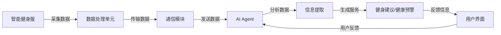

# 智能健身服：AI Agent的运动数据分析

> 关键词：智能健身服、AI Agent、运动数据分析、传感器技术、健康监测

> 摘要：本文聚焦于智能健身服与AI Agent结合的运动数据分析领域。详细阐述了智能健身服和AI Agent的核心概念及其联系，深入剖析了相关算法原理和数学模型。通过项目实战展示了如何实现运动数据的采集与分析，探讨了其实际应用场景。同时，推荐了学习该领域所需的工具和资源，最后总结了其未来发展趋势与挑战，并提供常见问题解答和参考资料，旨在为读者全面呈现智能健身服结合AI Agent进行运动数据分析的技术全貌。

## 1. 背景介绍 
### 1.1 目的和范围
智能健身服作为一种融合了先进传感器技术与纺织技术的创新产品，正逐渐改变人们的健身和健康管理方式。其结合AI Agent进行运动数据分析的技术更是为运动科学和健康监测带来了新的机遇。本文的目的在于深入探讨智能健身服中AI Agent的运动数据分析技术，包括核心概念、算法原理、数学模型、实际应用等方面。范围涵盖了从智能健身服的硬件原理到软件算法实现，以及相关的实际应用场景和未来发展趋势。

### 1.2 预期读者
本文预期读者包括对智能可穿戴设备、运动科学、人工智能等领域感兴趣的科研人员、工程师、健身爱好者以及相关专业的学生。对于希望深入了解智能健身服运动数据分析技术的人士，本文将提供全面而深入的技术解读。

### 1.3 文档结构概述
本文将按照以下结构进行阐述：首先介绍智能健身服和AI Agent的核心概念及其联系；接着深入讲解相关的核心算法原理和具体操作步骤，并给出Python源代码示例；然后介绍数学模型和公式，并举例说明；通过项目实战展示代码实际案例和详细解释；探讨实际应用场景；推荐相关的工具和资源；最后总结未来发展趋势与挑战，提供常见问题解答和参考资料。

### 1.4 术语表
#### 1.4.1 核心术语定义
- **智能健身服**：一种集成了传感器、数据处理单元和通信模块的功能性服装，能够实时采集人体运动和生理数据。
- **AI Agent**：人工智能代理，是一种能够感知环境、做出决策并执行行动的智能实体，在智能健身服中用于分析运动数据。
- **运动数据分析**：对采集到的运动相关数据进行处理、挖掘和解释，以获取有价值的信息，如运动强度、运动姿态等。

#### 1.4.2 相关概念解释
- **传感器技术**：智能健身服中用于采集数据的关键技术，包括加速度计、陀螺仪、心率传感器等，能够测量人体的运动和生理参数。
- **数据融合**：将来自不同传感器的数据进行整合，以提高数据的准确性和可靠性。
- **机器学习算法**：用于分析运动数据的人工智能算法，如决策树、神经网络等，能够从数据中学习模式和规律。

#### 1.4.3 缩略词列表
- **MEMS**：Micro-Electro-Mechanical Systems，微机电系统，常用于制造传感器。
- **IMU**：Inertial Measurement Unit，惯性测量单元，包含加速度计和陀螺仪。
- **HR**：Heart Rate，心率。

## 2. 核心概念与联系 

### 智能健身服的工作原理
智能健身服主要由传感器、数据处理单元和通信模块组成。传感器负责采集人体的运动和生理数据，如加速度、角速度、心率等。数据处理单元对采集到的数据进行初步处理，如滤波、特征提取等。通信模块将处理后的数据传输到外部设备，如智能手机、智能手表等。

### AI Agent的作用
AI Agent在智能健身服中扮演着数据分析和决策的角色。它接收来自智能健身服的数据，运用机器学习和人工智能算法对数据进行分析，提取有价值的信息，如运动类型、运动强度、运动姿态等。根据分析结果，AI Agent可以提供个性化的健身建议、健康预警等服务。

### 核心概念的联系
智能健身服为AI Agent提供了丰富的运动数据，而AI Agent则为智能健身服赋予了智能分析和决策的能力。两者相互协作，实现了运动数据的采集、分析和应用的闭环。

### 文本示意图
智能健身服的传感器采集人体运动和生理数据，数据通过数据处理单元进行初步处理后，由通信模块传输到AI Agent。AI Agent对数据进行深入分析，提取有价值的信息，并根据分析结果提供相应的服务，如健身建议、健康预警等。这些服务可以通过用户界面反馈给用户，用户的反馈又可以进一步优化AI Agent的分析和决策。

### Mermaid流程图


## 3. 核心算法原理 & 具体操作步骤 

### 数据预处理算法
在进行运动数据分析之前，需要对采集到的数据进行预处理，以提高数据的质量和可用性。常见的数据预处理算法包括滤波、归一化等。

```python
import numpy as np
from scipy.signal import butter, filtfilt

def butterworth_lowpass(cutoff, fs, order=5):
    nyquist = 0.5 * fs
    normal_cutoff = cutoff / nyquist
    b, a = butter(order, normal_cutoff, btype='low', analog=False)
    return b, a

def butterworth_lowpass_filter(data, cutoff, fs, order=5):
    b, a = butterworth_lowpass(cutoff, fs, order=order)
    y = filtfilt(b, a, data)
    return y

# 示例数据
data = np.random.randn(1000)
fs = 100  # 采样频率
cutoff = 10  # 截止频率
filtered_data = butterworth_lowpass_filter(data, cutoff, fs)
```

### 特征提取算法
特征提取是运动数据分析的关键步骤，它能够从原始数据中提取出有代表性的特征，用于后续的分类和识别。常见的特征包括均值、方差、标准差、峰值等。

```python
def extract_features(data):
    mean_value = np.mean(data)
    variance = np.var(data)
    std_dev = np.std(data)
    peak_value = np.max(np.abs(data))
    return mean_value, variance, std_dev, peak_value

features = extract_features(filtered_data)
```

### 分类和识别算法
分类和识别算法用于将运动数据分类为不同的运动类型或运动姿态。常见的分类算法包括决策树、支持向量机、神经网络等。

```python
from sklearn.tree import DecisionTreeClassifier
from sklearn.model_selection import train_test_split
from sklearn.metrics import accuracy_score

# 示例数据集
X = np.random.randn(100, 4)  # 特征矩阵
y = np.random.randint(0, 2, 100)  # 标签

# 划分训练集和测试集
X_train, X_test, y_train, y_test = train_test_split(X, y, test_size=0.2, random_state=42)

# 训练决策树分类器
clf = DecisionTreeClassifier()
clf.fit(X_train, y_train)

# 预测
y_pred = clf.predict(X_test)

# 计算准确率
accuracy = accuracy_score(y_test, y_pred)
print(f"Accuracy: {accuracy}")
```

### 具体操作步骤
1. **数据采集**：使用智能健身服的传感器采集人体运动和生理数据。
2. **数据传输**：将采集到的数据通过通信模块传输到外部设备。
3. **数据预处理**：对传输过来的数据进行滤波、归一化等预处理操作。
4. **特征提取**：从预处理后的数据中提取有代表性的特征。
5. **分类和识别**：使用分类和识别算法对特征进行分类，确定运动类型或运动姿态。
6. **结果反馈**：将分类结果和相关建议反馈给用户。

## 4. 数学模型和公式 & 详细讲解 & 举例说明 

### 滤波算法的数学模型
低通滤波是一种常见的数据预处理方法，其数学模型可以用差分方程表示。对于一个$n$阶的巴特沃斯低通滤波器，其差分方程为：

$$\sum_{k=0}^{n}a_{k}y[n - k]=\sum_{k=0}^{m}b_{k}x[n - k]$$

其中，$x[n]$是输入信号，$y[n]$是输出信号，$a_{k}$和$b_{k}$是滤波器的系数。

### 特征提取的数学公式
- **均值**：$ \bar{x}=\frac{1}{N}\sum_{i = 1}^{N}x_{i}$
- **方差**：$ \sigma^{2}=\frac{1}{N}\sum_{i = 1}^{N}(x_{i}-\bar{x})^{2}$
- **标准差**：$ \sigma=\sqrt{\frac{1}{N}\sum_{i = 1}^{N}(x_{i}-\bar{x})^{2}}$
- **峰值**：$ x_{peak}=\max(\vert x_{i}\vert)$

### 分类算法的数学原理
决策树是一种常用的分类算法，其基本思想是通过对特征空间进行划分，构建一棵决策树。决策树的每个内部节点是一个特征上的测试，每个分支是一个测试输出，每个叶节点是一个类别标签。决策树的构建过程可以使用信息增益、基尼指数等准则来选择最优的划分特征。

### 举例说明
假设有一组加速度数据$x = [1, 2, 3, 4, 5]$，我们可以计算其均值、方差、标准差和峰值：

- **均值**：$\bar{x}=\frac{1 + 2 + 3 + 4 + 5}{5}=3$
- **方差**：$\sigma^{2}=\frac{(1 - 3)^{2}+(2 - 3)^{2}+(3 - 3)^{2}+(4 - 3)^{2}+(5 - 3)^{2}}{5}=2$
- **标准差**：$\sigma=\sqrt{2}\approx1.414$
- **峰值**：$x_{peak}=\max(\vert 1\vert,\vert 2\vert,\vert 3\vert,\vert 4\vert,\vert 5\vert)=5$

## 5. 项目实战：代码实际案例和详细解释说明 

### 5.1  开发环境搭建
- **硬件设备**：选择一款支持数据采集和传输的智能健身服，如Myontec Mbody、Hexoskin等。
- **开发平台**：选择Python作为开发语言，使用Anaconda作为Python环境管理工具。
- **开发工具**：使用PyCharm作为集成开发环境（IDE）。

### 5.2  源代码详细实现和代码解读
```python
import numpy as np
from scipy.signal import butter, filtfilt
from sklearn.tree import DecisionTreeClassifier
from sklearn.model_selection import train_test_split
from sklearn.metrics import accuracy_score

# 数据预处理函数
def butterworth_lowpass(cutoff, fs, order=5):
    nyquist = 0.5 * fs
    normal_cutoff = cutoff / nyquist
    b, a = butter(order, normal_cutoff, btype='low', analog=False)
    return b, a

def butterworth_lowpass_filter(data, cutoff, fs, order=5):
    b, a = butterworth_lowpass(cutoff, fs, order=order)
    y = filtfilt(b, a, data)
    return y

# 特征提取函数
def extract_features(data):
    mean_value = np.mean(data)
    variance = np.var(data)
    std_dev = np.std(data)
    peak_value = np.max(np.abs(data))
    return mean_value, variance, std_dev, peak_value

# 主函数
def main():
    # 模拟采集到的数据
    data = np.random.randn(1000)
    fs = 100  # 采样频率
    cutoff = 10  # 截止频率

    # 数据预处理
    filtered_data = butterworth_lowpass_filter(data, cutoff, fs)

    # 特征提取
    features = extract_features(filtered_data)
    features = np.array(features).reshape(1, -1)

    # 模拟训练数据集
    X = np.random.randn(100, 4)  # 特征矩阵
    y = np.random.randint(0, 2, 100)  # 标签

    # 划分训练集和测试集
    X_train, X_test, y_train, y_test = train_test_split(X, y, test_size=0.2, random_state=42)

    # 训练决策树分类器
    clf = DecisionTreeClassifier()
    clf.fit(X_train, y_train)

    # 预测
    y_pred = clf.predict(features)
    print(f"Predicted class: {y_pred[0]}")

if __name__ == "__main__":
    main()
```

### 5.3  代码解读与分析
- **数据预处理**：使用巴特沃斯低通滤波器对采集到的数据进行滤波，去除高频噪声。
- **特征提取**：从滤波后的数据中提取均值、方差、标准差和峰值等特征。
- **分类和识别**：使用决策树分类器对特征进行分类，预测运动类型或运动姿态。
- **结果输出**：将预测结果输出到控制台。

## 6. 实际应用场景 
### 健身指导
智能健身服结合AI Agent可以实时监测用户的运动数据，如运动强度、运动姿态等。根据分析结果，AI Agent可以提供个性化的健身建议，帮助用户科学健身，提高健身效果。

### 健康监测
智能健身服可以采集用户的生理数据，如心率、血压等。AI Agent可以对这些数据进行分析，及时发现用户的健康问题，并提供健康预警。

### 运动训练
在专业的运动训练中，智能健身服和AI Agent可以帮助教练实时监测运动员的训练情况，调整训练计划，提高训练效果。

### 康复治疗
在康复治疗中，智能健身服可以监测患者的运动情况，AI Agent可以根据患者的康复进度提供个性化的康复方案，帮助患者尽快恢复健康。

## 7. 工具和资源推荐
### 7.1 学习资源推荐
#### 7.1.1 书籍推荐
- 《传感器技术》：介绍了各种传感器的原理和应用，对于理解智能健身服的硬件原理有很大帮助。
- 《机器学习》：全面介绍了机器学习的基本概念、算法和应用，是学习运动数据分析的重要参考书籍。
- 《人工智能：一种现代的方法》：涵盖了人工智能的各个领域，对于深入理解AI Agent的原理和应用有很大帮助。

#### 7.1.2 在线课程
- Coursera上的“Machine Learning”课程：由Andrew Ng教授授课，是学习机器学习的经典课程。
- edX上的“Artificial Intelligence”课程：系统介绍了人工智能的基本概念和算法。
- Udemy上的“Wearable Technology and IoT”课程：介绍了可穿戴设备和物联网的相关知识。

#### 7.1.3 技术博客和网站
- Medium：有很多关于智能可穿戴设备、机器学习和人工智能的技术博客。
- Towards Data Science：专注于数据科学和机器学习领域的技术分享。
- IEEE Xplore：提供了大量的学术论文和技术报告，对于深入研究相关领域有很大帮助。

### 7.2 开发工具框架推荐
#### 7.2.1 IDE和编辑器
- PyCharm：功能强大的Python集成开发环境，适合开发Python项目。
- Visual Studio Code：轻量级的代码编辑器，支持多种编程语言和插件。

#### 7.2.2 调试和性能分析工具
- PySnooper：简单易用的Python调试工具，可以实时查看变量的值。
- cProfile：Python内置的性能分析工具，可以分析代码的执行时间和内存使用情况。

#### 7.2.3 相关框架和库
- NumPy：Python中用于科学计算的基础库，提供了高效的数组操作功能。
- SciPy：基于NumPy的科学计算库，提供了丰富的数学算法和工具。
- Scikit-learn：Python中常用的机器学习库，提供了各种机器学习算法和工具。

### 7.3 相关论文著作推荐
#### 7.3.1 经典论文
- “A Survey on Wearable Sensor-Based Systems for Health Monitoring and Prognosis”：综述了基于可穿戴传感器的健康监测和预测系统。
- “Machine Learning for Wearable Sensor Data Analytics: A Survey”：介绍了可穿戴传感器数据分析中的机器学习方法。

#### 7.3.2 最新研究成果
- 关注IEEE Transactions on Biomedical Engineering、ACM Transactions on Sensor Networks等学术期刊，了解最新的研究成果。

#### 7.3.3 应用案例分析
- 查看相关的行业报告和案例分析，了解智能健身服和AI Agent在实际应用中的经验和教训。

## 8. 总结：未来发展趋势与挑战
### 未来发展趋势
- **技术融合**：智能健身服将与更多的技术进行融合，如虚拟现实、增强现实等，为用户提供更加沉浸式的健身体验。
- **个性化服务**：AI Agent将根据用户的个体差异，提供更加个性化的健身建议和健康管理方案。
- **数据共享**：智能健身服采集到的数据将实现更加广泛的共享，为运动科学和医学研究提供更多的数据支持。

### 挑战
- **数据安全和隐私**：智能健身服采集到的用户数据涉及到个人隐私和安全问题，需要加强数据保护措施。
- **传感器精度和可靠性**：提高传感器的精度和可靠性，是保证运动数据分析准确性的关键。
- **算法优化**：不断优化运动数据分析算法，提高算法的效率和准确性。

## 9. 附录：常见问题与解答
### 智能健身服的电池续航能力如何？
智能健身服的电池续航能力因产品而异，一般在数小时到数天不等。一些产品采用了低功耗的设计和可充电的电池，以提高电池续航能力。

### 智能健身服的清洗方法是什么？
不同品牌的智能健身服清洗方法可能不同，一般来说，需要将传感器等电子元件拆卸下来，然后按照普通衣物的清洗方法进行清洗。

### 智能健身服的数据分析结果准确吗？
智能健身服的数据分析结果的准确性受到传感器精度、算法优化等多种因素的影响。目前，随着技术的不断发展，数据分析结果的准确性正在不断提高。

## 10. 扩展阅读 & 参考资料
- [1] Myontec官方网站：https://www.myontec.com/
- [2] Hexoskin官方网站：https://www.hexoskin.com/
- [3] IEEE Transactions on Biomedical Engineering：https://ieeexplore.ieee.org/xpl/RecentIssue.jsp?punumber=1089
- [4] ACM Transactions on Sensor Networks：https://dl.acm.org/journal/tosn