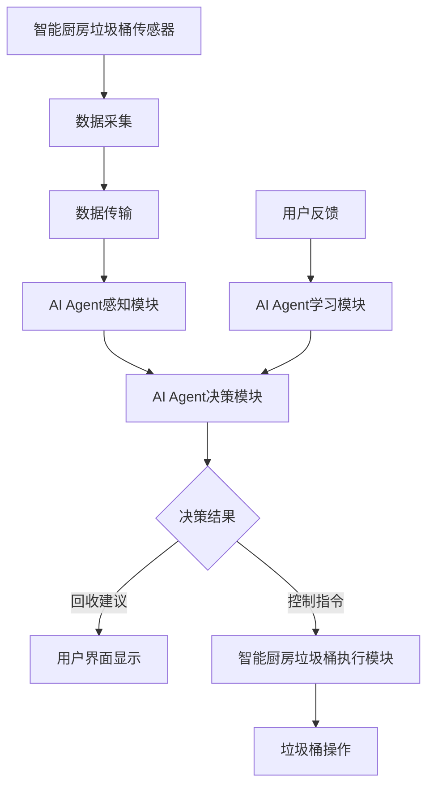

# 智能厨房垃圾桶：AI Agent的废物回收建议

> 关键词：智能厨房垃圾桶、AI Agent、废物回收、人工智能、物联网、垃圾分类、可持续发展

> 摘要：本文围绕智能厨房垃圾桶及AI Agent的废物回收建议展开深入探讨。首先介绍相关背景，包括研究目的、预期读者等内容。接着阐述智能厨房垃圾桶和AI Agent的核心概念与联系，详细讲解核心算法原理及操作步骤，同时给出相关数学模型和公式。通过项目实战，展示代码实现与解读。分析实际应用场景，推荐学习、开发相关的工具和资源。最后总结未来发展趋势与挑战，解答常见问题并提供扩展阅读与参考资料，旨在推动智能厨房垃圾桶和AI Agent在废物回收领域的应用与发展，促进可持续发展。

## 1. 背景介绍 
### 1.1 目的和范围
随着全球人口的增长和生活水平的提高，垃圾产生量日益增加，尤其是厨房垃圾。厨房垃圾成分复杂，若处理不当，不仅会造成环境污染，还会浪费大量资源。智能厨房垃圾桶结合AI Agent技术，旨在实现对厨房垃圾的智能识别、分类和回收建议，提高垃圾处理效率，减少对环境的影响，促进资源的循环利用。

本文章的范围涵盖智能厨房垃圾桶和AI Agent的基本概念、技术原理、实现方法、应用场景以及未来发展趋势等方面，旨在为相关领域的研究人员、开发者和爱好者提供全面的参考资料。

### 1.2 预期读者
本文预期读者包括但不限于以下几类人群：
- **科研人员**：对人工智能、物联网、环境科学等领域的研究人员，希望通过本文了解智能厨房垃圾桶和AI Agent在废物回收领域的最新研究成果和应用案例。
- **开发者**：从事软件开发、硬件设计、嵌入式系统开发等相关工作的开发者，希望获取智能厨房垃圾桶和AI Agent的技术实现细节和开发经验。
- **环保工作者**：关注环境保护和资源回收利用的环保工作者，希望了解智能厨房垃圾桶和AI Agent在废物分类和回收中的作用，为推动环保事业发展提供参考。
- **普通消费者**：对智能家居和环保产品感兴趣的普通消费者，希望通过本文了解智能厨房垃圾桶的功能和优势，为选择合适的产品提供参考。

### 1.3 文档结构概述
本文将按照以下结构进行组织：
1. **背景介绍**：介绍研究目的、预期读者、文档结构概述和术语表。
2. **核心概念与联系**：阐述智能厨房垃圾桶和AI Agent的核心概念、原理和架构，并给出相应的文本示意图和Mermaid流程图。
3. **核心算法原理 & 具体操作步骤**：详细讲解智能厨房垃圾桶和AI Agent所涉及的核心算法原理，并使用Python源代码进行阐述。
4. **数学模型和公式 & 详细讲解 & 举例说明**：给出相关的数学模型和公式，并进行详细讲解和举例说明。
5. **项目实战：代码实际案例和详细解释说明**：通过项目实战，展示智能厨房垃圾桶和AI Agent的代码实现和详细解释。
6. **实际应用场景**：分析智能厨房垃圾桶和AI Agent在实际生活中的应用场景。
7. **工具和资源推荐**：推荐相关的学习资源、开发工具框架和论文著作。
8. **总结：未来发展趋势与挑战**：总结智能厨房垃圾桶和AI Agent的未来发展趋势和面临的挑战。
9. **附录：常见问题与解答**：解答读者在阅读过程中可能遇到的常见问题。
10. **扩展阅读 & 参考资料**：提供相关的扩展阅读材料和参考资料。

### 1.4 术语表
#### 1.4.1 核心术语定义
- **智能厨房垃圾桶**：一种具备智能识别、分类和管理功能的厨房垃圾桶，通常集成了传感器、摄像头、处理器等硬件设备和相关的软件系统。
- **AI Agent**：人工智能代理，是一种能够感知环境、做出决策并采取行动的智能实体，在智能厨房垃圾桶中，AI Agent可以根据垃圾的特征和相关规则，提供废物回收建议。
- **废物回收**：将废弃物品进行收集、分类、处理和再利用的过程，旨在减少资源浪费和环境污染。
- **垃圾分类**：根据垃圾的成分、性质和用途，将垃圾分为不同的类别，以便进行更有效的处理和回收。
- **物联网（IoT）**：通过各种信息传感器、射频识别技术、全球定位系统等各种装置与技术，实时采集任何需要监控、连接、互动的物体或过程，采集其声、光、热、电、力学、化学、生物、位置等各种需要的信息，通过各类可能的网络接入，实现物与物、物与人的泛在连接，实现对物品和过程的智能化感知、识别和管理。

#### 1.4.2 相关概念解释
- **计算机视觉**：是一门研究如何使机器“看”的科学，即给计算机装备类似人类的视觉系统，让计算机能够识别和理解图像或视频中的内容。在智能厨房垃圾桶中，计算机视觉技术可用于识别垃圾的种类和特征。
- **机器学习**：是一门多领域交叉学科，涉及概率论、统计学、逼近论、凸分析、算法复杂度理论等多门学科。它专门研究计算机怎样模拟或实现人类的学习行为，以获取新的知识或技能，重新组织已有的知识结构使之不断改善自身的性能。在智能厨房垃圾桶中，机器学习算法可用于训练AI Agent，提高其垃圾识别和分类的准确性。
- **深度学习**：是机器学习的一个分支领域，它是一种基于对数据进行表征学习的方法。深度学习通过构建具有很多层的神经网络模型，自动从大量数据中学习特征和模式，在图像识别、自然语言处理等领域取得了显著的成果。在智能厨房垃圾桶中，深度学习技术可用于实现更精准的垃圾识别和分类。

#### 1.4.3 缩略词列表
- **AI**：Artificial Intelligence，人工智能
- **IoT**：Internet of Things，物联网
- **CNN**：Convolutional Neural Network，卷积神经网络
- **RNN**：Recurrent Neural Network，循环神经网络
- **API**：Application Programming Interface，应用程序编程接口

## 2. 核心概念与联系 

### 智能厨房垃圾桶的概念与原理
智能厨房垃圾桶是传统垃圾桶的智能化升级产品，它通过集成多种传感器和智能设备，实现对垃圾的自动识别、分类和管理。其基本原理是利用传感器采集垃圾的相关信息，如图像、重量、气味等，然后将这些信息传输到处理器中进行分析和处理，最后根据预设的规则和算法，对垃圾进行分类和处理。

智能厨房垃圾桶的架构主要包括以下几个部分：
- **传感器模块**：负责采集垃圾的各种信息，如摄像头用于采集垃圾的图像，重量传感器用于测量垃圾的重量，气味传感器用于检测垃圾的气味等。
- **处理器模块**：对传感器采集到的信息进行分析和处理，利用人工智能算法对垃圾进行识别和分类，并根据分类结果提供相应的回收建议。
- **通信模块**：负责将智能厨房垃圾桶与其他设备或系统进行通信，如将垃圾信息上传到云端服务器，接收用户的指令等。
- **执行模块**：根据处理器的指令，执行相应的操作，如打开或关闭垃圾桶盖，对垃圾进行压缩等。

### AI Agent的概念与原理
AI Agent是一种能够感知环境、做出决策并采取行动的智能实体。在智能厨房垃圾桶中，AI Agent可以根据垃圾的特征和相关规则，提供废物回收建议。其基本原理是通过学习和推理，对垃圾的种类、成分和处理方式进行判断，并根据用户的需求和环境条件，提供个性化的回收建议。

AI Agent的架构主要包括以下几个部分：
- **感知模块**：负责感知环境中的信息，如垃圾的图像、重量、气味等。
- **决策模块**：根据感知模块采集到的信息，利用人工智能算法进行分析和推理，做出决策。
- **行动模块**：根据决策模块的决策，采取相应的行动，如提供回收建议、控制垃圾桶的操作等。
- **学习模块**：通过不断学习和积累经验，提高AI Agent的性能和智能水平。

### 智能厨房垃圾桶与AI Agent的联系
智能厨房垃圾桶和AI Agent是相辅相成的关系。智能厨房垃圾桶为AI Agent提供了数据来源和应用场景，而AI Agent则为智能厨房垃圾桶提供了智能决策和控制能力。具体来说，智能厨房垃圾桶通过传感器采集垃圾的信息，将这些信息传输给AI Agent，AI Agent利用这些信息进行分析和推理，做出决策，并将决策结果反馈给智能厨房垃圾桶，控制其执行相应的操作。

### 文本示意图
```plaintext
智能厨房垃圾桶
|-- 传感器模块
|   |-- 摄像头
|   |-- 重量传感器
|   |-- 气味传感器
|-- 处理器模块
|   |-- 人工智能算法
|   |   |-- 图像识别
|   |   |-- 机器学习
|   |   |-- 深度学习
|   |-- 决策引擎
|-- 通信模块
|   |-- 无线通信
|   |-- 蓝牙
|   |-- Wi-Fi
|-- 执行模块
|   |-- 垃圾桶盖控制
|   |-- 垃圾压缩装置

AI Agent
|-- 感知模块
|   |-- 接收智能厨房垃圾桶传感器数据
|-- 决策模块
|   |-- 数据分析
|   |-- 推理引擎
|   |-- 规则库
|-- 行动模块
|   |-- 提供回收建议
|   |-- 控制智能厨房垃圾桶操作
|-- 学习模块
|   |-- 机器学习算法
|   |-- 知识更新
```

### Mermaid流程图


## 3. 核心算法原理 & 具体操作步骤 

### 图像识别算法原理
图像识别是智能厨房垃圾桶中最关键的技术之一，它用于识别垃圾的种类和特征。在众多图像识别算法中，卷积神经网络（CNN）是目前应用最广泛、效果最好的算法之一。

#### CNN的基本原理
CNN是一种专门用于处理具有网格结构数据的神经网络，如图像。它通过卷积层、池化层和全连接层等组件，自动从图像中提取特征，并进行分类。

- **卷积层**：卷积层是CNN的核心组件，它通过卷积核在图像上滑动，提取图像的局部特征。卷积核是一个小的矩阵，它与图像的局部区域进行卷积运算，得到特征图。
- **池化层**：池化层用于减少特征图的尺寸，降低计算量，同时增强特征的鲁棒性。常见的池化操作有最大池化和平均池化。
- **全连接层**：全连接层将卷积层和池化层提取的特征进行整合，输出最终的分类结果。

#### Python实现图像识别算法
以下是一个使用Python和Keras库实现简单CNN图像识别的示例代码：
```python
import numpy as np
from keras.models import Sequential
from keras.layers import Conv2D, MaxPooling2D, Flatten, Dense
from keras.preprocessing.image import ImageDataGenerator

# 数据预处理
train_datagen = ImageDataGenerator(rescale=1./255, shear_range=0.2, zoom_range=0.2, horizontal_flip=True)
test_datagen = ImageDataGenerator(rescale=1./255)

train_set = train_datagen.flow_from_directory('train_data_directory', target_size=(150, 150), batch_size=32, class_mode='categorical')
test_set = test_datagen.flow_from_directory('test_data_directory', target_size=(150, 150), batch_size=32, class_mode='categorical')

# 构建CNN模型
model = Sequential()
model.add(Conv2D(32, (3, 3), activation='relu', input_shape=(150, 150, 3)))
model.add(MaxPooling2D(pool_size=(2, 2)))
model.add(Conv2D(64, (3, 3), activation='relu'))
model.add(MaxPooling2D(pool_size=(2, 2)))
model.add(Conv2D(128, (3, 3), activation='relu'))
model.add(MaxPooling2D(pool_size=(2, 2)))
model.add(Flatten())
model.add(Dense(128, activation='relu'))
model.add(Dense(train_set.num_classes, activation='softmax'))

# 编译模型
model.compile(optimizer='adam', loss='categorical_crossentropy', metrics=['accuracy'])

# 训练模型
model.fit_generator(train_set, steps_per_epoch=train_set.samples // train_set.batch_size, epochs=10, validation_data=test_set, validation_steps=test_set.samples // test_set.batch_size)

# 保存模型
model.save('trash_classification_model.h5')
```
### 机器学习算法原理
除了图像识别，机器学习算法还可以用于对垃圾的重量、气味等信息进行分析和处理，以提高垃圾分类的准确性。常见的机器学习算法有决策树、支持向量机、随机森林等。

#### 决策树算法原理
决策树是一种基于树结构进行决策的机器学习算法。它通过对数据的特征进行划分，构建一棵决策树，每个内部节点表示一个特征上的测试，每个分支表示一个测试输出，每个叶节点表示一个类别或值。

#### Python实现决策树算法
以下是一个使用Python和Scikit-learn库实现决策树分类的示例代码：
```python
from sklearn.datasets import load_iris
from sklearn.model_selection import train_test_split
from sklearn.tree import DecisionTreeClassifier
from sklearn.metrics import accuracy_score

# 加载数据集
iris = load_iris()
X = iris.data
y = iris.target

# 划分训练集和测试集
X_train, X_test, y_train, y_test = train_test_split(X, y, test_size=0.2, random_state=42)

# 构建决策树模型
model = DecisionTreeClassifier()

# 训练模型
model.fit(X_train, y_train)

# 预测
y_pred = model.predict(X_test)

# 评估模型
accuracy = accuracy_score(y_test, y_pred)
print(f"Accuracy: {accuracy}")
```

### 具体操作步骤
1. **数据采集**：智能厨房垃圾桶通过传感器采集垃圾的图像、重量、气味等信息。
2. **数据预处理**：对采集到的数据进行预处理，如图像的缩放、归一化，数据的清洗和特征提取等。
3. **模型训练**：使用采集到的数据对图像识别和机器学习模型进行训练，调整模型的参数，提高模型的准确性。
4. **垃圾识别和分类**：将采集到的新数据输入到训练好的模型中，进行垃圾的识别和分类。
5. **回收建议生成**：根据垃圾的分类结果，AI Agent结合相关的规则和知识，生成相应的回收建议。
6. **执行操作**：智能厨房垃圾桶根据AI Agent的指令，执行相应的操作，如打开或关闭垃圾桶盖，对垃圾进行压缩等。

## 4. 数学模型和公式 & 详细讲解 & 举例说明 

### 卷积神经网络的数学模型
#### 卷积运算
卷积运算是CNN的核心运算，它通过卷积核在图像上滑动，计算卷积核与图像局部区域的点积，得到特征图。设输入图像为 $X$，卷积核为 $W$，输出特征图为 $Y$，则卷积运算可以表示为：
$$Y_{i,j} = \sum_{m=0}^{M-1} \sum_{n=0}^{N-1} X_{i+m,j+n} W_{m,n} + b$$
其中，$M$ 和 $N$ 分别是卷积核的高度和宽度，$b$ 是偏置项。

#### 激活函数
激活函数用于引入非线性因素，增加模型的表达能力。常见的激活函数有ReLU（Rectified Linear Unit）函数，其数学表达式为：
$$f(x) = \max(0, x)$$

#### 池化运算
池化运算用于减少特征图的尺寸，降低计算量。常见的池化操作有最大池化，其数学表达式为：
$$Y_{i,j} = \max_{m=0}^{M-1} \max_{n=0}^{N-1} X_{iM+m,jN+n}$$
其中，$M$ 和 $N$ 分别是池化窗口的高度和宽度。

### 决策树的数学模型
#### 信息熵
信息熵是衡量数据不确定性的指标，其数学表达式为：
$$H(X) = -\sum_{i=1}^{n} p(x_i) \log_2 p(x_i)$$
其中，$X$ 是一个离散随机变量，$p(x_i)$ 是 $X$ 取值为 $x_i$ 的概率。

#### 信息增益
信息增益是衡量特征对分类结果影响程度的指标，其数学表达式为：
$$IG(X, A) = H(X) - \sum_{v \in Values(A)} \frac{|S_v|}{|S|} H(S_v)$$
其中，$X$ 是分类目标，$A$ 是特征，$Values(A)$ 是特征 $A$ 的取值集合，$S$ 是数据集，$S_v$ 是特征 $A$ 取值为 $v$ 的子集。

### 举例说明
#### 卷积神经网络举例
假设输入图像是一个 $5 \times 5$ 的矩阵，卷积核是一个 $3 \times 3$ 的矩阵，偏置项 $b = 1$。输入图像和卷积核的值如下：
$$X = \begin{bmatrix}
1 & 2 & 3 & 4 & 5 \\
6 & 7 & 8 & 9 & 10 \\
11 & 12 & 13 & 14 & 15 \\
16 & 17 & 18 & 19 & 20 \\
21 & 22 & 23 & 24 & 25
\end{bmatrix}$$
$$W = \begin{bmatrix}
1 & 0 & 1 \\
0 & 1 & 0 \\
1 & 0 & 1
\end{bmatrix}$$
则卷积运算的结果为：
$$Y_{0,0} = \sum_{m=0}^{2} \sum_{n=0}^{2} X_{m,n} W_{m,n} + b = (1 \times 1 + 2 \times 0 + 3 \times 1 + 6 \times 0 + 7 \times 1 + 8 \times 0 + 11 \times 1 + 12 \times 0 + 13 \times 1) + 1 = 38$$
同理，可以计算出其他位置的 $Y_{i,j}$ 值。

#### 决策树举例
假设有一个数据集，包含两个特征 $A$ 和 $B$，以及一个分类目标 $C$。数据集如下：
| A | B | C |
|---|---|---|
| 0 | 0 | 0 |
| 0 | 1 | 1 |
| 1 | 0 | 1 |
| 1 | 1 | 0 |

首先计算分类目标 $C$ 的信息熵：
$$H(C) = -\left(\frac{2}{4} \log_2 \frac{2}{4} + \frac{2}{4} \log_2 \frac{2}{4}\right) = 1$$
然后计算特征 $A$ 的信息增益：
$$IG(C, A) = H(C) - \left(\frac{2}{4} H(S_{A=0}) + \frac{2}{4} H(S_{A=1})\right)$$
其中，$S_{A=0}$ 是特征 $A$ 取值为 0 的子集，$S_{A=1}$ 是特征 $A$ 取值为 1 的子集。
$$H(S_{A=0}) = -\left(\frac{1}{2} \log_2 \frac{1}{2} + \frac{1}{2} \log_2 \frac{1}{2}\right) = 1$$
$$H(S_{A=1}) = -\left(\frac{1}{2} \log_2 \frac{1}{2} + \frac{1}{2} \log_2 \frac{1}{2}\right) = 1$$
则 $IG(C, A) = 1 - \left(\frac{2}{4} \times 1 + \frac{2}{4} \times 1\right) = 0$
同理，可以计算出特征 $B$ 的信息增益，然后选择信息增益最大的特征作为决策树的根节点。

## 5. 项目实战：代码实际案例和详细解释说明 

### 5.1  开发环境搭建
#### 硬件环境
- **智能厨房垃圾桶硬件**：选择一款合适的智能厨房垃圾桶硬件平台，如基于Arduino或Raspberry Pi的开发板，集成摄像头、重量传感器、气味传感器等传感器设备。
- **计算机**：用于开发和调试代码，建议使用配置较高的计算机，如Intel Core i5及以上处理器，8GB及以上内存。

#### 软件环境
- **操作系统**：推荐使用Windows 10、Ubuntu等操作系统。
- **开发工具**：安装Python开发环境，建议使用Anaconda来管理Python环境和安装相关的库。
- **深度学习框架**：安装Keras、TensorFlow等深度学习框架，用于实现图像识别算法。
- **机器学习库**：安装Scikit-learn等机器学习库，用于实现机器学习算法。

### 5.2  源代码详细实现和代码解读
#### 图像识别部分
```python
import cv2
import numpy as np
from keras.models import load_model

# 加载训练好的模型
model = load_model('trash_classification_model.h5')

# 定义类别标签
class_labels = ['paper', 'plastic', 'glass', 'metal', 'organic']

# 打开摄像头
cap = cv2.VideoCapture(0)

while True:
    ret, frame = cap.read()
    if not ret:
        break
    
    # 预处理图像
    resized_frame = cv2.resize(frame, (150, 150))
    normalized_frame = resized_frame / 255.0
    input_frame = np.expand_dims(normalized_frame, axis=0)
    
    # 预测
    predictions = model.predict(input_frame)
    predicted_class_index = np.argmax(predictions)
    predicted_class_label = class_labels[predicted_class_index]
    
    # 在图像上显示预测结果
    cv2.putText(frame, f"Class: {predicted_class_label}", (10, 30), cv2.FONT_HERSHEY_SIMPLEX, 1, (0, 255, 0), 2)
    cv2.imshow('Trash Classification', frame)
    
    # 按 'q' 键退出
    if cv2.waitKey(1) & 0xFF == ord('q'):
        break

# 释放摄像头并关闭窗口
cap.release()
cv2.destroyAllWindows()
```
**代码解读**：
1. **加载模型**：使用 `load_model` 函数加载训练好的图像分类模型。
2. **定义类别标签**：定义垃圾的类别标签，用于显示预测结果。
3. **打开摄像头**：使用 `cv2.VideoCapture` 函数打开摄像头。
4. **图像预处理**：对摄像头捕获的图像进行缩放和归一化处理，使其符合模型的输入要求。
5. **预测**：使用加载的模型对预处理后的图像进行预测，得到预测结果。
6. **显示预测结果**：在图像上显示预测的类别标签。
7. **退出程序**：按 'q' 键退出程序，释放摄像头并关闭窗口。

#### 机器学习部分
```python
import pandas as pd
from sklearn.model_selection import train_test_split
from sklearn.tree import DecisionTreeClassifier
from sklearn.metrics import accuracy_score

# 加载数据集
data = pd.read_csv('trash_data.csv')

# 划分特征和标签
X = data.drop('class', axis=1)
y = data['class']

# 划分训练集和测试集
X_train, X_test, y_train, y_test = train_test_split(X, y, test_size=0.2, random_state=42)

# 构建决策树模型
model = DecisionTreeClassifier()

# 训练模型
model.fit(X_train, y_train)

# 预测
y_pred = model.predict(X_test)

# 评估模型
accuracy = accuracy_score(y_test, y_pred)
print(f"Accuracy: {accuracy}")
```
**代码解读**：
1. **加载数据集**：使用 `pandas` 库的 `read_csv` 函数加载垃圾数据集。
2. **划分特征和标签**：将数据集划分为特征矩阵 $X$ 和标签向量 $y$。
3. **划分训练集和测试集**：使用 `train_test_split` 函数将数据集划分为训练集和测试集。
4. **构建决策树模型**：使用 `DecisionTreeClassifier` 类构建决策树模型。
5. **训练模型**：使用训练集对决策树模型进行训练。
6. **预测**：使用训练好的模型对测试集进行预测，得到预测结果。
7. **评估模型**：使用 `accuracy_score` 函数计算模型的准确率。

### 5.3  代码解读与分析
#### 图像识别部分分析
- **优点**：使用深度学习模型进行图像识别，可以自动从图像中提取特征，具有较高的准确性和泛化能力。
- **缺点**：深度学习模型的训练需要大量的计算资源和时间，对硬件要求较高。同时，模型的解释性较差，难以理解模型是如何做出决策的。

#### 机器学习部分分析
- **优点**：机器学习算法（如决策树）的计算复杂度较低，训练速度较快，模型的解释性较好，可以直观地理解模型的决策过程。
- **缺点**：机器学习算法需要手动提取特征，对特征工程的要求较高。同时，模型的准确性可能不如深度学习模型。

## 6. 实际应用场景 
### 家庭厨房
在家庭厨房中，智能厨房垃圾桶可以帮助用户实现垃圾的自动分类和回收。用户只需将垃圾放入垃圾桶中，智能厨房垃圾桶就可以自动识别垃圾的种类，并根据分类结果提供相应的回收建议。例如，如果用户放入的是有机垃圾，垃圾桶可以提示用户将其用于堆肥；如果是可回收垃圾，垃圾桶可以提示用户将其送到附近的回收站。

### 餐厅和食堂
在餐厅和食堂中，智能厨房垃圾桶可以提高垃圾处理的效率和准确性。餐厅和食堂每天会产生大量的垃圾，通过使用智能厨房垃圾桶，可以快速准确地对垃圾进行分类，减少人工分类的工作量和误差。同时，智能厨房垃圾桶还可以实时监测垃圾的填充情况，及时提醒工作人员进行清理。

### 学校和办公场所
在学校和办公场所中，智能厨房垃圾桶可以培养人们的环保意识和垃圾分类习惯。通过在垃圾桶上显示垃圾的分类信息和回收建议，可以让人们更加了解垃圾分类的重要性和方法。同时，智能厨房垃圾桶还可以对垃圾的产生量和分类情况进行统计和分析，为学校和办公场所的环保管理提供数据支持。

### 社区和公共场所
在社区和公共场所中，智能厨房垃圾桶可以改善环境卫生状况，提高资源回收利用率。通过在社区和公共场所设置智能厨房垃圾桶，可以方便居民和游客进行垃圾分类，减少垃圾乱扔乱放的现象。同时，智能厨房垃圾桶还可以与社区的垃圾回收系统进行连接，实现垃圾的自动收集和运输，提高垃圾处理的效率。

## 7. 工具和资源推荐
### 7.1 学习资源推荐
#### 7.1.1 书籍推荐
- 《深度学习》（Deep Learning）：由Ian Goodfellow、Yoshua Bengio和Aaron Courville三位深度学习领域的先驱所著，是深度学习领域的经典教材，涵盖了深度学习的基本概念、算法和应用。
- 《Python机器学习》（Python Machine Learning）：由Sebastian Raschka所著，介绍了使用Python进行机器学习的基本方法和技术，包括数据预处理、模型选择、评估和优化等内容。
- 《计算机视觉：算法与应用》（Computer Vision: Algorithms and Applications）：由Richard Szeliski所著，是计算机视觉领域的经典教材，涵盖了计算机视觉的基本概念、算法和应用，包括图像滤波、特征提取、目标检测、图像分割等内容。

#### 7.1.2 在线课程
- Coursera上的《深度学习专项课程》（Deep Learning Specialization）：由Andrew Ng教授授课，包括五门课程，涵盖了深度学习的基本概念、神经网络、卷积神经网络、循环神经网络等内容。
- edX上的《计算机视觉基础》（Foundations of Computer Vision）：由Berkeley大学的Jitendra Malik教授授课，介绍了计算机视觉的基本概念、算法和应用，包括图像滤波、特征提取、目标检测、图像分割等内容。
- Kaggle上的《机器学习微课程》（Machine Learning Micro-Course）：提供了一系列的机器学习微课程，包括数据预处理、模型选择、评估和优化等内容，适合初学者学习。

#### 7.1.3 技术博客和网站
- Medium：是一个技术博客平台，上面有很多关于人工智能、机器学习、计算机视觉等领域的优质文章。
- Towards Data Science：是一个专注于数据科学和人工智能领域的技术博客，上面有很多关于深度学习、机器学习、数据可视化等方面的文章。
- arXiv：是一个预印本数据库，上面有很多关于人工智能、机器学习、计算机视觉等领域的最新研究成果。

### 7.2 开发工具框架推荐
#### 7.2.1 IDE和编辑器
- PyCharm：是一款专门用于Python开发的集成开发环境（IDE），提供了代码编辑、调试、代码分析等功能，适合专业开发者使用。
- Jupyter Notebook：是一个基于Web的交互式计算环境，支持Python、R等多种编程语言，适合数据科学家和研究人员进行数据分析和模型开发。
- Visual Studio Code：是一款轻量级的代码编辑器，支持多种编程语言和插件，具有丰富的扩展功能，适合初学者和快速开发。

#### 7.2.2 调试和性能分析工具
- TensorBoard：是TensorFlow的可视化工具，可以用于可视化模型的训练过程、网络结构、数据分布等信息，帮助开发者调试和优化模型。
- PyTorch Profiler：是PyTorch的性能分析工具，可以用于分析模型的计算时间、内存使用等信息，帮助开发者优化模型的性能。
- cProfile：是Python的内置性能分析工具，可以用于分析Python代码的执行时间和函数调用关系，帮助开发者找出代码中的性能瓶颈。

#### 7.2.3 相关框架和库
- Keras：是一个高级神经网络API，支持多种深度学习框架（如TensorFlow、Theano等），具有简单易用、快速开发的特点，适合初学者和快速原型开发。
- TensorFlow：是一个开源的深度学习框架，由Google开发，具有强大的计算能力和丰富的工具库，适合大规模深度学习模型的开发和训练。
- Scikit-learn：是一个开源的机器学习库，提供了丰富的机器学习算法和工具，包括数据预处理、模型选择、评估和优化等功能，适合机器学习初学者和快速开发。

### 7.3 相关论文著作推荐
#### 7.3.1 经典论文
- LeCun, Y., Bottou, L., Bengio, Y., & Haffner, P. (1998). Gradient-based learning applied to document recognition. Proceedings of the IEEE, 86(11), 2278-2324. （介绍了卷积神经网络的经典论文）
- Breiman, L. (2001). Random forests. Machine learning, 45(1), 5-32. （介绍了随机森林算法的经典论文）
- Cortes, C., & Vapnik, V. (1995). Support-vector networks. Machine learning, 20(3), 273-297. （介绍了支持向量机算法的经典论文）

#### 7.3.2 最新研究成果
- 可以通过arXiv、ACM Digital Library、IEEE Xplore等学术数据库查找关于智能厨房垃圾桶、AI Agent、废物回收等领域的最新研究成果。

#### 7.3.3 应用案例分析
- 可以通过Google Scholar、百度学术等搜索引擎查找关于智能厨房垃圾桶和AI Agent在废物回收领域的应用案例分析，了解实际应用中的经验和教训。

## 8. 总结：未来发展趋势与挑战
### 未来发展趋势
#### 智能化程度不断提高
随着人工智能技术的不断发展，智能厨房垃圾桶和AI Agent的智能化程度将不断提高。未来的智能厨房垃圾桶将能够更加准确地识别垃圾的种类和特征，提供更加个性化的回收建议。同时，AI Agent将能够学习用户的习惯和偏好，自动调整回收策略，提高回收效率。

#### 与物联网的深度融合
智能厨房垃圾桶将与物联网技术深度融合，实现与其他智能家居设备、社区垃圾回收系统等的互联互通。例如，智能厨房垃圾桶可以与智能冰箱连接，根据冰箱内食物的消耗情况，预测垃圾的产生量，并提前做好分类和回收准备。同时，智能厨房垃圾桶还可以将垃圾信息上传到社区垃圾回收系统，实现垃圾的自动收集和运输。

#### 环保意识的普及
随着环保意识的不断普及，人们对智能厨房垃圾桶和废物回收的需求将不断增加。未来，智能厨房垃圾桶将成为家庭和公共场所的标配设备，帮助人们更好地进行垃圾分类和回收，减少对环境的影响。

### 面临的挑战
#### 数据隐私和安全问题
智能厨房垃圾桶和AI Agent需要采集和处理大量的用户数据，如垃圾的图像、重量、气味等信息。这些数据涉及用户的隐私和安全问题，如果泄露或被滥用，将给用户带来严重的损失。因此，如何保障数据的隐私和安全是智能厨房垃圾桶和AI Agent面临的重要挑战之一。

#### 技术成本和可靠性问题
智能厨房垃圾桶和AI Agent的研发和生产成本较高，这限制了其大规模推广和应用。同时，智能厨房垃圾桶和AI Agent的可靠性和稳定性也需要进一步提高，以确保其在实际使用中能够正常工作。

#### 标准和规范的缺失
目前，智能厨房垃圾桶和AI Agent在废物回收领域还缺乏统一的标准和规范，这导致不同厂家生产的产品在功能、性能和接口等方面存在差异，不利于产品的互联互通和互操作性。因此，制定统一的标准和规范是智能厨房垃圾桶和AI Agent发展的迫切需求。

## 9. 附录：常见问题与解答
### 智能厨房垃圾桶的识别准确率有多高？
智能厨房垃圾桶的识别准确率受到多种因素的影响，如传感器的精度、图像识别算法的性能、垃圾的复杂程度等。一般来说，目前的智能厨房垃圾桶在理想情况下的识别准确率可以达到80% - 90%左右，但在实际应用中，由于环境和垃圾的多样性，识别准确率可能会有所下降。

### 智能厨房垃圾桶的使用寿命有多长？
智能厨房垃圾桶的使用寿命取决于多个因素，如硬件质量、使用频率、维护情况等。一般来说，质量较好的智能厨房垃圾桶的使用寿命可以达到3 - 5年左右。

### 智能厨房垃圾桶的价格贵吗？
智能厨房垃圾桶的价格因品牌、功能、性能等因素而异。目前市场上的智能厨房垃圾桶价格从几百元到数千元不等。随着技术的不断发展和成本的降低，智能厨房垃圾桶的价格有望逐渐下降。

### AI Agent的回收建议准确吗？
AI Agent的回收建议是基于其学习和推理能力生成的，其准确性受到数据质量、算法性能等因素的影响。一般来说，经过大量数据训练和优化的AI Agent可以提供较为准确的回收建议，但在某些特殊情况下，可能会存在一定的误差。用户在参考AI Agent的回收建议时，还应结合当地的实际回收政策和要求进行判断。

## 10. 扩展阅读 & 参考资料
### 扩展阅读
- 《智能家居：原理、技术与应用》：介绍了智能家居的基本原理、技术和应用，包括智能厨房设备、智能安防系统等内容。
- 《人工智能：现代方法》（Artificial Intelligence: A Modern Approach）：是人工智能领域的经典教材，涵盖了人工智能的基本概念、算法和应用，包括搜索算法、知识表示、机器学习、自然语言处理等内容。
- 《可持续发展与循环经济》：介绍了可持续发展和循环经济的基本概念、理论和实践，包括资源回收利用、环境保护等内容。

### 参考资料
- 相关的学术论文、研究报告和技术文档。
- 智能厨房垃圾桶和AI Agent相关产品的官方网站和用户手册。
- 政府部门和环保组织发布的垃圾分类和回收政策、标准和指南。