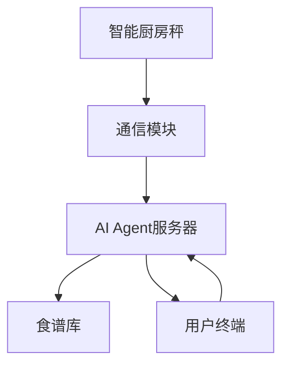

# 智能厨房秤：AI Agent的食谱推荐系统

> 关键词：智能厨房秤、AI Agent、食谱推荐系统、传感器技术、机器学习

> 摘要：本文围绕智能厨房秤与AI Agent的食谱推荐系统展开深入探讨。在厨房智能化的大趋势下，智能厨房秤结合先进的AI Agent技术，能够为用户提供个性化的食谱推荐。文章首先介绍了该系统的背景，包括目的、预期读者、文档结构和相关术语。接着阐述了核心概念与联系，通过文本示意图和Mermaid流程图清晰呈现系统架构。详细讲解了核心算法原理和具体操作步骤，以Python源代码进行说明。还介绍了数学模型和公式，并举例说明。通过项目实战，展示了开发环境搭建、源代码实现和代码解读。分析了实际应用场景，推荐了相关的学习资源、开发工具框架和论文著作。最后总结了未来发展趋势与挑战，提供常见问题解答和扩展阅读参考资料，旨在全面剖析智能厨房秤的AI Agent食谱推荐系统，推动厨房智能化的发展。

## 1. 背景介绍 
### 1.1 目的和范围
在当今数字化和智能化飞速发展的时代，厨房设备也在不断升级。智能厨房秤作为厨房中的新兴设备，其功能已不再局限于简单的称重。本系统的目的是将智能厨房秤与AI Agent技术相结合，开发一个能够根据用户的食材储备、健康状况、口味偏好等因素，为用户提供个性化食谱推荐的系统。

本系统的范围涵盖了从智能厨房秤的数据采集，到AI Agent对数据的处理和分析，再到最终的食谱推荐。同时，还考虑了系统的可扩展性，以便能够不断优化和更新食谱库，适应不同用户的需求。

### 1.2 预期读者
本文的预期读者包括对厨房智能化感兴趣的普通消费者，他们希望了解智能厨房秤的新功能和食谱推荐系统的原理；从事智能设备开发的工程师，他们可以从本文中获取关于智能厨房秤和AI Agent结合的技术实现细节；以及对人工智能在生活领域应用研究的科研人员，他们可以从中获得相关的研究思路和方法。

### 1.3 文档结构概述
本文将按照以下结构进行阐述：首先介绍智能厨房秤和AI Agent食谱推荐系统的背景知识，包括目的、预期读者和相关术语。接着详细讲解核心概念与联系，通过文本示意图和Mermaid流程图展示系统架构。然后介绍核心算法原理和具体操作步骤，用Python源代码进行说明。再介绍数学模型和公式，并举例说明。通过项目实战，展示开发环境搭建、源代码实现和代码解读。分析实际应用场景，推荐相关的学习资源、开发工具框架和论文著作。最后总结未来发展趋势与挑战，提供常见问题解答和扩展阅读参考资料。

### 1.4 术语表
#### 1.4.1 核心术语定义
- **智能厨房秤**：一种具备数据采集和传输功能的厨房秤，能够将称重数据以及其他相关信息（如食材种类、温度等）传输到系统中。
- **AI Agent**：人工智能代理，是一种能够感知环境、进行决策并采取行动的智能实体。在本系统中，AI Agent负责处理智能厨房秤采集的数据，分析用户需求，并生成食谱推荐。
- **食谱推荐系统**：根据用户的相关信息（如食材储备、健康状况、口味偏好等），运用一定的算法和模型，为用户推荐合适食谱的系统。

#### 1.4.2 相关概念解释
- **传感器技术**：智能厨房秤依靠传感器来采集各种数据，如称重传感器用于测量食材的重量，温度传感器用于检测食材的温度等。传感器技术的精度和稳定性直接影响到系统的数据质量。
- **机器学习**：是AI Agent实现智能决策的重要手段。通过对大量数据的学习和分析，机器学习算法可以发现数据中的规律和模式，从而为用户提供更准确的食谱推荐。

#### 1.4.3 缩略词列表
- **AI**：Artificial Intelligence，人工智能
- **ML**：Machine Learning，机器学习

## 2. 核心概念与联系 

### 核心概念原理
智能厨房秤的AI Agent食谱推荐系统主要基于以下几个核心概念：

#### 数据采集
智能厨房秤通过各种传感器采集食材的相关数据，如重量、温度、湿度等。这些数据是系统进行食谱推荐的基础。

#### 数据传输
采集到的数据需要通过一定的通信协议（如蓝牙、Wi-Fi等）传输到AI Agent所在的服务器或终端设备。

#### AI Agent处理
AI Agent接收到数据后，会对其进行处理和分析。首先，会对数据进行清洗和预处理，去除噪声和异常值。然后，运用机器学习算法对数据进行建模和分析，结合用户的健康状况、口味偏好等信息，生成个性化的食谱推荐。

#### 食谱推荐
根据AI Agent的分析结果，系统会从食谱库中筛选出合适的食谱，并推荐给用户。食谱推荐可以基于多种因素，如食材的种类和数量、用户的健康需求、当前的季节等。

### 架构的文本示意图
智能厨房秤的AI Agent食谱推荐系统架构主要包括以下几个部分：

- **智能厨房秤**：负责数据采集和传输，将采集到的食材数据发送到AI Agent。
- **通信模块**：实现智能厨房秤与AI Agent之间的数据传输，如蓝牙模块、Wi-Fi模块等。
- **AI Agent服务器**：接收智能厨房秤传输的数据，进行数据处理和分析，生成食谱推荐。
- **食谱库**：存储大量的食谱信息，包括食材清单、烹饪步骤、营养信息等。
- **用户终端**：如手机APP、智能手表等，用户可以通过终端设备接收食谱推荐，并与系统进行交互。

### Mermaid流程图


## 3. 核心算法原理 & 具体操作步骤 

### 核心算法原理
本系统主要运用了以下几种核心算法：

#### 数据预处理算法
在AI Agent接收到智能厨房秤传输的数据后，需要对其进行预处理。常见的数据预处理算法包括数据清洗、数据归一化、数据特征提取等。以下是一个简单的数据清洗的Python代码示例：

```python
import pandas as pd

# 模拟智能厨房秤采集的数据
data = pd.DataFrame({
    'weight': [100, 200, None, 300],
    'temperature': [25, 26, 27, None]
})

# 清洗缺失值
cleaned_data = data.dropna()

print(cleaned_data)
```

#### 机器学习算法
机器学习算法用于对数据进行建模和分析，以生成食谱推荐。常见的机器学习算法包括决策树、支持向量机、神经网络等。以下是一个简单的决策树算法的Python代码示例：

```python
from sklearn.tree import DecisionTreeClassifier
from sklearn.model_selection import train_test_split
from sklearn.metrics import accuracy_score
import pandas as pd

# 模拟数据集
data = pd.DataFrame({
    'ingredient1': [1, 0, 1, 0],
    'ingredient2': [0, 1, 0, 1],
    'recipe': ['recipe1', 'recipe2', 'recipe1', 'recipe2']
})

X = data[['ingredient1', 'ingredient2']]
y = data['recipe']

# 划分训练集和测试集
X_train, X_test, y_train, y_test = train_test_split(X, y, test_size=0.2, random_state=42)

# 创建决策树分类器
clf = DecisionTreeClassifier()

# 训练模型
clf.fit(X_train, y_train)

# 预测
y_pred = clf.predict(X_test)

# 计算准确率
accuracy = accuracy_score(y_test, y_pred)

print(f"Accuracy: {accuracy}")
```

### 具体操作步骤
1. **数据采集**：智能厨房秤通过传感器采集食材的相关数据。
2. **数据传输**：将采集到的数据通过通信模块传输到AI Agent服务器。
3. **数据预处理**：AI Agent服务器对接收到的数据进行清洗、归一化等预处理操作。
4. **特征提取**：从预处理后的数据中提取有用的特征。
5. **模型训练**：使用机器学习算法对提取的特征进行训练，生成预测模型。
6. **食谱推荐**：根据用户的需求和预测模型，从食谱库中筛选出合适的食谱，并推荐给用户。

## 4. 数学模型和公式 & 详细讲解 & 举例说明 

### 数学模型
本系统中主要涉及到的数学模型包括线性回归模型、逻辑回归模型、决策树模型等。以下以线性回归模型为例进行详细讲解。

线性回归模型的基本形式为：

$$y = \beta_0 + \beta_1x_1 + \beta_2x_2 + \cdots + \beta_nx_n + \epsilon$$

其中，$y$ 是因变量，$x_1, x_2, \cdots, x_n$ 是自变量，$\beta_0, \beta_1, \cdots, \beta_n$ 是模型的参数，$\epsilon$ 是误差项。

### 详细讲解
线性回归模型的目标是找到一组最优的参数 $\beta_0, \beta_1, \cdots, \beta_n$，使得模型的预测值与真实值之间的误差最小。常用的方法是最小二乘法，即最小化误差平方和：

$$\min_{\beta_0, \beta_1, \cdots, \beta_n} \sum_{i=1}^{m} (y_i - \hat{y}_i)^2$$

其中，$m$ 是样本数量，$y_i$ 是第 $i$ 个样本的真实值，$\hat{y}_i$ 是第 $i$ 个样本的预测值。

### 举例说明
假设有一个简单的线性回归问题，我们要根据食材的重量预测食谱的热量。我们有以下数据集：

| 食材重量 (g) | 食谱热量 (cal) |
| --- | --- |
| 100 | 200 |
| 200 | 400 |
| 300 | 600 |

我们可以使用Python的 `scikit-learn` 库来实现线性回归模型：

```python
from sklearn.linear_model import LinearRegression
import numpy as np

# 数据集
X = np.array([[100], [200], [300]])
y = np.array([200, 400, 600])

# 创建线性回归模型
model = LinearRegression()

# 训练模型
model.fit(X, y)

# 预测
new_weight = np.array([[400]])
predicted_calories = model.predict(new_weight)

print(f"Predicted calories for 400g: {predicted_calories[0]}")
```

在这个例子中，我们通过线性回归模型找到了食材重量和食谱热量之间的线性关系，并使用该模型进行了预测。

## 5. 项目实战：代码实际案例和详细解释说明 

### 5.1  开发环境搭建
#### 硬件环境
- **智能厨房秤**：选择一款支持数据传输的智能厨房秤，如具备蓝牙或Wi-Fi功能的厨房秤。
- **服务器**：可以选择云服务器或本地服务器，如阿里云ECS、腾讯云CVM等。
- **开发设备**：如笔记本电脑或台式机，安装Python开发环境。

#### 软件环境
- **操作系统**：可以选择Windows、Linux或macOS。
- **Python环境**：安装Python 3.x版本，并安装相关的库，如 `pandas`、`scikit-learn`、`Flask` 等。
- **数据库**：可以选择MySQL、MongoDB等数据库来存储食谱信息和用户数据。

### 5.2  源代码详细实现和代码解读
以下是一个简单的智能厨房秤的AI Agent食谱推荐系统的Python代码示例：

```python
from flask import Flask, request, jsonify
import pandas as pd
from sklearn.tree import DecisionTreeClassifier
import json

# 初始化Flask应用
app = Flask(__name__)

# 模拟食谱库
recipes = pd.DataFrame({
    'ingredient1': [1, 0, 1, 0],
    'ingredient2': [0, 1, 0, 1],
    'recipe': ['recipe1', 'recipe2', 'recipe1', 'recipe2']
})

# 划分特征和标签
X = recipes[['ingredient1', 'ingredient2']]
y = recipes['recipe']

# 创建决策树分类器
clf = DecisionTreeClassifier()

# 训练模型
clf.fit(X, y)

@app.route('/recommend', methods=['POST'])
def recommend():
    # 获取智能厨房秤传输的数据
    data = request.get_json()
    ingredient1 = data.get('ingredient1', 0)
    ingredient2 = data.get('ingredient2', 0)

    # 进行预测
    input_data = [[ingredient1, ingredient2]]
    prediction = clf.predict(input_data)

    # 返回食谱推荐
    return jsonify({'recipe': prediction[0]})

if __name__ == '__main__':
    app.run(debug=True)
```

### 5.3  代码解读与分析
1. **导入必要的库**：导入 `Flask` 用于创建Web应用，`pandas` 用于数据处理，`DecisionTreeClassifier` 用于创建决策树分类器，`json` 用于处理JSON数据。
2. **初始化Flask应用**：创建一个Flask应用实例。
3. **模拟食谱库**：使用 `pandas` 数据框模拟食谱库，包含食材信息和对应的食谱。
4. **划分特征和标签**：将食谱库中的食材信息作为特征，食谱作为标签。
5. **创建决策树分类器**：使用 `DecisionTreeClassifier` 创建决策树分类器。
6. **训练模型**：使用训练数据对决策树分类器进行训练。
7. **定义API接口**：定义一个 `/recommend` 的POST接口，用于接收智能厨房秤传输的数据，并进行食谱推荐。
8. **获取数据并进行预测**：从请求中获取食材信息，使用训练好的模型进行预测。
9. **返回食谱推荐**：将预测结果以JSON格式返回给客户端。

## 6. 实际应用场景 
### 家庭厨房
在家庭厨房中，智能厨房秤的AI Agent食谱推荐系统可以根据用户现有的食材储备，为用户推荐合适的食谱。例如，当用户准备做饭时，将食材放在智能厨房秤上，系统会自动识别食材，并根据用户的口味偏好和健康状况，推荐相应的食谱。这可以帮助用户充分利用现有的食材，减少食物浪费，同时也能为用户提供更多的烹饪选择。

### 餐厅厨房
在餐厅厨房中，该系统可以帮助厨师更好地管理食材库存，根据食材的剩余量和销售情况，推荐合适的菜品。例如，当某种食材的库存较多时，系统可以推荐以该食材为主料的菜品，以减少食材的积压。同时，系统还可以根据顾客的口味偏好和健康需求，为顾客推荐个性化的菜品。

### 健身和减肥人群
对于健身和减肥人群来说，该系统可以根据他们的营养需求和健身计划，为他们推荐合适的食谱。例如，系统可以根据用户的身体指标（如体重、身高、体脂率等）和健身目标（如增肌、减脂等），推荐低热量、高蛋白的食谱，帮助用户实现健身和减肥的目标。

## 7. 工具和资源推荐
### 7.1 学习资源推荐
#### 7.1.1 书籍推荐
- 《Python机器学习实战》：这本书详细介绍了Python在机器学习领域的应用，包括各种机器学习算法的原理和实现，适合初学者和有一定基础的开发者阅读。
- 《人工智能：一种现代的方法》：这是一本经典的人工智能教材，涵盖了人工智能的各个领域，包括搜索算法、机器学习、自然语言处理等，适合对人工智能有深入研究需求的读者。

#### 7.1.2 在线课程
- Coursera上的《机器学习》课程：由斯坦福大学的Andrew Ng教授授课，是一门非常经典的机器学习课程，讲解了机器学习的基本概念和算法，适合初学者学习。
- edX上的《人工智能基础》课程：该课程介绍了人工智能的基本概念、技术和应用，适合对人工智能感兴趣的读者学习。

#### 7.1.3 技术博客和网站
- Medium：这是一个技术博客平台，上面有很多关于人工智能、机器学习和智能设备开发的文章，读者可以从中获取最新的技术信息和经验分享。
- Towards Data Science：专注于数据科学和机器学习领域的技术博客，提供了很多高质量的技术文章和教程。

### 7.2 开发工具框架推荐
#### 7.2.1 IDE和编辑器
- PyCharm：是一款专业的Python集成开发环境，提供了丰富的功能和插件，适合Python开发者使用。
- Visual Studio Code：是一款轻量级的代码编辑器，支持多种编程语言，并且有丰富的扩展插件，适合快速开发和调试。

#### 7.2.2 调试和性能分析工具
- `pdb`：Python自带的调试工具，可以帮助开发者调试代码，查找问题。
- `cProfile`：Python的性能分析工具，可以分析代码的性能瓶颈，帮助开发者优化代码。

#### 7.2.3 相关框架和库
- `scikit-learn`：是一个强大的机器学习库，提供了各种机器学习算法的实现，方便开发者进行机器学习模型的开发和训练。
- `Flask`：是一个轻量级的Web框架，适合快速开发Web应用，如本系统中的API接口开发。

### 7.3 相关论文著作推荐
#### 7.3.1 经典论文
- 《A Machine Learning Approach to Recipe Recommendation》：该论文介绍了一种基于机器学习的食谱推荐方法，通过对用户的饮食历史和偏好进行分析，生成个性化的食谱推荐。
- 《Intelligent Kitchen Appliances: A Review》：这篇论文对智能厨房设备的发展现状和趋势进行了综述，包括智能厨房秤、智能烤箱等设备的技术原理和应用场景。

#### 7.3.2 最新研究成果
- 可以关注ACM SIGKDD、NeurIPS等顶级学术会议的相关论文，了解智能厨房设备和AI Agent食谱推荐系统的最新研究成果。

#### 7.3.3 应用案例分析
- 可以参考一些知名科技公司的智能厨房产品的应用案例，如小米、美的等公司的智能厨房秤和食谱推荐系统，了解其技术实现和用户体验。

## 8. 总结：未来发展趋势与挑战
### 未来发展趋势
- **智能化程度不断提高**：随着人工智能技术的不断发展，智能厨房秤的AI Agent食谱推荐系统将更加智能化。系统将能够更好地理解用户的需求和偏好，提供更加个性化、精准的食谱推荐。
- **与其他智能设备的集成**：智能厨房秤将与其他智能厨房设备（如智能烤箱、智能冰箱等）进行集成，实现设备之间的互联互通和协同工作。例如，智能厨房秤可以将食材信息传输给智能烤箱，智能烤箱可以根据食材信息自动调整烹饪参数。
- **健康管理功能的增强**：系统将更加注重用户的健康管理，不仅可以根据用户的健康状况推荐合适的食谱，还可以对用户的饮食进行监测和分析，提供健康建议和预警。

### 挑战
- **数据隐私和安全问题**：智能厨房秤会采集用户的食材信息、健康信息等敏感数据，如何保障这些数据的隐私和安全是一个重要的挑战。需要采取有效的数据加密、访问控制等措施，防止数据泄露和滥用。
- **算法的准确性和可靠性**：食谱推荐系统的准确性和可靠性直接影响用户的体验。需要不断优化算法，提高模型的准确性和泛化能力，以应对不同用户的需求和各种复杂的情况。
- **用户接受度**：智能厨房秤的AI Agent食谱推荐系统是一种新兴的技术，用户对其接受度还需要进一步提高。需要加强用户教育和宣传，让用户了解该系统的功能和优势，提高用户的使用意愿。

## 9. 附录：常见问题与解答
### 智能厨房秤的数据传输稳定吗？
智能厨房秤的数据传输稳定性取决于所采用的通信协议和设备质量。一般来说，蓝牙和Wi-Fi等通信协议在正常情况下可以保证数据的稳定传输。但在一些复杂的环境中，如信号干扰较大的地方，可能会出现数据传输不稳定的情况。

### 食谱推荐系统的推荐结果准确吗？
食谱推荐系统的准确性取决于多个因素，如数据的质量、算法的优化程度等。系统会不断学习和优化，以提高推荐结果的准确性。但由于用户的需求和情况较为复杂，推荐结果可能无法完全满足每个用户的期望。

### 如何保障用户数据的安全？
系统会采取多种措施保障用户数据的安全，如数据加密、访问控制、定期备份等。同时，会遵守相关的法律法规和隐私政策，确保用户数据的合法使用和保护。

## 10. 扩展阅读 & 参考资料
- 《智能家居技术与应用》
- 《人工智能算法导论》
- 相关科技公司的官方网站和技术文档
- 学术数据库中的相关研究论文