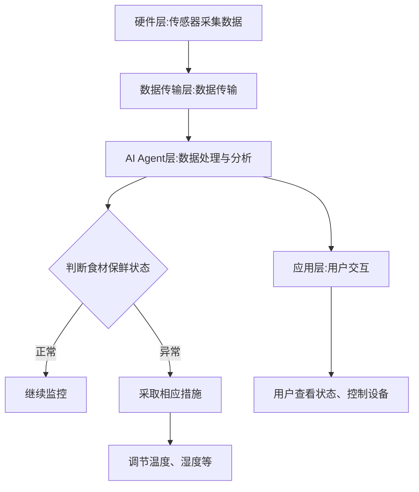

# 智能厨房置物架：AI Agent的食材保鲜监控

> 关键词：智能厨房置物架、AI Agent、食材保鲜监控、传感器技术、物联网

> 摘要：本文围绕智能厨房置物架中AI Agent的食材保鲜监控展开深入探讨。首先介绍了相关背景，包括研究目的、预期读者等。接着阐述了核心概念，如AI Agent、食材保鲜监控原理等，并给出相应的架构示意图和流程图。详细讲解了核心算法原理，用Python代码进行说明，同时介绍了相关数学模型和公式。通过项目实战，展示了代码实现和解读。分析了实际应用场景，推荐了学习资源、开发工具框架以及相关论文著作。最后总结了未来发展趋势与挑战，并提供了常见问题解答和参考资料，旨在为智能厨房领域的研究和应用提供全面的技术指导和参考。

## 1. 背景介绍 
### 1.1 目的和范围
随着人们生活水平的提高，对厨房智能化的需求日益增长。智能厨房置物架作为厨房智能化的一部分，其食材保鲜监控功能具有重要意义。本研究的目的在于利用AI Agent技术实现对食材保鲜状态的精准监控，减少食材浪费，提高厨房管理效率。研究范围涵盖了智能厨房置物架的硬件设计、传感器技术、AI Agent算法、物联网通信以及系统集成等方面。

### 1.2 预期读者
本文预期读者包括智能厨房领域的研究人员、工程师、开发者，以及对智能家居、人工智能感兴趣的技术爱好者和相关专业的学生。

### 1.3 文档结构概述
本文首先介绍背景信息，让读者了解研究的目的和范围。接着阐述核心概念与联系，使读者对智能厨房置物架和AI Agent的食材保鲜监控有清晰的认识。然后详细讲解核心算法原理和具体操作步骤，给出数学模型和公式进行理论支持。通过项目实战展示实际代码案例和详细解释。分析实际应用场景，为读者提供实际应用的思路。推荐相关的工具和资源，帮助读者进一步学习和开发。最后总结未来发展趋势与挑战，解答常见问题并提供参考资料。

### 1.4 术语表
#### 1.4.1 核心术语定义
- **智能厨房置物架**：集成了多种传感器和智能控制模块的厨房置物设备，能够实现对食材的智能管理和监控。
- **AI Agent**：人工智能代理，是一种能够感知环境、做出决策并采取行动的智能实体，在本研究中用于处理食材保鲜监控的数据和做出相应决策。
- **食材保鲜监控**：通过对食材的温度、湿度、气体成分等环境参数进行监测，判断食材的保鲜状态，并采取相应措施延长食材保鲜期的过程。

#### 1.4.2 相关概念解释
- **传感器技术**：用于采集食材所处环境的各种物理和化学参数，如温度传感器、湿度传感器、气体传感器等。
- **物联网（IoT）**：通过各种信息传感器、射频识别技术、全球定位系统等技术，实时采集任何需要监控、连接、互动的物体或过程的各种需要的信息，通过各类可能的网络接入，实现物与物、物与人的泛在连接，实现对物品和过程的智能化感知、识别和管理。
- **数据分析**：对传感器采集到的数据进行处理、分析和挖掘，以提取有价值的信息，用于判断食材的保鲜状态。

#### 1.4.3 缩略词列表
- **IoT**：Internet of Things（物联网）
- **AI**：Artificial Intelligence（人工智能）
- **MEMS**：Micro - Electro - Mechanical Systems（微机电系统）

## 2. 核心概念与联系 

### 核心概念原理
智能厨房置物架的食材保鲜监控系统主要由硬件层、数据传输层、AI Agent层和应用层组成。

- **硬件层**：包括各种传感器，如温度传感器、湿度传感器、气体传感器（如氧气传感器、二氧化碳传感器等），用于实时采集食材周围的环境参数。这些传感器通常基于不同的物理和化学原理工作，例如温度传感器利用热敏电阻的特性来测量温度变化，湿度传感器通过检测电容或电阻的变化来测量湿度。
- **数据传输层**：负责将传感器采集到的数据传输到AI Agent层。常见的数据传输方式包括有线传输（如以太网）和无线传输（如Wi - Fi、蓝牙、ZigBee等）。无线传输方式具有安装方便、灵活性高的优点，适用于智能厨房置物架的应用场景。
- **AI Agent层**：是整个系统的核心，它接收来自数据传输层的数据，对数据进行处理和分析。AI Agent通过机器学习算法（如决策树、神经网络等）建立食材保鲜状态的预测模型，根据传感器数据判断食材的保鲜状态，并做出相应的决策，如调节置物架内的温度、湿度或通风等。
- **应用层**：为用户提供交互界面，用户可以通过手机应用、平板电脑或智能音箱等设备查看食材的保鲜状态、接收提醒信息，并对智能厨房置物架进行远程控制。

### 架构的文本示意图
```plaintext
+---------------------+
|      应用层         |
|  用户交互界面       |
|  手机应用、平板等   |
+---------------------+
|      AI Agent层     |
|  数据处理与分析     |
|  机器学习模型       |
|  决策制定           |
+---------------------+
|      数据传输层     |
|  有线/无线传输      |
|  Wi - Fi、蓝牙等     |
+---------------------+
|      硬件层         |
|  温度传感器         |
|  湿度传感器         |
|  气体传感器         |
+---------------------+
```

### Mermaid流程图


## 3. 核心算法原理 & 具体操作步骤 

### 核心算法原理
在智能厨房置物架的食材保鲜监控中，我们可以使用决策树算法来判断食材的保鲜状态。决策树是一种基于树结构进行决策的机器学习算法，它通过对数据集的学习，构建一个树形结构，每个内部节点是一个属性上的测试，每个分支是一个测试输出，每个叶节点是一个类别或值。

决策树的构建过程主要包括以下几个步骤：
1. **特征选择**：从传感器采集的多个特征（如温度、湿度、氧气含量等）中选择一个最优的特征作为当前节点的划分依据。常用的特征选择方法有信息增益、信息增益率、基尼指数等。
2. **划分数据集**：根据选择的特征对数据集进行划分，将数据集分为不同的子集。
3. **递归构建决策树**：对每个子集重复步骤1和步骤2，直到满足停止条件（如子集中的样本属于同一类别、特征集为空等）。

### 具体操作步骤
以下是使用Python实现决策树算法进行食材保鲜状态判断的代码示例：

```python
import numpy as np
from sklearn.tree import DecisionTreeClassifier
from sklearn.model_selection import train_test_split
from sklearn.metrics import accuracy_score

# 生成示例数据
# 假设我们有三个特征：温度、湿度、氧气含量
# 标签：0表示保鲜状态正常，1表示保鲜状态异常
X = np.array([[20, 60, 21], [25, 70, 20], [15, 50, 22], [30, 80, 19]])
y = np.array([0, 1, 0, 1])

# 划分训练集和测试集
X_train, X_test, y_train, y_test = train_test_split(X, y, test_size=0.2, random_state=42)

# 创建决策树分类器
clf = DecisionTreeClassifier()

# 训练模型
clf.fit(X_train, y_train)

# 预测
y_pred = clf.predict(X_test)

# 计算准确率
accuracy = accuracy_score(y_test, y_pred)
print(f"Accuracy: {accuracy}")
```

### 代码解释
1. **数据生成**：使用`np.array`生成示例数据`X`和标签`y`，其中`X`包含温度、湿度、氧气含量三个特征，`y`表示食材的保鲜状态。
2. **数据划分**：使用`train_test_split`函数将数据集划分为训练集和测试集，测试集占比为20%。
3. **模型创建**：使用`DecisionTreeClassifier`创建决策树分类器。
4. **模型训练**：使用`fit`方法对模型进行训练。
5. **预测**：使用`predict`方法对测试集进行预测。
6. **准确率计算**：使用`accuracy_score`函数计算预测结果的准确率。

## 4. 数学模型和公式 & 详细讲解 & 举例说明 

### 信息增益
信息增益是决策树中常用的特征选择方法，它衡量了使用某个特征划分数据集前后信息熵的变化。信息熵是对数据集不确定性的度量，数据集的信息熵越大，说明数据集的不确定性越高。

信息熵的计算公式为：
$$H(D)=-\sum_{k = 1}^{K}p_{k}\log_{2}p_{k}$$
其中，$D$ 表示数据集，$K$ 表示数据集 $D$ 中类别的数量，$p_{k}$ 表示第 $k$ 类样本在数据集 $D$ 中所占的比例。

信息增益的计算公式为：
$$Gain(D, A)=H(D)-\sum_{v = 1}^{V}\frac{|D^{v}|}{|D|}H(D^{v})$$
其中，$A$ 表示特征，$V$ 表示特征 $A$ 的取值数量，$D^{v}$ 表示特征 $A$ 取值为 $v$ 的样本子集，$|D|$ 和 $|D^{v}|$ 分别表示数据集 $D$ 和子集 $D^{v}$ 的样本数量。

### 详细讲解
信息增益的计算过程如下：
1. 计算数据集 $D$ 的信息熵 $H(D)$。
2. 对于每个特征 $A$，计算使用特征 $A$ 划分数据集后各子集的信息熵 $H(D^{v})$。
3. 计算特征 $A$ 的信息增益 $Gain(D, A)$。
4. 选择信息增益最大的特征作为当前节点的划分依据。

### 举例说明
假设我们有一个数据集 $D$ 包含 10 个样本，分为两个类别：正类和负类，其中正类样本有 6 个，负类样本有 4 个。则数据集 $D$ 的信息熵为：
$$H(D)=-\frac{6}{10}\log_{2}\frac{6}{10}-\frac{4}{10}\log_{2}\frac{4}{10}\approx 0.971$$

假设我们有一个特征 $A$，它有两个取值：$A_1$ 和 $A_2$，其中取值为 $A_1$ 的样本有 4 个，正类样本有 3 个，负类样本有 1 个；取值为 $A_2$ 的样本有 6 个，正类样本有 3 个，负类样本有 3 个。则特征 $A$ 划分后的子集信息熵为：
$$H(D^{A_1})=-\frac{3}{4}\log_{2}\frac{3}{4}-\frac{1}{4}\log_{2}\frac{1}{4}\approx 0.811$$
$$H(D^{A_2})=-\frac{3}{6}\log_{2}\frac{3}{6}-\frac{3}{6}\log_{2}\frac{3}{6}=1$$

特征 $A$ 的信息增益为：
$$Gain(D, A)=0.971-\frac{4}{10}\times 0.811-\frac{6}{10}\times 1\approx 0.135$$

## 5. 项目实战：代码实际案例和详细解释说明 

### 5.1  开发环境搭建
1. **硬件设备**：
    - 智能厨房置物架原型，集成温度传感器（如DHT11）、湿度传感器（如DHT11）、气体传感器（如MQ - 135）。
    - 微控制器（如Arduino Uno），用于采集传感器数据。
    - 无线模块（如ESP8266），用于数据传输。
2. **软件环境**：
    - Arduino IDE：用于编写和上传代码到微控制器。
    - Python环境：用于运行AI Agent算法和数据处理。推荐使用Anaconda来管理Python环境。
    - 相关Python库：`numpy`、`pandas`、`scikit - learn`等，可以使用`pip`或`conda`进行安装。

### 5.2  源代码详细实现和代码解读

#### Arduino代码（采集传感器数据并发送）
```cpp
#include <DHT.h>
#include <ESP8266WiFi.h>
#include <PubSubClient.h>

#define DHTPIN 2
#define DHTTYPE DHT11

DHT dht(DHTPIN, DHTTYPE);

const char* ssid = "your_SSID";
const char* password = "your_PASSWORD";
const char* mqtt_server = "your_MQTT_SERVER";

WiFiClient espClient;
PubSubClient client(espClient);

void setup() {
  Serial.begin(9600);
  dht.begin();
  
  WiFi.begin(ssid, password);
  while (WiFi.status() != WL_CONNECTED) {
    delay(500);
    Serial.print(".");
  }
  Serial.println("");
  Serial.println("WiFi connected");
  
  client.setServer(mqtt_server, 1883);
}

void loop() {
  if (!client.connected()) {
    reconnect();
  }
  client.loop();
  
  float h = dht.readHumidity();
  float t = dht.readTemperature();
  
  if (isnan(h) || isnan(t)) {
    Serial.println("Failed to read from DHT sensor!");
    return;
  }
  
  char msg[50];
  snprintf(msg, 50, "%.2f,%.2f", t, h);
  client.publish("sensors/data", msg);
  
  delay(5000);
}

void reconnect() {
  while (!client.connected()) {
    Serial.print("Attempting MQTT connection...");
    if (client.connect("arduinoClient")) {
      Serial.println("connected");
    } else {
      Serial.print("failed, rc=");
      Serial.print(client.state());
      Serial.println(" try again in 5 seconds");
      delay(5000);
    }
  }
}
```

#### 代码解读
- **传感器初始化**：使用`DHT`库初始化温度和湿度传感器。
- **WiFi连接**：连接到指定的WiFi网络。
- **MQTT连接**：使用`PubSubClient`库连接到MQTT服务器。
- **数据采集与发送**：在`loop`函数中，读取温度和湿度数据，并将其转换为字符串格式，通过MQTT协议发布到指定的主题。

#### Python代码（接收数据并进行分析）
```python
import paho.mqtt.client as mqtt
import numpy as np
from sklearn.tree import DecisionTreeClassifier

# 加载训练好的模型
clf = DecisionTreeClassifier()
# 这里需要根据实际情况加载训练数据并训练模型
# X_train, y_train = ...
# clf.fit(X_train, y_train)

def on_connect(client, userdata, flags, rc):
    print("Connected with result code "+str(rc))
    client.subscribe("sensors/data")

def on_message(client, userdata, msg):
    data = msg.payload.decode().split(',')
    temperature = float(data[0])
    humidity = float(data[1])
    # 假设还有氧气含量数据，这里暂时用一个固定值代替
    oxygen = 21
    X = np.array([[temperature, humidity, oxygen]])
    prediction = clf.predict(X)
    if prediction[0] == 0:
        print("食材保鲜状态正常")
    else:
        print("食材保鲜状态异常")

client = mqtt.Client()
client.on_connect = on_connect
client.on_message = on_message

client.connect("your_MQTT_SERVER", 1883, 60)
client.loop_forever()
```

#### 代码解读
- **模型加载**：加载训练好的决策树分类器。
- **MQTT连接**：使用`paho - mqtt`库连接到MQTT服务器，并订阅传感器数据主题。
- **数据处理与预测**：在`on_message`回调函数中，接收传感器数据，将其转换为特征向量，使用训练好的模型进行预测，并输出预测结果。

### 5.3  代码解读与分析
- **硬件与软件的协同工作**：Arduino负责采集传感器数据，并通过MQTT协议将数据发送到服务器。Python程序作为AI Agent，接收数据并进行分析和预测。
- **数据的实时性**：通过MQTT协议实现了数据的实时传输，确保AI Agent能够及时获取传感器数据。
- **模型的可扩展性**：可以根据实际需求，使用更复杂的机器学习算法（如神经网络）或更多的特征来提高预测的准确性。

## 6. 实际应用场景 
1. **家庭厨房**：智能厨房置物架可以帮助用户实时了解食材的保鲜状态，及时提醒用户处理即将过期的食材，减少食材浪费。用户可以通过手机应用查看食材信息，合理安排饮食计划。
2. **餐厅厨房**：餐厅厨房通常需要处理大量的食材，智能厨房置物架可以帮助厨师更好地管理食材库存，确保食材的新鲜度和安全性。同时，还可以提高厨房的工作效率，减少成本。
3. **食品加工企业**：在食品加工企业的仓库中，智能厨房置物架可以对食材的存储环境进行实时监控，确保食材在加工前保持良好的品质。这有助于提高产品质量，减少因食材变质而导致的损失。

## 7. 工具和资源推荐
### 7.1 学习资源推荐
#### 7.1.1 书籍推荐
- 《Python机器学习》：详细介绍了Python在机器学习领域的应用，包括各种机器学习算法的原理和实现。
- 《传感器技术与应用》：全面介绍了传感器的原理、分类和应用，对于理解智能厨房置物架中的传感器技术有很大帮助。
- 《物联网：技术、应用与创新》：深入探讨了物联网的技术体系、应用场景和发展趋势，有助于了解智能厨房置物架与物联网的结合。

#### 7.1.2 在线课程
- Coursera上的“机器学习”课程：由斯坦福大学教授Andrew Ng主讲，是机器学习领域的经典课程，涵盖了机器学习的基本概念、算法和应用。
- edX上的“物联网基础”课程：介绍了物联网的基本原理、技术和应用，适合初学者学习。
- 中国大学MOOC上的“传感器原理与应用”课程：系统讲解了传感器的原理、设计和应用，对于学习智能厨房置物架中的传感器技术很有帮助。

#### 7.1.3 技术博客和网站
- Medium：有很多关于人工智能、物联网和智能家居的技术文章和案例分享。
- Hackster.io：提供了大量的硬件项目和开源代码，对于智能厨房置物架的开发有一定的参考价值。
- 电子发烧友网：专注于电子技术领域，有很多关于传感器、微控制器等硬件的技术文章和论坛。

### 7.2 开发工具框架推荐
#### 7.2.1 IDE和编辑器
- Arduino IDE：专门用于Arduino开发的集成开发环境，简单易用，适合初学者。
- PyCharm：功能强大的Python集成开发环境，提供代码编辑、调试、版本控制等功能，适合Python开发。
- Visual Studio Code：轻量级的代码编辑器，支持多种编程语言，有丰富的插件生态系统，可以满足不同的开发需求。

#### 7.2.2 调试和性能分析工具
- Serial Monitor：Arduino IDE自带的串口监视器，用于调试Arduino代码，查看传感器数据和设备状态。
- Wireshark：网络协议分析工具，可以用于分析MQTT协议的通信过程，排查网络故障。
- Profiler：Python的性能分析工具，如`cProfile`，可以帮助开发者找出代码中的性能瓶颈。

#### 7.2.3 相关框架和库
- scikit - learn：Python的机器学习库，提供了丰富的机器学习算法和工具，方便进行模型训练和预测。
- TensorFlow：开源的机器学习框架，适合开发复杂的深度学习模型。
- Paho MQTT：用于Python和其他编程语言的MQTT客户端库，方便实现MQTT协议的通信。

### 7.3 相关论文著作推荐
#### 7.3.1 经典论文
- “A Survey on Internet of Things (IoT) Security: Applications, Challenges, and Solutions”：全面介绍了物联网安全的应用、挑战和解决方案，对于智能厨房置物架的安全设计有重要参考价值。
- “Machine Learning for Sensor Data Analysis: A Review”：综述了机器学习在传感器数据分析中的应用，为智能厨房置物架的数据分析提供了理论支持。

#### 7.3.2 最新研究成果
- 关注ACM、IEEE等学术会议和期刊上的最新研究成果，了解智能厨房、物联网和人工智能领域的前沿技术。

#### 7.3.3 应用案例分析
- 参考一些实际的智能厨房项目案例，了解他们的设计思路、技术实现和应用效果，为自己的项目提供借鉴。

## 8. 总结：未来发展趋势与挑战
### 未来发展趋势
1. **智能化程度不断提高**：随着人工智能技术的不断发展，智能厨房置物架将具备更强大的数据分析和决策能力，能够根据用户的饮食习惯和食材使用情况进行个性化的管理和推荐。
2. **与其他智能家居设备的集成**：智能厨房置物架将与智能冰箱、智能炉灶、智能洗碗机等其他智能家居设备实现更紧密的集成，形成一个完整的智能厨房生态系统，为用户提供更加便捷和高效的厨房体验。
3. **健康与营养管理**：智能厨房置物架将不仅仅关注食材的保鲜状态，还将结合营养信息和健康数据，为用户提供个性化的饮食建议和健康管理方案。

### 挑战
1. **数据安全与隐私保护**：智能厨房置物架需要采集和处理大量的用户数据，如食材信息、用户饮食习惯等，如何确保这些数据的安全和隐私是一个重要的挑战。
2. **传感器精度和可靠性**：传感器的精度和可靠性直接影响到食材保鲜监控的准确性和稳定性，需要不断提高传感器的性能和质量。
3. **标准与规范的缺失**：目前智能厨房领域还缺乏统一的标准和规范，这给产品的开发、测试和互操作性带来了一定的困难。

## 9. 附录：常见问题与解答
1. **问**：智能厨房置物架的传感器数据准确吗？
**答**：传感器的准确性取决于传感器的质量和性能。一般来说，选择质量可靠的传感器，并进行定期校准，可以保证数据的准确性。

2. **问**：如何保证智能厨房置物架的数据安全？
**答**：可以采用加密技术对数据进行加密传输和存储，同时设置访问权限和身份验证机制，确保只有授权用户能够访问数据。

3. **问**：智能厨房置物架可以与哪些智能家居设备集成？
**答**：智能厨房置物架可以与智能冰箱、智能炉灶、智能洗碗机等其他智能家居设备集成，通过物联网协议实现数据共享和协同工作。

4. **问**：如果传感器出现故障怎么办？
**答**：智能厨房置物架可以设置故障检测和报警机制，当传感器出现故障时，及时提醒用户进行维修或更换。

## 10. 扩展阅读 & 参考资料
1. 《智能家居系统设计与实现》
2. “The Internet of Things: A Survey” by Atzori, L., Iera, A., & Morabito, G.
3. Arduino官方文档：https://www.arduino.cc/
4. scikit - learn官方文档：https://scikit - learn.org/
5. Paho MQTT官方文档：https://www.eclipse.org/paho/