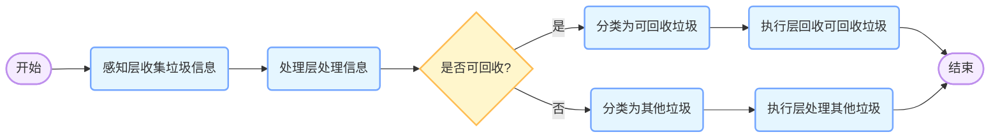

# 智能垃圾处理：AI Agent的分类与回收系统

> 关键词：智能垃圾处理、AI Agent、垃圾分类、回收系统、人工智能、计算机视觉、机器人技术

> 摘要：本文围绕智能垃圾处理中AI Agent的分类与回收系统展开深入探讨。首先介绍了智能垃圾处理的背景和重要性，明确了文章的目的、范围、预期读者等内容。接着详细阐述了AI Agent相关的核心概念及其联系，包括其原理和架构。深入分析了核心算法原理，并结合Python源代码进行具体操作步骤的讲解。给出了相关的数学模型和公式，并举例说明。通过项目实战展示了代码实际案例及详细解释。探讨了该系统在实际中的应用场景，推荐了学习该领域知识的工具和资源。最后对未来发展趋势与挑战进行总结，并提供常见问题解答和扩展阅读参考资料，旨在全面深入地介绍智能垃圾处理中AI Agent的分类与回收系统。

## 1. 背景介绍 
### 1.1 目的和范围
随着全球人口的增长和消费的增加，垃圾产生量急剧上升，传统的垃圾处理方式已难以满足需求，且对环境造成了严重的影响。智能垃圾处理作为一种新兴的解决方案，旨在提高垃圾处理的效率和准确性，减少对环境的污染。本文的目的是详细介绍基于AI Agent的智能垃圾处理分类与回收系统，探讨其技术原理、实现方法和应用场景。范围涵盖了从核心概念的阐述到实际项目的实现，以及相关工具和资源的推荐等方面。

### 1.2 预期读者
本文预期读者包括对人工智能、机器人技术、环境科学等领域感兴趣的研究人员、工程师、学生以及关注智能垃圾处理的相关从业者。希望通过本文的介绍，能让读者对智能垃圾处理中AI Agent的分类与回收系统有更深入的了解，为他们在相关领域的研究、开发和实践提供参考。

### 1.3 文档结构概述
本文共分为十个部分。第一部分为背景介绍，包括目的和范围、预期读者、文档结构概述和术语表。第二部分阐述核心概念与联系，给出核心概念原理和架构的文本示意图及Mermaid流程图。第三部分讲解核心算法原理并给出具体操作步骤，使用Python源代码详细阐述。第四部分介绍数学模型和公式，并进行详细讲解和举例说明。第五部分是项目实战，包括开发环境搭建、源代码详细实现和代码解读。第六部分探讨实际应用场景。第七部分推荐工具和资源，包括学习资源、开发工具框架和相关论文著作。第八部分总结未来发展趋势与挑战。第九部分为附录，提供常见问题与解答。第十部分为扩展阅读与参考资料。

### 1.4 术语表
#### 1.4.1 核心术语定义
- **AI Agent（人工智能代理）**：能够感知环境、进行决策并采取行动以实现特定目标的智能实体。在智能垃圾处理中，AI Agent可以通过各种传感器感知垃圾的特征，运用算法进行分类决策，并控制执行机构进行垃圾的回收操作。
- **垃圾分类**：将垃圾按照不同的属性、成分、用途等进行区分和归类的过程，常见的分类包括可回收物、有害垃圾、厨余垃圾和其他垃圾等。
- **回收系统**：用于收集、运输、处理和再利用垃圾的一系列设施和流程的组合。智能回收系统借助AI Agent等技术提高回收效率和准确性。

#### 1.4.2 相关概念解释
- **计算机视觉**：让计算机能够“看”和理解图像或视频内容的技术。在智能垃圾处理中，计算机视觉技术可用于识别垃圾的种类、形状、颜色等特征，为垃圾分类提供依据。
- **机器人技术**：涉及机器人的设计、制造、控制和应用的技术领域。在智能垃圾处理中，机器人可作为AI Agent的执行机构，完成垃圾的抓取、搬运等操作。

#### 1.4.3 缩略词列表
- **AI**：Artificial Intelligence，人工智能
- **CNN**：Convolutional Neural Network，卷积神经网络
- **RGB**：Red Green Blue，红绿蓝，用于表示颜色空间

## 2. 核心概念与联系 
### 核心概念原理
智能垃圾处理中AI Agent的分类与回收系统主要基于计算机视觉和机器人技术。其核心原理是通过传感器（如摄像头、激光雷达等）获取垃圾的图像、位置等信息，利用计算机视觉算法对垃圾进行分类识别，然后AI Agent根据分类结果做出决策，控制机器人执行相应的回收操作。

### 架构的文本示意图
该系统主要由以下几个部分组成：
1. **感知层**：包括各种传感器，如摄像头、激光雷达、重量传感器等，用于收集垃圾的图像、位置、重量等信息。
2. **处理层**：对感知层收集到的信息进行处理和分析，主要运用计算机视觉算法进行垃圾分类识别，以及AI Agent进行决策。
3. **执行层**：由机器人等执行机构组成，根据处理层的决策结果，完成垃圾的抓取、搬运、投放等操作。
4. **通信层**：负责各层之间的数据传输和通信，确保系统的协调运行。

### Mermaid流程图


## 3. 核心算法原理 & 具体操作步骤 
### 核心算法原理
在智能垃圾处理的分类与回收系统中，核心算法主要包括计算机视觉中的图像分类算法和AI Agent的决策算法。这里以卷积神经网络（CNN）为例介绍图像分类算法。

卷积神经网络是一种专门用于处理具有网格结构数据（如图像）的深度学习模型。它通过卷积层提取图像的特征，池化层对特征进行降维，全连接层进行分类决策。

### 具体操作步骤及Python源代码
以下是一个使用Python和PyTorch库实现简单CNN图像分类的示例代码：

```python
import torch
import torch.nn as nn
import torch.optim as optim
from torchvision import datasets, transforms
from torch.utils.data import DataLoader

# 定义数据预处理
transform = transforms.Compose([
    transforms.Resize((32, 32)),
    transforms.ToTensor(),
    transforms.Normalize((0.5,), (0.5,))
])

# 加载数据集
train_dataset = datasets.MNIST(root='./data', train=True, transform=transform, download=True)
test_dataset = datasets.MNIST(root='./data', train=False, transform=transform)

train_loader = DataLoader(train_dataset, batch_size=64, shuffle=True)
test_loader = DataLoader(test_dataset, batch_size=64, shuffle=False)

# 定义CNN模型
class SimpleCNN(nn.Module):
    def __init__(self):
        super(SimpleCNN, self).__init__()
        self.conv1 = nn.Conv2d(1, 16, kernel_size=3, padding=1)
        self.relu1 = nn.ReLU()
        self.pool1 = nn.MaxPool2d(kernel_size=2)
        self.conv2 = nn.Conv2d(16, 32, kernel_size=3, padding=1)
        self.relu2 = nn.ReLU()
        self.pool2 = nn.MaxPool2d(kernel_size=2)
        self.fc1 = nn.Linear(32 * 8 * 8, 128)
        self.relu3 = nn.ReLU()
        self.fc2 = nn.Linear(128, 10)

    def forward(self, x):
        x = self.pool1(self.relu1(self.conv1(x)))
        x = self.pool2(self.relu2(self.conv2(x)))
        x = x.view(-1, 32 * 8 * 8)
        x = self.relu3(self.fc1(x))
        x = self.fc2(x)
        return x

# 初始化模型、损失函数和优化器
model = SimpleCNN()
criterion = nn.CrossEntropyLoss()
optimizer = optim.Adam(model.parameters(), lr=0.001)

# 训练模型
num_epochs = 10
for epoch in range(num_epochs):
    running_loss = 0.0
    for i, (images, labels) in enumerate(train_loader):
        optimizer.zero_grad()
        outputs = model(images)
        loss = criterion(outputs, labels)
        loss.backward()
        optimizer.step()
        running_loss += loss.item()
    print(f'Epoch {epoch + 1}, Loss: {running_loss / len(train_loader)}')

# 测试模型
correct = 0
total = 0
with torch.no_grad():
    for images, labels in test_loader:
        outputs = model(images)
        _, predicted = torch.max(outputs.data, 1)
        total += labels.size(0)
        correct += (predicted == labels).sum().item()

print(f'Accuracy on test set: {100 * correct / total}%')
```

### 代码解释
1. **数据预处理**：使用`transforms.Compose`定义了一系列的数据预处理操作，包括图像的缩放、转换为张量和归一化。
2. **数据集加载**：使用`torchvision.datasets.MNIST`加载MNIST手写数字数据集，并使用`DataLoader`进行批量加载。
3. **模型定义**：定义了一个简单的CNN模型，包含两个卷积层、两个池化层和两个全连接层。
4. **训练模型**：使用交叉熵损失函数和Adam优化器进行模型训练，迭代多个epoch。
5. **测试模型**：在测试集上评估模型的准确率。

## 4. 数学模型和公式 & 详细讲解 & 举例说明 
### 卷积操作
卷积操作是CNN的核心操作之一。设输入图像为 $X$，卷积核为 $W$，输出特征图为 $Y$，则卷积操作可以表示为：

$$ Y_{i,j} = \sum_{m=0}^{M-1} \sum_{n=0}^{N-1} X_{i+m,j+n} W_{m,n} + b $$

其中，$M$ 和 $N$ 是卷积核的大小，$b$ 是偏置项。

### 举例说明
假设输入图像 $X$ 是一个 $3\times3$ 的矩阵：

$$ X = \begin{bmatrix}
1 & 2 & 3 \\
4 & 5 & 6 \\
7 & 8 & 9
\end{bmatrix} $$

卷积核 $W$ 是一个 $2\times2$ 的矩阵：

$$ W = \begin{bmatrix}
1 & 0 \\
0 & 1
\end{bmatrix} $$

偏置项 $b = 0$。

则卷积操作的计算过程如下：

对于输出特征图的第一个元素 $Y_{0,0}$：

$$ Y_{0,0} = X_{0,0} W_{0,0} + X_{0,1} W_{0,1} + X_{1,0} W_{1,0} + X_{1,1} W_{1,1} = 1\times1 + 2\times0 + 4\times0 + 5\times1 = 6 $$

同理，可以计算出其他元素的值。

### 池化操作
池化操作主要用于对特征图进行降维，常见的池化操作有最大池化和平均池化。以最大池化为例，设输入特征图为 $X$，池化窗口大小为 $k\times k$，输出特征图为 $Y$，则最大池化操作可以表示为：

$$ Y_{i,j} = \max_{m=0}^{k-1} \max_{n=0}^{k-1} X_{i\times s + m,j\times s + n} $$

其中，$s$ 是步长。

### 举例说明
假设输入特征图 $X$ 是一个 $4\times4$ 的矩阵：

$$ X = \begin{bmatrix}
1 & 2 & 3 & 4 \\
5 & 6 & 7 & 8 \\
9 & 10 & 11 & 12 \\
13 & 14 & 15 & 16
\end{bmatrix} $$

池化窗口大小为 $2\times2$，步长 $s = 2$。

则最大池化操作的计算过程如下：

$$ Y = \begin{bmatrix}
\max(1, 2, 5, 6) & \max(3, 4, 7, 8) \\
\max(9, 10, 13, 14) & \max(11, 12, 15, 16)
\end{bmatrix} = \begin{bmatrix}
6 & 8 \\
14 & 16
\end{bmatrix} $$

### 全连接层
全连接层将卷积层和池化层提取的特征进行整合，用于分类决策。设输入向量为 $x$，权重矩阵为 $W$，偏置向量为 $b$，输出向量为 $y$，则全连接层的计算可以表示为：

$$ y = Wx + b $$

### 举例说明
假设输入向量 $x$ 是一个 $3$ 维向量：

$$ x = \begin{bmatrix}
1 \\
2 \\
3
\end{bmatrix} $$

权重矩阵 $W$ 是一个 $2\times3$ 的矩阵：

$$ W = \begin{bmatrix}
1 & 2 & 3 \\
4 & 5 & 6
\end{bmatrix} $$

偏置向量 $b$ 是一个 $2$ 维向量：

$$ b = \begin{bmatrix}
1 \\
2
\end{bmatrix} $$

则全连接层的计算过程如下：

$$ y = Wx + b = \begin{bmatrix}
1\times1 + 2\times2 + 3\times3 \\
4\times1 + 5\times2 + 6\times3
\end{bmatrix} + \begin{bmatrix}
1 \\
2
\end{bmatrix} = \begin{bmatrix}
14 \\
36
\end{bmatrix} $$

## 5. 项目实战：代码实际案例和详细解释说明 
### 5.1  开发环境搭建
#### 硬件环境
- **计算机**：建议使用性能较好的台式机或笔记本电脑，具备足够的内存和计算能力。
- **摄像头**：用于采集垃圾的图像信息，可选择普通的USB摄像头或工业级摄像头。
- **机器人**：作为执行机构，可选择机械臂或移动机器人，根据具体需求进行选型。

#### 软件环境
- **操作系统**：推荐使用Ubuntu Linux系统，其对深度学习和机器人开发有较好的支持。
- **编程语言**：Python，因其丰富的库和易用性，是开发智能垃圾处理系统的首选语言。
- **深度学习框架**：PyTorch或TensorFlow，用于实现卷积神经网络等深度学习模型。
- **机器人开发框架**：ROS（Robot Operating System），提供了机器人开发所需的工具和库。

### 5.2  源代码详细实现和代码解读
以下是一个简单的智能垃圾处理系统的Python代码示例，结合了计算机视觉和机器人控制：

```python
import cv2
import torch
import torchvision.transforms as transforms
from torchvision.models import resnet18
import rospy
from std_msgs.msg import String

# 加载预训练的ResNet18模型
model = resnet18(pretrained=True)
num_ftrs = model.fc.in_features
model.fc = torch.nn.Linear(num_ftrs, 4)  # 假设分为4类垃圾
model.load_state_dict(torch.load('model.pth'))
model.eval()

# 定义数据预处理
transform = transforms.Compose([
    transforms.ToPILImage(),
    transforms.Resize((224, 224)),
    transforms.ToTensor(),
    transforms.Normalize(mean=[0.485, 0.456, 0.406], std=[0.229, 0.224, 0.225])
])

# 初始化ROS节点
rospy.init_node('garbage_classification_node', anonymous=True)
pub = rospy.Publisher('garbage_class', String, queue_size=10)

# 打开摄像头
cap = cv2.VideoCapture(0)

while not rospy.is_shutdown():
    ret, frame = cap.read()
    if not ret:
        continue

    # 预处理图像
    img = transform(frame).unsqueeze(0)

    # 进行分类预测
    with torch.no_grad():
        outputs = model(img)
        _, predicted = torch.max(outputs.data, 1)
        class_names = ['可回收物', '有害垃圾', '厨余垃圾', '其他垃圾']
        garbage_class = class_names[predicted.item()]

    # 发布分类结果
    pub.publish(garbage_class)

    # 显示图像和分类结果
    cv2.putText(frame, garbage_class, (10, 30), cv2.FONT_HERSHEY_SIMPLEX, 1, (0, 255, 0), 2)
    cv2.imshow('Garbage Classification', frame)

    if cv2.waitKey(1) & 0xFF == ord('q'):
        break

# 释放资源
cap.release()
cv2.destroyAllWindows()
```

### 5.3  代码解读与分析
1. **模型加载**：使用预训练的ResNet18模型，并修改最后一层全连接层的输出维度为4，以适应4类垃圾的分类任务。加载训练好的模型参数并将模型设置为评估模式。
2. **数据预处理**：定义了一系列的数据预处理操作，包括将图像转换为PIL图像、缩放、转换为张量和归一化。
3. **ROS节点初始化**：使用ROS初始化一个节点，并创建一个发布者，用于发布垃圾分类结果。
4. **摄像头图像采集**：使用OpenCV打开摄像头，循环采集图像。
5. **分类预测**：对采集到的图像进行预处理，然后输入到模型中进行分类预测，获取预测结果。
6. **结果发布和显示**：将分类结果通过ROS发布，并在图像上显示分类结果。
7. **资源释放**：在程序结束时，释放摄像头资源并关闭所有窗口。

## 6. 实际应用场景 
### 家庭场景
在家庭中，智能垃圾处理系统可以安装在厨房或客厅等区域。通过摄像头识别垃圾的种类，自动将垃圾分类投放至相应的垃圾桶中。例如，当用户将一个塑料瓶放入系统中时，系统能够快速识别并将其分类为可回收物，然后将其投放至可回收物垃圾桶中，方便用户进行垃圾分类，提高生活的便利性。

### 公共场所场景
在商场、学校、公园等公共场所，智能垃圾处理系统可以放置在垃圾收集点。大量的垃圾可以通过系统快速、准确地分类，提高垃圾处理的效率。同时，系统可以实时监测垃圾的填充情况，及时通知相关人员进行清理，保持公共场所的整洁。

### 工业场景
在工业生产中，会产生大量的废弃物。智能垃圾处理系统可以对这些废弃物进行分类回收，提取有价值的材料进行再利用，降低生产成本，减少对环境的污染。例如，在电子制造行业，系统可以识别废旧电子产品中的可回收部件，进行回收再利用。

## 7. 工具和资源推荐
### 7.1 学习资源推荐
#### 7.1.1 书籍推荐
- 《深度学习》（Deep Learning）：由Ian Goodfellow、Yoshua Bengio和Aaron Courville合著，是深度学习领域的经典教材，全面介绍了深度学习的理论和方法。
- 《Python机器学习》（Python Machine Learning）：作者Sebastian Raschka，详细介绍了使用Python进行机器学习的方法和实践，包括各种机器学习算法和深度学习框架的应用。
- 《机器人学导论》（Introduction to Robotics: Mechanics and Control）：由John J. Craig编写，是机器人学领域的经典教材，介绍了机器人的运动学、动力学、控制等基础知识。

#### 7.1.2 在线课程
- Coursera上的“深度学习专项课程”（Deep Learning Specialization）：由Andrew Ng教授授课，涵盖了深度学习的各个方面，包括神经网络、卷积神经网络、循环神经网络等。
- edX上的“机器人学基础”（Fundamentals of Robotics）：介绍了机器人学的基本概念、运动学、动力学和控制等内容。
- Udemy上的“计算机视觉实战课程”（Computer Vision A-Z™: Hands-On Computer Vision with Python）：通过实际项目介绍计算机视觉的应用和实现方法。

#### 7.1.3 技术博客和网站
- Medium：有许多关于人工智能、机器人技术和计算机视觉的优秀博客文章，作者来自不同的领域和背景，可以获取到最新的技术动态和实践经验。
- arXiv：提供了大量的学术论文，涵盖了人工智能、机器人学等领域的最新研究成果。
- OpenAI官方博客：发布了OpenAI在人工智能领域的最新研究和进展，对于了解前沿技术有很大的帮助。

### 7.2 开发工具框架推荐
#### 7.2.1 IDE和编辑器
- PyCharm：是一款专门为Python开发设计的集成开发环境，具有丰富的功能和插件，方便代码的编写、调试和管理。
- Visual Studio Code：轻量级的代码编辑器，支持多种编程语言和插件，具有良好的扩展性和用户体验。
- Jupyter Notebook：交互式的开发环境，适合进行数据分析、模型训练和实验验证，方便代码的展示和分享。

#### 7.2.2 调试和性能分析工具
- TensorBoard：是TensorFlow提供的可视化工具，可用于可视化模型的训练过程、损失函数变化、准确率等指标，帮助用户分析模型的性能。
- PyTorch Profiler：PyTorch提供的性能分析工具，可用于分析模型的计算瓶颈、内存使用情况等，优化模型的性能。
- OpenCV调试工具：OpenCV提供了一些调试工具和函数，如`cv2.imshow`、`cv2.waitKey`等，可用于调试计算机视觉算法。

#### 7.2.3 相关框架和库
- PyTorch：深度学习框架，具有动态图和静态图的优点，易于使用和调试，广泛应用于计算机视觉、自然语言处理等领域。
- TensorFlow：另一个流行的深度学习框架，具有强大的分布式训练和部署能力，适用于大规模的深度学习应用。
- OpenCV：计算机视觉库，提供了丰富的图像处理和计算机视觉算法，如图像滤波、特征提取、目标检测等。
- ROS：机器人开发框架，提供了机器人开发所需的工具和库，如传感器驱动、运动控制、导航等。

### 7.3 相关论文著作推荐
#### 7.3.1 经典论文
- “ImageNet Classification with Deep Convolutional Neural Networks”：由Alex Krizhevsky、Ilya Sutskever和Geoffrey E. Hinton发表，介绍了AlexNet卷积神经网络，开创了深度学习在计算机视觉领域的应用先河。
- “Faster R-CNN: Towards Real-Time Object Detection with Region Proposal Networks”：由Shaoqing Ren、Kaiming He、Ross Girshick和Jian Sun发表，提出了Faster R-CNN目标检测算法，提高了目标检测的速度和准确性。
- “A Unified Approach to Motion and Vision-Based Control of Manipulators: The Operational Space Formulation”：由Oussama Khatib发表，提出了操作空间公式，为机器人的运动控制提供了一种统一的方法。

#### 7.3.2 最新研究成果
- 关注ICRA（International Conference on Robotics and Automation）、CVPR（Computer Vision and Pattern Recognition）、NeurIPS（Neural Information Processing Systems）等学术会议的最新论文，了解智能垃圾处理、人工智能、机器人技术等领域的最新研究进展。
- 查阅相关学术期刊，如《Journal of Artificial Intelligence Research》、《IEEE Transactions on Robotics》、《International Journal of Computer Vision》等，获取高质量的研究论文。

#### 7.3.3 应用案例分析
- 研究一些实际的智能垃圾处理项目案例，了解其系统架构、算法实现、应用效果等方面的经验。可以通过相关的技术报告、学术论文和项目文档获取这些案例信息。
- 分析一些大型企业和研究机构在智能垃圾处理领域的实践经验，如谷歌、微软、斯坦福大学等的相关项目，学习其先进的技术和方法。

## 8. 总结：未来发展趋势与挑战
### 未来发展趋势
- **智能化程度不断提高**：随着人工智能技术的不断发展，AI Agent在智能垃圾处理中的智能化程度将不断提高。例如，AI Agent将能够更好地理解复杂环境和垃圾的特征，提高垃圾分类的准确性和效率。
- **多传感器融合**：未来的智能垃圾处理系统将采用多传感器融合技术，结合摄像头、激光雷达、重量传感器等多种传感器的信息，更全面地感知垃圾的特征和环境信息，提高系统的可靠性和适应性。
- **机器人协作**：多个机器人之间的协作将成为未来智能垃圾处理的发展趋势。例如，多个机器人可以协同完成垃圾的分类、搬运和回收任务，提高工作效率。
- **与物联网的结合**：智能垃圾处理系统将与物联网技术相结合，实现垃圾处理设备的远程监控和管理。例如，通过物联网技术可以实时监测垃圾桶的填充情况，及时安排清理工作。

### 挑战
- **数据质量和标注问题**：深度学习模型的训练需要大量高质量的数据，而垃圾图像数据的收集和标注存在一定的困难。例如，垃圾的种类繁多、形态各异，标注工作需要专业的知识和大量的时间。
- **复杂环境适应性**：智能垃圾处理系统需要在复杂的环境中工作，如光照变化、遮挡、噪声等，这对系统的环境适应性提出了很高的要求。如何提高系统在复杂环境下的性能是一个亟待解决的问题。
- **机器人的安全性和可靠性**：机器人作为智能垃圾处理系统的执行机构，其安全性和可靠性至关重要。在实际应用中，机器人可能会遇到各种故障和意外情况，如何确保机器人的安全运行是一个挑战。
- **社会接受度**：智能垃圾处理系统的推广和应用需要得到社会的接受和认可。一些人可能对新技术存在疑虑和担忧，如机器人的使用是否会导致失业等问题，需要加强宣传和教育，提高社会的接受度。

## 9. 附录：常见问题与解答
### 1. 智能垃圾处理系统的分类准确率能达到多少？
智能垃圾处理系统的分类准确率受到多种因素的影响，如数据集的质量、模型的复杂度、环境条件等。一般来说，在理想的环境条件下，基于深度学习的分类准确率可以达到90%以上，但在实际应用中，由于环境的复杂性，准确率可能会有所下降。

### 2. 智能垃圾处理系统的成本高吗？
智能垃圾处理系统的成本包括硬件成本和软件成本。硬件成本主要包括摄像头、机器人、传感器等设备的采购和安装费用，软件成本主要包括深度学习模型的训练和开发费用。总体来说，智能垃圾处理系统的成本相对较高，但随着技术的发展和规模的扩大，成本有望逐渐降低。

### 3. 智能垃圾处理系统可以处理所有类型的垃圾吗？
目前的智能垃圾处理系统还不能处理所有类型的垃圾。一些特殊的垃圾，如放射性垃圾、危险化学品等，需要特殊的处理方法和设备。智能垃圾处理系统主要适用于常见的可回收物、有害垃圾、厨余垃圾和其他垃圾的分类和回收。

### 4. 智能垃圾处理系统的维护难度大吗？
智能垃圾处理系统的维护难度主要取决于系统的复杂度和硬件设备的质量。一般来说，系统需要定期进行软件更新和硬件维护，以确保系统的正常运行。对于一些复杂的硬件设备，如机器人，可能需要专业的技术人员进行维护和维修。

## 10. 扩展阅读 & 参考资料
### 扩展阅读
- 《人工智能简史》：了解人工智能的发展历程和重要事件，有助于更好地理解智能垃圾处理中AI Agent的应用背景。
- 《机器人时代》：探讨机器人技术对社会和人类生活的影响，思考智能垃圾处理系统在未来社会中的发展前景。
- 《环境科学概论》：学习环境科学的基础知识，了解垃圾处理对环境的影响和重要性。

### 参考资料
- 相关学术论文和研究报告，如ICRA、CVPR、NeurIPS等学术会议的论文，以及《Journal of Artificial Intelligence Research》、《IEEE Transactions on Robotics》等学术期刊的文章。
- 开源代码库，如GitHub上的相关项目，可参考其代码实现和技术细节。
- 官方文档和技术手册，如PyTorch、TensorFlow、OpenCV、ROS等框架和库的官方文档，可获取详细的使用说明和示例代码。