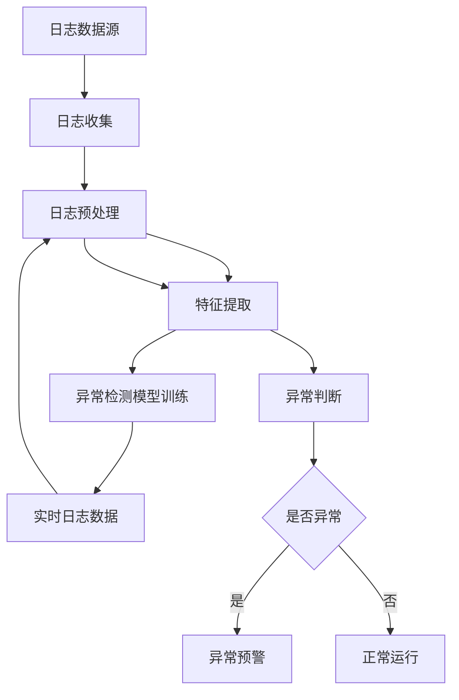

# 智能日志异常模式识别:提前预警潜在问题

> 关键词：智能日志、异常模式识别、潜在问题预警、机器学习、数据分析

> 摘要：在当今复杂的信息技术环境中，系统产生的日志数据量日益庞大。智能日志异常模式识别作为一种关键技术，能够从海量日志数据中精准发现异常模式，进而提前预警潜在问题，这对于保障系统的稳定运行、提高安全性具有重要意义。本文深入探讨智能日志异常模式识别的相关技术，包括核心概念、算法原理、数学模型等，并结合实际案例展示其应用，最后对未来发展趋势与挑战进行总结，为相关领域的研究和实践提供全面的参考。

## 1. 背景介绍 
### 1.1 目的和范围
在现代的信息系统中，日志是系统运行状态的重要记录，包含了系统各个组件的活动信息。智能日志异常模式识别的目的在于通过对日志数据的分析，自动识别出与正常模式不同的异常情况，从而在潜在问题引发严重后果之前发出预警。本文章的范围涵盖了智能日志异常模式识别的基本概念、相关算法、数学模型、实际应用以及未来发展趋势等方面。

### 1.2 预期读者
本文预期读者包括从事日志分析、系统监控、网络安全等领域的专业技术人员，对人工智能、机器学习在日志处理中应用感兴趣的研究人员，以及希望通过日志数据提升系统稳定性和安全性的企业管理人员。

### 1.3 文档结构概述
本文首先介绍智能日志异常模式识别的背景信息，包括目的、预期读者和文档结构。接着阐述核心概念与联系，通过文本示意图和 Mermaid 流程图展示其原理和架构。然后详细讲解核心算法原理和具体操作步骤，并给出 Python 源代码示例。随后介绍数学模型和公式，结合具体例子进行说明。之后通过项目实战展示代码的实际应用和详细解释。再探讨实际应用场景，推荐相关的工具和资源。最后总结未来发展趋势与挑战，提供常见问题与解答以及扩展阅读和参考资料。

### 1.4 术语表
#### 1.4.1 核心术语定义
- **智能日志**：经过智能化处理，便于计算机进行分析和理解的日志数据，通常包含结构化和非结构化信息。
- **异常模式识别**：从数据中发现与正常模式显著不同的模式的过程。
- **潜在问题**：尚未引发明显故障，但可能在未来导致系统性能下降、安全漏洞等问题的隐患。
- **预警**：在潜在问题发生之前发出提示信息，以便及时采取措施。

#### 1.4.2 相关概念解释
- **日志数据**：系统在运行过程中产生的记录，包括事件发生的时间、地点、操作类型等信息。
- **正常模式**：在系统正常运行时，日志数据呈现出的典型模式和规律。
- **异常模式**：与正常模式偏离较大的日志模式，可能预示着系统存在问题。

#### 1.4.3 缩略词列表
- **ML**：Machine Learning，机器学习
- **AI**：Artificial Intelligence，人工智能
- **KPI**：Key Performance Indicator，关键绩效指标

## 2. 核心概念与联系 
智能日志异常模式识别的核心在于通过对日志数据的分析，找出其中的异常模式，从而提前预警潜在问题。其基本原理是先建立正常模式的模型，然后将实时日志数据与该模型进行比较，若偏差超过一定阈值，则判定为异常。

### 文本示意图
智能日志异常模式识别系统主要由日志收集、日志预处理、特征提取、异常检测模型训练和异常预警等模块组成。日志数据从各个数据源收集而来，经过预处理后提取出有用的特征，然后利用这些特征训练异常检测模型。在实时监测阶段，新的日志数据同样经过预处理和特征提取，输入到训练好的模型中进行判断，若发现异常则发出预警。

### Mermaid 流程图


## 3. 核心算法原理 & 具体操作步骤 
### 算法原理
智能日志异常模式识别常用的算法包括基于机器学习的算法，如聚类算法、分类算法等，以及基于深度学习的算法，如神经网络。这里以基于聚类的算法为例进行讲解。

聚类算法的基本思想是将日志数据划分成不同的簇，每个簇代表一种相似的模式。在训练阶段，通过对正常日志数据进行聚类，得到正常模式的簇。在检测阶段，将新的日志数据与这些簇进行比较，若该数据点与所有簇的距离都超过一定阈值，则判定为异常。

### Python 源代码示例
```python
import numpy as np
from sklearn.cluster import KMeans
from sklearn.metrics import pairwise_distances

# 生成示例日志数据
np.random.seed(42)
normal_logs = np.random.randn(100, 5)  # 100 条正常日志，每条日志有 5 个特征

# 训练聚类模型
kmeans = KMeans(n_clusters=3)
kmeans.fit(normal_logs)

# 计算每个簇的中心点
centroids = kmeans.cluster_centers_

# 定义异常阈值
threshold = 3

# 模拟新的日志数据
new_log = np.random.randn(1, 5)

# 计算新日志到每个簇中心点的距离
distances = pairwise_distances(new_log, centroids)

# 找出最小距离
min_distance = np.min(distances)

# 判断是否异常
if min_distance > threshold:
    print("异常日志")
else:
    print("正常日志")
```

### 具体操作步骤
1. **数据收集**：从各个数据源收集日志数据。
2. **数据预处理**：对日志数据进行清洗、转换等操作，使其适合后续分析。
3. **特征提取**：从预处理后的日志数据中提取有用的特征。
4. **模型训练**：使用正常日志数据训练聚类模型。
5. **异常检测**：将新的日志数据输入到训练好的模型中，计算其到各个簇中心点的距离。
6. **异常判断**：根据设定的阈值判断新日志是否异常。
7. **异常预警**：若判定为异常，则发出预警信息。

## 4. 数学模型和公式 & 详细讲解 & 举例说明 
### 数学模型
在基于聚类的异常模式识别中，主要涉及到距离度量和聚类算法的优化。常用的距离度量方法是欧几里得距离，其公式为：

$$d(x, y) = \sqrt{\sum_{i=1}^{n}(x_i - y_i)^2}$$

其中 $x$ 和 $y$ 是两个 $n$ 维向量，$x_i$ 和 $y_i$ 分别是它们的第 $i$ 个分量。

聚类算法的目标是最小化簇内误差平方和（Within-Cluster Sum of Squares，WCSS），其公式为：

$$WCSS = \sum_{j=1}^{k}\sum_{x\in C_j}d(x, \mu_j)^2$$

其中 $k$ 是簇的数量，$C_j$ 是第 $j$ 个簇，$\mu_j$ 是第 $j$ 个簇的中心点，$x$ 是簇内的一个数据点。

### 详细讲解
欧几里得距离用于衡量两个数据点之间的相似度，距离越小表示越相似。在异常检测中，通过计算新日志数据到各个簇中心点的欧几里得距离，来判断其是否属于某个簇。

簇内误差平方和是聚类算法的优化目标，通过不断调整簇的划分，使得每个簇内的数据点到其中心点的距离平方和最小，从而得到最优的聚类结果。

### 举例说明
假设有三个数据点 $x = [1, 2]$，$y = [3, 4]$，$z = [5, 6]$。计算 $x$ 和 $y$ 之间的欧几里得距离：

$$d(x, y) = \sqrt{(1 - 3)^2 + (2 - 4)^2} = \sqrt{(-2)^2 + (-2)^2} = \sqrt{4 + 4} = \sqrt{8} \approx 2.83$$

假设有两个簇 $C_1 = \{x, y\}$，$C_2 = \{z\}$，簇 $C_1$ 的中心点 $\mu_1 = [(1 + 3)/2, (2 + 4)/2] = [2, 3]$，簇 $C_2$ 的中心点 $\mu_2 = [5, 6]$。计算簇 $C_1$ 的簇内误差平方和：

$$WCSS_{C_1} = d(x, \mu_1)^2 + d(y, \mu_1)^2 = \sqrt{(1 - 2)^2 + (2 - 3)^2}^2 + \sqrt{(3 - 2)^2 + (4 - 3)^2}^2 = 1 + 1 = 2$$

## 5. 项目实战：代码实际案例和详细解释说明 
### 5.1  开发环境搭建
- **操作系统**：Windows 10 或 Linux（如 Ubuntu）
- **Python 版本**：Python 3.7 及以上
- **安装依赖库**：使用以下命令安装所需的库
```bash
pip install numpy scikit-learn
```

### 5.2  源代码详细实现和代码解读
```python
import numpy as np
from sklearn.cluster import KMeans
from sklearn.metrics import pairwise_distances

# 生成示例日志数据
np.random.seed(42)
normal_logs = np.random.randn(100, 5)  # 100 条正常日志，每条日志有 5 个特征

# 训练聚类模型
kmeans = KMeans(n_clusters=3)
kmeans.fit(normal_logs)

# 计算每个簇的中心点
centroids = kmeans.cluster_centers_

# 定义异常阈值
threshold = 3

# 模拟新的日志数据
new_log = np.random.randn(1, 5)

# 计算新日志到每个簇中心点的距离
distances = pairwise_distances(new_log, centroids)

# 找出最小距离
min_distance = np.min(distances)

# 判断是否异常
if min_distance > threshold:
    print("异常日志")
else:
    print("正常日志")
```

### 代码解读与分析
1. **数据生成**：使用 `np.random.randn` 生成 100 条正常日志数据，每条日志有 5 个特征。
2. **模型训练**：使用 `KMeans` 算法对正常日志数据进行聚类，设置簇的数量为 3。
3. **计算中心点**：通过 `kmeans.cluster_centers_` 获取每个簇的中心点。
4. **定义阈值**：设置异常阈值为 3。
5. **模拟新日志**：使用 `np.random.randn` 生成一条新的日志数据。
6. **计算距离**：使用 `pairwise_distances` 计算新日志到每个簇中心点的距离。
7. **异常判断**：找出最小距离，若该距离大于阈值，则判定为异常日志。

## 6. 实际应用场景 
### 系统监控与故障预警
在大型信息系统中，通过对系统日志的实时分析，及时发现异常模式，提前预警潜在的系统故障，避免系统崩溃和数据丢失。例如，在服务器日志中，若发现某个进程的 CPU 使用率异常升高，可能预示着该进程存在性能问题或受到攻击，及时发出预警可以采取相应的措施进行处理。

### 网络安全检测
网络日志包含了大量的网络活动信息，通过智能日志异常模式识别，可以检测到网络中的异常行为，如黑客入侵、恶意软件攻击等。例如，若发现某个 IP 地址频繁发起异常的网络请求，可能是黑客在进行端口扫描或暴力破解，及时发现并阻止可以保护网络安全。

### 业务流程优化
在企业的业务系统中，日志记录了业务流程的执行情况。通过分析日志中的异常模式，可以发现业务流程中存在的问题，如流程瓶颈、数据错误等，从而对业务流程进行优化，提高业务效率和质量。

## 7. 工具和资源推荐
### 7.1 学习资源推荐
#### 7.1.1 书籍推荐
- 《机器学习》（周志华）：全面介绍了机器学习的基本概念、算法和应用，对于理解智能日志异常模式识别的相关算法有很大帮助。
- 《Python 机器学习》（Sebastian Raschka）：以 Python 为工具，详细讲解了机器学习的实现方法，包含大量的代码示例。

#### 7.1.2 在线课程
- Coursera 上的《机器学习》课程（Andrew Ng 主讲）：经典的机器学习课程，深入浅出地讲解了机器学习的基本原理和算法。
- 中国大学 MOOC 上的《人工智能》课程：系统介绍了人工智能的各个领域，包括机器学习、深度学习等。

#### 7.1.3 技术博客和网站
- 博客园：有很多关于机器学习、数据分析的技术文章，涵盖了智能日志异常模式识别的相关内容。
- 开源中国：提供了丰富的开源项目和技术资源，对于学习和实践智能日志异常模式识别有很大帮助。

### 7.2 开发工具框架推荐
#### 7.2.1 IDE和编辑器
- PyCharm：功能强大的 Python 集成开发环境，提供了代码编辑、调试、版本控制等功能。
- Visual Studio Code：轻量级的代码编辑器，支持多种编程语言，有丰富的插件可以扩展功能。

#### 7.2.2 调试和性能分析工具
- pdb：Python 自带的调试工具，可以方便地进行代码调试。
- cProfile：Python 内置的性能分析工具，用于分析代码的运行时间和性能瓶颈。

#### 7.2.3 相关框架和库
- scikit-learn：Python 中常用的机器学习库，提供了丰富的机器学习算法和工具。
- TensorFlow：开源的深度学习框架，可用于构建和训练深度学习模型。

### 7.3 相关论文著作推荐
#### 7.3.1 经典论文
- “Anomaly Detection in Log Data using Machine Learning Techniques”：介绍了使用机器学习技术进行日志异常检测的方法和思路。
- “DeepLog: Anomaly Detection and Diagnosis from System Logs through Deep Learning”：提出了基于深度学习的日志异常检测方法 DeepLog。

#### 7.3.2 最新研究成果
- 关注顶级学术会议如 KDD（Knowledge Discovery and Data Mining）、ICML（International Conference on Machine Learning）上的相关研究成果，了解智能日志异常模式识别的最新进展。

#### 7.3.3 应用案例分析
- 一些企业和研究机构会发布智能日志异常模式识别的应用案例，通过分析这些案例可以学习到实际应用中的经验和技巧。

## 8. 总结：未来发展趋势与挑战
### 未来发展趋势
- **深度学习的广泛应用**：深度学习在处理复杂的日志数据和挖掘潜在模式方面具有很大优势，未来将在智能日志异常模式识别中得到更广泛的应用。
- **实时性和准确性的提升**：随着技术的不断发展，智能日志异常模式识别系统将能够更快速、准确地发现异常模式，提前预警潜在问题。
- **与其他技术的融合**：智能日志异常模式识别将与大数据、云计算、物联网等技术深度融合，实现更全面、更智能的系统监控和管理。

### 挑战
- **数据质量和多样性**：日志数据的质量和多样性对异常模式识别的效果有很大影响，如何处理噪声数据、缺失数据和不同来源的数据是一个挑战。
- **模型的可解释性**：深度学习模型往往是黑盒模型，其决策过程难以解释，如何提高模型的可解释性，让用户更好地理解异常检测的结果是一个重要问题。
- **计算资源的需求**：处理大规模的日志数据需要大量的计算资源，如何在有限的计算资源下实现高效的异常模式识别是一个挑战。

## 9. 附录：常见问题与解答
### 问题 1：如何选择合适的异常检测算法？
解答：选择合适的异常检测算法需要考虑数据的特点、应用场景和性能要求等因素。例如，对于高维数据可以选择基于密度的算法，对于时间序列数据可以选择基于统计的算法。同时，可以通过实验比较不同算法的效果，选择最优的算法。

### 问题 2：如何确定异常阈值？
解答：异常阈值的确定可以通过经验值、统计分析或机器学习方法。例如，可以通过计算正常数据的均值和标准差，根据一定的置信区间来确定阈值。也可以使用机器学习算法自动学习阈值。

### 问题 3：如何处理日志数据中的噪声？
解答：处理日志数据中的噪声可以采用数据清洗、滤波、平滑等方法。例如，可以使用正则表达式去除无用的字符和信息，使用移动平均法对数据进行平滑处理。

## 10. 扩展阅读 & 参考资料
### 扩展阅读
- 《数据挖掘：概念与技术》（Jiawei Han 等著）：深入介绍了数据挖掘的各种技术和应用，对于理解智能日志异常模式识别中的数据处理和分析方法有很大帮助。
- 《深度学习》（Ian Goodfellow 等著）：全面介绍了深度学习的理论和实践，对于学习基于深度学习的异常检测方法有重要参考价值。

### 参考资料
- 相关学术论文和研究报告，如上述提到的经典论文和最新研究成果。
- 开源项目的文档和代码，如 scikit-learn、TensorFlow 等框架的官方文档。