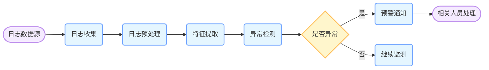

# 智能日志异常预警:主动式问题检测

> 关键词：智能日志、异常预警、主动式检测、问题检测、日志分析

> 摘要：本文围绕智能日志异常预警的主动式问题检测展开，详细介绍了其背景、核心概念、算法原理、数学模型、项目实战等多方面内容。通过对日志数据的深入分析和处理，利用先进的技术手段实现主动发现系统中的异常情况，提前预警潜在问题，从而保障系统的稳定运行。文章不仅阐述了相关理论知识，还结合实际案例进行详细解读，为读者提供了全面且深入的技术指导，同时推荐了学习资源、开发工具和相关论文著作，最后对未来发展趋势与挑战进行了总结，旨在帮助读者更好地理解和应用智能日志异常预警技术。

## 1. 背景介绍 
### 1.1 目的和范围
在当今数字化时代，各类系统产生的日志数据量呈爆炸式增长。这些日志记录了系统运行过程中的各种信息，如用户操作、系统状态变化、错误信息等。智能日志异常预警的目的在于从海量的日志数据中快速、准确地识别出异常模式，主动检测潜在的问题，而不是等到问题已经严重影响系统运行时才被动响应。

本文章的范围涵盖了智能日志异常预警的核心概念、相关算法、数学模型、实际应用案例等多个方面。旨在为读者提供一个全面的技术框架，帮助他们理解和实现主动式的问题检测系统。

### 1.2 预期读者
本文预期读者包括从事软件开发、系统运维、数据分析、人工智能等领域的专业人员，以及对智能日志异常预警技术感兴趣的学生和研究人员。无论是希望深入了解相关技术原理的开发者，还是寻求提高系统稳定性和可靠性的运维人员，都能从本文中获得有价值的信息。

### 1.3 文档结构概述
本文将按照以下结构进行阐述：首先介绍智能日志异常预警的背景知识，包括目的、预期读者和文档结构概述等内容；接着详细讲解核心概念与联系，通过文本示意图和 Mermaid 流程图进行直观展示；然后深入探讨核心算法原理和具体操作步骤，并使用 Python 源代码进行详细阐述；之后介绍数学模型和公式，并通过举例进行说明；再通过项目实战展示代码实际案例和详细解释；随后介绍实际应用场景；接着推荐相关的工具和资源；最后总结未来发展趋势与挑战，并提供常见问题与解答以及扩展阅读和参考资料。

### 1.4 术语表
#### 1.4.1 核心术语定义
- **智能日志**：指通过智能化手段对系统产生的日志数据进行收集、存储、分析和处理，以提取有价值信息的日志数据集合。
- **异常预警**：在系统运行过程中，通过对日志数据的实时监测和分析，提前发现异常情况并发出警报的过程。
- **主动式问题检测**：区别于传统的被动式问题响应，主动式问题检测通过主动分析日志数据，在问题发生之前或初期就能够发现潜在问题的检测方法。
- **日志分析**：对日志数据进行解析、挖掘和可视化等操作，以发现其中的规律、趋势和异常信息的过程。

#### 1.4.2 相关概念解释
- **日志数据**：系统在运行过程中产生的记录信息，包括系统事件、用户操作、错误信息等。日志数据可以是文本格式、结构化数据或半结构化数据。
- **异常模式**：在日志数据中不符合正常模式的特征或行为模式。异常模式可能是由于系统故障、安全漏洞、用户误操作等原因引起的。
- **特征提取**：从日志数据中提取能够代表其特征的信息，如关键词、时间戳、事件类型等，以便后续的分析和处理。

#### 1.4.3 缩略词列表
- **AI**：Artificial Intelligence，人工智能
- **ML**：Machine Learning，机器学习
- **DL**：Deep Learning，深度学习
- **NLP**：Natural Language Processing，自然语言处理

## 2. 核心概念与联系 
智能日志异常预警的核心概念主要包括日志数据的收集、预处理、特征提取、异常检测和预警等环节。这些环节相互关联，形成一个完整的主动式问题检测系统。

### 文本示意图
智能日志异常预警系统的核心架构可以用以下文本描述：

日志数据首先从各个数据源（如服务器、应用程序、网络设备等）收集而来，经过预处理环节，对日志数据进行清洗、转换和标准化，去除噪声和无用信息。然后进行特征提取，从预处理后的日志数据中提取出能够反映系统运行状态的特征。接下来，利用异常检测算法对提取的特征进行分析，判断是否存在异常情况。如果检测到异常，系统将触发预警机制，通知相关人员进行处理。

### Mermaid 流程图


## 3. 核心算法原理 & 具体操作步骤 
### 核心算法原理
在智能日志异常预警中，常用的异常检测算法包括基于统计的方法、机器学习方法和深度学习方法等。这里我们以基于机器学习的孤立森林（Isolation Forest）算法为例进行详细阐述。

孤立森林算法是一种无监督学习算法，其基本思想是通过随机划分数据空间，将异常点与正常点分离开来。异常点通常是那些在数据空间中相对孤立的点，因此更容易被孤立森林算法识别出来。

### 具体操作步骤
1. **数据准备**：收集日志数据，并进行预处理，将其转换为适合机器学习算法处理的格式。
2. **特征提取**：从预处理后的日志数据中提取特征，如日志事件的频率、时间间隔等。
3. **模型训练**：使用孤立森林算法对提取的特征进行训练，构建异常检测模型。
4. **异常检测**：使用训练好的模型对新的日志数据进行异常检测，判断是否存在异常情况。
5. **预警通知**：如果检测到异常，系统将触发预警机制，通知相关人员进行处理。

### Python 源代码详细阐述
```python
import numpy as np
from sklearn.ensemble import IsolationForest

# 模拟日志数据
log_data = np.random.randn(100, 5)  # 100 条日志记录，每条记录有 5 个特征

# 构建孤立森林模型
clf = IsolationForest(contamination=0.1)  # 假设异常点的比例为 10%

# 模型训练
clf.fit(log_data)

# 异常检测
predictions = clf.predict(log_data)

# 输出异常点的索引
anomaly_indices = np.where(predictions == -1)[0]
print("异常点的索引：", anomaly_indices)
```
在上述代码中，我们首先模拟了 100 条日志数据，每条记录有 5 个特征。然后使用 `IsolationForest` 类构建了一个孤立森林模型，并设置异常点的比例为 10%。接着，使用 `fit` 方法对模型进行训练，再使用 `predict` 方法对日志数据进行异常检测，最后输出异常点的索引。

## 4. 数学模型和公式 & 详细讲解 & 举例说明 
### 孤立森林算法的数学模型和公式
孤立森林算法的核心是构建孤立树（Isolation Tree）。孤立树是一种二叉树，其构建过程是通过随机选择一个特征和一个分割点，将数据空间划分为两部分，然后递归地对每个子空间进行划分，直到每个子空间中只有一个数据点或达到预设的树深度。

设数据集 $X = \{x_1, x_2, \cdots, x_n\}$，其中 $x_i$ 是第 $i$ 个数据点，$n$ 是数据点的数量。在构建孤立树时，随机选择一个特征 $q$ 和一个分割点 $p$，将数据集 $X$ 划分为两个子集 $X_{left}$ 和 $X_{right}$，满足：

$$
X_{left} = \{x_i \in X | x_{i,q} < p\}
$$

$$
X_{right} = \{x_i \in X | x_{i,q} \geq p\}
$$

其中 $x_{i,q}$ 是数据点 $x_i$ 在特征 $q$ 上的值。

### 详细讲解
孤立森林算法通过构建多个孤立树，然后计算每个数据点在所有孤立树中的路径长度。异常点通常具有较短的路径长度，因为它们更容易被孤立出来。

设 $h(x)$ 是数据点 $x$ 在一棵孤立树中的路径长度，$E(h(x))$ 是 $h(x)$ 在所有孤立树中的平均值。异常分数 $s(x, n)$ 可以通过以下公式计算：

$$
s(x, n) = 2^{-\frac{E(h(x))}{c(n)}}
$$

其中 $c(n)$ 是一个与数据集大小 $n$ 相关的常数，可以通过以下公式计算：

$$
c(n) = 2H(n - 1) - \frac{2(n - 1)}{n}
$$

其中 $H(k)$ 是调和数，可以近似计算为：

$$
H(k) = \ln(k) + 0.5772156649
$$

### 举例说明
假设我们有一个包含 10 个数据点的数据集，通过孤立森林算法计算每个数据点的异常分数。

```python
import numpy as np
from sklearn.ensemble import IsolationForest

# 模拟数据集
X = np.random.randn(10, 2)

# 构建孤立森林模型
clf = IsolationForest(contamination=0.2)
clf.fit(X)

# 计算异常分数
scores = clf.decision_function(X)

# 输出异常分数
print("异常分数：", scores)
```
在上述代码中，我们首先模拟了一个包含 10 个数据点的数据集，每个数据点有 2 个特征。然后使用 `IsolationForest` 类构建了一个孤立森林模型，并设置异常点的比例为 20%。接着，使用 `decision_function` 方法计算每个数据点的异常分数，并输出结果。

## 5. 项目实战：代码实际案例和详细解释说明 
### 5.1  开发环境搭建
为了实现智能日志异常预警系统，我们需要搭建以下开发环境：
- **Python 环境**：建议使用 Python 3.7 及以上版本。
- **开发工具**：可以选择 PyCharm、Jupyter Notebook 等开发工具。
- **相关库**：需要安装 `numpy`、`pandas`、`scikit-learn` 等库。

以下是安装相关库的命令：
```sh
pip install numpy pandas scikit-learn
```

### 5.2  源代码详细实现和代码解读
```python
import pandas as pd
from sklearn.ensemble import IsolationForest
import matplotlib.pyplot as plt

# 读取日志数据
log_data = pd.read_csv('log_data.csv')

# 数据预处理
# 假设日志数据中有时间戳和事件类型两列
log_data['timestamp'] = pd.to_datetime(log_data['timestamp'])
log_data['hour'] = log_data['timestamp'].dt.hour  # 提取小时信息

# 特征提取
features = log_data[['hour']]

# 构建孤立森林模型
clf = IsolationForest(contamination=0.05)  # 假设异常点的比例为 5%

# 模型训练
clf.fit(features)

# 异常检测
predictions = clf.predict(features)

# 将预测结果添加到原始数据中
log_data['anomaly'] = predictions

# 可视化异常点
plt.figure(figsize=(10, 6))
plt.scatter(log_data['timestamp'], log_data['hour'], c=log_data['anomaly'], cmap='viridis')
plt.xlabel('Timestamp')
plt.ylabel('Hour')
plt.title('Log Anomaly Detection')
plt.show()
```
### 代码解读与分析
1. **数据读取**：使用 `pandas` 库的 `read_csv` 函数读取日志数据。
2. **数据预处理**：将时间戳列转换为日期时间类型，并提取小时信息作为特征。
3. **特征提取**：选择小时信息作为特征，构建特征矩阵。
4. **模型训练**：使用 `IsolationForest` 类构建孤立森林模型，并使用 `fit` 方法进行训练。
5. **异常检测**：使用 `predict` 方法对特征矩阵进行异常检测，得到预测结果。
6. **可视化**：使用 `matplotlib` 库将异常点可视化，不同颜色表示正常点和异常点。

## 6. 实际应用场景 
智能日志异常预警的主动式问题检测在许多领域都有广泛的应用，以下是一些常见的应用场景：
- **系统运维**：在服务器、网络设备等系统运行过程中，通过实时监测日志数据，及时发现系统故障、性能瓶颈等问题，提前进行处理，避免系统停机或服务中断。
- **安全检测**：对用户的登录行为、操作记录等日志数据进行分析，检测是否存在异常登录、数据泄露等安全事件，及时采取措施保护系统安全。
- **业务监控**：在企业的业务系统中，通过分析业务日志数据，了解业务流程的运行情况，发现潜在的业务风险，如订单异常、交易失败等，及时调整业务策略。
- **工业物联网**：在工业生产过程中，对设备的运行状态、传感器数据等日志进行监测，及时发现设备故障、生产异常等问题，提高生产效率和质量。

## 7. 工具和资源推荐
### 7.1 学习资源推荐
#### 7.1.1 书籍推荐
- 《Python 机器学习》：介绍了 Python 语言在机器学习领域的应用，包括各种机器学习算法的原理和实现。
- 《深度学习》：深度学习领域的经典著作，详细介绍了深度学习的基本概念、算法和应用。
- 《数据挖掘：概念与技术》：全面介绍了数据挖掘的基本概念、算法和应用，对日志分析和异常检测有很好的参考价值。

#### 7.1.2 在线课程
- Coursera 上的“机器学习”课程：由斯坦福大学教授 Andrew Ng 授课，是机器学习领域的经典课程。
- edX 上的“深度学习”课程：介绍了深度学习的基本概念、算法和应用，适合初学者学习。
- 阿里云开发者社区的“日志分析与异常检测”课程：专门介绍了日志分析和异常检测的技术和方法。

#### 7.1.3 技术博客和网站
- Medium：一个技术博客平台，上面有许多关于机器学习、人工智能、日志分析等领域的优秀文章。
- Kaggle：一个数据科学竞赛平台，上面有许多关于日志分析和异常检测的开源项目和代码示例。
- 开源中国：国内知名的开源技术社区，上面有许多关于软件开发、数据分析等领域的技术文章和资源。

### 7.2 开发工具框架推荐
#### 7.2.1 IDE和编辑器
- PyCharm：一款专业的 Python 集成开发环境，提供了丰富的代码编辑、调试、版本控制等功能。
- Jupyter Notebook：一个交互式的开发环境，适合进行数据探索、模型训练和可视化等工作。
- Visual Studio Code：一款轻量级的代码编辑器，支持多种编程语言，具有丰富的插件生态系统。

#### 7.2.2 调试和性能分析工具
- Py-Spy：一个 Python 性能分析工具，可以帮助开发者找出代码中的性能瓶颈。
- cProfile：Python 内置的性能分析模块，可以对代码的运行时间和函数调用情况进行分析。
- pdb：Python 内置的调试模块，可以帮助开发者调试代码中的错误。

#### 7.2.3 相关框架和库
- scikit-learn：一个简单易用的机器学习库，提供了各种机器学习算法的实现，包括异常检测算法。
- TensorFlow：一个开源的深度学习框架，提供了丰富的深度学习模型和工具。
- PyTorch：另一个流行的深度学习框架，具有简洁易用的 API 和高效的计算性能。

### 7.3 相关论文著作推荐
#### 7.3.1 经典论文
- “Isolation Forest”：孤立森林算法的原始论文，详细介绍了算法的原理和实现。
- “Anomaly Detection: A Survey”：异常检测领域的综述论文，对各种异常检测算法进行了全面的介绍和比较。
- “Log Mining for Anomaly Detection: A Survey”：日志挖掘和异常检测领域的综述论文，对日志分析和异常检测的技术和方法进行了总结和分析。

#### 7.3.2 最新研究成果
- 可以关注顶级学术会议如 KDD（Knowledge Discovery and Data Mining）、ICML（International Conference on Machine Learning）等的最新研究成果，了解智能日志异常预警领域的最新技术和方法。

#### 7.3.3 应用案例分析
- 可以参考一些企业的技术博客和开源项目，了解他们在实际应用中如何实现智能日志异常预警系统，以及遇到的问题和解决方案。

## 8. 总结：未来发展趋势与挑战
### 未来发展趋势
- **智能化程度不断提高**：随着人工智能和机器学习技术的不断发展，智能日志异常预警系统将越来越智能化，能够自动学习和适应不同的业务场景和数据模式。
- **多模态数据融合**：除了文本日志数据，未来的智能日志异常预警系统将融合更多类型的数据，如图像、音频、视频等，以提高异常检测的准确性和全面性。
- **实时性和可扩展性增强**：为了满足实时监测和处理的需求，智能日志异常预警系统将不断提高实时性和可扩展性，能够处理大规模的日志数据。
- **与业务系统深度融合**：智能日志异常预警系统将不再是独立的系统，而是与企业的业务系统深度融合，为业务决策提供更有价值的信息。

### 挑战
- **数据质量问题**：日志数据往往存在噪声、缺失值等问题，如何提高数据质量是智能日志异常预警系统面临的一个重要挑战。
- **算法复杂度和效率**：随着数据量的不断增加和业务场景的不断复杂，异常检测算法的复杂度和效率成为一个关键问题，需要不断优化算法以提高性能。
- **模型可解释性**：许多机器学习和深度学习模型是黑盒模型，缺乏可解释性，这在一些对安全性和可靠性要求较高的领域是一个重要问题，需要研究可解释的异常检测模型。
- **隐私和安全问题**：日志数据中可能包含用户的敏感信息，如何在保证异常检测效果的同时，保护用户的隐私和数据安全是一个亟待解决的问题。

## 9. 附录：常见问题与解答
### 问题 1：如何选择合适的异常检测算法？
答：选择合适的异常检测算法需要考虑多个因素，如数据类型、数据量、异常模式的特点等。一般来说，如果数据具有明显的统计分布，可以选择基于统计的方法；如果数据复杂且难以用统计模型描述，可以选择机器学习或深度学习方法。

### 问题 2：如何处理日志数据中的噪声和缺失值？
答：处理日志数据中的噪声和缺失值可以采用多种方法，如数据清洗、插值法、填充法等。具体方法的选择需要根据数据的特点和业务需求来决定。

### 问题 3：如何评估异常检测模型的性能？
答：评估异常检测模型的性能可以使用多种指标，如准确率、召回率、F1 值、ROC 曲线等。不同的指标适用于不同的业务场景，需要根据实际情况选择合适的指标。

### 问题 4：如何提高异常检测的实时性？
答：提高异常检测的实时性可以采用多种方法，如优化算法、使用分布式计算、采用流式处理等。同时，需要合理设计系统架构，减少数据传输和处理的延迟。

## 10. 扩展阅读 & 参考资料
### 扩展阅读
- 《Python 数据分析实战》：介绍了 Python 语言在数据分析领域的应用，包括数据清洗、特征提取、模型训练等方面的内容。
- 《人工智能基础教程》：全面介绍了人工智能的基本概念、算法和应用，对智能日志异常预警的技术原理有很好的参考价值。
- 《大数据技术原理与应用》：介绍了大数据的基本概念、技术架构和应用场景，对处理大规模日志数据有很好的指导作用。

### 参考资料
- 相关学术论文和研究报告：可以通过学术数据库如 IEEE Xplore、ACM Digital Library 等查找相关的学术论文和研究报告。
- 开源项目和代码库：可以参考 GitHub 等开源代码托管平台上的相关开源项目和代码库，了解智能日志异常预警系统的实现细节。
- 官方文档和技术手册：各个开发工具、框架和库的官方文档和技术手册是学习和使用这些工具的重要参考资料。