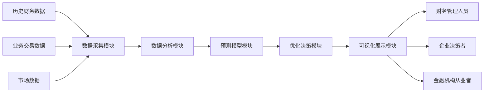

# 智能现金流预测与优化管理平台

> 关键词：智能现金流预测、优化管理平台、数据分析、机器学习、财务决策、风险管理、现金流模型

> 摘要：本文围绕智能现金流预测与优化管理平台展开全面深入的探讨。首先介绍该平台产生的背景，包括其目的、预期读者等内容。接着阐述核心概念与联系，剖析其架构和原理。通过详细的算法原理讲解和Python代码示例，让读者了解现金流预测的具体实现方式。同时，给出相关的数学模型和公式并进行举例说明。在项目实战部分，展示开发环境搭建、源代码实现及解读。分析该平台的实际应用场景，推荐学习资源、开发工具框架和相关论文著作。最后总结未来发展趋势与挑战，提供常见问题解答和扩展阅读参考资料，旨在帮助读者全面了解智能现金流预测与优化管理平台的相关技术和应用。

## 1. 背景介绍 
### 1.1 目的和范围
在当今复杂多变的商业环境中，现金流管理对于企业的生存和发展至关重要。智能现金流预测与优化管理平台的目的在于帮助企业准确预测未来的现金流入和流出情况，优化现金流的配置，提高资金使用效率，降低财务风险。该平台的范围涵盖了企业各个业务环节的现金流管理，包括销售收款、采购付款、投资活动、融资活动等，能够为企业提供全面、精准的现金流管理解决方案。

### 1.2 预期读者
本文的预期读者主要包括企业财务管理人员、财务分析师、企业决策者、金融机构从业者以及对智能现金流管理技术感兴趣的研究人员和开发者。对于财务管理人员和分析师来说，该平台可以帮助他们更好地进行现金流预测和管理；企业决策者可以依据平台提供的信息做出更明智的战略决策；金融机构从业者可以利用平台的分析结果评估企业的信用风险；研究人员和开发者则可以从技术实现的角度深入了解智能现金流管理的相关知识。

### 1.3 文档结构概述
本文将按照以下结构进行详细阐述：首先介绍智能现金流预测与优化管理平台的背景信息，包括目的、预期读者和文档结构概述等。接着深入探讨核心概念与联系，包括平台的架构和原理。然后讲解核心算法原理和具体操作步骤，并给出Python代码示例。随后介绍数学模型和公式，通过具体例子进行说明。在项目实战部分，详细介绍开发环境搭建、源代码实现及代码解读。分析该平台的实际应用场景，推荐相关的学习资源、开发工具框架和论文著作。最后总结未来发展趋势与挑战，提供常见问题解答和扩展阅读参考资料。

### 1.4 术语表
#### 1.4.1 核心术语定义
- **现金流预测**：对企业未来一段时间内现金流入和流出情况的预计和估算。
- **优化管理**：通过合理的策略和方法，对现金流进行调整和配置，以实现企业资金使用效率的最大化和财务风险的最小化。
- **机器学习算法**：一类让计算机通过数据学习模式和规律，从而进行预测和决策的算法。
- **财务指标**：用于衡量企业财务状况和经营业绩的各种指标，如资产负债率、净利润率等。

#### 1.4.2 相关概念解释
- **现金流量表**：反映企业在一定会计期间现金和现金等价物流入和流出的报表，是企业财务报表的重要组成部分。
- **时间序列分析**：一种用于分析时间序列数据的统计方法，通过对历史数据的分析来预测未来趋势。
- **风险评估**：对企业面临的各种风险进行识别、分析和评估的过程，包括市场风险、信用风险、流动性风险等。

#### 1.4.3 缩略词列表
- **AI**：Artificial Intelligence，人工智能
- **ML**：Machine Learning，机器学习
- **ARIMA**：Autoregressive Integrated Moving Average，自回归积分滑动平均模型
- **LSTM**：Long Short-Term Memory，长短期记忆网络

## 2. 核心概念与联系 
智能现金流预测与优化管理平台主要由数据采集模块、数据分析模块、预测模型模块、优化决策模块和可视化展示模块组成。其架构示意图如下：



### 数据采集模块
该模块负责收集与企业现金流相关的各种数据，包括历史财务数据、业务交易数据和市场数据等。历史财务数据可以从企业的财务报表中获取，如现金流量表、资产负债表和利润表等；业务交易数据包括销售订单、采购订单、发票等；市场数据则包括宏观经济数据、行业数据、利率数据等。这些数据是平台进行分析和预测的基础。

### 数据分析模块
对采集到的数据进行清洗、预处理和特征工程。数据清洗主要是去除数据中的噪声、缺失值和异常值；预处理包括数据标准化、归一化等操作，以提高数据的质量和可用性；特征工程则是从原始数据中提取有价值的特征，如季节性特征、趋势特征等，为后续的预测模型提供更好的输入。

### 预测模型模块
利用机器学习和深度学习等算法建立现金流预测模型。常见的算法包括时间序列分析算法（如ARIMA、SARIMA）、机器学习算法（如线性回归、决策树、随机森林）和深度学习算法（如LSTM、GRU）等。这些模型通过对历史数据的学习，预测未来的现金流入和流出情况。

### 优化决策模块
根据预测结果和企业的财务目标，制定优化决策策略。例如，在现金流入不足的情况下，企业可以考虑采取加速收款、延迟付款、增加融资等措施；在现金流入充裕的情况下，企业可以考虑进行投资、偿还债务等操作，以提高资金的使用效率。

### 可视化展示模块
将预测结果和优化决策以直观的图表和报表形式展示给用户，如折线图、柱状图、饼图等。可视化展示可以帮助用户更好地理解数据和决策结果，及时做出合理的财务决策。

## 3. 核心算法原理 & 具体操作步骤 
### 3.1 ARIMA算法原理
ARIMA（Autoregressive Integrated Moving Average）模型是一种常用的时间序列预测模型，它结合了自回归（AR）、差分（I）和移动平均（MA）三个部分。其数学表达式为：

$$
(1 - \sum_{i = 1}^{p} \phi_{i} B^{i})(1 - B)^{d} Y_{t} = (1 + \sum_{j = 1}^{q} \theta_{j} B^{j}) \epsilon_{t}
$$

其中，$Y_{t}$ 是时间序列数据，$B$ 是滞后算子，$p$ 是自回归阶数，$d$ 是差分阶数，$q$ 是移动平均阶数，$\phi_{i}$ 和 $\theta_{j}$ 是模型的参数，$\epsilon_{t}$ 是白噪声序列。

### 3.2 Python代码实现ARIMA模型
```python
import pandas as pd
import numpy as np
from statsmodels.tsa.arima.model import ARIMA
import matplotlib.pyplot as plt

# 生成示例数据
np.random.seed(0)
dates = pd.date_range(start='2020-01-01', periods=100, freq='D')
data = np.random.randn(100).cumsum()
ts = pd.Series(data, index=dates)

# 拟合ARIMA模型
p, d, q = 1, 1, 1  # 定义模型阶数
model = ARIMA(ts, order=(p, d, q))
model_fit = model.fit()

# 进行预测
n_steps = 10
forecast = model_fit.get_forecast(steps=n_steps)
forecast_mean = forecast.predicted_mean
forecast_conf_int = forecast.conf_int()

# 绘制结果
plt.figure(figsize=(12, 6))
plt.plot(ts, label='Historical Data')
plt.plot(pd.date_range(start=ts.index[-1], periods=n_steps + 1, freq='D')[1:], forecast_mean, label='Forecast', color='red')
plt.fill_between(forecast_conf_int.index, forecast_conf_int.iloc[:, 0], forecast_conf_int.iloc[:, 1], color='k', alpha=0.1)
plt.title('ARIMA Forecast')
plt.xlabel('Date')
plt.ylabel('Value')
plt.legend()
plt.show()
```

### 3.3 具体操作步骤
1. **数据准备**：收集和整理历史现金流数据，确保数据的完整性和准确性。
2. **数据预处理**：对数据进行清洗、差分等操作，使其满足ARIMA模型的要求。
3. **模型选择**：通过网格搜索等方法确定最优的 $p$、$d$、$q$ 阶数。
4. **模型训练**：使用历史数据对ARIMA模型进行训练，估计模型的参数。
5. **模型预测**：利用训练好的模型对未来的现金流进行预测。
6. **结果评估**：使用评估指标（如均方误差、平均绝对误差等）对预测结果进行评估，调整模型参数以提高预测精度。

## 4. 数学模型和公式 & 详细讲解 & 举例说明 
### 4.1 现金流预测的基本数学模型
现金流预测可以看作是一个时间序列预测问题，其基本数学模型可以表示为：

$$
Y_{t} = f(Y_{t - 1}, Y_{t - 2}, \cdots, Y_{t - n}, X_{t}) + \epsilon_{t}
$$

其中，$Y_{t}$ 是 $t$ 时刻的现金流值，$Y_{t - i}$ 是过去 $i$ 个时刻的现金流值，$X_{t}$ 是 $t$ 时刻的外部影响因素（如市场利率、宏观经济指标等），$f$ 是预测函数，$\epsilon_{t}$ 是随机误差项。

### 4.2 线性回归模型
线性回归是一种简单而常用的预测模型，其数学表达式为：

$$
Y_{t} = \beta_{0} + \beta_{1} X_{1t} + \beta_{2} X_{2t} + \cdots + \beta_{k} X_{kt} + \epsilon_{t}
$$

其中，$\beta_{0}$ 是截距项，$\beta_{i}$ 是回归系数，$X_{it}$ 是第 $i$ 个自变量，$k$ 是自变量的个数。

### 4.3 举例说明
假设我们要预测某企业的月度现金流入，我们可以选择以下自变量：上月现金流入、当月销售额、市场利率。数据如下表所示：

| 月份 | 上月现金流入（万元） | 当月销售额（万元） | 市场利率（%） | 当月现金流入（万元） |
|---|---|---|---|---|
| 1 | 100 | 200 | 2 | 150 |
| 2 | 150 | 250 | 2.2 | 200 |
| 3 | 200 | 300 | 2.5 | 250 |
| 4 | 250 | 350 | 2.8 | 300 |

我们可以使用Python的 `sklearn` 库来实现线性回归模型：

```python
import numpy as np
from sklearn.linear_model import LinearRegression

# 定义自变量和因变量
X = np.array([[100, 200, 2], [150, 250, 2.2], [200, 300, 2.5], [250, 350, 2.8]])
y = np.array([150, 200, 250, 300])

# 拟合线性回归模型
model = LinearRegression()
model.fit(X, y)

# 预测新数据
new_X = np.array([[300, 400, 3]])
prediction = model.predict(new_X)
print("预测的当月现金流入：", prediction)
```

在这个例子中，我们通过线性回归模型建立了上月现金流入、当月销售额、市场利率与当月现金流入之间的线性关系，并使用该模型进行了预测。

## 5. 项目实战：代码实际案例和详细解释说明 
### 5.1  开发环境搭建
#### 5.1.1 安装Python
首先，需要安装Python开发环境。可以从Python官方网站（https://www.python.org/downloads/） 下载适合自己操作系统的Python版本，并按照安装向导进行安装。建议安装Python 3.7及以上版本。

#### 5.1.2 安装必要的库
使用以下命令安装项目所需的库：
```sh
pip install pandas numpy statsmodels scikit-learn matplotlib
```

### 5.2  源代码详细实现和代码解读
以下是一个完整的智能现金流预测与优化管理平台的示例代码，该代码使用ARIMA模型进行现金流预测，并根据预测结果进行简单的优化决策。

```python
import pandas as pd
import numpy as np
from statsmodels.tsa.arima.model import ARIMA
import matplotlib.pyplot as plt

# 生成示例数据
np.random.seed(0)
dates = pd.date_range(start='2020-01-01', periods=100, freq='D')
data = np.random.randn(100).cumsum()
ts = pd.Series(data, index=dates)

# 拟合ARIMA模型
p, d, q = 1, 1, 1  # 定义模型阶数
model = ARIMA(ts, order=(p, d, q))
model_fit = model.fit()

# 进行预测
n_steps = 10
forecast = model_fit.get_forecast(steps=n_steps)
forecast_mean = forecast.predicted_mean

# 优化决策
threshold = 0  # 设定现金余额阈值
optimized_decisions = []
current_balance = ts[-1]
for i in range(n_steps):
    predicted_cash_flow = forecast_mean[i]
    new_balance = current_balance + predicted_cash_flow
    if new_balance < threshold:
        decision = "增加融资"
    else:
        decision = "无特殊操作"
    optimized_decisions.append(decision)
    current_balance = new_balance

# 绘制结果
plt.figure(figsize=(12, 6))
plt.plot(ts, label='Historical Data')
plt.plot(pd.date_range(start=ts.index[-1], periods=n_steps + 1, freq='D')[1:], forecast_mean, label='Forecast', color='red')
plt.title('Cash Flow Forecast and Optimization')
plt.xlabel('Date')
plt.ylabel('Cash Flow')
plt.legend()
plt.show()

# 输出优化决策
for i in range(n_steps):
    print(f"第 {i + 1} 天预测现金流量：{forecast_mean[i]:.2f}，决策：{optimized_decisions[i]}")
```

### 5.3  代码解读与分析
1. **数据生成**：使用 `numpy` 生成随机的时间序列数据作为示例现金流数据。
2. **模型拟合**：使用 `statsmodels` 库中的 `ARIMA` 模型对历史数据进行拟合，估计模型的参数。
3. **预测**：使用训练好的模型对未来10天的现金流进行预测。
4. **优化决策**：设定一个现金余额阈值，根据预测的现金流量计算新的现金余额。如果新的现金余额低于阈值，则建议增加融资；否则，无特殊操作。
5. **结果展示**：使用 `matplotlib` 库绘制历史数据和预测数据的折线图，并输出优化决策结果。

## 6. 实际应用场景 
### 6.1 企业财务管理
企业可以使用智能现金流预测与优化管理平台来预测未来的现金流入和流出情况，合理安排资金的使用。例如，在现金流入不足的情况下，提前做好融资准备；在现金流入充裕的情况下，进行合理的投资，提高资金的使用效率。同时，平台可以帮助企业进行财务风险评估，及时发现潜在的财务风险，采取相应的措施进行防范。

### 6.2 金融机构信贷评估
金融机构在进行信贷评估时，可以参考企业的现金流预测结果。通过分析企业未来的现金流入和流出情况，评估企业的还款能力和信用风险，从而做出更加准确的信贷决策。例如，如果企业的现金流预测显示未来一段时间内现金流入充足，还款能力较强，金融机构可以考虑给予较高的信贷额度和较低的贷款利率。

### 6.3 投资决策
投资者在进行投资决策时，可以借助智能现金流预测与优化管理平台来分析目标企业的现金流状况。良好的现金流状况通常意味着企业具有较强的盈利能力和抗风险能力，是投资的重要参考指标。例如，投资者可以通过比较不同企业的现金流预测结果，选择现金流状况较好的企业进行投资。

## 7. 工具和资源推荐
### 7.1 学习资源推荐
#### 7.1.1 书籍推荐
- 《Python数据分析实战》：介绍了Python在数据分析领域的应用，包括数据处理、可视化、机器学习等方面的内容，适合初学者入门。
- 《时间序列分析及其应用：R语言实现》：详细讲解了时间序列分析的理论和方法，并通过R语言进行实现，对于理解现金流预测的时间序列模型有很大帮助。
- 《机器学习》（周志华著）：全面介绍了机器学习的基本概念、算法和应用，是机器学习领域的经典教材。

#### 7.1.2 在线课程
- Coursera上的“Machine Learning”（Andrew Ng教授授课）：是一门非常经典的机器学习在线课程，适合零基础的学习者。
- edX上的“Data Science MicroMasters Program”：提供了数据科学领域的系统学习课程，包括数据分析、机器学习、深度学习等内容。
- 中国大学MOOC上的“Python数据分析与应用”：由国内知名高校的教师授课，介绍了Python在数据分析中的应用。

#### 7.1.3 技术博客和网站
- Medium：是一个技术博客平台，上面有很多关于数据分析、机器学习、金融科技等领域的优质文章。
- Kaggle：是一个数据科学竞赛平台，上面有很多开源的数据集和优秀的数据分析代码，可以学习和参考。
- Towards Data Science：专注于数据科学和机器学习领域的技术博客，提供了很多前沿的技术文章和案例分析。

### 7.2 开发工具框架推荐
#### 7.2.1 IDE和编辑器
- PyCharm：是一款专业的Python集成开发环境，提供了丰富的功能和插件，适合Python开发。
- Jupyter Notebook：是一个交互式的开发环境，适合进行数据分析和模型开发，方便代码的展示和分享。
- Visual Studio Code：是一款轻量级的代码编辑器，支持多种编程语言，通过安装相关插件可以进行Python开发。

#### 7.2.2 调试和性能分析工具
- PDB：是Python自带的调试工具，可以帮助开发者定位代码中的问题。
- cProfile：是Python的性能分析工具，可以分析代码的运行时间和函数调用情况，帮助开发者优化代码性能。
- TensorBoard：是TensorFlow的可视化工具，用于可视化深度学习模型的训练过程和结果。

#### 7.2.3 相关框架和库
- Pandas：是Python中用于数据处理和分析的重要库，提供了高效的数据结构和数据操作方法。
- NumPy：是Python中用于科学计算的基础库，提供了高效的数组操作和数学函数。
- Scikit-learn：是Python中常用的机器学习库，提供了丰富的机器学习算法和工具。
- Keras：是一个高级神经网络API，基于TensorFlow、Theano等后端，方便快速搭建深度学习模型。

### 7.3 相关论文著作推荐
#### 7.3.1 经典论文
- “Autoregressive Integrated Moving Average Models for Time Series Forecasting”：介绍了ARIMA模型的原理和应用，是时间序列预测领域的经典论文。
- “Long Short-Term Memory”：提出了长短期记忆网络（LSTM）的概念，是深度学习领域的重要论文。
- “A Survey on Machine Learning in Financial Time Series Forecasting”：对机器学习在金融时间序列预测中的应用进行了综述，具有较高的参考价值。

#### 7.3.2 最新研究成果
- 关注顶级学术会议（如NeurIPS、ICML、KDD等）和学术期刊（如Journal of Financial Economics、Management Science等）上发表的关于现金流预测和金融科技的最新研究成果。

#### 7.3.3 应用案例分析
- 参考一些知名企业和金融机构的现金流管理案例分析，了解智能现金流预测与优化管理平台在实际应用中的效果和经验。

## 8. 总结：未来发展趋势与挑战
### 8.1 未来发展趋势
- **智能化程度不断提高**：随着人工智能和机器学习技术的不断发展，智能现金流预测与优化管理平台将具备更强的自学习和自适应能力，能够自动调整预测模型和优化策略，提高预测的准确性和决策的科学性。
- **与其他系统的集成**：平台将与企业的财务系统、ERP系统、供应链管理系统等进行深度集成，实现数据的实时共享和交互，为企业提供更加全面、准确的现金流管理解决方案。
- **风险管理的强化**：更加注重对现金流风险的识别、评估和控制，通过引入先进的风险度量模型和方法，帮助企业有效防范和应对各种财务风险。
- **可视化和交互性增强**：提供更加直观、丰富的可视化界面和交互功能，使用户能够更加方便地查看和分析现金流数据，及时做出合理的决策。

### 8.2 挑战
- **数据质量和安全问题**：智能现金流预测与优化管理平台依赖大量的数据，数据的质量和安全直接影响平台的性能和可靠性。如何保证数据的准确性、完整性和安全性是一个重要的挑战。
- **模型的复杂性和可解释性**：随着模型的不断复杂，如深度学习模型的应用，模型的可解释性变得越来越差。如何在提高预测精度的同时，保证模型的可解释性，让用户能够理解和信任模型的决策结果，是需要解决的问题。
- **技术更新换代快**：人工智能和机器学习技术发展迅速，新的算法和模型不断涌现。平台需要不断更新和升级，以适应技术的发展和用户的需求。
- **人才短缺**：智能现金流预测与优化管理平台的开发和应用需要既懂金融又懂技术的复合型人才，目前这类人才相对短缺，制约了平台的发展。

## 9. 附录：常见问题与解答
### 9.1 数据采集过程中遇到数据缺失怎么办？
可以采用以下方法处理数据缺失问题：
- **删除缺失值**：如果缺失值占比很小，可以直接删除包含缺失值的记录。
- **插补法**：使用均值、中位数、众数等统计量进行插补，或者使用机器学习算法（如K近邻算法）进行插补。
- **模型预测法**：建立预测模型，根据其他变量的值预测缺失值。

### 9.2 如何选择合适的预测模型？
选择合适的预测模型需要考虑以下因素：
- **数据特点**：根据数据的时间序列特征（如季节性、趋势性）选择合适的模型，如ARIMA模型适用于平稳时间序列，LSTM模型适用于处理长序列数据。
- **预测精度要求**：不同的模型在预测精度上可能存在差异，可以通过交叉验证等方法比较不同模型的性能，选择预测精度较高的模型。
- **计算复杂度**：一些复杂的模型可能计算复杂度较高，需要考虑计算资源和时间成本。

### 9.3 优化决策的策略如何制定？
优化决策的策略需要根据企业的财务目标和实际情况制定。一般可以从以下几个方面考虑：
- **现金流量平衡**：确保企业的现金流入和流出保持平衡，避免出现现金短缺或闲置的情况。
- **成本效益原则**：在制定决策时，需要考虑成本和效益的关系，选择成本最低、效益最高的方案。
- **风险控制**：考虑各种风险因素，如市场风险、信用风险等，采取相应的措施进行风险控制。

## 10. 扩展阅读 & 参考资料
### 10.1 扩展阅读
- 《金融科技前沿：技术趋势与应用实践》：介绍了金融科技领域的前沿技术和应用案例，对于了解智能现金流管理的发展趋势有很大帮助。
- 《大数据时代：生活、工作与思维的大变革》：探讨了大数据对各个领域的影响，为理解智能现金流预测与优化管理平台的数据驱动原理提供了理论支持。

### 10.2 参考资料
- 相关企业的财务报表和年度报告，为现金流分析提供实际数据参考。
- 行业研究报告和市场分析报告，了解行业的发展趋势和市场动态。
- 学术期刊和会议论文，获取最新的研究成果和技术进展。