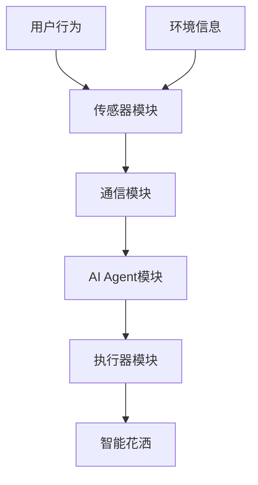

# 智能花洒：AI Agent的用水量优化控制

> 关键词：智能花洒、AI Agent、用水量优化、控制算法、节水技术

> 摘要：本文聚焦于智能花洒中AI Agent的用水量优化控制技术。首先介绍了智能花洒及相关背景知识，接着阐述了AI Agent的核心概念与工作原理，详细讲解了其核心算法原理及具体操作步骤，通过数学模型和公式深入剖析其优化逻辑，并给出具体示例。随后通过项目实战展示代码实现与解读，探讨了智能花洒在不同场景下的实际应用。还推荐了学习该技术所需的工具和资源，最后对智能花洒未来发展趋势与挑战进行总结，同时提供常见问题解答和扩展阅读参考资料，旨在为智能花洒领域的研究与应用提供全面且深入的技术指导。

## 1. 背景介绍 
### 1.1 目的和范围
随着全球水资源日益紧张，节水成为了各个领域关注的重点。智能花洒作为家庭用水的重要设备，其用水量的优化控制具有重要的现实意义。本文章的目的在于深入探讨如何利用AI Agent技术实现智能花洒用水量的优化控制，通过详细的技术分析和实践案例，为相关领域的研究人员、开发者以及对智能节水技术感兴趣的读者提供全面的技术参考。范围涵盖了智能花洒的基本原理、AI Agent的核心算法、数学模型、项目实战以及实际应用场景等多个方面。

### 1.2 预期读者
本文预期读者包括但不限于计算机科学、控制工程、水资源管理等领域的研究人员和学者，智能硬件开发者、智能家居系统集成商，以及对智能节水技术和AI Agent应用感兴趣的爱好者。

### 1.3 文档结构概述
本文将按照以下结构展开：首先介绍智能花洒和AI Agent相关的背景知识，包括术语定义和概念解释；接着阐述AI Agent的核心概念、原理和架构，通过文本示意图和Mermaid流程图进行直观展示；然后详细讲解核心算法原理和具体操作步骤，结合Python源代码进行说明；之后介绍数学模型和公式，并给出具体的举例说明；通过项目实战展示代码的实际案例和详细解释；探讨智能花洒在不同场景下的实际应用；推荐学习该技术所需的工具和资源；最后对智能花洒未来发展趋势与挑战进行总结，同时提供常见问题解答和扩展阅读参考资料。

### 1.4 术语表
#### 1.4.1 核心术语定义
- **智能花洒**：一种具备智能控制功能的花洒设备，能够根据用户需求和环境条件自动调整出水参数，如水流大小、水温等。
- **AI Agent（人工智能智能体）**：一种能够感知环境、做出决策并采取行动以实现特定目标的智能实体。在智能花洒中，AI Agent通过感知用户行为、水流状态等信息，对花洒的用水量进行优化控制。
- **用水量优化控制**：通过各种技术手段，在满足用户需求的前提下，尽可能减少花洒的用水量，提高水资源的利用效率。

#### 1.4.2 相关概念解释
- **传感器技术**：用于感知智能花洒的各种参数，如水流速度、水温、用户的使用习惯等。常见的传感器包括水流传感器、温度传感器、压力传感器等。
- **机器学习算法**：AI Agent用于学习用户行为模式和环境信息的重要工具，通过对大量数据的分析和训练，实现对花洒用水量的优化控制。常见的机器学习算法包括决策树、神经网络、强化学习等。
- **物联网（IoT）**：将智能花洒与其他设备通过网络连接起来，实现数据的交互和共享，为AI Agent提供更全面的环境信息，从而实现更精准的用水量优化控制。

#### 1.4.3 缩略词列表
- **AI**：Artificial Intelligence，人工智能
- **IoT**：Internet of Things，物联网
- **ML**：Machine Learning，机器学习

## 2. 核心概念与联系 

### 智能花洒与AI Agent的核心概念
智能花洒是一种结合了先进传感器技术、通信技术和控制技术的新型花洒设备。它能够实时感知用户的使用行为、水流状态、水温等信息，并将这些信息传输给AI Agent。AI Agent是智能花洒的核心控制单元，它基于接收到的信息，运用机器学习算法进行分析和决策，从而实现对花洒用水量的优化控制。

### 核心概念原理和架构的文本示意图
智能花洒的整体架构主要由传感器模块、通信模块、AI Agent模块和执行器模块组成。传感器模块负责采集各种环境和用户信息，如水流速度、水温、用户的使用时长等；通信模块将采集到的信息传输给AI Agent模块；AI Agent模块对信息进行分析和处理，根据预设的目标和算法生成控制指令；执行器模块根据控制指令调整花洒的出水参数，如水流大小、水温等。

### Mermaid 流程图


## 3. 核心算法原理 & 具体操作步骤 

### 核心算法原理
在智能花洒的用水量优化控制中，我们可以采用强化学习算法。强化学习是一种通过智能体与环境进行交互，不断尝试不同的行为，并根据环境反馈的奖励信号来学习最优行为策略的机器学习方法。在智能花洒的场景中，AI Agent作为智能体，环境是用户的使用行为和水流状态等信息，奖励信号可以根据用水量和用户满意度来设计。

### 具体操作步骤
1. **状态定义**：定义智能花洒的状态空间，包括水流速度、水温、用户的使用时长等。
2. **动作定义**：定义AI Agent可以采取的动作，如调整水流大小、水温等。
3. **奖励设计**：设计奖励函数，根据用水量和用户满意度来计算奖励值。例如，如果用水量减少且用户满意度较高，则给予较高的奖励；反之，则给予较低的奖励。
4. **训练过程**：AI Agent在环境中不断尝试不同的动作，并根据环境反馈的奖励信号更新自己的行为策略，直到找到最优的行为策略。

### Python源代码详细阐述
```python
import numpy as np

# 定义状态空间和动作空间
state_space_size = 10
action_space_size = 5

# 初始化Q表
q_table = np.zeros((state_space_size, action_space_size))

# 定义超参数
learning_rate = 0.1
discount_rate = 0.99
exploration_rate = 1
max_exploration_rate = 1
min_exploration_rate = 0.01
exploration_decay_rate = 0.001

# 模拟环境交互
def get_reward(state, action):
    # 这里简单模拟奖励函数，实际应用中需要根据具体情况设计
    if action == 0:
        return -1
    else:
        return 1

# 训练过程
num_episodes = 1000
for episode in range(num_episodes):
    state = np.random.randint(0, state_space_size)
    done = False
    while not done:
        exploration_rate_threshold = np.random.uniform(0, 1)
        if exploration_rate_threshold > exploration_rate:
            action = np.argmax(q_table[state, :])
        else:
            action = np.random.randint(0, action_space_size)
        
        reward = get_reward(state, action)
        next_state = np.random.randint(0, state_space_size)
        
        # 更新Q表
        q_table[state, action] = q_table[state, action] * (1 - learning_rate) + \
            learning_rate * (reward + discount_rate * np.max(q_table[next_state, :]))
        
        state = next_state
        
        if state == state_space_size - 1:
            done = True
    
    # 衰减探索率
    exploration_rate = min_exploration_rate + \
        (max_exploration_rate - min_exploration_rate) * np.exp(-exploration_decay_rate * episode)
```

## 4. 数学模型和公式 & 详细讲解 & 举例说明 

### 数学模型
在强化学习中，常用的数学模型是马尔可夫决策过程（MDP）。MDP可以用一个五元组 $<S, A, P, R, \gamma>$ 来表示，其中：
- $S$ 是状态空间，表示智能体可能处于的所有状态。
- $A$ 是动作空间，表示智能体可以采取的所有动作。
- $P$ 是状态转移概率，表示在状态 $s$ 采取动作 $a$ 后转移到状态 $s'$ 的概率，即 $P(s'|s, a)$。
- $R$ 是奖励函数，表示在状态 $s$ 采取动作 $a$ 后获得的奖励，即 $R(s, a)$。
- $\gamma$ 是折扣因子，用于平衡即时奖励和未来奖励的重要性，取值范围为 $[0, 1]$。

### 公式
在强化学习中，智能体的目标是学习一个最优的策略 $\pi^*$，使得长期累积奖励最大化。Q学习算法是一种常用的求解最优策略的方法，其核心公式为：
$$Q(s, a) = Q(s, a) + \alpha [R(s, a) + \gamma \max_{a'} Q(s', a') - Q(s, a)]$$
其中：
- $Q(s, a)$ 是状态 $s$ 下采取动作 $a$ 的Q值。
- $\alpha$ 是学习率，用于控制Q值更新的步长。
- $R(s, a)$ 是在状态 $s$ 采取动作 $a$ 后获得的即时奖励。
- $\gamma$ 是折扣因子。
- $s'$ 是在状态 $s$ 采取动作 $a$ 后转移到的下一个状态。

### 详细讲解
Q学习算法的核心思想是通过不断更新Q表来逼近最优的Q值函数。在每次交互中，智能体根据当前的Q表选择一个动作，执行该动作后获得即时奖励和下一个状态，然后根据上述公式更新Q表。随着交互次数的增加，Q表逐渐收敛到最优的Q值函数，从而得到最优的策略。

### 举例说明
假设智能花洒的状态空间 $S = \{s_1, s_2, s_3\}$，动作空间 $A = \{a_1, a_2\}$，初始Q表如下：
| 状态 | $a_1$ | $a_2$ |
| ---- | ---- | ---- |
| $s_1$ | 0 | 0 |
| $s_2$ | 0 | 0 |
| $s_3$ | 0 | 0 |

假设当前状态 $s = s_1$，智能体选择动作 $a = a_1$，执行该动作后获得奖励 $R(s_1, a_1) = 1$，转移到下一个状态 $s' = s_2$。假设学习率 $\alpha = 0.1$，折扣因子 $\gamma = 0.9$，则根据Q学习公式更新Q表：
$$Q(s_1, a_1) = Q(s_1, a_1) + 0.1 [1 + 0.9 \max_{a'} Q(s_2, a') - Q(s_1, a_1)]$$
由于 $Q(s_2, a_1) = Q(s_2, a_2) = 0$，则：
$$Q(s_1, a_1) = 0 + 0.1 [1 + 0.9 \times 0 - 0] = 0.1$$
更新后的Q表如下：
| 状态 | $a_1$ | $a_2$ |
| ---- | ---- | ---- |
| $s_1$ | 0.1 | 0 |
| $s_2$ | 0 | 0 |
| $s_3$ | 0 | 0 |

## 5. 项目实战：代码实际案例和详细解释说明 

### 5.1  开发环境搭建
- **硬件环境**：选择合适的智能花洒硬件平台，如基于Arduino的开发板，配备水流传感器、温度传感器、电磁阀等设备。
- **软件环境**：安装Arduino IDE用于编写和上传代码，安装Python开发环境用于实现AI Agent的算法。

### 5.2  源代码详细实现和代码解读
```python
import serial
import time
import numpy as np

# 定义状态空间和动作空间
state_space_size = 10
action_space_size = 5

# 初始化Q表
q_table = np.zeros((state_space_size, action_space_size))

# 定义超参数
learning_rate = 0.1
discount_rate = 0.99
exploration_rate = 1
max_exploration_rate = 1
min_exploration_rate = 0.01
exploration_decay_rate = 0.001

# 串口通信
ser = serial.Serial('COM3', 9600)

# 模拟环境交互
def get_reward(state, action):
    # 这里简单模拟奖励函数，实际应用中需要根据具体情况设计
    if action == 0:
        return -1
    else:
        return 1

# 训练过程
num_episodes = 1000
for episode in range(num_episodes):
    # 读取初始状态
    line = ser.readline().decode('utf-8').strip()
    state = int(line)
    
    done = False
    while not done:
        exploration_rate_threshold = np.random.uniform(0, 1)
        if exploration_rate_threshold > exploration_rate:
            action = np.argmax(q_table[state, :])
        else:
            action = np.random.randint(0, action_space_size)
        
        # 发送动作指令到硬件
        ser.write(str(action).encode())
        
        # 读取奖励和下一个状态
        line = ser.readline().decode('utf-8').strip()
        reward, next_state = map(int, line.split(','))
        
        # 更新Q表
        q_table[state, action] = q_table[state, action] * (1 - learning_rate) + \
            learning_rate * (reward + discount_rate * np.max(q_table[next_state, :]))
        
        state = next_state
        
        if state == state_space_size - 1:
            done = True
    
    # 衰减探索率
    exploration_rate = min_exploration_rate + \
        (max_exploration_rate - min_exploration_rate) * np.exp(-exploration_decay_rate * episode)

# 关闭串口
ser.close()
```
### 代码解读与分析
1. **串口通信**：通过 `serial.Serial` 函数建立与硬件设备的串口通信，实现数据的读写。
2. **状态读取**：在每个训练周期开始时，从串口读取初始状态。
3. **动作选择**：根据探索率和Q表选择动作。
4. **动作执行**：将选择的动作通过串口发送到硬件设备。
5. **奖励和状态更新**：从串口读取奖励和下一个状态，并更新Q表。
6. **训练结束**：当达到终止状态时，结束当前训练周期，并衰减探索率。

## 6. 实际应用场景 
### 家庭场景
在家庭中，智能花洒可以根据用户的使用习惯和需求，自动调整水流大小和水温，实现用水量的优化控制。例如，对于经常洗澡时间较短的用户，智能花洒可以适当减小水流大小；对于喜欢热水的用户，智能花洒可以提前预热并保持水温稳定，避免因水温不合适而浪费水资源。

### 公共浴室场景
在公共浴室中，智能花洒可以根据人流量和使用时间，动态调整水流大小和出水时间。例如，在人流量较大的时间段，适当减小水流大小，以保证更多用户能够使用；在人流量较小的时间段，可以适当增加水流大小，提高用户的使用体验。

### 酒店场景
在酒店中，智能花洒可以根据客人的入住信息和使用习惯，提供个性化的用水服务。例如，对于长期入住的客人，智能花洒可以学习其使用习惯，自动调整水流大小和水温；对于短期入住的客人，智能花洒可以提供标准的用水设置，同时根据客人的反馈进行调整。

## 7. 工具和资源推荐
### 7.1 学习资源推荐
#### 7.1.1 书籍推荐
- 《强化学习：原理与Python实现》：详细介绍了强化学习的基本原理和Python实现方法，对于理解智能花洒中AI Agent的核心算法有很大帮助。
- 《传感器技术基础》：介绍了各种传感器的工作原理和应用，对于智能花洒中传感器模块的设计和开发有指导作用。
- 《物联网技术与应用》：讲解了物联网的基本概念、技术架构和应用案例，对于理解智能花洒与物联网的结合有重要意义。

#### 7.1.2 在线课程
- Coursera上的“强化学习专项课程”：由知名高校的教授授课，系统地介绍了强化学习的理论和实践。
- edX上的“传感器与测量技术”：详细讲解了传感器的原理、设计和应用。
- Udemy上的“物联网开发实战”：通过实际项目案例，介绍了物联网的开发流程和技术。

#### 7.1.3 技术博客和网站
- Medium：有很多关于人工智能、物联网和智能硬件的技术博客，提供了最新的技术动态和实践经验。
- Stack Overflow：是一个程序员社区，对于在开发过程中遇到的问题，可以在上面查找解决方案。
- IEEE Xplore：提供了大量的学术论文和技术报告，对于深入研究智能花洒和AI Agent技术有重要参考价值。

### 7.2 开发工具框架推荐
#### 7.2.1 IDE和编辑器
- Arduino IDE：用于编写和上传Arduino开发板的代码，简单易用。
- PyCharm：是一款专业的Python集成开发环境，提供了丰富的代码编辑、调试和分析功能。
- Visual Studio Code：是一款轻量级的代码编辑器，支持多种编程语言，有丰富的插件扩展。

#### 7.2.2 调试和性能分析工具
- Serial Monitor：是Arduino IDE自带的串口调试工具，用于调试串口通信。
- Py-Spy：是一个Python性能分析工具，可以帮助开发者找出代码中的性能瓶颈。
- Wireshark：是一款网络协议分析工具，用于调试物联网设备之间的通信。

#### 7.2.3 相关框架和库
- TensorFlow：是一个开源的机器学习框架，提供了丰富的深度学习算法和工具，可用于实现智能花洒中AI Agent的机器学习模型。
- Keras：是一个高级神经网络API，基于TensorFlow等后端，简单易用，适合快速搭建和训练机器学习模型。
- Pyserial：是一个Python库，用于实现串口通信，方便智能花洒与硬件设备之间的数据交互。

### 7.3 相关论文著作推荐
#### 7.3.1 经典论文
- “Reinforcement Learning: An Introduction”：是强化学习领域的经典著作，系统地介绍了强化学习的基本理论和算法。
- “A Survey on Sensor Technologies for Internet of Things”：对物联网中传感器技术的发展现状和趋势进行了全面的综述。
- “Internet of Things: A Survey on Enabling Technologies, Protocols, and Applications”：介绍了物联网的关键技术、协议和应用案例。

#### 7.3.2 最新研究成果
- 关注顶级学术会议如NeurIPS、ICML、IEEE IoT等的最新研究成果，了解智能花洒和AI Agent技术的最新发展动态。
- 查阅相关学术期刊如Journal of Artificial Intelligence Research、IEEE Transactions on Industrial Informatics等的最新论文。

#### 7.3.3 应用案例分析
- 参考一些实际的智能花洒产品和项目案例，了解其技术方案、实现方法和应用效果。例如，某些智能家居品牌推出的智能花洒产品的技术白皮书和用户评价。

## 8. 总结：未来发展趋势与挑战
### 未来发展趋势
- **智能化程度不断提高**：随着人工智能技术的不断发展，智能花洒的AI Agent将能够更加准确地学习用户的使用习惯和需求，实现更加个性化、智能化的用水控制。
- **与其他智能家居设备的融合**：智能花洒将与其他智能家居设备如智能马桶、智能热水器等进行深度融合，实现整个家庭用水系统的协同优化控制，提高水资源的利用效率。
- **环保节能功能的强化**：未来的智能花洒将更加注重环保节能功能的开发，例如采用新型节水材料、优化水流设计等，进一步减少用水量。

### 挑战
- **数据隐私和安全问题**：智能花洒在收集用户的使用行为和环境信息时，涉及到用户的隐私问题。如何保障数据的安全和隐私，防止数据泄露和滥用，是一个重要的挑战。
- **算法的复杂性和效率**：随着智能花洒的功能不断增加，AI Agent的算法也将变得更加复杂。如何在保证算法准确性的前提下，提高算法的效率，减少计算资源的消耗，是一个需要解决的问题。
- **用户接受度**：智能花洒作为一种新型的产品，用户对其功能和使用方法可能存在一定的认知障碍。如何提高用户的接受度，推广智能花洒的使用，是一个需要面对的挑战。

## 9. 附录：常见问题与解答
### 1. 智能花洒的AI Agent是如何学习用户的使用习惯的？
AI Agent通过强化学习算法，在与用户的交互过程中不断尝试不同的动作，并根据用户的反馈和环境信息计算奖励值。通过对大量数据的学习和分析，AI Agent逐渐掌握用户的使用习惯和需求，从而实现对花洒用水量的优化控制。

### 2. 智能花洒的传感器会出现故障吗？如何解决？
智能花洒的传感器可能会出现故障，例如传感器精度下降、数据传输错误等。为了避免传感器故障对智能花洒的正常运行造成影响，可以采用冗余设计，即安装多个相同类型的传感器，当一个传感器出现故障时，其他传感器可以继续工作。同时，可以定期对传感器进行校准和维护，确保其正常运行。

### 3. 智能花洒的AI Agent算法需要多长时间才能收敛？
AI Agent算法的收敛时间取决于多个因素，如状态空间和动作空间的大小、学习率、折扣因子等。一般来说，通过合理选择超参数和进行大量的训练，算法可以在一定的时间内收敛。在实际应用中，可以根据具体情况进行调整和优化。

### 4. 智能花洒的用水优化效果如何评估？
可以通过对比使用智能花洒前后的用水量、用户满意度等指标来评估用水优化效果。例如，可以记录一段时间内的用水量，计算使用智能花洒后的用水量减少比例；同时，可以通过用户调查的方式了解用户对智能花洒的满意度。

## 10. 扩展阅读 & 参考资料
### 扩展阅读
- 《智能家居技术与应用》：进一步了解智能家居系统的整体架构和技术应用，有助于更好地理解智能花洒在智能家居中的地位和作用。
- 《人工智能原理与应用》：深入学习人工智能的基本原理和算法，为研究智能花洒中AI Agent的技术提供更坚实的理论基础。
- 《水资源管理与可持续发展》：了解水资源管理的相关知识和理念，认识到智能花洒在节水方面的重要意义和价值。

### 参考资料
- 相关智能花洒产品的技术文档和用户手册。
- 学术数据库中的相关研究论文和报告。
- 行业标准和规范，如智能家居相关的标准和节水设备的标准。