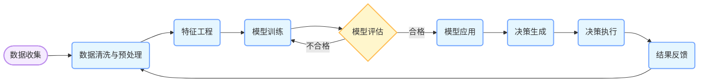

# 智能资产负债管理工具

> 关键词：智能资产负债管理、金融科技、风险管理、数据分析、人工智能、量化模型、决策支持

> 摘要：本文围绕智能资产负债管理工具展开深入探讨。在金融市场环境日益复杂多变的背景下，传统资产负债管理方式面临诸多挑战，智能资产负债管理工具应运而生。文章首先介绍了该工具的背景，包括目的范围、预期读者等内容；接着阐述其核心概念与联系，通过文本示意图和 Mermaid 流程图呈现其架构；详细讲解核心算法原理，结合 Python 源代码说明具体操作步骤；分析相关数学模型和公式并举例；给出项目实战案例，从开发环境搭建到代码实现与解读；探讨实际应用场景；推荐相关工具和资源；最后总结未来发展趋势与挑战，还设置了常见问题解答和扩展阅读参考资料，旨在为读者全面深入地理解和应用智能资产负债管理工具提供参考。

## 1. 背景介绍 
### 1.1 目的和范围
在金融领域，资产负债管理是一项至关重要的工作，它涉及到金融机构对资产和负债的合理配置与管理，以实现风险控制和收益最大化的目标。传统的资产负债管理方法往往依赖于人工经验和简单的统计分析，难以应对日益复杂的金融市场环境和多样化的风险因素。

智能资产负债管理工具的目的在于利用先进的信息技术和数据分析手段，提高资产负债管理的效率和准确性，实现更加科学、智能的决策。其范围涵盖了各类金融机构，如银行、证券、保险等，以及非金融企业的财务管理部门。该工具可以应用于资产负债的配置优化、风险评估、流动性管理、利率风险管理等多个方面。

### 1.2 预期读者
本文的预期读者包括金融行业的从业人员，如银行的资产负债管理部门员工、证券分析师、保险精算师等，他们可以通过本文深入了解智能资产负债管理工具的原理和应用，提升自身的业务能力和决策水平。同时，也适合对金融科技和数据分析感兴趣的技术人员，他们可以从技术实现的角度学习相关知识和技能。此外，高校金融专业和计算机专业的师生也可以将本文作为参考资料，加深对资产负债管理和智能技术结合的理解。

### 1.3 文档结构概述
本文将按照以下结构展开：首先介绍智能资产负债管理工具的背景信息，包括目的范围、预期读者等；接着阐述核心概念与联系，通过文本示意图和 Mermaid 流程图展示其架构；详细讲解核心算法原理，并结合 Python 源代码说明具体操作步骤；分析相关数学模型和公式并举例；给出项目实战案例，包括开发环境搭建、源代码实现与解读；探讨实际应用场景；推荐相关工具和资源；最后总结未来发展趋势与挑战，设置常见问题解答和扩展阅读参考资料。

### 1.4 术语表
#### 1.4.1 核心术语定义
- **资产负债管理（Asset - Liability Management，ALM）**：是指金融机构为了在可接受的风险限额内实现既定经营目标，对其资产和负债进行全面管理的过程。它主要涉及资产和负债的规模、结构、期限、利率等方面的匹配和优化。
- **智能资产负债管理工具**：是利用人工智能、大数据分析、机器学习等先进技术，对资产负债数据进行深度挖掘和分析，为资产负债管理决策提供智能支持的工具。
- **风险价值（Value at Risk，VaR）**：是一种常用的风险度量指标，用于衡量在一定的置信水平下，某一投资组合在未来特定时期内可能遭受的最大损失。
- **久期（Duration）**：是衡量债券或其他固定收益证券价格对利率变动敏感性的指标，它反映了债券现金流的加权平均期限。

#### 1.4.2 相关概念解释
- **金融科技（Fintech）**：是金融和科技的融合，通过运用各种新兴技术，如人工智能、区块链、云计算、大数据等，创新金融业务模式、服务方式和管理方法，提高金融效率和服务质量。
- **数据分析**：是指对大量的数据进行收集、清洗、处理、分析和可视化，以发现数据中的规律、趋势和价值，为决策提供支持。
- **机器学习**：是一门多领域交叉学科，涉及概率论、统计学、逼近论、凸分析、算法复杂度理论等多门学科。它专门研究计算机怎样模拟或实现人类的学习行为，以获取新的知识或技能，重新组织已有的知识结构使之不断改善自身的性能。

#### 1.4.3 缩略词列表
- **ALM**：Asset - Liability Management（资产负债管理）
- **VaR**：Value at Risk（风险价值）
- **AI**：Artificial Intelligence（人工智能）
- **ML**：Machine Learning（机器学习）
- **NLP**：Natural Language Processing（自然语言处理）

## 2. 核心概念与联系 

### 核心概念原理
智能资产负债管理工具的核心原理是基于数据分析和人工智能技术，对资产负债数据进行全面、深入的分析，以实现资产负债的优化配置和风险控制。

其主要原理包括以下几个方面：
1. **数据驱动**：收集和整合各类资产负债数据，包括资产和负债的规模、期限、利率、风险等信息，构建全面的数据集。
2. **模型构建**：利用机器学习、深度学习等算法构建预测模型和优化模型，对资产负债的未来走势和风险进行预测，为决策提供依据。
3. **智能决策**：根据模型的输出结果，结合预设的规则和约束条件，自动生成资产负债管理的决策建议，实现智能决策。

### 架构的文本示意图
智能资产负债管理工具的架构主要包括以下几个层次：
1. **数据层**：负责收集、存储和管理各类资产负债数据，包括内部数据和外部数据。内部数据主要来自金融机构的业务系统，如客户账户信息、交易记录等；外部数据包括市场数据、宏观经济数据等。
2. **处理层**：对收集到的数据进行清洗、预处理和特征工程，提取有价值的信息和特征，为模型训练提供数据支持。
3. **模型层**：利用机器学习、深度学习等算法构建预测模型和优化模型，对资产负债的未来走势和风险进行预测和分析。
4. **应用层**：根据模型的输出结果，结合预设的规则和约束条件，生成资产负债管理的决策建议，并提供可视化界面，方便用户查看和操作。
5. **反馈层**：将决策执行的结果反馈给数据层和模型层，对数据和模型进行更新和优化，形成闭环管理。

### Mermaid 流程图


## 3. 核心算法原理 & 具体操作步骤 

### 核心算法原理
智能资产负债管理工具中常用的核心算法包括机器学习算法和优化算法。

#### 机器学习算法
- **线性回归**：用于建立资产负债变量之间的线性关系，预测资产负债的未来走势。例如，通过线性回归模型可以预测利率变动对资产负债价值的影响。
- **逻辑回归**：常用于分类问题，如判断客户的信用风险等级，为资产负债管理中的风险评估提供支持。
- **决策树**：是一种基于树结构进行决策的算法，它可以根据不同的特征对资产负债数据进行分类和预测，具有较好的可解释性。
- **随机森林**：是决策树的集成算法，通过组合多个决策树来提高模型的准确性和稳定性。

#### 优化算法
- **线性规划**：用于在一定的约束条件下，求解目标函数的最优解。在资产负债管理中，可以利用线性规划算法实现资产负债的最优配置，以最大化收益或最小化风险。
- **动态规划**：适用于解决多阶段决策问题，在资产负债管理中，可以利用动态规划算法进行跨期的资产负债优化配置。

### 具体操作步骤及 Python 源代码

#### 数据准备
```python
import pandas as pd
import numpy as np

# 读取资产负债数据
data = pd.read_csv('asset_liability_data.csv')

# 数据清洗
data = data.dropna()

# 特征工程
features = data[['asset_amount', 'liability_amount', 'interest_rate', 'duration']]
target = data['risk_level']

# 数据划分
from sklearn.model_selection import train_test_split
X_train, X_test, y_train, y_test = train_test_split(features, target, test_size=0.2, random_state=42)
```

#### 模型训练
```python
from sklearn.linear_model import LogisticRegression

# 初始化逻辑回归模型
model = LogisticRegression()

# 模型训练
model.fit(X_train, y_train)
```

#### 模型评估
```python
from sklearn.metrics import accuracy_score

# 模型预测
y_pred = model.predict(X_test)

# 计算准确率
accuracy = accuracy_score(y_test, y_pred)
print(f"模型准确率: {accuracy}")
```

#### 优化配置
```python
from scipy.optimize import linprog

# 目标函数系数
c = [-1, -2]  # 最大化资产收益

# 不等式约束条件
A_ub = [[1, 1], [2, 1]]
b_ub = [10, 15]

# 变量范围
x_bounds = (0, None)
y_bounds = (0, None)

# 求解线性规划问题
res = linprog(c, A_ub=A_ub, b_ub=b_ub, bounds=[x_bounds, y_bounds])

print(f"最优资产配置: {res.x}")
print(f"最大收益: {-res.fun}")
```

## 4. 数学模型和公式 & 详细讲解 & 举例说明 

### 风险价值（VaR）模型
风险价值（VaR）是一种常用的风险度量指标，用于衡量在一定的置信水平下，某一投资组合在未来特定时期内可能遭受的最大损失。其数学公式为：

$$P(\Delta V \leq -VaR) = 1 - \alpha$$

其中，$\Delta V$ 表示投资组合在未来特定时期内的价值变化，$VaR$ 表示风险价值，$\alpha$ 表示置信水平。

#### 详细讲解
风险价值的计算方法主要有历史模拟法、方差 - 协方差法和蒙特卡罗模拟法。

- **历史模拟法**：通过历史数据的分布来估计未来的风险。具体步骤包括收集历史数据、对历史数据进行排序、根据置信水平确定 VaR 值。
- **方差 - 协方差法**：假设投资组合的收益率服从正态分布，通过计算投资组合的均值和方差来估计 VaR 值。其公式为：

$$VaR = z_{\alpha}\sigma_p\sqrt{\Delta t}$$

其中，$z_{\alpha}$ 是标准正态分布的分位数，$\sigma_p$ 是投资组合的标准差，$\Delta t$ 是时间间隔。

- **蒙特卡罗模拟法**：通过模拟大量的随机情景来估计投资组合的未来价值分布，从而计算 VaR 值。

#### 举例说明
假设某投资组合的收益率服从正态分布，均值为 5%，标准差为 10%，置信水平为 95%，时间间隔为 1 天。则 $z_{0.05} = 1.645$，根据方差 - 协方差法可得：

$$VaR = 1.645\times0.1\times\sqrt{1} = 0.1645$$

即该投资组合在 95% 的置信水平下，1 天内可能遭受的最大损失为 16.45%。

### 久期模型
久期（Duration）是衡量债券或其他固定收益证券价格对利率变动敏感性的指标，它反映了债券现金流的加权平均期限。其数学公式为：

$$D = \frac{\sum_{t = 1}^{n}t\times C_t/(1 + y)^t}{\sum_{t = 1}^{n}C_t/(1 + y)^t}$$

其中，$D$ 表示久期，$t$ 表示现金流发生的时间，$C_t$ 表示第 $t$ 期的现金流，$y$ 表示债券的到期收益率。

#### 详细讲解
久期的作用在于可以用来近似估计债券价格对利率变动的百分比变化。其近似公式为：

$$\frac{\Delta P}{P}\approx -D\times\frac{\Delta y}{1 + y}$$

其中，$\Delta P$ 表示债券价格的变化，$P$ 表示债券的初始价格，$\Delta y$ 表示利率的变化。

#### 举例说明
假设某债券的久期为 5 年，初始价格为 100 元，到期收益率为 5%。如果利率上升 1%，则根据久期近似公式可得：

$$\frac{\Delta P}{P}\approx - 5\times\frac{0.01}{1 + 0.05}\approx - 0.0476$$

即债券价格大约下降 4.76%，下降后的价格约为 $100\times(1 - 0.0476)=95.24$ 元。

## 5. 项目实战：代码实际案例和详细解释说明 

### 5.1  开发环境搭建
#### 操作系统
建议使用 Windows 10、macOS 或 Linux 系统。

#### 编程语言和版本
使用 Python 3.7 及以上版本。

#### 开发工具
推荐使用 PyCharm 或 Jupyter Notebook 作为开发工具。

#### 依赖库安装
在命令行中使用以下命令安装所需的依赖库：
```sh
pip install pandas numpy scikit-learn scipy matplotlib
```

### 5.2  源代码详细实现和代码解读
#### 数据读取与预处理
```python
import pandas as pd
import numpy as np

# 读取资产负债数据
data = pd.read_csv('asset_liability_data.csv')

# 数据清洗，删除包含缺失值的行
data = data.dropna()

# 特征工程，选择需要的特征和目标变量
features = data[['asset_amount', 'liability_amount', 'interest_rate', 'duration']]
target = data['risk_level']

# 数据划分，将数据集划分为训练集和测试集
from sklearn.model_selection import train_test_split
X_train, X_test, y_train, y_test = train_test_split(features, target, test_size=0.2, random_state=42)
```
**代码解读**：
- `pd.read_csv('asset_liability_data.csv')`：使用 Pandas 库的 `read_csv` 函数读取存储资产负债数据的 CSV 文件。
- `data.dropna()`：删除数据集中包含缺失值的行，以保证数据的完整性。
- `train_test_split` 函数：将数据集按照 80:20 的比例划分为训练集和测试集，`random_state=42` 保证每次划分的结果相同，便于复现实验。

#### 模型训练与评估
```python
from sklearn.linear_model import LogisticRegression
from sklearn.metrics import accuracy_score

# 初始化逻辑回归模型
model = LogisticRegression()

# 模型训练
model.fit(X_train, y_train)

# 模型预测
y_pred = model.predict(X_test)

# 计算准确率
accuracy = accuracy_score(y_test, y_pred)
print(f"模型准确率: {accuracy}")
```
**代码解读**：
- `LogisticRegression()`：初始化逻辑回归模型，逻辑回归是一种常用的分类算法，适用于二分类和多分类问题。
- `model.fit(X_train, y_train)`：使用训练集数据对模型进行训练，学习特征和目标变量之间的关系。
- `model.predict(X_test)`：使用训练好的模型对测试集数据进行预测，得到预测结果。
- `accuracy_score(y_test, y_pred)`：计算模型的准确率，即预测正确的样本数占总样本数的比例。

#### 优化配置
```python
from scipy.optimize import linprog

# 目标函数系数
c = [-1, -2]  # 最大化资产收益

# 不等式约束条件
A_ub = [[1, 1], [2, 1]]
b_ub = [10, 15]

# 变量范围
x_bounds = (0, None)
y_bounds = (0, None)

# 求解线性规划问题
res = linprog(c, A_ub=A_ub, b_ub=b_ub, bounds=[x_bounds, y_bounds])

print(f"最优资产配置: {res.x}")
print(f"最大收益: {-res.fun}")
```
**代码解读**：
- `linprog` 函数：使用 SciPy 库的 `linprog` 函数求解线性规划问题。
- `c = [-1, -2]`：目标函数的系数，由于 `linprog` 函数求解的是最小化问题，所以取负号以实现最大化资产收益的目标。
- `A_ub` 和 `b_ub`：不等式约束条件的系数矩阵和常数向量。
- `x_bounds` 和 `y_bounds`：变量的取值范围。
- `res.x`：最优解，即最优资产配置。
- `-res.fun`：最优目标函数值，即最大收益。

### 5.3  代码解读与分析
通过上述代码，我们实现了一个简单的智能资产负债管理工具的原型。首先，我们对资产负债数据进行了读取、清洗和预处理，为模型训练做好准备。然后，使用逻辑回归模型对资产负债的风险等级进行分类预测，并计算了模型的准确率。最后，使用线性规划算法对资产进行优化配置，以最大化资产收益。

在实际应用中，我们可以根据具体需求对模型和算法进行调整和优化，例如选择更复杂的机器学习算法、增加更多的特征变量、考虑更多的约束条件等。同时，还可以对模型进行评估和验证，确保其在不同数据集和场景下的稳定性和可靠性。

## 6. 实际应用场景 
### 银行领域
- **资产负债配置优化**：银行可以利用智能资产负债管理工具，根据市场利率、客户需求等因素，对资产和负债进行优化配置。例如，合理调整贷款和存款的期限结构，以降低利率风险和流动性风险，提高资金的使用效率和盈利能力。
- **风险管理**：通过对资产负债数据的实时监测和分析，及时发现潜在的风险因素，如信用风险、市场风险等。利用风险价值（VaR）等模型对风险进行量化评估，并采取相应的风险控制措施，如调整资产组合、增加风险缓释工具等。
- **流动性管理**：预测银行的资金流入和流出情况，合理安排资金储备，确保银行在各种情况下都能满足客户的提款需求和支付结算要求。同时，优化资金的运用，提高资金的收益率。

### 证券领域
- **投资组合管理**：证券机构可以利用智能资产负债管理工具，根据客户的风险偏好、投资目标等因素，构建最优的投资组合。通过对资产的风险和收益进行评估和分析，选择合适的证券品种和投资比例，实现投资组合的风险分散和收益最大化。
- **市场趋势分析**：对市场数据进行实时监测和分析，预测市场趋势和行情变化。利用机器学习算法和技术分析方法，挖掘市场中的潜在机会和风险，为投资决策提供参考。
- **客户关系管理**：根据客户的资产负债情况、投资行为等信息，对客户进行分类和画像。为不同类型的客户提供个性化的投资建议和服务，提高客户的满意度和忠诚度。

### 保险领域
- **产品定价**：保险公司可以利用智能资产负债管理工具，对保险产品的风险和成本进行评估和分析。根据精算模型和市场数据，合理确定保险产品的价格，确保保险产品的定价公平合理，同时保证保险公司的盈利能力。
- **资产负债匹配**：对保险公司的资产和负债进行匹配管理，确保资产的收益和流动性能够满足负债的要求。例如，根据保险合同的期限和现金流特点，选择合适的投资资产，以降低利率风险和再投资风险。
- **风险管理**：对保险公司面临的各种风险进行识别、评估和控制，如保险风险、市场风险、信用风险等。利用风险模型和压力测试方法，评估保险公司的风险承受能力，制定相应的风险应对策略。

## 7. 工具和资源推荐
### 7.1 学习资源推荐
#### 7.1.1 书籍推荐
- 《金融市场与金融机构》：这本书全面介绍了金融市场和金融机构的基本概念、运作机制和风险管理等内容，是学习金融知识的经典教材。
- 《Python 数据分析实战》：详细介绍了使用 Python 进行数据分析的方法和技巧，包括数据清洗、数据可视化、机器学习等方面的内容，适合想要学习 Python 数据分析的读者。
- 《机器学习》（周志华著）：也被称为“西瓜书”，系统地介绍了机器学习的基本概念、算法和应用，是机器学习领域的经典著作。

#### 7.1.2 在线课程
- Coursera 平台上的“Financial Markets”课程：由耶鲁大学教授罗伯特·席勒（Robert Shiller）授课，深入讲解了金融市场的运作机制和投资策略。
- edX 平台上的“Python for Data Science”课程：介绍了使用 Python 进行数据分析的基础知识和实践技巧，适合初学者学习。
- 吴恩达（Andrew Ng）在 Coursera 平台上的“Machine Learning”课程：是机器学习领域的经典课程，系统地介绍了机器学习的基本算法和应用。

#### 7.1.3 技术博客和网站
- Medium 上的金融科技相关博客：有很多金融科技领域的专家和从业者分享他们的经验和见解，包括智能资产负债管理工具的应用案例和技术实现等内容。
- 金融界网站：提供了丰富的金融资讯和数据，包括股票、债券、基金等市场的行情信息，以及宏观经济数据和政策解读等内容。
- Kaggle 网站：是一个数据科学竞赛平台，上面有很多关于金融数据分析和机器学习的数据集和代码示例，可以帮助读者学习和实践。

### 7.2 开发工具框架推荐
#### 7.2.1 IDE和编辑器
- PyCharm：是一款专门为 Python 开发设计的集成开发环境（IDE），具有代码编辑、调试、版本控制等功能，支持多种 Python 库和框架，是 Python 开发者的首选工具之一。
- Jupyter Notebook：是一个开源的交互式笔记本，支持多种编程语言，如 Python、R、Julia 等。它可以将代码、文本、图像等内容整合在一起，方便用户进行数据分析和可视化展示。
- Visual Studio Code：是一款轻量级的代码编辑器，具有丰富的插件和扩展功能，支持多种编程语言和开发环境。它可以与 Git 等版本控制系统集成，方便团队协作开发。

#### 7.2.2 调试和性能分析工具
- PDB：是 Python 内置的调试器，可以帮助开发者在代码中设置断点、单步执行、查看变量值等，方便调试代码。
- cProfile：是 Python 内置的性能分析工具，可以帮助开发者分析代码的执行时间和函数调用次数，找出性能瓶颈。
- Py-Spy：是一个跨平台的 Python 性能分析工具，可以实时监测 Python 程序的性能，生成火焰图等可视化结果，帮助开发者快速定位性能问题。

#### 7.2.3 相关框架和库
- Pandas：是一个强大的数据分析库，提供了高效的数据结构和数据处理方法，如数据读取、清洗、转换、分析等功能，是 Python 数据分析的核心库之一。
- NumPy：是 Python 科学计算的基础库，提供了高效的多维数组对象和数学函数，如矩阵运算、随机数生成等功能，是很多机器学习和数据分析库的基础。
- Scikit-learn：是一个简单易用的机器学习库，提供了各种机器学习算法和工具，如分类、回归、聚类、降维等功能，适合初学者和快速开发。
- TensorFlow 和 PyTorch：是两个流行的深度学习框架，提供了丰富的深度学习模型和工具，如神经网络、卷积神经网络、循环神经网络等功能，适合开发复杂的深度学习应用。

### 7.3 相关论文著作推荐
#### 7.3.1 经典论文
- Markowitz, H. M. (1952). Portfolio Selection. The Journal of Finance, 7(1), 77 - 91. 这篇论文提出了现代投资组合理论，奠定了资产配置和风险管理的基础。
- VaR: Risk Management Made Easy? by Philippe Jorion. 该论文深入探讨了风险价值（VaR）模型的原理、应用和局限性，是风险度量领域的经典文献。

#### 7.3.2 最新研究成果
- 关注《Journal of Financial Economics》、《Review of Financial Studies》等金融领域的顶级学术期刊，这些期刊上经常发表关于资产负债管理、金融科技等方面的最新研究成果。
- 参加金融科技和机器学习领域的国际学术会议，如 IEEE International Conference on Data Mining（ICDM）、ACM SIGKDD Conference on Knowledge Discovery and Data Mining（KDD）等，了解最新的研究动态和技术进展。

#### 7.3.3 应用案例分析
- 一些金融机构和咨询公司会发布关于智能资产负债管理工具应用的案例分析报告，如麦肯锡公司、波士顿咨询公司等。这些报告可以帮助读者了解智能资产负债管理工具在实际应用中的效果和经验教训。

## 8. 总结：未来发展趋势与挑战
### 未来发展趋势
- **智能化程度不断提高**：随着人工智能技术的不断发展，智能资产负债管理工具将更加智能化。例如，利用深度学习算法可以对更复杂的资产负债数据进行分析和预测，实现更加精准的决策支持。同时，自然语言处理技术的应用可以使工具与用户之间的交互更加自然和便捷，提高用户体验。
- **与金融科技的深度融合**：金融科技的发展将为智能资产负债管理工具带来更多的创新和应用场景。例如，区块链技术可以提高资产负债数据的安全性和透明度，分布式账本技术可以实现资产负债信息的共享和协同管理。云计算技术可以提供强大的计算资源和存储能力，支持大规模数据的处理和分析。
- **个性化服务的发展**：不同的金融机构和客户对资产负债管理的需求存在差异，未来智能资产负债管理工具将更加注重个性化服务。根据客户的风险偏好、投资目标、资产规模等因素，为客户提供定制化的资产负债管理方案和决策建议，提高客户的满意度和忠诚度。
- **跨行业应用的拓展**：智能资产负债管理工具的应用将不再局限于金融行业，还将拓展到其他行业，如制造业、零售业等。这些行业也面临着资产负债管理的问题，如库存管理、应收账款管理等。智能资产负债管理工具可以帮助这些行业优化资产负债结构，提高资金使用效率和盈利能力。

### 挑战
- **数据质量和安全问题**：智能资产负债管理工具依赖于大量的资产负债数据，数据的质量和安全直接影响工具的性能和可靠性。数据质量问题包括数据缺失、错误、不一致等，这些问题会影响模型的训练和预测结果。数据安全问题包括数据泄露、篡改、丢失等，这些问题会给金融机构和客户带来巨大的损失。因此，如何保证数据的质量和安全是智能资产负债管理工具面临的重要挑战之一。
- **模型的可解释性和可靠性**：一些复杂的机器学习和深度学习模型，如神经网络，虽然具有较高的预测准确率，但模型的可解释性较差。在金融领域，决策往往需要有明确的解释和依据，因此如何提高模型的可解释性是智能资产负债管理工具需要解决的问题之一。同时，模型的可靠性也是一个重要的挑战，模型在不同的数据集和场景下可能会出现性能下降的情况，如何保证模型的稳定性和可靠性是需要研究的方向。
- **法律法规和监管要求**：金融行业受到严格的法律法规和监管要求的约束，智能资产负债管理工具的应用也需要符合相关的规定。例如，数据隐私保护、算法公平性、反洗钱等方面的要求。如何在满足法律法规和监管要求的前提下，开发和应用智能资产负债管理工具是金融机构和技术开发者需要面对的挑战。
- **人才短缺问题**：智能资产负债管理工具的开发和应用需要既懂金融又懂技术的复合型人才。目前，市场上这类人才相对短缺，这在一定程度上限制了智能资产负债管理工具的发展。如何培养和吸引更多的复合型人才是解决人才短缺问题的关键。

## 9. 附录：常见问题与解答
### 1. 智能资产负债管理工具与传统资产负债管理方法有什么区别？
智能资产负债管理工具利用先进的信息技术和数据分析手段，如人工智能、机器学习、大数据等，对资产负债数据进行深度挖掘和分析，能够处理更复杂的数据和情况，提供更精准的决策支持。而传统资产负债管理方法往往依赖于人工经验和简单的统计分析，处理数据的能力和决策的准确性相对较低。

### 2. 智能资产负债管理工具需要哪些数据？
智能资产负债管理工具需要收集和整合各类资产负债数据，包括内部数据和外部数据。内部数据主要来自金融机构的业务系统，如客户账户信息、交易记录、资产和负债的规模、期限、利率等信息；外部数据包括市场数据、宏观经济数据、行业数据等。

### 3. 如何保证智能资产负债管理工具的安全性？
为保证智能资产负债管理工具的安全性，可以采取以下措施：
- **数据加密**：对存储和传输的数据进行加密处理，防止数据泄露和篡改。
- **访问控制**：设置严格的访问权限，只有授权人员才能访问和操作工具。
- **安全审计**：对工具的使用情况进行审计和监控，及时发现和处理安全问题。
- **定期更新和维护**：及时更新工具的软件版本和安全补丁，修复安全漏洞。

### 4. 智能资产负债管理工具的实施难度大吗？
智能资产负债管理工具的实施难度取决于多个因素，如金融机构的规模、数据基础、技术水平等。对于规模较小、数据基础薄弱、技术水平较低的金融机构，实施难度可能相对较大，需要投入更多的时间和资源进行数据整合、系统建设和人员培训。而对于规模较大、数据基础较好、技术水平较高的金融机构，实施难度可能相对较小。

### 5. 智能资产负债管理工具可以完全替代人工决策吗？
智能资产负债管理工具不能完全替代人工决策。虽然智能资产负债管理工具可以提供精准的数据分析和决策建议，但在实际决策过程中，还需要考虑到一些非量化的因素，如市场情绪、政策变化、行业趋势等。同时，人工决策也可以对智能资产负债管理工具的结果进行评估和验证，确保决策的合理性和可靠性。因此，智能资产负债管理工具应该与人工决策相结合，发挥各自的优势。

## 10. 扩展阅读 & 参考资料
### 扩展阅读
- 《智能金融：科技重塑金融未来》：这本书深入探讨了金融科技的发展趋势和应用场景，包括智能资产负债管理工具在金融领域的应用，为读者提供了更广阔的视野和深入的思考。
- 《大数据时代：生活、工作与思维的大变革》：介绍了大数据的概念、技术和应用，帮助读者了解大数据在金融领域的重要性和作用，以及如何利用大数据提升资产负债管理的效率和水平。
- 《人工智能：现代方法》：系统地介绍了人工智能的基本概念、算法和应用，适合想要深入学习人工智能技术的读者，有助于理解智能资产负债管理工具背后的技术原理。

### 参考资料
- 相关金融机构的官方网站和年报，获取资产负债管理的实践经验和数据。
- 金融监管机构发布的政策文件和报告，了解金融行业的监管要求和发展趋势。
- 学术数据库，如 IEEE Xplore、ACM Digital Library、Web of Science 等，查阅相关的学术论文和研究成果。