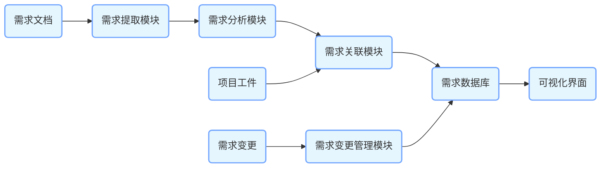

# 智能需求跟踪:AI辅助项目管理新工具

> 关键词：智能需求跟踪、AI、项目管理、需求管理、工具、软件开发、效率提升

> 摘要：本文聚焦于智能需求跟踪这一借助AI实现的项目管理新工具。首先介绍了该工具产生的背景及相关概念，深入剖析其核心概念与联系、算法原理及数学模型。通过项目实战展示了其在实际中的应用与实现方式，探讨了其实际应用场景。同时推荐了学习、开发所需的工具和资源，最后总结了其未来发展趋势与挑战，并给出常见问题解答和参考资料，旨在全面深入地为读者呈现智能需求跟踪这一AI辅助项目管理新工具的全貌。

## 1. 背景介绍 
### 1.1 目的和范围
在当今快节奏的项目开发环境中，需求管理是项目成功的关键因素之一。随着项目规模的不断扩大和复杂度的增加，传统的需求跟踪方式已经难以满足高效、准确的管理需求。智能需求跟踪作为一种新兴的AI辅助项目管理工具应运而生，其目的在于利用人工智能技术提高需求跟踪的效率和准确性，降低项目风险，确保项目能够按照预期目标顺利进行。

本文章的范围涵盖了智能需求跟踪工具的核心概念、算法原理、数学模型、实际应用案例等多个方面，旨在为读者全面介绍这一工具的原理、实现和应用。

### 1.2 预期读者
本文预期读者包括项目管理人员、软件开发人员、人工智能研究人员以及对项目管理和人工智能技术感兴趣的相关人员。项目管理人员可以从中了解如何利用智能需求跟踪工具提升项目管理效率和质量；软件开发人员可以学习到该工具的技术实现细节；人工智能研究人员可以探讨相关算法的优化和创新；而对该领域感兴趣的人员则可以通过本文对智能需求跟踪工具有一个全面的认识。

### 1.3 文档结构概述
本文将按照以下结构进行阐述：首先介绍智能需求跟踪工具的背景知识，包括目的、预期读者和文档结构概述等内容；接着深入探讨其核心概念与联系，包括原理和架构；然后详细讲解核心算法原理及具体操作步骤，并给出相应的Python源代码；之后介绍相关的数学模型和公式，并举例说明；通过项目实战展示代码实际案例和详细解释说明；探讨智能需求跟踪工具的实际应用场景；推荐学习和开发所需的工具和资源；最后总结其未来发展趋势与挑战，给出常见问题解答和参考资料。

### 1.4 术语表
#### 1.4.1 核心术语定义
- **智能需求跟踪**：利用人工智能技术对项目需求进行跟踪和管理的过程，包括需求的识别、关联、变更管理等。
- **需求管理**：对项目需求进行定义、记录、跟踪和控制的过程，确保需求的完整性、一致性和可追溯性。
- **项目管理**：对项目从启动到结束的全过程进行计划、组织、协调、控制和监督的活动，以实现项目的目标。
- **人工智能（AI）**：研究如何使计算机系统能够模拟人类智能的技术和方法，包括机器学习、自然语言处理等。
- **机器学习**：让计算机通过数据学习模式和规律，从而实现预测和决策的技术。

#### 1.4.2 相关概念解释
- **需求跟踪矩阵**：一种用于记录需求与其他项目工件（如设计文档、测试用例等）之间关系的表格，便于跟踪需求的实现情况。
- **自然语言处理（NLP）**：人工智能的一个分支，研究如何使计算机能够理解、处理和生成人类语言。在智能需求跟踪中，NLP技术可用于对需求文本进行分析和理解。
- **数据挖掘**：从大量数据中发现有价值信息和知识的过程。在智能需求跟踪中，数据挖掘技术可用于分析需求数据，发现潜在的问题和趋势。

#### 1.4.3 缩略词列表
- **AI**：Artificial Intelligence（人工智能）
- **NLP**：Natural Language Processing（自然语言处理）
- **ML**：Machine Learning（机器学习）

## 2. 核心概念与联系 

### 核心概念原理
智能需求跟踪的核心原理是利用人工智能技术对项目需求进行自动化的跟踪和管理。其主要步骤包括需求的提取、分析、关联和变更管理。

- **需求提取**：从各种需求文档（如用户故事、需求规格说明书等）中提取出关键的需求信息。这通常涉及到自然语言处理技术，如文本分词、词性标注、命名实体识别等，以将非结构化的文本转换为结构化的数据。
- **需求分析**：对提取的需求信息进行分析，包括需求的分类、优先级排序、复杂度评估等。机器学习算法可以用于对需求进行分类和预测，例如根据需求的特征预测其可能的变更频率和风险程度。
- **需求关联**：将需求与项目的其他工件（如设计文档、代码模块、测试用例等）进行关联，建立需求跟踪矩阵。这有助于确保项目的各个部分都与需求保持一致，并且能够及时发现需求变更对其他部分的影响。
- **需求变更管理**：当需求发生变更时，智能需求跟踪工具能够自动识别变更的内容，并评估其对项目的影响。它可以提醒相关人员进行必要的调整，确保项目的进度和质量不受影响。

### 架构示意图

该架构图展示了智能需求跟踪工具的主要组成部分和工作流程。需求文档作为输入，经过需求提取、分析和关联模块处理后，存储在需求数据库中。项目工件与需求进行关联，需求变更通过变更管理模块进行处理。最后，通过可视化界面将需求信息呈现给用户。

## 3. 核心算法原理 & 具体操作步骤 

### 需求提取算法原理及Python实现
需求提取的主要任务是从文本中提取出关键的需求信息。这里我们可以使用自然语言处理库`nltk`和`spaCy`来实现。以下是一个简单的需求提取示例代码：

```python
import nltk
from nltk.tokenize import word_tokenize
import spacy

# 下载必要的nltk数据
nltk.download('punkt')

# 加载spaCy模型
nlp = spacy.load('en_core_web_sm')

def extract_requirements(text):
    # 分词
    tokens = word_tokenize(text)
    
    # 使用spaCy进行命名实体识别
    doc = nlp(text)
    entities = []
    for ent in doc.ents:
        entities.append((ent.text, ent.label_))
    
    # 简单的需求提取逻辑：假设包含“should”的句子为需求
    sentences = nltk.sent_tokenize(text)
    requirements = []
    for sentence in sentences:
        if "should" in sentence.lower():
            requirements.append(sentence)
    
    return tokens, entities, requirements

# 示例文本
text = "The system should support user registration. The user name should be unique. This is a sample text."
tokens, entities, requirements = extract_requirements(text)

print("Tokens:", tokens)
print("Entities:", entities)
print("Requirements:", requirements)
```
### 具体操作步骤
1. **数据准备**：收集项目的需求文档，将其转换为文本格式。
2. **安装必要的库**：使用`pip`安装`nltk`和`spaCy`库，并下载相应的数据和模型。
3. **运行代码**：将需求文本作为输入，调用`extract_requirements`函数进行需求提取。
4. **结果分析**：分析提取的分词、实体和需求信息，根据需要进行进一步的处理。

### 需求分析算法原理及Python实现
需求分析的主要任务是对提取的需求进行分类和优先级排序。这里我们可以使用机器学习算法，如朴素贝叶斯分类器。以下是一个简单的需求分类示例代码：

```python
from sklearn.feature_extraction.text import CountVectorizer
from sklearn.naive_bayes import MultinomialNB
from sklearn.model_selection import train_test_split
from sklearn.metrics import accuracy_score

# 示例需求数据和标签
requirements = ["The system should support user registration.", "The system should have a search function.", "The user interface should be user-friendly."]
labels = ["Registration", "Search", "UI"]

# 特征提取
vectorizer = CountVectorizer()
X = vectorizer.fit_transform(requirements)

# 划分训练集和测试集
X_train, X_test, y_train, y_test = train_test_split(X, labels, test_size=0.2, random_state=42)

# 训练模型
clf = MultinomialNB()
clf.fit(X_train, y_train)

# 预测
y_pred = clf.predict(X_test)

# 计算准确率
accuracy = accuracy_score(y_test, y_pred)
print("Accuracy:", accuracy)
```
### 具体操作步骤
1. **数据准备**：收集需求数据，并为每个需求标注相应的类别标签。
2. **特征提取**：使用`CountVectorizer`将需求文本转换为向量表示。
3. **划分数据集**：将数据集划分为训练集和测试集。
4. **训练模型**：使用`MultinomialNB`训练朴素贝叶斯分类器。
5. **预测和评估**：使用测试集进行预测，并计算准确率。

## 4. 数学模型和公式 & 详细讲解 & 举例说明 

### 需求分类的数学模型
在需求分类中，我们使用朴素贝叶斯分类器。朴素贝叶斯分类器基于贝叶斯定理，其基本公式为：

$$P(c|x)=\frac{P(x|c)P(c)}{P(x)}$$

其中，$P(c|x)$ 表示在给定特征 $x$ 的情况下，样本属于类别 $c$ 的概率；$P(x|c)$ 表示在类别 $c$ 下特征 $x$ 出现的概率；$P(c)$ 表示类别 $c$ 出现的先验概率；$P(x)$ 表示特征 $x$ 出现的概率。

在朴素贝叶斯分类器中，假设特征之间是相互独立的，即：

$$P(x|c)=\prod_{i=1}^{n}P(x_i|c)$$

其中，$x_i$ 表示第 $i$ 个特征。

### 详细讲解
- **先验概率 $P(c)$**：可以通过统计训练数据中每个类别的样本数量来估计。例如，如果训练数据中有 $N$ 个样本，其中类别 $c$ 的样本数量为 $N_c$，则 $P(c)=\frac{N_c}{N}$。
- **条件概率 $P(x_i|c)$**：可以通过统计训练数据中在类别 $c$ 下特征 $x_i$ 出现的频率来估计。例如，如果在类别 $c$ 的样本中，特征 $x_i$ 出现的次数为 $N_{x_i,c}$，则 $P(x_i|c)=\frac{N_{x_i,c}}{N_c}$。
- **后验概率 $P(c|x)$**：根据贝叶斯定理计算得到。在分类时，选择后验概率最大的类别作为样本的预测类别。

### 举例说明
假设我们有以下训练数据：

| 需求文本 | 类别 |
| --- | --- |
| The system should support user registration. | Registration |
| The system should have a search function. | Search |
| The user interface should be user-friendly. | UI |

我们要对新的需求文本 “The system should allow user login.” 进行分类。

1. **计算先验概率**：
    - 假设训练数据中 Registration 类别的样本数量为 1，Search 类别的样本数量为 1，UI 类别的样本数量为 1，总样本数量为 3。
    - 则 $P(Registration)=\frac{1}{3}$，$P(Search)=\frac{1}{3}$，$P(UI)=\frac{1}{3}$。
2. **计算条件概率**：
    - 假设 “user” 这个词在 Registration 类别的样本中出现 1 次，在 Search 类别的样本中出现 0 次，在 UI 类别的样本中出现 0 次。
    - 则 $P(user|Registration)=\frac{1}{1}=1$，$P(user|Search)=\frac{0}{1}=0$，$P(user|UI)=\frac{0}{1}=0$。
3. **计算后验概率**：
    - 对于新的需求文本，根据朴素贝叶斯分类器的公式计算每个类别的后验概率。
    - 假设只考虑 “user” 这个词，$P(Registration|user)=\frac{P(user|Registration)P(Registration)}{P(user)}$，$P(Search|user)=\frac{P(user|Search)P(Search)}{P(user)}$，$P(UI|user)=\frac{P(user|UI)P(UI)}{P(user)}$。
    - 由于 $P(user|Search)=P(user|UI)=0$，所以 $P(Search|user)=P(UI|user)=0$，而 $P(Registration|user)=\frac{1\times\frac{1}{3}}{P(user)}$。
    - 因此，预测该需求文本属于 Registration 类别。

## 5. 项目实战：代码实际案例和详细解释说明 

### 5.1  开发环境搭建
1. **安装Python**：确保系统中安装了Python 3.x 版本。可以从Python官方网站（https://www.python.org/downloads/）下载并安装。
2. **安装必要的库**：使用`pip`安装以下库：
    - `nltk`：用于自然语言处理。
    - `spaCy`：用于自然语言处理。
    - `scikit-learn`：用于机器学习。
    - `pandas`：用于数据处理。
    - `matplotlib`：用于数据可视化。

```bash
pip install nltk spacy scikit-learn pandas matplotlib
```
3. **下载spaCy模型**：下载英文的spaCy模型。

```bash
python -m spacy download en_core_web_sm
```
4. **下载nltk数据**：在Python中运行以下代码下载必要的nltk数据。

```python
import nltk
nltk.download('punkt')
```

### 5.2  源代码详细实现和代码解读
以下是一个完整的智能需求跟踪项目的示例代码：

```python
import nltk
from nltk.tokenize import word_tokenize
import spacy
from sklearn.feature_extraction.text import CountVectorizer
from sklearn.naive_bayes import MultinomialNB
from sklearn.model_selection import train_test_split
from sklearn.metrics import accuracy_score
import pandas as pd
import matplotlib.pyplot as plt

# 需求提取函数
def extract_requirements(text):
    tokens = word_tokenize(text)
    nlp = spacy.load('en_core_web_sm')
    doc = nlp(text)
    entities = []
    for ent in doc.ents:
        entities.append((ent.text, ent.label_))
    sentences = nltk.sent_tokenize(text)
    requirements = []
    for sentence in sentences:
        if "should" in sentence.lower():
            requirements.append(sentence)
    return tokens, entities, requirements

# 需求分类函数
def classify_requirements(requirements, labels):
    vectorizer = CountVectorizer()
    X = vectorizer.fit_transform(requirements)
    X_train, X_test, y_train, y_test = train_test_split(X, labels, test_size=0.2, random_state=42)
    clf = MultinomialNB()
    clf.fit(X_train, y_train)
    y_pred = clf.predict(X_test)
    accuracy = accuracy_score(y_test, y_pred)
    return accuracy

# 示例需求数据和标签
requirements = ["The system should support user registration.", "The system should have a search function.", "The user interface should be user-friendly."]
labels = ["Registration", "Search", "UI"]

# 需求提取
tokens, entities, extracted_requirements = extract_requirements(" ".join(requirements))

# 需求分类
accuracy = classify_requirements(requirements, labels)

# 数据可视化：需求类别分布
df = pd.DataFrame({"Category": labels})
category_counts = df["Category"].value_counts()
plt.bar(category_counts.index, category_counts.values)
plt.xlabel("Category")
plt.ylabel("Count")
plt.title("Requirement Category Distribution")
plt.show()

print("Tokens:", tokens)
print("Entities:", entities)
print("Extracted Requirements:", extracted_requirements)
print("Classification Accuracy:", accuracy)
```
### 代码解读
1. **需求提取函数 `extract_requirements`**：该函数接受一个文本作为输入，使用`nltk`进行分词，使用`spaCy`进行命名实体识别，然后根据包含 “should” 的句子提取需求信息。
2. **需求分类函数 `classify_requirements`**：该函数接受需求数据和标签作为输入，使用`CountVectorizer`将需求文本转换为向量表示，使用`MultinomialNB`训练朴素贝叶斯分类器，然后进行预测并计算准确率。
3. **数据可视化**：使用`pandas`和`matplotlib`对需求类别分布进行可视化展示。

### 5.3  代码解读与分析
- **需求提取**：通过自然语言处理技术，将非结构化的需求文本转换为结构化的数据，方便后续的分析和处理。
- **需求分类**：使用机器学习算法对需求进行分类，有助于对需求进行更好的管理和跟踪。
- **数据可视化**：通过可视化展示需求类别分布，可以直观地了解需求的结构和特点，为项目管理提供决策支持。

## 6. 实际应用场景 
### 软件开发项目
在软件开发项目中，智能需求跟踪工具可以帮助开发团队更好地管理需求。通过自动提取需求信息、分类和关联需求与代码模块，开发团队可以及时了解需求的实现情况，快速响应需求变更，提高开发效率和质量。例如，当需求发生变更时，工具可以自动提醒相关开发人员进行代码修改，并评估变更对其他功能的影响。

### 建筑工程项目
在建筑工程项目中，需求跟踪同样重要。智能需求跟踪工具可以帮助项目团队管理建筑设计需求、施工要求等。通过对需求文档的分析和关联，项目团队可以确保建筑设计符合客户需求，施工过程按照计划进行。例如，当设计变更时，工具可以自动更新相关的施工图纸和进度计划。

### 医疗项目
在医疗项目中，智能需求跟踪工具可以用于管理医疗设备的功能需求、医疗流程的优化需求等。通过对需求的跟踪和管理，医疗团队可以提高医疗服务的质量和效率。例如，当医疗设备的功能需求发生变更时，工具可以及时通知相关的技术人员进行设备升级。

## 7. 工具和资源推荐
### 7.1 学习资源推荐
#### 7.1.1 书籍推荐
- 《Python自然语言处理》：介绍了Python在自然语言处理中的应用，包括文本处理、分词、词性标注等技术。
- 《机器学习实战》：通过实际案例介绍了机器学习的基本算法和应用，包括分类、回归、聚类等。
- 《项目管理知识体系指南（PMBOK指南）》：全面介绍了项目管理的知识体系和方法，包括需求管理、进度管理、质量管理等。

#### 7.1.2 在线课程
- Coursera上的“自然语言处理专项课程”：由知名大学的教授授课，系统地介绍了自然语言处理的理论和实践。
- edX上的“机器学习基础”：提供了机器学习的基础知识和算法实现。
- Udemy上的“项目管理实战课程”：通过实际项目案例，讲解项目管理的方法和技巧。

#### 7.1.3 技术博客和网站
- 博客园：有许多技术博主分享自然语言处理、机器学习和项目管理的经验和技巧。
- 掘金：提供了丰富的技术文章和案例，包括人工智能、软件开发等领域。
- 开源中国：关注开源技术和项目，有很多关于智能需求跟踪工具的开源项目和讨论。

### 7.2 开发工具框架推荐
#### 7.2.1 IDE和编辑器
- PyCharm：一款专业的Python集成开发环境，提供了代码编辑、调试、版本控制等功能。
- Visual Studio Code：一款轻量级的代码编辑器，支持多种编程语言和插件扩展，适合快速开发和调试。

#### 7.2.2 调试和性能分析工具
- PDB：Python自带的调试器，可以帮助开发者定位和解决代码中的问题。
- cProfile：Python的性能分析工具，可以分析代码的运行时间和资源消耗情况。

#### 7.2.3 相关框架和库
- NLTK：自然语言处理工具包，提供了丰富的文本处理和分析功能。
- SpaCy：高效的自然语言处理库，支持多种语言和任务。
- Scikit-learn：机器学习库，提供了各种机器学习算法和工具。

### 7.3 相关论文著作推荐
#### 7.3.1 经典论文
- “A Survey on Requirements Engineering”：对需求工程的研究现状和发展趋势进行了全面的综述。
- “Machine Learning for Natural Language Processing”：介绍了机器学习在自然语言处理中的应用和发展。

#### 7.3.2 最新研究成果
- 关注顶级学术会议如ACM SIGSOFT FSE、IEEE ICSE等的相关论文，了解智能需求跟踪和项目管理领域的最新研究成果。

#### 7.3.3 应用案例分析
- 阅读相关的行业报告和案例分析，了解智能需求跟踪工具在不同领域的实际应用和效果。

## 8. 总结：未来发展趋势与挑战
### 未来发展趋势
- **更强大的人工智能技术应用**：随着人工智能技术的不断发展，智能需求跟踪工具将能够更准确地理解和分析需求文本，实现更智能化的需求管理。例如，利用深度学习算法进行需求分类和预测，提高分类的准确率和效率。
- **与其他项目管理工具的集成**：智能需求跟踪工具将与其他项目管理工具（如项目管理软件、版本控制系统等）进行更紧密的集成，实现数据的共享和协同工作。例如，当需求发生变更时，自动更新项目管理软件中的任务状态和进度计划。
- **可视化和交互性增强**：工具将提供更直观的可视化界面和交互功能，方便用户进行需求管理和跟踪。例如，通过图表和报表展示需求的状态和趋势，用户可以通过交互操作进行需求的查询和分析。

### 挑战
- **数据质量和隐私问题**：智能需求跟踪工具依赖于大量的需求数据进行训练和分析，数据的质量和隐私问题是需要解决的重要挑战。例如，如何确保数据的准确性和完整性，如何保护用户的隐私信息。
- **算法的可解释性**：人工智能算法（如深度学习算法）通常具有较高的复杂度，其决策过程难以解释。在智能需求跟踪中，如何提高算法的可解释性，让用户理解算法的决策依据，是一个需要解决的问题。
- **用户接受度**：新的工具和技术需要用户的接受和适应。如何提高用户对智能需求跟踪工具的接受度，让用户愿意使用和推广该工具，是一个挑战。

## 9. 附录：常见问题与解答
### 问题1：智能需求跟踪工具是否适用于所有类型的项目？
解答：智能需求跟踪工具适用于大多数类型的项目，但不同类型的项目可能需要对工具进行适当的定制和调整。例如，软件开发项目和建筑工程项目的需求特点和管理方式有所不同，需要根据具体情况选择合适的算法和方法。

### 问题2：如何确保需求提取的准确性？
解答：可以通过以下方法提高需求提取的准确性：使用更先进的自然语言处理技术，如深度学习模型；对提取的需求进行人工审核和修正；不断优化需求提取的算法和规则。

### 问题3：智能需求跟踪工具的性能如何？
解答：智能需求跟踪工具的性能取决于多个因素，如数据量、算法复杂度、硬件环境等。在实际应用中，可以通过优化算法、使用分布式计算等方法提高工具的性能。

### 问题4：如何保护需求数据的隐私？
解答：可以采取以下措施保护需求数据的隐私：对数据进行加密处理；限制数据的访问权限；遵守相关的法律法规和隐私政策。

## 10. 扩展阅读 & 参考资料
### 扩展阅读
- 《人工智能简史》：了解人工智能的发展历程和重要里程碑。
- 《软件需求最佳实践：SERU过程框架原理与应用》：深入学习软件需求管理的最佳实践和方法。

### 参考资料
- 相关学术论文和研究报告
- 开源项目的文档和代码
- 工具和库的官方文档和教程