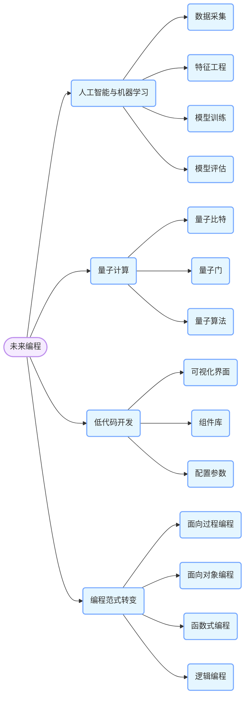

# 未来编程的挑战与机遇

> 关键词：未来编程、挑战、机遇、人工智能、量子计算、低代码开发、编程范式转变

> 摘要：本文深入探讨了未来编程领域所面临的挑战与蕴含的机遇。随着科技的飞速发展，编程领域正经历着前所未有的变革。我们将分析诸如人工智能与机器学习的崛起、量子计算的潜在影响、编程范式的转变等带来的挑战，同时也会挖掘低代码开发、跨学科融合、新兴技术应用等方面带来的机遇。旨在为编程从业者、研究者以及对编程领域感兴趣的人士提供全面且深入的洞察，以便更好地应对未来编程发展的趋势。

## 1. 背景介绍 
### 1.1 目的和范围
本文的目的在于全面剖析未来编程领域可能面临的各种挑战以及其中蕴含的巨大机遇。范围涵盖了从当前主流的编程技术发展趋势到新兴技术对编程的影响，包括但不限于人工智能、量子计算、物联网等领域。通过对这些方面的研究，帮助读者了解未来编程的发展方向，为个人的职业发展和技术创新提供参考。

### 1.2 预期读者
本文预期读者包括编程从业者，如软件开发者、程序员、系统架构师等，他们可以从文中获取未来编程技术发展的信息，以便在工作中做出更明智的技术选择和职业规划。同时，也适合计算机科学相关专业的学生，帮助他们了解行业动态，明确学习方向。此外，对编程领域感兴趣的研究者和爱好者也能从本文中获得有价值的见解。

### 1.3 文档结构概述
本文首先介绍了背景信息，包括目的、预期读者和文档结构概述等。接着阐述了未来编程的核心概念与联系，通过文本示意图和 Mermaid 流程图进行直观展示。然后详细讲解了相关的核心算法原理及具体操作步骤，结合 Python 源代码进行说明。之后介绍了数学模型和公式，并通过举例进行详细讲解。再通过项目实战，给出代码实际案例并进行详细解释说明。随后探讨了未来编程的实际应用场景。接着推荐了相关的工具和资源，包括学习资源、开发工具框架以及相关论文著作。最后总结了未来编程的发展趋势与挑战，并提供了常见问题与解答以及扩展阅读和参考资料。

### 1.4 术语表
#### 1.4.1 核心术语定义
- **人工智能（Artificial Intelligence，AI）**：指让计算机模拟人类智能的一系列技术和方法，包括机器学习、深度学习、自然语言处理等。
- **量子计算（Quantum Computing）**：基于量子力学原理的计算方式，利用量子比特的叠加和纠缠特性，具有远超传统计算机的计算能力。
- **低代码开发（Low - Code Development）**：一种通过可视化界面和少量代码来快速创建应用程序的开发方法，降低了编程的门槛。
- **编程范式（Programming Paradigm）**：指编程的基本风格和方法，如面向对象编程、函数式编程、逻辑编程等。

#### 1.4.2 相关概念解释
- **机器学习（Machine Learning）**：是人工智能的一个分支，通过让计算机从数据中学习模式和规律，从而实现预测和决策等功能。
- **深度学习（Deep Learning）**：是机器学习的一种，基于人工神经网络，通过多层神经元对数据进行学习和处理，在图像识别、语音识别等领域取得了巨大成功。
- **物联网（Internet of Things，IoT）**：将各种物理设备通过网络连接起来，实现设备之间的通信和数据交换，从而实现智能化的管理和控制。

#### 1.4.3 缩略词列表
- **AI**：Artificial Intelligence（人工智能）
- **ML**：Machine Learning（机器学习）
- **DL**：Deep Learning（深度学习）
- **IoT**：Internet of Things（物联网）
- **QC**：Quantum Computing（量子计算）

## 2. 核心概念与联系 
### 核心概念原理

#### 人工智能与机器学习
人工智能是一个广泛的领域，旨在让计算机模拟人类的智能行为。机器学习作为人工智能的重要分支，通过数据驱动的方式让计算机自动学习和改进。其基本原理是从大量的数据中提取特征，构建模型，然后利用模型进行预测和决策。例如，在图像识别中，机器学习算法可以学习图像的特征，从而识别出图像中的物体。

#### 量子计算
量子计算基于量子力学原理，利用量子比特（qubit）的叠加和纠缠特性进行计算。与传统的二进制比特不同，量子比特可以同时处于 0 和 1 的叠加态，这使得量子计算机在处理某些问题时具有指数级的速度提升。例如，在密码破解、复杂优化问题等方面，量子计算具有巨大的潜力。

#### 低代码开发
低代码开发是一种可视化的开发方法，通过拖拽组件、配置参数等方式来快速创建应用程序。它降低了编程的门槛，使得非专业程序员也能够参与到应用开发中来。低代码开发平台通常提供了丰富的组件库和模板，开发者可以根据需求进行定制和扩展。

#### 编程范式转变
编程范式是编程的基本风格和方法，不同的编程范式适用于不同的场景和问题。随着技术的发展，编程范式也在不断演变。例如，从传统的面向过程编程到面向对象编程，再到函数式编程和逻辑编程等。编程范式的转变可以提高代码的可维护性、可扩展性和性能。

### 架构的文本示意图
```plaintext
未来编程
|-- 人工智能与机器学习
|   |-- 数据采集
|   |-- 特征工程
|   |-- 模型训练
|   |-- 模型评估
|-- 量子计算
|   |-- 量子比特
|   |-- 量子门
|   |-- 量子算法
|-- 低代码开发
|   |-- 可视化界面
|   |-- 组件库
|   |-- 配置参数
|-- 编程范式转变
|   |-- 面向过程编程
|   |-- 面向对象编程
|   |-- 函数式编程
|   |-- 逻辑编程
```

### Mermaid 流程图


## 3. 核心算法原理 & 具体操作步骤 

### 人工智能与机器学习 - 线性回归算法原理及操作步骤

#### 算法原理
线性回归是一种基本的机器学习算法，用于建立自变量和因变量之间的线性关系。其数学模型可以表示为：

$$y = \theta_0 + \theta_1x_1 + \theta_2x_2 + \cdots + \theta_nx_n + \epsilon$$

其中，$y$ 是因变量，$x_1, x_2, \cdots, x_n$ 是自变量，$\theta_0, \theta_1, \cdots, \theta_n$ 是模型的参数，$\epsilon$ 是误差项。线性回归的目标是找到一组最优的参数 $\theta$，使得预测值与真实值之间的误差最小。通常使用最小二乘法来求解参数，即最小化误差平方和：

$$J(\theta) = \frac{1}{2m}\sum_{i = 1}^{m}(h_{\theta}(x^{(i)}) - y^{(i)})^2$$

其中，$m$ 是样本数量，$h_{\theta}(x^{(i)})$ 是第 $i$ 个样本的预测值，$y^{(i)}$ 是第 $i$ 个样本的真实值。

#### 具体操作步骤
1. **数据准备**：收集和整理数据集，将数据集分为训练集和测试集。
2. **特征选择**：选择与因变量相关的自变量作为特征。
3. **模型训练**：使用训练集数据训练线性回归模型，求解最优参数 $\theta$。
4. **模型评估**：使用测试集数据评估模型的性能，常用的评估指标包括均方误差（MSE）、均方根误差（RMSE）、决定系数（$R^2$）等。
5. **模型预测**：使用训练好的模型对新数据进行预测。

#### Python 源代码实现
```python
import numpy as np
from sklearn.model_selection import train_test_split
from sklearn.linear_model import LinearRegression
from sklearn.metrics import mean_squared_error, r2_score

# 生成示例数据
np.random.seed(0)
X = 2 * np.random.rand(100, 1)
y = 4 + 3 * X + np.random.randn(100, 1)

# 划分训练集和测试集
X_train, X_test, y_train, y_test = train_test_split(X, y, test_size=0.2, random_state=42)

# 创建线性回归模型
model = LinearRegression()

# 模型训练
model.fit(X_train, y_train)

# 模型预测
y_pred = model.predict(X_test)

# 模型评估
mse = mean_squared_error(y_test, y_pred)
rmse = np.sqrt(mse)
r2 = r2_score(y_test, y_pred)

print(f"均方误差 (MSE): {mse}")
print(f"均方根误差 (RMSE): {rmse}")
print(f"决定系数 (R^2): {r2}")
```

### 量子计算 - 量子比特翻转算法原理及操作步骤

#### 算法原理
量子比特翻转是量子计算中的基本操作，通过量子门来实现。常用的量子门包括 Pauli - X 门，它可以将量子比特从 $|0\rangle$ 状态翻转到 $|1\rangle$ 状态，或者从 $|1\rangle$ 状态翻转到 $|0\rangle$ 状态。其矩阵表示为：

$$X = \begin{bmatrix}
0 & 1 \\
1 & 0
\end{bmatrix}$$

#### 具体操作步骤
1. **初始化量子比特**：将量子比特初始化为 $|0\rangle$ 或 $|1\rangle$ 状态。
2. **应用量子门**：使用 Pauli - X 门对量子比特进行翻转操作。
3. **测量量子比特**：对翻转后的量子比特进行测量，得到测量结果。

#### Python 源代码实现（使用 Qiskit 库）
```python
from qiskit import QuantumCircuit, Aer, execute

# 创建一个量子电路，包含 1 个量子比特和 1 个经典比特
qc = QuantumCircuit(1, 1)

# 初始化量子比特为 |0> 状态
qc.initialize([1, 0], 0)

# 应用 Pauli - X 门
qc.x(0)

# 测量量子比特
qc.measure(0, 0)

# 使用 Aer 模拟器进行模拟
backend = Aer.get_backend('qasm_simulator')
job = execute(qc, backend, shots=1000)
result = job.result()
counts = result.get_counts(qc)

print(f"测量结果: {counts}")
```

## 4. 数学模型和公式 & 详细讲解 & 举例说明 

### 线性回归的数学模型和公式

#### 数学模型
线性回归的数学模型可以表示为：

$$y = \theta_0 + \theta_1x_1 + \theta_2x_2 + \cdots + \theta_nx_n + \epsilon$$

其中，$y$ 是因变量，$x_1, x_2, \cdots, x_n$ 是自变量，$\theta_0, \theta_1, \cdots, \theta_n$ 是模型的参数，$\epsilon$ 是误差项。

#### 损失函数
线性回归通常使用最小二乘法来求解参数，其损失函数为：

$$J(\theta) = \frac{1}{2m}\sum_{i = 1}^{m}(h_{\theta}(x^{(i)}) - y^{(i)})^2$$

其中，$m$ 是样本数量，$h_{\theta}(x^{(i)})$ 是第 $i$ 个样本的预测值，$y^{(i)}$ 是第 $i$ 个样本的真实值。

#### 求解参数
为了找到最优的参数 $\theta$，需要对损失函数 $J(\theta)$ 求偏导数，并令其等于 0。对于简单的线性回归（只有一个自变量），参数的解为：

$$\theta_1 = \frac{\sum_{i = 1}^{m}(x^{(i)} - \bar{x})(y^{(i)} - \bar{y})}{\sum_{i = 1}^{m}(x^{(i)} - \bar{x})^2}$$

$$\theta_0 = \bar{y} - \theta_1\bar{x}$$

其中，$\bar{x}$ 和 $\bar{y}$ 分别是自变量和因变量的均值。

#### 举例说明
假设我们有以下数据集：

| $x$ | $y$ |
|---|---|
| 1 | 3 |
| 2 | 5 |
| 3 | 7 |
| 4 | 9 |
| 5 | 11 |

首先计算均值：

$$\bar{x} = \frac{1 + 2 + 3 + 4 + 5}{5} = 3$$

$$\bar{y} = \frac{3 + 5 + 7 + 9 + 11}{5} = 7$$

然后计算 $\theta_1$：

$$\sum_{i = 1}^{5}(x^{(i)} - \bar{x})(y^{(i)} - \bar{y}) = (1 - 3)(3 - 7) + (2 - 3)(5 - 7) + (3 - 3)(7 - 7) + (4 - 3)(9 - 7) + (5 - 3)(11 - 7) = 20$$

$$\sum_{i = 1}^{5}(x^{(i)} - \bar{x})^2 = (1 - 3)^2 + (2 - 3)^2 + (3 - 3)^2 + (4 - 3)^2 + (5 - 3)^2 = 10$$

$$\theta_1 = \frac{20}{10} = 2$$

最后计算 $\theta_0$：

$$\theta_0 = \bar{y} - \theta_1\bar{x} = 7 - 2 \times 3 = 1$$

所以，线性回归模型为 $y = 1 + 2x$。

### 量子计算的数学模型和公式

#### 量子比特的状态表示
量子比特可以用二维复向量空间中的向量来表示，例如，$|0\rangle$ 状态可以表示为：

$$|0\rangle = \begin{bmatrix}
1 \\
0
\end{bmatrix}$$

$|1\rangle$ 状态可以表示为：

$$|1\rangle = \begin{bmatrix}
0 \\
1
\end{bmatrix}$$

一般情况下，量子比特的状态可以表示为：

$$|\psi\rangle = \alpha|0\rangle + \beta|1\rangle$$

其中，$\alpha$ 和 $\beta$ 是复数，且满足 $|\alpha|^2 + |\beta|^2 = 1$。

#### 量子门的矩阵表示
量子门可以用矩阵来表示，例如，Pauli - X 门的矩阵表示为：

$$X = \begin{bmatrix}
0 & 1 \\
1 & 0
\end{bmatrix}$$

对量子比特 $|\psi\rangle$ 应用 Pauli - X 门的操作可以表示为矩阵乘法：

$$X|\psi\rangle = \begin{bmatrix}
0 & 1 \\
1 & 0
\end{bmatrix}\begin{bmatrix}
\alpha \\
\beta
\end{bmatrix} = \begin{bmatrix}
\beta \\
\alpha
\end{bmatrix}$$

#### 举例说明
假设量子比特的初始状态为 $|0\rangle$，应用 Pauli - X 门：

$$X|0\rangle = \begin{bmatrix}
0 & 1 \\
1 & 0
\end{bmatrix}\begin{bmatrix}
1 \\
0
\end{bmatrix} = \begin{bmatrix}
0 \\
1
\end{bmatrix} = |1\rangle$$

所以，量子比特从 $|0\rangle$ 状态翻转到了 $|1\rangle$ 状态。

## 5. 项目实战：代码实际案例和详细解释说明 

### 5.1  开发环境搭建
#### 人工智能与机器学习项目
- **Python 环境**：安装 Python 3.7 或更高版本。
- **开发工具**：推荐使用 PyCharm 或 Jupyter Notebook。
- **库安装**：安装必要的库，如 `numpy`、`pandas`、`scikit - learn`、`matplotlib` 等。可以使用以下命令进行安装：
```bash
pip install numpy pandas scikit-learn matplotlib
```

#### 量子计算项目
- **Python 环境**：同样需要 Python 3.7 或更高版本。
- **开发工具**：可以使用 Jupyter Notebook 或 VS Code。
- **库安装**：安装 Qiskit 库，使用以下命令进行安装：
```bash
pip install qiskit
```

### 5.2  源代码详细实现和代码解读

#### 人工智能与机器学习项目 - 房价预测

```python
import numpy as np
import pandas as pd
from sklearn.model_selection import train_test_split
from sklearn.linear_model import LinearRegression
from sklearn.metrics import mean_squared_error, r2_score
import matplotlib.pyplot as plt

# 加载数据集
data = pd.read_csv('housing.csv')

# 数据预处理
X = data.drop('price', axis=1)
y = data['price']

# 划分训练集和测试集
X_train, X_test, y_train, y_test = train_test_split(X, y, test_size=0.2, random_state=42)

# 创建线性回归模型
model = LinearRegression()

# 模型训练
model.fit(X_train, y_train)

# 模型预测
y_pred = model.predict(X_test)

# 模型评估
mse = mean_squared_error(y_test, y_pred)
rmse = np.sqrt(mse)
r2 = r2_score(y_test, y_pred)

print(f"均方误差 (MSE): {mse}")
print(f"均方根误差 (RMSE): {rmse}")
print(f"决定系数 (R^2): {r2}")

# 可视化预测结果
plt.scatter(y_test, y_pred)
plt.xlabel('实际房价')
plt.ylabel('预测房价')
plt.title('实际房价 vs 预测房价')
plt.show()
```

**代码解读**：
1. **数据加载**：使用 `pandas` 库的 `read_csv` 函数加载房价数据集。
2. **数据预处理**：将特征数据和目标数据分离，即 `X` 为特征数据，`y` 为目标数据（房价）。
3. **划分数据集**：使用 `train_test_split` 函数将数据集划分为训练集和测试集，测试集占比 20%。
4. **模型创建**：创建一个线性回归模型 `LinearRegression()`。
5. **模型训练**：使用训练集数据对模型进行训练，调用 `fit` 方法。
6. **模型预测**：使用测试集数据进行预测，调用 `predict` 方法。
7. **模型评估**：使用均方误差（MSE）、均方根误差（RMSE）和决定系数（$R^2$）对模型进行评估。
8. **可视化**：使用 `matplotlib` 库绘制实际房价和预测房价的散点图，直观展示模型的预测效果。

#### 量子计算项目 - 量子比特叠加态

```python
from qiskit import QuantumCircuit, Aer, execute
import matplotlib.pyplot as plt

# 创建一个量子电路，包含 1 个量子比特和 1 个经典比特
qc = QuantumCircuit(1, 1)

# 应用 Hadamard 门，创建叠加态
qc.h(0)

# 测量量子比特
qc.measure(0, 0)

# 使用 Aer 模拟器进行模拟
backend = Aer.get_backend('qasm_simulator')
job = execute(qc, backend, shots=1000)
result = job.result()
counts = result.get_counts(qc)

# 可视化测量结果
from qiskit.visualization import plot_histogram
plot_histogram(counts).show()
```

**代码解读**：
1. **量子电路创建**：使用 `QuantumCircuit` 类创建一个包含 1 个量子比特和 1 个经典比特的量子电路。
2. **创建叠加态**：使用 Hadamard 门（`h` 方法）将量子比特从 $|0\rangle$ 状态转换为叠加态 $\frac{1}{\sqrt{2}}(|0\rangle + |1\rangle)$。
3. **测量量子比特**：使用 `measure` 方法对量子比特进行测量，将测量结果存储在经典比特中。
4. **模拟运行**：使用 Aer 模拟器（`qasm_simulator`）运行量子电路，设置模拟次数为 1000 次。
5. **结果获取**：使用 `result.get_counts(qc)` 方法获取测量结果的统计信息。
6. **可视化**：使用 `plot_histogram` 函数绘制测量结果的直方图，直观展示量子比特处于 $|0\rangle$ 和 $|1\rangle$ 状态的概率。

### 5.3  代码解读与分析

#### 人工智能与机器学习项目
- **优点**：线性回归模型简单易懂，计算效率高，适用于处理线性关系的数据集。通过均方误差、均方根误差和决定系数等评估指标，可以直观地了解模型的性能。
- **缺点**：线性回归模型假设自变量和因变量之间存在线性关系，对于复杂的非线性关系数据集，模型的性能可能不佳。此外，模型容易受到异常值的影响。

#### 量子计算项目
- **优点**：量子比特的叠加态可以同时表示多个状态，使得量子计算机在处理某些问题时具有指数级的速度提升。通过量子门的操作，可以实现复杂的量子算法。
- **缺点**：目前量子计算技术还处于发展阶段，量子比特的稳定性和抗干扰能力较差，导致量子计算的结果存在一定的误差。此外，量子计算的硬件成本较高，限制了其广泛应用。

## 6. 实际应用场景 

### 人工智能与机器学习的应用场景
- **医疗领域**：疾病诊断、药物研发、医学影像分析等。例如，通过机器学习算法对医学影像进行分析，帮助医生更准确地诊断疾病。
- **金融领域**：风险评估、信用评分、股票预测等。例如，使用深度学习算法对金融数据进行分析，预测股票价格的走势。
- **交通领域**：自动驾驶、智能交通系统等。例如，通过人工智能技术实现自动驾驶汽车的环境感知、决策规划和控制。
- **教育领域**：个性化学习、智能辅导等。例如，根据学生的学习数据和行为习惯，为学生提供个性化的学习方案。

### 量子计算的应用场景
- **密码学**：量子加密技术可以提供更高的安全性，防止信息被窃取。例如，量子密钥分发技术可以实现无条件安全的通信。
- **材料科学**：量子计算可以模拟分子和材料的性质，加速新材料的研发。例如，通过量子计算模拟高温超导材料的性质，为材料科学的研究提供新的思路。
- **优化问题**：量子计算可以在短时间内找到复杂优化问题的最优解。例如，在物流配送、资源分配等领域，使用量子算法可以提高效率和降低成本。

### 低代码开发的应用场景
- **企业内部应用开发**：快速开发企业内部的管理系统、办公系统等，满足企业的个性化需求。例如，使用低代码开发平台快速创建一个员工考勤管理系统。
- **创业公司**：创业公司可以利用低代码开发平台快速验证产品想法，降低开发成本和时间。例如，一个创业公司可以使用低代码开发平台快速创建一个电商平台的原型。

### 编程范式转变的应用场景
- **大规模软件开发**：面向对象编程和函数式编程等范式可以提高代码的可维护性和可扩展性，适用于大规模软件开发项目。例如，在开发一个大型的电商系统时，使用面向对象编程范式可以更好地组织代码结构。
- **数据处理和分析**：函数式编程范式在数据处理和分析领域具有优势，因为它强调不可变数据和纯函数，避免了副作用。例如，在处理大数据时，使用函数式编程范式可以提高代码的并行性和性能。

## 7. 工具和资源推荐

### 7.1 学习资源推荐
#### 7.1.1 书籍推荐
- **《Python 机器学习实战》**：详细介绍了 Python 在机器学习领域的应用，包括各种机器学习算法的原理和实现。
- **《量子计算与量子信息》**：是量子计算领域的经典教材，全面介绍了量子计算的基本原理、算法和应用。
- **《低代码开发实战》**：介绍了低代码开发的基本概念、方法和实践案例，帮助读者快速掌握低代码开发技术。
- **《代码大全》**：是软件开发领域的经典著作，涵盖了编程的各个方面，包括编程范式、代码设计、调试等。

#### 7.1.2 在线课程
- **Coursera 上的《机器学习》课程**：由斯坦福大学的 Andrew Ng 教授授课，是机器学习领域的经典课程，适合初学者学习。
- **edX 上的《量子计算基础》课程**：介绍了量子计算的基本概念和原理，帮助读者了解量子计算的基础知识。
- **阿里云大学的《低代码开发入门与实践》课程**：讲解了低代码开发的流程和方法，通过实际案例让读者掌握低代码开发技术。

#### 7.1.3 技术博客和网站
- **Medium**：是一个技术博客平台，上面有很多关于编程、人工智能、量子计算等领域的优质文章。
- **GitHub**：是一个开源代码托管平台，上面有很多优秀的开源项目和代码示例，可以帮助读者学习和实践编程技术。
- **Stack Overflow**：是一个技术问答社区，当遇到编程问题时，可以在上面查找解决方案。

### 7.2 开发工具框架推荐
#### 7.2.1 IDE和编辑器
- **PyCharm**：是一款专门为 Python 开发设计的集成开发环境，具有代码自动补全、调试、版本控制等功能。
- **Visual Studio Code**：是一款轻量级的代码编辑器，支持多种编程语言，具有丰富的插件生态系统。
- **Jupyter Notebook**：是一个交互式的编程环境，适合进行数据分析、机器学习等领域的开发和实验。

#### 7.2.2 调试和性能分析工具
- **pdb**：是 Python 内置的调试工具，可以帮助开发者定位和解决代码中的问题。
- **cProfile**：是 Python 的性能分析工具，可以分析代码的运行时间和函数调用次数，帮助开发者优化代码性能。
- **Qiskit Pulse**：是 Qiskit 库中的一个模块，用于量子电路的脉冲级调试和性能分析。

#### 7.2.3 相关框架和库
- **TensorFlow**：是一个开源的机器学习框架，由 Google 开发，广泛应用于深度学习领域。
- **PyTorch**：是另一个流行的深度学习框架，具有动态图的优势，适合研究和开发。
- **Qiskit**：是 IBM 开发的量子计算框架，提供了量子电路的创建、模拟和运行等功能。
- **Mendix**：是一个低代码开发平台，提供了丰富的组件和模板，帮助开发者快速创建应用程序。

### 7.3 相关论文著作推荐
#### 7.3.1 经典论文
- **《A Logical Calculus of the Ideas Immanent in Nervous Activity》**：由 Warren McCulloch 和 Walter Pitts 发表，提出了人工神经网络的基本模型，是人工智能领域的经典论文。
- **《Quantum Computation and Shor's Factoring Algorithm》**：介绍了 Shor 算法，该算法可以在量子计算机上高效地分解大整数，对密码学领域产生了深远影响。

#### 7.3.2 最新研究成果
- **arXiv**：是一个预印本平台，上面有很多关于人工智能、量子计算等领域的最新研究成果。
- **IEEE Xplore**：是电气和电子工程师协会（IEEE）的数字图书馆，提供了大量的学术论文和研究报告。

#### 7.3.3 应用案例分析
- **ACM Digital Library**：是美国计算机协会（ACM）的数字图书馆，上面有很多关于编程、软件开发等领域的应用案例分析。
- **MIT Technology Review**：是麻省理工学院的技术评论杂志，经常发表一些关于新兴技术应用案例的文章。

## 8. 总结：未来发展趋势与挑战

### 未来发展趋势
- **人工智能与机器学习的深入发展**：人工智能和机器学习将继续在各个领域发挥重要作用，如医疗、金融、交通等。深度学习、强化学习等技术将不断发展和创新，推动人工智能的智能化水平不断提高。
- **量子计算的突破**：随着量子计算技术的不断发展，量子计算机的性能将不断提高，应用领域将不断扩大。量子算法的研究也将取得新的突破，为解决复杂问题提供更高效的方法。
- **低代码开发的普及**：低代码开发将越来越受到企业和开发者的青睐，成为快速开发应用程序的主流方法。低代码开发平台将不断完善和优化，提供更多的功能和服务。
- **编程范式的多元化**：未来编程范式将更加多元化，不同的编程范式将相互融合，以满足不同场景和问题的需求。例如，面向对象编程和函数式编程的结合，将提高代码的可维护性和性能。

### 挑战
- **技术复杂性**：人工智能、量子计算等新兴技术的复杂性较高，需要开发者具备深厚的专业知识和技能。学习和掌握这些技术需要花费大量的时间和精力。
- **数据安全和隐私问题**：随着人工智能和物联网的发展，数据量不断增加，数据安全和隐私问题日益突出。如何保护用户的数据安全和隐私，是未来编程面临的重要挑战之一。
- **人才短缺**：新兴技术的发展导致对相关人才的需求急剧增加，而目前相关领域的人才短缺问题较为严重。培养和吸引高素质的编程人才是未来编程发展的关键。
- **伦理和法律问题**：人工智能、量子计算等技术的发展也带来了一系列伦理和法律问题，如人工智能的决策责任、量子计算对密码学的影响等。如何制定相应的伦理和法律规范，是未来编程发展需要解决的重要问题。

## 9. 附录：常见问题与解答

### 人工智能与机器学习相关问题
- **问**：如何选择合适的机器学习算法？
**答**：选择合适的机器学习算法需要考虑多个因素，如数据集的规模、特征的类型、问题的类型（分类、回归等）等。一般来说，可以先对数据集进行初步分析，然后尝试不同的算法，通过评估指标选择性能最优的算法。

- **问**：机器学习模型过拟合怎么办？
**答**：过拟合是指模型在训练集上表现很好，但在测试集上表现不佳的情况。可以通过增加数据集、正则化、减少特征数量等方法来解决过拟合问题。

### 量子计算相关问题
- **问**：量子计算和传统计算有什么区别？
**答**：量子计算基于量子力学原理，利用量子比特的叠加和纠缠特性进行计算，具有远超传统计算机的计算能力。传统计算基于二进制比特，每次只能处理一个状态。

- **问**：量子计算目前面临哪些挑战？
**答**：量子计算目前面临的挑战包括量子比特的稳定性和抗干扰能力较差、量子计算的硬件成本较高、量子算法的设计和实现难度较大等。

### 低代码开发相关问题
- **问**：低代码开发适合所有的应用开发吗？
**答**：低代码开发适合一些简单的、标准化的应用开发，对于复杂的、定制化程度高的应用开发，可能需要结合传统的编程方法。

- **问**：低代码开发的性能如何？
**答**：低代码开发平台通常会对性能进行优化，但由于其可视化和配置化的特点，可能在性能上不如手动编写的代码。在实际应用中，需要根据具体需求进行权衡。

### 编程范式相关问题
- **问**：不同的编程范式有什么优缺点？
**答**：面向过程编程的优点是简单易懂，缺点是代码的可维护性和可扩展性较差；面向对象编程的优点是代码的可维护性和可扩展性好，缺点是学习成本较高；函数式编程的优点是代码的并行性和性能好，缺点是可读性较差。

- **问**：如何选择合适的编程范式？
**答**：选择合适的编程范式需要考虑问题的类型、项目的规模、团队的技术水平等因素。一般来说，对于简单的项目可以选择面向过程编程，对于大规模的项目可以选择面向对象编程或函数式编程。

## 10. 扩展阅读 & 参考资料

### 扩展阅读
- **《人工智能时代》**：探讨了人工智能对社会、经济、文化等方面的影响，帮助读者了解人工智能的发展趋势和挑战。
- **《量子物理史话》**：以通俗易懂的语言介绍了量子物理的发展历程和基本原理，为读者了解量子计算提供了基础。
- **《软件随想录》**：作者 Joel Spolsky 分享了自己在软件开发过程中的经验和见解，对于提高编程水平和软件开发能力有很大的帮助。

### 参考资料
- **《Python 官方文档》**：提供了 Python 语言的详细文档和教程，是学习 Python 的重要参考资料。
- **《Qiskit 官方文档》**：提供了 Qiskit 库的详细文档和示例代码，帮助读者学习和使用量子计算框架。
- **《Scikit - learn 官方文档》**：提供了 Scikit - learn 库的详细文档和教程，是学习机器学习的重要参考资料。