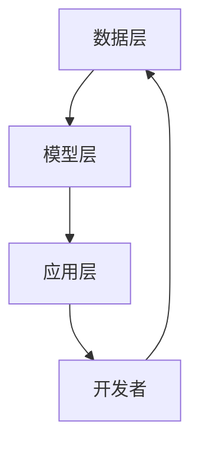
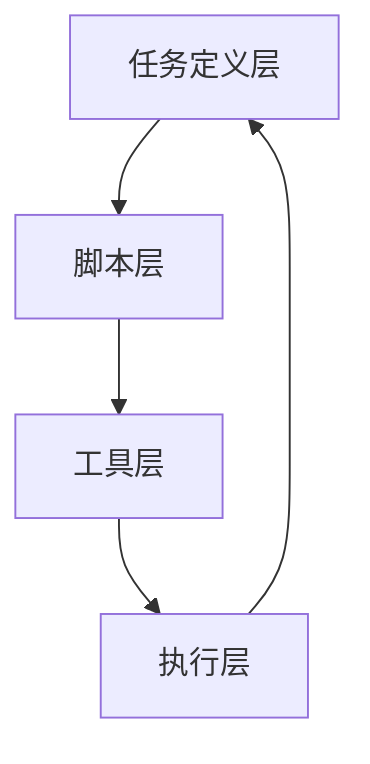

# 未来编程的趋势：智能化与自动化

> 关键词：未来编程、智能化、自动化、人工智能、机器学习、代码生成、自动测试

> 摘要：本文深入探讨了未来编程的两大核心趋势——智能化与自动化。随着科技的飞速发展，编程领域正经历着深刻的变革。智能化借助人工智能和机器学习技术，使编程工具能够理解代码语义、预测开发者意图，实现智能代码补全、智能调试等功能。自动化则体现在代码生成、自动测试、持续集成与部署等方面，大大提高了编程效率和软件质量。文章详细阐述了这些趋势的核心概念、算法原理、数学模型，并通过实际案例展示了其应用。同时，介绍了相关的学习资源、开发工具和研究成果，最后对未来编程的发展趋势与挑战进行了总结和展望。

## 1. 背景介绍 
### 1.1 目的和范围
随着信息技术的迅猛发展，编程在各个领域的应用日益广泛。本文章旨在探讨未来编程领域智能化与自动化的发展趋势，分析其核心概念、技术原理和实际应用。范围涵盖了从基础的编程概念到前沿的人工智能与自动化技术，以及它们在编程过程中的具体体现和影响。通过对这些趋势的研究，帮助开发者更好地理解未来编程的发展方向，为他们的学习和实践提供参考。

### 1.2 预期读者
本文的预期读者包括广大的程序员、软件开发者、软件架构师、技术爱好者以及对未来科技发展感兴趣的人士。对于程序员和开发者来说，文章可以帮助他们了解最新的技术趋势，提升自身的编程技能和竞争力。对于技术爱好者和关注未来科技的人士，文章可以让他们对编程领域的变革有更深入的认识。

### 1.3 文档结构概述
本文将按照以下结构进行阐述：首先介绍背景信息，包括目的、预期读者和文档结构概述。接着深入探讨核心概念与联系，包括智能化与自动化的原理和架构。然后详细讲解核心算法原理和具体操作步骤，通过Python代码进行说明。之后介绍数学模型和公式，并举例说明。再通过项目实战展示代码实际案例和详细解释。随后探讨实际应用场景。接着推荐相关的工具和资源，包括学习资源、开发工具框架和相关论文著作。最后总结未来发展趋势与挑战，并提供附录常见问题与解答以及扩展阅读和参考资料。

### 1.4 术语表
#### 1.4.1 核心术语定义
- **智能化编程**：利用人工智能和机器学习技术，使编程工具和环境能够理解代码语义、预测开发者意图，提供智能辅助功能，如智能代码补全、智能调试等。
- **自动化编程**：通过编写脚本或使用工具，自动完成编程过程中的一些重复性任务，如代码生成、自动测试、持续集成与部署等。
- **人工智能（AI）**：研究如何使计算机能够模拟人类的智能行为，如学习、推理、决策等。
- **机器学习（ML）**：人工智能的一个分支，通过让计算机从数据中学习模式和规律，从而实现预测和决策。
- **代码生成**：根据特定的需求和规则，自动生成代码的过程。
- **自动测试**：使用测试工具自动执行测试用例，检查软件的功能和性能是否符合预期。

#### 1.4.2 相关概念解释
- **深度学习**：机器学习的一种，通过构建多层神经网络，自动从大量数据中学习特征和模式，在图像识别、自然语言处理等领域取得了显著的成果。
- **自然语言处理（NLP）**：研究如何让计算机理解和处理人类语言的技术，包括文本分类、情感分析、机器翻译等。
- **持续集成（CI）**：软件开发过程中的一种实践，频繁地将代码集成到共享的代码库中，并自动进行构建和测试，以尽早发现和解决集成问题。
- **持续部署（CD）**：在持续集成的基础上，将通过测试的代码自动部署到生产环境中，实现软件的快速交付。

#### 1.4.3 缩略词列表
- **AI**：人工智能（Artificial Intelligence）
- **ML**：机器学习（Machine Learning）
- **NLP**：自然语言处理（Natural Language Processing）
- **CI**：持续集成（Continuous Integration）
- **CD**：持续部署（Continuous Deployment）

## 2. 核心概念与联系 
### 智能化编程的原理和架构
智能化编程的核心在于利用人工智能和机器学习技术，使编程工具能够理解代码的语义和上下文，预测开发者的意图，并提供智能辅助功能。其原理主要基于以下几个方面：

- **代码语义分析**：通过对代码的语法和语义进行分析，理解代码的功能和结构。例如，使用编译器的前端技术对代码进行解析，提取代码中的变量、函数、类等信息。
- **机器学习模型**：利用机器学习算法，如深度学习模型，对大量的代码数据进行训练，学习代码的模式和规律。例如，使用循环神经网络（RNN）或长短期记忆网络（LSTM）对代码序列进行建模，预测下一个代码片段。
- **自然语言处理技术**：将自然语言处理技术应用于编程领域，使开发者能够用自然语言描述需求，系统自动将其转换为代码。例如，使用语义解析技术将自然语言问题转换为代码逻辑。

智能化编程的架构可以分为以下几个层次：

- **数据层**：收集和存储大量的代码数据，包括开源代码库、代码片段、编程文档等。
- **模型层**：使用机器学习算法对代码数据进行训练，构建智能化的模型，如代码补全模型、代码生成模型等。
- **应用层**：将智能化模型集成到编程工具和环境中，如集成开发环境（IDE）、代码编辑器等，为开发者提供智能辅助功能。

以下是智能化编程的Mermaid流程图：


### 自动化编程的原理和架构
自动化编程的原理是通过编写脚本或使用工具，自动完成编程过程中的一些重复性任务，提高编程效率和软件质量。其主要原理包括：

- **脚本编程**：使用脚本语言，如Python、Shell等，编写自动化脚本，实现代码的自动生成、测试、部署等任务。
- **工具集成**：将各种开发工具集成在一起，通过配置文件或脚本实现自动化流程。例如，使用持续集成工具（如Jenkins、GitLab CI/CD）实现代码的自动构建和测试。
- **规则引擎**：定义一系列的规则和模板，根据输入的需求自动生成代码。例如，使用代码生成器根据数据库表结构自动生成数据访问层的代码。

自动化编程的架构可以分为以下几个层次：

- **任务定义层**：定义需要自动化完成的任务，如代码生成、测试、部署等。
- **脚本层**：编写实现任务的脚本，使用脚本语言或工具进行自动化操作。
- **工具层**：集成各种开发工具，如编译器、测试框架、版本控制系统等，实现自动化流程。
- **执行层**：执行自动化脚本和任务，监控任务的执行状态和结果。

以下是自动化编程的Mermaid流程图：


### 智能化与自动化的联系
智能化和自动化是未来编程的两个重要趋势，它们之间存在着密切的联系。智能化可以为自动化提供更智能的决策和指导，使自动化任务更加灵活和高效。例如，在代码生成过程中，智能化技术可以根据开发者的需求和上下文，自动生成更符合要求的代码。自动化则可以为智能化提供更多的数据和反馈，促进智能化技术的不断发展和优化。例如，通过自动化测试可以收集大量的测试数据，用于训练智能化的测试模型。

## 3. 核心算法原理 & 具体操作步骤 
### 智能代码补全算法原理及Python实现
智能代码补全是智能化编程的一个重要应用，其核心算法原理是基于机器学习的语言模型。下面以基于循环神经网络（RNN）的代码补全为例进行说明。

#### 算法原理
RNN是一种能够处理序列数据的神经网络，它可以根据前面的代码片段预测下一个代码片段。具体步骤如下：

1. **数据预处理**：将代码数据进行分词，将每个代码片段转换为对应的词向量。
2. **模型训练**：使用RNN模型对代码数据进行训练，学习代码的模式和规律。
3. **代码补全**：根据当前的代码片段，输入到训练好的RNN模型中，预测下一个可能的代码片段。

#### Python实现
```python
import numpy as np
import tensorflow as tf
from tensorflow.keras.preprocessing.text import Tokenizer
from tensorflow.keras.preprocessing.sequence import pad_sequences
from tensorflow.keras.models import Sequential
from tensorflow.keras.layers import Embedding, SimpleRNN, Dense

# 代码数据
code_data = [
    "def add(a, b):",
    "    return a + b",
    "def multiply(a, b):",
    "    return a * b"
]

# 数据预处理
tokenizer = Tokenizer()
tokenizer.fit_on_texts(code_data)
total_words = len(tokenizer.word_index) + 1

input_sequences = []
for line in code_data:
    token_list = tokenizer.texts_to_sequences([line])[0]
    for i in range(1, len(token_list)):
        n_gram_sequence = token_list[:i+1]
        input_sequences.append(n_gram_sequence)

max_sequence_len = max([len(x) for x in input_sequences])
input_sequences = np.array(pad_sequences(input_sequences, maxlen=max_sequence_len, padding='pre'))

xs, labels = input_sequences[:,:-1],input_sequences[:,-1]
ys = tf.keras.utils.to_categorical(labels, num_classes=total_words)

# 构建RNN模型
model = Sequential()
model.add(Embedding(total_words, 100, input_length=max_sequence_len-1))
model.add(SimpleRNN(100))
model.add(Dense(total_words, activation='softmax'))
model.compile(loss='categorical_crossentropy', optimizer='adam', metrics=['accuracy'])

# 训练模型
model.fit(xs, ys, epochs=100, verbose=1)

# 代码补全
seed_text = "def add("
next_words = 3

for _ in range(next_words):
    token_list = tokenizer.texts_to_sequences([seed_text])[0]
    token_list = pad_sequences([token_list], maxlen=max_sequence_len-1, padding='pre')
    predicted = model.predict_classes(token_list, verbose=0)
    output_word = ""
    for word, index in tokenizer.word_index.items():
        if index == predicted:
            output_word = word
            break
    seed_text += " " + output_word

print(seed_text)
```

### 自动化代码生成算法原理及Python实现
自动化代码生成是自动化编程的一个重要应用，其核心算法原理是基于规则的代码生成。下面以根据数据库表结构自动生成数据访问层代码为例进行说明。

#### 算法原理
1. **数据库表结构分析**：读取数据库表的结构信息，包括表名、字段名、字段类型等。
2. **代码模板定义**：定义数据访问层代码的模板，如类名、方法名、SQL语句等。
3. **代码生成**：根据数据库表结构信息和代码模板，生成数据访问层的代码。

#### Python实现
```python
import sqlite3

# 数据库表结构信息
def get_table_structure():
    conn = sqlite3.connect('example.db')
    cursor = conn.cursor()
    cursor.execute("PRAGMA table_info(users)")
    columns = cursor.fetchall()
    column_names = [column[1] for column in columns]
    column_types = [column[2] for column in columns]
    conn.close()
    return column_names, column_types

# 代码模板
code_template = """
class UserDAO:
    def __init__(self):
        self.conn = sqlite3.connect('example.db')
        self.cursor = self.conn.cursor()

    def get_user_by_id(self, user_id):
        query = "SELECT {columns} FROM users WHERE id = ?"
        self.cursor.execute(query.format(columns=", ".join({column_names})), (user_id,))
        return self.cursor.fetchone()

    def insert_user(self, {values}):
        query = "INSERT INTO users ({columns}) VALUES ({placeholders})"
        self.cursor.execute(query.format(columns=", ".join({column_names}), placeholders=", ".join(['?' for _ in {column_names}])), ({values}))
        self.conn.commit()

    def close(self):
        self.conn.close()
"""

# 代码生成
column_names, column_types = get_table_structure()
values = ", ".join([f"{name}" for name in column_names if name != 'id'])
generated_code = code_template.format(columns=", ".join(column_names), column_names=column_names, values=values)
print(generated_code)
```

## 4. 数学模型和公式 & 详细讲解 & 举例说明 
### 智能代码补全的数学模型
智能代码补全的数学模型主要基于语言模型，如RNN的概率模型。假设代码序列为 $x_1, x_2, \cdots, x_T$，语言模型的目标是计算给定前面的代码片段 $x_1, x_2, \cdots, x_{t-1}$ 下，下一个代码片段 $x_t$ 的概率 $P(x_t|x_1, x_2, \cdots, x_{t-1})$。

RNN通过递归的方式计算这个概率，具体公式如下：

$$
h_t = \sigma(W_{hh}h_{t-1} + W_{xh}x_t + b_h)
$$

$$
\hat{y}_t = \text{softmax}(W_{hy}h_t + b_y)
$$

其中，$h_t$ 是RNN在时间步 $t$ 的隐藏状态，$\sigma$ 是激活函数（如tanh），$W_{hh}$、$W_{xh}$、$W_{hy}$ 是权重矩阵，$b_h$、$b_y$ 是偏置向量，$\hat{y}_t$ 是预测的概率分布。

举例说明：假设我们有一个简单的代码序列 "def add("，我们要预测下一个代码片段。首先将 "def add(" 转换为对应的词向量，输入到RNN模型中，计算隐藏状态 $h_t$，然后通过softmax函数得到预测的概率分布 $\hat{y}_t$，选择概率最大的代码片段作为预测结果。

### 自动化代码生成的数学模型
自动化代码生成的数学模型主要基于规则和模板匹配。假设我们有一个代码模板 $T$，包含一些占位符 $\{p_1, p_2, \cdots, p_n\}$，数据库表结构信息为 $S = \{s_1, s_2, \cdots, s_m\}$。代码生成的过程就是将占位符 $p_i$ 替换为对应的表结构信息 $s_j$。

例如，在上面的代码生成示例中，代码模板中的 $\{columns\}$ 占位符被替换为数据库表的列名，$\{values\}$ 占位符被替换为除了主键之外的列名。

## 5. 项目实战：代码实际案例和详细解释说明 
### 5.1  开发环境搭建
#### 安装Python
首先，需要安装Python开发环境。可以从Python官方网站（https://www.python.org/downloads/） 下载适合自己操作系统的Python版本，并按照安装向导进行安装。

#### 安装必要的库
在本项目中，需要安装一些必要的Python库，如TensorFlow、Keras、sqlite3等。可以使用以下命令进行安装：
```sh
pip install tensorflow
pip install keras
```

#### 配置开发工具
可以选择使用集成开发环境（IDE），如PyCharm、VS Code等，也可以使用简单的文本编辑器，如Sublime Text、Notepad++等。

### 5.2  源代码详细实现和代码解读
#### 智能代码补全项目
```python
import numpy as np
import tensorflow as tf
from tensorflow.keras.preprocessing.text import Tokenizer
from tensorflow.keras.preprocessing.sequence import pad_sequences
from tensorflow.keras.models import Sequential
from tensorflow.keras.layers import Embedding, SimpleRNN, Dense

# 代码数据
code_data = [
    "def add(a, b):",
    "    return a + b",
    "def multiply(a, b):",
    "    return a * b"
]

# 数据预处理
tokenizer = Tokenizer()
tokenizer.fit_on_texts(code_data)
total_words = len(tokenizer.word_index) + 1

input_sequences = []
for line in code_data:
    token_list = tokenizer.texts_to_sequences([line])[0]
    for i in range(1, len(token_list)):
        n_gram_sequence = token_list[:i+1]
        input_sequences.append(n_gram_sequence)

max_sequence_len = max([len(x) for x in input_sequences])
input_sequences = np.array(pad_sequences(input_sequences, maxlen=max_sequence_len, padding='pre'))

xs, labels = input_sequences[:,:-1],input_sequences[:,-1]
ys = tf.keras.utils.to_categorical(labels, num_classes=total_words)

# 构建RNN模型
model = Sequential()
model.add(Embedding(total_words, 100, input_length=max_sequence_len-1))
model.add(SimpleRNN(100))
model.add(Dense(total_words, activation='softmax'))
model.compile(loss='categorical_crossentropy', optimizer='adam', metrics=['accuracy'])

# 训练模型
model.fit(xs, ys, epochs=100, verbose=1)

# 代码补全
seed_text = "def add("
next_words = 3

for _ in range(next_words):
    token_list = tokenizer.texts_to_sequences([seed_text])[0]
    token_list = pad_sequences([token_list], maxlen=max_sequence_len-1, padding='pre')
    predicted = model.predict_classes(token_list, verbose=0)
    output_word = ""
    for word, index in tokenizer.word_index.items():
        if index == predicted:
            output_word = word
            break
    seed_text += " " + output_word

print(seed_text)
```
**代码解读**：
1. **数据预处理**：使用 `Tokenizer` 对代码数据进行分词，并将每个代码片段转换为对应的词向量。
2. **模型构建**：使用 `Sequential` 模型构建一个简单的RNN模型，包括嵌入层、RNN层和全连接层。
3. **模型训练**：使用 `fit` 方法对模型进行训练，训练100个周期。
4. **代码补全**：根据给定的种子文本，预测下一个可能的代码片段，并将其添加到种子文本中，重复这个过程多次。

#### 自动化代码生成项目
```python
import sqlite3

# 数据库表结构信息
def get_table_structure():
    conn = sqlite3.connect('example.db')
    cursor = conn.cursor()
    cursor.execute("PRAGMA table_info(users)")
    columns = cursor.fetchall()
    column_names = [column[1] for column in columns]
    column_types = [column[2] for column in columns]
    conn.close()
    return column_names, column_types

# 代码模板
code_template = """
class UserDAO:
    def __init__(self):
        self.conn = sqlite3.connect('example.db')
        self.cursor = self.conn.cursor()

    def get_user_by_id(self, user_id):
        query = "SELECT {columns} FROM users WHERE id = ?"
        self.cursor.execute(query.format(columns=", ".join({column_names})), (user_id,))
        return self.cursor.fetchone()

    def insert_user(self, {values}):
        query = "INSERT INTO users ({columns}) VALUES ({placeholders})"
        self.cursor.execute(query.format(columns=", ".join({column_names}), placeholders=", ".join(['?' for _ in {column_names}])), ({values}))
        self.conn.commit()

    def close(self):
        self.conn.close()
"""

# 代码生成
column_names, column_types = get_table_structure()
values = ", ".join([f"{name}" for name in column_names if name != 'id'])
generated_code = code_template.format(columns=", ".join(column_names), column_names=column_names, values=values)
print(generated_code)
```
**代码解读**：
1. **数据库表结构信息获取**：使用 `sqlite3` 连接到数据库，执行 `PRAGMA table_info` 语句获取表的结构信息。
2. **代码模板定义**：定义数据访问层代码的模板，包含一些占位符。
3. **代码生成**：根据数据库表结构信息，将占位符替换为对应的内容，生成最终的代码。

### 5.3  代码解读与分析
#### 智能代码补全项目分析
- **优点**：通过机器学习模型学习代码的模式和规律，能够提供更智能的代码补全建议，提高开发效率。
- **缺点**：需要大量的代码数据进行训练，模型的训练时间较长，并且对于一些复杂的代码结构和语义理解能力有限。

#### 自动化代码生成项目分析
- **优点**：能够根据数据库表结构自动生成代码，减少了手动编写代码的工作量，提高了代码的一致性和可维护性。
- **缺点**：代码模板的定义比较固定，对于一些特殊的需求可能无法满足，需要手动进行调整。

## 6. 实际应用场景 
### 软件开发过程中的应用
- **智能代码补全**：在集成开发环境（IDE）中，智能代码补全功能可以根据开发者输入的代码片段，自动预测下一个可能的代码片段，提供代码补全建议。例如，在Python开发中，当开发者输入 `print(` 时，智能代码补全功能可以提示可能的参数。
- **自动化测试**：使用自动化测试工具，如JUnit、Pytest等，自动执行测试用例，检查软件的功能和性能是否符合预期。自动化测试可以在每次代码提交后自动运行，及时发现和解决问题，提高软件的质量。
- **持续集成与部署**：通过持续集成工具（如Jenkins、GitLab CI/CD）和持续部署工具（如Docker、Kubernetes），实现代码的自动构建、测试和部署。持续集成和部署可以缩短软件的交付周期，提高开发效率。

### 数据分析和人工智能领域的应用
- **数据预处理**：在数据分析和人工智能领域，需要对大量的数据进行预处理，如数据清洗、特征提取等。可以使用自动化脚本和工具，自动完成这些任务，提高数据处理的效率。
- **模型训练和优化**：使用自动化工具和框架，如TensorFlow、PyTorch等，自动进行模型的训练和优化。例如，使用超参数优化算法自动搜索最优的模型参数，提高模型的性能。

### 游戏开发领域的应用
- **游戏脚本生成**：在游戏开发中，需要编写大量的游戏脚本，如角色行为脚本、关卡逻辑脚本等。可以使用自动化代码生成工具，根据游戏设计文档自动生成游戏脚本，减少手动编写代码的工作量。
- **游戏测试自动化**：使用自动化测试工具，如Unity Test Runner、Unreal Automation Tool等，自动执行游戏测试用例，检查游戏的功能和性能是否符合预期。自动化测试可以在游戏开发的不同阶段进行，及时发现和解决问题，提高游戏的质量。

## 7. 工具和资源推荐
### 7.1 学习资源推荐
#### 7.1.1 书籍推荐
- 《Python深度学习》：介绍了Python在深度学习领域的应用，包括神经网络、卷积神经网络、循环神经网络等。
- 《人工智能：一种现代的方法》：全面介绍了人工智能的基本概念、算法和应用，是人工智能领域的经典教材。
- 《代码大全》：涵盖了软件开发的各个方面，包括代码设计、编码规范、测试、调试等，是软件开发领域的经典著作。

#### 7.1.2 在线课程
- Coursera上的“深度学习专项课程”：由深度学习领域的专家吴恩达教授授课，介绍了深度学习的基本概念、算法和应用。
- edX上的“人工智能基础”：介绍了人工智能的基本概念、算法和应用，包括搜索算法、知识表示、机器学习等。
- 中国大学MOOC上的“Python语言程序设计”：介绍了Python语言的基本语法、数据结构、控制语句等，是Python入门的好课程。

#### 7.1.3 技术博客和网站
- Medium：一个技术博客平台，有很多关于编程、人工智能、机器学习等领域的优秀文章。
- Stack Overflow：一个程序员社区，提供了大量的编程问题和解决方案。
- GitHub：一个代码托管平台，有很多开源的项目和代码示例，可以学习和参考。

### 7.2 开发工具框架推荐
#### 7.2.1 IDE和编辑器
- PyCharm：一款专业的Python集成开发环境，提供了代码编辑、调试、测试等功能。
- VS Code：一款轻量级的代码编辑器，支持多种编程语言，有丰富的插件和扩展。
- IntelliJ IDEA：一款功能强大的Java集成开发环境，也支持其他编程语言。

#### 7.2.2 调试和性能分析工具
- PyCharm Debugger：PyCharm自带的调试工具，可以帮助开发者快速定位和解决代码中的问题。
- VisualVM：一款Java性能分析工具，可以分析Java应用程序的内存、CPU、线程等性能指标。
- Chrome DevTools：一款浏览器开发者工具，可以用于调试和分析Web应用程序的性能。

#### 7.2.3 相关框架和库
- TensorFlow：一个开源的机器学习框架，提供了丰富的机器学习算法和工具，用于构建和训练深度学习模型。
- PyTorch：一个开源的深度学习框架，具有动态图的特点，易于使用和调试。
- Django：一个Python Web开发框架，提供了快速开发Web应用程序的工具和功能。

### 7.3 相关论文著作推荐
#### 7.3.1 经典论文
- “Attention Is All You Need”：介绍了Transformer模型，是自然语言处理领域的经典论文。
- “ImageNet Classification with Deep Convolutional Neural Networks”：介绍了AlexNet模型，是计算机视觉领域的经典论文。
- “Learning Representations by Back-propagating Errors”：介绍了反向传播算法，是神经网络领域的经典论文。

#### 7.3.2 最新研究成果
- 可以关注顶级学术会议和期刊，如NeurIPS、ICML、CVPR等，了解人工智能和机器学习领域的最新研究成果。
- 可以关注知名研究机构和学者的研究动态，如OpenAI、DeepMind等。

#### 7.3.3 应用案例分析
- 可以关注一些知名公司的技术博客和开源项目，了解他们在实际应用中使用的技术和方法。例如，Google的技术博客、Facebook的开源项目等。

## 8. 总结：未来发展趋势与挑战
### 未来发展趋势
- **智能化程度不断提高**：未来的编程工具将更加智能化，能够理解开发者的自然语言需求，自动生成高质量的代码。同时，智能化的调试和优化工具将帮助开发者更快地发现和解决问题，提高开发效率。
- **自动化流程更加完善**：自动化将贯穿软件开发的整个生命周期，包括需求分析、设计、编码、测试、部署等各个环节。持续集成和持续部署将成为软件开发的标配，实现软件的快速交付和迭代。
- **跨领域融合**：编程将与其他领域，如人工智能、物联网、区块链等深度融合，创造出更多的创新应用。例如，智能物联网设备的开发、区块链应用的编程等。
- **低代码和无代码开发**：低代码和无代码开发平台将越来越受到欢迎，非专业程序员也能够通过可视化的界面和简单的操作完成软件的开发。这将降低编程的门槛，提高软件开发的效率。

### 挑战
- **数据隐私和安全**：随着智能化和自动化的发展，需要处理大量的数据，数据隐私和安全问题将变得更加重要。如何保护用户的数据不被泄露和滥用，是未来编程面临的一个重要挑战。
- **技术更新换代快**：编程领域的技术更新换代非常快，开发者需要不断学习和掌握新的技术和知识。如何跟上技术的发展步伐，是开发者面临的一个挑战。
- **伦理和法律问题**：智能化和自动化的发展可能会带来一些伦理和法律问题，如人工智能的决策责任、自动化代码的知识产权等。如何解决这些问题，是未来编程需要面对的一个重要挑战。

## 9. 附录：常见问题与解答
### 1. 智能代码补全和自动代码生成有什么区别？
智能代码补全是根据开发者输入的代码片段，预测下一个可能的代码片段，提供代码补全建议。自动代码生成是根据特定的需求和规则，自动生成完整的代码。

### 2. 自动化编程是否会取代程序员？
自动化编程不会取代程序员，而是会提高程序员的工作效率。自动化编程可以完成一些重复性的任务，让程序员有更多的时间和精力去关注软件的设计、架构和创新。

### 3. 如何选择适合自己的开发工具和框架？
选择适合自己的开发工具和框架需要考虑以下因素：项目的需求、编程语言、开发团队的技术水平、工具和框架的功能和性能等。可以参考一些技术博客和社区的推荐，也可以进行一些试用和比较。

### 4. 如何学习智能化和自动化编程？
可以通过阅读相关的书籍、在线课程、技术博客等学习智能化和自动化编程的基本概念、算法和应用。同时，也可以通过实践项目来提高自己的编程能力。

## 10. 扩展阅读 & 参考资料
### 扩展阅读
- 《智能时代》：介绍了人工智能对社会和经济的影响，以及未来的发展趋势。
- 《失控》：探讨了生物系统、计算机系统和社会系统中的自组织、自适应和进化等现象。
- 《人类简史：从动物到上帝》：从人类的进化和发展的角度，探讨了人类的认知、文化和社会等方面的问题。

### 参考资料
- TensorFlow官方文档：https://www.tensorflow.org/
- PyTorch官方文档：https://pytorch.org/
- Django官方文档：https://www.djangoproject.com/
- Coursera官方网站：https://www.coursera.org/
- edX官方网站：https://www.edx.org/
- 中国大学MOOC官方网站：https://www.icourse163.org/