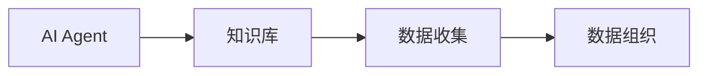

# 构建AI Agent的知识库：数据收集与组织

> 关键词：AI Agent、知识库、数据收集、数据组织、知识表示

> 摘要：本文围绕构建AI Agent的知识库展开，详细探讨了数据收集与组织的相关内容。首先介绍了构建知识库的背景信息，包括目的、预期读者等。接着阐述了核心概念及联系，深入分析了核心算法原理与具体操作步骤，并通过数学模型和公式进行理论支持。在项目实战部分，给出了实际案例及详细的代码解释。随后讨论了实际应用场景，推荐了相关的工具和资源。最后总结了未来发展趋势与挑战，还提供了常见问题解答和扩展阅读参考资料，旨在为读者全面呈现构建AI Agent知识库中数据收集与组织的知识体系和实践方法。

## 1. 背景介绍 
### 1.1 目的和范围
构建AI Agent的知识库是推动人工智能技术发展和应用的关键环节。其目的在于为AI Agent提供丰富、准确且有序的知识，使其能够更好地理解和处理各种任务，提高决策的准确性和效率。范围涵盖了从不同来源收集各类数据，包括文本、图像、音频等，以及对这些数据进行有效的组织和管理，以满足AI Agent在不同领域的应用需求，如智能客服、智能推荐、自动驾驶等。

### 1.2 预期读者
本文预期读者包括人工智能领域的研究人员、开发者、数据科学家、软件工程师以及对AI Agent和知识库构建感兴趣的技术爱好者。无论是希望深入了解相关理论知识，还是寻求实践指导的读者，都能从本文中获得有价值的信息。

### 1.3 文档结构概述
本文将按照以下结构展开：首先介绍背景信息，让读者对构建AI Agent知识库的数据收集与组织有一个整体的认识；接着阐述核心概念及联系，帮助读者理解相关的基本原理；然后详细讲解核心算法原理和具体操作步骤，并结合数学模型和公式进行理论支持；在项目实战部分，通过实际案例展示代码实现和详细解释；之后讨论实际应用场景，让读者了解该技术的实际用途；再推荐相关的工具和资源，为读者提供学习和实践的参考；最后总结未来发展趋势与挑战，同时提供常见问题解答和扩展阅读参考资料。

### 1.4 术语表
#### 1.4.1 核心术语定义
- **AI Agent（人工智能智能体）**：能够感知环境、做出决策并采取行动以实现特定目标的智能实体。
- **知识库**：存储知识的集合，是AI Agent进行推理和决策的基础。
- **数据收集**：从各种来源获取数据的过程。
- **数据组织**：对收集到的数据进行分类、整理、存储和管理的过程。

#### 1.4.2 相关概念解释
- **知识表示**：将知识以计算机能够理解和处理的方式进行表示，如逻辑表示、语义网络、框架表示等。
- **数据清洗**：对收集到的数据进行预处理，去除噪声、缺失值等，以提高数据质量。
- **数据挖掘**：从大量数据中发现有价值信息和知识的过程。

#### 1.4.3 缩略词列表
- **AI**：Artificial Intelligence（人工智能）
- **ML**：Machine Learning（机器学习）
- **NLP**：Natural Language Processing（自然语言处理）

## 2. 核心概念与联系 
### 核心概念原理
#### AI Agent
AI Agent是人工智能系统的核心组件，它通过感知器获取环境信息，经过内部的推理和决策过程，然后通过执行器采取相应的行动。AI Agent的性能很大程度上依赖于其拥有的知识库，知识库为其提供了进行推理和决策的依据。

#### 知识库
知识库是知识的集合，它包含了各种类型的知识，如事实、规则、经验等。知识库的构建需要经过数据收集、数据组织和知识表示等过程，以确保知识的准确性、完整性和可用性。

#### 数据收集
数据收集是构建知识库的第一步，它的目的是从各种来源获取与目标领域相关的数据。数据来源可以包括互联网、数据库、传感器、人工输入等。数据收集的质量直接影响到知识库的质量。

#### 数据组织
数据组织是对收集到的数据进行分类、整理、存储和管理的过程。它的目的是使数据具有良好的结构和可访问性，以便于AI Agent进行查询和使用。数据组织的方法包括数据库管理、文件系统管理、知识图谱构建等。

### 架构的文本示意图
```plaintext
              +----------------+
              |   AI Agent     |
              +----------------+
                    |
                    v
              +----------------+
              |   知识库        |
              +----------------+
                    |
                    v
              +----------------+
              |   数据收集      |
              +----------------+
                    |
                    v
              +----------------+
              |   数据组织      |
              +----------------+
```

### Mermaid流程图


## 3. 核心算法原理 & 具体操作步骤 
### 核心算法原理
在数据收集与组织过程中，涉及到多种算法，以下以文本数据收集和组织为例，介绍一些常用的算法。

#### 网络爬虫算法
网络爬虫是一种自动获取网页内容的程序，它通过模拟浏览器的行为，访问网页并提取其中的有用信息。常用的网络爬虫算法有广度优先搜索（BFS）和深度优先搜索（DFS）。

以下是一个使用Python实现的简单网络爬虫示例：
```python
import requests
from bs4 import BeautifulSoup

def get_page_content(url):
    try:
        response = requests.get(url)
        response.raise_for_status()
        response.encoding = response.apparent_encoding
        return response.text
    except Exception as e:
        print(f"Error: {e}")
        return None

def extract_text(html):
    soup = BeautifulSoup(html, 'html.parser')
    text = soup.get_text()
    return text

if __name__ == "__main__":
    url = "https://example.com"
    html = get_page_content(url)
    if html:
        text = extract_text(html)
        print(text)
```

#### 数据分类算法
数据分类是将收集到的数据划分到不同的类别中，以便于组织和管理。常用的数据分类算法有决策树、朴素贝叶斯、支持向量机等。

以下是一个使用Python实现的朴素贝叶斯分类器示例：
```python
from sklearn.feature_extraction.text import CountVectorizer
from sklearn.naive_bayes import MultinomialNB
from sklearn.model_selection import train_test_split
from sklearn.metrics import accuracy_score

# 示例数据
documents = ["This is a positive review", "This is a negative review", "Another positive one", "A negative comment"]
labels = ["positive", "negative", "positive", "negative"]

# 特征提取
vectorizer = CountVectorizer()
X = vectorizer.fit_transform(documents)

# 划分训练集和测试集
X_train, X_test, y_train, y_test = train_test_split(X, labels, test_size=0.2, random_state=42)

# 训练模型
clf = MultinomialNB()
clf.fit(X_train, y_train)

# 预测
y_pred = clf.predict(X_test)

# 评估模型
accuracy = accuracy_score(y_test, y_pred)
print(f"Accuracy: {accuracy}")
```

### 具体操作步骤
#### 数据收集步骤
1. **确定数据来源**：根据目标领域和需求，确定数据的来源，如网页、数据库、文件等。
2. **选择数据收集工具**：根据数据来源的特点，选择合适的数据收集工具，如网络爬虫、数据库查询工具等。
3. **制定数据收集策略**：确定数据收集的频率、范围和方式，以确保数据的完整性和及时性。
4. **执行数据收集**：使用选择的工具和策略，开始收集数据。

#### 数据组织步骤
1. **数据清洗**：对收集到的数据进行预处理，去除噪声、缺失值等，以提高数据质量。
2. **数据分类**：将清洗后的数据划分到不同的类别中，以便于组织和管理。
3. **数据存储**：选择合适的存储方式，如数据库、文件系统等，将分类后的数据存储起来。
4. **数据索引**：为存储的数据建立索引，以提高数据的查询效率。

## 4. 数学模型和公式 & 详细讲解 & 举例说明 
### 数学模型
#### 贝叶斯定理
贝叶斯定理是一种用于计算条件概率的公式，在数据分类中有着广泛的应用。贝叶斯定理的公式为：
$$P(A|B)=\frac{P(B|A)P(A)}{P(B)}$$
其中，$P(A|B)$ 表示在事件 $B$ 发生的条件下事件 $A$ 发生的概率，$P(B|A)$ 表示在事件 $A$ 发生的条件下事件 $B$ 发生的概率，$P(A)$ 表示事件 $A$ 发生的概率，$P(B)$ 表示事件 $B$ 发生的概率。

### 详细讲解
在数据分类中，我们可以将类别看作事件 $A$，将特征看作事件 $B$。通过贝叶斯定理，我们可以计算出在给定特征的情况下，样本属于某个类别的概率。

### 举例说明
假设我们有一个文本分类问题，类别有“体育”和“科技”，特征是文本中的单词。我们已经收集了一些训练数据，统计出在“体育”类别中出现单词“篮球”的概率 $P(篮球|体育)=0.8$，“体育”类别的先验概率 $P(体育)=0.5$，单词“篮球”出现的概率 $P(篮球)=0.4$。那么，在出现单词“篮球”的情况下，文本属于“体育”类别的概率为：
$$P(体育|篮球)=\frac{P(篮球|体育)P(体育)}{P(篮球)}=\frac{0.8\times0.5}{0.4}=1$$

## 5. 项目实战：代码实际案例和详细解释说明 
### 5.1  开发环境搭建
#### 安装Python
首先，确保你已经安装了Python。可以从Python官方网站（https://www.python.org/downloads/） 下载并安装适合你操作系统的Python版本。

#### 安装必要的库
在项目中，我们需要使用一些Python库，如`requests`、`beautifulsoup4`、`scikit-learn`等。可以使用以下命令进行安装：
```sh
pip install requests beautifulsoup4 scikit-learn
```

### 5.2  源代码详细实现和代码解读
#### 数据收集部分
```python
import requests
from bs4 import BeautifulSoup

def get_page_content(url):
    try:
        response = requests.get(url)
        response.raise_for_status()
        response.encoding = response.apparent_encoding
        return response.text
    except Exception as e:
        print(f"Error: {e}")
        return None

def extract_text(html):
    soup = BeautifulSoup(html, 'html.parser')
    text = soup.get_text()
    return text

if __name__ == "__main__":
    url = "https://example.com"
    html = get_page_content(url)
    if html:
        text = extract_text(html)
        print(text)
```
代码解读：
- `get_page_content` 函数：使用`requests`库发送HTTP请求，获取网页的HTML内容。如果请求成功，返回HTML内容；否则，打印错误信息并返回`None`。
- `extract_text` 函数：使用`BeautifulSoup`库解析HTML内容，提取其中的文本信息。
- 主程序：调用`get_page_content`函数获取网页的HTML内容，然后调用`extract_text`函数提取文本信息并打印。

#### 数据组织部分
```python
from sklearn.feature_extraction.text import CountVectorizer
from sklearn.naive_bayes import MultinomialNB
from sklearn.model_selection import train_test_split
from sklearn.metrics import accuracy_score

# 示例数据
documents = ["This is a positive review", "This is a negative review", "Another positive one", "A negative comment"]
labels = ["positive", "negative", "positive", "negative"]

# 特征提取
vectorizer = CountVectorizer()
X = vectorizer.fit_transform(documents)

# 划分训练集和测试集
X_train, X_test, y_train, y_test = train_test_split(X, labels, test_size=0.2, random_state=42)

# 训练模型
clf = MultinomialNB()
clf.fit(X_train, y_train)

# 预测
y_pred = clf.predict(X_test)

# 评估模型
accuracy = accuracy_score(y_test, y_pred)
print(f"Accuracy: {accuracy}")
```
代码解读：
- 数据准备：定义了一个包含文本数据和对应标签的列表。
- 特征提取：使用`CountVectorizer`将文本数据转换为向量表示。
- 划分训练集和测试集：使用`train_test_split`函数将数据划分为训练集和测试集。
- 训练模型：使用`MultinomialNB`训练一个朴素贝叶斯分类器。
- 预测和评估：使用训练好的模型进行预测，并使用`accuracy_score`函数评估模型的准确率。

### 5.3  代码解读与分析
通过上述代码，我们实现了一个简单的数据收集和组织的流程。在数据收集部分，我们使用网络爬虫获取网页的文本信息；在数据组织部分，我们使用朴素贝叶斯分类器对文本数据进行分类。代码的优点是简单易懂，易于实现；缺点是功能相对简单，缺乏对数据的深度处理和优化。

## 6. 实际应用场景 
### 智能客服
在智能客服系统中，构建知识库可以帮助客服机器人更好地理解用户的问题，并提供准确的答案。通过收集和组织相关的业务知识、常见问题解答等数据，智能客服可以快速响应用户的咨询，提高服务效率和质量。

### 智能推荐
在智能推荐系统中，知识库可以存储用户的偏好、历史行为等信息，以及商品或内容的相关特征。通过对这些数据的分析和处理，智能推荐系统可以为用户提供个性化的推荐，提高用户的满意度和转化率。

### 自动驾驶
在自动驾驶领域，知识库可以存储地图信息、交通规则、车辆动力学模型等知识。自动驾驶车辆通过感知环境和查询知识库，做出决策并控制车辆的行驶，确保行驶的安全和高效。

## 7. 工具和资源推荐
### 7.1 学习资源推荐
#### 7.1.1 书籍推荐
- 《人工智能：一种现代的方法》：全面介绍了人工智能的基本概念、算法和应用，是人工智能领域的经典教材。
- 《Python机器学习实战》：通过实际案例介绍了Python在机器学习中的应用，适合初学者学习。
- 《数据挖掘：概念与技术》：详细介绍了数据挖掘的基本概念、算法和应用，是数据挖掘领域的权威著作。

#### 7.1.2 在线课程
- Coursera上的“机器学习”课程：由斯坦福大学的Andrew Ng教授授课，是机器学习领域的经典课程。
- edX上的“人工智能基础”课程：介绍了人工智能的基本概念、算法和应用，适合初学者学习。
- 中国大学MOOC上的“Python语言程序设计”课程：介绍了Python语言的基本语法和应用，是学习Python的入门课程。

#### 7.1.3 技术博客和网站
- 机器之心：提供人工智能领域的最新技术、研究成果和应用案例。
- 数据派：专注于数据科学和机器学习领域的技术分享和交流。
- 开源中国：提供开源项目、技术文章和社区交流等服务。

### 7.2 开发工具框架推荐
#### 7.2.1 IDE和编辑器
- PyCharm：一款功能强大的Python集成开发环境，提供代码编辑、调试、版本控制等功能。
- Visual Studio Code：一款轻量级的代码编辑器，支持多种编程语言，具有丰富的插件生态系统。
- Jupyter Notebook：一种交互式的开发环境，适合数据探索和分析。

#### 7.2.2 调试和性能分析工具
- pdb：Python自带的调试工具，用于调试Python代码。
- cProfile：Python自带的性能分析工具，用于分析Python代码的性能瓶颈。
- Py-Spy：一个用于分析Python代码性能的工具，支持实时分析和可视化。

#### 7.2.3 相关框架和库
- TensorFlow：一个开源的机器学习框架，提供了丰富的工具和算法，用于构建和训练深度学习模型。
- PyTorch：一个开源的深度学习框架，具有动态计算图和易于使用的API，受到了广泛的关注和应用。
- Scikit-learn：一个开源的机器学习库，提供了丰富的机器学习算法和工具，用于数据挖掘和数据分析。

### 7.3 相关论文著作推荐
#### 7.3.1 经典论文
- “A Logical Calculus of the Ideas Immanent in Nervous Activity”：由Warren S. McCulloch和Walter Pitts于1943年发表，提出了神经元模型，是人工智能领域的经典论文之一。
- “Learning Representations by Back-propagating Errors”：由David E. Rumelhart、Geoffrey E. Hinton和Ronald J. Williams于1986年发表，介绍了反向传播算法，是深度学习领域的重要论文之一。
- “ImageNet Classification with Deep Convolutional Neural Networks”：由Alex Krizhevsky、Ilya Sutskever和Geoffrey E. Hinton于2012年发表，介绍了AlexNet模型，开启了深度学习在计算机视觉领域的应用热潮。

#### 7.3.2 最新研究成果
- 关注顶级学术会议，如NeurIPS、ICML、CVPR等，获取人工智能领域的最新研究成果。
- 关注知名学术期刊，如Journal of Artificial Intelligence Research、Artificial Intelligence等，获取高质量的学术论文。

#### 7.3.3 应用案例分析
- 关注行业报告和案例分析，了解人工智能在不同领域的应用情况和成功经验。
- 研究开源项目和商业产品，学习其实现思路和技术方案。

## 8. 总结：未来发展趋势与挑战
### 未来发展趋势
- **多模态数据融合**：未来的知识库将不仅仅局限于文本数据，还将融合图像、音频、视频等多模态数据，以提供更全面、准确的知识。
- **知识图谱的发展**：知识图谱将在知识库的构建和应用中发挥越来越重要的作用，通过将知识表示为图结构，实现知识的语义理解和推理。
- **智能化的数据收集与组织**：随着人工智能技术的发展，数据收集和组织将越来越智能化，如自动识别数据来源、自动分类和标注数据等。

### 挑战
- **数据质量问题**：数据的质量直接影响到知识库的质量，如何确保收集到的数据准确、完整、一致是一个挑战。
- **知识表示和推理的复杂性**：知识的表示和推理是人工智能领域的核心问题之一，如何有效地表示和推理复杂的知识是一个挑战。
- **隐私和安全问题**：在数据收集和组织过程中，涉及到大量的用户隐私和敏感信息，如何保护用户的隐私和数据安全是一个挑战。

## 9. 附录：常见问题与解答
### 问题1：如何选择合适的数据收集工具？
解答：选择合适的数据收集工具需要考虑数据来源的特点、数据的格式和规模等因素。如果是网页数据，可以选择网络爬虫工具；如果是数据库数据，可以选择数据库查询工具；如果是文件数据，可以选择文件读取工具。

### 问题2：如何处理数据中的噪声和缺失值？
解答：处理数据中的噪声和缺失值可以采用以下方法：对于噪声数据，可以使用数据清洗算法进行去除；对于缺失值，可以采用填充法、删除法等进行处理。

### 问题3：如何评估知识库的质量？
解答：评估知识库的质量可以从以下几个方面入手：知识的准确性、完整性、一致性、可用性等。可以通过人工评估、自动化评估等方法进行评估。

## 10. 扩展阅读 & 参考资料
### 扩展阅读
- 《深度学习》：由Ian Goodfellow、Yoshua Bengio和Aaron Courville撰写，是深度学习领域的权威著作。
- 《自然语言处理入门》：由何晗撰写，介绍了自然语言处理的基本概念、算法和应用。
- 《人工智能时代》：由李开复和王咏刚撰写，探讨了人工智能对社会和人类的影响。

### 参考资料
- 相关学术论文和研究报告
- 开源项目的文档和代码
- 技术博客和论坛的讨论