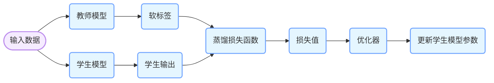

# 构建AI Agent的知识蒸馏pipeline

> 关键词：AI Agent、知识蒸馏、pipeline、模型压缩、知识迁移

> 摘要：本文围绕构建AI Agent的知识蒸馏pipeline展开，深入探讨了知识蒸馏的核心概念、算法原理、数学模型等内容。通过详细的Python代码示例和实际案例，阐述了如何在实际项目中搭建和实现知识蒸馏pipeline。同时，介绍了知识蒸馏在不同场景下的应用，推荐了相关的学习资源、开发工具和研究论文。最后，对知识蒸馏的未来发展趋势和挑战进行了总结，并提供了常见问题的解答和扩展阅读的参考资料，旨在为读者全面了解和构建AI Agent的知识蒸馏pipeline提供专业且深入的指导。

## 1. 背景介绍 
### 1.1 目的和范围
随着人工智能技术的飞速发展，AI Agent在各个领域的应用越来越广泛。然而，大型的AI模型通常具有庞大的参数数量和复杂的结构，这不仅导致模型的训练和推理成本高昂，还限制了其在资源受限环境下的部署。知识蒸馏作为一种有效的模型压缩和加速技术，可以将大型教师模型的知识迁移到小型学生模型中，从而在保证模型性能的前提下，显著降低模型的复杂度和计算成本。

本文的目的是详细介绍如何构建AI Agent的知识蒸馏pipeline，涵盖了从核心概念的理解到具体代码实现的全过程。通过本文的学习，读者将能够掌握知识蒸馏的基本原理和方法，并且能够在实际项目中应用这些技术来构建高效的AI Agent。

### 1.2 预期读者
本文主要面向对人工智能、机器学习和深度学习有一定了解的技术人员，包括但不限于程序员、数据科学家、机器学习工程师和研究人员。对于那些希望了解如何通过知识蒸馏技术优化AI Agent性能的读者来说，本文将提供有价值的参考。

### 1.3 文档结构概述
本文将按照以下结构进行组织：
1. **背景介绍**：介绍知识蒸馏的目的和范围，以及本文的预期读者和文档结构。
2. **核心概念与联系**：详细解释知识蒸馏的核心概念，包括教师模型、学生模型、蒸馏损失等，并通过示意图和流程图展示其架构和工作流程。
3. **核心算法原理 & 具体操作步骤**：阐述知识蒸馏的核心算法原理，并使用Python源代码详细说明具体的操作步骤。
4. **数学模型和公式 & 详细讲解 & 举例说明**：介绍知识蒸馏的数学模型和公式，并通过具体的例子进行详细讲解。
5. **项目实战：代码实际案例和详细解释说明**：通过一个实际的项目案例，展示如何搭建开发环境、实现知识蒸馏的源代码，并对代码进行详细的解读和分析。
6. **实际应用场景**：介绍知识蒸馏在不同领域的实际应用场景。
7. **工具和资源推荐**：推荐相关的学习资源、开发工具和研究论文，帮助读者进一步深入学习和研究知识蒸馏技术。
8. **总结：未来发展趋势与挑战**：对知识蒸馏的未来发展趋势进行展望，并分析可能面临的挑战。
9. **附录：常见问题与解答**：解答读者在学习和应用知识蒸馏技术过程中可能遇到的常见问题。
10. **扩展阅读 & 参考资料**：提供相关的扩展阅读材料和参考资料，方便读者进一步探索知识蒸馏领域。

### 1.4 术语表
#### 1.4.1 核心术语定义
- **AI Agent**：人工智能代理，是一种能够感知环境、做出决策并采取行动的智能实体。
- **知识蒸馏**：一种模型压缩和加速技术，通过将大型教师模型的知识迁移到小型学生模型中，使学生模型能够学习到教师模型的性能。
- **教师模型**：通常是一个大型、复杂且性能良好的模型，用于提供知识给学生模型。
- **学生模型**：一个小型、简单的模型，通过学习教师模型的知识来提高自身性能。
- **蒸馏损失**：用于衡量学生模型输出与教师模型输出之间差异的损失函数。

#### 1.4.2 相关概念解释
- **软标签**：教师模型输出的概率分布，包含了更多的类别之间的相对关系信息。
- **硬标签**：真实的类别标签，通常是一个独热编码向量。
- **温度参数**：在知识蒸馏中用于控制软标签的平滑程度，温度越高，软标签越平滑。

#### 1.4.3 缩略词列表
- **CNN**：卷积神经网络（Convolutional Neural Network）
- **DNN**：深度神经网络（Deep Neural Network）
- **GPU**：图形处理单元（Graphics Processing Unit）
- **CPU**：中央处理单元（Central Processing Unit）

## 2. 核心概念与联系 

### 核心概念原理
知识蒸馏的核心思想是让学生模型学习教师模型的输出，而不仅仅是学习训练数据的真实标签。具体来说，教师模型在训练数据上进行推理，得到每个样本的软标签（概率分布），然后学生模型通过最小化自己的输出与教师模型的软标签之间的差异来学习。这样，学生模型可以学习到教师模型中包含的更多的知识，例如类别之间的相对关系。

### 架构的文本示意图
以下是知识蒸馏的基本架构示意图：

```plaintext
输入数据 --> 教师模型 --> 软标签
输入数据 --> 学生模型 --> 学生输出
软标签、学生输出 --> 蒸馏损失函数 --> 损失值
损失值 --> 优化器 --> 更新学生模型参数
```

### Mermaid 流程图


在这个流程图中，输入数据同时输入到教师模型和学生模型中。教师模型输出软标签，学生模型输出自己的预测结果。然后，将软标签和学生输出输入到蒸馏损失函数中计算损失值。最后，使用优化器根据损失值更新学生模型的参数，不断迭代直到学生模型收敛。

## 3. 核心算法原理 & 具体操作步骤 

### 核心算法原理
知识蒸馏的核心算法主要包括两个部分：计算蒸馏损失和更新学生模型参数。常用的蒸馏损失函数是KL散度（Kullback-Leibler divergence），它可以衡量两个概率分布之间的差异。

KL散度的定义如下：
对于两个概率分布 $P$ 和 $Q$，它们的KL散度 $D_{KL}(P||Q)$ 定义为：
$$D_{KL}(P||Q) = \sum_{i} P(i) \log \frac{P(i)}{Q(i)}$$

在知识蒸馏中，$P$ 是教师模型输出的软标签，$Q$ 是学生模型输出的概率分布。

### 具体操作步骤及Python代码实现
以下是一个简单的知识蒸馏示例，使用PyTorch实现：

```python
import torch
import torch.nn as nn
import torch.optim as optim

# 定义教师模型
class TeacherModel(nn.Module):
    def __init__(self):
        super(TeacherModel, self).__init__()
        self.fc1 = nn.Linear(10, 20)
        self.relu = nn.ReLU()
        self.fc2 = nn.Linear(20, 5)

    def forward(self, x):
        x = self.fc1(x)
        x = self.relu(x)
        x = self.fc2(x)
        return x

# 定义学生模型
class StudentModel(nn.Module):
    def __init__(self):
        super(StudentModel, self).__init__()
        self.fc1 = nn.Linear(10, 15)
        self.relu = nn.ReLU()
        self.fc2 = nn.Linear(15, 5)

    def forward(self, x):
        x = self.fc1(x)
        x = self.relu(x)
        x = self.fc2(x)
        return x

# 初始化模型
teacher_model = TeacherModel()
student_model = StudentModel()

# 定义损失函数和优化器
criterion = nn.KLDivLoss(reduction='batchmean')
optimizer = optim.Adam(student_model.parameters(), lr=0.001)

# 模拟输入数据
input_data = torch.randn(32, 10)

# 知识蒸馏训练过程
num_epochs = 100
for epoch in range(num_epochs):
    # 教师模型推理
    with torch.no_grad():
        teacher_output = teacher_model(input_data)
        teacher_soft_labels = torch.softmax(teacher_output / 1.0, dim=1)  # 温度参数为1.0

    # 学生模型推理
    student_output = student_model(input_data)
    student_log_probs = torch.log_softmax(student_output / 1.0, dim=1)

    # 计算蒸馏损失
    loss = criterion(student_log_probs, teacher_soft_labels)

    # 更新学生模型参数
    optimizer.zero_grad()
    loss.backward()
    optimizer.step()

    if (epoch + 1) % 10 == 0:
        print(f'Epoch [{epoch+1}/{num_epochs}], Loss: {loss.item():.4f}')
```

### 代码解释
1. **模型定义**：定义了教师模型和学生模型，它们都是简单的全连接神经网络。
2. **损失函数和优化器**：使用KL散度作为蒸馏损失函数，Adam优化器来更新学生模型的参数。
3. **训练过程**：
    - 教师模型进行推理，得到软标签。
    - 学生模型进行推理，得到自己的输出。
    - 计算蒸馏损失。
    - 使用优化器更新学生模型的参数。

## 4. 数学模型和公式 & 详细讲解 & 举例说明 

### 数学模型和公式
知识蒸馏的数学模型主要基于损失函数的定义。除了前面提到的KL散度，还可以使用其他损失函数，例如交叉熵损失。

#### KL散度损失
如前面所述，KL散度损失用于衡量教师模型的软标签 $P$ 和学生模型的输出 $Q$ 之间的差异：
$$D_{KL}(P||Q) = \sum_{i} P(i) \log \frac{P(i)}{Q(i)}$$

#### 交叉熵损失
交叉熵损失可以表示为：
$$H(P, Q) = - \sum_{i} P(i) \log Q(i)$$

在知识蒸馏中，通常将这两种损失结合起来使用，得到总的蒸馏损失：
$$L_{distillation} = \alpha D_{KL}(P||Q) + (1 - \alpha) H(y, Q)$$
其中，$y$ 是真实标签，$\alpha$ 是一个超参数，用于控制软标签损失和硬标签损失的权重。

### 详细讲解
- **KL散度损失**：KL散度衡量的是两个概率分布之间的相对熵，它可以帮助学生模型学习到教师模型输出的概率分布信息，从而捕捉到类别之间的相对关系。
- **交叉熵损失**：交叉熵损失用于衡量学生模型的输出与真实标签之间的差异，确保学生模型能够正确分类。
- **总的蒸馏损失**：通过调整 $\alpha$ 的值，可以平衡软标签损失和硬标签损失的重要性。当 $\alpha$ 较大时，学生模型更注重学习教师模型的知识；当 $\alpha$ 较小时，学生模型更注重学习真实标签。

### 举例说明
假设我们有一个三分类问题，教师模型的输出为 $P = [0.2, 0.3, 0.5]$，学生模型的输出为 $Q = [0.1, 0.4, 0.5]$，真实标签为 $y = [0, 0, 1]$。

#### 计算KL散度损失
$$D_{KL}(P||Q) = 0.2 \log \frac{0.2}{0.1} + 0.3 \log \frac{0.3}{0.4} + 0.5 \log \frac{0.5}{0.5} \approx 0.068$$

#### 计算交叉熵损失
$$H(y, Q) = - (0 \log 0.1 + 0 \log 0.4 + 1 \log 0.5) \approx 0.693$$

假设 $\alpha = 0.8$，则总的蒸馏损失为：
$$L_{distillation} = 0.8 \times 0.068 + (1 - 0.8) \times 0.693 \approx 0.183$$

## 5. 项目实战：代码实际案例和详细解释说明 

### 5.1  开发环境搭建
在进行知识蒸馏项目实战之前，需要搭建相应的开发环境。以下是具体步骤：

#### 安装Python
首先，确保你已经安装了Python 3.6或以上版本。可以从Python官方网站（https://www.python.org/downloads/）下载并安装。

#### 安装深度学习框架
本文使用PyTorch作为深度学习框架，可以根据自己的系统和CUDA版本选择合适的安装方式。例如，如果你使用的是CPU版本的PyTorch，可以使用以下命令进行安装：
```bash
pip install torch torchvision
```

如果你使用的是GPU版本的PyTorch，需要根据自己的CUDA版本选择相应的安装命令。例如，如果你使用的是CUDA 11.3，可以使用以下命令：
```bash
pip install torch torchvision torchaudio --extra-index-url https://download.pytorch.org/whl/cu113
```

#### 安装其他依赖库
还需要安装一些其他的依赖库，如NumPy、Matplotlib等，可以使用以下命令进行安装：
```bash
pip install numpy matplotlib
```

### 5.2  源代码详细实现和代码解读
以下是一个基于MNIST数据集的知识蒸馏项目的完整代码：

```python
import torch
import torch.nn as nn
import torch.optim as optim
import torchvision
import torchvision.transforms as transforms
from torch.utils.data import DataLoader

# 定义教师模型
class TeacherModel(nn.Module):
    def __init__(self):
        super(TeacherModel, self).__init__()
        self.conv1 = nn.Conv2d(1, 32, kernel_size=3, padding=1)
        self.relu1 = nn.ReLU()
        self.pool1 = nn.MaxPool2d(2)
        self.conv2 = nn.Conv2d(32, 64, kernel_size=3, padding=1)
        self.relu2 = nn.ReLU()
        self.pool2 = nn.MaxPool2d(2)
        self.fc1 = nn.Linear(64 * 7 * 7, 128)
        self.relu3 = nn.ReLU()
        self.fc2 = nn.Linear(128, 10)

    def forward(self, x):
        x = self.pool1(self.relu1(self.conv1(x)))
        x = self.pool2(self.relu2(self.conv2(x)))
        x = x.view(-1, 64 * 7 * 7)
        x = self.relu3(self.fc1(x))
        x = self.fc2(x)
        return x

# 定义学生模型
class StudentModel(nn.Module):
    def __init__(self):
        super(StudentModel, self).__init__()
        self.conv1 = nn.Conv2d(1, 16, kernel_size=3, padding=1)
        self.relu1 = nn.ReLU()
        self.pool1 = nn.MaxPool2d(2)
        self.fc1 = nn.Linear(16 * 14 * 14, 64)
        self.relu2 = nn.ReLU()
        self.fc2 = nn.Linear(64, 10)

    def forward(self, x):
        x = self.pool1(self.relu1(self.conv1(x)))
        x = x.view(-1, 16 * 14 * 14)
        x = self.relu2(self.fc1(x))
        x = self.fc2(x)
        return x

# 数据预处理
transform = transforms.Compose([
    transforms.ToTensor(),
    transforms.Normalize((0.1307,), (0.3081,))
])

# 加载MNIST数据集
trainset = torchvision.datasets.MNIST(root='./data', train=True,
                                      download=True, transform=transform)
trainloader = DataLoader(trainset, batch_size=64, shuffle=True)

testset = torchvision.datasets.MNIST(root='./data', train=False,
                                     download=True, transform=transform)
testloader = DataLoader(testset, batch_size=64, shuffle=False)

# 初始化模型
teacher_model = TeacherModel()
student_model = StudentModel()

# 定义损失函数和优化器
criterion_ce = nn.CrossEntropyLoss()
criterion_kl = nn.KLDivLoss(reduction='batchmean')
optimizer = optim.Adam(student_model.parameters(), lr=0.001)

# 知识蒸馏训练过程
num_epochs = 10
alpha = 0.8
temperature = 4.0

for epoch in range(num_epochs):
    running_loss = 0.0
    for i, data in enumerate(trainloader, 0):
        inputs, labels = data

        # 教师模型推理
        with torch.no_grad():
            teacher_output = teacher_model(inputs)
            teacher_soft_labels = torch.softmax(teacher_output / temperature, dim=1)

        # 学生模型推理
        student_output = student_model(inputs)
        student_log_probs = torch.log_softmax(student_output / temperature, dim=1)

        # 计算蒸馏损失
        loss_kl = criterion_kl(student_log_probs, teacher_soft_labels)
        loss_ce = criterion_ce(student_output, labels)
        loss = alpha * temperature * temperature * loss_kl + (1 - alpha) * loss_ce

        # 更新学生模型参数
        optimizer.zero_grad()
        loss.backward()
        optimizer.step()

        running_loss += loss.item()

    print(f'Epoch [{epoch+1}/{num_epochs}], Loss: {running_loss / len(trainloader):.4f}')

# 测试学生模型
correct = 0
total = 0
with torch.no_grad():
    for data in testloader:
        images, labels = data
        outputs = student_model(images)
        _, predicted = torch.max(outputs.data, 1)
        total += labels.size(0)
        correct += (predicted == labels).sum().item()

print(f'Accuracy of the student network on the 10000 test images: {100 * correct / total}%')
```

### 5.3  代码解读与分析
#### 模型定义
- **教师模型**：使用了两个卷积层和两个全连接层，结构相对复杂。
- **学生模型**：使用了一个卷积层和两个全连接层，结构相对简单。

#### 数据加载
使用`torchvision`库加载MNIST数据集，并进行数据预处理，包括转换为张量和归一化。

#### 损失函数和优化器
- **交叉熵损失**：用于衡量学生模型的输出与真实标签之间的差异。
- **KL散度损失**：用于衡量学生模型的输出与教师模型的软标签之间的差异。
- **Adam优化器**：用于更新学生模型的参数。

#### 知识蒸馏训练过程
- **教师模型推理**：在每个训练批次中，教师模型对输入数据进行推理，得到软标签。
- **学生模型推理**：学生模型对输入数据进行推理，得到自己的输出。
- **计算蒸馏损失**：结合KL散度损失和交叉熵损失，得到总的蒸馏损失。
- **更新学生模型参数**：使用优化器根据蒸馏损失更新学生模型的参数。

#### 测试学生模型
在训练完成后，使用测试集对学生模型进行测试，计算其准确率。

## 6. 实际应用场景 
### 移动设备和嵌入式系统
在移动设备和嵌入式系统中，资源通常非常有限，如内存、计算能力和电池续航等。大型的AI模型难以在这些设备上运行。知识蒸馏可以将大型教师模型的知识迁移到小型学生模型中，使学生模型能够在资源受限的设备上高效运行，同时保持较高的性能。例如，在智能手机上实现实时的图像识别、语音识别等功能。

### 边缘计算
边缘计算是指在靠近数据源的边缘节点上进行数据处理和分析，以减少数据传输延迟和带宽需求。知识蒸馏可以帮助在边缘设备上部署轻量级的AI模型，实现本地的智能决策和处理。例如，在工业物联网中，边缘设备可以使用知识蒸馏后的模型对传感器数据进行实时分析和异常检测。

### 实时推理
在一些对实时性要求较高的应用场景中，如自动驾驶、视频监控等，需要模型能够快速地进行推理。知识蒸馏可以提高模型的推理速度，使模型能够在短时间内做出决策。例如，在自动驾驶中，车辆需要实时识别道路标志、行人等，知识蒸馏后的模型可以更快地完成这些任务。

### 模型压缩和加速
在大规模的AI应用中，模型的存储和计算成本是一个重要的问题。知识蒸馏可以有效地压缩模型的参数数量，减少模型的存储空间和计算量，从而降低模型的部署成本。例如，在云计算平台上，使用知识蒸馏后的模型可以节省大量的计算资源和存储资源。

## 7. 工具和资源推荐
### 7.1 学习资源推荐
#### 7.1.1 书籍推荐
- 《深度学习》（Deep Learning）：由Ian Goodfellow、Yoshua Bengio和Aaron Courville撰写，是深度学习领域的经典教材，涵盖了深度学习的基本概念、算法和应用。
- 《动手学深度学习》（Dive into Deep Learning）：由李沐等人编写，提供了丰富的代码示例和详细的讲解，适合初学者快速上手深度学习。
- 《神经网络与深度学习》：由Michael Nielsen撰写，通过直观的解释和示例，帮助读者理解神经网络和深度学习的原理。

#### 7.1.2 在线课程
- Coursera上的“深度学习专项课程”（Deep Learning Specialization）：由Andrew Ng教授授课，包括神经网络基础、改善深层神经网络、结构化机器学习项目、卷积神经网络和序列模型等多个课程。
- edX上的“使用Python进行深度学习”（Deep Learning with Python）：介绍了如何使用Python和深度学习框架进行深度学习模型的开发和训练。
- 哔哩哔哩上的“李宏毅机器学习”课程：内容生动有趣，适合初学者入门。

#### 7.1.3 技术博客和网站
- Medium：有许多关于人工智能和深度学习的技术博客，如Towards Data Science、AI in Plain English等。
- arXiv：提供了最新的学术研究论文，包括知识蒸馏领域的研究成果。
- 机器之心：专注于人工智能领域的技术和产业动态，提供了丰富的技术文章和案例分析。

### 7.2 开发工具框架推荐
#### 7.2.1 IDE和编辑器
- PyCharm：是一款专门为Python开发设计的集成开发环境，具有强大的代码编辑、调试和自动补全功能。
- Jupyter Notebook：是一个交互式的开发环境，适合进行数据探索、模型开发和实验。
- Visual Studio Code：是一款轻量级的代码编辑器，支持多种编程语言和插件，可用于深度学习项目的开发。

#### 7.2.2 调试和性能分析工具
- TensorBoard：是TensorFlow提供的可视化工具，可以用于监控模型的训练过程、可视化模型结构和分析模型性能。
- PyTorch Profiler：是PyTorch提供的性能分析工具，可以帮助开发者找出模型中的性能瓶颈。
- NVIDIA Nsight Systems：是一款用于GPU性能分析的工具，可以帮助开发者优化深度学习模型在GPU上的运行性能。

#### 7.2.3 相关框架和库
- PyTorch：是一个开源的深度学习框架，具有动态图和易于使用的特点，广泛应用于学术界和工业界。
- TensorFlow：是另一个流行的深度学习框架，具有强大的分布式训练和部署能力。
- Scikit-learn：是一个用于机器学习的Python库，提供了丰富的机器学习算法和工具。

### 7.3 相关论文著作推荐
#### 7.3.1 经典论文
- “Distilling the Knowledge in a Neural Network”：由Geoffrey Hinton等人发表，是知识蒸馏领域的开创性论文，首次提出了知识蒸馏的概念和方法。
- “MobileNetV1: Efficient Convolutional Neural Networks for Mobile Vision Applications”：介绍了一种轻量级的卷积神经网络架构，可用于移动设备上的图像识别任务。
- “EfficientNet: Rethinking Model Scaling for Convolutional Neural Networks”：提出了一种新的模型缩放方法，可以在不增加太多计算成本的情况下提高模型的性能。

#### 7.3.2 最新研究成果
可以通过arXiv、ACM Digital Library、IEEE Xplore等学术数据库搜索最新的知识蒸馏研究论文，了解该领域的最新发展动态。

#### 7.3.3 应用案例分析
一些学术会议和期刊上会发表关于知识蒸馏在不同领域应用的案例分析，如CVPR、ICCV、NeurIPS等。可以关注这些会议和期刊的论文，学习知识蒸馏在实际应用中的经验和方法。

## 8. 总结：未来发展趋势与挑战
### 未来发展趋势
#### 多模态知识蒸馏
随着人工智能技术的发展，多模态数据（如图像、文本、语音等）的处理变得越来越重要。未来，知识蒸馏可能会扩展到多模态领域，实现不同模态之间的知识迁移和融合。例如，将图像模型的知识蒸馏到文本模型中，或者将语音模型的知识蒸馏到视觉模型中。

#### 自适应知识蒸馏
目前的知识蒸馏方法通常使用固定的超参数（如温度参数、损失权重等），在不同的任务和数据集上可能不是最优的。未来，可能会出现自适应知识蒸馏方法，能够根据任务和数据集的特点自动调整超参数，提高知识蒸馏的效果。

#### 与其他技术的融合
知识蒸馏可能会与其他技术（如强化学习、元学习等）相结合，形成更加复杂和强大的人工智能系统。例如，在强化学习中使用知识蒸馏来加速智能体的学习过程，或者在元学习中使用知识蒸馏来提高模型的泛化能力。

#### 硬件友好的知识蒸馏
随着硬件技术的发展，如GPU、TPU等，对模型的硬件友好性提出了更高的要求。未来的知识蒸馏方法可能会更加注重模型的硬件友好性，设计出能够在特定硬件上高效运行的学生模型。

### 挑战
#### 知识迁移的有效性
在知识蒸馏过程中，如何有效地将教师模型的知识迁移到学生模型中是一个关键问题。如果学生模型不能充分学习到教师模型的知识，可能会导致性能下降。因此，需要进一步研究知识迁移的机制和方法，提高知识蒸馏的有效性。

#### 超参数的选择
知识蒸馏中的超参数（如温度参数、损失权重等）对蒸馏效果有很大的影响。然而，目前还没有一种通用的方法来选择最优的超参数。如何自动选择合适的超参数是一个需要解决的挑战。

#### 模型的可解释性
随着人工智能模型的复杂度不断增加，模型的可解释性变得越来越重要。在知识蒸馏中，如何解释学生模型从教师模型中学习到的知识是一个挑战。需要开发一些可解释性的方法，帮助人们理解知识蒸馏的过程和结果。

#### 数据隐私和安全
在知识蒸馏过程中，教师模型的输出可能包含敏感信息。如何保护数据的隐私和安全是一个需要关注的问题。需要研究一些隐私保护的知识蒸馏方法，确保在知识迁移的过程中不泄露敏感信息。

## 9. 附录：常见问题与解答
### 1. 知识蒸馏和模型压缩有什么关系？
知识蒸馏是一种模型压缩技术，它通过将大型教师模型的知识迁移到小型学生模型中，实现模型的压缩和加速。与其他模型压缩技术（如剪枝、量化等）相比，知识蒸馏可以在保证模型性能的前提下，更有效地保留模型的知识。

### 2. 如何选择合适的教师模型和学生模型？
选择合适的教师模型和学生模型需要考虑多个因素，如任务类型、数据集大小、计算资源等。一般来说，教师模型应该是一个性能良好的大型模型，能够提供丰富的知识；学生模型应该是一个结构简单、参数数量少的模型，以便在资源受限的环境下运行。可以通过实验来比较不同的教师模型和学生模型的组合，选择最优的方案。

### 3. 温度参数在知识蒸馏中有什么作用？
温度参数用于控制教师模型输出的软标签的平滑程度。温度越高，软标签越平滑，类别之间的差异越小；温度越低，软标签越接近硬标签，类别之间的差异越大。通过调整温度参数，可以平衡学生模型学习到的知识的丰富性和准确性。

### 4. 知识蒸馏是否适用于所有类型的模型？
知识蒸馏适用于大多数类型的深度学习模型，如卷积神经网络（CNN）、循环神经网络（RNN）、Transformer等。然而，不同类型的模型在知识蒸馏过程中可能需要进行一些调整和优化。例如，对于RNN模型，可能需要考虑序列长度和时间步的影响。

### 5. 如何评估知识蒸馏的效果？
可以使用多种指标来评估知识蒸馏的效果，如准确率、召回率、F1值等。同时，还可以比较学生模型和教师模型的性能，以及学生模型在训练集和测试集上的表现。此外，还可以观察模型的推理速度和计算资源消耗，评估知识蒸馏对模型效率的提升。

## 10. 扩展阅读 & 参考资料
### 扩展阅读
- “Knowledge Distillation: A Survey”：对知识蒸馏领域进行了全面的综述，介绍了知识蒸馏的基本概念、方法和应用。
- “Model Compression and Acceleration for Deep Neural Networks: The Principles, Progress, and Challenges”：讨论了深度学习模型压缩和加速的原理、进展和挑战。
- “Adversarial Knowledge Distillation: Learning from Noisy Teachers”：介绍了一种基于对抗训练的知识蒸馏方法，用于处理教师模型输出中的噪声。

### 参考资料
- Hinton, G., Vinyals, O., & Dean, J. (2015). Distilling the Knowledge in a Neural Network. arXiv preprint arXiv:1503.02531.
- Howard, A. G., Zhu, M., Chen, B., Kalenichenko, D., Wang, W., Weyand, T., ... & Adam, H. (2017). MobileNets: Efficient Convolutional Neural Networks for Mobile Vision Applications. arXiv preprint arXiv:1704.04861.
- Tan, M., & Le, Q. V. (2019). EfficientNet: Rethinking Model Scaling for Convolutional Neural Networks. In Proceedings of the IEEE/CVF International Conference on Computer Vision (pp. 6105-6114).