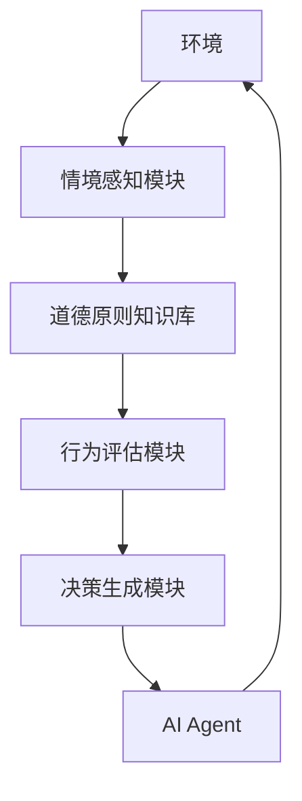

# 构建AI Agent的道德推理框架

> 关键词：AI Agent、道德推理框架、伦理准则、算法设计、应用场景

> 摘要：本文聚焦于构建AI Agent的道德推理框架这一核心主题。首先介绍了该研究的背景，包括目的、预期读者、文档结构和相关术语。接着阐述了AI Agent道德推理的核心概念与联系，通过文本示意图和Mermaid流程图清晰展示其原理和架构。详细讲解了核心算法原理，使用Python代码进行说明，并给出了相应的数学模型和公式。在项目实战部分，展示了开发环境搭建、源代码实现及解读。探讨了实际应用场景，推荐了学习资源、开发工具框架和相关论文著作。最后总结了未来发展趋势与挑战，提供了常见问题解答和扩展阅读参考资料，旨在为构建合理有效的AI Agent道德推理框架提供全面且深入的指导。

## 1. 背景介绍 
### 1.1 目的和范围
随着人工智能技术的飞速发展，AI Agent在各个领域的应用日益广泛。然而，AI Agent的决策和行为可能会对人类社会产生重大影响，因此确保其行为符合道德和伦理准则至关重要。本研究的目的是构建一个AI Agent的道德推理框架，使AI Agent能够在复杂的情境中进行道德判断和决策。

本研究的范围涵盖了道德推理的基本概念、核心算法原理、数学模型、实际应用场景等方面。通过理论分析和实践案例，为构建有效的道德推理框架提供全面的指导。

### 1.2 预期读者
本文的预期读者包括人工智能领域的研究人员、开发者、伦理学家、政策制定者以及对AI Agent道德问题感兴趣的人士。对于研究人员和开发者，本文提供了构建道德推理框架的技术思路和方法；对于伦理学家和政策制定者，本文有助于他们理解AI Agent道德问题的本质和解决方案；对于普通读者，本文可以帮助他们了解AI Agent道德推理的重要性和相关知识。

### 1.3 文档结构概述
本文的结构如下：
- 核心概念与联系：介绍AI Agent道德推理的基本概念和相关联系，通过文本示意图和Mermaid流程图进行展示。
- 核心算法原理 & 具体操作步骤：详细讲解道德推理的核心算法原理，并使用Python代码进行说明。
- 数学模型和公式 & 详细讲解 & 举例说明：给出道德推理的数学模型和公式，并进行详细讲解和举例。
- 项目实战：代码实际案例和详细解释说明：通过实际项目案例，展示如何实现道德推理框架。
- 实际应用场景：探讨道德推理框架在不同领域的实际应用场景。
- 工具和资源推荐：推荐学习资源、开发工具框架和相关论文著作。
- 总结：未来发展趋势与挑战：总结研究成果，分析未来发展趋势和面临的挑战。
- 附录：常见问题与解答：提供常见问题的解答。
- 扩展阅读 & 参考资料：提供扩展阅读的建议和参考资料。

### 1.4 术语表
#### 1.4.1 核心术语定义
- **AI Agent**：指具有自主决策和行动能力的人工智能实体，能够感知环境、处理信息并做出决策。
- **道德推理**：指在道德情境中，根据道德原则和价值观进行思考和判断，以确定合适的行为方式。
- **道德推理框架**：指为AI Agent提供道德判断和决策的一套理论和方法体系。
- **伦理准则**：指社会公认的道德原则和规范，用于指导人类的行为。

#### 1.4.2 相关概念解释
- **功利主义**：一种道德哲学理论，认为行为的正确性取决于其产生的最大幸福或利益。
- **义务论**：一种道德哲学理论，认为行为的正确性取决于其是否符合道德义务和原则。
- **美德伦理学**：一种道德哲学理论，强调个人的美德和品格在道德决策中的重要性。

#### 1.4.3 缩略词列表
- **AI**：Artificial Intelligence（人工智能）
- **ML**：Machine Learning（机器学习）
- **DL**：Deep Learning（深度学习）

## 2. 核心概念与联系 
### 核心概念原理
AI Agent的道德推理框架主要基于道德哲学的理论和方法。道德哲学为我们提供了不同的道德原则和价值观，如功利主义、义务论和美德伦理学等。在构建道德推理框架时，我们可以借鉴这些理论，将其转化为可操作的算法和模型。

道德推理的核心原理是在给定的道德情境中，根据道德原则和价值观对不同的行为选项进行评估和比较，选择最优的行为方案。这个过程涉及到对情境的感知、对道德原则的理解和应用、以及对行为后果的预测和评估。

### 架构的文本示意图
```plaintext
+----------------------+
|    道德推理框架     |
+----------------------+
|  道德原则知识库      |
|  情境感知模块        |
|  行为评估模块        |
|  决策生成模块        |
+----------------------+
|  AI Agent            |
+----------------------+
|  环境                |
+----------------------+
```

### Mermaid流程图


在这个架构中，情境感知模块负责从环境中获取信息，了解当前的道德情境。道德原则知识库存储了各种道德原则和价值观，为行为评估提供依据。行为评估模块根据情境信息和道德原则，对不同的行为选项进行评估。决策生成模块根据评估结果，生成最优的行为决策。AI Agent根据决策执行相应的行为，并与环境进行交互。

## 3. 核心算法原理 & 具体操作步骤 
### 核心算法原理
我们可以使用基于规则的方法和机器学习方法相结合来实现道德推理。基于规则的方法通过预先定义的道德规则来进行判断，而机器学习方法则可以从大量的数据中学习道德模式和规律。

以下是一个简单的基于规则的道德推理算法：

```python
# 定义道德规则
def moral_rules(situation):
    # 假设规则：如果行为会导致他人伤害，则不允许
    if situation['will_cause_harm']:
        return False
    return True

# 情境感知
def situation_perception(environment):
    # 模拟从环境中获取信息
    situation = {
        'will_cause_harm': environment.get('will_cause_harm', False)
    }
    return situation

# 行为评估
def behavior_evaluation(situation):
    return moral_rules(situation)

# 决策生成
def decision_generation(evaluation_result):
    if evaluation_result:
        return "允许该行为"
    else:
        return "不允许该行为"

# 主函数
def main(environment):
    situation = situation_perception(environment)
    evaluation_result = behavior_evaluation(situation)
    decision = decision_generation(evaluation_result)
    return decision


# 测试
environment = {'will_cause_harm': True}
print(main(environment))

```

### 具体操作步骤
1. **情境感知**：从环境中获取相关信息，构建当前的道德情境描述。
2. **规则匹配**：将情境信息与预先定义的道德规则进行匹配，判断行为是否符合道德要求。
3. **决策生成**：根据规则匹配的结果，生成相应的行为决策。

在实际应用中，我们可以使用更复杂的机器学习算法，如神经网络、决策树等，来学习道德模式和规律，提高道德推理的准确性和灵活性。

## 4. 数学模型和公式 & 详细讲解 & 举例说明 
### 数学模型
我们可以使用多属性决策模型来进行道德推理。假设我们有 $n$ 个行为选项 $A = \{a_1, a_2, \cdots, a_n\}$，每个行为选项有 $m$ 个属性 $X = \{x_1, x_2, \cdots, x_m\}$。每个属性有一个权重 $w_i$，表示该属性在道德评估中的重要性。

对于每个行为选项 $a_j$，其在属性 $x_i$ 上的得分记为 $s_{ij}$。则行为选项 $a_j$ 的综合得分 $S_j$ 可以通过以下公式计算：

$$S_j = \sum_{i = 1}^{m} w_i s_{ij}$$

### 详细讲解
在这个模型中，权重 $w_i$ 反映了不同道德原则和价值观的重要性。例如，如果我们认为避免伤害他人的原则比遵守承诺的原则更重要，那么避免伤害他人这个属性的权重就会更高。

得分 $s_{ij}$ 表示行为选项 $a_j$ 在属性 $x_i$ 上的表现。例如，如果属性 $x_i$ 是避免伤害他人，那么得分 $s_{ij}$ 可以根据行为选项 $a_j$ 导致他人伤害的可能性来确定。

### 举例说明
假设我们有两个行为选项 $A = \{a_1, a_2\}$，有两个属性 $X = \{x_1: 避免伤害他人, x_2: 遵守承诺\}$，权重分别为 $w_1 = 0.6$，$w_2 = 0.4$。

对于行为选项 $a_1$，在属性 $x_1$ 上的得分 $s_{11} = 0.8$，在属性 $x_2$ 上的得分 $s_{12} = 0.6$。则 $a_1$ 的综合得分 $S_1$ 为：

$$S_1 = 0.6 \times 0.8 + 0.4 \times 0.6 = 0.48 + 0.24 = 0.72$$

对于行为选项 $a_2$，在属性 $x_1$ 上的得分 $s_{21} = 0.3$，在属性 $x_2$ 上的得分 $s_{22} = 0.9$。则 $a_2$ 的综合得分 $S_2$ 为：

$$S_2 = 0.6 \times 0.3 + 0.4 \times 0.9 = 0.18 + 0.36 = 0.54$$

由于 $S_1 > S_2$，所以行为选项 $a_1$ 是更优的选择。

## 5. 项目实战：代码实际案例和详细解释说明 
### 5.1  开发环境搭建
- **操作系统**：可以选择 Windows、Linux 或 macOS。
- **编程语言**：Python 3.x
- **开发工具**：推荐使用 PyCharm 或 Jupyter Notebook。
- **相关库**：需要安装 numpy、pandas 等常用库。

可以使用以下命令安装所需库：

```sh
pip install numpy pandas
```

### 5.2  源代码详细实现和代码解读
```python
import numpy as np

# 定义属性权重
weights = np.array([0.6, 0.4])

# 定义行为选项在各属性上的得分
scores = np.array([
    [0.8, 0.6],
    [0.3, 0.9]
])

# 计算综合得分
def calculate_scores(weights, scores):
    return np.dot(scores, weights)

# 选择最优行为选项
def select_best_action(scores):
    best_index = np.argmax(scores)
    return best_index

# 主函数
def main():
    all_scores = calculate_scores(weights, scores)
    best_action_index = select_best_action(all_scores)
    print(f"最优行为选项的索引是: {best_action_index}")

if __name__ == "__main__":
    main()

```

### 代码解读与分析
- `weights`：定义了属性的权重，使用 numpy 数组存储。
- `scores`：定义了行为选项在各属性上的得分，同样使用 numpy 数组存储。
- `calculate_scores` 函数：使用 numpy 的 `dot` 函数计算综合得分。
- `select_best_action` 函数：使用 numpy 的 `argmax` 函数选择得分最高的行为选项的索引。
- `main` 函数：调用上述函数，计算综合得分并选择最优行为选项，最后输出结果。

通过这个代码示例，我们可以看到如何使用多属性决策模型来实现道德推理。在实际应用中，我们需要根据具体的道德情境和要求，确定属性的权重和行为选项的得分。

## 6. 实际应用场景 
### 医疗领域
在医疗领域，AI Agent 可以用于辅助医生进行决策。例如，在决定是否进行某种手术时，AI Agent 可以考虑手术的风险、患者的利益、医疗资源的分配等因素，根据道德推理框架进行决策。这样可以避免医生在决策过程中受到主观因素的影响，确保决策的公正性和合理性。

### 自动驾驶领域
在自动驾驶领域，AI Agent 面临着各种道德困境。例如，当发生不可避免的碰撞时，应该优先保护车内乘客还是行人？通过构建道德推理框架，AI Agent 可以在这些复杂的情境中做出符合道德原则的决策，减少交通事故的危害。

### 金融领域
在金融领域，AI Agent 可以用于风险评估和投资决策。例如，在评估一个投资项目时，AI Agent 可以考虑项目的风险、收益、社会影响等因素，根据道德推理框架判断该项目是否值得投资。这样可以避免金融机构在追求利润的过程中忽视社会和道德责任。

## 7. 工具和资源推荐
### 7.1 学习资源推荐
#### 7.1.1 书籍推荐
- 《人工智能伦理》：这本书全面介绍了人工智能领域的伦理问题，包括道德推理、隐私保护、算法偏见等方面。
- 《道德哲学导论》：对道德哲学的基本理论和方法进行了系统的介绍，为理解道德推理提供了理论基础。
- 《机器学习》：介绍了机器学习的基本算法和方法，对于实现基于机器学习的道德推理框架有很大帮助。

#### 7.1.2 在线课程
- Coursera 上的“人工智能伦理”课程：由知名教授授课，深入讲解了人工智能伦理的各个方面。
- edX 上的“机器学习基础”课程：帮助学习者掌握机器学习的基本概念和算法，为应用于道德推理打下基础。

#### 7.1.3 技术博客和网站
- Medium 上的人工智能伦理相关博客：有很多专业人士分享关于人工智能伦理的最新研究成果和实践经验。
- AI Ethics Institute 网站：提供了丰富的人工智能伦理资源和研究报告。

### 7.2 开发工具框架推荐
#### 7.2.1 IDE和编辑器
- PyCharm：功能强大的 Python 集成开发环境，提供了代码编辑、调试、版本控制等功能。
- Jupyter Notebook：交互式的开发环境，适合进行数据分析和模型实验。

#### 7.2.2 调试和性能分析工具
- PDB：Python 自带的调试工具，可以帮助开发者定位代码中的问题。
- cProfile：用于分析 Python 代码的性能，找出性能瓶颈。

#### 7.2.3 相关框架和库
- TensorFlow：开源的机器学习框架，提供了丰富的工具和算法，可用于构建基于深度学习的道德推理模型。
- PyTorch：另一个流行的深度学习框架，具有简洁易用的特点。

### 7.3 相关论文著作推荐
#### 7.3.1 经典论文
- “Machine Ethics: Creating an Ethical Intelligent Agent”：这篇论文提出了构建道德智能体的基本框架和方法。
- “The Moral Machine Experiment”：通过大规模的在线实验，研究了人们对自动驾驶汽车道德困境的看法。

#### 7.3.2 最新研究成果
可以通过学术数据库如 IEEE Xplore、ACM Digital Library 等搜索最新的关于 AI Agent 道德推理的研究论文。

#### 7.3.3 应用案例分析
一些知名的研究机构和企业会发布关于 AI Agent 道德推理的应用案例分析报告，可以关注这些报告以了解实际应用中的经验和挑战。

## 8. 总结：未来发展趋势与挑战
### 未来发展趋势
- **多学科融合**：AI Agent 的道德推理框架将与哲学、心理学、社会学等多学科进行更深入的融合，以更好地理解人类的道德观念和行为。
- **个性化道德推理**：根据不同用户的价值观和偏好，为 AI Agent 提供个性化的道德推理服务。
- **与法律和政策的结合**：道德推理框架将与法律和政策相结合，确保 AI Agent 的行为符合社会的规范和要求。

### 挑战
- **道德标准的多样性**：不同文化和群体有不同的道德标准，如何在道德推理框架中考虑这些多样性是一个挑战。
- **数据的局限性**：机器学习方法需要大量的数据来学习道德模式，但道德数据的收集和标注存在一定的困难。
- **可解释性问题**：AI Agent 的道德推理过程往往是复杂的，如何使其决策具有可解释性，让用户理解和信任其决策是一个重要的问题。

## 9. 附录：常见问题与解答
### 问题1：道德推理框架是否能够完全解决AI Agent的道德问题？
解答：道德推理框架可以为AI Agent提供一定的道德指导，但不能完全解决所有的道德问题。道德问题往往是复杂和多元的，不同的人可能有不同的道德观点。道德推理框架只能基于预先定义的道德原则和价值观进行决策，而这些原则和价值观可能存在局限性。此外，现实世界中的道德情境也是不断变化的，道德推理框架需要不断更新和优化。

### 问题2：如何确定道德原则和价值观的权重？
解答：确定道德原则和价值观的权重是一个复杂的过程，需要考虑多个因素。可以通过专家咨询、社会调查等方式来了解不同人群对不同道德原则的重视程度。同时，也可以根据具体的应用场景和目标来调整权重。例如，在医疗领域，可能更重视患者的生命安全和健康，因此相关道德原则的权重会更高。

### 问题3：道德推理框架是否会影响AI Agent的性能和效率？
解答：道德推理框架可能会在一定程度上影响AI Agent的性能和效率。因为道德推理需要进行额外的计算和判断，增加了系统的复杂度。但是，通过合理的算法设计和优化，可以将这种影响降到最低。例如，可以采用并行计算、模型压缩等技术来提高道德推理的效率。

## 10. 扩展阅读 & 参考资料
### 扩展阅读
- 《人工智能时代的人类责任》：探讨了在人工智能快速发展的背景下，人类应该承担的责任和义务。
- 《科技与伦理》：分析了科技发展与伦理道德之间的关系，对于理解AI Agent的道德问题有一定的启示。

### 参考资料
- Floridi, L., & Sanders, J. W. (2004). On the Morality of Artificial Agents. Minds and Machines, 14(3), 349-379.
- Wallach, W., & Allen, C. (2009). Moral Machines: Teaching Robots Right from Wrong. Oxford University Press.
- Bostrom, N., & Yudkowsky, E. (2014). The Ethics of Artificial Intelligence. In The Cambridge Handbook of Artificial Intelligence. Cambridge University Press.