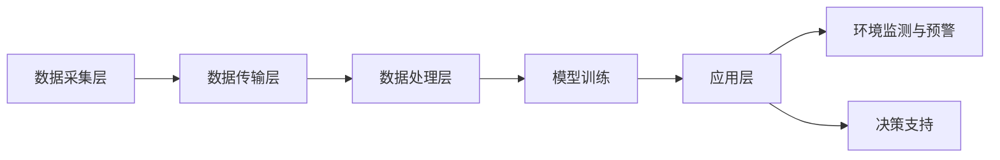

# 构建企业级AI环境监测助手：合规与可持续发展

> 关键词：企业级AI、环境监测助手、合规、可持续发展、人工智能技术

> 摘要：本文聚焦于构建企业级AI环境监测助手，详细探讨其在企业合规与可持续发展方面的重要作用。从背景介绍入手，阐述构建该助手的目的、适用读者范围、文档结构以及相关术语。深入剖析核心概念与联系，介绍核心算法原理和具体操作步骤，并运用Python代码进行说明。同时给出数学模型和公式，结合实际案例讲解。在项目实战部分，展示开发环境搭建、源代码实现与解读。探讨实际应用场景，推荐相关工具和资源，最后总结未来发展趋势与挑战，解答常见问题并提供扩展阅读与参考资料，旨在为企业打造高效的环境监测助手提供全面的技术指导。

## 1. 背景介绍 
### 1.1 目的和范围
在当今社会，企业面临着越来越严格的环境法规要求，同时也需要积极践行可持续发展理念以提升自身形象和竞争力。构建企业级AI环境监测助手的目的在于帮助企业实时、准确地监测环境指标，确保企业运营符合相关法规要求，实现可持续发展目标。

本文章的范围涵盖了从AI环境监测助手的核心概念、算法原理、数学模型到项目实战、实际应用场景等多个方面，旨在为企业提供一个全面的技术指南，帮助企业成功构建并应用这一助手。

### 1.2 预期读者
本文的预期读者包括企业的技术负责人、IT部门人员、环境管理相关人员以及对企业级AI环境监测感兴趣的技术爱好者。对于技术负责人和IT部门人员，本文可以为他们提供技术方案和实施步骤；对于环境管理相关人员，有助于他们理解AI在环境监测中的应用价值；对于技术爱好者，能让他们深入了解相关技术原理和应用场景。

### 1.3 文档结构概述
本文首先介绍背景信息，让读者了解构建企业级AI环境监测助手的重要性和意义。接着阐述核心概念与联系，包括环境监测的相关概念和AI技术在其中的应用原理，并给出示意图和流程图。然后详细讲解核心算法原理和具体操作步骤，结合Python代码进行说明。之后介绍数学模型和公式，并举例说明其应用。在项目实战部分，从开发环境搭建到源代码实现与解读进行全面展示。探讨实际应用场景，推荐相关的学习资源、开发工具框架和论文著作。最后总结未来发展趋势与挑战，解答常见问题并提供扩展阅读与参考资料。

### 1.4 术语表
#### 1.4.1 核心术语定义
- **企业级AI环境监测助手**：利用人工智能技术，为企业提供环境监测、数据分析、预警等功能的智能化系统，帮助企业实现环境合规和可持续发展。
- **环境合规**：企业的生产经营活动符合国家和地方相关环境法规、标准和政策的要求。
- **可持续发展**：企业在满足当前利益的同时，不损害未来世代满足其自身需求的能力，实现经济、社会和环境的协调发展。

#### 1.4.2 相关概念解释
- **人工智能（AI）**：是一门研究如何使计算机系统能够模拟人类智能的学科，包括机器学习、深度学习、自然语言处理等技术。
- **环境监测**：通过对环境中的各种污染物、生态指标等进行监测和分析，了解环境质量状况和变化趋势。

#### 1.4.3 缩略词列表
- **AI**：Artificial Intelligence（人工智能）
- **ML**：Machine Learning（机器学习）
- **DL**：Deep Learning（深度学习）

## 2. 核心概念与联系 

### 核心概念原理
企业级AI环境监测助手的核心原理是利用人工智能技术对环境监测数据进行采集、处理、分析和预测。首先，通过各种传感器收集环境数据，如空气质量、水质、噪声等。然后，将这些数据传输到数据处理中心，利用机器学习和深度学习算法进行特征提取和模型训练。最后，根据训练好的模型对环境状况进行实时监测和预警，为企业提供决策支持。

### 架构的文本示意图
企业级AI环境监测助手的架构主要包括以下几个部分：
1. **数据采集层**：由各种传感器组成，负责采集环境数据，如空气质量传感器、水质传感器、噪声传感器等。
2. **数据传输层**：将采集到的环境数据传输到数据处理中心，可采用有线或无线通信方式，如以太网、Wi-Fi、LoRa等。
3. **数据处理层**：对传输过来的环境数据进行清洗、预处理和特征提取，然后利用机器学习和深度学习算法进行模型训练。
4. **应用层**：根据训练好的模型对环境状况进行实时监测和预警，为企业提供决策支持，如生成环境监测报告、提供合规建议等。

### Mermaid 流程图


## 3. 核心算法原理 & 具体操作步骤 

### 核心算法原理
在企业级AI环境监测助手中，常用的核心算法包括机器学习算法和深度学习算法。

#### 机器学习算法 - 决策树算法
决策树是一种基于树结构进行决策的机器学习算法。它通过对数据集进行递归划分，构建一棵决策树，每个内部节点是一个属性上的测试，每个分支是一个测试输出，每个叶节点是一个类别或值。在环境监测中，决策树可以用于对环境数据进行分类和预测，例如判断空气质量是否达标。

以下是使用Python实现决策树算法的示例代码：
```python
from sklearn.datasets import load_iris
from sklearn.model_selection import train_test_split
from sklearn.tree import DecisionTreeClassifier
from sklearn.metrics import accuracy_score

# 加载数据集
iris = load_iris()
X = iris.data
y = iris.target

# 划分训练集和测试集
X_train, X_test, y_train, y_test = train_test_split(X, y, test_size=0.2, random_state=42)

# 创建决策树分类器
clf = DecisionTreeClassifier()

# 训练模型
clf.fit(X_train, y_train)

# 预测
y_pred = clf.predict(X_test)

# 计算准确率
accuracy = accuracy_score(y_test, y_pred)
print(f"Accuracy: {accuracy}")
```

#### 深度学习算法 - 卷积神经网络（CNN）
卷积神经网络是一种专门用于处理具有网格结构数据的深度学习模型，如图像和时间序列数据。在环境监测中，CNN可以用于对环境图像数据进行分析，例如检测水体中的污染物。

以下是使用Python和Keras实现简单CNN模型的示例代码：
```python
from keras.models import Sequential
from keras.layers import Conv2D, MaxPooling2D, Flatten, Dense
from keras.datasets import mnist
from keras.utils import to_categorical

# 加载MNIST数据集
(X_train, y_train), (X_test, y_test) = mnist.load_data()

# 数据预处理
X_train = X_train.reshape(X_train.shape[0], 28, 28, 1).astype('float32') / 255
X_test = X_test.reshape(X_test.shape[0], 28, 28, 1).astype('float32') / 255
y_train = to_categorical(y_train)
y_test = to_categorical(y_test)

# 创建CNN模型
model = Sequential()
model.add(Conv2D(32, (3, 3), activation='relu', input_shape=(28, 28, 1)))
model.add(MaxPooling2D((2, 2)))
model.add(Conv2D(64, (3, 3), activation='relu'))
model.add(MaxPooling2D((2, 2)))
model.add(Flatten())
model.add(Dense(64, activation='relu'))
model.add(Dense(10, activation='softmax'))

# 编译模型
model.compile(optimizer='adam', loss='categorical_crossentropy', metrics=['accuracy'])

# 训练模型
model.fit(X_train, y_train, epochs=5, batch_size=64)

# 评估模型
test_loss, test_acc = model.evaluate(X_test, y_test)
print(f"Test accuracy: {test_acc}")
```

### 具体操作步骤
1. **数据收集**：确定需要监测的环境指标，选择合适的传感器进行数据采集。
2. **数据预处理**：对采集到的原始数据进行清洗、归一化等预处理操作，去除噪声和异常值。
3. **特征提取**：从预处理后的数据中提取有用的特征，例如统计特征、时域特征、频域特征等。
4. **模型选择与训练**：根据问题的特点选择合适的机器学习或深度学习算法，使用训练数据集对模型进行训练。
5. **模型评估**：使用测试数据集对训练好的模型进行评估，计算模型的准确率、召回率等指标。
6. **模型部署**：将训练好的模型部署到实际应用中，实现对环境数据的实时监测和预警。

## 4. 数学模型和公式 & 详细讲解 & 举例说明 

### 决策树算法的数学模型和公式
决策树算法的核心是信息增益（Information Gain），它用于衡量一个属性对分类的重要性。信息增益的计算公式如下：
$$IG(S, A) = H(S) - \sum_{v\in Values(A)}\frac{|S_v|}{|S|}H(S_v)$$
其中，$IG(S, A)$ 表示属性 $A$ 相对于数据集 $S$ 的信息增益，$H(S)$ 表示数据集 $S$ 的熵，$S_v$ 表示数据集 $S$ 中属性 $A$ 取值为 $v$ 的子集，$|S|$ 和 $|S_v|$ 分别表示数据集 $S$ 和子集 $S_v$ 的样本数量。

熵的计算公式如下：
$$H(S) = -\sum_{i=1}^{n}p_i\log_2(p_i)$$
其中，$p_i$ 表示数据集 $S$ 中第 $i$ 类样本的比例，$n$ 表示类别数。

举例说明：假设有一个数据集 $S$ 包含 10 个样本，其中正类样本有 6 个，负类样本有 4 个。则数据集 $S$ 的熵为：
$$H(S) = -\frac{6}{10}\log_2(\frac{6}{10}) - \frac{4}{10}\log_2(\frac{4}{10}) \approx 0.971$$

假设属性 $A$ 有两个取值 $A_1$ 和 $A_2$，$S_{A_1}$ 包含 4 个样本，其中正类样本有 3 个，负类样本有 1 个；$S_{A_2}$ 包含 6 个样本，其中正类样本有 3 个，负类样本有 3 个。则属性 $A$ 相对于数据集 $S$ 的信息增益为：
$$IG(S, A) = H(S) - (\frac{4}{10}H(S_{A_1}) + \frac{6}{10}H(S_{A_2}))$$
$$H(S_{A_1}) = -\frac{3}{4}\log_2(\frac{3}{4}) - \frac{1}{4}\log_2(\frac{1}{4}) \approx 0.811$$
$$H(S_{A_2}) = -\frac{3}{6}\log_2(\frac{3}{6}) - \frac{3}{6}\log_2(\frac{3}{6}) = 1$$
$$IG(S, A) = 0.971 - (\frac{4}{10} \times 0.811 + \frac{6}{10} \times 1) \approx 0.126$$

### 卷积神经网络的数学模型和公式
卷积神经网络中的卷积操作是其核心操作之一，卷积操作的数学公式如下：
$$y_{i,j} = \sum_{m=0}^{M-1}\sum_{n=0}^{N-1}x_{i+m,j+n}w_{m,n} + b$$
其中，$y_{i,j}$ 表示卷积输出特征图中第 $(i, j)$ 位置的值，$x$ 表示输入特征图，$w$ 表示卷积核，$b$ 表示偏置，$M$ 和 $N$ 分别表示卷积核的高度和宽度。

举例说明：假设有一个输入特征图 $x$ 是一个 $3\times3$ 的矩阵，卷积核 $w$ 是一个 $2\times2$ 的矩阵，偏置 $b = 0$。则卷积操作的计算过程如下：
输入特征图 $x$：
$$
\begin{bmatrix}
1 & 2 & 3 \\
4 & 5 & 6 \\
7 & 8 & 9
\end{bmatrix}
$$
卷积核 $w$：
$$
\begin{bmatrix}
1 & 2 \\
3 & 4
\end{bmatrix}
$$
卷积输出特征图 $y$ 的第一个元素 $y_{0,0}$ 的计算如下：
$$y_{0,0} = 1\times1 + 2\times2 + 4\times3 + 5\times4 = 37$$

## 5. 项目实战：代码实际案例和详细解释说明 

### 5.1  开发环境搭建
#### 硬件环境
- **服务器**：选择性能较好的服务器，如阿里云ECS、腾讯云CVM等，建议配置至少4核8GB内存。
- **传感器**：根据需要监测的环境指标选择合适的传感器，如空气质量传感器、水质传感器等。

#### 软件环境
- **操作系统**：推荐使用Linux系统，如Ubuntu 18.04或CentOS 7。
- **编程语言**：Python 3.6及以上版本。
- **深度学习框架**：TensorFlow、PyTorch等。
- **数据库**：MySQL、MongoDB等。

### 5.2  源代码详细实现和代码解读
以下是一个简单的企业级AI环境监测助手的代码示例，用于监测空气质量数据并进行预警。

```python
import pandas as pd
from sklearn.model_selection import train_test_split
from sklearn.linear_model import LogisticRegression
from sklearn.metrics import accuracy_score

# 加载空气质量数据集
data = pd.read_csv('air_quality_data.csv')

# 数据预处理
X = data.drop('is_polluted', axis=1)
y = data['is_polluted']

# 划分训练集和测试集
X_train, X_test, y_train, y_test = train_test_split(X, y, test_size=0.2, random_state=42)

# 创建逻辑回归模型
model = LogisticRegression()

# 训练模型
model.fit(X_train, y_train)

# 预测
y_pred = model.predict(X_test)

# 计算准确率
accuracy = accuracy_score(y_test, y_pred)
print(f"Accuracy: {accuracy}")

# 实时监测与预警
def monitor_and_alert(new_data):
    prediction = model.predict([new_data])
    if prediction[0] == 1:
        print("Warning: Air quality is polluted!")
    else:
        print("Air quality is normal.")

# 模拟实时数据
new_data = [20, 30, 40, 50]  # 示例数据
monitor_and_alert(new_data)
```

### 代码解读与分析
1. **数据加载**：使用 `pandas` 库加载空气质量数据集。
2. **数据预处理**：将特征数据和标签数据分离。
3. **划分训练集和测试集**：使用 `train_test_split` 函数将数据集划分为训练集和测试集。
4. **模型创建与训练**：创建逻辑回归模型，并使用训练集对模型进行训练。
5. **模型评估**：使用测试集对训练好的模型进行评估，计算准确率。
6. **实时监测与预警**：定义一个函数 `monitor_and_alert` 用于实时监测新的环境数据，并根据模型预测结果进行预警。

## 6. 实际应用场景 
### 工业企业
工业企业在生产过程中会产生大量的污染物，如废气、废水等。企业级AI环境监测助手可以实时监测这些污染物的排放情况，确保企业的排放符合国家和地方的环保标准。同时，通过对环境数据的分析，企业可以优化生产工艺，减少污染物的排放，实现可持续发展。

### 建筑行业
在建筑施工过程中，会产生噪声、粉尘等环境污染。AI环境监测助手可以实时监测施工现场的环境指标，及时发现超标情况并进行预警。此外，在建筑运营阶段，监测室内空气质量、能耗等指标，有助于提高建筑的舒适度和能源效率。

### 农业领域
农业生产过程中，农药、化肥的使用会对土壤和水体环境造成影响。AI环境监测助手可以监测土壤质量、水质等指标，为农民提供科学的施肥、灌溉建议，减少农业面源污染，保障农产品质量安全。

## 7. 工具和资源推荐
### 7.1 学习资源推荐
#### 7.1.1 书籍推荐
- 《机器学习》（周志华著）：全面介绍了机器学习的基本概念、算法和应用。
- 《深度学习》（Ian Goodfellow等著）：深度学习领域的经典教材，涵盖了深度学习的理论和实践。
- 《Python数据分析实战》（Sebastian Raschka著）：介绍了使用Python进行数据分析的方法和技巧。

#### 7.1.2 在线课程
- Coursera上的“机器学习”课程（Andrew Ng教授）：经典的机器学习课程，讲解深入浅出。
- edX上的“深度学习”课程：提供了深度学习的系统学习资源。
- 网易云课堂上的“Python数据分析与挖掘实战”课程：结合实际案例讲解Python在数据分析和挖掘中的应用。

#### 7.1.3 技术博客和网站
- Medium：有很多关于人工智能和环境监测的技术文章。
- Towards Data Science：专注于数据科学和机器学习领域的博客平台。
- Kaggle：提供了丰富的数据集和机器学习竞赛，有助于提升实践能力。

### 7.2 开发工具框架推荐
#### 7.2.1 IDE和编辑器
- PyCharm：功能强大的Python集成开发环境，适合开发大型项目。
- Jupyter Notebook：交互式的开发环境，方便进行数据探索和模型实验。
- Visual Studio Code：轻量级的代码编辑器，支持多种编程语言和插件。

#### 7.2.2 调试和性能分析工具
- TensorBoard：TensorFlow的可视化工具，用于监控模型训练过程和分析模型性能。
- PyTorch Profiler：PyTorch的性能分析工具，帮助优化模型的运行效率。
- cProfile：Python的内置性能分析工具，用于分析代码的运行时间和函数调用情况。

#### 7.2.3 相关框架和库
- TensorFlow：广泛使用的深度学习框架，提供了丰富的API和工具。
- PyTorch：灵活的深度学习框架，适合研究和开发。
- Scikit-learn：简单易用的机器学习库，包含了各种机器学习算法和工具。

### 7.3 相关论文著作推荐
#### 7.3.1 经典论文
- “Gradient-Based Learning Applied to Document Recognition”（Yann LeCun等）：介绍了卷积神经网络在手写字符识别中的应用。
- “ImageNet Classification with Deep Convolutional Neural Networks”（Alex Krizhevsky等）：提出了AlexNet，开启了深度学习在图像识别领域的热潮。

#### 7.3.2 最新研究成果
- 在IEEE Transactions on Neural Networks and Learning Systems、Journal of Artificial Intelligence Research等期刊上可以找到关于人工智能在环境监测领域的最新研究成果。

#### 7.3.3 应用案例分析
- 一些知名企业的技术博客会分享他们在环境监测中应用AI的案例，如Google、Microsoft等。

## 8. 总结：未来发展趋势与挑战
### 未来发展趋势
- **多传感器融合**：未来的企业级AI环境监测助手将融合更多类型的传感器，如卫星遥感、无人机监测等，实现更全面、准确的环境监测。
- **智能化决策**：借助更强大的人工智能算法，环境监测助手将能够提供更智能化的决策支持，帮助企业制定更科学的环境管理策略。
- **与物联网的深度融合**：与物联网技术的深度融合将使环境监测助手能够实现更高效的数据采集和传输，提高系统的实时性和可靠性。

### 挑战
- **数据质量和安全**：环境监测数据的质量和安全是关键问题，需要解决数据噪声、数据缺失、数据泄露等问题。
- **算法复杂度和计算资源**：一些先进的人工智能算法复杂度较高，需要大量的计算资源，如何在有限的资源下实现高效的算法是一个挑战。
- **法规和标准的不断变化**：环境法规和标准不断更新，企业级AI环境监测助手需要及时适应这些变化，确保企业的合规性。

## 9. 附录：常见问题与解答
### 问题1：如何选择合适的传感器？
解答：选择传感器时需要考虑监测的环境指标、测量精度、可靠性、成本等因素。例如，对于空气质量监测，可以选择能够测量PM2.5、PM10、二氧化硫等指标的传感器；对于水质监测，可以选择测量酸碱度、溶解氧、化学需氧量等指标的传感器。

### 问题2：如何提高模型的准确率？
解答：可以通过增加训练数据量、优化特征工程、选择合适的算法和模型参数、进行模型融合等方法来提高模型的准确率。

### 问题3：如何确保系统的实时性？
解答：可以采用高效的数据传输协议、优化数据处理算法、使用分布式计算和并行计算技术等方法来确保系统的实时性。

## 10. 扩展阅读 & 参考资料
### 扩展阅读
- 《人工智能时代的环境监测与治理》
- 《可持续发展的企业实践》

### 参考资料
- 国家和地方的环境法规和标准
- 相关的学术论文和研究报告
- 开源的环境监测数据集和代码库