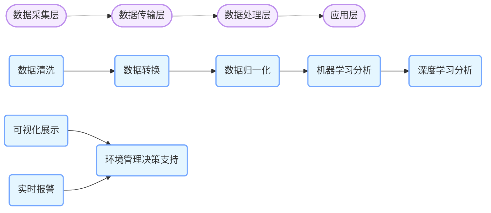

# 构建企业级环境监测AI：助力合规与可持续发展

> 关键词：企业级环境监测、AI技术、合规、可持续发展、数据处理、机器学习算法、传感器技术

> 摘要：本文围绕构建企业级环境监测AI展开，深入探讨其在助力企业合规与可持续发展方面的重要意义和价值。首先介绍了企业级环境监测的背景，包括目的、预期读者、文档结构和相关术语。接着阐述了环境监测AI的核心概念与联系，通过文本示意图和Mermaid流程图清晰呈现其架构。详细讲解了核心算法原理，用Python源代码进行了阐述，并介绍了相关数学模型和公式。通过项目实战，展示了开发环境搭建、源代码实现与解读。分析了实际应用场景，推荐了学习资源、开发工具框架和相关论文著作。最后总结了未来发展趋势与挑战，还提供了常见问题解答和参考资料，旨在为企业构建环境监测AI系统提供全面、深入的技术指导和参考。

## 1. 背景介绍 
### 1.1 目的和范围
企业在运营过程中面临着越来越严格的环境法规要求，同时也需要承担起可持续发展的社会责任。构建企业级环境监测AI的目的在于利用先进的人工智能技术，实现对企业生产经营过程中各类环境参数的实时、准确监测，帮助企业及时发现环境问题，确保企业的生产活动符合相关法规要求，同时为企业的可持续发展决策提供科学依据。

本文章的范围涵盖了企业级环境监测AI的各个方面，包括核心概念、算法原理、数学模型、项目实战、实际应用场景以及相关的工具和资源推荐等，旨在为企业提供一个全面的技术指导和参考，帮助企业成功构建适合自身需求的环境监测AI系统。

### 1.2 预期读者
本文的预期读者主要包括企业的管理人员、环境监测部门的工作人员、从事人工智能和环境科学研究的专业人员、软件开发者以及对企业级环境监测AI感兴趣的技术爱好者等。对于企业管理人员，本文可以帮助他们了解环境监测AI的价值和作用，为企业的战略决策提供参考；对于环境监测部门的工作人员，本文可以提供技术支持和操作指导，提升环境监测工作的效率和准确性；对于专业研究人员和软件开发者，本文可以作为深入研究和开发的技术资料；对于技术爱好者，本文可以激发他们对环境监测AI的兴趣和探索欲望。

### 1.3 文档结构概述
本文将按照以下结构进行组织：
1. **背景介绍**：介绍构建企业级环境监测AI的目的、范围、预期读者和文档结构概述，以及相关术语的定义和解释。
2. **核心概念与联系**：阐述环境监测AI的核心概念和原理，通过文本示意图和Mermaid流程图展示其架构和各个组成部分之间的联系。
3. **核心算法原理 & 具体操作步骤**：详细讲解环境监测AI中使用的核心算法原理，并用Python源代码进行具体实现和步骤说明。
4. **数学模型和公式 & 详细讲解 & 举例说明**：介绍环境监测AI中涉及的数学模型和公式，对其进行详细讲解，并通过具体例子进行说明。
5. **项目实战：代码实际案例和详细解释说明**：通过一个具体的项目实战，展示企业级环境监测AI系统的开发过程，包括开发环境搭建、源代码详细实现和代码解读。
6. **实际应用场景**：分析企业级环境监测AI在不同行业和领域的实际应用场景，以及其带来的效益和价值。
7. **工具和资源推荐**：推荐与环境监测AI相关的学习资源、开发工具框架和论文著作，帮助读者进一步深入学习和研究。
8. **总结：未来发展趋势与挑战**：总结企业级环境监测AI的发展现状，分析未来的发展趋势和面临的挑战。
9. **附录：常见问题与解答**：提供一些常见问题的解答，帮助读者解决在学习和实践过程中遇到的问题。
10. **扩展阅读 & 参考资料**：提供相关的扩展阅读资料和参考书目，方便读者进一步查阅和学习。

### 1.4 术语表
#### 1.4.1 核心术语定义
- **企业级环境监测**：指企业为了确保自身生产经营活动符合环境法规要求，对企业内部和周边环境的各类参数进行实时、准确监测的过程。
- **AI（人工智能）**：是一门研究如何使计算机能够模拟人类智能的学科和技术，包括机器学习、深度学习、自然语言处理等多个领域。
- **合规**：指企业的生产经营活动符合国家和地方相关环境法规、标准和政策的要求。
- **可持续发展**：指既满足当代人的需求，又不损害后代人满足其需求的能力的发展模式，企业的可持续发展要求在经济、社会和环境三个方面实现协调发展。
- **传感器**：是一种能够感知环境参数并将其转换为电信号或其他可测量信号的设备，在环境监测中广泛应用。

#### 1.4.2 相关概念解释
- **数据采集**：指通过传感器等设备收集环境参数数据的过程，是环境监测的基础环节。
- **数据预处理**：对采集到的原始数据进行清洗、转换、归一化等处理，以提高数据的质量和可用性。
- **机器学习算法**：是人工智能中的一类算法，通过对数据的学习和分析，自动发现数据中的规律和模式，用于预测、分类、聚类等任务。
- **深度学习**：是机器学习的一个分支，通过构建多层神经网络来学习数据的深层特征，在图像识别、语音识别等领域取得了显著的成果。

#### 1.4.3 缩略词列表
- **AI**：Artificial Intelligence（人工智能）
- **ML**：Machine Learning（机器学习）
- **DL**：Deep Learning（深度学习）
- **IoT**：Internet of Things（物联网）

## 2. 核心概念与联系 

### 核心概念原理
企业级环境监测AI系统主要由数据采集层、数据传输层、数据处理层和应用层四个部分组成。

- **数据采集层**：通过各种类型的传感器，如空气质量传感器、水质传感器、噪声传感器等，实时采集企业内部和周边环境的各类参数数据，如空气质量指标（PM2.5、PM10、二氧化硫、氮氧化物等）、水质指标（酸碱度、溶解氧、化学需氧量等）、噪声强度等。
- **数据传输层**：将采集到的环境数据通过有线或无线通信网络传输到数据处理中心，常用的通信技术包括以太网、Wi-Fi、蓝牙、ZigBee、4G/5G等。
- **数据处理层**：对传输过来的原始数据进行预处理，包括数据清洗、转换、归一化等操作，以提高数据的质量和可用性。然后利用机器学习和深度学习算法对处理后的数据进行分析和挖掘，提取有价值的信息和知识，如环境质量评估、环境趋势预测、污染源定位等。
- **应用层**：将数据处理层得到的结果以直观的方式呈现给用户，如通过可视化界面展示环境监测数据和分析结果，为企业的环境管理决策提供支持。同时，系统还可以根据预设的规则和阈值，对异常环境数据进行实时报警，提醒企业及时采取措施。

### 架构的文本示意图
```plaintext
+----------------+        +----------------+        +----------------+        +----------------+
|  数据采集层    | -----> |  数据传输层    | -----> |  数据处理层    | -----> |  应用层        |
|  （传感器）    |        |  （通信网络）  |        |  （数据处理    |        |  （可视化界面 |
|                |        |                |        |   与分析）     |        |   与报警）     |
+----------------+        +----------------+        +----------------+        +----------------+
```

### Mermaid 流程图


## 3. 核心算法原理 & 具体操作步骤 

### 核心算法原理
在企业级环境监测AI中，常用的机器学习算法包括线性回归、逻辑回归、决策树、随机森林、支持向量机等，深度学习算法包括卷积神经网络（CNN）、循环神经网络（RNN）、长短期记忆网络（LSTM）等。下面以线性回归和LSTM为例，介绍其原理和应用。

#### 线性回归
线性回归是一种用于预测连续数值的机器学习算法，其基本思想是通过寻找一个线性函数来拟合输入特征和输出目标之间的关系。线性回归模型的一般形式为：

$$y = \theta_0 + \theta_1x_1 + \theta_2x_2 + \cdots + \theta_nx_n$$

其中，$y$ 是输出目标，$x_1, x_2, \cdots, x_n$ 是输入特征，$\theta_0, \theta_1, \cdots, \theta_n$ 是模型的参数。线性回归的目标是通过最小化预测值和真实值之间的误差，来确定最优的参数 $\theta$。常用的误差度量方法是均方误差（MSE）：

$$MSE = \frac{1}{m}\sum_{i=1}^{m}(y^{(i)} - \hat{y}^{(i)})^2$$

其中，$m$ 是样本数量，$y^{(i)}$ 是第 $i$ 个样本的真实值，$\hat{y}^{(i)}$ 是第 $i$ 个样本的预测值。

#### LSTM
LSTM（长短期记忆网络）是一种特殊的循环神经网络，能够有效地处理序列数据中的长期依赖关系。在环境监测中，LSTM可以用于对环境参数的时间序列数据进行预测。LSTM的核心是其内部的记忆单元，包括输入门、遗忘门和输出门，这些门控机制可以控制信息的流入、流出和保留。

### 具体操作步骤及Python源代码实现

#### 线性回归示例
```python
import numpy as np
from sklearn.linear_model import LinearRegression
from sklearn.model_selection import train_test_split
from sklearn.metrics import mean_squared_error

# 生成示例数据
np.random.seed(0)
X = np.random.rand(100, 1)
y = 2 * X + 1 + 0.5 * np.random.randn(100, 1)

# 划分训练集和测试集
X_train, X_test, y_train, y_test = train_test_split(X, y, test_size=0.2, random_state=42)

# 创建线性回归模型
model = LinearRegression()

# 训练模型
model.fit(X_train, y_train)

# 预测
y_pred = model.predict(X_test)

# 计算均方误差
mse = mean_squared_error(y_test, y_pred)
print(f"均方误差: {mse}")
```

#### LSTM示例
```python
import numpy as np
import pandas as pd
from keras.models import Sequential
from keras.layers import LSTM, Dense
from sklearn.preprocessing import MinMaxScaler
import matplotlib.pyplot as plt

# 生成示例时间序列数据
data = pd.Series(np.sin(np.arange(0, 100, 0.1)))

# 数据预处理
scaler = MinMaxScaler(feature_range=(0, 1))
data = scaler.fit_transform(data.values.reshape(-1, 1))

# 划分训练集和测试集
train_size = int(len(data) * 0.8)
train_data = data[:train_size]
test_data = data[train_size:]

# 准备训练数据
def create_dataset(dataset, look_back=1):
    dataX, dataY = [], []
    for i in range(len(dataset)-look_back-1):
        a = dataset[i:(i+look_back), 0]
        dataX.append(a)
        dataY.append(dataset[i + look_back, 0])
    return np.array(dataX), np.array(dataY)

look_back = 10
X_train, y_train = create_dataset(train_data, look_back)
X_test, y_test = create_dataset(test_data, look_back)

# 调整输入数据的形状以适应LSTM模型
X_train = np.reshape(X_train, (X_train.shape[0], X_train.shape[1], 1))
X_test = np.reshape(X_test, (X_test.shape[0], X_test.shape[1], 1))

# 创建LSTM模型
model = Sequential()
model.add(LSTM(50, input_shape=(look_back, 1)))
model.add(Dense(1))
model.compile(loss='mean_squared_error', optimizer='adam')

# 训练模型
model.fit(X_train, y_train, epochs=100, batch_size=1, verbose=2)

# 预测
train_predict = model.predict(X_train)
test_predict = model.predict(X_test)

# 反归一化
train_predict = scaler.inverse_transform(train_predict)
y_train = scaler.inverse_transform([y_train])
test_predict = scaler.inverse_transform(test_predict)
y_test = scaler.inverse_transform([y_test])

# 绘制结果
plt.plot(scaler.inverse_transform(data), label='Original Data')
plt.plot(np.arange(look_back, len(train_predict)+look_back), train_predict, label='Train Predict')
plt.plot(np.arange(len(train_predict)+(look_back*2)+1, len(data)-1), test_predict, label='Test Predict')
plt.legend()
plt.show()
```

## 4. 数学模型和公式 & 详细讲解 & 举例说明 

### 线性回归的数学模型和公式
线性回归的数学模型如前面所述为：

$$y = \theta_0 + \theta_1x_1 + \theta_2x_2 + \cdots + \theta_nx_n$$

可以用矩阵形式表示为：

$$\mathbf{y} = \mathbf{X}\boldsymbol{\theta}$$

其中，$\mathbf{y}$ 是 $m \times 1$ 的输出目标向量，$\mathbf{X}$ 是 $m \times (n + 1)$ 的输入特征矩阵（第一列全为 1，对应截距项 $\theta_0$），$\boldsymbol{\theta}$ 是 $(n + 1) \times 1$ 的参数向量。

线性回归的目标是最小化均方误差（MSE），可以通过正规方程求解最优参数 $\boldsymbol{\theta}$：

$$\boldsymbol{\theta} = (\mathbf{X}^T\mathbf{X})^{-1}\mathbf{X}^T\mathbf{y}$$

#### 举例说明
假设有一组数据，输入特征 $x$ 为房屋面积，输出目标 $y$ 为房屋价格。我们有以下三个样本：

| 房屋面积 ($x$) | 房屋价格 ($y$) |
| -------------- | -------------- |
| 100            | 200            |
| 150            | 300            |
| 200            | 400            |

首先，将数据转换为矩阵形式：

$$\mathbf{X} = \begin{bmatrix} 1 & 100 \\ 1 & 150 \\ 1 & 200 \end{bmatrix}$$

$$\mathbf{y} = \begin{bmatrix} 200 \\ 300 \\ 400 \end{bmatrix}$$

然后，计算 $\mathbf{X}^T\mathbf{X}$：

$$\mathbf{X}^T\mathbf{X} = \begin{bmatrix} 1 & 1 & 1 \\ 100 & 150 & 200 \end{bmatrix} \begin{bmatrix} 1 & 100 \\ 1 & 150 \\ 1 & 200 \end{bmatrix} = \begin{bmatrix} 3 & 450 \\ 450 & 72500 \end{bmatrix}$$

接着，计算 $(\mathbf{X}^T\mathbf{X})^{-1}$：

$$(\mathbf{X}^T\mathbf{X})^{-1} = \frac{1}{3 \times 72500 - 450^2} \begin{bmatrix} 72500 & -450 \\ -450 & 3 \end{bmatrix} = \begin{bmatrix} 0.0029 & -0.000018 \\ -0.000018 & 0.0000012 \end{bmatrix}$$

再计算 $\mathbf{X}^T\mathbf{y}$：

$$\mathbf{X}^T\mathbf{y} = \begin{bmatrix} 1 & 1 & 1 \\ 100 & 150 & 200 \end{bmatrix} \begin{bmatrix} 200 \\ 300 \\ 400 \end{bmatrix} = \begin{bmatrix} 900 \\ 155000 \end{bmatrix}$$

最后，计算最优参数 $\boldsymbol{\theta}$：

$$\boldsymbol{\theta} = (\mathbf{X}^T\mathbf{X})^{-1}\mathbf{X}^T\mathbf{y} = \begin{bmatrix} 0.0029 & -0.000018 \\ -0.000018 & 0.0000012 \end{bmatrix} \begin{bmatrix} 900 \\ 155000 \end{bmatrix} = \begin{bmatrix} 0 \\ 2 \end{bmatrix}$$

所以，线性回归模型为 $y = 0 + 2x$，即房屋价格是房屋面积的 2 倍。

### LSTM的数学模型和公式
LSTM的核心是其内部的记忆单元，包括输入门 $i_t$、遗忘门 $f_t$、输出门 $o_t$ 和细胞状态 $C_t$。其计算公式如下：

- 遗忘门：

$$f_t = \sigma(\mathbf{W}_f[\mathbf{h}_{t-1}, \mathbf{x}_t] + \mathbf{b}_f)$$

- 输入门：

$$i_t = \sigma(\mathbf{W}_i[\mathbf{h}_{t-1}, \mathbf{x}_t] + \mathbf{b}_i)$$

$$\tilde{C}_t = \tanh(\mathbf{W}_C[\mathbf{h}_{t-1}, \mathbf{x}_t] + \mathbf{b}_C)$$

- 细胞状态更新：

$$C_t = f_t \odot C_{t-1} + i_t \odot \tilde{C}_t$$

- 输出门：

$$o_t = \sigma(\mathbf{W}_o[\mathbf{h}_{t-1}, \mathbf{x}_t] + \mathbf{b}_o)$$

$$\mathbf{h}_t = o_t \odot \tanh(C_t)$$

其中，$\sigma$ 是 sigmoid 函数，$\tanh$ 是双曲正切函数，$\mathbf{W}$ 是权重矩阵，$\mathbf{b}$ 是偏置向量，$\odot$ 表示逐元素相乘，$\mathbf{h}_{t-1}$ 是上一时刻的隐藏状态，$\mathbf{x}_t$ 是当前时刻的输入。

#### 举例说明
假设我们有一个简单的 LSTM 单元，输入维度为 2，隐藏维度为 3。在某一时刻 $t$，输入 $\mathbf{x}_t = \begin{bmatrix} 0.5 \\ 0.3 \end{bmatrix}$，上一时刻的隐藏状态 $\mathbf{h}_{t-1} = \begin{bmatrix} 0.2 \\ 0.4 \\ 0.1 \end{bmatrix}$，细胞状态 $C_{t-1} = \begin{bmatrix} 0.1 \\ 0.3 \\ 0.2 \end{bmatrix}$。

首先，计算遗忘门：

$$[\mathbf{h}_{t-1}, \mathbf{x}_t] = \begin{bmatrix} 0.2 \\ 0.4 \\ 0.1 \\ 0.5 \\ 0.3 \end{bmatrix}$$

假设遗忘门的权重矩阵 $\mathbf{W}_f$ 和偏置向量 $\mathbf{b}_f$ 如下：

$$\mathbf{W}_f = \begin{bmatrix} 0.1 & 0.2 & 0.3 & 0.4 & 0.5 \\ 0.6 & 0.7 & 0.8 & 0.9 & 1.0 \\ 1.1 & 1.2 & 1.3 & 1.4 & 1.5 \end{bmatrix}$$

$$\mathbf{b}_f = \begin{bmatrix} 0.1 \\ 0.2 \\ 0.3 \end{bmatrix}$$

则：

$$\mathbf{W}_f[\mathbf{h}_{t-1}, \mathbf{x}_t] + \mathbf{b}_f = \begin{bmatrix} 0.1 & 0.2 & 0.3 & 0.4 & 0.5 \\ 0.6 & 0.7 & 0.8 & 0.9 & 1.0 \\ 1.1 & 1.2 & 1.3 & 1.4 & 1.5 \end{bmatrix} \begin{bmatrix} 0.2 \\ 0.4 \\ 0.1 \\ 0.5 \\ 0.3 \end{bmatrix} + \begin{bmatrix} 0.1 \\ 0.2 \\ 0.3 \end{bmatrix} = \begin{bmatrix} 0.5 \\ 1.2 \\ 1.9 \end{bmatrix}$$

$$f_t = \sigma(\begin{bmatrix} 0.5 \\ 1.2 \\ 1.9 \end{bmatrix}) = \begin{bmatrix} 0.622 \\ 0.769 \\ 0.875 \end{bmatrix}$$

按照同样的方法，可以计算输入门、细胞状态更新和输出门，最终得到当前时刻的隐藏状态 $\mathbf{h}_t$。

## 5. 项目实战：代码实际案例和详细解释说明 

### 5.1  开发环境搭建
#### 硬件环境
- **传感器设备**：根据企业的具体需求，选择合适的环境传感器，如空气质量传感器、水质传感器、噪声传感器等。确保传感器的精度和可靠性满足监测要求。
- **数据采集设备**：可以使用单片机（如 Arduino、Raspberry Pi 等）或工业数据采集模块来采集传感器数据。
- **服务器**：选择性能稳定的服务器来运行环境监测AI系统，服务器的配置应根据数据量和处理需求进行合理选择。

#### 软件环境
- **操作系统**：可以选择 Linux 系统（如 Ubuntu、CentOS 等）或 Windows 系统作为服务器的操作系统。
- **编程语言**：选择 Python 作为主要的编程语言，因为 Python 具有丰富的科学计算和机器学习库，如 NumPy、Pandas、Scikit-learn、Keras 等。
- **数据库**：选择合适的数据库来存储环境监测数据，如 MySQL、PostgreSQL 等。
- **开发框架**：可以使用 Flask 或 Django 等 Web 开发框架来构建环境监测AI系统的用户界面和服务接口。

### 5.2  源代码详细实现和代码解读
以下是一个简单的企业级环境监测AI系统的代码示例，包括数据采集、数据处理和可视化展示三个部分。

#### 数据采集部分
```python
import serial
import time

# 初始化串口通信
ser = serial.Serial('COM3', 9600)  # 根据实际情况修改串口和波特率

try:
    while True:
        if ser.in_waiting:
            data = ser.readline().decode('utf-8').rstrip()
            print(f"采集到的数据: {data}")
            # 这里可以将数据存储到数据库中
            time.sleep(1)
except KeyboardInterrupt:
    ser.close()
    print("数据采集停止")
```

**代码解读**：这段代码使用 Python 的 `serial` 库来实现串口通信，从传感器设备读取环境数据。通过不断监听串口缓冲区，当有数据到来时，读取数据并打印出来。可以在代码中添加将数据存储到数据库的逻辑。

#### 数据处理部分
```python
import pandas as pd
from sklearn.preprocessing import StandardScaler
from sklearn.linear_model import LinearRegression

# 读取数据
data = pd.read_csv('environmental_data.csv')

# 数据预处理
X = data.drop('target_variable', axis=1)
y = data['target_variable']

scaler = StandardScaler()
X_scaled = scaler.fit_transform(X)

# 训练模型
model = LinearRegression()
model.fit(X_scaled, y)

# 预测
new_data = pd.DataFrame({'feature1': [1], 'feature2': [2]})  # 示例新数据
new_data_scaled = scaler.transform(new_data)
prediction = model.predict(new_data_scaled)
print(f"预测结果: {prediction}")
```

**代码解读**：这段代码使用 Pandas 库读取环境监测数据，使用 `StandardScaler` 对数据进行标准化处理，然后使用线性回归模型进行训练和预测。可以根据实际需求选择不同的机器学习算法。

#### 可视化展示部分
```python
import pandas as pd
import matplotlib.pyplot as plt

# 读取数据
data = pd.read_csv('environmental_data.csv')

# 绘制折线图
plt.plot(data['time'], data['temperature'], label='Temperature')
plt.plot(data['time'], data['humidity'], label='Humidity')
plt.xlabel('Time')
plt.ylabel('Value')
plt.title('Environmental Data Visualization')
plt.legend()
plt.show()
```

**代码解读**：这段代码使用 Pandas 读取环境监测数据，使用 Matplotlib 库绘制折线图，将温度和湿度数据可视化展示。可以根据需要绘制不同类型的图表。

### 5.3  代码解读与分析
- **数据采集部分**：通过串口通信实现了从传感器设备实时采集环境数据的功能。在实际应用中，需要根据传感器的通信协议和接口类型进行相应的调整。同时，为了确保数据的完整性和可靠性，需要添加数据校验和错误处理机制。
- **数据处理部分**：对采集到的环境数据进行预处理和机器学习分析。数据预处理的目的是提高数据的质量和可用性，常用的方法包括数据清洗、转换、归一化等。机器学习算法的选择应根据具体的任务和数据特点进行，如线性回归适用于预测连续数值，逻辑回归适用于分类任务等。
- **可视化展示部分**：将处理后的数据以直观的图表形式展示给用户，方便用户进行数据分析和决策。可视化图表的类型应根据数据的特点和用户的需求进行选择，如折线图适用于展示时间序列数据，柱状图适用于比较不同类别数据等。

## 6. 实际应用场景 
### 工业企业
工业企业在生产过程中会产生大量的废气、废水和废渣等污染物，对环境造成严重影响。企业级环境监测AI系统可以实时监测工业废气中的污染物浓度、废水的水质指标等，及时发现环境问题并采取措施进行治理。同时，通过对环境数据的分析和预测，企业可以优化生产工艺，减少污染物排放，降低环境风险。

### 能源企业
能源企业如煤矿、石油、天然气等在开采和加工过程中也会对环境造成一定的影响。环境监测AI系统可以监测煤矿开采过程中的粉尘浓度、瓦斯含量等，石油和天然气开采过程中的废水排放、土壤污染等，帮助能源企业确保生产安全，减少环境污染。

### 建筑行业
建筑施工过程中会产生噪声、粉尘等污染物，对周边环境和居民生活造成影响。企业级环境监测AI系统可以实时监测建筑施工过程中的噪声强度、粉尘浓度等，及时提醒施工单位采取降噪、降尘措施，减少对周边环境的影响。

### 农业领域
农业生产过程中使用的化肥、农药等会对土壤和水体造成污染。环境监测AI系统可以监测土壤的酸碱度、肥力指标，水体的农药残留等，帮助农民合理使用化肥、农药，提高农产品质量，保护生态环境。

## 7. 工具和资源推荐
### 7.1 学习资源推荐
#### 7.1.1 书籍推荐
- 《Python 数据分析实战》：本书介绍了使用 Python 进行数据分析的方法和技巧，包括数据处理、可视化、机器学习等内容，适合初学者入门。
- 《机器学习》（周志华著）：这本书是机器学习领域的经典教材，系统地介绍了机器学习的基本概念、算法和应用，适合深入学习机器学习的读者。
- 《深度学习》（Ian Goodfellow 等著）：该书是深度学习领域的权威著作，全面介绍了深度学习的理论和实践，适合有一定基础的读者。

#### 7.1.2 在线课程
- Coursera 上的“机器学习”课程（Andrew Ng 教授授课）：该课程是机器学习领域的经典在线课程，内容丰富，讲解详细，适合初学者学习。
- edX 上的“深度学习基础”课程：该课程介绍了深度学习的基本概念和算法，通过实际案例进行讲解，帮助学习者快速掌握深度学习的知识和技能。
- 中国大学 MOOC 上的“人工智能”课程：该课程涵盖了人工智能的各个方面，包括机器学习、深度学习、自然语言处理等，适合全面了解人工智能的读者。

#### 7.1.3 技术博客和网站
- 机器之心（https://www.alternativeright.com/）：提供人工智能领域的最新技术资讯、研究成果和案例分析，是了解人工智能发展动态的重要渠道。
- 开源中国（https://www.oschina.net/）：是国内知名的开源技术社区，提供大量的开源项目和技术文章，适合开发者学习和交流。
- 博客园（https://www.cnblogs.com/）：是国内的技术博客平台，有很多技术专家和开发者分享自己的经验和心得，适合学习和借鉴。

### 7.2 开发工具框架推荐
#### 7.2.1 IDE和编辑器
- PyCharm：是一款专业的 Python 集成开发环境，具有代码编辑、调试、自动补全、版本控制等功能，适合 Python 开发者使用。
- Visual Studio Code：是一款轻量级的代码编辑器，支持多种编程语言，具有丰富的插件和扩展功能，适合快速开发和调试。
- Jupyter Notebook：是一款交互式的笔记本环境，支持 Python、R 等多种编程语言，适合数据科学和机器学习的开发和实验。

#### 7.2.2 调试和性能分析工具
- PySnooper：是一个简单易用的 Python 调试工具，可以自动记录函数的执行过程和变量的值，方便调试代码。
- cProfile：是 Python 内置的性能分析工具，可以分析代码的运行时间和函数调用情况，帮助优化代码性能。
- TensorBoard：是 TensorFlow 提供的可视化工具，可以用于可视化训练过程、模型结构、数据分布等，帮助开发者更好地理解和优化深度学习模型。

#### 7.2.3 相关框架和库
- NumPy：是 Python 中用于科学计算的基础库，提供了高效的多维数组对象和数学函数，是许多机器学习和数据分析库的基础。
- Pandas：是 Python 中用于数据处理和分析的库，提供了高效的数据结构和数据操作方法，如数据读取、清洗、转换等。
- Scikit-learn：是 Python 中常用的机器学习库，提供了丰富的机器学习算法和工具，如分类、回归、聚类等。
- Keras：是一个高级的深度学习库，提供了简单易用的 API 接口，适合快速搭建和训练深度学习模型。
- TensorFlow：是一个开源的深度学习框架，具有强大的计算能力和分布式训练功能，适合大规模的深度学习开发和研究。

### 7.3 相关论文著作推荐
#### 7.3.1 经典论文
- “Gradient-based learning applied to document recognition”（Yann LeCun 等著）：该论文介绍了卷积神经网络（CNN）的基本原理和应用，是深度学习领域的经典论文之一。
- “Long Short-Term Memory”（Sepp Hochreiter 和 Jürgen Schmidhuber 著）：该论文提出了长短期记忆网络（LSTM）的概念，解决了循环神经网络中的长期依赖问题。
- “A Unified Approach to Interpreting Model Predictions”（Scott Lundberg 和 Su-In Lee 著）：该论文介绍了 SHAP（SHapley Additive exPlanations）方法，用于解释机器学习模型的预测结果。

#### 7.3.2 最新研究成果
- 关注顶级学术会议如 NeurIPS、ICML、CVPR 等的最新研究成果，这些会议涵盖了人工智能和机器学习领域的最新技术和方法。
- 查阅相关学术期刊如 Journal of Artificial Intelligence Research、Artificial Intelligence 等的最新论文，了解该领域的前沿研究动态。

#### 7.3.3 应用案例分析
- 参考一些实际应用案例分析的书籍和报告，如《人工智能在环境监测中的应用案例》等，了解企业级环境监测AI系统在实际应用中的成功经验和解决方案。

## 8. 总结：未来发展趋势与挑战
### 未来发展趋势
- **多传感器融合**：未来的企业级环境监测AI系统将融合更多类型的传感器，如卫星遥感、无人机监测等，实现对环境的全方位、多层次监测，提高监测的精度和覆盖范围。
- **智能化决策支持**：随着人工智能技术的不断发展，环境监测AI系统将不仅仅是数据的采集和分析，还将提供智能化的决策支持功能，如根据环境数据自动生成治理方案、预测环境风险等，帮助企业更好地进行环境管理和决策。
- **与物联网的深度融合**：物联网技术的发展将使得环境监测设备更加智能化、网络化，实现设备之间的互联互通和数据共享。企业级环境监测AI系统将与物联网深度融合，形成一个更加高效、智能的环境监测网络。
- **跨领域应用**：环境监测AI技术将与其他领域如能源、交通、农业等进行深度融合，拓展其应用场景和领域，为解决复杂的环境问题提供更加综合的解决方案。

### 挑战
- **数据质量和安全**：环境监测数据的质量和安全是企业级环境监测AI系统面临的重要挑战。数据的不准确、不完整或被篡改可能会导致错误的分析结果和决策。同时，数据的泄露和滥用也会对企业和社会造成严重的影响。因此，需要加强数据质量管理和安全保护措施。
- **算法复杂度和计算资源需求**：随着环境监测数据量的不断增加和人工智能算法的不断发展，环境监测AI系统的算法复杂度和计算资源需求也在不断提高。如何在有限的计算资源下实现高效的算法和模型训练，是一个需要解决的问题。
- **法律法规和标准规范**：目前，关于企业级环境监测AI系统的法律法规和标准规范还不够完善，这给系统的开发、应用和管理带来了一定的困难。需要加强相关法律法规和标准规范的制定和完善，确保环境监测AI系统的合法、合规运行。
- **人才短缺**：企业级环境监测AI系统的开发和应用需要具备环境科学、人工智能、计算机科学等多学科知识的复合型人才。目前，这类人才相对短缺，限制了环境监测AI技术的发展和应用。需要加强相关人才的培养和引进。

## 9. 附录：常见问题与解答
### 1. 如何选择合适的环境传感器？
选择合适的环境传感器需要考虑以下几个因素：
- **监测参数**：根据企业的具体需求，确定需要监测的环境参数，如空气质量、水质、噪声等。
- **精度和可靠性**：选择精度高、可靠性好的传感器，确保监测数据的准确性和稳定性。
- **测量范围**：根据实际监测环境的情况，选择合适的测量范围，避免传感器过载或测量不准确。
- **响应时间**：对于需要实时监测的环境参数，选择响应时间短的传感器，以便及时发现环境变化。
- **成本**：在满足监测要求的前提下，选择成本合理的传感器，降低企业的投资成本。

### 2. 如何保证环境监测数据的质量？
保证环境监测数据的质量可以从以下几个方面入手：
- **传感器校准**：定期对传感器进行校准，确保传感器的测量精度和准确性。
- **数据采集和传输**：采用可靠的数据采集设备和通信网络，确保数据的完整性和准确性。
- **数据预处理**：对采集到的原始数据进行清洗、转换、归一化等预处理操作，去除噪声和异常值，提高数据的质量。
- **质量控制**：建立数据质量控制体系，对数据的采集、处理、存储等过程进行严格的质量控制和审核。

### 3. 如何选择合适的机器学习算法？
选择合适的机器学习算法需要考虑以下几个因素：
- **任务类型**：根据具体的任务类型，如分类、回归、聚类等，选择合适的机器学习算法。
- **数据特点**：考虑数据的规模、维度、分布等特点，选择适合的数据处理和算法模型。
- **模型复杂度**：在保证模型性能的前提下，选择复杂度较低的模型，避免过拟合和计算资源的浪费。
- **可解释性**：对于一些需要解释模型预测结果的应用场景，选择可解释性较好的算法，如决策树、线性回归等。

### 4. 如何保障环境监测AI系统的安全性？
保障环境监测AI系统的安全性可以从以下几个方面入手：
- **数据加密**：对环境监测数据进行加密处理，确保数据在传输和存储过程中的安全性。
- **访问控制**：建立严格的访问控制机制，对系统的用户进行身份认证和授权管理，防止非法访问和数据泄露。
- **网络安全**：加强网络安全防护，如安装防火墙、入侵检测系统等，防止网络攻击和恶意软件的入侵。
- **备份和恢复**：定期对环境监测数据和系统进行备份，以便在发生数据丢失或系统故障时能够及时恢复。

## 10. 扩展阅读 & 参考资料
### 扩展阅读
- 《人工智能时代的环境监测与管理》
- 《环境数据科学与机器学习应用》
- 《物联网与环境监测技术》

### 参考资料
- 《环境空气质量标准》（GB 3095-2012）
- 《地表水环境质量标准》（GB 3838-2002）
- 《工业企业厂界环境噪声排放标准》（GB 12348-2008）
- 相关的学术论文和研究报告，如 IEEE Transactions on Neural Networks and Learning Systems、ACM Transactions on Intelligent Systems and Technology 等期刊上的论文。