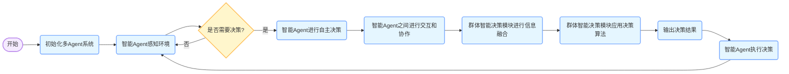

# 构建具有群体智能决策能力的多Agent系统

> 关键词：多Agent系统、群体智能决策、智能算法、分布式计算、人工智能

> 摘要：本文围绕构建具有群体智能决策能力的多Agent系统展开深入探讨。首先介绍了多Agent系统和群体智能决策的背景知识，包括目的、预期读者、文档结构和相关术语。接着阐述了核心概念及其联系，通过文本示意图和Mermaid流程图进行直观展示。详细讲解了核心算法原理和具体操作步骤，并用Python代码进行说明。给出了数学模型和公式，并举例解释。通过项目实战展示了代码的实际应用和详细解读。分析了多Agent系统在不同场景下的实际应用，推荐了相关的学习资源、开发工具框架和论文著作。最后总结了未来发展趋势与挑战，提供了常见问题解答和扩展阅读参考资料，旨在为读者全面呈现构建具有群体智能决策能力的多Agent系统的相关知识和技术。

## 1. 背景介绍 

### 1.1 目的和范围
多Agent系统（Multi-Agent System，MAS）是人工智能领域中的一个重要研究方向，它由多个自主的智能Agent组成，这些Agent能够在一定的环境中交互和协作，以实现共同的目标。构建具有群体智能决策能力的多Agent系统的目的在于利用群体的智慧和协作，解决复杂的问题，提高决策的效率和质量。

本文的范围涵盖了多Agent系统和群体智能决策的基本概念、核心算法、数学模型、项目实战、实际应用场景以及相关的工具和资源推荐等方面。通过本文的学习，读者将能够深入理解多Agent系统的群体智能决策机制，并掌握构建此类系统的基本方法和技术。

### 1.2 预期读者
本文预期读者包括人工智能、计算机科学、自动化等领域的研究人员、学生和从业人员。对于对多Agent系统和群体智能决策感兴趣的初学者，本文将提供一个系统的入门指南；对于有一定经验的专业人士，本文将提供深入的技术分析和实践案例，帮助他们进一步提升相关技能和知识。

### 1.3 文档结构概述
本文将按照以下结构进行组织：
- 核心概念与联系：介绍多Agent系统和群体智能决策的核心概念，并通过文本示意图和Mermaid流程图展示它们之间的联系。
- 核心算法原理 & 具体操作步骤：详细讲解构建具有群体智能决策能力的多Agent系统所涉及的核心算法原理，并给出具体的操作步骤和Python代码实现。
- 数学模型和公式 & 详细讲解 & 举例说明：建立多Agent系统群体智能决策的数学模型，给出相关公式，并通过具体例子进行详细解释。
- 项目实战：代码实际案例和详细解释说明：通过一个实际的项目案例，展示如何构建具有群体智能决策能力的多Agent系统，并对代码进行详细解读。
- 实际应用场景：分析多Agent系统群体智能决策在不同领域的实际应用场景。
- 工具和资源推荐：推荐相关的学习资源、开发工具框架和论文著作。
- 总结：未来发展趋势与挑战：总结多Agent系统群体智能决策的未来发展趋势和面临的挑战。
- 附录：常见问题与解答：提供常见问题的解答，帮助读者解决遇到的问题。
- 扩展阅读 & 参考资料：提供扩展阅读的建议和相关参考资料。

### 1.4 术语表

#### 1.4.1 核心术语定义
- **多Agent系统（Multi-Agent System，MAS）**：由多个自主的智能Agent组成的系统，这些Agent能够在一定的环境中交互和协作，以实现共同的目标。
- **智能Agent（Intelligent Agent）**：具有自主决策能力、能够感知环境并与其他Agent进行交互的实体。
- **群体智能决策（Swarm Intelligence Decision-making）**：多个智能Agent通过协作和交互，利用群体的智慧和经验，做出最优决策的过程。
- **分布式计算（Distributed Computing）**：将计算任务分配到多个计算节点上进行并行处理的计算模式。

#### 1.4.2 相关概念解释
- **自主决策**：智能Agent能够根据自身的知识和经验，独立地做出决策，而不需要外部的干预。
- **环境感知**：智能Agent能够感知周围环境的信息，包括其他Agent的状态、环境的变化等。
- **交互与协作**：智能Agent之间能够通过通信和协调，实现信息共享和任务分配，以达到共同的目标。

#### 1.4.3 缩略词列表
- **MAS**：Multi-Agent System，多Agent系统
- **AI**：Artificial Intelligence，人工智能

## 2. 核心概念与联系 

### 核心概念原理
多Agent系统是由多个智能Agent组成的分布式系统，每个智能Agent都具有一定的自主决策能力和环境感知能力。这些Agent通过交互和协作，共同完成系统的任务。群体智能决策是多Agent系统中的一个重要应用，它利用多个智能Agent的智慧和经验，通过协作和交互，做出最优决策。

在多Agent系统中，每个智能Agent都有自己的目标和任务，它们通过与其他Agent的交互和协作，实现信息共享和任务分配。例如，在一个物流配送系统中，每个配送车辆可以看作一个智能Agent，它们通过与其他车辆和调度中心的交互，合理规划配送路线，提高配送效率。

群体智能决策的核心原理是利用群体的智慧和经验，通过多个智能Agent的协作和交互，找到最优的决策方案。例如，在一个投资决策系统中，多个投资专家可以看作多个智能Agent，他们通过交流和讨论，综合考虑各种因素，做出最优的投资决策。

### 架构的文本示意图
```plaintext
多Agent系统
|-- 智能Agent 1
|   |-- 自主决策模块
|   |-- 环境感知模块
|   |-- 通信模块
|-- 智能Agent 2
|   |-- 自主决策模块
|   |-- 环境感知模块
|   |-- 通信模块
|-- ...
|-- 智能Agent n
|   |-- 自主决策模块
|   |-- 环境感知模块
|   |-- 通信模块
|-- 群体智能决策模块
    |-- 信息融合
    |-- 决策算法
    |-- 结果输出
```

### Mermaid流程图


## 3. 核心算法原理 & 具体操作步骤 

### 核心算法原理
在构建具有群体智能决策能力的多Agent系统中，常用的算法包括蚁群算法、粒子群算法、遗传算法等。下面以蚁群算法为例，介绍其核心原理。

蚁群算法是一种模拟蚂蚁群体觅食行为的优化算法。蚂蚁在寻找食物的过程中，会在路径上留下一种称为信息素的物质，其他蚂蚁可以通过感知信息素的浓度来选择路径。信息素浓度越高的路径，被选择的概率越大。随着时间的推移，蚂蚁会逐渐找到从巢穴到食物源的最短路径。

在多Agent系统中，每个智能Agent可以看作一只蚂蚁，它们在搜索空间中寻找最优解。每个智能Agent在搜索过程中，会根据信息素的浓度和启发式信息来选择下一步的行动方向。同时，智能Agent会在经过的路径上留下信息素，信息素的浓度会随着时间的推移而逐渐挥发。

### 具体操作步骤
以下是使用蚁群算法实现多Agent系统群体智能决策的具体操作步骤：

1. **初始化**：设置蚂蚁的数量、信息素的初始浓度、信息素挥发系数、启发式信息等参数。
2. **构建解**：每个蚂蚁根据信息素的浓度和启发式信息，选择下一步的行动方向，直到构建出一个完整的解。
3. **评估解**：计算每个蚂蚁构建的解的适应度值。
4. **更新信息素**：根据每个蚂蚁构建的解的适应度值，更新路径上的信息素浓度。
5. **判断终止条件**：如果满足终止条件（如达到最大迭代次数或找到最优解），则结束算法；否则，返回步骤2。

### Python源代码实现
```python
import random
import math

# 定义问题的参数
num_ants = 10  # 蚂蚁的数量
num_cities = 5  # 城市的数量
distance_matrix = [
    [0, 10, 15, 20, 25],
    [10, 0, 35, 25, 30],
    [15, 35, 0, 30, 20],
    [20, 25, 30, 0, 15],
    [25, 30, 20, 15, 0]
]  # 城市之间的距离矩阵
pheromone_matrix = [[1.0] * num_cities for _ in range(num_cities)]  # 信息素矩阵
alpha = 1.0  # 信息素重要程度因子
beta = 2.0  # 启发式信息重要程度因子
rho = 0.5  # 信息素挥发系数
Q = 100.0  # 信息素更新强度

# 计算路径的长度
def calculate_path_length(path):
    length = 0
    for i in range(len(path) - 1):
        length += distance_matrix[path[i]][path[i + 1]]
    length += distance_matrix[path[-1]][path[0]]
    return length

# 蚂蚁构建解
def ant_construct_solution():
    unvisited_cities = list(range(num_cities))
    current_city = random.choice(unvisited_cities)
    path = [current_city]
    unvisited_cities.remove(current_city)

    while unvisited_cities:
        probabilities = []
        total_probability = 0
        for city in unvisited_cities:
            pheromone = pheromone_matrix[current_city][city]
            heuristic = 1.0 / distance_matrix[current_city][city]
            probability = (pheromone ** alpha) * (heuristic ** beta)
            probabilities.append(probability)
            total_probability += probability

        next_city_index = random.choices(range(len(unvisited_cities)), weights=probabilities)[0]
        next_city = unvisited_cities[next_city_index]
        path.append(next_city)
        unvisited_cities.remove(next_city)
        current_city = next_city

    return path

# 更新信息素
def update_pheromones(paths):
    for i in range(num_cities):
        for j in range(num_cities):
            pheromone_matrix[i][j] *= (1 - rho)

    for path in paths:
        length = calculate_path_length(path)
        for i in range(len(path) - 1):
            pheromone_matrix[path[i]][path[i + 1]] += Q / length
        pheromone_matrix[path[-1]][path[0]] += Q / length

# 蚁群算法主函数
def ant_colony_algorithm(max_iterations):
    best_path = None
    best_length = float('inf')

    for iteration in range(max_iterations):
        paths = []
        for _ in range(num_ants):
            path = ant_construct_solution()
            paths.append(path)

        for path in paths:
            length = calculate_path_length(path)
            if length < best_length:
                best_length = length
                best_path = path

        update_pheromones(paths)

    return best_path, best_length

# 运行蚁群算法
max_iterations = 100
best_path, best_length = ant_colony_algorithm(max_iterations)
print("最优路径:", best_path)
print("最优路径长度:", best_length)
```

## 4. 数学模型和公式 & 详细讲解 & 举例说明 

### 数学模型
在蚁群算法中，我们可以建立以下数学模型来描述蚂蚁的决策过程和信息素的更新过程。

设 $T_{ij}(t)$ 表示在时刻 $t$ 从城市 $i$ 到城市 $j$ 的信息素浓度，$\eta_{ij}$ 表示从城市 $i$ 到城市 $j$ 的启发式信息，通常取 $\eta_{ij} = \frac{1}{d_{ij}}$，其中 $d_{ij}$ 表示城市 $i$ 到城市 $j$ 的距离。

蚂蚁 $k$ 在时刻 $t$ 从城市 $i$ 选择城市 $j$ 的概率 $p_{ij}^k(t)$ 可以表示为：

$$
p_{ij}^k(t) = \begin{cases}
\frac{[T_{ij}(t)]^{\alpha}[\eta_{ij}]^{\beta}}{\sum_{s \in allowed_k}[T_{is}(t)]^{\alpha}[\eta_{is}]^{\beta}} & \text{if } j \in allowed_k \\
0 & \text{otherwise}
\end{cases}
$$

其中，$allowed_k$ 表示蚂蚁 $k$ 还未访问的城市集合，$\alpha$ 和 $\beta$ 分别是信息素重要程度因子和启发式信息重要程度因子。

信息素的更新公式为：

$$
T_{ij}(t + 1) = (1 - \rho)T_{ij}(t) + \Delta T_{ij}(t)
$$

其中，$\rho$ 是信息素挥发系数，$\Delta T_{ij}(t)$ 是在时刻 $t$ 从城市 $i$ 到城市 $j$ 的信息素增量，通常可以表示为：

$$
\Delta T_{ij}(t) = \sum_{k = 1}^{m} \Delta T_{ij}^k(t)
$$

其中，$m$ 是蚂蚁的数量，$\Delta T_{ij}^k(t)$ 是蚂蚁 $k$ 在时刻 $t$ 从城市 $i$ 到城市 $j$ 留下的信息素增量，通常取：

$$
\Delta T_{ij}^k(t) = \begin{cases}
\frac{Q}{L_k} & \text{if 蚂蚁 } k \text{ 经过路径 } (i, j) \\
0 & \text{otherwise}
\end{cases}
$$

其中，$Q$ 是信息素更新强度，$L_k$ 是蚂蚁 $k$ 构建的路径的长度。

### 详细讲解
- **蚂蚁的决策过程**：蚂蚁在选择下一步的行动方向时，会根据信息素的浓度和启发式信息来计算每个可选路径的概率。信息素浓度越高、启发式信息越大的路径，被选择的概率越大。
- **信息素的更新过程**：信息素会随着时间的推移而逐渐挥发，同时，蚂蚁在经过的路径上会留下新的信息素。信息素的挥发可以避免算法陷入局部最优解，而新信息素的添加可以引导蚂蚁朝着更优的路径前进。

### 举例说明
假设我们有三个城市 $A$、$B$、$C$，它们之间的距离矩阵为：

$$
D = \begin{bmatrix}
0 & 10 & 15 \\
10 & 0 & 20 \\
15 & 20 & 0
\end{bmatrix}
$$

信息素的初始浓度为 $T_{ij}(0) = 1$，$\alpha = 1$，$\beta = 2$，$\rho = 0.5$，$Q = 100$。

现在有一只蚂蚁从城市 $A$ 出发，它需要选择下一步的行动方向。可选的城市有 $B$ 和 $C$。

首先计算启发式信息：

$$
\eta_{AB} = \frac{1}{d_{AB}} = \frac{1}{10} = 0.1
$$

$$
\eta_{AC} = \frac{1}{d_{AC}} = \frac{1}{15} \approx 0.067
$$

然后计算选择城市 $B$ 和 $C$ 的概率：

$$
p_{AB}^1(0) = \frac{[T_{AB}(0)]^{\alpha}[\eta_{AB}]^{\beta}}{[T_{AB}(0)]^{\alpha}[\eta_{AB}]^{\beta} + [T_{AC}(0)]^{\alpha}[\eta_{AC}]^{\beta}} = \frac{1^1 \times 0.1^2}{1^1 \times 0.1^2 + 1^1 \times 0.067^2} \approx 0.69
$$

$$
p_{AC}^1(0) = \frac{[T_{AC}(0)]^{\alpha}[\eta_{AC}]^{\beta}}{[T_{AB}(0)]^{\alpha}[\eta_{AB}]^{\beta} + [T_{AC}(0)]^{\alpha}[\eta_{AC}]^{\beta}} = \frac{1^1 \times 0.067^2}{1^1 \times 0.1^2 + 1^1 \times 0.067^2} \approx 0.31
$$

假设蚂蚁选择了城市 $B$，然后继续选择下一步的行动方向。当蚂蚁完成一次完整的路径构建后，我们需要更新信息素。

假设蚂蚁构建的路径为 $A \to B \to C \to A$，路径长度 $L_1 = 10 + 20 + 15 = 45$。

信息素的更新如下：

$$
T_{AB}(1) = (1 - \rho)T_{AB}(0) + \Delta T_{AB}(0) = (1 - 0.5) \times 1 + \frac{100}{45} \approx 2.78
$$

$$
T_{BC}(1) = (1 - \rho)T_{BC}(0) + \Delta T_{BC}(0) = (1 - 0.5) \times 1 + \frac{100}{45} \approx 2.78
$$

$$
T_{CA}(1) = (1 - \rho)T_{CA}(0) + \Delta T_{CA}(0) = (1 - 0.5) \times 1 + \frac{100}{45} \approx 2.78
$$

其他路径的信息素浓度会因为挥发而降低：

$$
T_{AC}(1) = (1 - \rho)T_{AC}(0) = (1 - 0.5) \times 1 = 0.5
$$

$$
T_{BA}(1) = (1 - \rho)T_{BA}(0) = (1 - 0.5) \times 1 = 0.5
$$

$$
T_{CB}(1) = (1 - \rho)T_{CB}(0) = (1 - 0.5) \times 1 = 0.5
$$

## 5. 项目实战：代码实际案例和详细解释说明 

### 5.1 开发环境搭建
为了实现具有群体智能决策能力的多Agent系统，我们可以使用Python语言进行开发。以下是搭建开发环境的步骤：

1. **安装Python**：从Python官方网站（https://www.python.org/downloads/）下载并安装Python 3.x版本。
2. **安装必要的库**：在命令行中使用以下命令安装必要的库：
```sh
pip install numpy matplotlib
```
其中，`numpy` 用于数值计算，`matplotlib` 用于可视化。

### 5.2 源代码详细实现和代码解读
以下是一个简单的多Agent系统群体智能决策的项目案例，我们将使用粒子群算法来解决一个简单的优化问题。

```python
import numpy as np
import matplotlib.pyplot as plt

# 定义目标函数
def objective_function(x):
    return x[0]**2 + x[1]**2

# 粒子群算法类
class ParticleSwarmOptimization:
    def __init__(self, num_particles, dimensions, max_iterations, w=0.5, c1=1.5, c2=1.5):
        self.num_particles = num_particles
        self.dimensions = dimensions
        self.max_iterations = max_iterations
        self.w = w  # 惯性权重
        self.c1 = c1  # 个体学习因子
        self.c2 = c2  # 社会学习因子

        # 初始化粒子的位置和速度
        self.particles_position = np.random.uniform(-10, 10, (num_particles, dimensions))
        self.particles_velocity = np.random.uniform(-1, 1, (num_particles, dimensions))

        # 初始化个体最优位置和适应度
        self.particles_best_position = self.particles_position.copy()
        self.particles_best_fitness = np.array([objective_function(p) for p in self.particles_position])

        # 初始化全局最优位置和适应度
        self.global_best_index = np.argmin(self.particles_best_fitness)
        self.global_best_position = self.particles_best_position[self.global_best_index]
        self.global_best_fitness = self.particles_best_fitness[self.global_best_index]

    def update_particles(self):
        for i in range(self.num_particles):
            # 更新速度
            r1, r2 = np.random.rand(2)
            self.particles_velocity[i] = (self.w * self.particles_velocity[i] +
                                          self.c1 * r1 * (self.particles_best_position[i] - self.particles_position[i]) +
                                          self.c2 * r2 * (self.global_best_position - self.particles_position[i]))

            # 更新位置
            self.particles_position[i] += self.particles_velocity[i]

            # 计算适应度
            fitness = objective_function(self.particles_position[i])

            # 更新个体最优位置和适应度
            if fitness < self.particles_best_fitness[i]:
                self.particles_best_fitness[i] = fitness
                self.particles_best_position[i] = self.particles_position[i]

            # 更新全局最优位置和适应度
            if fitness < self.global_best_fitness:
                self.global_best_fitness = fitness
                self.global_best_position = self.particles_position[i]

    def run(self):
        fitness_history = []
        for iteration in range(self.max_iterations):
            self.update_particles()
            fitness_history.append(self.global_best_fitness)

            # 打印每10次迭代的结果
            if iteration % 10 == 0:
                print(f"Iteration {iteration}: Best fitness = {self.global_best_fitness}")

        return self.global_best_position, self.global_best_fitness, fitness_history

# 运行粒子群算法
num_particles = 20
dimensions = 2
max_iterations = 100
pso = ParticleSwarmOptimization(num_particles, dimensions, max_iterations)
best_position, best_fitness, fitness_history = pso.run()

print(f"最优位置: {best_position}")
print(f"最优适应度: {best_fitness}")

# 绘制适应度曲线
plt.plot(fitness_history)
plt.xlabel('Iteration')
plt.ylabel('Best Fitness')
plt.title('Particle Swarm Optimization')
plt.show()
```

### 5.3 代码解读与分析
- **目标函数**：`objective_function` 函数定义了我们要优化的目标函数，这里使用的是一个简单的二维函数 $f(x_1, x_2) = x_1^2 + x_2^2$，其最小值在 $(0, 0)$ 处取得。
- **粒子群算法类**：`ParticleSwarmOptimization` 类实现了粒子群算法的核心逻辑。
    - `__init__` 方法：初始化粒子的位置、速度、个体最优位置和适应度以及全局最优位置和适应度。
    - `update_particles` 方法：更新粒子的速度和位置，并根据适应度值更新个体最优位置和全局最优位置。
    - `run` 方法：运行粒子群算法，并记录每一次迭代的最优适应度值。
- **主程序**：创建 `ParticleSwarmOptimization` 类的实例，运行算法，并打印最优位置和适应度值。最后，使用 `matplotlib` 库绘制适应度曲线，直观地展示算法的收敛过程。

通过这个项目案例，我们可以看到如何使用粒子群算法实现多Agent系统的群体智能决策，通过多个粒子（智能Agent）的协作和交互，找到目标函数的最优解。

## 6. 实际应用场景 
具有群体智能决策能力的多Agent系统在许多领域都有广泛的应用，以下是一些常见的应用场景：

### 物流配送
在物流配送领域，多Agent系统可以用于优化配送路线和车辆调度。每个配送车辆可以看作一个智能Agent，它们通过与其他车辆和调度中心的交互，实时获取交通信息、货物信息等，根据群体智能决策算法，合理规划配送路线，提高配送效率，降低成本。

例如，在一个城市的物流配送网络中，多个配送车辆可以根据实时交通状况和货物分布情况，动态调整自己的配送路线，避免拥堵路段，减少配送时间。同时，调度中心可以根据车辆的位置和负载情况，合理分配新的配送任务，实现资源的最优配置。

### 智能电网
在智能电网中，多Agent系统可以用于电力的分配和管理。每个发电设备、用电设备和储能设备都可以看作一个智能Agent，它们通过通信和协作，实现电力的实时监测、优化调度和故障诊断。

例如，在一个分布式能源系统中，多个太阳能发电设备、风力发电设备和储能电池可以根据天气情况、用电需求和电网状态，动态调整发电功率和储能策略。当太阳能发电充足时，多余的电力可以存储在储能电池中；当用电需求高峰时，储能电池可以释放电力，满足用户需求。

### 机器人协作
在机器人协作领域，多Agent系统可以用于多个机器人的协同工作。每个机器人可以看作一个智能Agent，它们通过感知环境、与其他机器人通信和协作，共同完成复杂的任务。

例如，在一个仓库自动化系统中，多个搬运机器人可以根据货物的位置和任务需求，协同工作，完成货物的搬运和存储。每个机器人可以根据其他机器人的位置和状态，合理规划自己的运动路径，避免碰撞，提高工作效率。

### 金融投资
在金融投资领域，多Agent系统可以用于投资决策和风险管理。每个投资者或投资策略可以看作一个智能Agent，它们通过分析市场数据、交流信息和协作，做出最优的投资决策。

例如，在一个股票投资组合管理系统中，多个投资者可以根据自己的风险偏好、投资目标和市场分析，提出不同的投资策略。通过多Agent系统的群体智能决策机制，这些投资策略可以进行融合和优化，形成一个最优的投资组合，降低投资风险，提高投资收益。

### 交通管理
在交通管理领域，多Agent系统可以用于交通流量控制和交通信号优化。每个交通路口的信号灯、车辆和行人都可以看作一个智能Agent，它们通过感知交通状况、与其他Agent通信和协作，实现交通的高效运行。

例如，在一个城市的交通网络中，多个交通路口的信号灯可以根据实时交通流量和车辆排队情况，动态调整信号灯的时长和相位，优化交通信号配时，减少车辆等待时间，提高道路通行能力。

## 7. 工具和资源推荐

### 7.1 学习资源推荐

#### 7.1.1 书籍推荐
- 《多Agent系统导论》（An Introduction to MultiAgent Systems）：这本书全面介绍了多Agent系统的基本概念、理论和技术，是学习多Agent系统的经典教材。
- 《群体智能：从自然到人工系统》（Swarm Intelligence: From Natural to Artificial Systems）：该书详细阐述了群体智能的原理和算法，包括蚁群算法、粒子群算法等，并介绍了它们在不同领域的应用。
- 《人工智能：一种现代的方法》（Artificial Intelligence: A Modern Approach）：这是一本人工智能领域的权威教材，涵盖了多Agent系统、群体智能决策等多个方面的内容，对深入理解相关技术有很大帮助。

#### 7.1.2 在线课程
- Coursera平台上的“Multi-Agent Systems”课程：由知名高校的教授授课，系统地介绍了多Agent系统的理论和实践。
- edX平台上的“Swarm Intelligence”课程：该课程专注于群体智能算法的原理和应用，通过大量的案例和实验帮助学员掌握相关知识。
- 中国大学MOOC上的“人工智能基础”课程：该课程涵盖了多Agent系统和群体智能决策的基础知识，适合初学者入门。

#### 7.1.3 技术博客和网站
- AI Time：这是一个专注于人工智能领域的技术博客，经常发布多Agent系统和群体智能决策的最新研究成果和技术文章。
- Towards Data Science：该网站汇集了大量的数据科学和人工智能相关的技术文章，其中有不少关于多Agent系统和群体智能决策的实践经验分享。
- arXiv：这是一个预印本论文库，包含了多Agent系统和群体智能决策领域的最新研究论文，是获取前沿知识的重要渠道。

### 7.2 开发工具框架推荐

#### 7.2.1 IDE和编辑器
- PyCharm：这是一款专门为Python开发设计的集成开发环境（IDE），具有强大的代码编辑、调试和项目管理功能，适合开发多Agent系统相关的Python代码。
- Visual Studio Code：这是一款轻量级的代码编辑器，支持多种编程语言和插件扩展，通过安装Python相关的插件，可以方便地进行多Agent系统的开发。

#### 7.2.2 调试和性能分析工具
- PDB：Python自带的调试器，可以帮助开发者逐步调试代码，查找和解决问题。
- cProfile：Python的性能分析工具，可以分析代码的运行时间和函数调用情况，帮助开发者优化代码性能。

#### 7.2.3 相关框架和库
- Mesa：这是一个用于构建基于Agent的模型的Python框架，提供了丰富的工具和接口，方便开发者快速实现多Agent系统。
- JADE：这是一个用Java实现的多Agent系统开发框架，具有良好的可扩展性和分布式计算能力，适合开发大型的多Agent系统。
- NumPy：这是一个Python的数值计算库，提供了高效的数组操作和数学函数，在多Agent系统的算法实现中经常会用到。

### 7.3 相关论文著作推荐

#### 7.3.1 经典论文
- “Ant System: Optimization by a Colony of Cooperating Agents”：这篇论文首次提出了蚁群算法，是群体智能领域的经典之作。
- “Particle Swarm Optimization”：该论文介绍了粒子群算法的基本原理和实现方法，为后续的研究和应用奠定了基础。
- “Multiagent Systems: A Modern Approach to Distributed Artificial Intelligence”：这篇论文对多Agent系统的理论和技术进行了系统的阐述，是多Agent系统领域的重要文献。

#### 7.3.2 最新研究成果
- 关注顶级人工智能会议（如AAAI、IJCAI、NeurIPS等）和期刊（如Journal of Artificial Intelligence Research、Artificial Intelligence等）上发表的关于多Agent系统和群体智能决策的最新研究论文，了解该领域的前沿动态。

#### 7.3.3 应用案例分析
- 一些实际应用案例的研究论文可以帮助我们更好地理解多Agent系统和群体智能决策在不同领域的应用方法和效果。例如，在物流配送、智能电网等领域的相关应用案例论文，可以为我们的实际项目提供参考和借鉴。

## 8. 总结：未来发展趋势与挑战
### 未来发展趋势
- **与新兴技术的融合**：多Agent系统将与区块链、物联网、大数据等新兴技术深度融合。例如，结合区块链的去中心化和不可篡改特性，可以提高多Agent系统的安全性和可信度；与物联网的结合可以实现多Agent系统对物理世界的更广泛感知和控制；利用大数据可以为多Agent系统提供更丰富的信息和更准确的决策依据。
- **向复杂系统和大规模场景拓展**：未来的多Agent系统将应用于更复杂的系统和大规模场景，如城市交通管理、全球供应链优化等。在这些场景中，多Agent系统需要处理更多的信息、协调更多的智能Agent，对系统的性能和可扩展性提出了更高的要求。
- **智能决策能力的提升**：随着人工智能技术的不断发展，多Agent系统的智能决策能力将不断提升。例如，引入深度学习、强化学习等技术，可以使多Agent系统更好地处理复杂的环境和任务，做出更智能、更优化的决策。
- **跨领域应用的拓展**：多Agent系统将在更多的领域得到应用，如医疗保健、教育、环境保护等。通过多Agent系统的群体智能决策能力，可以解决这些领域中的复杂问题，提高工作效率和服务质量。

### 面临的挑战
- **通信和协调问题**：在多Agent系统中，智能Agent之间的通信和协调是一个关键问题。由于智能Agent的数量可能很多，通信延迟、信息丢失等问题可能会影响系统的性能和决策的准确性。如何设计高效的通信协议和协调机制，是需要解决的一个重要挑战。
- **安全性和可靠性问题**：多Agent系统通常涉及到大量的敏感信息和重要决策，因此安全性和可靠性至关重要。如何保证智能Agent的身份认证、数据加密和系统的容错能力，防止系统受到攻击和故障的影响，是需要解决的另一个重要挑战。
- **算法复杂度和计算资源问题**：随着多Agent系统的规模和复杂度的增加，所使用的算法复杂度也会相应提高，对计算资源的需求也会增大。如何设计高效的算法，降低算法的复杂度，减少对计算资源的依赖，是需要解决的一个技术难题。
- **伦理和法律问题**：多Agent系统的广泛应用可能会带来一些伦理和法律问题。例如，当多Agent系统做出的决策导致不良后果时，责任如何界定；如何保证多Agent系统的决策符合人类的价值观和道德标准等。这些问题需要在技术发展的同时，进行深入的研究和探讨。

## 9. 附录：常见问题与解答
### 问题1：多Agent系统和传统的分布式系统有什么区别？
解答：多Agent系统和传统的分布式系统有一些相似之处，但也存在明显的区别。传统的分布式系统主要关注于任务的分配和并行计算，各个节点之间的协作相对固定和简单。而多Agent系统中的智能Agent具有自主决策能力和环境感知能力，它们可以根据环境的变化和自身的目标，动态地调整自己的行为和协作方式。此外，多Agent系统更强调智能Agent之间的交互和协作，通过群体的智慧来实现系统的目标。

### 问题2：如何选择合适的群体智能算法？
解答：选择合适的群体智能算法需要考虑多个因素，如问题的类型、问题的规模、算法的复杂度和性能等。例如，如果问题是一个优化问题，且搜索空间较大，可以考虑使用蚁群算法、粒子群算法等；如果问题是一个分类问题或聚类问题，可以考虑使用遗传算法等。此外，还可以通过实验和比较不同算法的性能，选择最适合的算法。

### 问题3：多Agent系统的开发难度大吗？
解答：多Agent系统的开发难度取决于系统的规模和复杂度。对于简单的多Agent系统，开发难度相对较低，只需要掌握基本的编程知识和多Agent系统的原理即可。但对于复杂的多Agent系统，开发难度会较大，需要考虑智能Agent的设计、通信协议的设计、协调机制的设计等多个方面。此外，还需要具备一定的算法设计和优化能力，以提高系统的性能和效率。

### 问题4：如何评估多Agent系统的性能？
解答：评估多Agent系统的性能可以从多个方面进行，如系统的准确性、效率、稳定性、可扩展性等。例如，可以通过比较系统的决策结果与实际最优解的差距来评估系统的准确性；通过测量系统的运行时间和资源消耗来评估系统的效率；通过观察系统在不同环境下的运行情况来评估系统的稳定性；通过测试系统在增加智能Agent数量时的性能变化来评估系统的可扩展性。

### 问题5：多Agent系统在实际应用中可能会遇到哪些问题？
解答：多Agent系统在实际应用中可能会遇到以下问题：
- 通信问题：如通信延迟、信息丢失等，可能会影响智能Agent之间的协作和决策的准确性。
- 冲突问题：当多个智能Agent的目标和利益发生冲突时，可能会导致系统的混乱和效率低下。
- 环境变化问题：如果环境发生变化，智能Agent可能无法及时适应，导致系统的性能下降。
- 安全问题：多Agent系统可能会受到攻击和恶意干扰，影响系统的安全性和可靠性。

## 10. 扩展阅读 & 参考资料
### 扩展阅读
- 《复杂适应系统：社会生活计算模型导论》（Complex Adaptive Systems: An Introduction to Computational Models of Social Life）：这本书介绍了复杂适应系统的概念和方法，与多Agent系统有密切的联系，可以帮助读者更深入地理解多Agent系统的本质和应用。
- 《智能系统中的概率推理：可信网络》（Probabilistic Reasoning in Intelligent Systems: Networks of Plausible Inference）：该书探讨了概率推理在智能系统中的应用，对于理解多Agent系统中的不确定性推理和决策有很大的帮助。
- 《深度学习》（Deep Learning）：虽然主要介绍深度学习的知识，但深度学习的一些技术和方法可以应用于多Agent系统的智能决策中，读者可以通过学习深度学习，进一步提升多Agent系统的智能水平。

### 参考资料
- 相关的学术论文和研究报告，如在IEEE Transactions on Systems, Man, and Cybernetics、ACM Transactions on Intelligent Systems and Technology等期刊上发表的论文。
- 相关的会议论文集，如AAAI、IJCAI、AAMAS等会议的论文集。
- 多Agent系统和群体智能决策领域的专业书籍和教材，如前面推荐的《多Agent系统导论》《群体智能：从自然到人工系统》等。