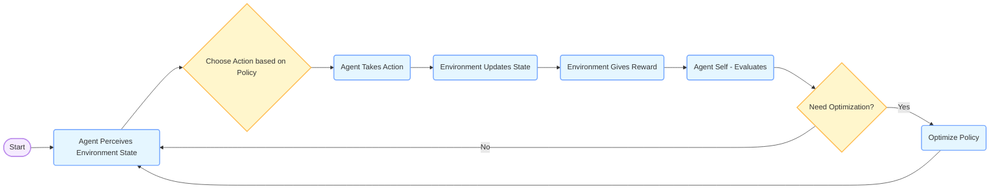

# 构建具有自我评估与优化能力的AI Agent系统

> 关键词：AI Agent、自我评估、优化能力、强化学习、智能系统

> 摘要：本文围绕构建具有自我评估与优化能力的AI Agent系统展开。深入探讨了AI Agent系统的核心概念、算法原理、数学模型等内容。通过详细的Python代码示例展示了如何实现这样的系统，并结合实际应用场景说明其价值。同时，推荐了相关的学习资源、开发工具和论文著作，最后对该领域的未来发展趋势与挑战进行了总结，还提供了常见问题解答和扩展阅读参考资料，旨在为读者全面呈现构建具有自我评估与优化能力的AI Agent系统的技术全貌。

## 1. 背景介绍 
### 1.1 目的和范围
在当今人工智能快速发展的时代，AI Agent系统被广泛应用于各个领域。构建具有自我评估与优化能力的AI Agent系统的目的在于使AI Agent能够在复杂多变的环境中自主地评估自身的表现，并根据评估结果进行优化，从而提高其性能和适应性。本文章的范围涵盖了从AI Agent系统的基本概念到具体实现，再到实际应用和未来发展趋势的全面内容，旨在为读者提供一个系统、深入的关于构建此类系统的知识体系。

### 1.2 预期读者
本文预期读者包括人工智能领域的研究人员、开发者、学生以及对AI Agent系统感兴趣的技术爱好者。对于希望深入了解AI Agent系统内部机制，掌握构建具有自我评估与优化能力的AI Agent系统技术的读者，本文将提供有价值的参考和指导。

### 1.3 文档结构概述
本文将按照以下结构进行阐述：首先介绍背景信息，包括目的、预期读者和文档结构概述等；接着讲解核心概念与联系，明确AI Agent系统中各关键概念的原理和相互关系；然后详细阐述核心算法原理及具体操作步骤，并用Python代码进行说明；随后介绍相关的数学模型和公式，并举例说明；再通过项目实战展示代码实际案例并进行详细解释；之后探讨实际应用场景；接着推荐相关的工具和资源；最后总结未来发展趋势与挑战，提供常见问题解答和扩展阅读参考资料。

### 1.4 术语表
#### 1.4.1 核心术语定义
- **AI Agent（人工智能智能体）**：是一个能够感知环境，根据感知到的信息进行决策并采取行动的实体。它可以是软件程序、机器人等。
- **自我评估**：指AI Agent对自身的行为、性能、状态等进行评价和分析的过程。
- **优化能力**：AI Agent根据自我评估的结果，对自身的策略、模型等进行调整和改进的能力。
- **强化学习**：一种机器学习范式，通过智能体与环境进行交互，根据环境给予的奖励信号来学习最优策略。

#### 1.4.2 相关概念解释
- **环境**：AI Agent所处的外部世界，它为AI Agent提供感知信息，并对AI Agent的行动做出响应。
- **策略**：AI Agent在不同的状态下选择行动的规则。
- **状态**：描述环境和AI Agent当前情况的一组变量。

#### 1.4.3 缩略词列表
- **RL**：Reinforcement Learning（强化学习）
- **Q - learning**：一种基于值函数的强化学习算法

## 2. 核心概念与联系 
### 核心概念原理
AI Agent系统的核心在于智能体与环境之间的交互。智能体通过传感器感知环境的状态，然后根据自身的策略选择一个行动并执行。环境会根据智能体的行动给出一个奖励信号，智能体根据这个奖励信号来评估自己的行为是否正确，并对策略进行调整。

自我评估是智能体对自身行为效果的一种反馈机制。它可以基于奖励信号，也可以通过其他评估指标，如任务完成时间、资源消耗等。通过自我评估，智能体可以了解自己的优势和不足，为优化提供依据。

优化能力则是智能体根据自我评估的结果，对自身的策略、模型等进行改进的能力。优化的目标是提高智能体在环境中的性能，使其能够更好地完成任务。

### 架构的文本示意图
AI Agent系统主要由智能体、环境和评估优化模块组成。智能体与环境进行交互，感知环境状态并采取行动。评估优化模块对智能体的行为进行评估，并根据评估结果对智能体的策略进行优化。

```plaintext
+-------------------+          +-------------------+          +-------------------+
|       Agent       | <------> |      Environment  |          |  Evaluation &     |
|                   |          |                   | <------> |  Optimization     |
|  - Perception     |          |  - State          |          |  Module           |
|  - Decision       |          |  - Reward         |          |  - Self - Evaluation|
|  - Action         |          |                   |          |  - Optimization   |
+-------------------+          +-------------------+          +-------------------+
```

### Mermaid 流程图


## 3. 核心算法原理 & 具体操作步骤 
### 强化学习算法原理
强化学习是构建具有自我评估与优化能力的AI Agent系统的常用算法。在强化学习中，智能体的目标是最大化长期累积奖励。其中，Q - learning是一种经典的基于值函数的强化学习算法。

Q - learning的核心思想是学习一个Q值函数 $Q(s, a)$，它表示在状态 $s$ 下采取行动 $a$ 的期望累积奖励。智能体通过不断地与环境交互，更新Q值函数，从而找到最优策略。

### 具体操作步骤
1. **初始化**：初始化Q值函数 $Q(s, a)$ 为一个随机值或零值。
2. **环境交互**：智能体感知当前环境状态 $s$，根据Q值函数选择一个行动 $a$，执行行动并得到环境的反馈，包括新的状态 $s'$ 和奖励 $r$。
3. **Q值更新**：根据以下公式更新Q值函数：
   $Q(s, a) \leftarrow Q(s, a) + \alpha [r + \gamma \max_{a'} Q(s', a') - Q(s, a)]$
   其中，$\alpha$ 是学习率，控制每次更新的步长；$\gamma$ 是折扣因子，用于平衡即时奖励和未来奖励。
4. **重复步骤2和3**：直到满足终止条件，如达到最大迭代次数或智能体的性能达到满意水平。

### Python源代码实现
```python
import numpy as np

# 定义环境参数
num_states = 10
num_actions = 4
alpha = 0.1  # 学习率
gamma = 0.9  # 折扣因子
epsilon = 0.1  # 探索率
max_episodes = 1000

# 初始化Q值函数
Q = np.zeros((num_states, num_actions))

# 定义环境交互函数
def get_reward(state, action):
    # 这里简单定义一个奖励函数，实际应用中需要根据具体环境确定
    if state == 5 and action == 2:
        return 10
    else:
        return -1

def get_next_state(state, action):
    # 这里简单定义一个状态转移函数，实际应用中需要根据具体环境确定
    next_state = state + action - 1
    if next_state < 0:
        next_state = 0
    if next_state >= num_states:
        next_state = num_states - 1
    return next_state

# Q - learning算法
for episode in range(max_episodes):
    state = np.random.randint(0, num_states)  # 随机初始化状态
    done = False
    while not done:
        if np.random.uniform(0, 1) < epsilon:
            action = np.random.randint(0, num_actions)  # 探索
        else:
            action = np.argmax(Q[state, :])  # 利用

        reward = get_reward(state, action)
        next_state = get_next_state(state, action)

        # Q值更新
        Q[state, action] = Q[state, action] + alpha * (reward + gamma * np.max(Q[next_state, :]) - Q[state, action])

        state = next_state

        if reward == 10:
            done = True

print("Final Q - values:")
print(Q)
```

## 4. 数学模型和公式 & 详细讲解 & 举例说明 
### 数学模型
在强化学习中，通常使用马尔可夫决策过程（MDP）来描述智能体与环境的交互。一个MDP可以用一个五元组 $\langle S, A, P, R, \gamma \rangle$ 表示，其中：
- $S$ 是状态空间，包含所有可能的环境状态。
- $A$ 是行动空间，包含智能体可以采取的所有行动。
- $P(s'|s, a)$ 是状态转移概率，表示在状态 $s$ 下采取行动 $a$ 后转移到状态 $s'$ 的概率。
- $R(s, a)$ 是奖励函数，表示在状态 $s$ 下采取行动 $a$ 所获得的即时奖励。
- $\gamma$ 是折扣因子，用于平衡即时奖励和未来奖励。

### 核心公式
#### Q - learning更新公式
$Q(s, a) \leftarrow Q(s, a) + \alpha [r + \gamma \max_{a'} Q(s', a') - Q(s, a)]$
详细讲解：
- $Q(s, a)$ 是当前状态 $s$ 下采取行动 $a$ 的Q值。
- $\alpha$ 是学习率，它控制了每次更新的步长。如果 $\alpha$ 过大，智能体可能会过快地更新Q值，导致不稳定；如果 $\alpha$ 过小，学习速度会很慢。
- $r$ 是智能体采取行动 $a$ 后从环境中获得的即时奖励。
- $\gamma$ 是折扣因子，它决定了未来奖励的重要性。$\gamma$ 越接近1，智能体越注重长期奖励；$\gamma$ 越接近0，智能体越注重即时奖励。
- $\max_{a'} Q(s', a')$ 是下一个状态 $s'$ 下所有可能行动的最大Q值。

#### 策略选择公式
在 $\epsilon$ - 贪心策略中，智能体以 $\epsilon$ 的概率进行探索（随机选择行动），以 $1 - \epsilon$ 的概率进行利用（选择Q值最大的行动）。

### 举例说明
假设一个简单的网格世界环境，智能体在一个 $3 \times 3$ 的网格中移动。智能体的目标是从左上角的起点移动到右下角的终点。智能体可以采取四个行动：上、下、左、右。当智能体到达终点时，获得奖励10，其他情况下获得奖励 -1。

初始时，Q值函数 $Q(s, a)$ 都为0。智能体在状态 $(0, 0)$ 下，根据 $\epsilon$ - 贪心策略选择一个行动，比如向右移动。智能体移动到状态 $(0, 1)$，获得奖励 -1。然后根据Q - learning更新公式更新 $Q((0, 0), \text{right})$ 的值。随着不断的交互和更新，Q值函数逐渐收敛，智能体学会了最优策略。

## 5. 项目实战：代码实际案例和详细解释说明 
### 5.1  开发环境搭建
#### 操作系统
可以选择常见的操作系统，如Windows、Linux（如Ubuntu）或macOS。

#### 编程语言和库
- **Python**：推荐使用Python 3.6及以上版本。
- **NumPy**：用于数值计算。可以使用以下命令安装：
```sh
pip install numpy
```
- **Matplotlib**：用于可视化结果（可选）。安装命令：
```sh
pip install matplotlib
```

### 5.2  源代码详细实现和代码解读
```python
import numpy as np
import matplotlib.pyplot as plt

# 定义环境参数
num_states = 10
num_actions = 4
alpha = 0.1  # 学习率
gamma = 0.9  # 折扣因子
epsilon = 0.1  # 探索率
max_episodes = 1000

# 初始化Q值函数
Q = np.zeros((num_states, num_actions))

# 定义环境交互函数
def get_reward(state, action):
    # 这里简单定义一个奖励函数，实际应用中需要根据具体环境确定
    if state == 5 and action == 2:
        return 10
    else:
        return -1

def get_next_state(state, action):
    # 这里简单定义一个状态转移函数，实际应用中需要根据具体环境确定
    next_state = state + action - 1
    if next_state < 0:
        next_state = 0
    if next_state >= num_states:
        next_state = num_states - 1
    return next_state

# 记录每个回合的总奖励
total_rewards = []

# Q - learning算法
for episode in range(max_episodes):
    state = np.random.randint(0, num_states)  # 随机初始化状态
    done = False
    total_reward = 0
    while not done:
        if np.random.uniform(0, 1) < epsilon:
            action = np.random.randint(0, num_actions)  # 探索
        else:
            action = np.argmax(Q[state, :])  # 利用

        reward = get_reward(state, action)
        next_state = get_next_state(state, action)

        # Q值更新
        Q[state, action] = Q[state, action] + alpha * (reward + gamma * np.max(Q[next_state, :]) - Q[state, action])

        state = next_state
        total_reward += reward

        if reward == 10:
            done = True

    total_rewards.append(total_reward)

# 绘制总奖励随回合数的变化曲线
plt.plot(total_rewards)
plt.xlabel('Episode')
plt.ylabel('Total Reward')
plt.title('Total Reward per Episode')
plt.show()

print("Final Q - values:")
print(Q)
```

### 5.3  代码解读与分析
1. **参数初始化**：定义了环境的状态数、行动数、学习率、折扣因子、探索率和最大回合数等参数，并初始化Q值函数为零。
2. **环境交互函数**：`get_reward` 函数根据状态和行动返回奖励，`get_next_state` 函数根据状态和行动返回下一个状态。
3. **Q - learning算法主循环**：在每个回合中，智能体从随机状态开始，根据 $\epsilon$ - 贪心策略选择行动，与环境交互，更新Q值函数，直到达到终止条件。
4. **总奖励记录**：记录每个回合的总奖励，用于后续的可视化分析。
5. **可视化**：使用Matplotlib绘制总奖励随回合数的变化曲线，帮助我们观察智能体的学习过程。
6. **最终Q值输出**：输出最终的Q值函数，展示智能体学习到的策略。

## 6. 实际应用场景 
### 游戏领域
在电子游戏中，具有自我评估与优化能力的AI Agent可以作为游戏中的对手或队友。例如，在策略游戏中，AI Agent可以根据游戏的当前状态评估自己的策略是否有效，并根据评估结果进行优化，从而提高游戏水平，给玩家带来更具挑战性的游戏体验。

### 机器人领域
机器人在执行任务时，如导航、抓取物体等，需要不断地感知环境并做出决策。具有自我评估与优化能力的AI Agent可以使机器人在执行任务的过程中，根据任务的完成情况和环境的变化评估自己的行为，优化运动策略，提高任务执行的效率和准确性。

### 金融领域
在金融投资中，AI Agent可以根据市场数据和投资组合的表现评估自己的投资策略，通过优化策略来提高投资回报率，降低风险。例如，智能投资顾问可以根据市场趋势和用户的风险偏好，不断调整投资组合，实现资产的优化配置。

### 医疗领域
在医疗诊断和治疗中，AI Agent可以根据患者的症状、病史和检查结果评估诊断和治疗方案的准确性和有效性，并根据评估结果进行优化。例如，辅助医生进行疾病诊断和制定个性化的治疗方案，提高医疗质量。

## 7. 工具和资源推荐
### 7.1 学习资源推荐
#### 7.1.1 书籍推荐
- 《Reinforcement Learning: An Introduction》（《强化学习：原理与Python实现》）：这是强化学习领域的经典书籍，全面介绍了强化学习的基本概念、算法和应用。
- 《Artificial Intelligence: A Modern Approach》（《人工智能：一种现代的方法》）：涵盖了人工智能的各个领域，包括AI Agent系统，是学习人工智能的权威教材。

#### 7.1.2 在线课程
- Coursera上的“Reinforcement Learning Specialization”：由知名教授授课，系统地介绍了强化学习的理论和实践。
- edX上的“Artificial Intelligence”：提供了人工智能相关的课程，包括AI Agent系统的内容。

#### 7.1.3 技术博客和网站
- OpenAI Blog：OpenAI发布的关于人工智能最新研究成果和技术进展的博客。
- Towards Data Science：一个专注于数据科学和人工智能的技术博客平台，有很多关于AI Agent系统的优秀文章。

### 7.2 开发工具框架推荐
#### 7.2.1 IDE和编辑器
- PyCharm：功能强大的Python集成开发环境，提供了代码编辑、调试、版本控制等功能。
- Visual Studio Code：轻量级的代码编辑器，支持多种编程语言和插件，方便快捷地进行代码开发。

#### 7.2.2 调试和性能分析工具
- PDB：Python自带的调试器，可以帮助开发者调试代码，查找问题。
- cProfile：Python的性能分析工具，可以分析代码的运行时间和函数调用情况，帮助优化代码性能。

#### 7.2.3 相关框架和库
- OpenAI Gym：一个用于开发和比较强化学习算法的工具包，提供了多种环境和接口，方便开发者进行实验。
- Stable Baselines：基于OpenAI Gym的强化学习算法库，实现了多种经典的强化学习算法，易于使用和扩展。

### 7.3 相关论文著作推荐
#### 7.3.1 经典论文
- “Q - learning” by Watkins and Dayan：介绍了Q - learning算法的经典论文，奠定了基于值函数的强化学习算法的基础。
- “Policy Gradient Methods for Reinforcement Learning with Function Approximation” by Sutton et al.：提出了策略梯度算法，为基于策略搜索的强化学习算法发展做出了重要贡献。

#### 7.3.2 最新研究成果
- 关注顶级人工智能会议，如NeurIPS（神经信息处理系统大会）、ICML（国际机器学习会议）等，这些会议上的论文反映了该领域的最新研究成果。

#### 7.3.3 应用案例分析
- 一些实际应用案例的论文，如AI Agent在自动驾驶、游戏等领域的应用，通过分析这些案例可以了解如何将理论应用到实际中。

## 8. 总结：未来发展趋势与挑战
### 未来发展趋势
- **多智能体协作**：未来的AI Agent系统将更加注重多智能体之间的协作。多个AI Agent可以通过合作完成复杂的任务，如分布式传感器网络中的数据处理、多机器人协作完成大型工程任务等。
- **与深度学习的融合**：深度学习的强大特征提取能力与强化学习的决策能力相结合，将使AI Agent系统能够处理更加复杂的环境和任务。例如，基于深度强化学习的图像识别与决策系统。
- **可解释性和安全性**：随着AI Agent系统在关键领域的应用越来越广泛，对其可解释性和安全性的要求也越来越高。未来的研究将致力于开发可解释的AI Agent系统，确保其决策过程和行为是可理解和可信任的。

### 挑战
- **计算资源需求**：具有自我评估与优化能力的AI Agent系统通常需要大量的计算资源来进行训练和运行。如何在有限的计算资源下提高系统的效率是一个挑战。
- **环境适应性**：现实世界的环境是复杂多变的，AI Agent系统需要具备更强的环境适应性。如何使AI Agent在未知或动态变化的环境中快速学习和调整策略是一个难题。
- **伦理和法律问题**：AI Agent系统的决策和行为可能会对人类社会产生影响，因此需要解决相关的伦理和法律问题，如责任界定、隐私保护等。

## 9. 附录：常见问题与解答
### 问题1：Q - learning算法一定能收敛到最优策略吗？
解答：在一定条件下，Q - learning算法可以收敛到最优策略。这些条件包括：所有的状态 - 行动对都被无限次访问，学习率 $\alpha$ 满足一定的衰减条件等。但在实际应用中，由于环境的复杂性和计算资源的限制，可能无法完全满足这些条件，因此不能保证一定能收敛到最优策略。

### 问题2：如何选择合适的学习率和折扣因子？
解答：学习率 $\alpha$ 和折扣因子 $\gamma$ 的选择通常需要通过实验来确定。一般来说，学习率 $\alpha$ 可以初始设置为一个较小的值，如0.1或0.01，然后根据学习过程的稳定性和收敛速度进行调整。折扣因子 $\gamma$ 通常设置在0.9到0.99之间，越接近1表示智能体越注重长期奖励。

### 问题3：强化学习与监督学习有什么区别？
解答：强化学习和监督学习是两种不同的机器学习范式。监督学习是基于标注好的数据集进行学习，目标是学习输入和输出之间的映射关系。而强化学习是通过智能体与环境的交互，根据环境给予的奖励信号来学习最优策略，没有明确的标注数据。

## 10. 扩展阅读 & 参考资料
### 扩展阅读
- 阅读关于深度强化学习、多智能体系统等相关的文献，深入了解AI Agent系统的前沿技术。
- 关注行业动态和最新研究成果，参加相关的技术研讨会和学术会议。

### 参考资料
- Sutton, R. S., & Barto, A. G. (2018). Reinforcement Learning: An Introduction. MIT Press.
- Russell, S. J., & Norvig, P. (2016). Artificial Intelligence: A Modern Approach. Pearson.
- Watkins, C. J. C. H., & Dayan, P. (1992). Q - learning. Machine learning, 8(3 - 4), 279 - 292.
- Sutton, R. S., McAllester, D. A., Singh, S. P., & Mansour, Y. (2000). Policy gradient methods for reinforcement learning with function approximation. Advances in neural information processing systems.