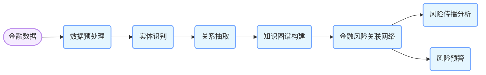

# 构建基于知识图谱的金融风险关联网络

> 关键词：知识图谱、金融风险关联网络、图数据库、实体识别、关系抽取

> 摘要：本文围绕构建基于知识图谱的金融风险关联网络展开，详细阐述了相关核心概念、算法原理、数学模型等内容。首先介绍了构建该网络的背景，包括目的、预期读者、文档结构和术语表。接着深入讲解核心概念及联系，给出了原理和架构的文本示意图与 Mermaid 流程图。在算法原理部分，使用 Python 代码详细阐述了实体识别和关系抽取等步骤。通过数学模型和公式进一步剖析构建过程，并举例说明。项目实战部分展示了开发环境搭建、源代码实现及解读。同时探讨了实际应用场景，推荐了学习资源、开发工具框架和相关论文著作。最后总结了未来发展趋势与挑战，提供了常见问题解答和扩展阅读参考资料，旨在为金融领域的风险分析和管理提供有效的技术支持。

## 1. 背景介绍 
### 1.1 目的和范围
在金融领域，风险的识别和管理至关重要。传统的风险分析方法往往只能处理单一维度的数据，难以全面捕捉金融市场中复杂的风险关联关系。构建基于知识图谱的金融风险关联网络的目的在于整合多源异构的金融数据，通过知识图谱的方式清晰地展示金融实体之间的复杂关系，从而更准确地识别潜在的金融风险，为金融机构的风险管理决策提供有力支持。

本项目的范围涵盖了从金融数据的收集、预处理，到知识图谱的构建，再到金融风险关联网络的搭建和分析。具体包括对金融机构、企业、个人等实体的识别，对实体之间股权关系、交易关系、担保关系等的抽取，以及利用图数据库存储和管理知识图谱，最终实现对金融风险的关联分析和预警。

### 1.2 预期读者
本文的预期读者主要包括金融行业的从业者，如风险管理专家、分析师、投资经理等，他们可以借助知识图谱的技术手段提升金融风险分析的能力和效率。同时，计算机科学领域的研究人员和开发者也可以从本文中获取关于知识图谱在金融领域应用的实践经验，为进一步的研究和开发提供参考。此外，对金融科技感兴趣的学生和爱好者也可以通过阅读本文了解相关领域的前沿技术和应用。

### 1.3 文档结构概述
本文将按照以下结构进行详细阐述：首先介绍构建基于知识图谱的金融风险关联网络的背景信息，包括目的、预期读者和文档结构概述等。接着深入讲解核心概念与联系，通过文本示意图和 Mermaid 流程图展示知识图谱和金融风险关联网络的原理和架构。然后详细介绍核心算法原理和具体操作步骤，使用 Python 代码进行示例说明。在数学模型和公式部分，给出相关的数学表达式并进行详细讲解和举例。项目实战部分将展示开发环境的搭建、源代码的实现和解读。之后探讨实际应用场景，推荐相关的学习资源、开发工具框架和论文著作。最后总结未来发展趋势与挑战，提供常见问题解答和扩展阅读参考资料。

### 1.4 术语表
#### 1.4.1 核心术语定义
- **知识图谱**：知识图谱是一种基于图的数据结构，由节点（实体）和边（关系）组成，用于表示现实世界中各种实体之间的语义关系。在金融领域，知识图谱可以将金融机构、企业、个人等实体以及它们之间的股权关系、交易关系等关联起来，形成一个复杂的网络。
- **金融风险关联网络**：金融风险关联网络是基于知识图谱构建的，用于描述金融实体之间风险传播和关联关系的网络。通过分析这个网络，可以发现潜在的金融风险，如系统性风险、信用风险等。
- **实体识别**：实体识别是指从文本数据中识别出具有特定意义的实体，如金融机构、企业、个人等。在构建知识图谱的过程中，实体识别是第一步，为后续的关系抽取和知识图谱构建提供基础。
- **关系抽取**：关系抽取是指从文本数据中识别出实体之间的关系，如股权关系、交易关系、担保关系等。关系抽取是构建知识图谱的关键步骤，它将实体之间的语义关系明确地表示出来。
- **图数据库**：图数据库是一种专门用于存储和管理图数据的数据库，它可以高效地处理图数据的查询和分析。在构建金融风险关联网络时，图数据库可以用于存储知识图谱，并支持对金融风险的关联分析和查询。

#### 1.4.2 相关概念解释
- **多源异构数据**：多源异构数据是指来自不同数据源、具有不同格式和结构的数据。在金融领域，多源异构数据包括金融报表、新闻报道、社交媒体数据等。构建知识图谱需要整合这些多源异构数据，以全面反映金融实体之间的关系。
- **语义理解**：语义理解是指计算机对文本数据的语义信息进行理解和处理的能力。在知识图谱构建过程中，语义理解可以帮助识别实体和关系，提高知识图谱的准确性和完整性。
- **风险传播**：风险传播是指金融风险在金融实体之间的传递和扩散过程。金融风险关联网络可以用于分析风险传播的路径和机制，为金融风险管理提供决策支持。

#### 1.4.3 缩略词列表
- **NLP**：Natural Language Processing，自然语言处理
- **RDF**：Resource Description Framework，资源描述框架
- **Neo4j**：一种流行的图数据库
- **API**：Application Programming Interface，应用程序编程接口

## 2. 核心概念与联系 

### 核心概念原理
知识图谱是一种语义网络，它以图的形式表示知识，将实体作为节点，实体之间的关系作为边。在金融领域，实体可以是金融机构（如银行、证券公司）、企业、个人等，关系可以是股权关系、借贷关系、担保关系等。通过构建知识图谱，可以将分散的金融数据整合起来，形成一个有机的整体，从而更全面地了解金融市场的结构和运行机制。

金融风险关联网络是基于知识图谱构建的，它通过分析知识图谱中实体之间的关系，识别潜在的金融风险。例如，如果一家企业与多家高风险企业存在股权关系或借贷关系，那么该企业也可能面临较高的风险。金融风险关联网络可以帮助金融机构及时发现风险，采取相应的措施进行风险防范和控制。

### 架构的文本示意图
```plaintext
金融数据（多源异构）
|
|-- 数据预处理
|   |-- 清洗
|   |-- 归一化
|   |-- 特征提取
|
|-- 实体识别
|   |-- 金融机构
|   |-- 企业
|   |-- 个人
|
|-- 关系抽取
|   |-- 股权关系
|   |-- 借贷关系
|   |-- 担保关系
|
|-- 知识图谱构建
|   |-- 节点（实体）
|   |-- 边（关系）
|
|-- 金融风险关联网络
|   |-- 风险传播分析
|   |-- 风险预警
```

### Mermaid 流程图


## 3. 核心算法原理 & 具体操作步骤 

### 实体识别算法原理
实体识别是自然语言处理中的一个重要任务，常用的算法有基于规则的方法、基于机器学习的方法和基于深度学习的方法。这里我们介绍基于深度学习的 BERT（Bidirectional Encoder Representations from Transformers）模型进行实体识别。

BERT 是一种预训练的语言模型，它可以学习到文本的上下文信息。在实体识别任务中，我们可以在 BERT 模型的基础上添加一个分类层，将每个词分类为不同的实体类型。

以下是使用 Python 和 Transformers 库实现基于 BERT 的实体识别的示例代码：
```python
from transformers import AutoTokenizer, AutoModelForTokenClassification
import torch

# 加载预训练的 BERT 实体识别模型和分词器
tokenizer = AutoTokenizer.from_pretrained("dbmdz/bert-large-cased-finetuned-conll03-english")
model = AutoModelForTokenClassification.from_pretrained("dbmdz/bert-large-cased-finetuned-conll03-english")

# 待识别的文本
text = "Apple is a technology company based in California."

# 对文本进行分词
inputs = tokenizer(text, return_tensors="pt")

# 进行预测
with torch.no_grad():
    outputs = model(**inputs)

# 获取预测结果
logits = outputs.logits
predictions = torch.argmax(logits, dim=2)

# 解码预测结果
predicted_labels = [model.config.id2label[p.item()] for p in predictions[0]]

# 输出结果
for token, label in zip(tokenizer.tokenize(text), predicted_labels):
    print(f"{token}: {label}")
```

### 关系抽取算法原理
关系抽取是指从文本中识别出实体之间的关系。常用的关系抽取算法有基于特征的方法、基于深度学习的方法等。这里我们介绍基于 BiLSTM（Bidirectional Long Short-Term Memory）和注意力机制的关系抽取模型。

BiLSTM 可以处理序列数据，能够捕捉文本的上下文信息。注意力机制可以帮助模型聚焦于文本中与关系抽取相关的部分。

以下是使用 Python 和 PyTorch 实现基于 BiLSTM 和注意力机制的关系抽取的示例代码：
```python
import torch
import torch.nn as nn
import torch.optim as optim

# 定义 BiLSTM 和注意力机制的关系抽取模型
class BiLSTMWithAttention(nn.Module):
    def __init__(self, input_size, hidden_size, num_classes):
        super(BiLSTMWithAttention, self).__init__()
        self.lstm = nn.LSTM(input_size, hidden_size, bidirectional=True)
        self.fc = nn.Linear(hidden_size * 2, num_classes)
        self.attention = nn.Linear(hidden_size * 2, 1)

    def forward(self, x):
        lstm_output, _ = self.lstm(x)
        attention_weights = torch.softmax(self.attention(lstm_output), dim=1)
        weighted_output = attention_weights * lstm_output
        pooled_output = torch.sum(weighted_output, dim=1)
        output = self.fc(pooled_output)
        return output

# 示例数据
input_size = 100
hidden_size = 64
num_classes = 5
batch_size = 32
seq_length = 20

# 初始化模型
model = BiLSTMWithAttention(input_size, hidden_size, num_classes)

# 定义损失函数和优化器
criterion = nn.CrossEntropyLoss()
optimizer = optim.Adam(model.parameters(), lr=0.001)

# 生成随机输入数据和标签
inputs = torch.randn(batch_size, seq_length, input_size)
labels = torch.randint(0, num_classes, (batch_size,))

# 训练模型
for epoch in range(10):
    optimizer.zero_grad()
    outputs = model(inputs)
    loss = criterion(outputs, labels)
    loss.backward()
    optimizer.step()
    print(f'Epoch {epoch+1}, Loss: {loss.item()}')
```

### 具体操作步骤
1. **数据收集**：收集多源异构的金融数据，包括金融报表、新闻报道、社交媒体数据等。
2. **数据预处理**：对收集到的数据进行清洗、归一化和特征提取等操作，以提高数据的质量和可用性。
3. **实体识别**：使用 BERT 等模型对预处理后的数据进行实体识别，识别出金融机构、企业、个人等实体。
4. **关系抽取**：使用 BiLSTM 和注意力机制等模型对识别出的实体进行关系抽取，抽取实体之间的股权关系、借贷关系、担保关系等。
5. **知识图谱构建**：将识别出的实体和抽取的关系存储到图数据库中，构建知识图谱。
6. **金融风险关联网络构建**：基于知识图谱，分析实体之间的关系，构建金融风险关联网络。
7. **风险分析和预警**：使用金融风险关联网络进行风险传播分析和风险预警，及时发现潜在的金融风险。

## 4. 数学模型和公式 & 详细讲解 & 举例说明 

### 知识图谱表示
知识图谱可以用三元组 $(h, r, t)$ 表示，其中 $h$ 表示头实体，$r$ 表示关系，$t$ 表示尾实体。例如，$(Apple, is_based_in, California)$ 表示苹果公司位于加利福尼亚州。

### 实体嵌入
为了在数学上处理实体和关系，我们可以将实体和关系嵌入到低维向量空间中。设实体 $e$ 的嵌入向量为 $\mathbf{e} \in \mathbb{R}^d$，关系 $r$ 的嵌入向量为 $\mathbf{r} \in \mathbb{R}^d$，其中 $d$ 是嵌入的维度。

### TransE 模型
TransE 是一种常用的知识图谱嵌入模型，其核心思想是将关系看作是实体之间的翻译。对于一个三元组 $(h, r, t)$，TransE 模型的目标是使得 $\mathbf{h} + \mathbf{r} \approx \mathbf{t}$。具体来说，TransE 模型的损失函数定义为：
$$
L = \sum_{(h, r, t) \in S} \sum_{(h', r, t') \in S'} [\gamma + d(\mathbf{h} + \mathbf{r}, \mathbf{t}) - d(\mathbf{h}' + \mathbf{r}, \mathbf{t}')]_+
$$
其中，$S$ 是正样本集合，$S'$ 是负样本集合，$\gamma$ 是边界值，$d(\cdot, \cdot)$ 是距离函数，通常使用 $L_1$ 或 $L_2$ 范数，$[x]_+ = \max(0, x)$。

### 举例说明
假设我们有一个简单的知识图谱，包含以下三元组：
- $(Apple, is_based_in, California)$
- $(Google, is_based_in, California)$
- $(Microsoft, is_based_in, Washington)$

我们可以使用 TransE 模型将这些实体和关系嵌入到二维向量空间中。假设实体和关系的嵌入向量如下：
- $\mathbf{Apple} = [0.2, 0.3]$
- $\mathbf{Google} = [0.4, 0.5]$
- $\mathbf{Microsoft} = [0.6, 0.7]$
- $\mathbf{is\_based\_in} = [0.1, 0.1]$
- $\mathbf{California} = [0.3, 0.4]$
- $\mathbf{Washington} = [0.7, 0.8]$

对于三元组 $(Apple, is_based_in, California)$，我们可以计算 $\mathbf{Apple} + \mathbf{is\_based\_in} = [0.2 + 0.1, 0.3 + 0.1] = [0.3, 0.4]$，与 $\mathbf{California}$ 相等，说明这个三元组在嵌入空间中得到了较好的表示。

## 5. 项目实战：代码实际案例和详细解释说明 

### 5.1  开发环境搭建
#### 安装 Python
首先，确保你已经安装了 Python 3.6 或以上版本。你可以从 Python 官方网站（https://www.python.org/downloads/） 下载并安装 Python。

#### 安装必要的库
使用以下命令安装项目所需的库：
```bash
pip install transformers torch neo4j
```
- `transformers`：用于加载预训练的语言模型，如 BERT。
- `torch`：用于深度学习模型的开发和训练。
- `neo4j`：用于与 Neo4j 图数据库进行交互。

#### 安装 Neo4j 图数据库
1. 从 Neo4j 官方网站（https://neo4j.com/download/） 下载并安装 Neo4j。
2. 启动 Neo4j 服务器，访问 `http://localhost:7474`，使用默认的用户名和密码（`neo4j/neo4j`）登录。
3. 修改默认密码，创建一个新的数据库。

### 5.2  源代码详细实现和代码解读
#### 数据预处理
```python
import pandas as pd

# 读取金融数据
data = pd.read_csv('financial_data.csv')

# 数据清洗
data = data.dropna()

# 数据归一化
# 假设数据中有一个数值列 'amount'
data['amount'] = (data['amount'] - data['amount'].min()) / (data['amount'].max() - data['amount'].min())

# 保存预处理后的数据
data.to_csv('preprocessed_data.csv', index=False)
```
代码解读：首先使用 `pandas` 库读取金融数据，然后进行数据清洗，去除包含缺失值的行。接着对数值列进行归一化处理，将其缩放到 [0, 1] 区间。最后将预处理后的数据保存到新的 CSV 文件中。

#### 实体识别
```python
from transformers import AutoTokenizer, AutoModelForTokenClassification
import torch

# 加载预训练的 BERT 实体识别模型和分词器
tokenizer = AutoTokenizer.from_pretrained("dbmdz/bert-large-cased-finetuned-conll03-english")
model = AutoModelForTokenClassification.from_pretrained("dbmdz/bert-large-cased-finetuned-conll03-english")

# 读取预处理后的数据
data = pd.read_csv('preprocessed_data.csv')

# 实体识别函数
def entity_recognition(text):
    inputs = tokenizer(text, return_tensors="pt")
    with torch.no_grad():
        outputs = model(**inputs)
    logits = outputs.logits
    predictions = torch.argmax(logits, dim=2)
    predicted_labels = [model.config.id2label[p.item()] for p in predictions[0]]
    entities = []
    current_entity = []
    current_label = None
    for token, label in zip(tokenizer.tokenize(text), predicted_labels):
        if label.startswith('B-'):
            if current_entity:
                entities.append((' '.join(current_entity), current_label))
            current_entity = [token]
            current_label = label[2:]
        elif label.startswith('I-'):
            if current_label == label[2:]:
                current_entity.append(token)
            else:
                if current_entity:
                    entities.append((' '.join(current_entity), current_label))
                current_entity = [token]
                current_label = label[2:]
        else:
            if current_entity:
                entities.append((' '.join(current_entity), current_label))
            current_entity = []
            current_label = None
    if current_entity:
        entities.append((' '.join(current_entity), current_label))
    return entities

# 对每一行数据进行实体识别
data['entities'] = data['text'].apply(entity_recognition)

# 保存识别结果
data.to_csv('entity_recognition_result.csv', index=False)
```
代码解读：首先加载预训练的 BERT 实体识别模型和分词器。然后定义实体识别函数，该函数接受一个文本字符串作为输入，返回识别出的实体列表。接着对预处理后的数据中的每一行文本进行实体识别，并将识别结果保存到新的列中。最后将包含实体识别结果的数据保存到新的 CSV 文件中。

#### 关系抽取
```python
import torch
import torch.nn as nn
import torch.optim as optim
from sklearn.model_selection import train_test_split

# 定义 BiLSTM 和注意力机制的关系抽取模型
class BiLSTMWithAttention(nn.Module):
    def __init__(self, input_size, hidden_size, num_classes):
        super(BiLSTMWithAttention, self).__init__()
        self.lstm = nn.LSTM(input_size, hidden_size, bidirectional=True)
        self.fc = nn.Linear(hidden_size * 2, num_classes)
        self.attention = nn.Linear(hidden_size * 2, 1)

    def forward(self, x):
        lstm_output, _ = self.lstm(x)
        attention_weights = torch.softmax(self.attention(lstm_output), dim=1)
        weighted_output = attention_weights * lstm_output
        pooled_output = torch.sum(weighted_output, dim=1)
        output = self.fc(pooled_output)
        return output

# 加载实体识别结果数据
data = pd.read_csv('entity_recognition_result.csv')

# 准备数据
# 假设我们有一个特征矩阵 X 和标签向量 y
X = ...
y = ...

# 划分训练集和测试集
X_train, X_test, y_train, y_test = train_test_split(X, y, test_size=0.2, random_state=42)

# 转换为 PyTorch 张量
X_train = torch.tensor(X_train, dtype=torch.float32)
y_train = torch.tensor(y_train, dtype=torch.long)
X_test = torch.tensor(X_test, dtype=torch.float32)
y_test = torch.tensor(y_test, dtype=torch.long)

# 初始化模型
input_size = X_train.shape[2]
hidden_size = 64
num_classes = len(set(y_train.numpy()))
model = BiLSTMWithAttention(input_size, hidden_size, num_classes)

# 定义损失函数和优化器
criterion = nn.CrossEntropyLoss()
optimizer = optim.Adam(model.parameters(), lr=0.001)

# 训练模型
num_epochs = 10
for epoch in range(num_epochs):
    optimizer.zero_grad()
    outputs = model(X_train)
    loss = criterion(outputs, y_train)
    loss.backward()
    optimizer.step()
    print(f'Epoch {epoch+1}, Loss: {loss.item()}')

# 测试模型
with torch.no_grad():
    outputs = model(X_test)
    _, predicted = torch.max(outputs, 1)
    accuracy = (predicted == y_test).sum().item() / len(y_test)
    print(f'Test Accuracy: {accuracy}')
```
代码解读：首先定义 BiLSTM 和注意力机制的关系抽取模型。然后加载实体识别结果数据，准备特征矩阵和标签向量，并将数据划分为训练集和测试集。接着将数据转换为 PyTorch 张量，初始化模型、损失函数和优化器。在训练过程中，通过反向传播更新模型参数。最后在测试集上评估模型的准确率。

#### 知识图谱构建
```python
from neo4j import GraphDatabase

# 连接到 Neo4j 数据库
uri = "bolt://localhost:7687"
driver = GraphDatabase.driver(uri, auth=("neo4j", "your_password"))

# 读取关系抽取结果数据
data = pd.read_csv('relation_extraction_result.csv')

# 构建知识图谱函数
def create_knowledge_graph(tx, h, r, t):
    tx.run("MERGE (h:Entity {name: $h}) "
           "MERGE (t:Entity {name: $t}) "
           "MERGE (h)-[r:RELATION {type: $r}]->(t)",
           h=h, r=r, t=t)

# 遍历每一行数据，构建知识图谱
with driver.session() as session:
    for index, row in data.iterrows():
        h = row['head_entity']
        r = row['relation']
        t = row['tail_entity']
        session.write_transaction(create_knowledge_graph, h, r, t)

# 关闭数据库连接
driver.close()
```
代码解读：首先连接到 Neo4j 图数据库。然后读取关系抽取结果数据，定义构建知识图谱的函数，该函数使用 Cypher 语句在 Neo4j 中创建节点和关系。最后遍历数据中的每一行，调用构建知识图谱的函数，将实体和关系存储到图数据库中。

### 5.3  代码解读与分析
#### 数据预处理
数据预处理是构建知识图谱的重要步骤，它可以提高数据的质量和可用性。在本项目中，我们使用 `pandas` 库进行数据清洗和归一化处理，去除缺失值并将数值列缩放到 [0, 1] 区间。

#### 实体识别
实体识别使用预训练的 BERT 模型，通过对文本进行分词和预测，识别出文本中的实体。我们使用 `transformers` 库加载预训练模型，并将识别结果保存到新的列中。

#### 关系抽取
关系抽取使用 BiLSTM 和注意力机制的模型，通过训练模型来预测实体之间的关系。我们使用 `torch` 库构建和训练模型，并在测试集上评估模型的准确率。

#### 知识图谱构建
知识图谱构建使用 Neo4j 图数据库，通过 Cypher 语句创建节点和关系。我们使用 `neo4j` 库连接到数据库，并将关系抽取结果存储到图数据库中。

## 6. 实际应用场景 
### 金融风险预警
基于知识图谱的金融风险关联网络可以实时监测金融市场中的风险因素，通过分析实体之间的关系，及时发现潜在的风险。例如，如果一家企业与多家高风险企业存在股权关系或借贷关系，系统可以发出预警，提醒金融机构采取相应的措施。

### 信用评估
知识图谱可以整合企业和个人的多源数据，包括财务数据、信用记录、社交网络数据等，从而更全面地评估其信用状况。通过分析知识图谱中实体之间的关系，可以发现隐藏的信用风险，提高信用评估的准确性。

### 投资决策支持
在投资决策过程中，知识图谱可以提供全面的信息支持。投资者可以通过分析知识图谱中企业之间的关系，了解企业的产业链地位、竞争关系等，从而做出更明智的投资决策。

### 监管合规
金融监管机构可以利用知识图谱的金融风险关联网络，对金融市场进行全面的监管。通过分析知识图谱中实体之间的关系，可以发现潜在的违规行为和系统性风险，提高监管的效率和准确性。

## 7. 工具和资源推荐
### 7.1 学习资源推荐
#### 7.1.1 书籍推荐
- 《知识图谱：方法、实践与应用》：本书全面介绍了知识图谱的基本概念、技术方法和应用案例，适合初学者和专业人士阅读。
- 《深度学习》：由 Ian Goodfellow、Yoshua Bengio 和 Aaron Courville 所著，是深度学习领域的经典教材，对于理解深度学习模型在知识图谱构建中的应用有很大帮助。
- 《自然语言处理入门》：作者何晗，本书系统地介绍了自然语言处理的基本概念、算法和技术，对于学习实体识别和关系抽取等任务有很大的帮助。

#### 7.1.2 在线课程
- Coursera 上的 “Natural Language Processing Specialization”：由 DeepLearning.AI 提供，包含了自然语言处理的多个主题，如词嵌入、序列模型、问答系统等。
- edX 上的 “Knowledge Graphs”：由 IBM 提供，介绍了知识图谱的基本概念、构建方法和应用场景。
- 哔哩哔哩上的 “知识图谱入门教程”：由一些知名博主分享，适合初学者快速了解知识图谱的相关知识。

#### 7.1.3 技术博客和网站
- 知识图谱社区（https://www.knowledgegraph.tech/）：提供了知识图谱领域的最新技术文章、研究成果和应用案例。
- 开源中国（https://www.oschina.net/）：有很多关于知识图谱和人工智能的技术博客和开源项目。
- 机器之心（https://www.alfintech.com/）：专注于人工智能和金融科技领域的报道和分析，有很多关于知识图谱在金融领域应用的文章。

### 7.2 开发工具框架推荐
#### 7.2.1 IDE和编辑器
- PyCharm：是一款专门为 Python 开发设计的集成开发环境，具有代码编辑、调试、版本控制等功能，非常适合开发基于 Python 的知识图谱项目。
- Visual Studio Code：是一款轻量级的代码编辑器，支持多种编程语言和插件，可通过安装相关插件来实现代码调试、版本控制等功能。

#### 7.2.2 调试和性能分析工具
- TensorBoard：是 TensorFlow 提供的可视化工具，可以用于可视化模型的训练过程、损失函数变化、梯度分布等，帮助开发者调试和优化模型。
- PyTorch Profiler：是 PyTorch 提供的性能分析工具，可以用于分析模型的运行时间、内存使用情况等，帮助开发者发现性能瓶颈。

#### 7.2.3 相关框架和库
- Transformers：是 Hugging Face 开发的用于自然语言处理的库，提供了大量预训练的语言模型，如 BERT、GPT 等，方便开发者进行实体识别、关系抽取等任务。
- PyTorch：是一个开源的深度学习框架，具有动态图计算、自动求导等功能，适合开发和训练深度学习模型。
- Neo4j Python Driver：是 Neo4j 图数据库的 Python 驱动程序，用于与 Neo4j 数据库进行交互，方便开发者构建和管理知识图谱。

### 7.3 相关论文著作推荐
#### 7.3.1 经典论文
- “BERT: Pre-training of Deep Bidirectional Transformers for Language Understanding”：介绍了 BERT 模型的预训练方法和在自然语言处理任务中的应用，是自然语言处理领域的经典论文。
- “Translating Embeddings for Modeling Multi-relational Data”：提出了 TransE 模型，是知识图谱嵌入领域的经典论文。
- “Attention Is All You Need”：介绍了 Transformer 架构，为自然语言处理和深度学习领域带来了革命性的变化。

#### 7.3.2 最新研究成果
- 可以关注 ACL（Association for Computational Linguistics）、KDD（Knowledge Discovery and Data Mining）、SIGIR（Special Interest Group on Information Retrieval）等学术会议的最新论文，了解知识图谱和自然语言处理领域的最新研究成果。
- 一些知名学术期刊，如 Journal of Artificial Intelligence Research、Artificial Intelligence 等，也会发表知识图谱相关的高质量研究论文。

#### 7.3.3 应用案例分析
- 可以参考一些金融科技公司的研究报告和案例分析，了解知识图谱在金融领域的实际应用情况。例如，蚂蚁金服、腾讯金融科技等公司都有相关的研究和实践。

## 8. 总结：未来发展趋势与挑战
### 未来发展趋势
#### 多模态知识图谱
未来的知识图谱将不仅仅局限于文本数据，还将融合图像、音频、视频等多模态数据，从而更全面地表示现实世界的知识。例如，在金融领域，可以结合企业的财务报表、新闻报道和企业形象视频等多模态数据构建知识图谱，提高风险分析的准确性。

#### 知识图谱与深度学习的深度融合
知识图谱可以为深度学习模型提供先验知识，帮助模型更好地理解和处理数据。同时，深度学习模型可以用于知识图谱的构建和推理，提高知识图谱的质量和性能。未来，知识图谱与深度学习的深度融合将成为研究的热点。

#### 知识图谱在金融科技中的广泛应用
随着金融科技的发展，知识图谱将在金融领域得到更广泛的应用。例如，在智能投顾、风险评估、监管合规等方面，知识图谱可以提供更准确、更全面的信息支持，帮助金融机构提高决策效率和风险管理能力。

### 挑战
#### 数据质量和隐私保护
构建知识图谱需要大量的多源异构数据，数据的质量直接影响知识图谱的准确性和可靠性。同时，金融数据涉及到用户的隐私和商业机密，如何在保证数据质量的前提下，保护数据的隐私和安全是一个重要的挑战。

#### 知识图谱的可扩展性和高效性
随着知识图谱的规模不断增大，如何保证知识图谱的可扩展性和高效性是一个挑战。例如，在处理大规模的金融数据时，如何快速地进行实体识别、关系抽取和知识图谱构建，是需要解决的问题。

#### 知识图谱的语义理解和推理能力
目前的知识图谱在语义理解和推理能力方面还存在一定的不足。例如，在金融风险分析中，如何理解复杂的金融业务规则和风险传导机制，如何进行有效的推理和预测，是需要进一步研究的问题。

## 9. 附录：常见问题与解答
### 问题 1：如何选择合适的实体识别模型？
解答：选择合适的实体识别模型需要考虑多个因素，如数据规模、数据类型、任务复杂度等。如果数据规模较小，可以选择基于规则的方法或简单的机器学习模型；如果数据规模较大且任务复杂度较高，可以选择基于深度学习的模型，如 BERT 等。

### 问题 2：如何处理知识图谱中的噪声数据？
解答：处理知识图谱中的噪声数据可以采用以下方法：首先进行数据清洗，去除重复、错误和缺失的数据；然后使用数据验证和纠错机制，对数据进行验证和修正；还可以使用机器学习模型进行数据去噪，如聚类算法、异常检测算法等。

### 问题 3：如何评估知识图谱的质量？
解答：评估知识图谱的质量可以从多个方面进行，如实体识别的准确率、关系抽取的准确率、知识图谱的完整性、一致性等。可以使用一些评估指标，如准确率、召回率、F1 值等，来评估实体识别和关系抽取的性能；还可以使用人工评估的方法，对知识图谱的完整性和一致性进行评估。

### 问题 4：如何进行知识图谱的更新和维护？
解答：知识图谱的更新和维护可以采用以下方法：定期收集新的数据，对知识图谱进行增量更新；使用监控机制，实时监测知识图谱中的数据变化，及时进行更新；建立数据审核和纠错机制，确保知识图谱中的数据质量。

## 10. 扩展阅读 & 参考资料
### 扩展阅读
- 《人工智能：现代方法》：本书全面介绍了人工智能的基本概念、算法和应用，对于理解知识图谱的相关技术有很大的帮助。
- 《大数据时代：生活、工作与思维的大变革》：作者维克托·迈尔 - 舍恩伯格，本书介绍了大数据的概念、技术和应用，对于理解多源异构数据的处理和分析有很大的启发。
- 《金融科技：应用与趋势》：本书介绍了金融科技的基本概念、技术和应用，对于了解知识图谱在金融领域的应用有很大的帮助。

### 参考资料
- [Hugging Face Transformers 官方文档](https://huggingface.co/transformers/)
- [PyTorch 官方文档](https://pytorch.org/docs/stable/index.html)
- [Neo4j 官方文档](https://neo4j.com/docs/)
- [ACL 会议论文集](https://www.aclweb.org/anthology/)
- [KDD 会议论文集](https://www.kdd.org/kdd2021/)
- [SIGIR 会议论文集](https://sigir.org/sigir2021/)