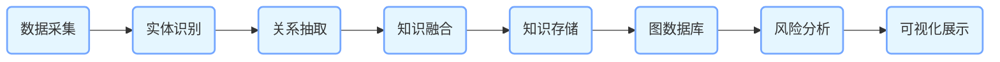

# 构建基于知识图谱的金融风险关联网络可视化系统

> 关键词：知识图谱、金融风险、关联网络、可视化系统、图数据库

> 摘要：本文旨在深入探讨如何构建基于知识图谱的金融风险关联网络可视化系统。首先介绍了构建该系统的背景，包括目的、预期读者、文档结构和相关术语。接着阐述了核心概念，如知识图谱、金融风险关联网络等，并给出了相应的原理和架构示意图。详细讲解了核心算法原理及具体操作步骤，通过 Python 代码进行示例。从数学模型和公式的角度进行分析，并举例说明。在项目实战部分，给出了开发环境搭建、源代码实现及解读。介绍了该系统的实际应用场景，推荐了相关的学习资源、开发工具框架和论文著作。最后总结了未来发展趋势与挑战，提供了常见问题解答和扩展阅读参考资料。

## 1. 背景介绍 
### 1.1 目的和范围
随着金融市场的日益复杂和全球化，金融风险的关联性变得愈发难以捉摸。金融机构面临着来自多个方面的风险，如信用风险、市场风险、操作风险等，这些风险之间相互影响、相互传递。传统的风险分析方法往往难以全面、直观地揭示这些风险之间的关联关系。

构建基于知识图谱的金融风险关联网络可视化系统的目的在于利用知识图谱的强大表达能力和关联分析能力，将金融领域中的各种实体（如企业、金融产品、交易等）及其之间的关系进行整合和表示，通过可视化的方式直观地展示金融风险的关联网络，帮助金融从业者更好地理解和管理金融风险。

本系统的范围涵盖了金融领域的多个方面，包括银行、证券、保险等行业，涉及企业的信用风险、市场波动对金融产品的影响、交易行为中的潜在风险等。

### 1.2 预期读者
- **金融从业者**：包括银行风险管理部门的工作人员、证券分析师、保险精算师等，他们可以利用该系统更全面地了解金融风险的关联关系，制定更有效的风险管理策略。
- **技术人员**：如数据科学家、软件工程师等，他们对构建知识图谱和可视化系统的技术细节感兴趣，可以从本文中学习到相关的技术实现方法。
- **研究人员**：金融领域的研究人员可以借助该系统进行金融风险的研究和分析，探索新的风险管理理论和方法。

### 1.3 文档结构概述
本文将按照以下结构进行阐述：
- **核心概念与联系**：介绍知识图谱、金融风险关联网络等核心概念，给出原理和架构示意图。
- **核心算法原理 & 具体操作步骤**：详细讲解构建知识图谱和关联网络的核心算法，并用 Python 代码进行示例。
- **数学模型和公式 & 详细讲解 & 举例说明**：从数学角度分析系统的原理，给出相关公式并举例。
- **项目实战：代码实际案例和详细解释说明**：包括开发环境搭建、源代码实现和代码解读。
- **实际应用场景**：介绍该系统在金融领域的实际应用场景。
- **工具和资源推荐**：推荐相关的学习资源、开发工具框架和论文著作。
- **总结：未来发展趋势与挑战**：总结系统的发展趋势和面临的挑战。
- **附录：常见问题与解答**：解答读者可能遇到的常见问题。
- **扩展阅读 & 参考资料**：提供扩展阅读的资料和参考文献。

### 1.4 术语表
#### 1.4.1 核心术语定义
- **知识图谱**：是一种基于图的数据结构，由节点（实体）和边（关系）组成，用于表示现实世界中各种实体及其之间的关系。在金融领域，节点可以表示企业、金融产品、交易等，边可以表示股权关系、交易关系、担保关系等。
- **金融风险关联网络**：是指将金融领域中的各种风险因素及其之间的关联关系以网络的形式进行表示。通过分析这个网络，可以揭示金融风险的传播路径和影响范围。
- **可视化系统**：是一种将数据以图形、图表等直观形式展示的系统，方便用户快速理解数据的含义和关系。在本系统中，可视化系统用于展示金融风险关联网络。

#### 1.4.2 相关概念解释
- **实体识别**：是指从文本数据中识别出具有特定意义的实体，如企业名称、人名、金融产品名称等。在构建知识图谱时，实体识别是重要的基础步骤。
- **关系抽取**：是指从文本数据中提取出实体之间的关系，如股权关系、交易关系等。关系抽取的准确性直接影响知识图谱的质量。
- **图数据库**：是一种专门用于存储和管理图数据的数据库，它支持高效的图查询和分析操作。在本系统中，图数据库用于存储金融知识图谱。

#### 1.4.3 缩略词列表
- **KG**：Knowledge Graph，知识图谱
- **RDF**：Resource Description Framework，资源描述框架
- **Neo4j**：一种流行的图数据库

## 2. 核心概念与联系 
### 核心概念原理
#### 知识图谱原理
知识图谱的核心思想是将现实世界中的各种实体及其之间的关系以图的形式进行表示。每个实体对应图中的一个节点，实体之间的关系对应图中的一条边。知识图谱可以用三元组 $(实体1, 关系, 实体2)$ 来表示，例如 $(企业A, 股权关系, 企业B)$ 表示企业 A 和企业 B 之间存在股权关系。

知识图谱的构建过程通常包括数据采集、实体识别、关系抽取、知识融合和知识存储等步骤。通过不断地收集和整合各种数据源，构建出一个全面、准确的知识图谱。

#### 金融风险关联网络原理
金融风险关联网络是基于知识图谱构建的，它将金融领域中的各种风险因素及其之间的关联关系进行建模。风险因素可以是企业的信用评级、市场波动、交易行为等，关联关系可以是风险的传递关系、影响关系等。

通过分析金融风险关联网络，可以发现潜在的风险传播路径和风险聚集区域，从而帮助金融从业者制定相应的风险管理策略。

### 架构示意图
以下是基于知识图谱的金融风险关联网络可视化系统的架构示意图：



### 各模块功能解释
- **数据采集**：从各种数据源（如金融报表、新闻报道、交易记录等）收集相关数据。
- **实体识别**：从采集到的数据中识别出金融实体，如企业、金融产品等。
- **关系抽取**：提取实体之间的关系，如股权关系、交易关系等。
- **知识融合**：将不同数据源中的知识进行融合，消除冲突和冗余。
- **知识存储**：将融合后的知识存储到图数据库中。
- **风险分析**：基于图数据库中的知识图谱进行风险分析，发现潜在的风险关联。
- **可视化展示**：将风险关联网络以直观的图形方式展示给用户。

## 3. 核心算法原理 & 具体操作步骤 
### 实体识别算法原理
实体识别是构建知识图谱的基础步骤，常用的算法有基于规则的方法、基于机器学习的方法和基于深度学习的方法。这里我们介绍基于深度学习的 BiLSTM-CRF 算法。

BiLSTM（Bidirectional Long Short-Term Memory）是一种双向的循环神经网络，它可以同时考虑输入序列的前后文信息。CRF（Conditional Random Field）是一种概率图模型，用于对序列进行标注。

BiLSTM-CRF 算法的基本原理是：首先将输入的文本序列通过 BiLSTM 网络进行特征提取，得到每个词的特征表示；然后将这些特征输入到 CRF 层进行标注，得到每个词对应的实体标签。

### Python 代码实现
```python
import torch
import torch.nn as nn
import torch.optim as optim
from torch.utils.data import Dataset, DataLoader

# 定义 BiLSTM-CRF 模型
class BiLSTM_CRF(nn.Module):
    def __init__(self, vocab_size, tag_to_ix, embedding_dim, hidden_dim):
        super(BiLSTM_CRF, self).__init__()
        self.embedding_dim = embedding_dim
        self.hidden_dim = hidden_dim
        self.vocab_size = vocab_size
        self.tag_to_ix = tag_to_ix
        self.tagset_size = len(tag_to_ix)

        self.word_embeds = nn.Embedding(vocab_size, embedding_dim)
        self.lstm = nn.LSTM(embedding_dim, hidden_dim // 2,
                            num_layers=1, bidirectional=True)

        # 将 LSTM 的输出映射到标签空间
        self.hidden2tag = nn.Linear(hidden_dim, self.tagset_size)

        # CRF 层的转移矩阵
        self.transitions = nn.Parameter(
            torch.randn(self.tagset_size, self.tagset_size))

        # 确保从开始标签到其他标签的转移是不可能的
        self.transitions.data[tag_to_ix[START_TAG], :] = -10000
        # 确保从其他标签到结束标签的转移是不可能的
        self.transitions.data[:, tag_to_ix[STOP_TAG]] = -10000

        self.hidden = self.init_hidden()

    def init_hidden(self):
        return (torch.randn(2, 1, self.hidden_dim // 2),
                torch.randn(2, 1, self.hidden_dim // 2))

    def _forward_alg(self, feats):
        # 前向算法计算所有可能的标签序列的分数
        init_alphas = torch.full((1, self.tagset_size), -10000.)
        # START_TAG 有所有分数
        init_alphas[0][self.tag_to_ix[START_TAG]] = 0.

        forward_var = init_alphas

        for feat in feats:
            alphas_t = []
            for next_tag in range(self.tagset_size):
                emit_score = feat[next_tag].view(
                    1, -1).expand(1, self.tagset_size)
                trans_score = self.transitions[next_tag].view(1, -1)
                next_tag_var = forward_var + trans_score + emit_score
                alphas_t.append(log_sum_exp(next_tag_var).view(1))
            forward_var = torch.cat(alphas_t).view(1, -1)
        terminal_var = forward_var + self.transitions[self.tag_to_ix[STOP_TAG]]
        alpha = log_sum_exp(terminal_var)
        return alpha

    def _get_lstm_features(self, sentence):
        self.hidden = self.init_hidden()
        embeds = self.word_embeds(sentence).view(len(sentence), 1, -1)
        lstm_out, self.hidden = self.lstm(embeds, self.hidden)
        lstm_out = lstm_out.view(len(sentence), self.hidden_dim)
        lstm_feats = self.hidden2tag(lstm_out)
        return lstm_feats

    def _score_sentence(self, feats, tags):
        # 计算给定标签序列的分数
        score = torch.zeros(1)
        tags = torch.cat([torch.tensor([self.tag_to_ix[START_TAG]], dtype=torch.long), tags])
        for i, feat in enumerate(feats):
            score = score + \
                self.transitions[tags[i + 1], tags[i]] + feat[tags[i + 1]]
        score = score + self.transitions[self.tag_to_ix[STOP_TAG], tags[-1]]
        return score

    def _viterbi_decode(self, feats):
        backpointers = []

        init_vvars = torch.full((1, self.tagset_size), -10000.)
        init_vvars[0][self.tag_to_ix[START_TAG]] = 0

        forward_var = init_vvars
        for feat in feats:
            bptrs_t = []
            viterbivars_t = []

            for next_tag in range(self.tagset_size):
                next_tag_var = forward_var + self.transitions[next_tag]
                best_tag_id = argmax(next_tag_var)
                bptrs_t.append(best_tag_id)
                viterbivars_t.append(next_tag_var[0][best_tag_id].view(1))
            forward_var = (torch.cat(viterbivars_t) + feat).view(1, -1)
            backpointers.append(bptrs_t)

        terminal_var = forward_var + self.transitions[self.tag_to_ix[STOP_TAG]]
        best_tag_id = argmax(terminal_var)
        path_score = terminal_var[0][best_tag_id]

        best_path = [best_tag_id]
        for bptrs_t in reversed(backpointers):
            best_tag_id = bptrs_t[best_tag_id]
            best_path.append(best_tag_id)
        start = best_path.pop()
        assert start == self.tag_to_ix[START_TAG]
        best_path.reverse()
        return path_score, best_path

    def neg_log_likelihood(self, sentence, tags):
        feats = self._get_lstm_features(sentence)
        forward_score = self._forward_alg(feats)
        gold_score = self._score_sentence(feats, tags)
        return forward_score - gold_score

    def forward(self, sentence):
        lstm_feats = self._get_lstm_features(sentence)
        score, tag_seq = self._viterbi_decode(lstm_feats)
        return score, tag_seq


# 辅助函数
def argmax(vec):
    _, idx = torch.max(vec, 1)
    return idx.item()

def log_sum_exp(vec):
    max_score = vec[0, argmax(vec)]
    return max_score + \
        torch.log(torch.sum(torch.exp(vec - max_score)))


# 示例使用
START_TAG = "<START>"
STOP_TAG = "<STOP>"
EMBEDDING_DIM = 5
HIDDEN_DIM = 4

# 准备数据
training_data = [
    ("the wall street journal reported today that apple corporation made money".split(),
     "B I I I O O O B I O O".split()),
    ("georgia tech is a university in georgia".split(),
     "B I O O O O B".split())
]

word_to_ix = {}
for sentence, tags in training_data:
    for word in sentence:
        if word not in word_to_ix:
            word_to_ix[word] = len(word_to_ix)

tag_to_ix = {"B": 0, "I": 1, "O": 2, START_TAG: 3, STOP_TAG: 4}

model = BiLSTM_CRF(len(word_to_ix), tag_to_ix, EMBEDDING_DIM, HIDDEN_DIM)
optimizer = optim.SGD(model.parameters(), lr=0.01, weight_decay=1e-4)

# 训练模型
for epoch in range(300):
    for sentence, tags in training_data:
        model.zero_grad()

        sentence_in = prepare_sequence(sentence, word_to_ix)
        targets = torch.tensor([tag_to_ix[t] for t in tags], dtype=torch.long)

        loss = model.neg_log_likelihood(sentence_in, targets)

        loss.backward()
        optimizer.step()


# 预测
def prepare_sequence(seq, to_ix):
    idxs = [to_ix[w] for w in seq]
    return torch.tensor(idxs, dtype=torch.long)

with torch.no_grad():
    precheck_sent = prepare_sequence(training_data[0][0], word_to_ix)
    print(model(precheck_sent))


```

### 关系抽取算法原理
关系抽取是从文本中提取实体之间的关系，常用的算法有基于模板的方法、基于机器学习的方法和基于深度学习的方法。这里我们介绍基于深度学习的卷积神经网络（CNN）方法。

CNN 可以自动提取文本的局部特征，通过卷积层和池化层对文本进行特征提取和降维，最后通过全连接层进行分类，判断实体之间的关系类型。

### Python 代码实现
```python
import torch
import torch.nn as nn
import torch.optim as optim
from torch.utils.data import Dataset, DataLoader

# 定义 CNN 关系抽取模型
class CNN_Relation_Extraction(nn.Module):
    def __init__(self, vocab_size, embedding_dim, num_filters, filter_sizes, output_dim, dropout):
        super(CNN_Relation_Extraction, self).__init__()
        self.embedding = nn.Embedding(vocab_size, embedding_dim)
        self.convs = nn.ModuleList([
            nn.Conv2d(in_channels=1,
                      out_channels=num_filters,
                      kernel_size=(fs, embedding_dim))
            for fs in filter_sizes
        ])
        self.fc = nn.Linear(len(filter_sizes) * num_filters, output_dim)
        self.dropout = nn.Dropout(dropout)

    def forward(self, text):
        embedded = self.embedding(text)
        embedded = embedded.unsqueeze(1)
        conved = [nn.functional.relu(conv(embedded)).squeeze(3) for conv in self.convs]
        pooled = [nn.functional.max_pool1d(conv, conv.shape[2]).squeeze(2) for conv in conved]
        cat = self.dropout(torch.cat(pooled, dim=1))
        return self.fc(cat)


# 示例使用
VOCAB_SIZE = 1000
EMBEDDING_DIM = 100
NUM_FILTERS = 100
FILTER_SIZES = [3, 4, 5]
OUTPUT_DIM = 10
DROPOUT = 0.5

model = CNN_Relation_Extraction(VOCAB_SIZE, EMBEDDING_DIM, NUM_FILTERS, FILTER_SIZES, OUTPUT_DIM, DROPOUT)
optimizer = optim.Adam(model.parameters())
criterion = nn.CrossEntropyLoss()


# 模拟训练数据
text = torch.randint(0, VOCAB_SIZE, (10, 20))
labels = torch.randint(0, OUTPUT_DIM, (10,))

# 训练模型
for epoch in range(10):
    optimizer.zero_grad()
    predictions = model(text)
    loss = criterion(predictions, labels)
    loss.backward()
    optimizer.step()


```

## 4. 数学模型和公式 & 详细讲解 & 举例说明 
### BiLSTM-CRF 数学模型
#### 前向算法
前向算法用于计算所有可能的标签序列的分数。设 $x$ 是输入的文本序列，$y$ 是标签序列，$f(x, y)$ 是特征函数，$\theta$ 是模型参数。前向算法的目标是计算 $Z(x) = \sum_{y} \exp(f(x, y) \cdot \theta)$。

具体步骤如下：
1. 初始化：$\alpha_0(s) = \begin{cases} 0, & s = START\_TAG \\ -\infty, & otherwise \end{cases}$
2. 递推：$\alpha_{t + 1}(j) = \log \sum_{i = 1}^{S} \exp(\alpha_t(i) + \theta_{i, j} + e_{t, j})$，其中 $S$ 是标签的数量，$\theta_{i, j}$ 是转移分数，$e_{t, j}$ 是发射分数。
3. 终止：$Z(x) = \log \sum_{i = 1}^{S} \exp(\alpha_T(i) + \theta_{i, STOP\_TAG})$，其中 $T$ 是序列的长度。

#### 维特比算法
维特比算法用于找到最优的标签序列。设 $\delta_t(j)$ 表示在时间 $t$ 时，以标签 $j$ 结尾的最优路径的分数。

具体步骤如下：
1. 初始化：$\delta_0(s) = \begin{cases} 0, & s = START\_TAG \\ -\infty, & otherwise \end{cases}$
2. 递推：$\delta_{t + 1}(j) = \max_{i = 1}^{S} (\delta_t(i) + \theta_{i, j} + e_{t, j})$，同时记录回溯指针 $\psi_{t + 1}(j)$。
3. 终止：$\max_y f(x, y) \cdot \theta = \max_{i = 1}^{S} (\delta_T(i) + \theta_{i, STOP\_TAG})$，通过回溯指针找到最优路径。

### CNN 关系抽取数学模型
#### 卷积层
卷积层的作用是提取文本的局部特征。设输入的文本嵌入矩阵为 $X \in \mathbb{R}^{n \times d}$，其中 $n$ 是文本的长度，$d$ 是嵌入维度。卷积核为 $W \in \mathbb{R}^{h \times d}$，其中 $h$ 是卷积核的高度。

卷积操作可以表示为：$c_i = f(W \cdot X_{i:i + h - 1} + b)$，其中 $X_{i:i + h - 1}$ 是输入矩阵的第 $i$ 到第 $i + h - 1$ 行，$b$ 是偏置，$f$ 是激活函数（如 ReLU）。

#### 池化层
池化层的作用是对卷积层的输出进行降维。常用的池化方法是最大池化，即 $p = \max(c)$。

#### 全连接层
全连接层将池化层的输出映射到关系类型的概率分布。设池化层的输出为 $p$，全连接层的权重矩阵为 $W_f \in \mathbb{R}^{m \times k}$，其中 $m$ 是池化层输出的维度，$k$ 是关系类型的数量。

全连接层的输出为：$y = \text{softmax}(W_f \cdot p + b_f)$，其中 $b_f$ 是偏置。

### 举例说明
#### BiLSTM-CRF 举例
假设输入的文本序列为 "the wall street journal"，标签集合为 {"B", "I", "O"}。经过 BiLSTM 层后，得到每个词的特征表示。然后通过 CRF 层进行标注，计算每个可能的标签序列的分数。

例如，可能的标签序列有 "O O O O"、"B I I I" 等。通过前向算法计算每个序列的分数，最终通过维特比算法找到分数最高的标签序列。

#### CNN 关系抽取举例
假设输入的文本是描述两个企业之间关系的句子，如 "Company A acquired Company B"。首先将文本进行分词和嵌入，得到输入矩阵 $X$。然后通过卷积层提取局部特征，如 "acquired" 这个词周围的特征。接着通过池化层对特征进行降维，最后通过全连接层输出两个企业之间的关系类型（如 "acquisition"）的概率分布。

## 5. 项目实战：代码实际案例和详细解释说明 
### 5.1  开发环境搭建
#### 硬件环境
- **CPU**：Intel Core i7 及以上
- **内存**：16GB 及以上
- **硬盘**：500GB 及以上

#### 软件环境
- **操作系统**：Windows 10、Linux（如 Ubuntu 18.04）
- **Python 版本**：Python 3.7 及以上
- **数据库**：Neo4j 图数据库

#### 安装依赖库
```bash
pip install torch
pip install neo4j
pip install matplotlib
```

### 5.2  源代码详细实现和代码解读
#### 数据采集和预处理
```python
import requests
from bs4 import BeautifulSoup

# 采集金融新闻数据
def collect_financial_news(url):
    response = requests.get(url)
    soup = BeautifulSoup(response.text, 'html.parser')
    news_text = soup.get_text()
    return news_text

# 数据预处理：分词
import nltk
nltk.download('punkt')
from nltk.tokenize import word_tokenize

def preprocess_text(text):
    tokens = word_tokenize(text)
    return tokens


# 示例使用
url = 'https://example.com/financial-news'
news_text = collect_financial_news(url)
tokens = preprocess_text(news_text)


```
**代码解读**：
- `collect_financial_news` 函数通过 `requests` 库发送 HTTP 请求获取金融新闻页面的内容，然后使用 `BeautifulSoup` 库解析 HTML 页面，提取文本内容。
- `preprocess_text` 函数使用 `nltk` 库的 `word_tokenize` 函数对文本进行分词处理。

#### 实体识别和关系抽取
使用前面介绍的 BiLSTM-CRF 和 CNN 模型进行实体识别和关系抽取。

```python
# 假设已经训练好的 BiLSTM-CRF 模型
model_entity_recognition = BiLSTM_CRF(len(word_to_ix), tag_to_ix, EMBEDDING_DIM, HIDDEN_DIM)
# 假设已经训练好的 CNN 关系抽取模型
model_relation_extraction = CNN_Relation_Extraction(VOCAB_SIZE, EMBEDDING_DIM, NUM_FILTERS, FILTER_SIZES, OUTPUT_DIM, DROPOUT)

# 实体识别
with torch.no_grad():
    sentence_in = prepare_sequence(tokens, word_to_ix)
    _, tags = model_entity_recognition(sentence_in)

# 关系抽取
text_tensor = torch.tensor([word_to_ix[word] for word in tokens if word in word_to_ix])
predictions = model_relation_extraction(text_tensor.unsqueeze(0))
relation = torch.argmax(predictions).item()


```
**代码解读**：
- 首先加载已经训练好的实体识别模型和关系抽取模型。
- 对于实体识别，将输入的文本序列转换为张量，然后通过模型进行预测，得到每个词的标签。
- 对于关系抽取，将输入的文本转换为张量，通过模型得到关系类型的预测结果。

#### 知识存储到图数据库
```python
from neo4j import GraphDatabase

# 连接到 Neo4j 数据库
uri = "bolt://localhost:7687"
driver = GraphDatabase.driver(uri, auth=("neo4j", "password"))

# 存储实体和关系到图数据库
def store_to_neo4j(tags, relation):
    with driver.session() as session:
        # 存储实体
        entities = []
        current_entity = []
        for i, tag in enumerate(tags):
            if tag.startswith('B'):
                if current_entity:
                    entities.append(' '.join(current_entity))
                    current_entity = []
                current_entity.append(tokens[i])
            elif tag.startswith('I'):
                current_entity.append(tokens[i])
            else:
                if current_entity:
                    entities.append(' '.join(current_entity))
                    current_entity = []
        if current_entity:
            entities.append(' '.join(current_entity))

        for entity in entities:
            session.run("MERGE (n:Entity {name: $name})", name=entity)

        # 存储关系
        if len(entities) >= 2:
            session.run("MATCH (a:Entity {name: $name1}), (b:Entity {name: $name2}) "
                        "MERGE (a)-[r:RELATION {type: $relation_type}]->(b)",
                        name1=entities[0], name2=entities[1], relation_type=relation)


# 示例使用
store_to_neo4j(tags, relation)


```
**代码解读**：
- 首先使用 `neo4j` 库连接到 Neo4j 图数据库。
- `store_to_neo4j` 函数将实体识别和关系抽取的结果存储到图数据库中。首先根据实体标签提取实体，然后使用 `MERGE` 语句将实体存储到数据库中。最后，根据关系抽取的结果，使用 `MATCH` 和 `MERGE` 语句建立实体之间的关系。

#### 可视化展示
```python
import matplotlib.pyplot as plt
from py2neo import Graph, Node, Relationship

# 从图数据库中获取数据
graph = Graph("bolt://localhost:7687", auth=("neo4j", "password"))
query = "MATCH (a)-[r]->(b) RETURN a.name, type(r), b.name"
results = graph.run(query)

# 绘制关系图
G = nx.Graph()
for row in results:
    source = row[0]
    relation = row[1]
    target = row[2]
    G.add_edge(source, target, label=relation)

pos = nx.spring_layout(G)
nx.draw_networkx_nodes(G, pos)
nx.draw_networkx_edges(G, pos)
nx.draw_networkx_labels(G, pos)
edge_labels = nx.get_edge_attributes(G, 'label')
nx.draw_networkx_edge_labels(G, pos, edge_labels=edge_labels)
plt.show()


```
**代码解读**：
- 使用 `py2neo` 库从 Neo4j 图数据库中获取实体和关系数据。
- 使用 `networkx` 库创建图对象，并添加节点和边。
- 使用 `matplotlib` 库绘制关系图，展示金融风险关联网络。

### 5.3  代码解读与分析
#### 数据采集和预处理
数据采集是构建知识图谱的第一步，通过网络爬虫获取金融领域的相关数据。数据预处理可以提高后续实体识别和关系抽取的准确性，如分词可以将文本拆分成单个的词，方便模型处理。

#### 实体识别和关系抽取
实体识别和关系抽取是构建知识图谱的核心步骤。BiLSTM-CRF 模型可以有效地识别文本中的实体，CNN 模型可以准确地抽取实体之间的关系。

#### 知识存储到图数据库
图数据库可以高效地存储和管理知识图谱，Neo4j 是一种常用的图数据库。通过将实体和关系存储到图数据库中，可以方便后续的查询和分析。

#### 可视化展示
可视化展示可以将金融风险关联网络以直观的图形方式展示给用户，帮助用户更好地理解和分析金融风险。

## 6. 实际应用场景 
### 银行风险管理
银行在进行贷款审批时，需要评估借款人的信用风险。通过构建基于知识图谱的金融风险关联网络可视化系统，银行可以全面了解借款人的关联企业、担保关系、交易历史等信息，发现潜在的风险因素。例如，如果借款人的关联企业存在大量的逾期贷款记录，那么借款人的信用风险可能会增加。

### 证券投资分析
证券分析师在进行投资分析时，需要考虑多个因素，如企业的财务状况、行业趋势、市场竞争等。通过可视化系统，分析师可以直观地看到企业之间的关联关系，以及市场波动对不同企业的影响。例如，如果某家企业的主要供应商出现了财务问题，那么该企业的生产和销售可能会受到影响，从而影响其股价。

### 保险风险评估
保险公司在进行保险产品定价和风险评估时，需要考虑投保人的风险状况。通过知识图谱和关联网络，保险公司可以了解投保人的行业背景、健康状况、财务状况等信息，以及这些信息之间的关联关系。例如，如果投保人所在的行业存在较高的风险，那么保险公司可能会提高保险费率。

## 7. 工具和资源推荐
### 7.1 学习资源推荐
#### 7.1.1 书籍推荐
- 《知识图谱：方法、实践与应用》：本书全面介绍了知识图谱的基本概念、构建方法和应用场景，是学习知识图谱的经典书籍。
- 《深度学习》：这本书详细介绍了深度学习的基本原理和算法，对于理解实体识别和关系抽取的深度学习模型有很大帮助。
- 《Python 数据分析实战》：介绍了 Python 在数据分析领域的应用，包括数据采集、预处理、可视化等方面的内容。

#### 7.1.2 在线课程
- Coursera 上的 “Knowledge Graphs” 课程：由知名高校的教授授课，系统地介绍了知识图谱的相关知识。
- edX 上的 “Deep Learning Specialization” 课程：深度学习领域的经典课程，涵盖了神经网络、卷积神经网络、循环神经网络等内容。
- 网易云课堂上的 “Python 数据分析与挖掘实战” 课程：通过实际案例介绍 Python 在数据分析和挖掘中的应用。

#### 7.1.3 技术博客和网站
- 博客园：有很多关于知识图谱、深度学习等技术的博客文章，作者分享了自己的实践经验和研究成果。
- 知乎：在知乎上可以找到很多关于金融科技、知识图谱的讨论和分享，与其他技术爱好者交流。
- 开源中国：提供了大量的开源项目和技术文章，对于学习和实践有很大帮助。

### 7.2 开发工具框架推荐
#### 7.2.1 IDE和编辑器
- PyCharm：是一款专业的 Python 集成开发环境，具有代码自动补全、调试等功能，方便开发 Python 程序。
- Jupyter Notebook：是一种交互式的开发环境，适合进行数据分析和模型训练，支持 Python、R 等多种编程语言。
- Visual Studio Code：是一款轻量级的代码编辑器，支持多种编程语言，有丰富的插件可以扩展功能。

#### 7.2.2 调试和性能分析工具
- Py-Spy：可以对 Python 程序进行性能分析，找出程序中的性能瓶颈。
- PDB：是 Python 自带的调试工具，可以帮助开发者调试程序，定位问题。
- TensorBoard：是 TensorFlow 提供的可视化工具，可以用于可视化深度学习模型的训练过程和性能指标。

#### 7.2.3 相关框架和库
- PyTorch：是一个开源的深度学习框架，提供了丰富的神经网络模型和工具，方便进行实体识别和关系抽取的模型开发。
- Neo4j Python Driver：是 Neo4j 图数据库的 Python 驱动程序，方便在 Python 中操作 Neo4j 数据库。
- NetworkX：是一个用于创建、操作和研究复杂网络的 Python 库，可用于可视化金融风险关联网络。

### 7.3 相关论文著作推荐
#### 7.3.1 经典论文
- “TransE: Translating Embeddings for Modeling Multi-relational Data”：提出了 TransE 模型，用于知识图谱的表示学习。
- “Convolutional Neural Networks for Sentence Classification”：介绍了卷积神经网络在文本分类任务中的应用，对于关系抽取有一定的参考价值。
- “Bidirectional LSTM-CRF Models for Sequence Tagging”：提出了 BiLSTM-CRF 模型，用于序列标注任务，如实体识别。

#### 7.3.2 最新研究成果
- 关注 ACL（Association for Computational Linguistics）、KDD（Knowledge Discovery and Data Mining）等顶级学术会议的论文，了解知识图谱和金融风险分析领域的最新研究成果。
- 查阅顶级学术期刊，如 Journal of Artificial Intelligence Research、ACM Transactions on Intelligent Systems and Technology 等，获取相关的研究论文。

#### 7.3.3 应用案例分析
- 一些金融机构和科技公司会发布关于知识图谱在金融风险分析中的应用案例，可以通过他们的官方网站或行业报告获取这些案例，学习实际应用中的经验和方法。

## 8. 总结：未来发展趋势与挑战
### 未来发展趋势
- **多源数据融合**：未来的金融风险关联网络可视化系统将融合更多类型的数据，如社交媒体数据、物联网数据等，以更全面地了解金融风险的关联关系。
- **实时分析和预警**：随着金融市场的快速变化，系统将具备实时分析和预警功能，及时发现潜在的风险并发出警报。
- **与人工智能技术的深度融合**：结合自然语言处理、机器学习、深度学习等人工智能技术，提高系统的智能化水平，实现自动风险评估和决策支持。
- **跨行业应用**：金融风险关联网络可视化系统的应用将不再局限于金融领域，可能会扩展到其他行业，如医疗、能源等，实现跨行业的风险分析和管理。

### 挑战
- **数据质量和隐私问题**：金融数据的质量和隐私是构建系统的关键问题。数据可能存在噪声、缺失值等问题，需要进行有效的数据清洗和预处理。同时，金融数据涉及用户的隐私和商业机密，需要采取严格的安全措施来保护数据。
- **模型复杂度和可解释性**：深度学习模型在实体识别和关系抽取等任务中取得了很好的效果，但这些模型通常比较复杂，缺乏可解释性。在金融领域，模型的可解释性非常重要，需要研究如何提高模型的可解释性。
- **计算资源和性能要求**：构建和分析大规模的金融风险关联网络需要大量的计算资源和时间。如何优化算法和系统架构，提高系统的性能和效率，是一个亟待解决的问题。

## 9. 附录：常见问题与解答
### 问题 1：如何选择合适的实体识别和关系抽取算法？
答：选择合适的算法需要考虑多个因素，如数据规模、数据类型、任务复杂度等。如果数据规模较小，可以考虑使用基于规则的方法；如果数据规模较大且任务复杂度较高，可以使用基于深度学习的方法，如 BiLSTM-CRF 和 CNN。

### 问题 2：图数据库和传统数据库有什么区别？
答：图数据库专门用于存储和管理图数据，它可以高效地处理实体之间的关系查询和分析。传统数据库（如关系数据库）主要用于存储结构化数据，对于复杂的关系查询和分析效率较低。

### 问题 3：如何评估知识图谱的质量？
答：可以从多个方面评估知识图谱的质量，如实体的准确性、关系的完整性、知识的一致性等。可以使用人工评估和自动评估相结合的方法，例如通过计算准确率、召回率等指标来评估实体识别和关系抽取的效果。

### 问题 4：如何提高可视化系统的交互性？
答：可以使用一些可视化库和工具，如 D3.js、Echarts 等，这些库提供了丰富的交互功能，如鼠标悬停显示信息、点击节点展开子图等。同时，可以根据用户的需求设计合理的交互界面，提高用户体验。

## 10. 扩展阅读 & 参考资料
### 扩展阅读
- 《金融科技前沿：技术驱动的金融创新》：介绍了金融科技领域的最新发展和创新应用，对于了解金融风险分析和管理的新技术有很大帮助。
- 《大数据分析与应用》：详细介绍了大数据分析的方法和技术，包括数据采集、存储、处理和可视化等方面的内容。
- 《人工智能：现代方法》：全面介绍了人工智能的基本概念、算法和应用，对于理解知识图谱和金融风险关联网络的技术原理有很大帮助。

### 参考资料
- 《知识图谱：概念与技术》：提供了知识图谱的详细技术介绍和实现方法。
- 《深度学习实战》：通过实际案例介绍了深度学习的应用和开发过程。
- Neo4j 官方文档：详细介绍了 Neo4j 图数据库的使用方法和 API。
- PyTorch 官方文档：提供了 PyTorch 深度学习框架的详细文档和教程。