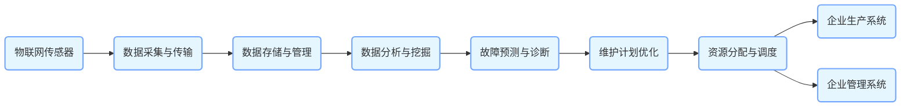

# 构建智能企业资产管理平台：预测性维护与资源优化

> 关键词：智能企业资产管理平台、预测性维护、资源优化、机器学习、物联网

> 摘要：本文围绕构建智能企业资产管理平台展开，深入探讨预测性维护与资源优化的关键技术和方法。详细阐述了相关核心概念、算法原理、数学模型，通过实际案例展示平台的开发与应用。同时介绍了相关的工具和资源，分析了未来发展趋势与挑战，旨在为企业构建高效、智能的资产管理平台提供全面的技术指导和实践参考。

## 1. 背景介绍 
### 1.1 目的和范围
在当今竞争激烈的商业环境中，企业的资产设备对于生产运营起着至关重要的作用。传统的资产管理方式往往依赖于定期维护和事后维修，这种方式不仅成本高，而且容易导致设备故障和生产中断。构建智能企业资产管理平台的目的在于利用先进的技术手段，实现对企业资产的实时监测、预测性维护和资源优化，从而提高设备的可靠性和可用性，降低维护成本，提升企业的生产效率和竞争力。

本文的范围涵盖了智能企业资产管理平台的各个方面，包括核心概念、算法原理、数学模型、实际应用案例、工具和资源推荐等，旨在为读者提供一个全面的技术视角和实践指南。

### 1.2 预期读者
本文预期读者包括企业的管理人员、技术人员、资产管理人员以及对智能资产管理感兴趣的研究人员。对于企业管理人员，本文可以帮助他们了解智能资产管理平台的价值和意义，为企业的战略决策提供参考；对于技术人员，本文可以作为技术实现的指导手册，帮助他们掌握相关的技术和方法；对于资产管理人员，本文可以提供实际操作的建议和经验，帮助他们更好地管理企业的资产；对于研究人员，本文可以为他们的研究提供理论和实践基础。

### 1.3 文档结构概述
本文将按照以下结构进行组织：
- 核心概念与联系：介绍智能企业资产管理平台、预测性维护和资源优化的核心概念，以及它们之间的联系，并通过文本示意图和 Mermaid 流程图进行展示。
- 核心算法原理 & 具体操作步骤：详细讲解用于预测性维护和资源优化的核心算法原理，并使用 Python 源代码进行具体实现。
- 数学模型和公式 & 详细讲解 & 举例说明：介绍相关的数学模型和公式，并通过具体的例子进行详细讲解。
- 项目实战：代码实际案例和详细解释说明：通过一个实际的项目案例，展示智能企业资产管理平台的开发过程，包括开发环境搭建、源代码实现和代码解读。
- 实际应用场景：介绍智能企业资产管理平台在不同行业的实际应用场景。
- 工具和资源推荐：推荐相关的学习资源、开发工具框架和论文著作。
- 总结：未来发展趋势与挑战：分析智能企业资产管理平台的未来发展趋势和面临的挑战。
- 附录：常见问题与解答：解答读者在阅读过程中可能遇到的常见问题。
- 扩展阅读 & 参考资料：提供相关的扩展阅读材料和参考资料。

### 1.4 术语表
#### 1.4.1 核心术语定义
- **智能企业资产管理平台**：是一种基于先进信息技术的管理系统，通过物联网、大数据、人工智能等技术，实现对企业资产的全面管理和优化。
- **预测性维护**：是一种基于设备状态监测和数据分析的维护策略，通过预测设备的故障时间，提前安排维护计划，从而避免设备故障和生产中断。
- **资源优化**：是指在满足企业生产需求的前提下，通过合理分配和利用资源，提高资源的利用效率，降低成本。
- **物联网（IoT）**：是指通过各种信息传感器、射频识别技术、全球定位系统等技术，实时采集任何需要监控、连接、互动的物体或过程，采集其声、光、热、电、力学、化学、生物、位置等各种需要的信息，通过各类可能的网络接入，实现物与物、物与人的泛在连接，实现对物品和过程的智能化感知、识别和管理。
- **机器学习**：是一门多领域交叉学科，涉及概率论、统计学、逼近论、凸分析、算法复杂度理论等多门学科。它专门研究计算机怎样模拟或实现人类的学习行为，以获取新的知识或技能，重新组织已有的知识结构使之不断改善自身的性能。

#### 1.4.2 相关概念解释
- **设备状态监测**：是指通过安装在设备上的传感器，实时采集设备的运行状态数据，如温度、振动、压力等，以便及时发现设备的异常情况。
- **故障预测模型**：是指通过对设备状态监测数据的分析和处理，建立的用于预测设备故障的数学模型。
- **维护计划优化**：是指根据设备的故障预测结果和企业的生产计划，制定最优的维护计划，以降低维护成本和提高设备的可靠性。

#### 1.4.3 缩略词列表
- **IoT**：Internet of Things（物联网）
- **ML**：Machine Learning（机器学习）
- **RUL**：Remaining Useful Life（剩余使用寿命）

## 2. 核心概念与联系 
### 核心概念原理
#### 智能企业资产管理平台
智能企业资产管理平台是一个综合性的管理系统，它集成了物联网、大数据、人工智能等多种技术，实现了对企业资产的全生命周期管理。该平台通过物联网传感器实时采集设备的运行状态数据，将这些数据传输到数据中心进行存储和分析。利用大数据技术对海量的设备数据进行处理和挖掘，提取有价值的信息。再通过人工智能算法，如机器学习、深度学习等，建立设备的故障预测模型和维护计划优化模型，实现对设备的预测性维护和资源优化。

#### 预测性维护
预测性维护是智能企业资产管理平台的核心功能之一。它基于设备状态监测数据，利用机器学习和数据分析技术，预测设备的故障时间和剩余使用寿命（RUL）。通过对设备的运行状态进行实时监测和分析，及时发现设备的潜在故障隐患，并提前采取维护措施，避免设备故障的发生。预测性维护可以提高设备的可靠性和可用性，降低维护成本和停机时间。

#### 资源优化
资源优化是指在满足企业生产需求的前提下，通过合理分配和利用资源，提高资源的利用效率，降低成本。在智能企业资产管理平台中，资源优化主要包括设备资源优化和人力资源优化。设备资源优化是指根据设备的运行状态和生产需求，合理安排设备的使用和维护计划，提高设备的利用率。人力资源优化是指根据设备的维护需求和员工的技能水平，合理安排员工的工作任务，提高员工的工作效率。

### 架构的文本示意图
```plaintext
+---------------------+
| 智能企业资产管理平台 |
+---------------------+
| 物联网传感器层       |
| 数据采集与传输      |
| 数据存储与管理      |
| 数据分析与挖掘      |
| 故障预测与诊断      |
| 维护计划优化        |
| 资源分配与调度      |
+---------------------+
| 企业生产系统        |
| 企业管理系统        |
+---------------------+
```

### Mermaid 流程图


## 3. 核心算法原理 & 具体操作步骤 
### 故障预测算法 - 基于机器学习的方法
#### 算法原理
在预测性维护中，我们可以使用机器学习算法来构建故障预测模型。常见的机器学习算法包括决策树、支持向量机、神经网络等。这里我们以决策树算法为例进行讲解。

决策树是一种基于树结构进行决策的算法，它通过对数据的特征进行划分，构建一棵决策树。决策树的每个内部节点是一个特征上的测试，每个分支是测试输出，每个叶节点是一个类别或值。在故障预测中，我们可以将设备的状态数据作为输入特征，设备的故障状态作为输出类别，通过训练决策树模型来预测设备的故障概率。

#### 具体操作步骤
1. **数据收集**：收集设备的状态数据，包括温度、振动、压力等传感器数据，以及设备的故障记录。
2. **数据预处理**：对收集到的数据进行清洗、归一化等预处理操作，以提高数据的质量和可用性。
3. **特征选择**：从预处理后的数据中选择与设备故障相关的特征，以减少特征维度，提高模型的训练效率和准确性。
4. **模型训练**：使用训练数据对决策树模型进行训练，调整模型的参数，以提高模型的性能。
5. **模型评估**：使用测试数据对训练好的模型进行评估，计算模型的准确率、召回率等指标，以评估模型的性能。
6. **故障预测**：使用训练好的模型对新的设备状态数据进行预测，输出设备的故障概率。

#### Python 源代码实现
```python
import pandas as pd
from sklearn.tree import DecisionTreeClassifier
from sklearn.model_selection import train_test_split
from sklearn.metrics import accuracy_score

# 数据收集
data = pd.read_csv('device_data.csv')

# 数据预处理
X = data.drop('fault', axis=1)  # 特征
y = data['fault']  # 标签

# 数据划分
X_train, X_test, y_train, y_test = train_test_split(X, y, test_size=0.2, random_state=42)

# 模型训练
model = DecisionTreeClassifier()
model.fit(X_train, y_train)

# 模型预测
y_pred = model.predict(X_test)

# 模型评估
accuracy = accuracy_score(y_test, y_pred)
print(f"模型准确率: {accuracy}")
```

### 维护计划优化算法 - 基于遗传算法的方法
#### 算法原理
遗传算法是一种模拟自然选择和遗传机制的优化算法，它通过模拟生物进化过程中的选择、交叉和变异操作，不断搜索最优解。在维护计划优化中，我们可以将维护计划作为个体，将维护成本和设备可靠性作为适应度函数，通过遗传算法不断优化维护计划，以达到降低维护成本和提高设备可靠性的目的。

#### 具体操作步骤
1. **编码**：将维护计划编码为染色体，每个基因表示一个维护任务的时间和资源分配。
2. **初始化种群**：随机生成一组初始维护计划作为种群。
3. **适应度评估**：计算每个维护计划的适应度值，适应度值越高表示维护计划越优。
4. **选择操作**：根据适应度值选择一部分优秀的维护计划作为父代。
5. **交叉操作**：对父代维护计划进行交叉操作，生成子代维护计划。
6. **变异操作**：对子代维护计划进行变异操作，引入新的维护计划。
7. **更新种群**：将子代维护计划加入到种群中，替换一部分较差的维护计划。
8. **终止条件判断**：如果满足终止条件，如达到最大迭代次数或适应度值收敛，则停止迭代，输出最优维护计划；否则，返回步骤 3。

#### Python 源代码实现
```python
import random
import numpy as np

# 定义适应度函数
def fitness_function(schedule):
    # 计算维护成本和设备可靠性
    # 这里简单示例，实际需要根据具体情况实现
    cost = np.sum(schedule)
    reliability = 1 / cost
    return reliability

# 编码
def encode_schedule(num_tasks, max_time):
    schedule = [random.randint(0, max_time) for _ in range(num_tasks)]
    return schedule

# 初始化种群
def initialize_population(pop_size, num_tasks, max_time):
    population = [encode_schedule(num_tasks, max_time) for _ in range(pop_size)]
    return population

# 选择操作
def selection(population, fitness_scores):
    total_fitness = sum(fitness_scores)
    probabilities = [score / total_fitness for score in fitness_scores]
    selected_indices = np.random.choice(len(population), size=len(population), p=probabilities)
    selected_population = [population[i] for i in selected_indices]
    return selected_population

# 交叉操作
def crossover(parent1, parent2):
    crossover_point = random.randint(1, len(parent1) - 1)
    child1 = parent1[:crossover_point] + parent2[crossover_point:]
    child2 = parent2[:crossover_point] + parent1[crossover_point:]
    return child1, child2

# 变异操作
def mutation(schedule, max_time, mutation_rate):
    for i in range(len(schedule)):
        if random.random() < mutation_rate:
            schedule[i] = random.randint(0, max_time)
    return schedule

# 遗传算法主函数
def genetic_algorithm(pop_size, num_tasks, max_time, max_generations, mutation_rate):
    population = initialize_population(pop_size, num_tasks, max_time)
    for generation in range(max_generations):
        fitness_scores = [fitness_function(schedule) for schedule in population]
        selected_population = selection(population, fitness_scores)
        new_population = []
        for i in range(0, pop_size, 2):
            parent1 = selected_population[i]
            parent2 = selected_population[i + 1]
            child1, child2 = crossover(parent1, parent2)
            child1 = mutation(child1, max_time, mutation_rate)
            child2 = mutation(child2, max_time, mutation_rate)
            new_population.extend([child1, child2])
        population = new_population
    best_schedule = max(population, key=fitness_function)
    return best_schedule

# 参数设置
pop_size = 50
num_tasks = 10
max_time = 100
max_generations = 100
mutation_rate = 0.1

# 运行遗传算法
best_schedule = genetic_algorithm(pop_size, num_tasks, max_time, max_generations, mutation_rate)
print(f"最优维护计划: {best_schedule}")
```

## 4. 数学模型和公式 & 详细讲解 & 举例说明 
### 故障预测模型 - 基于机器学习的概率模型
#### 数学模型
在基于机器学习的故障预测中，我们可以使用概率模型来描述设备的故障概率。假设设备的状态可以用一组特征向量 $\mathbf{x}=(x_1,x_2,\cdots,x_n)$ 表示，设备的故障状态可以用一个二元变量 $y\in\{0,1\}$ 表示，其中 $y = 1$ 表示设备发生故障，$y = 0$ 表示设备正常。我们可以使用逻辑回归模型来建立设备故障概率 $P(y = 1|\mathbf{x})$ 与特征向量 $\mathbf{x}$ 之间的关系：

$$P(y = 1|\mathbf{x})=\frac{1}{1 + e^{-\mathbf{w}^T\mathbf{x}-b}}$$

其中 $\mathbf{w}=(w_1,w_2,\cdots,w_n)$ 是模型的权重向量，$b$ 是偏置项。

#### 详细讲解
逻辑回归模型是一种广义线性模型，它通过对数几率函数将线性回归模型的输出映射到 $[0,1]$ 区间，从而可以用于分类问题。在故障预测中，我们可以通过训练逻辑回归模型来估计权重向量 $\mathbf{w}$ 和偏置项 $b$，使得模型的预测结果尽可能接近真实的故障状态。

#### 举例说明
假设我们有一个设备的状态数据，包括温度 $x_1$、振动 $x_2$ 和压力 $x_3$ 三个特征，我们可以使用逻辑回归模型来预测设备的故障概率。假设训练得到的权重向量 $\mathbf{w}=(0.5, 0.3, 0.2)$，偏置项 $b = -1$，当设备的状态特征向量 $\mathbf{x}=(80, 10, 20)$ 时，设备的故障概率为：

$$P(y = 1|\mathbf{x})=\frac{1}{1 + e^{-(0.5\times80 + 0.3\times10 + 0.2\times20 - 1)}}=\frac{1}{1 + e^{-40 - 3 - 4 + 1}}=\frac{1}{1 + e^{-46}}\approx1$$

这表明设备发生故障的概率非常高。

### 维护计划优化模型 - 基于成本效益分析的模型
#### 数学模型
在维护计划优化中，我们可以使用成本效益分析的方法来建立维护计划优化模型。假设设备的维护成本可以分为预防性维护成本 $C_p$ 和纠正性维护成本 $C_c$，设备的可靠性可以用设备的正常运行时间 $T$ 表示。我们的目标是在满足设备可靠性要求的前提下，最小化维护成本。

设维护计划可以用一个向量 $\mathbf{s}=(s_1,s_2,\cdots,s_m)$ 表示，其中 $s_i$ 表示第 $i$ 个维护任务的时间和资源分配。维护成本函数可以表示为：

$$C(\mathbf{s}) = \sum_{i = 1}^{m} C_{p_i}(s_i) + \sum_{j = 1}^{n} C_{c_j}(s_j)$$

其中 $C_{p_i}(s_i)$ 表示第 $i$ 个预防性维护任务的成本，$C_{c_j}(s_j)$ 表示第 $j$ 个纠正性维护任务的成本。

设备可靠性函数可以表示为：

$$R(\mathbf{s}) = \prod_{i = 1}^{m} R_{p_i}(s_i) \prod_{j = 1}^{n} R_{c_j}(s_j)$$

其中 $R_{p_i}(s_i)$ 表示第 $i$ 个预防性维护任务对设备可靠性的影响，$R_{c_j}(s_j)$ 表示第 $j$ 个纠正性维护任务对设备可靠性的影响。

维护计划优化问题可以表示为一个约束优化问题：

$$\min_{\mathbf{s}} C(\mathbf{s})$$

$$\text{s.t. } R(\mathbf{s})\geq R_{min}$$

其中 $R_{min}$ 是设备的最小可靠性要求。

#### 详细讲解
在这个模型中，我们的目标是通过优化维护计划 $\mathbf{s}$，使得维护成本 $C(\mathbf{s})$ 最小化，同时满足设备可靠性要求 $R(\mathbf{s})\geq R_{min}$。预防性维护成本 $C_{p_i}(s_i)$ 和纠正性维护成本 $C_{c_j}(s_j)$ 可以根据实际情况进行定义，例如预防性维护成本可以包括维护人员的工资、维护材料的费用等，纠正性维护成本可以包括设备故障造成的生产损失、维修费用等。设备可靠性函数 $R(\mathbf{s})$ 可以通过设备的可靠性模型进行计算，例如指数分布模型、威布尔分布模型等。

#### 举例说明
假设我们有一个设备，预防性维护成本 $C_p$ 与维护时间间隔 $t$ 之间的关系为 $C_p(t) = 100 + 10t$，纠正性维护成本 $C_c$ 为 1000 元。设备的可靠性函数 $R(t)$ 可以用指数分布模型表示：

$$R(t)=e^{-\lambda t}$$

其中 $\lambda$ 是设备的失效率，假设 $\lambda = 0.01$。我们的目标是在满足设备可靠性要求 $R(t)\geq 0.9$ 的前提下，最小化维护成本。

设维护时间间隔为 $t$，则维护成本函数为：

$$C(t) = C_p(t) + \frac{C_c}{t}$$

设备可靠性约束为：

$$R(t)=e^{-\lambda t}\geq 0.9$$

解这个约束优化问题，可以得到最优的维护时间间隔 $t$，从而得到最优的维护计划。

## 5. 项目实战：代码实际案例和详细解释说明 
### 5.1  开发环境搭建
#### 硬件环境
- 服务器：建议使用配置较高的服务器，如 Intel Xeon 处理器、16GB 以上内存、1TB 以上硬盘。
- 物联网传感器：根据需要监测的设备类型和参数，选择合适的物联网传感器，如温度传感器、振动传感器、压力传感器等。

#### 软件环境
- 操作系统：推荐使用 Linux 操作系统，如 Ubuntu、CentOS 等。
- 数据库：可以选择关系型数据库，如 MySQL、PostgreSQL 等，也可以选择非关系型数据库，如 MongoDB、Redis 等。
- 编程语言：Python 是一个很好的选择，它具有丰富的机器学习和数据分析库。
- 开发框架：可以使用 Flask、Django 等 Web 开发框架来构建智能企业资产管理平台的前端界面和后端服务。

#### 安装步骤
1. 安装操作系统：根据服务器的硬件配置和需求，选择合适的 Linux 操作系统进行安装。
2. 安装数据库：以 MySQL 为例，使用以下命令进行安装：
```bash
sudo apt-get update
sudo apt-get install mysql-server
```
3. 安装 Python：使用以下命令安装 Python 3：
```bash
sudo apt-get install python3
```
4. 安装 Python 库：使用以下命令安装所需的 Python 库：
```bash
pip install pandas numpy scikit-learn flask
```
5. 安装 Web 开发框架：以 Flask 为例，使用以下命令进行安装：
```bash
pip install flask
```

### 5.2  源代码详细实现和代码解读
#### 数据采集与存储模块
```python
import mysql.connector
import random
import time

# 连接数据库
mydb = mysql.connector.connect(
    host="localhost",
    user="your_username",
    password="your_password",
    database="your_database"
)

mycursor = mydb.cursor()

# 创建数据表
mycursor.execute("CREATE TABLE IF NOT EXISTS device_data (id INT AUTO_INCREMENT PRIMARY KEY, temperature FLOAT, vibration FLOAT, pressure FLOAT, timestamp TIMESTAMP DEFAULT CURRENT_TIMESTAMP)")

# 模拟数据采集
while True:
    temperature = random.uniform(20, 80)
    vibration = random.uniform(0, 10)
    pressure = random.uniform(100, 200)

    sql = "INSERT INTO device_data (temperature, vibration, pressure) VALUES (%s, %s, %s)"
    val = (temperature, vibration, pressure)
    mycursor.execute(sql, val)

    mydb.commit()

    print(f"Inserted: Temperature={temperature}, Vibration={vibration}, Pressure={pressure}")
    time.sleep(10)
```
**代码解读**：
- 首先，我们使用 `mysql.connector` 库连接到 MySQL 数据库。
- 然后，创建一个名为 `device_data` 的数据表，用于存储设备的状态数据。
- 接着，使用 `while True` 循环模拟数据采集过程，每隔 10 秒生成一组随机的温度、振动和压力数据，并将这些数据插入到 `device_data` 表中。

#### 数据分析与预测模块
```python
import pandas as pd
from sklearn.tree import DecisionTreeClassifier
from sklearn.model_selection import train_test_split
from sklearn.metrics import accuracy_score
import mysql.connector

# 连接数据库
mydb = mysql.connector.connect(
    host="localhost",
    user="your_username",
    password="your_password",
    database="your_database"
)

# 从数据库中读取数据
df = pd.read_sql("SELECT * FROM device_data", mydb)

# 数据预处理
X = df[['temperature', 'vibration', 'pressure']]
y = df['fault']  # 假设这里有一个 'fault' 列表示设备故障状态

# 数据划分
X_train, X_test, y_train, y_test = train_test_split(X, y, test_size=0.2, random_state=42)

# 模型训练
model = DecisionTreeClassifier()
model.fit(X_train, y_train)

# 模型预测
y_pred = model.predict(X_test)

# 模型评估
accuracy = accuracy_score(y_test, y_pred)
print(f"模型准确率: {accuracy}")
```
**代码解读**：
- 首先，我们使用 `mysql.connector` 库连接到 MySQL 数据库，并使用 `pandas` 库从数据库中读取设备的状态数据。
- 然后，对数据进行预处理，选择 `temperature`、`vibration` 和 `pressure` 作为特征，`fault` 作为标签。
- 接着，将数据划分为训练集和测试集，使用决策树模型进行训练。
- 最后，使用测试集对模型进行评估，计算模型的准确率。

#### 前端展示模块
```python
from flask import Flask, render_template
import pandas as pd
import mysql.connector

app = Flask(__name__)

# 连接数据库
mydb = mysql.connector.connect(
    host="localhost",
    user="your_username",
    password="your_password",
    database="your_database"
)

@app.route('/')
def index():
    # 从数据库中读取最新的设备状态数据
    df = pd.read_sql("SELECT * FROM device_data ORDER BY timestamp DESC LIMIT 1", mydb)
    temperature = df['temperature'].values[0]
    vibration = df['vibration'].values[0]
    pressure = df['pressure'].values[0]

    return render_template('index.html', temperature=temperature, vibration=vibration, pressure=pressure)

if __name__ == '__main__':
    app.run(debug=True)
```
**代码解读**：
- 首先，我们使用 Flask 框架创建一个 Web 应用。
- 然后，连接到 MySQL 数据库，从数据库中读取最新的设备状态数据。
- 接着，定义一个路由 `/`，当用户访问该路由时，将最新的设备状态数据传递给 `index.html` 模板进行展示。
- 最后，启动 Flask 应用，开启调试模式。

### 5.3  代码解读与分析
#### 数据采集与存储模块
该模块的主要功能是模拟设备数据的采集，并将采集到的数据存储到数据库中。通过使用 `mysql.connector` 库，我们可以方便地与 MySQL 数据库进行交互。每隔 10 秒生成一组随机数据并插入到数据库中，模拟了实际的设备数据采集过程。

#### 数据分析与预测模块
该模块的主要功能是从数据库中读取设备状态数据，对数据进行预处理和划分，使用决策树模型进行训练和预测，并评估模型的准确率。通过使用 `pandas` 库和 `scikit-learn` 库，我们可以方便地进行数据处理和机器学习模型的训练。

#### 前端展示模块
该模块的主要功能是使用 Flask 框架创建一个 Web 应用，从数据库中读取最新的设备状态数据，并将这些数据展示在网页上。通过使用 `render_template` 函数，我们可以将数据传递给 HTML 模板进行渲染，实现数据的可视化展示。

## 6. 实际应用场景 
### 制造业
在制造业中，智能企业资产管理平台可以应用于生产设备的管理和维护。通过对设备的运行状态进行实时监测和分析，预测设备的故障时间，提前安排维护计划，避免设备故障和生产中断。同时，通过资源优化，合理安排设备的使用和维护计划，提高设备的利用率和生产效率。例如，在汽车制造企业中，可以使用智能企业资产管理平台对生产线的机器人、机床等设备进行管理和维护，确保生产线的稳定运行。

### 能源行业
在能源行业中，智能企业资产管理平台可以应用于发电设备、输电设备和配电设备的管理和维护。通过对设备的状态数据进行实时监测和分析，预测设备的故障时间，提前安排维护计划，降低设备的故障率和维修成本。同时，通过资源优化，合理安排设备的运行和维护计划，提高能源的生产效率和供应可靠性。例如，在风力发电场中，可以使用智能企业资产管理平台对风力发电机组的齿轮箱、发电机等设备进行管理和维护，提高风力发电的效率和可靠性。

### 交通运输业
在交通运输业中，智能企业资产管理平台可以应用于交通工具的管理和维护。通过对交通工具的运行状态进行实时监测和分析，预测交通工具的故障时间，提前安排维护计划，确保交通工具的安全运行。同时，通过资源优化，合理安排交通工具的使用和维护计划，提高交通运输的效率和服务质量。例如，在航空公司中，可以使用智能企业资产管理平台对飞机的发动机、航电系统等设备进行管理和维护，确保飞机的飞行安全和准点率。

### 医疗行业
在医疗行业中，智能企业资产管理平台可以应用于医疗设备的管理和维护。通过对医疗设备的运行状态进行实时监测和分析，预测医疗设备的故障时间，提前安排维护计划，确保医疗设备的正常运行。同时，通过资源优化，合理安排医疗设备的使用和维护计划，提高医疗资源的利用效率和医疗服务的质量。例如，在医院中，可以使用智能企业资产管理平台对 CT 扫描仪、核磁共振仪等大型医疗设备进行管理和维护，确保医疗诊断的准确性和及时性。

## 7. 工具和资源推荐
### 7.1 学习资源推荐
#### 7.1.1 书籍推荐
- 《机器学习》（周志华著）：这本书是机器学习领域的经典教材，全面介绍了机器学习的基本概念、算法和应用。
- 《Python 数据分析实战》（Sebastian Raschka 著）：这本书介绍了如何使用 Python 进行数据分析和机器学习，通过实际案例展示了数据分析的流程和方法。
- 《智能物联网：从架构到应用》（谢胜利等著）：这本书介绍了智能物联网的基本概念、技术和应用，包括物联网传感器、数据采集与传输、数据分析与挖掘等方面的内容。

#### 7.1.2 在线课程
- Coursera 上的“机器学习”课程（Andrew Ng 教授授课）：这是一门非常经典的机器学习课程，介绍了机器学习的基本概念、算法和应用，通过视频讲解、编程作业和考试等方式进行学习。
- edX 上的“数据科学与机器学习微硕士项目”：这个项目包括多个课程，涵盖了数据科学和机器学习的各个方面，如数据处理、机器学习算法、深度学习等。
- 阿里云大学上的“物联网开发实战”课程：这个课程介绍了物联网的基本概念、技术和应用，通过实际案例展示了物联网的开发流程和方法。

#### 7.1.3 技术博客和网站
- Medium：这是一个技术博客平台，上面有很多关于机器学习、物联网、数据分析等方面的文章，可以帮助你了解最新的技术动态和研究成果。
- Towards Data Science：这是一个专注于数据科学和机器学习的博客网站，上面有很多高质量的文章和教程，可以帮助你提高数据分析和机器学习的能力。
- IoT Analytics：这是一个专注于物联网的分析和研究网站，上面有很多关于物联网市场、技术和应用的报告和文章，可以帮助你了解物联网的发展趋势和市场需求。

### 7.2 开发工具框架推荐
#### 7.2.1 IDE和编辑器
- PyCharm：这是一个专门为 Python 开发设计的集成开发环境（IDE），具有代码编辑、调试、代码分析等功能，非常适合开发 Python 项目。
- Visual Studio Code：这是一个轻量级的代码编辑器，支持多种编程语言和插件扩展，具有丰富的功能和良好的用户体验，适合开发各种类型的项目。
- Jupyter Notebook：这是一个交互式的开发环境，支持 Python、R 等多种编程语言，适合进行数据分析和机器学习的实验和开发。

#### 7.2.2 调试和性能分析工具
- pdb：这是 Python 自带的调试工具，可以帮助你在代码中设置断点、单步执行、查看变量值等，方便调试代码。
- cProfile：这是 Python 自带的性能分析工具，可以帮助你分析代码的性能瓶颈，找出代码中运行时间较长的部分，进行优化。
- TensorBoard：这是 TensorFlow 提供的可视化工具，可以帮助你可视化深度学习模型的训练过程、网络结构等，方便调试和优化模型。

#### 7.2.3 相关框架和库
- Scikit-learn：这是一个常用的机器学习库，提供了丰富的机器学习算法和工具，如分类、回归、聚类等算法，以及数据预处理、模型评估等工具。
- TensorFlow：这是一个开源的深度学习框架，提供了丰富的深度学习模型和工具，如卷积神经网络、循环神经网络等模型，以及模型训练、推理等工具。
- Flask：这是一个轻量级的 Web 开发框架，适合快速开发 Web 应用，提供了路由、模板引擎、请求处理等功能。

### 7.3 相关论文著作推荐
#### 7.3.1 经典论文
- “A Survey on Predictive Maintenance: Systems, Purposes and Approaches”：这篇论文对预测性维护的系统、目的和方法进行了全面的综述，介绍了预测性维护的发展历程、主要技术和应用场景。
- “Genetic Algorithms in Search, Optimization, and Machine Learning”：这篇论文是遗传算法领域的经典论文，介绍了遗传算法的基本概念、原理和应用，为遗传算法的发展奠定了基础。
- “The Elements of Statistical Learning: Data Mining, Inference, and Prediction”：这篇论文是统计学习领域的经典著作，介绍了统计学习的基本概念、算法和应用，包括线性回归、逻辑回归、决策树等算法。

#### 7.3.2 最新研究成果
- 可以关注 IEEE Transactions on Industrial Informatics、ACM Transactions on Sensor Networks 等学术期刊，这些期刊上发表了很多关于智能企业资产管理、预测性维护、物联网等方面的最新研究成果。
- 可以参加 IEEE International Conference on Industrial Informatics、ACM Conference on Embedded Networked Sensor Systems 等学术会议，这些会议上展示了很多最新的研究成果和技术应用。

#### 7.3.3 应用案例分析
- 可以参考一些企业的案例分析报告，如 GE、Siemens 等企业在智能企业资产管理方面的应用案例，了解他们的实践经验和成功做法。
- 可以关注一些行业研究机构的报告，如 Gartner、IDC 等机构发布的关于智能企业资产管理、预测性维护等方面的研究报告，了解行业的发展趋势和市场需求。

## 8. 总结：未来发展趋势与挑战
### 未来发展趋势
#### 融合更多先进技术
未来，智能企业资产管理平台将融合更多先进技术，如人工智能、区块链、边缘计算等。人工智能技术将进一步提升平台的故障预测和诊断能力，实现更精准的维护决策；区块链技术将提高数据的安全性和可信度，确保设备数据的完整性和不可篡改；边缘计算技术将实现数据的本地处理和分析，减少数据传输延迟，提高系统的实时性。

#### 实现跨企业和跨行业的协同管理
随着物联网和互联网的发展，企业之间的联系越来越紧密。未来，智能企业资产管理平台将实现跨企业和跨行业的协同管理，实现设备数据的共享和交换，提高整个产业链的效率和竞争力。例如，汽车制造企业可以与零部件供应商共享设备状态数据，实现供应链的协同优化。

#### 向智能化和自动化方向发展
未来，智能企业资产管理平台将向智能化和自动化方向发展。平台将具备自主学习和决策能力，能够根据设备的实时状态和生产需求，自动调整维护计划和资源分配方案。同时，平台将与企业的自动化生产系统进行深度集成，实现设备的自动化维护和管理。

### 面临的挑战
#### 数据安全和隐私问题
智能企业资产管理平台涉及大量的设备数据和企业敏感信息，数据安全和隐私问题是一个重要的挑战。如何确保数据在采集、传输、存储和处理过程中的安全性和隐私性，防止数据泄露和恶意攻击，是需要解决的关键问题。

#### 技术标准和规范的统一
目前，智能企业资产管理领域缺乏统一的技术标准和规范，不同企业和供应商的系统之间存在兼容性问题。如何制定统一的技术标准和规范，促进不同系统之间的互联互通和数据共享，是推动智能企业资产管理平台发展的重要前提。

#### 人才短缺问题
智能企业资产管理平台的建设和应用需要具备多学科知识和技能的人才，如物联网技术、数据分析、机器学习等。目前，相关领域的人才短缺问题比较严重，如何培养和吸引更多的专业人才，是企业面临的一个重要挑战。

## 9. 附录：常见问题与解答
### 问题 1：智能企业资产管理平台与传统资产管理系统有什么区别？
传统资产管理系统主要基于人工经验和定期维护计划进行设备管理，缺乏对设备状态的实时监测和故障预测能力。而智能企业资产管理平台通过物联网、大数据、人工智能等技术，实现了对设备的实时监测、预测性维护和资源优化，能够提高设备的可靠性和可用性，降低维护成本。

### 问题 2：预测性维护一定能避免设备故障吗？
预测性维护不能完全避免设备故障，但可以大大降低设备故障的概率。通过对设备的状态数据进行实时监测和分析，预测性维护可以提前发现设备的潜在故障隐患，并及时采取维护措施，从而减少设备故障的发生。然而，由于设备的复杂性和不确定性，仍然可能存在一些无法预测的故障。

### 问题 3：如何选择适合的机器学习算法进行故障预测？
选择适合的机器学习算法进行故障预测需要考虑多个因素，如数据类型、数据规模、问题复杂度等。一般来说，如果数据量较小，可以选择简单的算法，如决策树、逻辑回归等；如果数据量较大，可以选择复杂的算法，如神经网络、支持向量机等。同时，还可以通过交叉验证等方法对不同的算法进行评估和比较，选择最优的算法。

### 问题 4：智能企业资产管理平台的实施成本高吗？
智能企业资产管理平台的实施成本包括硬件成本、软件成本、人力成本等。硬件成本主要包括物联网传感器、服务器等设备的采购成本；软件成本主要包括数据库、开发框架等软件的授权成本；人力成本主要包括系统开发、维护和管理等人员的工资成本。实施成本的高低取决于企业的规模、需求和应用场景等因素。一般来说，大型企业的实施成本相对较高，但从长期来看，智能企业资产管理平台可以带来显著的经济效益和社会效益。

## 10. 扩展阅读 & 参考资料
### 扩展阅读
- 《工业 4.0：即将来袭的第四次工业革命》（乌尔里希·森德勒著）：这本书介绍了工业 4.0 的基本概念、技术和应用，探讨了工业 4.0 对制造业和整个社会的影响。
- 《人工智能时代：人类将何去何从》（李开复、王咏刚著）：这本书介绍了人工智能的发展历程、技术和应用，探讨了人工智能对人类社会的影响和挑战。
- 《物联网：技术、应用与标准》（刘韵洁等著）：这本书介绍了物联网的基本概念、技术和应用，包括物联网传感器、数据采集与传输、数据分析与挖掘等方面的内容。

### 参考资料
- IEEE 官网：https://www.ieee.org/
- ACM 官网：https://www.acm.org/
- 中国知网：https://www.cnki.net/
- 万方数据：https://www.wanfangdata.com.cn/