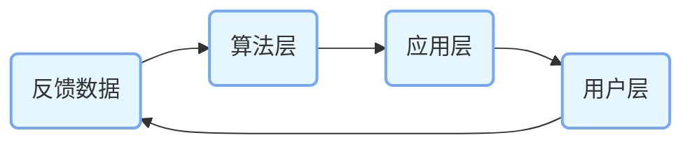

# 构建智能企业资源规划(ERP)系统：AI深度集成与实时优化

> 关键词：智能ERP系统、AI深度集成、实时优化、企业资源规划、数据驱动决策、机器学习算法、系统架构

> 摘要：本文聚焦于构建智能企业资源规划（ERP）系统，深入探讨了AI深度集成与实时优化的相关技术和方法。首先介绍了智能ERP系统的背景，包括目的、预期读者、文档结构和术语表。接着阐述了核心概念及其联系，通过文本示意图和Mermaid流程图进行清晰展示。详细讲解了核心算法原理和具体操作步骤，并结合Python源代码进行说明。给出了相关的数学模型和公式，并举例进行解释。通过项目实战展示了代码的实际案例和详细解读。分析了智能ERP系统的实际应用场景，推荐了学习资源、开发工具框架和相关论文著作。最后总结了未来发展趋势与挑战，提供了常见问题解答和扩展阅读参考资料，旨在为企业构建智能ERP系统提供全面且深入的技术指导。

## 1. 背景介绍 
### 1.1 目的和范围
企业资源规划（ERP）系统作为企业管理的核心工具，在整合企业资源、提高运营效率方面发挥着重要作用。然而，传统的ERP系统在面对复杂多变的市场环境和海量数据时，往往显得力不从心。本文的目的在于探讨如何将人工智能（AI）技术深度集成到ERP系统中，实现系统的实时优化，从而提升企业的决策能力和竞争力。

本文的范围涵盖了智能ERP系统的核心概念、算法原理、数学模型、项目实战、应用场景以及相关的工具和资源推荐等方面，旨在为企业和技术人员提供全面的技术指导和实践参考。

### 1.2 预期读者
本文的预期读者包括企业管理人员、ERP系统开发人员、AI技术研究人员以及对智能企业管理感兴趣的相关人士。企业管理人员可以通过本文了解智能ERP系统的优势和应用场景，为企业的数字化转型提供决策依据；ERP系统开发人员可以从中获取技术实现的思路和方法；AI技术研究人员可以探索AI在企业管理领域的应用前景；而对智能企业管理感兴趣的人士则可以通过本文了解该领域的最新发展动态。

### 1.3 文档结构概述
本文共分为十个部分，具体结构如下：
1. **背景介绍**：阐述文章的目的、范围、预期读者、文档结构和术语表。
2. **核心概念与联系**：介绍智能ERP系统的核心概念，通过文本示意图和Mermaid流程图展示其原理和架构。
3. **核心算法原理 & 具体操作步骤**：详细讲解核心算法原理，并使用Python源代码进行说明。
4. **数学模型和公式 & 详细讲解 & 举例说明**：给出相关的数学模型和公式，并举例进行解释。
5. **项目实战：代码实际案例和详细解释说明**：通过项目实战展示代码的实际案例和详细解读。
6. **实际应用场景**：分析智能ERP系统的实际应用场景。
7. **工具和资源推荐**：推荐学习资源、开发工具框架和相关论文著作。
8. **总结：未来发展趋势与挑战**：总结智能ERP系统的未来发展趋势和面临的挑战。
9. **附录：常见问题与解答**：提供常见问题的解答。
10. **扩展阅读 & 参考资料**：列出扩展阅读的资料和参考来源。

### 1.4 术语表
#### 1.4.1 核心术语定义
- **企业资源规划（ERP）系统**：是一种集成化的管理信息系统，用于整合企业的财务、采购、生产、销售、库存等核心业务流程，实现企业资源的优化配置和高效管理。
- **人工智能（AI）**：是一门研究如何使计算机系统能够模拟人类智能的学科，包括机器学习、深度学习、自然语言处理等技术。
- **机器学习（ML）**：是AI的一个重要分支，通过让计算机从数据中学习模式和规律，从而实现预测和决策。
- **实时优化**：是指在系统运行过程中，根据实时数据和业务需求，动态调整系统的参数和策略，以实现系统性能的最优。

#### 1.4.2 相关概念解释
- **数据驱动决策**：是指基于数据分析和挖掘的结果，为企业的决策提供支持和依据。
- **智能预测**：是指利用AI技术对企业的销售、库存、生产等业务指标进行预测，帮助企业提前做好规划和准备。
- **流程自动化**：是指利用AI和自动化技术，实现企业业务流程的自动化执行，提高工作效率和质量。

#### 1.4.3 缩略词列表
- **ERP**：Enterprise Resource Planning（企业资源规划）
- **AI**：Artificial Intelligence（人工智能）
- **ML**：Machine Learning（机器学习）
- **NLP**：Natural Language Processing（自然语言处理）
- **DL**：Deep Learning（深度学习）

## 2. 核心概念与联系 
### 核心概念原理
智能ERP系统是将AI技术深度集成到传统ERP系统中，实现系统的智能化和实时优化。其核心原理是通过对企业内外部数据的收集、分析和挖掘，利用机器学习和深度学习算法，为企业提供智能预测、智能决策和流程自动化等功能。

具体来说，智能ERP系统可以实现以下几个方面的功能：
1. **智能预测**：利用历史数据和实时数据，对企业的销售、库存、生产等业务指标进行预测，帮助企业提前做好规划和准备。
2. **智能决策**：根据数据分析和挖掘的结果，为企业的决策提供支持和依据，帮助企业做出更明智的决策。
3. **流程自动化**：利用AI和自动化技术，实现企业业务流程的自动化执行，提高工作效率和质量。
4. **实时优化**：在系统运行过程中，根据实时数据和业务需求，动态调整系统的参数和策略，以实现系统性能的最优。

### 架构的文本示意图
智能ERP系统的架构主要包括数据层、算法层、应用层和用户层四个层次，具体如下：
1. **数据层**：负责收集、存储和管理企业内外部的数据，包括财务数据、采购数据、生产数据、销售数据、库存数据等。
2. **算法层**：利用机器学习和深度学习算法，对数据层的数据进行分析和挖掘，实现智能预测、智能决策和流程自动化等功能。
3. **应用层**：将算法层的结果应用到企业的各个业务流程中，实现智能ERP系统的各项功能，如智能采购、智能生产、智能销售等。
4. **用户层**：为企业的管理人员、业务人员和技术人员提供用户界面，方便他们使用智能ERP系统的各项功能。

### Mermaid流程图

该流程图展示了智能ERP系统的架构，数据层收集的数据经过算法层的处理后，应用到应用层的各个业务流程中，最终为用户层提供服务。同时，用户层的反馈数据又可以回到数据层，形成一个闭环的系统。

## 3. 核心算法原理 & 具体操作步骤 
### 核心算法原理
智能ERP系统中常用的核心算法包括机器学习算法和深度学习算法，下面分别进行介绍。

#### 机器学习算法
- **线性回归**：是一种用于预测连续数值的机器学习算法，通过建立自变量和因变量之间的线性关系，进行预测。其数学模型为：$y = \beta_0 + \beta_1x_1 + \beta_2x_2 + \cdots + \beta_nx_n + \epsilon$，其中 $y$ 是因变量，$x_1, x_2, \cdots, x_n$ 是自变量，$\beta_0, \beta_1, \beta_2, \cdots, \beta_n$ 是回归系数，$\epsilon$ 是误差项。
- **逻辑回归**：是一种用于分类的机器学习算法，通过建立自变量和因变量之间的逻辑关系，进行分类预测。其数学模型为：$P(y = 1|x) = \frac{1}{1 + e^{-(\beta_0 + \beta_1x_1 + \beta_2x_2 + \cdots + \beta_nx_n)}}$，其中 $P(y = 1|x)$ 是因变量为1的概率，$x_1, x_2, \cdots, x_n$ 是自变量，$\beta_0, \beta_1, \beta_2, \cdots, \beta_n$ 是回归系数。
- **决策树**：是一种基于树结构进行决策的机器学习算法，通过对数据进行划分，构建决策树模型，进行分类和预测。决策树的每个内部节点是一个属性上的测试，每个分支是一个测试输出，每个叶节点是一个类别或值。
- **随机森林**：是一种集成学习算法，通过构建多个决策树模型，对数据进行分类和预测。随机森林通过随机选择特征和样本，减少了决策树的过拟合问题，提高了模型的泛化能力。

#### 深度学习算法
- **人工神经网络（ANN）**：是一种模仿人类神经系统的计算模型，由大量的神经元组成。人工神经网络通过对数据的学习和训练，自动提取数据的特征和模式，进行分类和预测。
- **卷积神经网络（CNN）**：是一种专门用于处理具有网格结构数据的深度学习算法，如图像、音频等。卷积神经网络通过卷积层、池化层和全连接层等结构，自动提取数据的特征和模式，进行分类和预测。
- **循环神经网络（RNN）**：是一种专门用于处理序列数据的深度学习算法，如时间序列数据、文本数据等。循环神经网络通过引入循环结构，能够处理序列数据中的上下文信息，进行分类和预测。

### 具体操作步骤
下面以线性回归算法为例，介绍智能ERP系统中核心算法的具体操作步骤。

#### 步骤1：数据收集和预处理
首先，需要收集企业的相关数据，如销售数据、库存数据、生产数据等。然后，对数据进行预处理，包括数据清洗、数据归一化、数据划分等操作。

```python
import pandas as pd
from sklearn.preprocessing import StandardScaler
from sklearn.model_selection import train_test_split

# 读取数据
data = pd.read_csv('sales_data.csv')

# 数据清洗
data = data.dropna()

# 特征和标签分离
X = data.drop('sales', axis=1)
y = data['sales']

# 数据归一化
scaler = StandardScaler()
X = scaler.fit_transform(X)

# 数据划分
X_train, X_test, y_train, y_test = train_test_split(X, y, test_size=0.2, random_state=42)
```

#### 步骤2：模型训练
使用训练数据对线性回归模型进行训练。

```python
from sklearn.linear_model import LinearRegression

# 创建线性回归模型
model = LinearRegression()

# 模型训练
model.fit(X_train, y_train)
```

#### 步骤3：模型评估
使用测试数据对训练好的模型进行评估，计算模型的评估指标，如均方误差（MSE）、均方根误差（RMSE）、决定系数（$R^2$）等。

```python
from sklearn.metrics import mean_squared_error, r2_score

# 模型预测
y_pred = model.predict(X_test)

# 计算评估指标
mse = mean_squared_error(y_test, y_pred)
rmse = mse ** 0.5
r2 = r2_score(y_test, y_pred)

print(f'MSE: {mse}')
print(f'RMSE: {rmse}')
print(f'R^2: {r2}')
```

#### 步骤4：模型应用
将训练好的模型应用到实际业务中，进行销售预测等操作。

```python
# 新数据预测
new_data = pd.read_csv('new_sales_data.csv')
new_data = scaler.transform(new_data)
new_pred = model.predict(new_data)
print(f'New sales prediction: {new_pred}')
```

## 4. 数学模型和公式 & 详细讲解 & 举例说明 
### 线性回归模型
#### 数学模型和公式
线性回归模型的数学模型为：$y = \beta_0 + \beta_1x_1 + \beta_2x_2 + \cdots + \beta_nx_n + \epsilon$，其中 $y$ 是因变量，$x_1, x_2, \cdots, x_n$ 是自变量，$\beta_0, \beta_1, \beta_2, \cdots, \beta_n$ 是回归系数，$\epsilon$ 是误差项。

线性回归模型的目标是找到一组最优的回归系数 $\beta_0, \beta_1, \beta_2, \cdots, \beta_n$，使得预测值 $\hat{y}$ 与真实值 $y$ 之间的误差最小。常用的误差度量方法是均方误差（MSE），其公式为：$MSE = \frac{1}{m}\sum_{i=1}^{m}(y_i - \hat{y}_i)^2$，其中 $m$ 是样本数量，$y_i$ 是第 $i$ 个样本的真实值，$\hat{y}_i$ 是第 $i$ 个样本的预测值。

#### 详细讲解
线性回归模型通过最小化均方误差来求解回归系数。可以使用最小二乘法来求解，其公式为：$\hat{\beta} = (X^TX)^{-1}X^Ty$，其中 $X$ 是自变量矩阵，$y$ 是因变量向量，$\hat{\beta}$ 是回归系数向量。

#### 举例说明
假设我们有一组销售数据，包含产品价格 $x_1$、广告投入 $x_2$ 和销售额 $y$。我们可以使用线性回归模型来预测销售额。

```python
import numpy as np

# 自变量矩阵
X = np.array([[10, 20], [15, 30], [20, 40], [25, 50]])

# 因变量向量
y = np.array([100, 150, 200, 250])

# 求解回归系数
X_b = np.c_[np.ones((X.shape[0], 1)), X]
beta_hat = np.linalg.inv(X_b.T.dot(X_b)).dot(X_b.T).dot(y)

print(f'Regression coefficients: {beta_hat}')
```

### 逻辑回归模型
#### 数学模型和公式
逻辑回归模型的数学模型为：$P(y = 1|x) = \frac{1}{1 + e^{-(\beta_0 + \beta_1x_1 + \beta_2x_2 + \cdots + \beta_nx_n)}}$，其中 $P(y = 1|x)$ 是因变量为1的概率，$x_1, x_2, \cdots, x_n$ 是自变量，$\beta_0, \beta_1, \beta_2, \cdots, \beta_n$ 是回归系数。

逻辑回归模型的目标是找到一组最优的回归系数 $\beta_0, \beta_1, \beta_2, \cdots, \beta_n$，使得预测的概率 $P(y = 1|x)$ 与真实的标签 $y$ 之间的误差最小。常用的误差度量方法是对数损失函数，其公式为：$J(\beta) = -\frac{1}{m}\sum_{i=1}^{m}[y_i\log(P(y_i = 1|x_i)) + (1 - y_i)\log(1 - P(y_i = 1|x_i))]$，其中 $m$ 是样本数量，$y_i$ 是第 $i$ 个样本的真实标签，$P(y_i = 1|x_i)$ 是第 $i$ 个样本的预测概率。

#### 详细讲解
逻辑回归模型通过最小化对数损失函数来求解回归系数。可以使用梯度下降法来求解，其公式为：$\beta_{j+1} = \beta_j - \alpha\frac{\partial J(\beta)}{\partial \beta_j}$，其中 $\beta_j$ 是第 $j$ 次迭代的回归系数，$\alpha$ 是学习率，$\frac{\partial J(\beta)}{\partial \beta_j}$ 是对数损失函数对回归系数 $\beta_j$ 的偏导数。

#### 举例说明
假设我们有一组客户购买数据，包含客户年龄 $x_1$、收入 $x_2$ 和是否购买 $y$。我们可以使用逻辑回归模型来预测客户是否购买。

```python
from sklearn.linear_model import LogisticRegression

# 自变量矩阵
X = np.array([[20, 5000], [30, 8000], [40, 12000], [50, 15000]])

# 因变量向量
y = np.array([0, 0, 1, 1])

# 创建逻辑回归模型
model = LogisticRegression()

# 模型训练
model.fit(X, y)

# 新数据预测
new_data = np.array([[25, 6000], [45, 13000]])
new_pred = model.predict(new_data)

print(f'New purchase prediction: {new_pred}')
```

## 5. 项目实战：代码实际案例和详细解释说明 
### 5.1  开发环境搭建
#### 安装Python
首先，需要安装Python编程语言。可以从Python官方网站（https://www.python.org/downloads/）下载适合自己操作系统的Python版本，并按照安装向导进行安装。

#### 安装必要的库
在Python环境中，需要安装一些必要的库，如NumPy、Pandas、Scikit-learn、TensorFlow等。可以使用pip命令进行安装，例如：
```bash
pip install numpy pandas scikit-learn tensorflow
```

### 5.2  源代码详细实现和代码解读
#### 项目需求
我们要构建一个智能ERP系统，用于预测企业的销售额。系统将使用历史销售数据和相关的特征数据，如产品价格、广告投入等，训练一个线性回归模型，并使用该模型进行销售额预测。

#### 源代码实现
```python
import pandas as pd
from sklearn.preprocessing import StandardScaler
from sklearn.model_selection import train_test_split
from sklearn.linear_model import LinearRegression
from sklearn.metrics import mean_squared_error, r2_score

# 步骤1：数据收集和预处理
# 读取数据
data = pd.read_csv('sales_data.csv')

# 数据清洗
data = data.dropna()

# 特征和标签分离
X = data.drop('sales', axis=1)
y = data['sales']

# 数据归一化
scaler = StandardScaler()
X = scaler.fit_transform(X)

# 数据划分
X_train, X_test, y_train, y_test = train_test_split(X, y, test_size=0.2, random_state=42)

# 步骤2：模型训练
# 创建线性回归模型
model = LinearRegression()

# 模型训练
model.fit(X_train, y_train)

# 步骤3：模型评估
# 模型预测
y_pred = model.predict(X_test)

# 计算评估指标
mse = mean_squared_error(y_test, y_pred)
rmse = mse ** 0.5
r2 = r2_score(y_test, y_pred)

print(f'MSE: {mse}')
print(f'RMSE: {rmse}')
print(f'R^2: {r2}')

# 步骤4：模型应用
# 新数据预测
new_data = pd.read_csv('new_sales_data.csv')
new_data = scaler.transform(new_data)
new_pred = model.predict(new_data)
print(f'New sales prediction: {new_pred}')
```

#### 代码解读
1. **数据收集和预处理**：使用Pandas库读取销售数据，并进行数据清洗和特征标签分离。使用StandardScaler类对数据进行归一化处理，以提高模型的训练效果。使用train_test_split函数将数据划分为训练集和测试集。
2. **模型训练**：使用LinearRegression类创建线性回归模型，并使用训练集数据对模型进行训练。
3. **模型评估**：使用训练好的模型对测试集数据进行预测，并计算均方误差（MSE）、均方根误差（RMSE）和决定系数（$R^2$）等评估指标，以评估模型的性能。
4. **模型应用**：读取新的销售数据，对其进行归一化处理，并使用训练好的模型进行销售额预测。

### 5.3  代码解读与分析
#### 优点
- **简单易懂**：线性回归模型是一种简单易懂的机器学习模型，易于实现和解释。
- **可解释性强**：线性回归模型的回归系数可以解释自变量对因变量的影响程度，具有较强的可解释性。
- **计算效率高**：线性回归模型的训练和预测速度较快，适用于大规模数据的处理。

#### 缺点
- **线性假设**：线性回归模型假设自变量和因变量之间存在线性关系，对于非线性关系的数据，模型的性能可能较差。
- **容易过拟合**：线性回归模型在处理高维数据时，容易出现过拟合问题，需要进行正则化处理。

#### 改进建议
- **使用非线性模型**：对于非线性关系的数据，可以使用非线性模型，如决策树、随机森林、神经网络等。
- **正则化处理**：对于高维数据，可以使用正则化方法，如L1正则化、L2正则化等，以避免过拟合问题。

## 6. 实际应用场景 
### 智能采购
智能ERP系统可以利用AI技术对企业的采购需求进行预测，根据历史采购数据、销售数据、库存数据等，预测未来的采购量和采购时间。同时，系统可以自动筛选供应商，比较不同供应商的价格、质量、交货期等信息，选择最优的供应商进行采购。此外，系统还可以实现采购流程的自动化，如自动生成采购订单、自动审批采购申请等，提高采购效率和质量。

### 智能生产
智能ERP系统可以对企业的生产计划进行优化，根据销售预测、库存情况、设备产能等信息，合理安排生产任务，提高生产效率和资源利用率。系统可以实时监控生产过程，及时发现生产中的问题并进行预警和处理。同时，系统可以利用AI技术对生产数据进行分析和挖掘，优化生产工艺和流程，提高产品质量和生产效率。

### 智能销售
智能ERP系统可以对企业的销售数据进行分析和挖掘，了解客户的需求和偏好，为客户提供个性化的销售服务。系统可以利用AI技术对销售机会进行预测，提前做好销售准备，提高销售成功率。同时，系统可以实现销售流程的自动化，如自动生成销售订单、自动跟进客户等，提高销售效率和客户满意度。

### 智能库存管理
智能ERP系统可以对企业的库存进行实时监控和管理，根据销售预测、采购计划、生产进度等信息，合理控制库存水平，避免库存积压和缺货现象的发生。系统可以利用AI技术对库存数据进行分析和挖掘，优化库存策略，提高库存周转率和资金利用率。

## 7. 工具和资源推荐
### 7.1 学习资源推荐
#### 7.1.1 书籍推荐
- 《Python机器学习》：这本书详细介绍了Python在机器学习领域的应用，包括各种机器学习算法的原理和实现，以及如何使用Python进行数据处理、模型训练和评估等。
- 《深度学习》：这本书是深度学习领域的经典著作，由深度学习领域的三位先驱Ian Goodfellow、Yoshua Bengio和Aaron Courville共同撰写。书中介绍了深度学习的基本概念、算法和应用，是深度学习领域的必读之书。
- 《企业资源规划（ERP）原理与应用》：这本书系统地介绍了ERP系统的原理、功能和应用，包括ERP系统的发展历程、核心模块、实施方法等，是学习ERP系统的经典教材。

#### 7.1.2 在线课程
- Coursera平台上的“机器学习”课程：由斯坦福大学教授Andrew Ng主讲，是机器学习领域的经典在线课程。课程内容涵盖了机器学习的基本概念、算法和应用，通过大量的案例和实践项目，帮助学员掌握机器学习的核心知识和技能。
- edX平台上的“深度学习基础”课程：由微软公司的深度学习专家主讲，课程内容涵盖了深度学习的基本概念、算法和应用，包括神经网络、卷积神经网络、循环神经网络等。通过实践项目，帮助学员掌握深度学习的核心知识和技能。
- 中国大学MOOC平台上的“企业资源规划（ERP）原理与应用”课程：由国内知名高校的教授主讲，课程内容涵盖了ERP系统的原理、功能和应用，通过实际案例和实践项目，帮助学员掌握ERP系统的核心知识和技能。

#### 7.1.3 技术博客和网站
- Medium：是一个知名的技术博客平台，上面有很多关于机器学习、深度学习、ERP系统等领域的优秀文章和教程。
- Towards Data Science：是一个专注于数据科学和机器学习的技术博客，上面有很多关于机器学习算法、数据分析、数据可视化等方面的文章和教程。
- ERPNext博客：是ERPNext官方博客，上面有很多关于ERP系统的应用案例、技术文章和行业动态等内容。

### 7.2 开发工具框架推荐
#### 7.2.1 IDE和编辑器
- PyCharm：是一款专门用于Python开发的集成开发环境（IDE），具有代码编辑、调试、版本控制等功能，是Python开发的首选工具之一。
- Jupyter Notebook：是一个交互式的开发环境，支持Python、R等多种编程语言。它可以将代码、文本、图像等内容整合在一起，方便进行数据分析和模型训练。
- Visual Studio Code：是一款轻量级的代码编辑器，支持多种编程语言和插件。它具有代码高亮、自动补全、调试等功能，是开发人员常用的工具之一。

#### 7.2.2 调试和性能分析工具
- Py-Spy：是一个用于Python代码性能分析的工具，它可以实时监控Python程序的CPU使用率、内存使用率等指标，帮助开发人员找出程序中的性能瓶颈。
- cProfile：是Python标准库中的一个性能分析工具，它可以对Python程序进行详细的性能分析，包括函数调用次数、函数执行时间等信息。
- PDB：是Python标准库中的一个调试工具，它可以对Python程序进行单步调试、断点调试等操作，帮助开发人员找出程序中的错误。

#### 7.2.3 相关框架和库
- Scikit-learn：是一个用于机器学习的Python库，它提供了丰富的机器学习算法和工具，如分类、回归、聚类、降维等。
- TensorFlow：是一个开源的深度学习框架，由Google开发。它提供了丰富的深度学习算法和工具，如神经网络、卷积神经网络、循环神经网络等。
- PyTorch：是一个开源的深度学习框架，由Facebook开发。它提供了动态图机制，使得模型的构建和调试更加方便。

### 7.3 相关论文著作推荐
#### 7.3.1 经典论文
- “Gradient-based learning applied to document recognition”：这篇论文是深度学习领域的经典论文之一，由Yann LeCun等人撰写。论文中提出了卷积神经网络（CNN）的概念，并将其应用于手写数字识别任务，取得了很好的效果。
- “Long Short-Term Memory”：这篇论文是循环神经网络（RNN）领域的经典论文之一，由Sepp Hochreiter和Jürgen Schmidhuber撰写。论文中提出了长短期记忆网络（LSTM）的概念，解决了传统RNN的梯度消失问题。
- “ERP systems and firm performance: A review of the literature”：这篇论文对ERP系统与企业绩效之间的关系进行了综述，分析了ERP系统对企业绩效的影响因素和作用机制。

#### 7.3.2 最新研究成果
- “Artificial Intelligence in Enterprise Resource Planning: A Systematic Literature Review”：这篇论文对人工智能在ERP系统中的应用进行了系统的文献综述，分析了人工智能技术在ERP系统中的应用现状、挑战和未来发展趋势。
- “Deep Learning for ERP System Optimization: A Case Study”：这篇论文通过一个实际案例，探讨了深度学习技术在ERP系统优化中的应用，展示了深度学习技术在提高ERP系统性能和效率方面的潜力。

#### 7.3.3 应用案例分析
- “Implementing an AI-Enabled ERP System: A Case Study of a Manufacturing Company”：这篇论文通过一个制造企业的实际案例，介绍了如何实施一个基于人工智能的ERP系统，包括系统的架构设计、功能模块、实施过程和效果评估等方面。
- “Leveraging AI in ERP for Supply Chain Optimization: A Case Study”：这篇论文通过一个供应链企业的实际案例，探讨了如何利用人工智能技术在ERP系统中实现供应链优化，包括需求预测、库存管理、物流调度等方面。

## 8. 总结：未来发展趋势与挑战
### 未来发展趋势
- **AI与ERP的深度融合**：未来，AI技术将与ERP系统进行更深度的融合，实现系统的智能化和自动化。例如，利用AI技术实现智能预测、智能决策、流程自动化等功能，提高企业的决策能力和运营效率。
- **实时数据分析和优化**：随着企业数据量的不断增加，实时数据分析和优化将成为智能ERP系统的重要发展趋势。通过实时收集和分析企业内外部数据，系统可以及时发现问题并进行优化，提高企业的响应速度和竞争力。
- **云原生和微服务架构**：云原生和微服务架构将成为智能ERP系统的主流架构。云原生架构可以提供更高的灵活性和可扩展性，微服务架构可以将系统拆分为多个独立的服务，提高系统的开发效率和维护性。
- **行业定制化**：不同行业的企业对ERP系统的需求存在差异，未来智能ERP系统将更加注重行业定制化。针对不同行业的特点和需求，开发出更加适合行业应用的ERP系统，提高系统的实用性和针对性。

### 挑战
- **数据质量和安全问题**：智能ERP系统需要大量的高质量数据来支持其智能化和自动化功能。然而，企业的数据质量往往存在问题，如数据缺失、数据错误、数据不一致等。此外，数据安全也是一个重要的问题，企业需要采取有效的措施来保护数据的安全和隐私。
- **AI技术的应用难度**：AI技术虽然具有很大的潜力，但在实际应用中也存在一定的难度。例如，AI算法的选择和调优、模型的训练和评估、数据的预处理和特征工程等都需要专业的知识和技能。此外，AI技术的可解释性也是一个问题，企业需要了解AI模型的决策过程和依据，以便做出合理的决策。
- **人员培训和转型**：智能ERP系统的实施需要企业员工具备一定的技术和管理能力。然而，目前企业员工的技术水平和管理能力往往不能满足智能ERP系统的需求。因此，企业需要加强员工的培训和转型，提高员工的技术水平和管理能力。
- **系统集成和兼容性问题**：企业在实施智能ERP系统时，往往需要与现有的其他系统进行集成，如CRM系统、SCM系统等。然而，不同系统之间的集成和兼容性问题往往是一个挑战，企业需要解决系统之间的数据交互、接口标准等问题。

## 9. 附录：常见问题与解答
### 1. 智能ERP系统与传统ERP系统有什么区别？
智能ERP系统是将AI技术深度集成到传统ERP系统中，实现系统的智能化和实时优化。与传统ERP系统相比，智能ERP系统具有以下优势：
- **智能预测**：利用AI技术对企业的销售、库存、生产等业务指标进行预测，帮助企业提前做好规划和准备。
- **智能决策**：根据数据分析和挖掘的结果，为企业的决策提供支持和依据，帮助企业做出更明智的决策。
- **流程自动化**：利用AI和自动化技术，实现企业业务流程的自动化执行，提高工作效率和质量。
- **实时优化**：在系统运行过程中，根据实时数据和业务需求，动态调整系统的参数和策略，以实现系统性能的最优。

### 2. 智能ERP系统需要哪些技术支持？
智能ERP系统需要以下技术支持：
- **人工智能技术**：包括机器学习、深度学习、自然语言处理等技术，用于实现智能预测、智能决策、流程自动化等功能。
- **大数据技术**：用于收集、存储和管理企业内外部的海量数据，为AI技术提供数据支持。
- **云计算技术**：用于提供计算资源和存储资源，支持智能ERP系统的运行和扩展。
- **物联网技术**：用于实时采集企业的生产设备、物流车辆等数据，为智能ERP系统提供实时数据支持。

### 3. 智能ERP系统的实施难度大吗？
智能ERP系统的实施难度相对较大，主要体现在以下几个方面：
- **技术难度**：智能ERP系统需要涉及到人工智能、大数据、云计算等多种技术，对企业的技术团队要求较高。
- **数据质量**：智能ERP系统需要大量的高质量数据来支持其智能化和自动化功能，企业需要解决数据质量问题，如数据缺失、数据错误、数据不一致等。
- **人员培训**：智能ERP系统的实施需要企业员工具备一定的技术和管理能力，企业需要加强员工的培训和转型。
- **系统集成**：智能ERP系统需要与企业现有的其他系统进行集成，如CRM系统、SCM系统等，企业需要解决系统之间的数据交互、接口标准等问题。

### 4. 智能ERP系统的投资回报率如何？
智能ERP系统的投资回报率取决于多个因素，如企业的规模、行业、业务需求、实施效果等。一般来说，智能ERP系统可以为企业带来以下几个方面的收益：
- **提高运营效率**：通过实现流程自动化和实时优化，提高企业的运营效率，降低运营成本。
- **提升决策能力**：通过智能预测和智能决策，帮助企业做出更明智的决策，提高企业的竞争力。
- **增强客户满意度**：通过提供个性化的销售服务和及时的客户响应，增强客户满意度，提高客户忠诚度。
- **拓展业务渠道**：通过与物联网、移动互联网等技术的结合，拓展企业的业务渠道，增加企业的收入。

总体来说，智能ERP系统的投资回报率较高，但企业需要根据自身的实际情况进行评估和决策。

## 10. 扩展阅读 & 参考资料
### 扩展阅读
- 《智能商业》：这本书由阿里巴巴总参谋长曾鸣所著，介绍了智能商业的发展趋势和商业模式，对于理解智能ERP系统在智能商业中的应用具有一定的参考价值。
- 《工业4.0：最后一次工业革命》：这本书介绍了工业4.0的概念、技术和应用，对于了解智能ERP系统在工业4.0中的作用具有一定的帮助。
- 《数字化转型与企业重构》：这本书探讨了企业数字化转型的策略和方法，对于企业实施智能ERP系统提供了一些思路和建议。

### 参考资料
- 相关的学术论文和研究报告，如IEEE Transactions on Industrial Informatics、ACM Transactions on Management Information Systems等期刊上的论文。
- 各大咨询公司的研究报告，如Gartner、IDC等公司的报告。
- 智能ERP系统供应商的官方网站和文档，如SAP、Oracle、Microsoft等公司的相关资料。