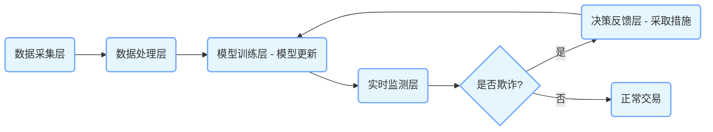

# 构建智能企业风控系统：实时交易监控与欺诈检测的AI增强

> 关键词：智能企业风控系统、实时交易监控、欺诈检测、AI增强、机器学习算法

> 摘要：本文围绕构建智能企业风控系统，聚焦于实时交易监控与欺诈检测的AI增强技术展开。首先介绍了该系统的背景，包括目的、预期读者、文档结构和相关术语。接着阐述了核心概念及其联系，通过文本示意图和Mermaid流程图展示架构。详细讲解了核心算法原理及具体操作步骤，结合Python源代码进行说明。引入数学模型和公式，并举例说明其应用。通过项目实战，从开发环境搭建到源代码实现与解读，深入剖析系统构建过程。探讨了实际应用场景，推荐了相关工具和资源，最后总结了未来发展趋势与挑战，解答常见问题并提供扩展阅读和参考资料，旨在为企业构建高效的风控系统提供全面的技术指导。

## 1. 背景介绍 
### 1.1 目的和范围
在当今数字化时代，企业面临着日益复杂的交易环境和层出不穷的欺诈风险。构建智能企业风控系统，实现实时交易监控与欺诈检测的AI增强具有至关重要的意义。本系统的主要目的是帮助企业及时发现并防范潜在的欺诈交易，减少经济损失，保障企业的资金安全和业务的稳定运行。

本系统的范围涵盖了多种交易场景，包括但不限于线上支付、金融借贷、电子商务交易等。通过对海量交易数据的实时分析，利用先进的AI技术，系统能够识别出异常交易模式，及时发出警报，为企业提供决策支持。

### 1.2 预期读者
本文的预期读者主要包括企业的风险管理专家、数据科学家、软件开发工程师以及对企业风控系统感兴趣的技术爱好者。风险管理专家可以从本文中获取关于构建智能风控系统的整体思路和技术方案，为企业的风险管理决策提供参考；数据科学家可以深入了解核心算法原理和数学模型，用于优化系统的性能；软件开发工程师可以根据文中的代码实现和详细解释，进行系统的开发和部署；技术爱好者则可以通过本文了解智能企业风控系统的前沿技术和应用场景。

### 1.3 文档结构概述
本文将按照以下结构进行详细阐述：
1. **背景介绍**：介绍系统的目的、范围、预期读者和文档结构，同时给出相关术语的定义和解释。
2. **核心概念与联系**：阐述实时交易监控、欺诈检测和AI增强等核心概念，通过文本示意图和Mermaid流程图展示系统的架构。
3. **核心算法原理 & 具体操作步骤**：详细讲解用于欺诈检测的核心算法原理，结合Python源代码说明具体的操作步骤。
4. **数学模型和公式 & 详细讲解 & 举例说明**：引入相关的数学模型和公式，对其进行详细讲解，并通过具体例子说明其应用。
5. **项目实战：代码实际案例和详细解释说明**：从开发环境搭建开始，逐步实现系统的源代码，并对代码进行详细解读和分析。
6. **实际应用场景**：探讨智能企业风控系统在不同行业和领域的实际应用场景。
7. **工具和资源推荐**：推荐学习资源、开发工具框架和相关论文著作。
8. **总结：未来发展趋势与挑战**：总结智能企业风控系统的未来发展趋势，分析面临的挑战。
9. **附录：常见问题与解答**：解答读者在构建和使用系统过程中可能遇到的常见问题。
10. **扩展阅读 & 参考资料**：提供相关的扩展阅读材料和参考资料，方便读者进一步深入学习。

### 1.4 术语表
#### 1.4.1 核心术语定义
- **智能企业风控系统**：利用先进的信息技术和AI算法，对企业的交易活动进行实时监控和风险评估，以防范欺诈和其他风险的系统。
- **实时交易监控**：对企业的交易数据进行实时采集、分析和处理，及时发现异常交易行为的过程。
- **欺诈检测**：通过对交易数据的分析和挖掘，识别出潜在的欺诈交易的技术和方法。
- **AI增强**：利用人工智能技术，如机器学习、深度学习等，提高系统的性能和准确性，增强欺诈检测的能力。

#### 1.4.2 相关概念解释
- **机器学习**：是一门多领域交叉学科，涉及概率论、统计学、逼近论、凸分析、算法复杂度理论等多门学科。它专门研究计算机怎样模拟或实现人类的学习行为，以获取新的知识或技能，重新组织已有的知识结构使之不断改善自身的性能。在本系统中，机器学习算法用于对交易数据进行建模和分析，以识别欺诈模式。
- **深度学习**：是机器学习的一个分支领域，它是一种基于对数据进行表征学习的方法。深度学习通过构建具有很多层的神经网络模型，自动从大量数据中学习到复杂的模式和特征。在欺诈检测中，深度学习模型可以处理高维、复杂的数据，提高检测的准确性。

#### 1.4.3 缩略词列表
- **AI**：Artificial Intelligence，人工智能
- **ML**：Machine Learning，机器学习
- **DL**：Deep Learning，深度学习
- **PCA**：Principal Component Analysis，主成分分析
- **SVM**：Support Vector Machine，支持向量机
- **LSTM**：Long Short-Term Memory，长短期记忆网络

## 2. 核心概念与联系 
### 核心概念原理
#### 实时交易监控
实时交易监控是智能企业风控系统的基础环节。其原理是通过数据采集模块，实时获取企业交易过程中的各种数据，包括交易时间、交易金额、交易地点、交易对象等。这些数据被实时传输到数据分析模块，利用预设的规则和算法进行实时分析。例如，可以设置交易金额的阈值，如果某笔交易的金额超过了该阈值，则将其标记为异常交易。同时，还可以通过分析交易的时间分布、地点分布等特征，发现异常的交易模式。

#### 欺诈检测
欺诈检测是在实时交易监控的基础上，进一步对异常交易进行深入分析，以确定其是否为欺诈交易。欺诈检测主要基于机器学习和深度学习算法，通过对历史交易数据的学习和训练，建立欺诈交易的模型。当新的交易数据到来时，将其输入到模型中进行预测，如果预测结果表明该交易为欺诈交易的可能性较大，则发出警报。常见的欺诈检测算法包括决策树、支持向量机、神经网络等。

#### AI增强
AI增强是指利用人工智能技术，如机器学习、深度学习等，提高实时交易监控和欺诈检测的性能和准确性。通过AI技术，可以自动从大量的交易数据中学习到复杂的模式和特征，而不需要人工手动定义规则。例如，深度学习模型可以处理高维、复杂的数据，自动提取数据中的特征，从而提高欺诈检测的准确率。同时，AI技术还可以实现模型的自动更新和优化，以适应不断变化的欺诈手段。

### 架构的文本示意图
智能企业风控系统主要由数据采集层、数据处理层、模型训练层、实时监测层和决策反馈层组成。

数据采集层负责实时收集企业的交易数据，包括来自各种交易渠道的数据，如线上支付平台、金融机构的交易系统等。

数据处理层对采集到的数据进行清洗、预处理和特征提取。清洗数据是为了去除噪声和异常值，预处理包括数据的归一化、编码等操作，特征提取则是从原始数据中提取出对欺诈检测有意义的特征。

模型训练层利用处理后的数据对机器学习和深度学习模型进行训练。常见的模型包括决策树、支持向量机、神经网络等。训练好的模型将被保存下来，用于实时监测。

实时监测层将新的交易数据输入到训练好的模型中进行实时预测。如果预测结果表明该交易为欺诈交易的可能性较大，则将其标记为异常交易，并将相关信息发送到决策反馈层。

决策反馈层根据实时监测层的结果，做出相应的决策。如果确定为欺诈交易，则可以采取冻结账户、拒绝交易等措施。同时，决策反馈层还可以将决策结果反馈给模型训练层，用于模型的更新和优化。

### Mermaid流程图


该流程图展示了智能企业风控系统的整体流程。首先，数据采集层收集交易数据，然后将其传输到数据处理层进行处理。处理后的数据用于模型训练层的模型训练。训练好的模型在实时监测层对新的交易数据进行预测。如果预测结果表明该交易为欺诈交易，则决策反馈层采取相应的措施，并将决策结果反馈给模型训练层进行模型更新；如果不是欺诈交易，则该交易正常进行。

## 3. 核心算法原理 & 具体操作步骤 
### 核心算法原理
#### 决策树算法
决策树是一种基于树结构进行决策的机器学习算法。它通过对数据集的学习，构建一棵决策树，每个内部节点表示一个属性上的测试，每个分支表示一个测试输出，每个叶节点表示一个类别或值。在欺诈检测中，决策树可以根据交易数据的特征，如交易金额、交易时间、交易地点等，对交易进行分类，判断其是否为欺诈交易。

决策树的构建过程主要包括特征选择、树的生成和树的剪枝。特征选择是指从所有特征中选择最能区分不同类别的特征作为节点的划分依据。常见的特征选择方法有信息增益、信息增益比、基尼指数等。树的生成是指根据特征选择的结果，递归地构建决策树。树的剪枝是为了防止决策树过拟合，提高模型的泛化能力。

#### 支持向量机算法
支持向量机（SVM）是一种有监督的机器学习算法，用于分类和回归分析。在欺诈检测中，SVM的目标是找到一个最优的超平面，将欺诈交易和正常交易分开。这个超平面应该使得两类样本到超平面的距离最大，同时保证分类的准确性。

SVM的核心思想是通过核函数将低维空间中的数据映射到高维空间中，使得在高维空间中可以找到一个线性可分的超平面。常见的核函数有线性核、多项式核、高斯核等。在实际应用中，需要根据数据的特点选择合适的核函数。

#### 神经网络算法
神经网络是一种模仿人类神经系统的机器学习模型，由大量的神经元组成。在欺诈检测中，常用的神经网络模型有多层感知机（MLP）、长短期记忆网络（LSTM）等。

多层感知机是一种前馈神经网络，由输入层、隐藏层和输出层组成。输入层接收交易数据的特征，隐藏层对输入数据进行非线性变换，输出层输出交易是否为欺诈交易的预测结果。

长短期记忆网络是一种特殊的循环神经网络，它能够处理序列数据，如时间序列数据。在欺诈检测中，LSTM可以用于分析交易的时间序列特征，捕捉交易行为的变化趋势，从而提高欺诈检测的准确性。

### 具体操作步骤及Python源代码
#### 数据准备
首先，我们需要准备用于训练和测试的交易数据。假设我们已经将交易数据存储在一个CSV文件中，文件名为`transaction_data.csv`。以下是读取数据并进行预处理的Python代码：

```python
import pandas as pd
from sklearn.preprocessing import StandardScaler
from sklearn.model_selection import train_test_split

# 读取数据
data = pd.read_csv('transaction_data.csv')

# 分离特征和标签
X = data.drop('is_fraud', axis=1)
y = data['is_fraud']

# 数据标准化
scaler = StandardScaler()
X_scaled = scaler.fit_transform(X)

# 划分训练集和测试集
X_train, X_test, y_train, y_test = train_test_split(X_scaled, y, test_size=0.2, random_state=42)
```

#### 决策树算法实现
```python
from sklearn.tree import DecisionTreeClassifier
from sklearn.metrics import accuracy_score

# 创建决策树分类器
dtc = DecisionTreeClassifier()

# 训练模型
dtc.fit(X_train, y_train)

# 预测
y_pred = dtc.predict(X_test)

# 计算准确率
accuracy = accuracy_score(y_test, y_pred)
print(f"决策树模型的准确率: {accuracy}")
```

#### 支持向量机算法实现
```python
from sklearn.svm import SVC

# 创建支持向量机分类器
svc = SVC()

# 训练模型
svc.fit(X_train, y_train)

# 预测
y_pred = svc.predict(X_test)

# 计算准确率
accuracy = accuracy_score(y_test, y_pred)
print(f"支持向量机模型的准确率: {accuracy}")
```

#### 神经网络算法实现（以多层感知机为例）
```python
from sklearn.neural_network import MLPClassifier

# 创建多层感知机分类器
mlp = MLPClassifier()

# 训练模型
mlp.fit(X_train, y_train)

# 预测
y_pred = mlp.predict(X_test)

# 计算准确率
accuracy = accuracy_score(y_test, y_pred)
print(f"多层感知机模型的准确率: {accuracy}")
```

以上代码展示了如何使用Python实现决策树、支持向量机和多层感知机算法进行欺诈检测。首先，我们读取交易数据并进行预处理，然后分别使用三种算法训练模型，最后对测试集进行预测并计算准确率。

## 4. 数学模型和公式 & 详细讲解 & 举例说明 
### 决策树算法的数学模型和公式
#### 信息增益
信息增益是决策树中常用的特征选择方法之一。它基于信息论中的熵的概念。熵是用来衡量一个随机变量不确定性的指标，熵越大，不确定性越大。

设数据集 $D$ 包含 $n$ 个样本，共有 $k$ 个类别，第 $i$ 个类别的样本数为 $n_i$，则数据集 $D$ 的熵定义为：

$$H(D)=-\sum_{i=1}^{k}\frac{n_i}{n}\log_2\frac{n_i}{n}$$

设特征 $A$ 有 $v$ 个不同的取值 $\{a_1, a_2, \cdots, a_v\}$，根据特征 $A$ 的取值将数据集 $D$ 划分为 $v$ 个子集 $\{D_1, D_2, \cdots, D_v\}$，其中 $D_j$ 表示特征 $A$ 取值为 $a_j$ 的样本子集。则在特征 $A$ 给定的条件下，数据集 $D$ 的条件熵定义为：

$$H(D|A)=\sum_{j=1}^{v}\frac{|D_j|}{|D|}H(D_j)$$

信息增益定义为数据集 $D$ 的熵与在特征 $A$ 给定的条件下数据集 $D$ 的条件熵之差：

$$Gain(D, A)=H(D)-H(D|A)$$

信息增益越大，说明特征 $A$ 对数据集 $D$ 的分类能力越强。

#### 举例说明
假设我们有一个包含 10 个样本的数据集 $D$，其中有 6 个正样本（欺诈交易）和 4 个负样本（正常交易）。则数据集 $D$ 的熵为：

$$H(D)=-\frac{6}{10}\log_2\frac{6}{10}-\frac{4}{10}\log_2\frac{4}{10}\approx 0.971$$

假设我们有一个特征 $A$，它有两个取值 $\{a_1, a_2\}$，根据特征 $A$ 的取值将数据集 $D$ 划分为两个子集 $D_1$ 和 $D_2$，其中 $D_1$ 包含 4 个样本，其中 3 个正样本和 1 个负样本；$D_2$ 包含 6 个样本，其中 3 个正样本和 3 个负样本。则子集 $D_1$ 的熵为：

$$H(D_1)=-\frac{3}{4}\log_2\frac{3}{4}-\frac{1}{4}\log_2\frac{1}{4}\approx 0.811$$

子集 $D_2$ 的熵为：

$$H(D_2)=-\frac{3}{6}\log_2\frac{3}{6}-\frac{3}{6}\log_2\frac{3}{6}= 1$$

则在特征 $A$ 给定的条件下，数据集 $D$ 的条件熵为：

$$H(D|A)=\frac{4}{10}H(D_1)+\frac{6}{10}H(D_2)=\frac{4}{10}\times 0.811+\frac{6}{10}\times 1\approx 0.924$$

信息增益为：

$$Gain(D, A)=H(D)-H(D|A)=0.971 - 0.924 = 0.047$$

### 支持向量机算法的数学模型和公式
#### 线性可分情况下的支持向量机
假设我们有一个二分类问题，数据集 $D=\{(x_1, y_1), (x_2, y_2), \cdots, (x_n, y_n)\}$，其中 $x_i\in R^d$ 是样本的特征向量，$y_i\in\{-1, +1\}$ 是样本的类别标签。在线性可分的情况下，支持向量机的目标是找到一个最优的超平面 $w^Tx + b = 0$，使得两类样本到超平面的距离最大。

样本点 $x_i$ 到超平面 $w^Tx + b = 0$ 的距离为：

$$d_i=\frac{|w^Tx_i + b|}{\|w\|}$$

为了方便计算，我们可以令 $y_i(w^Tx_i + b)\geq 1$，则支持向量机的优化问题可以表示为：

$$\min_{w, b}\frac{1}{2}\|w\|^2$$

$$s.t. \quad y_i(w^Tx_i + b)\geq 1, \quad i = 1, 2, \cdots, n$$

这是一个凸二次规划问题，可以使用拉格朗日乘子法求解。

#### 引入核函数的支持向量机
在实际应用中，数据往往不是线性可分的。为了处理这种情况，我们可以引入核函数。核函数的作用是将低维空间中的数据映射到高维空间中，使得在高维空间中数据变得线性可分。

常用的核函数有线性核、多项式核、高斯核等。以高斯核为例，其定义为：

$$K(x_i, x_j)=\exp\left(-\frac{\|x_i - x_j\|^2}{2\sigma^2}\right)$$

其中 $\sigma$ 是高斯核的带宽参数。

引入核函数后，支持向量机的决策函数可以表示为：

$$f(x)=\text{sgn}\left(\sum_{i=1}^{n}\alpha_iy_iK(x_i, x) + b\right)$$

其中 $\alpha_i$ 是拉格朗日乘子，$b$ 是偏置项。

### 神经网络算法的数学模型和公式
#### 多层感知机
多层感知机是一种前馈神经网络，由输入层、隐藏层和输出层组成。假设输入层有 $n$ 个神经元，隐藏层有 $m$ 个神经元，输出层有 $k$ 个神经元。

输入层的输入向量为 $x=(x_1, x_2, \cdots, x_n)^T$，隐藏层第 $j$ 个神经元的输入为：

$$z_j=\sum_{i=1}^{n}w_{ji}x_i + b_j$$

其中 $w_{ji}$ 是输入层第 $i$ 个神经元到隐藏层第 $j$ 个神经元的权重，$b_j$ 是隐藏层第 $j$ 个神经元的偏置。

隐藏层第 $j$ 个神经元的输出为：

$$h_j = \sigma(z_j)$$

其中 $\sigma$ 是激活函数，常用的激活函数有 sigmoid 函数、ReLU 函数等。

输出层第 $l$ 个神经元的输入为：

$$u_l=\sum_{j=1}^{m}v_{lj}h_j + c_l$$

其中 $v_{lj}$ 是隐藏层第 $j$ 个神经元到输出层第 $l$ 个神经元的权重，$c_l$ 是输出层第 $l$ 个神经元的偏置。

输出层第 $l$ 个神经元的输出为：

$$y_l = \sigma(u_l)$$

多层感知机的训练过程通常使用反向传播算法，通过最小化损失函数来更新权重和偏置。常见的损失函数有交叉熵损失函数等。

#### 举例说明
假设我们有一个简单的多层感知机，输入层有 2 个神经元，隐藏层有 3 个神经元，输出层有 1 个神经元。输入向量 $x=(1, 2)^T$，权重矩阵 $W=\begin{bmatrix}0.1 & 0.2\\0.3 & 0.4\\0.5 & 0.6\end{bmatrix}$，偏置向量 $b=(0.1, 0.2, 0.3)^T$，激活函数为 sigmoid 函数 $\sigma(z)=\frac{1}{1 + e^{-z}}$。

则隐藏层第 1 个神经元的输入为：

$$z_1 = 0.1\times 1 + 0.2\times 2 + 0.1 = 0.6$$

隐藏层第 1 个神经元的输出为：

$$h_1 = \sigma(0.6)=\frac{1}{1 + e^{-0.6}}\approx 0.645$$

同理，可以计算出隐藏层第 2 个和第 3 个神经元的输出。然后，根据隐藏层的输出和输出层的权重、偏置，计算出输出层的输出。

## 5. 项目实战：代码实际案例和详细解释说明 
### 5.1  开发环境搭建
#### 安装Python
首先，我们需要安装Python。建议使用Python 3.7及以上版本。可以从Python官方网站（https://www.python.org/downloads/）下载适合你操作系统的安装包，然后按照安装向导进行安装。

#### 安装必要的库
在构建智能企业风控系统时，我们需要使用一些Python库，如`pandas`、`numpy`、`scikit-learn`、`tensorflow`等。可以使用`pip`命令来安装这些库：

```sh
pip install pandas numpy scikit-learn tensorflow
```

#### 准备开发环境
可以使用任何你喜欢的集成开发环境（IDE）或文本编辑器来编写代码。推荐使用PyCharm，它是一款功能强大的Python IDE，提供了代码编辑、调试、自动补全等功能。

### 5.2  源代码详细实现和代码解读
#### 数据加载和预处理
```python
import pandas as pd
from sklearn.preprocessing import StandardScaler
from sklearn.model_selection import train_test_split

# 读取数据
data = pd.read_csv('transaction_data.csv')

# 分离特征和标签
X = data.drop('is_fraud', axis=1)
y = data['is_fraud']

# 数据标准化
scaler = StandardScaler()
X_scaled = scaler.fit_transform(X)

# 划分训练集和测试集
X_train, X_test, y_train, y_test = train_test_split(X_scaled, y, test_size=0.2, random_state=42)
```
代码解读：
- `pd.read_csv('transaction_data.csv')`：使用`pandas`库的`read_csv`函数读取存储在CSV文件中的交易数据。
- `data.drop('is_fraud', axis=1)`：将数据集中的标签列（`is_fraud`）移除，得到特征矩阵 $X$。
- `StandardScaler()`：创建一个数据标准化对象，用于将特征矩阵 $X$ 进行标准化处理，使得每个特征的均值为 0，标准差为 1。
- `train_test_split(X_scaled, y, test_size=0.2, random_state=42)`：将标准化后的特征矩阵 $X$ 和标签向量 $y$ 划分为训练集和测试集，测试集占总数据的 20%。

#### 构建和训练深度学习模型（以LSTM为例）
```python
import tensorflow as tf
from tensorflow.keras.models import Sequential
from tensorflow.keras.layers import LSTM, Dense

# 调整数据形状以适应LSTM输入
X_train = X_train.reshape(X_train.shape[0], X_train.shape[1], 1)
X_test = X_test.reshape(X_test.shape[0], X_test.shape[1], 1)

# 构建LSTM模型
model = Sequential()
model.add(LSTM(64, input_shape=(X_train.shape[1], 1)))
model.add(Dense(1, activation='sigmoid'))

# 编译模型
model.compile(optimizer='adam', loss='binary_crossentropy', metrics=['accuracy'])

# 训练模型
model.fit(X_train, y_train, epochs=10, batch_size=32, validation_data=(X_test, y_test))
```
代码解读：
- `X_train.reshape(X_train.shape[0], X_train.shape[1], 1)`：将训练集和测试集的特征矩阵调整为三维形状，以适应LSTM模型的输入要求。
- `Sequential()`：创建一个Sequential模型，它是一个线性堆叠的层序列。
- `LSTM(64, input_shape=(X_train.shape[1], 1))`：添加一个LSTM层，包含 64 个神经元，并指定输入形状。
- `Dense(1, activation='sigmoid')`：添加一个全连接层，输出维度为 1，使用 sigmoid 激活函数，用于二分类问题。
- `model.compile(optimizer='adam', loss='binary_crossentropy', metrics=['accuracy'])`：编译模型，指定优化器为`adam`，损失函数为二元交叉熵，评估指标为准确率。
- `model.fit(X_train, y_train, epochs=10, batch_size=32, validation_data=(X_test, y_test))`：训练模型，指定训练轮数为 10，批次大小为 32，并使用测试集进行验证。

#### 模型评估
```python
# 评估模型
loss, accuracy = model.evaluate(X_test, y_test)
print(f"模型在测试集上的损失: {loss}")
print(f"模型在测试集上的准确率: {accuracy}")
```
代码解读：
- `model.evaluate(X_test, y_test)`：使用测试集对训练好的模型进行评估，返回损失值和准确率。

### 5.3  代码解读与分析
#### 数据预处理的重要性
数据预处理是构建智能企业风控系统的关键步骤。在本案例中，我们使用了数据标准化来处理特征矩阵。数据标准化可以使得不同特征具有相同的尺度，避免某些特征因为数值范围过大而对模型训练产生过大的影响。同时，划分训练集和测试集可以帮助我们评估模型的泛化能力，避免模型过拟合。

#### LSTM模型的选择
LSTM模型适合处理序列数据，如交易数据的时间序列。在本案例中，我们将交易数据调整为三维形状，以适应LSTM模型的输入要求。LSTM模型能够捕捉交易行为的时间依赖关系，从而提高欺诈检测的准确性。

#### 模型评估的意义
通过在测试集上评估模型的损失值和准确率，我们可以了解模型的性能。损失值表示模型预测结果与真实标签之间的差异，损失值越小，模型的预测越准确。准确率表示模型正确预测的样本数占总样本数的比例，准确率越高，模型的性能越好。

## 6. 实际应用场景 
### 金融行业
在金融行业，智能企业风控系统可以应用于多个方面。在信用卡交易中，系统可以实时监控每一笔交易，通过分析交易金额、交易地点、交易时间等特征，及时发现异常交易。例如，如果一张信用卡在短时间内连续在不同的城市进行大额交易，系统可以判定该交易可能存在欺诈风险，及时冻结账户并通知持卡人。

在金融借贷领域，系统可以对借款人的信用状况进行评估，通过分析借款人的历史借贷记录、还款记录、个人信息等数据，预测借款人的违约风险。同时，在贷款发放后，系统可以实时监控借款人的还款情况，及时发现逾期还款等异常行为。

### 电子商务行业
在电子商务行业，智能企业风控系统可以用于防范虚假交易和恶意退款。系统可以对买家的购买行为进行分析，如购买频率、购买金额、收货地址等，识别出异常的购买行为。例如，如果一个买家在短时间内多次购买同一商品，且收货地址不同，系统可以怀疑该交易存在虚假交易的风险。

此外，系统还可以对卖家的行为进行监控，防范卖家的欺诈行为，如虚假发货、售假等。通过分析卖家的交易记录、评价信息等数据，及时发现异常卖家并采取相应的措施。

### 在线支付行业
在线支付行业面临着各种欺诈风险，如盗刷、恶意套现等。智能企业风控系统可以实时监控支付交易，通过分析支付双方的信息、交易金额、交易时间等特征，识别出潜在的欺诈交易。例如，如果一个支付账户在短时间内进行了多笔大额支付，且支付对象为陌生账户，系统可以判定该交易可能存在盗刷风险，及时阻止支付并通知用户。

同时，系统还可以对支付渠道进行监控，防范支付渠道的安全漏洞。通过分析支付渠道的流量、交易成功率等数据，及时发现异常情况并采取相应的措施。

## 7. 工具和资源推荐
### 7.1 学习资源推荐
#### 7.1.1 书籍推荐
- 《Python机器学习》：这本书详细介绍了Python在机器学习领域的应用，包括各种机器学习算法的原理和实现。通过阅读这本书，读者可以系统地学习机器学习的基础知识和Python编程技巧。
- 《深度学习》：由深度学习领域的三位顶尖专家Ian Goodfellow、Yoshua Bengio和Aaron Courville撰写，是深度学习领域的经典教材。这本书涵盖了深度学习的各个方面，包括神经网络、卷积神经网络、循环神经网络等。
- 《数据挖掘：概念与技术》：全面介绍了数据挖掘的基本概念、算法和应用。书中详细讲解了数据预处理、分类、聚类、关联规则挖掘等数据挖掘技术，对于构建智能企业风控系统具有重要的参考价值。

#### 7.1.2 在线课程
- Coursera上的“机器学习”课程：由斯坦福大学教授Andrew Ng主讲，是机器学习领域的经典在线课程。课程内容包括机器学习的基本概念、算法和应用，通过大量的实例和编程作业，帮助学生掌握机器学习的实践技能。
- edX上的“深度学习”课程：由麻省理工学院教授Geoffrey Hinton等人主讲，深入介绍了深度学习的原理和应用。课程内容包括神经网络、卷积神经网络、循环神经网络等深度学习模型的构建和训练。
- 阿里云大学的“大数据与人工智能”课程：提供了丰富的大数据和人工智能课程，包括数据挖掘、机器学习、深度学习等方面的内容。课程结合了实际案例，适合初学者和有一定基础的开发者学习。

#### 7.1.3 技术博客和网站
- Medium：是一个知名的技术博客平台，上面有很多关于机器学习、深度学习、人工智能等领域的优质文章。读者可以关注一些知名的技术博主，获取最新的技术动态和研究成果。
- Towards Data Science：是一个专注于数据科学和机器学习的博客网站，上面有很多关于数据分析、机器学习算法、深度学习模型等方面的文章。网站还提供了一些实战案例和代码实现，对于学习和实践有很大的帮助。
- Kaggle：是一个数据科学竞赛平台，上面有很多关于数据挖掘、机器学习、深度学习等领域的竞赛和数据集。通过参与竞赛，读者可以学习到其他选手的优秀解决方案，提高自己的实践能力。

### 7.2 开发工具框架推荐
#### 7.2.1 IDE和编辑器
- PyCharm：是一款功能强大的Python IDE，提供了代码编辑、调试、自动补全、版本控制等功能。它支持多种Python库和框架，适合开发各种Python项目，包括智能企业风控系统。
- Jupyter Notebook：是一个交互式的编程环境，支持多种编程语言，如Python、R等。它可以将代码、文本、图表等内容整合在一起，方便进行数据分析和模型训练。在构建智能企业风控系统时，Jupyter Notebook可以用于数据探索、模型实验等工作。
- Visual Studio Code：是一款轻量级的代码编辑器，支持多种编程语言和插件。它具有丰富的扩展功能，可以安装各种Python插件，如Python IntelliSense、Python Debug等，提高开发效率。

#### 7.2.2 调试和性能分析工具
- TensorBoard：是TensorFlow提供的一个可视化工具，用于监控和分析深度学习模型的训练过程。通过TensorBoard，用户可以查看模型的损失曲线、准确率曲线、梯度分布等信息，帮助调试和优化模型。
- Py-Spy：是一个用于分析Python程序性能的工具，它可以实时监控Python程序的CPU使用情况、函数调用时间等信息。在构建智能企业风控系统时，Py-Spy可以帮助开发者找出性能瓶颈，优化代码。
- cProfile：是Python标准库中的一个性能分析模块，它可以统计Python程序中各个函数的调用次数、执行时间等信息。通过分析cProfile的输出结果，开发者可以找出程序中的性能热点，进行针对性的优化。

#### 7.2.3 相关框架和库
- TensorFlow：是一个开源的机器学习框架，由Google开发。它提供了丰富的深度学习模型和工具，支持CPU、GPU和TPU等多种计算设备。在构建智能企业风控系统时，TensorFlow可以用于构建和训练各种深度学习模型，如神经网络、卷积神经网络、循环神经网络等。
- PyTorch：是另一个开源的机器学习框架，由Facebook开发。它具有动态图机制，代码简洁易懂，适合快速开发和实验。PyTorch在学术界和工业界都有广泛的应用，也可以用于构建智能企业风控系统。
- Scikit-learn：是一个简单易用的机器学习库，提供了各种机器学习算法和工具，如分类、回归、聚类、降维等。在构建智能企业风控系统时，Scikit-learn可以用于数据预处理、模型选择和评估等工作。

### 7.3 相关论文著作推荐
#### 7.3.1 经典论文
- “Neural Networks and Deep Learning” by Michael Nielsen：这篇论文详细介绍了神经网络和深度学习的基本概念和原理，是深度学习领域的经典论文之一。通过阅读这篇论文，读者可以深入了解神经网络的结构、训练算法和应用。
- “Support-Vector Networks” by Corinna Cortes and Vladimir Vapnik：这篇论文提出了支持向量机（SVM）的概念和算法，是支持向量机领域的经典论文。SVM是一种强大的机器学习算法，在分类和回归问题中都有广泛的应用。
- “Long Short-Term Memory” by Sepp Hochreiter and Jürgen Schmidhuber：这篇论文提出了长短期记忆网络（LSTM）的概念和算法，解决了传统循环神经网络在处理长序列数据时的梯度消失问题。LSTM在自然语言处理、时间序列分析等领域有广泛的应用。

#### 7.3.2 最新研究成果
- “Attention Is All You Need” by Ashish Vaswani et al.：这篇论文提出了Transformer模型，引入了注意力机制，在自然语言处理领域取得了巨大的成功。Transformer模型具有并行计算的优势，能够处理长序列数据，对于构建智能企业风控系统也有一定的借鉴意义。
- “Generative Adversarial Networks” by Ian Goodfellow et al.：这篇论文提出了生成对抗网络（GAN）的概念和算法，通过生成器和判别器的对抗训练，能够生成逼真的数据。GAN在图像生成、数据增强等领域有广泛的应用，也可以用于构建智能企业风控系统中的数据生成模型。

#### 7.3.3 应用案例分析
- “Fraud Detection in Financial Transactions: A Survey” by Sushmita Ruj et al.：这篇论文对金融交易中的欺诈检测技术进行了全面的综述，介绍了各种欺诈检测方法和技术，包括基于规则的方法、机器学习方法、深度学习方法等。通过阅读这篇论文，读者可以了解金融交易中欺诈检测的现状和发展趋势。
- “Anomaly Detection in E-commerce: A Review” by Xiaoyan Wang et al.：这篇论文对电子商务中的异常检测技术进行了综述，介绍了电子商务中常见的异常行为和检测方法。通过阅读这篇论文，读者可以了解电子商务中异常检测的应用场景和技术手段。

## 8. 总结：未来发展趋势与挑战
### 未来发展趋势
#### 多模态数据融合
未来的智能企业风控系统将不仅仅依赖于交易数据，还会融合更多的多模态数据，如用户的行为数据、社交网络数据、设备信息等。通过多模态数据融合，可以更全面地了解用户的行为特征和风险状况，提高欺诈检测的准确性。

#### 强化学习的应用
强化学习是一种通过智能体与环境进行交互来学习最优策略的机器学习方法。在智能企业风控系统中，强化学习可以用于动态调整风控策略，根据不同的风险场景和实时数据，自动选择最优的风控措施。

#### 联邦学习
联邦学习是一种在数据隐私保护的前提下，实现多方数据合作训练模型的技术。在智能企业风控系统中，不同的企业或机构可以通过联邦学习的方式，在不共享原始数据的情况下，共同训练一个更强大的风控模型，提高整个行业的风控水平。

### 挑战
#### 数据质量和隐私保护
智能企业风控系统依赖于大量的高质量数据来进行模型训练和欺诈检测。然而，数据质量问题，如数据缺失、数据噪声、数据不一致等，会影响模型的性能。同时，随着数据隐私保护法规的日益严格，如何在保护用户数据隐私的前提下，有效地利用数据进行风控成为一个挑战。

#### 欺诈手段的不断演变
欺诈分子的手段不断演变，新的欺诈模式和技术不断涌现。智能企业风控系统需要不断更新和优化模型，以适应不断变化的欺诈手段。这需要大量的人力、物力和时间投入。

#### 模型可解释性
深度学习模型在欺诈检测中取得了很好的效果，但这些模型往往是黑盒模型，缺乏可解释性。在实际应用中，企业需要了解模型的决策依据，以便做出合理的决策。因此，如何提高模型的可解释性是智能企业风控系统面临的一个重要挑战。

## 9. 附录：常见问题与解答
### 如何选择合适的机器学习算法？
选择合适的机器学习算法需要考虑多个因素，如数据的特点、问题的类型、模型的复杂度等。如果数据是线性可分的，可以选择线性分类算法，如逻辑回归、支持向量机等；如果数据是非线性的，可以选择非线性分类算法，如决策树、神经网络等。同时，还需要考虑模型的复杂度和训练时间，避免过拟合和欠拟合的问题。

### 如何处理数据不平衡问题？
数据不平衡是指数据集中不同类别的样本数量差异较大的问题。在欺诈检测中，欺诈交易的样本数量往往远小于正常交易的样本数量，这会导致模型偏向于预测多数类（正常交易）。处理数据不平衡问题的方法有很多，如过采样、欠采样、代价敏感学习等。过采样是指增加少数类（欺诈交易）的样本数量，欠采样是指减少多数类（正常交易）的样本数量，代价敏感学习是指在模型训练时对不同类别的样本赋予不同的权重。

### 如何评估模型的性能？
评估模型的性能可以使用多种指标，如准确率、召回率、F1值、ROC曲线、AUC值等。准确率是指模型正确预测的样本数占总样本数的比例；召回率是指模型正确预测的正样本数占实际正样本数的比例；F1值是准确率和召回率的调和平均数；ROC曲线是描述模型在不同阈值下的真阳性率和假阳性率之间的关系；AUC值是ROC曲线下的面积，用于衡量模型的整体性能。在实际应用中，需要根据具体的问题和需求选择合适的评估指标。

## 10. 扩展阅读 & 参考资料
### 扩展阅读
- 《人工智能：现代方法》：全面介绍了人工智能的各个领域，包括搜索算法、知识表示、机器学习、自然语言处理等。通过阅读这本书，读者可以了解人工智能的全貌，拓宽自己的知识面。
- 《数据科学实战》：结合实际案例，介绍了数据科学的整个流程，包括数据收集、数据清洗、数据分析、模型构建和评估等。这本书对于想要从事数据科学工作的读者来说是一本很好的实践指南。
- 《Python数据分析实战》：详细介绍了Python在数据分析领域的应用，包括数据处理、数据可视化、机器学习等方面的内容。通过阅读这本书，读者可以掌握Python数据分析的基本技能。

### 参考资料
- 相关的学术论文和研究报告，可以通过学术数据库，如IEEE Xplore、ACM Digital Library、Google Scholar等进行查找。
- 开源项目和代码库，如GitHub上的相关项目，可以参考其他开发者的实现和解决方案。
- 行业报告和白皮书，如金融行业、电子商务行业等的相关报告，可以了解行业的最新动态和发展趋势。