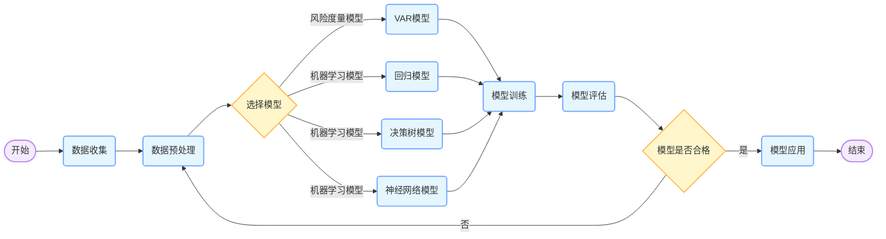

# 构建精准的投资风险评估模型

> 关键词：投资风险评估、模型构建、金融数据、机器学习、风险管理、量化分析、预测模型

> 摘要：本文围绕构建精准的投资风险评估模型展开深入探讨。在当今复杂多变的金融市场环境下，准确评估投资风险对于投资者和金融机构至关重要。文章首先介绍了构建投资风险评估模型的背景，包括目的、预期读者等内容。接着阐述了核心概念及联系，分析了相关算法原理和操作步骤，并给出了数学模型和公式。通过项目实战，详细展示了代码实现和解读。同时探讨了实际应用场景，推荐了相关的学习资源、开发工具和论文著作。最后总结了未来发展趋势与挑战，并对常见问题进行解答，为读者全面深入地了解和构建精准的投资风险评估模型提供了系统的指导。

## 1. 背景介绍 
### 1.1 目的和范围
在金融领域，投资活动充满了不确定性和风险。构建精准的投资风险评估模型的主要目的在于帮助投资者和金融机构更准确地衡量投资所面临的风险，从而做出更明智的投资决策。其范围涵盖了各种类型的投资，包括股票、债券、基金、期货等金融资产，以及房地产、实体企业等非金融资产的投资。通过对不同投资领域的数据进行分析和建模，评估模型能够为投资者提供量化的风险指标，帮助他们了解投资的潜在损失可能性和风险程度。

### 1.2 预期读者
本文的预期读者包括金融领域的从业者，如投资经理、风险分析师、交易员等，他们可以通过本文深入了解投资风险评估模型的构建方法和技术，提升自己的风险管理能力。同时，对于对金融投资和风险管理感兴趣的学生、研究人员以及普通投资者来说，本文也能提供有价值的参考，帮助他们学习和掌握投资风险评估的基本原理和实践方法。

### 1.3 文档结构概述
本文将按照以下结构展开：首先介绍构建投资风险评估模型的背景知识，包括目的、读者和文档结构等内容；接着阐述核心概念与联系，通过文本示意图和 Mermaid 流程图展示相关概念的原理和架构；然后详细讲解核心算法原理和具体操作步骤，并使用 Python 源代码进行阐述；之后介绍数学模型和公式，并通过举例进行说明；再通过项目实战展示代码实际案例和详细解释；接着探讨实际应用场景；推荐相关的工具和资源；总结未来发展趋势与挑战；最后在附录中解答常见问题，并提供扩展阅读和参考资料。

### 1.4 术语表
#### 1.4.1 核心术语定义
- **投资风险**：指投资过程中可能遭受损失的不确定性。它包括市场风险、信用风险、流动性风险等多种类型。
- **风险评估模型**：一种基于数学、统计和机器学习方法的模型，用于量化投资风险的程度和可能性。
- **量化分析**：运用数学和统计方法对金融数据进行分析，以获取投资风险和收益的量化信息。
- **金融数据**：包括市场价格、利率、财务报表等与金融资产和市场相关的数据。

#### 1.4.2 相关概念解释
- **市场风险**：由于市场因素（如股票市场波动、利率变化、汇率波动等）导致投资价值变动的风险。
- **信用风险**：指借款人或交易对手无法履行合同义务而导致投资者遭受损失的风险。
- **流动性风险**：指在需要变现投资资产时，无法以合理价格及时卖出的风险。

#### 1.4.3 缩略词列表
- **VAR**：Value at Risk，风险价值，是一种常用的风险度量指标，表示在一定置信水平下和一定持有期内，投资组合可能遭受的最大损失。
- **CVaR**：Conditional Value at Risk，条件风险价值，也称为预期尾部损失，是在 VAR 基础上进一步衡量极端损失情况的指标。
- **ML**：Machine Learning，机器学习，是构建投资风险评估模型常用的技术手段。

## 2. 核心概念与联系 

### 核心概念原理
投资风险评估模型的核心在于对各种风险因素进行量化和分析。其基本原理是通过收集和整理金融数据，运用数学和统计方法建立模型，来预测投资组合在不同市场环境下的表现和可能遭受的损失。

市场风险通常通过对市场价格波动的分析来评估，例如使用历史波动率、GARCH 模型等方法来估计资产价格的波动程度。信用风险则需要考虑借款人的信用评级、财务状况等因素，可以通过信用评分模型、违约概率模型等进行评估。流动性风险可以通过分析资产的交易量、买卖价差等指标来衡量。

### 架构的文本示意图
投资风险评估模型的架构可以分为数据层、模型层和应用层。

数据层：负责收集和整理各种金融数据，包括市场数据、财务数据、宏观经济数据等。这些数据是构建模型的基础。

模型层：运用各种数学和统计方法对数据进行分析和建模，包括风险度量模型（如 VAR、CVaR 等）、机器学习模型（如回归模型、决策树、神经网络等）。模型层的任务是对投资风险进行量化和预测。

应用层：将模型的结果应用于实际的投资决策中，如投资组合优化、风险控制等。应用层的目的是帮助投资者和金融机构做出更明智的投资决策。

### Mermaid 流程图


## 3. 核心算法原理 & 具体操作步骤 

### 风险度量模型 - VAR 模型原理
VAR 模型是一种常用的风险度量方法，它基于历史数据或假设的概率分布，计算在一定置信水平下和一定持有期内，投资组合可能遭受的最大损失。

假设投资组合的收益率 $R$ 服从正态分布 $N(\mu,\sigma^2)$，其中 $\mu$ 是预期收益率，$\sigma$ 是收益率的标准差。在置信水平为 $c$ 的情况下，VAR 的计算公式为：

$VAR = -z_c\sigma V_0$

其中，$z_c$ 是标准正态分布的分位数，$V_0$ 是投资组合的初始价值。

### Python 实现 VAR 模型
```python
import numpy as np
from scipy.stats import norm

def calculate_var(initial_value, mu, sigma, confidence_level, holding_period):
    """
    计算 VAR 值
    :param initial_value: 投资组合的初始价值
    :param mu: 预期收益率
    :param sigma: 收益率的标准差
    :param confidence_level: 置信水平
    :param holding_period: 持有期
    :return: VAR 值
    """
    z_score = norm.ppf(1 - confidence_level)
    var = -z_score * sigma * np.sqrt(holding_period) * initial_value
    return var

# 示例数据
initial_value = 1000000  # 初始价值为 100 万
mu = 0.05  # 预期收益率为 5%
sigma = 0.2  # 收益率的标准差为 20%
confidence_level = 0.95  # 置信水平为 95%
holding_period = 1  # 持有期为 1 天

var_value = calculate_var(initial_value, mu, sigma, confidence_level, holding_period)
print(f"VAR 值为: {var_value}")
```

### 机器学习模型 - 回归模型原理
回归模型是一种常用的机器学习模型，用于建立自变量和因变量之间的线性关系。在投资风险评估中，可以使用回归模型来预测投资组合的收益率，从而评估风险。

假设我们有 $n$ 个样本，每个样本有 $p$ 个自变量 $x_1,x_2,\cdots,x_p$ 和一个因变量 $y$。线性回归模型的表达式为：

$y = \beta_0 + \beta_1x_1 + \beta_2x_2 + \cdots + \beta_px_p + \epsilon$

其中，$\beta_0,\beta_1,\cdots,\beta_p$ 是回归系数，$\epsilon$ 是误差项。

### Python 实现回归模型
```python
import numpy as np
from sklearn.linear_model import LinearRegression
from sklearn.model_selection import train_test_split

# 示例数据
np.random.seed(0)
X = np.random.rand(100, 5)  # 100 个样本，每个样本有 5 个特征
y = 2 * X[:, 0] + 3 * X[:, 1] + 0.5 * X[:, 2] + np.random.randn(100)  # 生成因变量

# 划分训练集和测试集
X_train, X_test, y_train, y_test = train_test_split(X, y, test_size=0.2, random_state=42)

# 训练回归模型
model = LinearRegression()
model.fit(X_train, y_train)

# 预测
y_pred = model.predict(X_test)

# 评估模型
from sklearn.metrics import mean_squared_error
mse = mean_squared_error(y_test, y_pred)
print(f"均方误差: {mse}")
```

### 具体操作步骤
1. **数据收集**：收集与投资相关的各种数据，包括市场数据、财务数据、宏观经济数据等。
2. **数据预处理**：对收集到的数据进行清洗、缺失值处理、异常值处理、标准化等操作，以提高数据的质量。
3. **特征选择**：从原始数据中选择与投资风险相关的特征，减少数据维度，提高模型的效率和准确性。
4. **模型选择**：根据数据的特点和问题的需求，选择合适的风险评估模型，如 VAR 模型、回归模型、决策树模型、神经网络模型等。
5. **模型训练**：使用训练数据对选择的模型进行训练，调整模型的参数，使其能够准确地预测投资风险。
6. **模型评估**：使用测试数据对训练好的模型进行评估，计算模型的性能指标，如均方误差、准确率、召回率等。
7. **模型优化**：根据模型评估的结果，对模型进行优化，如调整模型的参数、选择更合适的特征等。
8. **模型应用**：将优化后的模型应用于实际的投资决策中，如投资组合优化、风险控制等。

## 4. 数学模型和公式 & 详细讲解 & 举例说明 

### VAR 模型数学公式
如前所述，VAR 模型的计算公式为：

$VAR = -z_c\sigma V_0$

其中，$z_c$ 是标准正态分布的分位数，它取决于置信水平 $c$。例如，当置信水平为 95% 时，$z_{0.95} \approx 1.645$；当置信水平为 99% 时，$z_{0.99} \approx 2.326$。

$\sigma$ 是投资组合收益率的标准差，它衡量了收益率的波动程度。$V_0$ 是投资组合的初始价值。

### 举例说明
假设一个投资组合的初始价值为 $V_0 = 1000000$ 元，预期收益率 $\mu = 0.05$，收益率的标准差 $\sigma = 0.2$，置信水平为 95%，持有期为 1 天。

首先，查找标准正态分布表或使用 Python 计算 $z_{0.95}$ 的值：
```python
from scipy.stats import norm
z_score = norm.ppf(1 - 0.95)
print(f"z_score: {z_score}")
```
得到 $z_{0.95} \approx -1.645$。

然后，计算 VAR 值：
$VAR = -z_{0.95}\sigma V_0 = -(-1.645) \times 0.2 \times 1000000 = 329000$（元）

这意味着在 95% 的置信水平下，该投资组合在 1 天内可能遭受的最大损失为 329000 元。

### 回归模型数学公式
线性回归模型的表达式为：

$y = \beta_0 + \beta_1x_1 + \beta_2x_2 + \cdots + \beta_px_p + \epsilon$

其中，$\beta_0$ 是截距项，$\beta_1,\beta_2,\cdots,\beta_p$ 是回归系数，$x_1,x_2,\cdots,x_p$ 是自变量，$y$ 是因变量，$\epsilon$ 是误差项。

回归系数 $\beta = (\beta_0,\beta_1,\cdots,\beta_p)^T$ 可以通过最小二乘法求解，使得误差平方和 $S(\beta) = \sum_{i=1}^{n}(y_i - \hat{y}_i)^2$ 最小，其中 $y_i$ 是实际观测值，$\hat{y}_i$ 是模型预测值。

最小二乘法的解为：

$\hat{\beta} = (X^TX)^{-1}X^Ty$

其中，$X$ 是自变量矩阵，$y$ 是因变量向量。

### 举例说明
假设我们有以下数据：

| $x_1$ | $x_2$ | $y$ |
|-------|-------|-----|
| 1     | 2     | 5   |
| 2     | 3     | 7   |
| 3     | 4     | 9   |

则自变量矩阵 $X$ 和因变量向量 $y$ 分别为：

$X = \begin{bmatrix} 1 & 1 & 2 \\ 1 & 2 & 3 \\ 1 & 3 & 4 \end{bmatrix}$，$y = \begin{bmatrix} 5 \\ 7 \\ 9 \end{bmatrix}$

计算 $(X^TX)^{-1}X^Ty$：
```python
import numpy as np

X = np.array([[1, 1, 2], [1, 2, 3], [1, 3, 4]])
y = np.array([[5], [7], [9]])

beta_hat = np.linalg.inv(X.T @ X) @ X.T @ y
print(f"回归系数: {beta_hat}")
```
得到回归系数 $\hat{\beta} \approx \begin{bmatrix} 1 \\ 2 \\ 0 \end{bmatrix}$，即回归方程为 $y = 1 + 2x_1 + 0x_2$。

## 5. 项目实战：代码实际案例和详细解释说明 

### 5.1  开发环境搭建
- **操作系统**：Windows、Linux 或 macOS 均可。
- **Python 版本**：建议使用 Python 3.7 及以上版本。
- **开发工具**：推荐使用 PyCharm 或 Jupyter Notebook。
- **所需库**：安装以下 Python 库：
```bash
pip install numpy pandas scikit-learn matplotlib seaborn
```

### 5.2  源代码详细实现和代码解读
以下是一个使用线性回归模型进行投资风险评估的项目实战案例。

```python
import numpy as np
import pandas as pd
from sklearn.linear_model import LinearRegression
from sklearn.model_selection import train_test_split
from sklearn.metrics import mean_squared_error
import matplotlib.pyplot as plt
import seaborn as sns

# 数据加载
data = pd.read_csv('investment_data.csv')  # 假设数据存储在 investment_data.csv 文件中

# 数据探索
print(data.head())
print(data.info())
print(data.describe())

# 数据可视化
sns.pairplot(data)
plt.show()

# 特征选择
X = data.drop('target_variable', axis=1)  # 假设 target_variable 是目标变量
y = data['target_variable']

# 划分训练集和测试集
X_train, X_test, y_train, y_test = train_test_split(X, y, test_size=0.2, random_state=42)

# 训练线性回归模型
model = LinearRegression()
model.fit(X_train, y_train)

# 模型预测
y_pred = model.predict(X_test)

# 模型评估
mse = mean_squared_error(y_test, y_pred)
rmse = np.sqrt(mse)
print(f"均方误差: {mse}")
print(f"均方根误差: {rmse}")

# 可视化预测结果
plt.scatter(y_test, y_pred)
plt.xlabel('实际值')
plt.ylabel('预测值')
plt.title('实际值 vs 预测值')
plt.show()
```

### 5.3  代码解读与分析
1. **数据加载**：使用 `pandas` 库的 `read_csv` 函数加载投资数据。
2. **数据探索**：使用 `head()`、`info()` 和 `describe()` 方法查看数据的基本信息、前几行和统计描述。
3. **数据可视化**：使用 `seaborn` 库的 `pairplot` 函数绘制数据的散点图矩阵，观察变量之间的关系。
4. **特征选择**：将目标变量从数据中分离出来，得到自变量矩阵 $X$ 和因变量向量 $y$。
5. **划分训练集和测试集**：使用 `train_test_split` 函数将数据划分为训练集和测试集，测试集占比为 20%。
6. **训练线性回归模型**：使用 `LinearRegression` 类创建线性回归模型，并使用训练数据进行训练。
7. **模型预测**：使用训练好的模型对测试数据进行预测，得到预测值 $y_pred$。
8. **模型评估**：使用 `mean_squared_error` 函数计算均方误差，并计算均方根误差。
9. **可视化预测结果**：使用 `matplotlib` 库绘制实际值和预测值的散点图，观察模型的预测效果。

## 6. 实际应用场景 
### 投资者决策
对于个人投资者来说，投资风险评估模型可以帮助他们更好地了解自己的投资组合所面临的风险，从而做出更合理的投资决策。例如，投资者可以根据模型计算的 VAR 值，确定自己能够承受的最大损失，进而调整投资组合的资产配置，降低风险。

### 金融机构风险管理
金融机构如银行、证券公司、基金公司等，需要对其投资组合进行风险管理。投资风险评估模型可以帮助金融机构量化投资风险，制定合理的风险控制策略。例如，银行可以根据模型评估贷款客户的信用风险，确定贷款额度和利率；证券公司可以使用模型评估自营业务的市场风险，进行风险预警和控制。

### 监管机构监管
监管机构可以使用投资风险评估模型对金融机构的风险状况进行监测和评估，确保金融市场的稳定运行。例如，监管机构可以要求金融机构定期报送投资风险评估报告，根据报告中的风险指标，对金融机构进行监管和干预。

### 投资组合优化
投资风险评估模型可以为投资组合优化提供依据。通过对不同资产的风险和收益进行评估，投资者可以选择最优的资产组合，实现风险和收益的平衡。例如，投资者可以使用马科维茨的均值 - 方差模型，结合投资风险评估模型的结果，构建最优投资组合。

## 7. 工具和资源推荐
### 7.1 学习资源推荐
#### 7.1.1 书籍推荐
- 《金融风险管理师（FRM）考试教材》：全面介绍了金融风险管理的理论和实践，包括投资风险评估的方法和技术。
- 《Python 金融数据分析与挖掘实战》：结合 Python 语言，详细介绍了金融数据分析和挖掘的方法，包括投资风险评估模型的构建和应用。
- 《机器学习》（周志华著）：系统介绍了机器学习的基本概念、算法和应用，为构建投资风险评估模型提供了理论基础。

#### 7.1.2 在线课程
- Coursera 上的“Financial Risk Management”课程：由知名大学的教授授课，深入讲解了金融风险管理的理论和实践。
- edX 上的“Python for Data Science and Machine Learning Bootcamp”课程：通过实际案例，介绍了使用 Python 进行数据分析和机器学习的方法，包括投资风险评估模型的构建。
- 中国大学 MOOC 上的“金融数据分析与挖掘”课程：结合金融领域的实际问题，介绍了数据分析和挖掘的方法和技术。

#### 7.1.3 技术博客和网站
- Towards Data Science：一个专注于数据科学和机器学习的技术博客，上面有很多关于投资风险评估模型的文章和案例。
- QuantNet：一个量化金融领域的专业网站，提供了丰富的金融数据分析和风险管理的资源和论坛。
- 金融界：一个综合性的金融网站，提供了金融市场的实时数据、分析报告和投资策略，有助于了解投资风险评估的实际应用。

### 7.2 开发工具框架推荐
#### 7.2.1 IDE和编辑器
- PyCharm：一款功能强大的 Python 集成开发环境，提供了代码编辑、调试、版本控制等功能，适合开发投资风险评估模型。
- Jupyter Notebook：一个交互式的开发环境，支持 Python、R 等多种编程语言，适合进行数据探索、模型实验和结果展示。
- Visual Studio Code：一款轻量级的代码编辑器，支持多种编程语言和插件，适合快速开发和调试投资风险评估模型。

#### 7.2.2 调试和性能分析工具
- pdb：Python 内置的调试器，可以帮助开发者逐步调试代码，查找问题。
- cProfile：Python 内置的性能分析工具，可以分析代码的运行时间和性能瓶颈。
- Py-Spy：一个用于分析 Python 代码性能的工具，可以实时监控代码的运行情况，找出性能瓶颈。

#### 7.2.3 相关框架和库
- NumPy：一个用于科学计算的 Python 库，提供了高效的数组操作和数学函数，是构建投资风险评估模型的基础库。
- Pandas：一个用于数据处理和分析的 Python 库，提供了数据结构和数据操作方法，方便进行数据清洗、预处理和分析。
- Scikit-learn：一个用于机器学习的 Python 库，提供了丰富的机器学习算法和工具，包括分类、回归、聚类等算法，适合构建投资风险评估模型。
- TensorFlow 和 PyTorch：两个深度学习框架，提供了高效的深度学习算法和工具，适合处理复杂的投资风险评估问题。

### 7.3 相关论文著作推荐
#### 7.3.1 经典论文
- Markowitz, H. M. (1952). Portfolio Selection. The Journal of Finance, 7(1), 77 - 91. 该论文提出了均值 - 方差模型，为投资组合理论奠定了基础。
- VaR: Understanding and Applying Value at Risk by Philippe Jorion. 这篇论文详细介绍了 VAR 模型的原理和应用，是投资风险评估领域的经典之作。

#### 7.3.2 最新研究成果
- 关注顶级金融期刊，如 The Journal of Finance、The Review of Financial Studies 等，上面发表了很多关于投资风险评估的最新研究成果。
- 关注机器学习和数据科学领域的会议和期刊，如 NeurIPS、ICML 等，上面有很多关于使用机器学习方法进行投资风险评估的研究。

#### 7.3.3 应用案例分析
- 各大金融机构的研究报告：许多金融机构会发布关于投资风险评估的研究报告和应用案例，可以从中学习到实际应用中的经验和方法。
- 学术数据库中的案例研究：如 IEEE Xplore、ACM Digital Library 等数据库中，有很多关于投资风险评估模型应用案例的研究论文。

## 8. 总结：未来发展趋势与挑战
### 未来发展趋势
- **多学科融合**：投资风险评估将越来越多地融合金融、数学、统计学、计算机科学等多学科的知识和方法。例如，结合深度学习、强化学习等人工智能技术，提高风险评估的准确性和效率。
- **大数据和云计算的应用**：随着金融数据的不断增长，大数据和云计算技术将在投资风险评估中发挥重要作用。通过大数据技术，可以收集和分析更多的金融数据，挖掘潜在的风险因素；通过云计算技术，可以提高数据处理和模型计算的效率。
- **实时风险评估**：传统的投资风险评估通常是基于历史数据进行的，未来将更加注重实时风险评估。通过实时监测市场数据和投资组合的变化，及时调整风险评估结果，为投资者提供更及时的决策支持。
- **个性化风险评估**：不同的投资者有不同的风险偏好和投资目标，未来的投资风险评估模型将更加注重个性化。根据投资者的个人信息、投资历史等因素，为投资者提供个性化的风险评估和投资建议。

### 挑战
- **数据质量和隐私问题**：金融数据的质量和隐私是投资风险评估面临的重要挑战。数据中可能存在缺失值、异常值等问题，影响模型的准确性；同时，金融数据涉及投资者的隐私和商业机密，需要加强数据保护。
- **模型复杂度和可解释性**：随着人工智能技术的应用，投资风险评估模型越来越复杂，这给模型的解释和理解带来了困难。投资者和监管机构需要了解模型的决策过程和依据，因此如何提高模型的可解释性是一个重要的挑战。
- **市场不确定性和黑天鹅事件**：金融市场充满了不确定性，黑天鹅事件（如金融危机、重大自然灾害等）的发生往往超出了模型的预测范围。如何应对市场不确定性和黑天鹅事件，提高模型的鲁棒性，是投资风险评估面临的重要挑战。
- **技术更新换代快**：计算机科学和人工智能技术发展迅速，新的算法和方法不断涌现。投资风险评估领域需要不断学习和应用新的技术，以保持模型的先进性和竞争力。

## 9. 附录：常见问题与解答
### 问题 1：如何选择合适的投资风险评估模型？
答：选择合适的投资风险评估模型需要考虑多个因素，包括数据的特点、问题的需求、模型的复杂度和可解释性等。如果数据具有线性关系，可以选择线性回归模型；如果数据具有非线性关系，可以选择决策树、神经网络等模型。同时，还需要考虑模型的可解释性，对于一些需要向投资者和监管机构解释的模型，应选择可解释性较强的模型。

### 问题 2：投资风险评估模型的准确性如何保证？
答：保证投资风险评估模型的准确性需要从多个方面入手。首先，要确保数据的质量，对数据进行清洗、缺失值处理、异常值处理等操作。其次，要选择合适的模型，并对模型进行调优，如调整模型的参数、选择更合适的特征等。最后，要对模型进行评估和验证，使用交叉验证、留一法等方法，确保模型在不同数据集上都具有较好的性能。

### 问题 3：如何处理投资风险评估中的不确定性？
答：投资风险评估中的不确定性可以通过多种方法处理。一种方法是使用概率模型，如 VAR 模型、CVaR 模型等，通过计算风险的概率分布，量化不确定性。另一种方法是使用鲁棒性模型，如鲁棒回归模型、鲁棒聚类模型等，提高模型对异常值和不确定性的容忍度。此外，还可以结合多种模型进行评估，综合考虑不同模型的结果，降低不确定性的影响。

### 问题 4：投资风险评估模型在实际应用中需要注意什么？
答：投资风险评估模型在实际应用中需要注意以下几点。首先，要根据实际情况选择合适的模型和参数，不能盲目套用现成的模型。其次，要定期对模型进行评估和更新，随着市场环境和数据的变化，模型的性能可能会下降，需要及时调整模型。最后，要将模型的结果与投资者的经验和判断相结合，不能完全依赖模型进行决策。

## 10. 扩展阅读 & 参考资料
### 扩展阅读
- 《智能金融：科技如何重塑金融行业格局》：介绍了科技在金融领域的应用和发展趋势，包括投资风险评估的新技术和新方法。
- 《金融科技前沿：技术驱动的金融创新》：探讨了金融科技的前沿问题，如区块链、人工智能在投资风险评估中的应用。
- 《量化投资：策略与技术》：详细介绍了量化投资的策略和技术，包括投资风险评估模型的构建和应用。

### 参考资料
- 各金融机构的官方网站和研究报告，获取最新的金融数据和投资风险评估案例。
- 学术数据库，如 IEEE Xplore、ACM Digital Library、Web of Science 等，获取相关的学术论文和研究成果。
- 相关的行业标准和规范，如巴塞尔协议、国际会计准则等，了解投资风险评估的行业要求和规范。