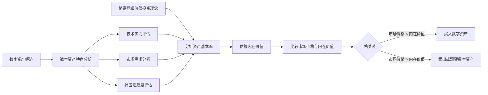

# 格雷厄姆价值投资理念在数字资产经济中的重新定位

> 关键词：格雷厄姆、价值投资理念、数字资产经济、重新定位、投资策略

> 摘要：本文深入探讨了格雷厄姆价值投资理念在数字资产经济环境下的重新定位问题。首先介绍了研究的背景、目的、预期读者等内容，接着阐述了格雷厄姆价值投资理念的核心概念及其与数字资产经济的联系。详细分析了相关的核心算法原理、数学模型和公式，并通过项目实战展示了如何在数字资产投资中应用这些理念。探讨了数字资产经济中格雷厄姆价值投资理念的实际应用场景，推荐了相关的学习资源、开发工具和论文著作。最后总结了未来发展趋势与挑战，还提供了常见问题解答和扩展阅读参考资料，旨在为投资者和研究者在数字资产投资领域更好地运用价值投资理念提供全面且深入的指导。

## 1. 背景介绍 
### 1.1 目的和范围
在传统金融领域，格雷厄姆的价值投资理念已经取得了巨大的成功，成为了众多投资者遵循的圭臬。然而，随着数字资产经济的迅猛发展，比特币、以太坊等数字资产的出现，打破了传统金融市场的格局。数字资产具有高波动性、去中心化、技术驱动等独特特点，这使得传统的价值投资理念在应用于数字资产经济时面临诸多挑战。本研究的目的在于深入分析格雷厄姆价值投资理念在数字资产经济中的适用性，探讨如何对其进行重新定位，以更好地指导投资者在数字资产市场中做出明智的投资决策。研究范围涵盖了数字资产的各种类型，包括加密货币、数字证券等，以及相关的市场环境和投资策略。

### 1.2 预期读者
本文预期读者包括对数字资产投资感兴趣的个人投资者，希望通过学习和应用价值投资理念在数字资产市场中获取收益。同时，也适合金融机构的投资经理、分析师等专业人士，他们可以从中深入思考价值投资理念在新兴数字资产领域的应用和创新。此外，从事金融研究的学者和学生也能从本文中获取有价值的研究思路和理论参考。

### 1.3 文档结构概述
本文首先介绍研究的背景信息，包括目的、预期读者等。接着阐述格雷厄姆价值投资理念的核心概念以及与数字资产经济的联系，通过示意图和流程图进行直观展示。然后详细讲解核心算法原理和具体操作步骤，结合Python源代码进行说明。随后介绍相关的数学模型和公式，并举例说明。通过项目实战展示代码实际案例和详细解释。探讨数字资产经济中该理念的实际应用场景。推荐相关的学习资源、开发工具和论文著作。最后总结未来发展趋势与挑战，提供常见问题解答和扩展阅读参考资料。

### 1.4 术语表
#### 1.4.1 核心术语定义
- **格雷厄姆价值投资理念**：由本杰明·格雷厄姆提出的一种投资哲学，强调通过分析企业的内在价值，以低于内在价值的价格购买资产，注重资产的安全性和长期投资回报。
- **数字资产**：指以电子数据形式存在的资产，包括加密货币、数字证券、非同质化代币（NFT）等，具有数字化、可交易等特点。
- **内在价值**：资产在正常市场条件下所具有的真实价值，是基于资产的基本面因素，如盈利能力、资产状况等评估得出的价值。

#### 1.4.2 相关概念解释
- **去中心化**：数字资产经济中的一个重要概念，指的是不依赖于单一的中心化机构进行管理和运作，而是通过分布式账本技术实现资产的交易和管理，提高了资产的透明度和安全性。
- **区块链技术**：是数字资产的底层技术，它是一种分布式的数据库，通过密码学算法保证数据的不可篡改和可追溯性，为数字资产的交易和管理提供了技术支持。

#### 1.4.3 缩略词列表
- **NFT**：Non - Fungible Token，非同质化代币
- **ICO**：Initial Coin Offering，首次代币发行

## 2. 核心概念与联系 

### 格雷厄姆价值投资理念核心原理
格雷厄姆价值投资理念的核心在于寻找被市场低估的资产。其基本原理是通过对企业的财务报表、行业地位、管理团队等基本面因素进行深入分析，估算出企业的内在价值。当市场价格低于内在价值时，投资者认为该资产具有投资价值，此时买入资产，等待市场价格回归内在价值，从而获取投资收益。

### 数字资产经济特点
数字资产经济具有高波动性、去中心化、技术驱动等特点。高波动性使得数字资产价格在短时间内可能出现大幅波动，给投资者带来了巨大的风险和机遇。去中心化意味着数字资产的交易不依赖于传统的金融机构，而是通过区块链技术实现点对点的交易，提高了交易的效率和透明度。技术驱动则体现在数字资产的发展离不开区块链、密码学等技术的支持，技术的创新和发展推动了数字资产市场的不断变化。

### 两者联系的文本示意图
格雷厄姆价值投资理念的核心是寻找价值被低估的资产，而数字资产经济中的数字资产同样存在价值被低估或高估的情况。虽然数字资产的特点与传统资产有所不同，但价值投资的基本逻辑仍然适用。可以通过对数字资产的技术实力、市场需求、社区活跃度等基本面因素进行分析，估算其内在价值，从而判断是否具有投资价值。

### Mermaid 流程图


## 3. 核心算法原理 & 具体操作步骤 

### 核心算法原理
在数字资产经济中应用格雷厄姆价值投资理念，核心算法在于估算数字资产的内在价值。一种简单的方法是基于数字资产的未来现金流折现模型。假设数字资产在未来 $n$ 期内产生的现金流为 $CF_t$（$t = 1,2,\cdots,n$），折现率为 $r$，则数字资产的内在价值 $V$ 可以通过以下公式计算：

$V=\sum_{t = 1}^{n}\frac{CF_t}{(1 + r)^t}$

### Python 源代码实现
```python
def calculate_intrinsic_value(cash_flows, discount_rate):
    """
    计算数字资产的内在价值
    :param cash_flows: 未来各期的现金流列表
    :param discount_rate: 折现率
    :return: 内在价值
    """
    intrinsic_value = 0
    for t, cash_flow in enumerate(cash_flows, start=1):
        intrinsic_value += cash_flow / ((1 + discount_rate) ** t)
    return intrinsic_value

# 示例数据
cash_flows = [100, 200, 300, 400, 500]  # 未来 5 期的现金流
discount_rate = 0.1  # 折现率为 10%

# 计算内在价值
intrinsic_value = calculate_intrinsic_value(cash_flows, discount_rate)
print(f"数字资产的内在价值为: {intrinsic_value}")
```

### 具体操作步骤
1. **数据收集**：收集数字资产的相关信息，包括技术文档、市场报告、社区讨论等，以了解其未来的盈利模式和可能产生的现金流。
2. **现金流预测**：根据收集到的信息，对数字资产在未来各期的现金流进行预测。这需要考虑数字资产的市场需求、竞争状况、技术发展等因素。
3. **折现率确定**：折现率反映了投资者对风险的偏好和资金的机会成本。一般来说，数字资产的风险较高，折现率也相对较高。可以参考市场上类似投资的回报率来确定折现率。
4. **内在价值计算**：使用上述的现金流折现模型，将预测的现金流和确定的折现率代入公式，计算数字资产的内在价值。
5. **投资决策**：比较数字资产的市场价格和内在价值。如果市场价格低于内在价值，则可以考虑买入；如果市场价格高于内在价值，则可以考虑卖出或观望。

## 4. 数学模型和公式 & 详细讲解 & 举例说明 

### 数学模型和公式
在数字资产经济中应用格雷厄姆价值投资理念，除了前面提到的现金流折现模型，还可以使用其他数学模型来估算数字资产的内在价值。例如，相对估值模型。相对估值模型是通过比较数字资产与同行业其他类似资产的估值指标，来估算其内在价值。常用的估值指标包括市盈率（P/E）、市净率（P/B）等。

假设数字资产 $A$ 的每股收益为 $EPS_A$，同行业类似数字资产的平均市盈率为 $P/E_{avg}$，则数字资产 $A$ 的内在价值 $V_A$ 可以通过以下公式计算：

$V_A = EPS_A\times P/E_{avg}$

### 详细讲解
- **现金流折现模型**：该模型的核心思想是将数字资产未来产生的现金流按照一定的折现率折现到当前时刻，以反映其当前的价值。折现率的选择非常关键，它反映了投资者对风险的偏好和资金的机会成本。折现率越高，未来现金流的现值就越低，数字资产的内在价值也就越低。
- **相对估值模型**：相对估值模型是一种相对简单的估值方法，它通过比较数字资产与同行业其他类似资产的估值指标来估算其内在价值。该模型的前提是同行业的类似资产具有相似的风险和盈利特征。在使用相对估值模型时，需要选择合适的可比资产和估值指标。

### 举例说明
假设数字资产 $B$ 的每股收益为 $2$ 元，同行业类似数字资产的平均市盈率为 $10$ 倍。则根据相对估值模型，数字资产 $B$ 的内在价值为：

$V_B = 2\times10 = 20$（元）

如果数字资产 $B$ 的当前市场价格为 $15$ 元，低于其内在价值 $20$ 元，则根据格雷厄姆价值投资理念，可以考虑买入该数字资产。

## 5. 项目实战：代码实际案例和详细解释说明 

### 5.1  开发环境搭建
- **Python 安装**：确保已经安装了 Python 3.x 版本。可以从 Python 官方网站（https://www.python.org/downloads/）下载并安装。
- **库安装**：在本项目中，需要使用 `pandas`、`numpy` 等库进行数据处理和分析。可以使用以下命令进行安装：
```sh
pip install pandas numpy
```

### 5.2  源代码详细实现和代码解读
```python
import pandas as pd
import numpy as np

# 模拟数字资产的财务数据
data = {
    'Year': [2021, 2022, 2023, 2024, 2025],
    'Earnings_per_Share': [1.0, 1.2, 1.5, 1.8, 2.0],
    'Dividend_per_Share': [0.5, 0.6, 0.7, 0.8, 0.9]
}

df = pd.DataFrame(data)

# 计算市盈率（P/E）
average_eps = df['Earnings_per_Share'].mean()
market_price = 20
pe_ratio = market_price / average_eps

# 计算股息率
average_dividend = df['Dividend_per_Share'].mean()
dividend_yield = average_dividend / market_price

# 基于相对估值模型估算内在价值
# 假设同行业平均市盈率为 12
industry_avg_pe = 12
intrinsic_value = industry_avg_pe * average_eps

print(f"市盈率（P/E）: {pe_ratio}")
print(f"股息率: {dividend_yield}")
print(f"内在价值: {intrinsic_value}")
```

### 5.3  代码解读与分析
1. **数据模拟**：使用 `pandas` 库创建一个包含数字资产财务数据的 DataFrame，包括年份、每股收益和每股股息。
2. **市盈率计算**：计算数字资产的平均每股收益，并根据当前市场价格计算市盈率。市盈率反映了市场对数字资产盈利的预期。
3. **股息率计算**：计算数字资产的平均每股股息，并根据当前市场价格计算股息率。股息率反映了数字资产的分红能力。
4. **内在价值估算**：假设同行业平均市盈率为 12，使用相对估值模型估算数字资产的内在价值。
5. **结果输出**：打印出市盈率、股息率和内在价值，投资者可以根据这些指标判断数字资产是否具有投资价值。

## 6. 实际应用场景 
### 加密货币投资
在加密货币市场中，投资者可以应用格雷厄姆价值投资理念来筛选具有投资价值的加密货币。通过分析加密货币的技术实力、社区活跃度、市场需求等基本面因素，估算其内在价值。例如，比特币作为最早的加密货币，具有广泛的市场认可度和较高的技术安全性，其内在价值相对较高。当比特币的市场价格低于其内在价值时，投资者可以考虑买入。

### 数字证券投资
数字证券是一种基于区块链技术的证券化资产，具有更高的流动性和透明度。在数字证券投资中，投资者可以通过分析发行方的财务状况、业务前景等因素，估算数字证券的内在价值。例如，一些基于区块链的房地产数字证券，投资者可以通过分析房地产的租金收入、市场价值等因素，估算数字证券的内在价值，从而做出投资决策。

### 非同质化代币（NFT）投资
NFT 市场近年来发展迅速，投资者可以应用价值投资理念来筛选有潜力的 NFT 项目。通过分析 NFT 的艺术价值、稀缺性、创作者背景等因素，估算其内在价值。例如，一些知名艺术家创作的 NFT 作品，由于其独特的艺术价值和稀缺性，具有较高的内在价值。当市场价格低于其内在价值时，投资者可以考虑买入。

## 7. 工具和资源推荐
### 7.1 学习资源推荐
#### 7.1.1 书籍推荐
- 《聪明的投资者》（The Intelligent Investor）：本杰明·格雷厄姆的经典著作，详细阐述了价值投资的理念和方法。
- 《数字资产革命》（The Digital Asset Revolution）：介绍了数字资产的发展历程、技术原理和投资策略。
- 《区块链：技术驱动金融》（Blockchain: The Technology Behind Bitcoin and Other Cryptocurrencies）：深入讲解了区块链技术的原理和应用，对于理解数字资产的底层技术非常有帮助。

#### 7.1.2 在线课程
- Coursera 上的“Investment Management Specialization”：提供了全面的投资管理知识，包括价值投资理念和数字资产投资。
- edX 上的“Blockchain and Cryptocurrencies”：介绍了区块链技术和加密货币的相关知识。
- Udemy 上的“Crypto Investing for Beginners”：适合初学者了解加密货币投资的基本方法和策略。

#### 7.1.3 技术博客和网站
- CoinDesk：提供最新的加密货币和数字资产新闻、分析和研究报告。
- Blockchain.com：提供区块链技术和数字资产的相关数据和信息。
- Medium 上的区块链和数字资产相关博客：有许多专业人士分享的关于数字资产投资和技术的文章。

### 7.2 开发工具框架推荐
#### 7.2.1 IDE和编辑器
- PyCharm：一款功能强大的 Python 集成开发环境，适合开发和调试与数字资产分析相关的 Python 代码。
- Visual Studio Code：一款轻量级的代码编辑器，支持多种编程语言，具有丰富的插件生态系统。

#### 7.2.2 调试和性能分析工具
- PDB：Python 自带的调试器，可以帮助开发者调试 Python 代码。
- cProfile：Python 标准库中的性能分析工具，可以分析代码的性能瓶颈。

#### 7.2.3 相关框架和库
- Pandas：用于数据处理和分析的 Python 库，非常适合处理数字资产的财务数据。
- NumPy：用于科学计算的 Python 库，提供了高效的数组操作和数学函数。
- Matplotlib：用于数据可视化的 Python 库，可以将数字资产的相关数据以图表的形式展示出来。

### 7.3 相关论文著作推荐
#### 7.3.1 经典论文
- “The Theory of Investment Value” by John Burr Williams：提出了现金流折现模型的基本理论，是价值投资领域的经典论文。
- “The Pricing of Options and Corporate Liabilities” by Fischer Black and Myron Scholes：提出了著名的布莱克 - 斯科尔斯期权定价模型，对金融资产的定价理论有重要贡献。

#### 7.3.2 最新研究成果
- 关注顶级金融学术期刊，如 The Journal of Finance、The Review of Financial Studies 等，了解数字资产经济和价值投资领域的最新研究成果。
- 关注知名学术会议，如 the American Finance Association Annual Meeting、the Western Finance Association Annual Meeting 等，获取最新的研究动态。

#### 7.3.3 应用案例分析
- 研究一些成功的数字资产投资案例，如灰度投资公司（Grayscale Investments）的投资策略和案例分析，了解如何在实际应用中运用价值投资理念。

## 8. 总结：未来发展趋势与挑战
### 未来发展趋势
- **融合发展**：格雷厄姆价值投资理念将与数字资产经济进一步融合。随着数字资产市场的不断发展和成熟，投资者将更加注重数字资产的基本面分析，价值投资理念将在数字资产投资中发挥越来越重要的作用。
- **技术创新**：区块链、人工智能等技术的不断创新将为价值投资理念在数字资产经济中的应用提供更强大的技术支持。例如，人工智能可以帮助投资者更高效地分析数字资产的基本面数据，提高投资决策的准确性。
- **监管完善**：随着数字资产市场的发展，监管机构将加强对数字资产市场的监管。完善的监管环境将提高数字资产市场的透明度和规范性，为价值投资理念的应用提供更好的市场环境。

### 挑战
- **高波动性**：数字资产市场的高波动性给价值投资理念的应用带来了挑战。由于数字资产价格的大幅波动，很难准确估算其内在价值，投资者需要具备更强的风险承受能力和投资技巧。
- **技术复杂性**：数字资产的技术复杂性使得投资者需要具备一定的技术知识才能进行基本面分析。例如，对于区块链技术的理解和掌握对于分析数字资产的技术实力至关重要。
- **监管不确定性**：数字资产市场的监管政策尚不完善，存在一定的不确定性。监管政策的变化可能会对数字资产的市场价格和投资价值产生重大影响，增加了投资者的投资风险。

## 9. 附录：常见问题与解答
### 问题 1：数字资产的内在价值很难准确估算，如何解决这个问题？
解答：虽然数字资产的内在价值很难准确估算，但可以通过多种方法来提高估算的准确性。例如，综合使用现金流折现模型、相对估值模型等多种估值方法，结合数字资产的技术实力、市场需求、社区活跃度等基本面因素进行分析。同时，参考同行业其他类似数字资产的估值情况，也可以为估算提供参考。

### 问题 2：在数字资产市场中，价值投资理念是否仍然适用？
解答：价值投资理念在数字资产市场中仍然适用。虽然数字资产具有一些独特的特点，如高波动性、去中心化等，但价值投资的基本逻辑仍然成立。投资者可以通过分析数字资产的基本面因素，估算其内在价值，以低于内在价值的价格买入资产，等待市场价格回归内在价值，从而获取投资收益。

### 问题 3：如何选择合适的折现率来计算数字资产的内在价值？
解答：折现率的选择需要考虑多个因素，包括市场利率、投资风险、资金的机会成本等。一般来说，数字资产的风险较高，折现率也相对较高。可以参考市场上类似投资的回报率来确定折现率，同时结合自己的投资风险偏好进行调整。

## 10. 扩展阅读 & 参考资料
### 扩展阅读
- 《金融炼金术》（The Alchemy of Finance）by George Soros：探讨了金融市场的运行规律和投资策略，对于理解数字资产市场的波动有一定的参考价值。
- 《失控》（Out of Control）by Kevin Kelly：介绍了互联网和新兴技术的发展趋势，对于理解数字资产经济的发展背景有帮助。

### 参考资料
- 本杰明·格雷厄姆的相关著作和论文。
- 数字资产相关的研究报告和市场数据，如 CoinMarketCap、CryptoCompare 等网站提供的数据。
- 金融学术期刊上发表的关于数字资产经济和价值投资的研究论文。