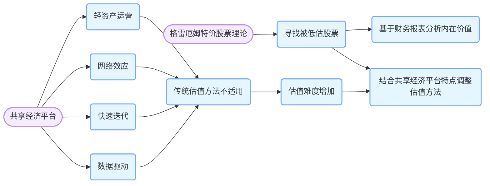

# 格雷厄姆特价股票理论在共享经济平台时代的新思考

> 关键词：格雷厄姆特价股票理论、共享经济平台、价值投资、股票估值、新思考

> 摘要：本文旨在探讨格雷厄姆特价股票理论在共享经济平台时代的新应用与思考。格雷厄姆特价股票理论作为价值投资的经典理论，在传统经济环境下发挥了重要作用。然而，随着共享经济平台的兴起，经济模式和企业特征发生了巨大变化。文章将深入分析该理论的核心概念，结合共享经济平台的特点，探讨其在新环境下的适应性、局限性以及改进方向，通过数学模型、实际案例等多方面研究，为投资者在共享经济时代运用该理论提供有价值的参考，助力投资者更好地进行股票估值和投资决策。

## 1. 背景介绍 
### 1.1 目的和范围
本研究的目的在于深入剖析格雷厄姆特价股票理论在共享经济平台时代的适用性和发展方向。通过对该理论的核心原理、共享经济平台的特点以及两者之间的相互关系进行研究，旨在为投资者提供在新经济环境下更有效的投资决策依据。研究范围涵盖了格雷厄姆特价股票理论的基本概念、共享经济平台的发展现状和特征、该理论在共享经济平台企业股票估值中的应用以及相关的改进和拓展思路。

### 1.2 预期读者
本文预期读者主要包括对价值投资理论和共享经济平台感兴趣的投资者、金融分析师、经济学者以及相关领域的研究人员。对于投资者而言，希望通过本文能更好地理解如何在共享经济时代运用格雷厄姆特价股票理论进行投资决策；金融分析师可以从中获取对共享经济平台企业股票估值的新视角和方法；经济学者和研究人员则可以进一步探讨该理论在新经济模式下的发展和演变。

### 1.3 文档结构概述
本文首先介绍了研究的背景、目的、预期读者和文档结构，以及相关的术语表。接着阐述了格雷厄姆特价股票理论的核心概念和架构，包括其与共享经济平台的联系。然后详细讲解了该理论的核心算法原理和具体操作步骤，并给出了相应的 Python 源代码。随后通过数学模型和公式对理论进行了深入分析，并举例说明。在项目实战部分，给出了代码实际案例和详细解释。之后探讨了该理论在共享经济平台时代的实际应用场景。再推荐了相关的工具和资源，包括学习资源、开发工具框架和论文著作。最后总结了未来发展趋势与挑战，提供了常见问题与解答以及扩展阅读和参考资料。

### 1.4 术语表
#### 1.4.1 核心术语定义
- **格雷厄姆特价股票理论**：由本杰明·格雷厄姆提出的一种价值投资理论，该理论认为股票存在内在价值，当股票价格低于其内在价值一定程度时，即为特价股票，具有投资价值。
- **共享经济平台**：通过互联网技术整合线下闲置资源，实现资源的高效配置和共享的平台型企业。
- **价值投资**：一种投资策略，强调通过分析企业的基本面，寻找被低估的股票进行投资，以获取长期的投资回报。
- **股票估值**：对股票的内在价值进行评估的过程，通过各种方法和模型来确定股票的合理价格。

#### 1.4.2 相关概念解释
- **内在价值**：企业的真实价值，通常基于企业的资产、盈利能力、现金流等因素进行评估。
- **安全边际**：格雷厄姆特价股票理论中的一个重要概念，指股票价格低于内在价值的幅度，安全边际越大，投资风险越低。
- **共享经济**：一种基于陌生人且存在物品使用权暂时转移的经济模式，通过互联网平台实现资源的共享和优化配置。

#### 1.4.3 缩略词列表
- **PE**：市盈率（Price - Earnings Ratio），指股票价格与每股收益的比率，用于衡量股票的估值水平。
- **PB**：市净率（Price - Book Ratio），指股票价格与每股净资产的比率，反映了股票价格相对于净资产的倍数。

## 2. 核心概念与联系 

### 2.1 格雷厄姆特价股票理论核心概念
格雷厄姆特价股票理论的核心在于寻找被市场低估的股票。其认为股票具有内在价值，而市场价格往往会偏离内在价值。当市场价格低于内在价值一定程度时，就出现了投资机会。格雷厄姆提出了多种评估股票内在价值的方法，其中较为经典的是通过分析企业的财务报表，如资产负债表、利润表等，来确定企业的资产价值、盈利能力等因素，进而估算股票的内在价值。

例如，格雷厄姆认为可以通过计算企业的净流动资产（流动资产 - 流动负债）来初步评估企业的价值。如果股票价格低于企业的净流动资产，那么该股票可能被低估，具有投资价值。

### 2.2 共享经济平台的特点
共享经济平台具有以下显著特点：
- **轻资产运营**：共享经济平台主要依靠互联网技术和信息系统，自身拥有的实体资产相对较少，更多地是整合和管理线下的闲置资源。
- **网络效应**：随着用户数量的增加，共享经济平台的价值呈指数级增长。用户越多，平台的资源越丰富，对其他用户的吸引力也越大。
- **快速迭代**：由于市场竞争激烈和技术发展迅速，共享经济平台需要不断进行产品和服务的创新和升级，以满足用户的需求。
- **数据驱动**：共享经济平台通过收集和分析用户数据，了解用户需求和行为，从而优化平台的运营和服务。

### 2.3 两者的联系
在共享经济平台时代，格雷厄姆特价股票理论面临着新的挑战和机遇。一方面，共享经济平台的轻资产运营模式使得传统的基于资产的估值方法可能不再适用。例如，共享经济平台的价值更多地体现在其品牌、用户数据和网络效应上，而这些资产在传统财务报表中难以准确体现。另一方面，共享经济平台的快速发展和变化也增加了股票估值的难度。由于其业务模式和市场环境的不确定性较大，很难准确预测其未来的盈利能力和现金流。

然而，格雷厄姆特价股票理论的核心思想——寻找被低估的股票，仍然适用于共享经济平台企业。投资者可以通过深入分析共享经济平台的业务模式、用户规模、市场份额等因素，结合其财务数据，来评估其内在价值，寻找具有投资价值的股票。

### 2.4 文本示意图
格雷厄姆特价股票理论与共享经济平台的联系可以用以下文本示意图表示：

格雷厄姆特价股票理论：
 - 核心：寻找被低估股票
 - 方法：基于财务报表分析企业内在价值

共享经济平台：
 - 特点：轻资产运营、网络效应、快速迭代、数据驱动
 - 挑战：传统估值方法不适用、估值难度增加

联系：
 - 理论核心仍适用，需结合共享经济平台特点调整估值方法

### 2.5 Mermaid 流程图


## 3. 核心算法原理 & 具体操作步骤 

### 3.1 格雷厄姆经典估值算法原理
格雷厄姆提出了一种简单的股票估值公式：
\[ V = \frac{EPS \times (8.5 + 2g)}{Y} \]
其中：
- \( V \) 为股票的内在价值
- \( EPS \) 为每股收益
- \( 8.5 \) 是格雷厄姆认为的稳定增长公司的市盈率倍数
- \( g \) 为预期的未来增长率
- \( Y \) 为当前的 AAA 级公司债券收益率

### 3.2 具体操作步骤
#### 3.2.1 数据收集
- 收集目标股票的财务报表，包括资产负债表、利润表和现金流量表，以获取每股收益 \( EPS \) 等数据。
- 查找当前的 AAA 级公司债券收益率 \( Y \) 。
- 分析公司的历史业绩和行业发展趋势，估计预期的未来增长率 \( g \) 。

#### 3.2.2 计算内在价值
根据上述公式计算股票的内在价值 \( V \) 。

#### 3.2.3 比较价格与内在价值
将计算得到的内在价值 \( V \) 与当前股票市场价格进行比较。如果市场价格低于内在价值，且存在一定的安全边际（例如，市场价格低于内在价值的 50%），则认为该股票可能是特价股票，具有投资价值。

### 3.3 Python 源代码实现
```python
def graham_valuation(eps, growth_rate, bond_yield):
    """
    格雷厄姆股票估值函数
    :param eps: 每股收益
    :param growth_rate: 预期未来增长率
    :param bond_yield: 当前AAA级公司债券收益率
    :return: 股票的内在价值
    """
    constant = 8.5
    value = eps * (constant + 2 * growth_rate) / bond_yield
    return value

# 示例数据
eps = 2.0  # 每股收益
growth_rate = 0.1  # 预期未来增长率为10%
bond_yield = 0.05  # 当前AAA级公司债券收益率为5%

# 计算内在价值
intrinsic_value = graham_valuation(eps, growth_rate, bond_yield)
print(f"股票的内在价值为: {intrinsic_value}")
```

### 3.4 代码解释
上述代码定义了一个名为 `graham_valuation` 的函数，该函数接受三个参数：每股收益 `eps`、预期未来增长率 `growth_rate` 和当前 AAA 级公司债券收益率 `bond_yield` 。函数内部根据格雷厄姆的估值公式计算股票的内在价值，并返回该值。最后，通过示例数据调用该函数并打印出计算结果。

## 4. 数学模型和公式 & 详细讲解 & 举例说明 

### 4.1 格雷厄姆经典估值公式详解
\[ V = \frac{EPS \times (8.5 + 2g)}{Y} \]

#### 4.1.1 \( EPS \)（每股收益）
每股收益是指公司净利润与发行在外普通股股数的比值，反映了公司每股股票的盈利水平。 \( EPS \) 越高，说明公司的盈利能力越强。

#### 4.1.2 \( 8.5 \)
8.5 是格雷厄姆认为的稳定增长公司的市盈率倍数。这是一个经验值，代表了市场对稳定增长公司的估值水平。

#### 4.1.3 \( g \)（预期未来增长率）
预期未来增长率是对公司未来盈利增长速度的估计。通常可以通过分析公司的历史业绩、行业发展趋势、市场竞争情况等因素来进行估算。 \( g \) 值越大，说明公司的增长潜力越大，股票的内在价值也越高。

#### 4.1.4 \( Y \)（当前 AAA 级公司债券收益率）
当前 AAA 级公司债券收益率是市场上无风险收益率的一种近似表示。债券收益率越高，说明市场的无风险回报越高，股票的相对吸引力就越低，因此股票的内在价值也会相应降低。

### 4.2 举例说明
假设某公司的每股收益 \( EPS = 3 \) 元，预期未来增长率 \( g = 0.15 \)（即 15%），当前 AAA 级公司债券收益率 \( Y = 0.04 \)（即 4%）。

根据格雷厄姆估值公式计算该股票的内在价值：
\[ V = \frac{3 \times (8.5 + 2 \times 0.15)}{0.04} \]
\[ V = \frac{3 \times (8.5 + 0.3)}{0.04} \]
\[ V = \frac{3 \times 8.8}{0.04} \]
\[ V = \frac{26.4}{0.04} = 660 \]（元）

如果当前该股票的市场价格为 400 元，低于计算得到的内在价值 660 元，且安全边际较大（例如，安全边际为 \( \frac{660 - 400}{660} \approx 0.394 \)，即 39.4%），则可以认为该股票可能是特价股票，具有投资价值。

### 4.3 共享经济平台时代的改进公式思考
在共享经济平台时代，由于传统的财务指标可能无法完全反映企业的价值，需要对格雷厄姆的估值公式进行改进。可以考虑引入一些与共享经济平台相关的指标，如用户数量、用户活跃度、网络效应系数等。

假设引入用户数量 \( U \) 和用户活跃度 \( A \) 两个指标，改进后的估值公式可以表示为：
\[ V' = \frac{EPS \times (8.5 + 2g) \times (1 + \alpha U + \beta A)}{Y} \]
其中：
- \( \alpha \) 和 \( \beta \) 是权重系数，用于调整用户数量和用户活跃度对股票内在价值的影响程度。

## 5. 项目实战：代码实际案例和详细解释说明 

### 5.1  开发环境搭建
#### 5.1.1 安装 Python
首先，需要安装 Python 编程语言。可以从 Python 官方网站（https://www.python.org/downloads/） 下载适合自己操作系统的 Python 安装包，并按照安装向导进行安装。

#### 5.1.2 安装必要的库
在进行股票估值计算时，可能需要使用一些 Python 库，如 `pandas` 用于数据处理，`numpy` 用于数值计算。可以使用以下命令进行安装：
```sh
pip install pandas numpy
```

### 5.2  源代码详细实现和代码解读
```python
import pandas as pd
import numpy as np

def graham_valuation_improved(eps, growth_rate, bond_yield, user_count, user_activity, alpha=0.01, beta=0.02):
    """
    改进后的格雷厄姆股票估值函数
    :param eps: 每股收益
    :param growth_rate: 预期未来增长率
    :param bond_yield: 当前AAA级公司债券收益率
    :param user_count: 用户数量
    :param user_activity: 用户活跃度
    :param alpha: 用户数量权重系数
    :param beta: 用户活跃度权重系数
    :return: 股票的内在价值
    """
    constant = 8.5
    value = eps * (constant + 2 * growth_rate) * (1 + alpha * user_count + beta * user_activity) / bond_yield
    return value

# 示例数据
data = {
    'EPS': [2.5, 3.0, 2.8],
    'Growth_Rate': [0.1, 0.15, 0.12],
    'Bond_Yield': [0.04, 0.045, 0.042],
    'User_Count': [100000, 150000, 120000],
    'User_Activity': [0.8, 0.9, 0.85]
}

df = pd.DataFrame(data)

# 计算内在价值
df['Intrinsic_Value'] = df.apply(lambda row: graham_valuation_improved(row['EPS'], row['Growth_Rate'], row['Bond_Yield'],
                                                                     row['User_Count'], row['User_Activity']), axis=1)

print(df)
```

### 5.3  代码解读与分析
#### 5.3.1 函数定义
`graham_valuation_improved` 函数是改进后的格雷厄姆股票估值函数，它在原公式的基础上引入了用户数量和用户活跃度两个指标，并通过权重系数 \( \alpha \) 和 \( \beta \) 进行调整。

#### 5.3.2 数据处理
使用 `pandas` 库创建一个包含示例数据的 DataFrame，其中包含每股收益、预期未来增长率、当前 AAA 级公司债券收益率、用户数量和用户活跃度等信息。

#### 5.3.3 计算内在价值
使用 `apply` 方法对 DataFrame 中的每一行数据调用 `graham_valuation_improved` 函数，计算股票的内在价值，并将结果添加到 DataFrame 的新列 `Intrinsic_Value` 中。

#### 5.3.4 结果输出
最后，打印出包含内在价值的 DataFrame，方便查看计算结果。

## 6. 实际应用场景 
### 6.1 投资者选股决策
在共享经济平台时代，投资者可以使用改进后的格雷厄姆特价股票理论来筛选具有投资价值的共享经济平台企业股票。通过分析企业的财务数据、用户数量、用户活跃度等指标，计算股票的内在价值，并与市场价格进行比较。如果市场价格低于内在价值，且安全边际较大，投资者可以考虑买入该股票。

例如，投资者关注某共享出行平台企业，通过收集该企业的财务报表和用户数据，使用改进后的估值公式计算出其股票的内在价值为 50 元，而当前市场价格为 35 元，安全边际较高，投资者可以认为该股票具有投资价值，从而做出买入决策。

### 6.2 金融分析师估值报告
金融分析师可以运用该理论和相关方法为共享经济平台企业撰写估值报告。在报告中，详细分析企业的基本面、行业前景、用户数据等因素，使用改进后的估值模型计算股票的内在价值，并给出投资建议。这有助于投资者更好地了解企业的价值和投资风险，为投资决策提供参考。

### 6.3 企业战略规划
共享经济平台企业自身也可以运用该理论进行战略规划。通过评估自身的内在价值，了解市场对企业的估值情况，企业可以制定合理的发展战略，如加大用户拓展力度、提高用户活跃度等，以提升企业的内在价值和市场竞争力。

例如，某共享住宿平台企业通过计算发现自身的内在价值较低，主要原因是用户数量增长缓慢和用户活跃度不高。企业可以据此制定针对性的战略，如推出优惠活动吸引新用户、优化平台服务提高用户满意度等，以提升企业的价值。

## 7. 工具和资源推荐
### 7.1 学习资源推荐
#### 7.1.1 书籍推荐
- 《聪明的投资者》（The Intelligent Investor）：本杰明·格雷厄姆的经典著作，详细阐述了价值投资的理论和方法，是学习格雷厄姆特价股票理论的必读之书。
- 《证券分析》（Security Analysis）：同样是格雷厄姆的重要著作，对证券分析的原理和方法进行了深入探讨，为投资者提供了全面的投资分析框架。
- 《共享经济：重构未来商业新模式》：介绍了共享经济的发展现状、商业模式和未来趋势，有助于读者了解共享经济平台的特点和运营模式。

#### 7.1.2 在线课程
- Coursera 上的“投资学原理”课程：由知名高校教授授课，系统讲解投资学的基本原理和方法，包括价值投资理论。
- 网易云课堂上的“共享经济商业模式解析”课程：深入剖析共享经济的商业模式和发展前景，帮助学习者了解共享经济平台的运作机制。

#### 7.1.3 技术博客和网站
- 雪球网：国内知名的投资社区，提供丰富的股票分析和投资经验分享，投资者可以在上面学习到不同的投资策略和方法。
- 36氪：专注于新经济领域的媒体平台，经常发布关于共享经济平台的最新动态和分析文章，有助于了解行业发展趋势。

### 7.2 开发工具框架推荐
#### 7.2.1 IDE和编辑器
- PyCharm：一款专业的 Python 集成开发环境，提供丰富的代码编辑、调试和自动完成功能，适合进行股票估值算法的开发。
- Jupyter Notebook：一个交互式的开发环境，方便进行数据探索、算法实现和结果展示，适合进行数据分析和模型验证。

#### 7.2.2 调试和性能分析工具
- `pdb`：Python 自带的调试工具，可以帮助开发者定位代码中的错误和问题。
- `cProfile`：Python 标准库中的性能分析工具，可以分析代码的运行时间和性能瓶颈，有助于优化代码性能。

#### 7.2.3 相关框架和库
- `pandas`：用于数据处理和分析的 Python 库，提供了高效的数据结构和数据操作方法，方便处理股票财务数据和用户数据。
- `numpy`：用于数值计算的 Python 库，提供了丰富的数学函数和数组操作功能，有助于进行估值算法的实现。

### 7.3 相关论文著作推荐
#### 7.3.1 经典论文
- “The Theory of Investment Value”（投资价值理论）：本杰明·格雷厄姆的经典论文，奠定了价值投资理论的基础，深入探讨了股票内在价值的评估方法。
- “The New Economy and the Stock Market”（新经济与股票市场）：研究了新经济模式对股票市场的影响，对理解共享经济平台时代的股票估值具有重要参考价值。

#### 7.3.2 最新研究成果
- 可以通过学术数据库如 IEEE Xplore、ACM Digital Library 等搜索关于共享经济平台估值和价值投资的最新研究论文，了解该领域的前沿动态和研究进展。

#### 7.3.3 应用案例分析
- 一些商业期刊和研究报告中会有关于共享经济平台企业的应用案例分析，如《哈佛商业评论》《麦肯锡季刊》等，通过分析这些案例可以学习到实际应用中的经验和方法。

## 8. 总结：未来发展趋势与挑战
### 8.1 未来发展趋势
#### 8.1.1 理论的进一步完善
随着共享经济平台的不断发展和创新，格雷厄姆特价股票理论将不断进行完善和改进。未来可能会引入更多与共享经济平台相关的指标和因素，如数据资产价值、平台生态系统价值等，以更准确地评估共享经济平台企业的内在价值。

#### 8.1.2 与其他理论的融合
格雷厄姆特价股票理论可能会与其他投资理论和方法进行融合，如行为金融学、机器学习等。通过结合不同的理论和方法，可以更全面地分析共享经济平台企业的投资价值，提高投资决策的准确性和有效性。

#### 8.1.3 数字化和智能化应用
随着信息技术的发展，股票估值和投资决策将越来越数字化和智能化。投资者可以利用大数据、人工智能等技术，快速获取和分析共享经济平台企业的相关数据，实现更高效的投资决策。

### 8.2 挑战
#### 8.2.1 数据获取和准确性
共享经济平台的运营数据往往具有一定的保密性，投资者获取数据的难度较大。而且，数据的准确性和可靠性也存在一定的问题，可能会影响股票估值的准确性。

#### 8.2.2 行业变化快速
共享经济行业发展迅速，技术创新和商业模式变革频繁。这使得企业的未来发展具有较大的不确定性，难以准确预测企业的未来增长率和盈利能力，增加了股票估值的难度。

#### 8.2.3 市场情绪影响
股票市场容易受到市场情绪的影响，共享经济平台企业的股票价格可能会出现大幅波动。即使企业的内在价值较高，但由于市场情绪的影响，股票价格可能会长期低于内在价值，给投资者带来投资风险。

## 9. 附录：常见问题与解答
### 9.1 如何准确估计共享经济平台企业的未来增长率？
可以从以下几个方面进行估计：
- 分析企业的历史业绩，了解其过去的增长趋势。
- 研究行业的发展前景和市场规模，判断企业所处行业的增长潜力。
- 关注企业的战略规划和业务拓展情况，评估其未来的发展机会。
- 参考行业专家和分析师的意见和预测。

### 9.2 改进后的估值公式中权重系数如何确定？
权重系数的确定可以采用以下方法：
- 经验法：根据以往的研究和实践经验，大致确定权重系数的范围。
- 回归分析法：通过收集大量的共享经济平台企业数据，使用回归分析方法来确定权重系数的最优值。
- 敏感性分析法：分析不同权重系数对估值结果的影响，选择对估值结果影响较小且合理的权重系数。

### 9.3 共享经济平台企业的用户数据如何获取？
可以通过以下途径获取用户数据：
- 企业公开披露的信息：部分共享经济平台企业会在其年报、季报或官方网站上披露一些用户数据。
- 第三方数据机构：一些专业的数据机构会收集和整理共享经济平台的用户数据，可以通过购买这些数据来获取相关信息。
- 行业研究报告：行业研究机构发布的研究报告中可能会包含一些共享经济平台企业的用户数据和分析。

## 10. 扩展阅读 & 参考资料
### 10.1 扩展阅读
- 《金融炼金术》（The Alchemy of Finance）：乔治·索罗斯的著作，探讨了金融市场的运行规律和投资者的行为，对理解股票市场的波动和投资决策有一定的启示。
- 《创新者的窘境》（The Innovator's Dilemma）：克莱顿·克里斯坦森的经典著作，研究了企业创新和变革的规律，有助于理解共享经济平台企业的发展和竞争。

### 10.2 参考资料
- 本杰明·格雷厄姆的相关著作和论文。
- 学术数据库中关于共享经济、价值投资和股票估值的研究论文。
- 金融媒体和行业报告中关于共享经济平台企业的分析和报道。