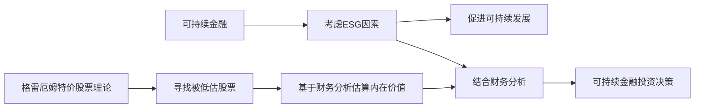

# 格雷厄姆特价股票理论在可持续金融中的应用

> 关键词：格雷厄姆特价股票理论、可持续金融、价值投资、财务分析、社会责任投资

> 摘要：本文深入探讨了格雷厄姆特价股票理论在可持续金融领域的应用。首先介绍了该理论的背景及可持续金融的发展现状，阐述了相关核心概念及其联系。接着详细讲解了格雷厄姆特价股票理论的核心算法原理，并给出具体操作步骤和Python代码示例。通过数学模型和公式对其进行进一步剖析，并举例说明。在项目实战部分，展示了如何搭建开发环境，实现源代码并进行解读分析。随后探讨了该理论在可持续金融中的实际应用场景，推荐了相关的学习资源、开发工具和论文著作。最后总结了未来的发展趋势与挑战，还提供了常见问题解答和扩展阅读参考资料，旨在为投资者和金融从业者在可持续金融投资中运用格雷厄姆特价股票理论提供全面的指导。

## 1. 背景介绍 
### 1.1 目的和范围
本研究的主要目的是探索格雷厄姆特价股票理论在可持续金融领域的应用可能性和实际效果。格雷厄姆特价股票理论作为价值投资的经典理论，为投资者寻找被低估的股票提供了一套有效的方法。而可持续金融强调在投资决策中综合考虑环境、社会和治理（ESG）因素，追求长期的可持续发展和社会价值。将两者结合起来，不仅有助于投资者在实现财务回报的同时，也能促进社会的可持续发展。

本研究的范围涵盖了格雷厄姆特价股票理论的基本原理、可持续金融的概念和发展趋势，以及两者结合的具体应用场景和方法。通过理论分析、案例研究和实证检验，深入探讨如何在可持续金融框架下运用格雷厄姆特价股票理论进行投资决策。

### 1.2 预期读者
本文预期读者包括金融投资者、投资分析师、金融从业者、可持续发展领域的研究人员以及对价值投资和可持续金融感兴趣的学生和爱好者。对于投资者来说，本文可以为他们提供一种新的投资思路和方法，帮助他们在可持续金融领域寻找更有价值的投资机会。对于金融从业者和研究人员来说，本文可以为他们的研究和实践提供参考，推动可持续金融理论和实践的发展。

### 1.3 文档结构概述
本文共分为十个部分。第一部分介绍了研究的背景、目的、预期读者和文档结构概述。第二部分阐述了格雷厄姆特价股票理论和可持续金融的核心概念及其联系。第三部分详细讲解了格雷厄姆特价股票理论的核心算法原理，并给出具体操作步骤和Python代码示例。第四部分通过数学模型和公式对该理论进行进一步剖析，并举例说明。第五部分是项目实战，展示了如何搭建开发环境，实现源代码并进行解读分析。第六部分探讨了该理论在可持续金融中的实际应用场景。第七部分推荐了相关的学习资源、开发工具和论文著作。第八部分总结了未来的发展趋势与挑战。第九部分提供了常见问题解答。第十部分是扩展阅读和参考资料。

### 1.4 术语表
#### 1.4.1 核心术语定义
- **格雷厄姆特价股票理论**：由本杰明·格雷厄姆（Benjamin Graham）提出的一种价值投资理论，该理论认为股票的内在价值是由公司的财务状况和盈利能力决定的，投资者应该寻找那些市场价格低于其内在价值的股票进行投资。
- **可持续金融**：指在金融决策中充分考虑环境、社会和治理（ESG）因素，以实现经济、社会和环境的可持续发展。可持续金融包括绿色金融、社会责任投资、影响力投资等多种形式。
- **价值投资**：一种投资策略，强调通过分析公司的基本面，寻找被低估的股票进行投资，以获得长期的投资回报。
- **内在价值**：指股票所代表的公司的真实价值，通常通过对公司的财务报表、盈利能力、资产负债状况等进行分析来估算。
- **ESG因素**：环境（Environmental）、社会（Social）和治理（Governance）因素的简称，是评估公司可持续发展能力的重要指标。

#### 1.4.2 相关概念解释
- **财务分析**：通过对公司的财务报表进行分析，评估公司的财务状况、盈利能力和偿债能力等。财务分析是格雷厄姆特价股票理论的重要组成部分，用于估算股票的内在价值。
- **社会责任投资**：一种投资策略，投资者在选择投资对象时，不仅考虑财务回报，还会考虑公司的社会责任表现，如环境保护、员工福利、社区发展等。
- **绿色金融**：指为支持环境改善、应对气候变化和资源节约高效利用的经济活动，即对环保、节能、清洁能源、绿色交通、绿色建筑等领域的项目投融资、项目运营、风险管理等所提供的金融服务。

#### 1.4.3 缩略词列表
- **ESG**：环境、社会和治理（Environmental, Social and Governance）
- **P/E**：市盈率（Price-to-Earnings Ratio）
- **P/B**：市净率（Price-to-Book Ratio）
- **ROE**：净资产收益率（Return on Equity）

## 2. 核心概念与联系 

### 2.1 格雷厄姆特价股票理论原理
格雷厄姆特价股票理论的核心思想是寻找被市场低估的股票，即市场价格低于其内在价值的股票。格雷厄姆认为，股票的内在价值是由公司的财务状况和盈利能力决定的，而市场价格则受到投资者情绪、市场供求关系等因素的影响，因此市场价格可能会偏离其内在价值。投资者可以通过对公司的财务报表进行分析，估算股票的内在价值，然后选择那些市场价格低于内在价值的股票进行投资。

格雷厄姆提出了一系列的财务指标和分析方法来估算股票的内在价值，其中最著名的是“安全边际”原则。安全边际是指股票的内在价值与市场价格之间的差值，差值越大，说明股票的投资风险越小，投资价值越高。格雷厄姆认为，投资者应该在股票的市场价格低于其内在价值的一定比例（如20% - 30%）时才进行投资，以确保有足够的安全边际。

### 2.2 可持续金融概念
可持续金融是指在金融决策中充分考虑环境、社会和治理（ESG）因素，以实现经济、社会和环境的可持续发展。可持续金融的发展源于人们对传统金融模式的反思，传统金融模式往往只关注经济利益，而忽视了对环境和社会的影响。可持续金融通过将ESG因素纳入投资决策，引导资金流向那些具有良好社会和环境效益的项目和企业，促进经济的可持续发展。

可持续金融包括多种形式，如绿色金融、社会责任投资、影响力投资等。绿色金融主要关注环境保护和应对气候变化，通过提供金融支持来促进清洁能源、节能环保等领域的发展。社会责任投资则更注重公司的社会责任表现，投资者在选择投资对象时，会考虑公司的员工福利、社区发展、人权保障等方面的情况。影响力投资则是一种更加积极主动的投资方式，投资者不仅关注投资的财务回报，还希望通过投资来实现特定的社会和环境目标。

### 2.3 两者联系的示意图


从示意图可以看出，格雷厄姆特价股票理论和可持续金融并不是相互独立的，而是可以相互结合的。在可持续金融投资决策中，可以运用格雷厄姆特价股票理论的财务分析方法来估算股票的内在价值，同时结合ESG因素对股票进行筛选，选择那些既具有投资价值又符合可持续发展原则的股票进行投资。

## 3. 核心算法原理 & 具体操作步骤 

### 3.1 核心算法原理
格雷厄姆特价股票理论的核心算法是估算股票的内在价值。格雷厄姆提出了多种估算内在价值的方法，其中一种较为简单的方法是使用市盈率（P/E）和市净率（P/B）等财务指标。

股票的内在价值 $V$ 可以通过以下公式估算：

$V = EPS \times P/E_{normal} \times f$

其中，$EPS$ 是每股收益，$P/E_{normal}$ 是行业平均市盈率，$f$ 是一个调整系数，通常根据公司的财务状况和增长前景等因素进行调整。

另一种方法是使用市净率（P/B）：

$V = BVPS \times P/B_{normal} \times g$

其中，$BVPS$ 是每股账面价值，$P/B_{normal}$ 是行业平均市净率，$g$ 是一个调整系数。

### 3.2 具体操作步骤
1. **数据收集**：收集公司的财务报表数据，包括每股收益（EPS）、每股账面价值（BVPS）等，以及行业平均市盈率（P/E）和市净率（P/B）等数据。
2. **计算内在价值**：根据上述公式计算股票的内在价值。
3. **比较市场价格和内在价值**：将计算得到的内在价值与股票的市场价格进行比较，如果市场价格低于内在价值，则说明股票可能被低估。
4. **结合ESG因素筛选**：在确定了被低估的股票后，结合ESG因素对这些股票进行筛选，选择那些具有良好ESG表现的股票进行投资。

### 3.3 Python代码示例
```python
import pandas as pd

# 假设我们已经收集到了以下数据
# 每股收益
eps = 2.5
# 行业平均市盈率
pe_normal = 15
# 调整系数
f = 0.8
# 每股账面价值
bvps = 10
# 行业平均市净率
pb_normal = 2
# 调整系数
g = 0.9
# 股票市场价格
market_price = 30

# 计算内在价值（使用市盈率法）
intrinsic_value_pe = eps * pe_normal * f

# 计算内在价值（使用市净率法）
intrinsic_value_pb = bvps * pb_normal * g

# 取两种方法计算结果的平均值作为最终内在价值
intrinsic_value = (intrinsic_value_pe + intrinsic_value_pb) / 2

# 判断股票是否被低估
if market_price < intrinsic_value:
    is_undervalued = True
else:
    is_undervalued = False

# 输出结果
print(f"使用市盈率法计算的内在价值: {intrinsic_value_pe}")
print(f"使用市净率法计算的内在价值: {intrinsic_value_pb}")
print(f"最终内在价值: {intrinsic_value}")
print(f"股票是否被低估: {is_undervalued}")
```

在上述代码中，我们首先定义了所需的数据，然后分别使用市盈率法和市净率法计算了股票的内在价值，取两者的平均值作为最终内在价值。最后，将最终内在价值与股票的市场价格进行比较，判断股票是否被低估。

## 4. 数学模型和公式 & 详细讲解 & 举例说明 

### 4.1 数学模型和公式
#### 4.1.1 市盈率法
股票的内在价值 $V_{pe}$ 计算公式为：

$V_{pe} = EPS \times P/E_{normal} \times f$

其中：
- $EPS$（Earnings Per Share）：每股收益，是指公司净利润除以发行在外的普通股股数，反映了公司每股普通股的盈利能力。
- $P/E_{normal}$（Price-to-Earnings Ratio）：行业平均市盈率，是指同行业公司股票的平均市盈率，反映了市场对该行业公司盈利能力的预期。
- $f$：调整系数，通常根据公司的财务状况、增长前景、竞争优势等因素进行调整。调整系数的取值范围一般在0 - 1之间，公司的财务状况越好、增长前景越乐观，调整系数越接近1。

#### 4.1.2 市净率法
股票的内在价值 $V_{pb}$ 计算公式为：

$V_{pb} = BVPS \times P/B_{normal} \times g$

其中：
- $BVPS$（Book Value Per Share）：每股账面价值，是指公司净资产除以发行在外的普通股股数，反映了公司每股普通股所代表的净资产价值。
- $P/B_{normal}$（Price-to-Book Ratio）：行业平均市净率，是指同行业公司股票的平均市净率，反映了市场对该行业公司净资产价值的预期。
- $g$：调整系数，同样根据公司的财务状况、资产质量、发展潜力等因素进行调整。

#### 4.1.3 综合内在价值
综合内在价值 $V$ 可以取市盈率法和市净率法计算结果的平均值：

$V = \frac{V_{pe} + V_{pb}}{2}$

### 4.2 详细讲解
- **每股收益（EPS）**：EPS是衡量公司盈利能力的重要指标。较高的EPS表示公司盈利能力较强，通常会对应较高的股票内在价值。但需要注意的是，EPS可能会受到会计政策、非经常性损益等因素的影响，因此在使用时需要进行调整和分析。
- **行业平均市盈率（P/E）和市净率（P/B）**：行业平均市盈率和市净率反映了市场对该行业公司的整体估值水平。不同行业的市盈率和市净率可能会有很大差异，因此在使用时需要选择合适的行业进行比较。
- **调整系数（f 和 g）**：调整系数是为了考虑公司的个体差异而设置的。例如，一家公司具有较强的竞争优势、良好的财务状况和较高的增长潜力，那么其调整系数可以适当提高；反之，如果公司面临较大的竞争压力、财务状况不佳或增长前景不明朗，调整系数则应适当降低。

### 4.3 举例说明
假设我们要分析一家制造业公司的股票。通过查阅财务报表，我们得到该公司的每股收益 $EPS = 3$ 元，每股账面价值 $BVPS = 15$ 元。经过调查，该行业的平均市盈率 $P/E_{normal} = 18$，平均市净率 $P/B_{normal} = 2.5$。根据对该公司的分析，我们认为其财务状况良好，增长前景乐观，因此调整系数 $f = 0.9$，$g = 0.95$。

首先，使用市盈率法计算内在价值：

$V_{pe} = EPS \times P/E_{normal} \times f = 3 \times 18 \times 0.9 = 48.6$（元）

然后，使用市净率法计算内在价值：

$V_{pb} = BVPS \times P/B_{normal} \times g = 15 \times 2.5 \times 0.95 = 35.625$（元）

最后，计算综合内在价值：

$V = \frac{V_{pe} + V_{pb}}{2} = \frac{48.6 + 35.625}{2} = 42.1125$（元）

如果该股票的市场价格为38元，由于市场价格低于综合内在价值，说明该股票可能被低估，具有一定的投资价值。

## 5. 项目实战：代码实际案例和详细解释说明 

### 5.1  开发环境搭建
#### 5.1.1 安装Python
首先，需要安装Python编程语言。可以从Python官方网站（https://www.python.org/downloads/）下载适合自己操作系统的Python安装包，按照安装向导进行安装。建议安装Python 3.6及以上版本。

#### 5.1.2 安装必要的库
在本项目中，我们需要使用一些Python库来处理数据和进行分析，例如 `pandas`、`numpy` 等。可以使用以下命令来安装这些库：

```sh
pip install pandas numpy
```

### 5.2  源代码详细实现和代码解读
```python
import pandas as pd
import numpy as np

# 定义数据类来存储公司财务数据和行业数据
class CompanyData:
    def __init__(self, eps, bvps, market_price):
        self.eps = eps
        self.bvps = bvps
        self.market_price = market_price

class IndustryData:
    def __init__(self, pe_normal, pb_normal):
        self.pe_normal = pe_normal
        self.pb_normal = pb_normal

# 定义计算内在价值的函数
def calculate_intrinsic_value(company_data, industry_data, f=0.8, g=0.9):
    # 市盈率法计算内在价值
    intrinsic_value_pe = company_data.eps * industry_data.pe_normal * f
    # 市净率法计算内在价值
    intrinsic_value_pb = company_data.bvps * industry_data.pb_normal * g
    # 综合内在价值
    intrinsic_value = (intrinsic_value_pe + intrinsic_value_pb) / 2
    return intrinsic_value

# 定义判断股票是否被低估的函数
def is_undervalued(company_data, intrinsic_value):
    return company_data.market_price < intrinsic_value

# 示例数据
company_data = CompanyData(eps=2.5, bvps=10, market_price=30)
industry_data = IndustryData(pe_normal=15, pb_normal=2)

# 计算内在价值
intrinsic_value = calculate_intrinsic_value(company_data, industry_data)

# 判断股票是否被低估
undervalued = is_undervalued(company_data, intrinsic_value)

# 输出结果
print(f"计算得到的内在价值: {intrinsic_value}")
print(f"股票是否被低估: {undervalued}")
```

### 5.3  代码解读与分析
- **数据类定义**：`CompanyData` 类用于存储公司的财务数据，包括每股收益（EPS）、每股账面价值（BVPS）和股票市场价格。`IndustryData` 类用于存储行业数据，包括行业平均市盈率（P/E）和市净率（P/B）。
- **计算内在价值函数**：`calculate_intrinsic_value` 函数接受公司数据和行业数据作为输入，同时可以指定调整系数 $f$ 和 $g$，默认值分别为0.8和0.9。该函数分别使用市盈率法和市净率法计算内在价值，然后取平均值作为综合内在价值。
- **判断股票是否被低估函数**：`is_undervalued` 函数接受公司数据和内在价值作为输入，比较股票的市场价格和内在价值，如果市场价格低于内在价值，则返回 `True`，表示股票被低估；否则返回 `False`。
- **示例数据和计算**：在代码的最后部分，我们定义了示例数据，调用 `calculate_intrinsic_value` 函数计算内在价值，然后调用 `is_undervalued` 函数判断股票是否被低估，并输出结果。

通过这个项目实战，我们可以看到如何使用Python代码实现格雷厄姆特价股票理论的核心算法，以及如何判断股票是否被低估。在实际应用中，可以根据需要扩展代码，例如从数据库或文件中读取数据，处理多个股票数据等。

## 6. 实际应用场景 
### 6.1 可持续投资组合构建
在构建可持续投资组合时，投资者可以运用格雷厄姆特价股票理论来筛选被低估的股票，同时结合ESG因素对这些股票进行评估。例如，投资者可以先使用格雷厄姆的财务分析方法筛选出具有较低市盈率、市净率和较高净资产收益率的股票，然后对这些股票进行ESG评级，选择那些ESG表现良好的股票纳入投资组合。这样可以在追求财务回报的同时，也能促进社会的可持续发展。

### 6.2 社会责任投资决策
对于社会责任投资者来说，他们不仅关注投资的财务回报，还希望通过投资来实现特定的社会和环境目标。格雷厄姆特价股票理论可以帮助他们在众多的投资对象中找到那些被低估的股票，同时结合ESG因素来评估这些股票是否符合他们的社会责任投资标准。例如，投资者可以选择那些在环境保护、员工福利、社区发展等方面表现良好的被低估股票进行投资，既实现了财务回报，又为社会做出了贡献。

### 6.3 企业可持续发展评估
企业可以运用格雷厄姆特价股票理论和ESG分析来评估自身的可持续发展能力。通过对公司的财务报表进行分析，计算股票的内在价值，企业可以了解自身的财务状况和盈利能力。同时，通过对ESG因素的评估，企业可以发现自身在环境、社会和治理方面存在的问题和不足，从而采取相应的措施加以改进，提高企业的可持续发展能力。

### 6.4 金融机构风险管理
金融机构在进行贷款、投资等业务时，需要考虑客户的信用风险和可持续发展能力。格雷厄姆特价股票理论和ESG分析可以帮助金融机构更好地评估客户的风险状况。例如，金融机构可以使用格雷厄姆的财务分析方法评估客户的财务状况和偿债能力，同时结合ESG因素评估客户的环境和社会风险。对于那些财务状况良好、ESG表现优秀的客户，金融机构可以给予更优惠的贷款条件或更积极的投资支持；而对于那些财务状况不佳、ESG风险较高的客户，金融机构则可以采取相应的风险控制措施。

## 7. 工具和资源推荐
### 7.1 学习资源推荐
#### 7.1.1 书籍推荐
- 《聪明的投资者》（The Intelligent Investor）：本杰明·格雷厄姆的经典著作，详细阐述了价值投资的理论和方法，是学习格雷厄姆特价股票理论的必读之书。
- 《可持续金融》（Sustainable Finance）：全面介绍了可持续金融的概念、发展历程、理论和实践，对于了解可持续金融领域有很大的帮助。
- 《ESG投资：从入门到精通》（ESG Investing: A Primer）：系统介绍了ESG投资的相关知识和方法，包括ESG评级、投资策略、风险管理等内容。

#### 7.1.2 在线课程
- Coursera平台上的“价值投资基础”（Foundations of Value Investing）课程：由知名教授授课，深入讲解价值投资的基本原理和方法。
- edX平台上的“可持续金融与投资”（Sustainable Finance and Investment）课程：介绍可持续金融的前沿理论和实践案例，帮助学习者了解可持续金融的发展趋势和投资策略。
- Udemy平台上的“ESG投资实战”（ESG Investing in Practice）课程：通过实际案例和操作演示，帮助学习者掌握ESG投资的具体方法和技巧。

#### 7.1.3 技术博客和网站
- 晨星网（Morningstar）：提供丰富的金融数据和研究报告，包括股票分析、基金评级、ESG评估等内容，是投资者获取信息和进行研究的重要平台。
- 彭博社（Bloomberg）：全球知名的财经媒体，提供及时的金融新闻、市场数据和分析评论，对于了解金融市场动态和可持续金融发展趋势有很大的帮助。
- 可持续金融国际平台（International Platform on Sustainable Finance，IPSF）：专注于可持续金融领域的研究和交流，提供相关的政策文件、研究报告和案例分析。

### 7.2 开发工具框架推荐
#### 7.2.1 IDE和编辑器
- PyCharm：一款专业的Python集成开发环境（IDE），提供丰富的代码编辑、调试、版本控制等功能，适合开发Python金融分析程序。
- Jupyter Notebook：一种交互式的开发环境，支持Python、R等多种编程语言，适合进行数据探索、分析和可视化。
- Visual Studio Code：一款轻量级的代码编辑器，支持多种编程语言和插件扩展，具有丰富的功能和良好的用户体验。

#### 7.2.2 调试和性能分析工具
- pdb：Python内置的调试器，可以帮助开发者在代码中设置断点、单步执行、查看变量值等，方便调试程序。
- cProfile：Python标准库中的性能分析工具，可以帮助开发者分析程序的性能瓶颈，找出耗时较长的代码段。
- Py-Spy：一款轻量级的Python性能分析工具，可以实时监测Python程序的运行状态，生成性能分析报告。

#### 7.2.3 相关框架和库
- pandas：Python中用于数据处理和分析的重要库，提供了高效的数据结构和数据操作方法，适合处理金融数据。
- numpy：Python中用于科学计算的基础库，提供了高效的数组操作和数学函数，是许多数据分析和机器学习库的基础。
- scikit-learn：Python中用于机器学习的开源框架，提供了丰富的机器学习算法和工具，可用于金融数据的建模和预测。

### 7.3 相关论文著作推荐
#### 7.3.1 经典论文
- Graham, B., & Dodd, D. L. (1934). Security Analysis. This classic book laid the foundation for value investing and introduced many of the concepts and methods still used today.
- Friede, G., Busch, T., & Bassen, A. (2015). ESG and financial performance: aggregated evidence from more than 2000 empirical studies. Journal of Sustainable Finance & Investment, 5(4), 210-233. This paper provides a comprehensive review of the relationship between ESG factors and financial performance.

#### 7.3.2 最新研究成果
- Khan, M., Serafeim, G., & Yoon, A. (2016). Corporate sustainability: First evidence on materiality. The Accounting Review, 91(6), 1697-1724. This paper explores the concept of materiality in corporate sustainability and its impact on financial performance.
- Eccles, R. G., & Stroehle, C. (2018). The impact of sustainability on corporate performance: A meta-analysis. Journal of Cleaner Production, 196, 1070-1083. This meta-analysis examines the relationship between sustainability and corporate performance based on a large number of empirical studies.

#### 7.3.3 应用案例分析
- Global Reporting Initiative (GRI). (2018). Sustainability reporting: A guide for companies. This guide provides practical examples and best practices for companies to report on their sustainability performance.
- United Nations Principles for Responsible Investment (PRI). (2019). Case studies on responsible investment. This collection of case studies showcases how investors are integrating ESG factors into their investment decision-making processes.

## 8. 总结：未来发展趋势与挑战
### 8.1 未来发展趋势
#### 8.1.1 融合发展趋势加强
未来，格雷厄姆特价股票理论与可持续金融的融合将更加深入。随着投资者对可持续发展的关注度不断提高，他们将更加注重在投资决策中综合考虑财务因素和ESG因素。格雷厄姆特价股票理论的财务分析方法将与ESG评估体系更加紧密地结合，形成一套更加完善的可持续投资分析框架。

#### 8.1.2 数字化和智能化应用加速
随着金融科技的不断发展，数字化和智能化技术将在格雷厄姆特价股票理论和可持续金融领域得到更广泛的应用。例如，利用大数据和人工智能技术可以更高效地收集、分析和处理金融数据和ESG信息，提高投资决策的准确性和效率。同时，智能投顾等新兴金融服务模式也将为投资者提供更加个性化、智能化的可持续投资解决方案。

#### 8.1.3 国际合作与标准统一
可持续金融是一个全球性的议题，需要各国之间加强合作和协调。未来，国际社会将更加注重可持续金融标准的统一和规范，制定更加统一的ESG评级标准和信息披露要求。这将有助于提高可持续金融市场的透明度和可比性，促进全球可持续金融的健康发展。

### 8.2 挑战
#### 8.2.1 ESG数据质量和可比性问题
目前，ESG数据的质量和可比性仍然是一个挑战。不同的ESG评级机构采用的评估方法和指标体系可能存在差异，导致ESG评级结果缺乏可比性。此外，一些企业的ESG信息披露不够规范和透明，也影响了ESG数据的质量。解决这些问题需要加强ESG数据标准的制定和规范，提高企业的ESG信息披露意识和能力。

#### 8.2.2 可持续投资的短期业绩压力
在实际投资中，可持续投资可能面临短期业绩压力。由于可持续投资通常需要考虑更多的非财务因素，可能会导致投资组合的短期表现不如传统投资组合。这可能会影响投资者对可持续投资的信心和积极性。解决这个问题需要投资者树立长期投资的理念，认识到可持续投资在长期内可以带来更好的风险调整后回报。

#### 8.2.3 法律法规和政策支持不足
目前，可持续金融领域的法律法规和政策支持还不够完善。一些国家和地区缺乏明确的可持续金融政策和监管框架，这在一定程度上限制了可持续金融的发展。未来，需要政府加强政策引导和监管，出台更多支持可持续金融发展的法律法规和政策措施，为可持续金融的发展创造良好的政策环境。

## 9. 附录：常见问题与解答
### 9.1 格雷厄姆特价股票理论适用于所有行业吗？
格雷厄姆特价股票理论的基本原理适用于大多数行业，但不同行业的财务特征和估值方法可能会有所不同。例如，一些新兴行业（如科技行业）的企业可能具有较高的增长潜力，但盈利能力可能相对较弱，此时传统的市盈率和市净率等指标可能不太适用。在应用格雷厄姆特价股票理论时，需要根据不同行业的特点进行适当的调整和分析。

### 9.2 如何获取准确的ESG数据？
可以通过以下途径获取ESG数据：
- **企业披露**：许多企业会在其年度报告、可持续发展报告中披露相关的ESG信息。
- **ESG评级机构**：如晨星、MSCI等专业的ESG评级机构会提供企业的ESG评级和相关数据。
- **第三方数据提供商**：一些专门的数据提供商也会收集和整理ESG数据，为投资者提供服务。

### 9.3 可持续投资一定能获得更高的回报吗？
可持续投资并不一定能保证获得更高的回报。虽然一些研究表明，具有良好ESG表现的企业在长期内可能具有更好的财务表现，但投资回报仍然受到多种因素的影响，如市场环境、行业竞争、企业经营管理等。可持续投资更注重的是在追求财务回报的同时，实现社会和环境的可持续发展。

### 9.4 如何判断调整系数（f 和 g）的取值？
调整系数（f 和 g）的取值需要根据公司的具体情况进行判断。一般来说，可以考虑以下因素：
- **财务状况**：公司的资产负债状况、盈利能力、现金流等。
- **增长前景**：公司所处行业的发展趋势、市场份额、新产品研发等。
- **竞争优势**：公司的品牌、技术、专利等竞争优势。
- **ESG表现**：公司在环境、社会和治理方面的表现。

可以通过对这些因素的综合分析，结合经验和判断来确定调整系数的取值。

## 10. 扩展阅读 & 参考资料
### 10.1 扩展阅读
- 《金融炼金术》（The Alchemy of Finance）：乔治·索罗斯（George Soros）的著作，探讨了金融市场的不确定性和反射性原理，对于理解金融市场的运行机制有很大的帮助。
- 《小狗钱钱》（The Little Dog That Could）：一本适合初学者的理财启蒙书籍，以生动有趣的方式介绍了理财的基本知识和方法。
- 《原则》（Principles）：瑞·达利欧（Ray Dalio）的著作，分享了他在投资和生活中的原则和经验，对于投资者和个人成长都有很大的启示。

### 10.2 参考资料
- Graham, B. (1949). The Intelligent Investor. HarperBusiness.
- Kiernan, M. (2012). Investing in a Sustainable World: The Financial Professional's Guide to ESG. Wiley.
- Eccles, R. G., & Klimenko, I. (2019). The Impact of Sustainability on Corporate Performance: A Meta-Analysis. MIT Sloan Management Review.
- Global Reporting Initiative (GRI). (2021). Sustainability Reporting Standards.
- United Nations Principles for Responsible Investment (PRI). (2021). Reporting Framework.