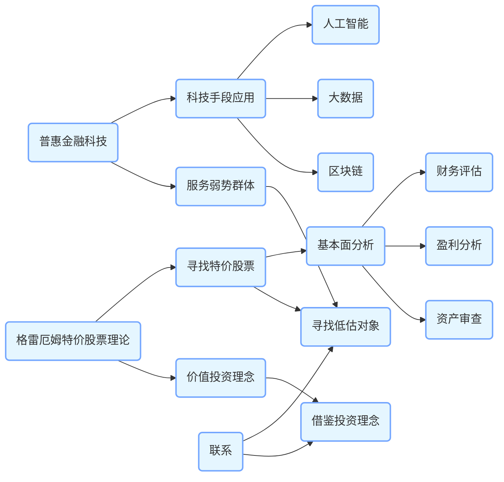

# 格雷厄姆特价股票理论对普惠金融科技的启示

> 关键词：格雷厄姆特价股票理论、普惠金融科技、价值投资、金融创新、风险控制

> 摘要：本文深入探讨了格雷厄姆特价股票理论对普惠金融科技的启示。首先介绍了格雷厄姆特价股票理论的背景和核心概念，分析其与普惠金融科技的联系。接着阐述了该理论的核心算法原理及相关数学模型，通过实际案例展示如何在普惠金融科技中应用。探讨了其在实际应用场景中的作用，推荐了相关学习资源、开发工具和研究论文。最后总结了未来发展趋势与挑战，解答常见问题并提供扩展阅读和参考资料，旨在为普惠金融科技的发展提供有价值的思路和方法。

## 1. 背景介绍 
### 1.1 目的和范围
本文章的目的在于深入研究格雷厄姆特价股票理论，并挖掘其对普惠金融科技的启示。通过对该理论的核心概念、算法原理、数学模型等方面的分析，探讨如何将其应用于普惠金融科技领域，以促进普惠金融科技的创新和发展。范围涵盖了从理论基础到实际应用的多个层面，包括理论的介绍、在普惠金融科技中的具体应用案例、相关工具和资源的推荐等。

### 1.2 预期读者
本文预期读者包括金融科技领域的从业者，如金融分析师、科技开发者、产品经理等，他们希望从格雷厄姆特价股票理论中获取灵感，应用于普惠金融科技产品和服务的开发。同时，也适合对金融科技和价值投资感兴趣的研究者、学生以及普通投资者，帮助他们了解该理论在普惠金融科技中的潜在应用和价值。

### 1.3 文档结构概述
本文将按照以下结构展开：首先介绍格雷厄姆特价股票理论和普惠金融科技的背景知识，包括相关术语和概念的解释。接着阐述核心概念及其联系，通过文本示意图和 Mermaid 流程图进行展示。然后详细讲解核心算法原理和具体操作步骤，并用 Python 代码进行示例。之后介绍相关的数学模型和公式，并举例说明。通过实际项目案例，展示该理论在普惠金融科技中的应用，包括开发环境搭建、源代码实现和代码解读。探讨该理论在不同实际应用场景中的作用，推荐相关的学习资源、开发工具和研究论文。最后总结未来发展趋势与挑战，解答常见问题并提供扩展阅读和参考资料。

### 1.4 术语表
#### 1.4.1 核心术语定义
- **格雷厄姆特价股票理论**：由本杰明·格雷厄姆提出的一种价值投资理论，强调通过分析公司的基本面，寻找价格低于内在价值的股票进行投资。
- **普惠金融科技**：将金融科技手段应用于普惠金融领域，旨在为广大人群，特别是弱势群体提供便捷、高效、低成本的金融服务。
- **价值投资**：一种投资策略，通过评估资产的内在价值，寻找被低估的资产进行投资，以获取长期的投资回报。
- **内在价值**：资产在未来所能产生的现金流的现值，是评估资产真实价值的重要指标。

#### 1.4.2 相关概念解释
- **基本面分析**：通过研究公司的财务报表、行业前景、管理团队等基本面因素，评估公司的价值和投资潜力。
- **金融科技**：利用科技手段创新金融服务和产品，提高金融效率和服务质量，包括人工智能、区块链、大数据等技术的应用。
- **普惠金融**：旨在为社会各阶层和群体提供公平、合理、可获得的金融服务，特别是为低收入人群、小微企业等弱势群体提供金融支持。

#### 1.4.3 缩略词列表
- **AI**：Artificial Intelligence，人工智能
- **BD**：Big Data，大数据
- **FinTech**：Financial Technology，金融科技

## 2. 核心概念与联系 

### 格雷厄姆特价股票理论核心概念
格雷厄姆特价股票理论的核心是寻找价格低于内在价值的股票。格雷厄姆认为，市场有时会出现非理性的波动，导致股票价格偏离其内在价值。投资者可以通过深入的基本面分析，评估公司的内在价值，选择那些被市场低估的股票进行投资。内在价值的评估通常基于公司的财务状况、盈利能力、资产质量等因素。例如，通过分析公司的净利润、净资产、现金流等指标，计算出公司的合理价值范围。如果股票的市场价格低于这个合理价值范围，那么该股票就可能是一个“特价股票”，具有投资价值。

### 普惠金融科技核心概念
普惠金融科技是将金融科技与普惠金融相结合的产物。它利用先进的科技手段，如人工智能、大数据、区块链等，提高金融服务的效率和可获得性，降低金融服务的成本，为广大人群提供更加便捷、高效、个性化的金融服务。例如，通过大数据分析，可以更准确地评估客户的信用风险，为小微企业和低收入人群提供贷款服务；利用区块链技术，可以实现金融交易的透明化和安全化，降低金融交易的成本和风险。

### 两者的联系
格雷厄姆特价股票理论与普惠金融科技之间存在着一定的联系。在普惠金融科技中，同样需要寻找那些具有潜在价值但被市场低估的金融服务对象或项目。例如，一些小微企业由于缺乏足够的抵押物和信用记录，往往被传统金融机构忽视，但实际上它们可能具有良好的发展前景和盈利能力。通过借鉴格雷厄姆特价股票理论的思想，普惠金融科技可以利用大数据和人工智能等技术，对这些小微企业进行全面的评估，挖掘它们的潜在价值，为它们提供金融支持。同时，在投资决策方面，普惠金融科技也可以参考格雷厄姆的价值投资理念，选择那些具有长期投资价值的项目，避免盲目跟风和投机行为。

### 文本示意图
```plaintext
格雷厄姆特价股票理论
|-- 寻找价格低于内在价值的股票
|   |-- 基本面分析
|       |-- 财务状况评估
|       |-- 盈利能力分析
|       |-- 资产质量审查
|-- 价值投资理念

普惠金融科技
|-- 利用科技手段提供普惠金融服务
|   |-- 人工智能
|   |-- 大数据
|   |-- 区块链
|-- 为弱势群体提供金融支持

联系
|-- 寻找被低估的金融服务对象或项目
|-- 借鉴价值投资理念进行投资决策
```

### Mermaid 流程图


## 3. 核心算法原理 & 具体操作步骤 

### 格雷厄姆特价股票理论核心算法原理
格雷厄姆特价股票理论的核心算法原理是计算股票的内在价值，并与市场价格进行比较。一种常见的计算内在价值的方法是使用股息折现模型（Dividend Discount Model，DDM）。该模型假设股票的价值等于其未来股息的现值之和。公式如下：

$V = \frac{D_1}{(1 + r)^1} + \frac{D_2}{(1 + r)^2} + \cdots + \frac{D_n}{(1 + r)^n}$

其中，$V$ 表示股票的内在价值，$D_i$ 表示第 $i$ 期的股息，$r$ 表示折现率。

另一种方法是使用市盈率（Price-to-Earnings Ratio，P/E）和市净率（Price-to-Book Ratio，P/B）等指标进行估值。例如，格雷厄姆认为，一只具有投资价值的股票，其市盈率应该低于一定的阈值，市净率也应该在合理范围内。

### 具体操作步骤

#### 步骤 1：收集数据
收集目标公司的财务报表，包括资产负债表、利润表和现金流量表。同时，收集行业数据和市场数据，以便进行比较和分析。

#### 步骤 2：进行基本面分析
- **财务状况评估**：分析公司的资产负债结构、偿债能力、营运能力等指标。例如，计算资产负债率、流动比率、存货周转率等。
- **盈利能力分析**：评估公司的净利润、毛利率、净利率等指标。观察公司的盈利增长趋势和稳定性。
- **资产质量审查**：检查公司的固定资产、无形资产、应收账款等资产的质量。关注资产的折旧、减值情况。

#### 步骤 3：计算内在价值
根据收集的数据和分析结果，选择合适的估值方法计算股票的内在价值。可以使用股息折现模型、市盈率法、市净率法等多种方法进行综合评估。

#### 步骤 4：比较内在价值和市场价格
将计算得到的内在价值与股票的市场价格进行比较。如果市场价格低于内在价值，且差距较大，则该股票可能是一个“特价股票”，具有投资价值。

#### 步骤 5：做出投资决策
根据比较结果，结合自己的投资目标和风险承受能力，做出是否投资的决策。

### Python 代码示例
```python
import pandas as pd

# 假设我们有一个包含公司财务数据的 DataFrame
data = {
    'Year': [2018, 2019, 2020, 2021],
    'Dividend': [1.0, 1.2, 1.3, 1.5],
    'Earnings': [5.0, 5.5, 6.0, 6.5],
    'BookValue': [20.0, 22.0, 24.0, 26.0]
}
df = pd.DataFrame(data)

# 步骤 1：计算股息增长率
dividend_growth_rate = (df['Dividend'].iloc[-1] / df['Dividend'].iloc[0]) ** (1 / (len(df) - 1)) - 1

# 步骤 2：假设折现率为 10%
discount_rate = 0.1

# 步骤 3：使用股息折现模型计算内在价值
# 假设股息以固定增长率增长
n_years = 5
intrinsic_value = 0
for i in range(1, n_years + 1):
    dividend = df['Dividend'].iloc[-1] * (1 + dividend_growth_rate) ** i
    present_value = dividend / ((1 + discount_rate) ** i)
    intrinsic_value += present_value

# 步骤 4：假设当前市场价格为 30
market_price = 30

# 步骤 5：比较内在价值和市场价格
if intrinsic_value > market_price:
    print("该股票可能是特价股票，具有投资价值。")
else:
    print("该股票可能不具有投资价值。")
```

## 4. 数学模型和公式 & 详细讲解 & 举例说明 

### 股息折现模型（DDM）
#### 公式
$V = \frac{D_1}{(1 + r)^1} + \frac{D_2}{(1 + r)^2} + \cdots + \frac{D_n}{(1 + r)^n}$

其中，$V$ 表示股票的内在价值，$D_i$ 表示第 $i$ 期的股息，$r$ 表示折现率。

#### 详细讲解
股息折现模型的基本思想是，股票的价值等于其未来股息的现值之和。因为投资者购买股票的目的是为了获得未来的股息收益，所以将未来的股息按照一定的折现率折现到当前时刻，就可以得到股票的内在价值。折现率 $r$ 反映了投资者对投资风险的预期，风险越高，折现率越高。

#### 举例说明
假设一只股票预计未来三年的股息分别为 $D_1 = 1$ 元，$D_2 = 1.2$ 元，$D_3 = 1.3$ 元，折现率 $r = 0.1$。则该股票的内在价值为：

$V = \frac{1}{(1 + 0.1)^1} + \frac{1.2}{(1 + 0.1)^2} + \frac{1.3}{(1 + 0.1)^3}$

$V = \frac{1}{1.1} + \frac{1.2}{1.21} + \frac{1.3}{1.331}$

$V \approx 0.909 + 0.992 + 0.977$

$V \approx 2.878$（元）

如果该股票的市场价格低于 2.878 元，则可能具有投资价值。

### 市盈率（P/E）法
#### 公式
$P/E = \frac{Price}{Earnings\ per\ Share}$

其中，$P/E$ 表示市盈率，$Price$ 表示股票的市场价格，$Earnings\ per\ Share$ 表示每股收益。

#### 详细讲解
市盈率是衡量股票估值的常用指标之一。它反映了投资者为获得每股收益所愿意支付的价格。一般来说，市盈率越低，股票越被低估；市盈率越高，股票越被高估。但市盈率也受到行业特点、公司成长前景等因素的影响，不同行业的市盈率水平可能存在较大差异。

#### 举例说明
假设一家公司的股票市场价格为 20 元，每股收益为 2 元，则该股票的市盈率为：

$P/E = \frac{20}{2} = 10$

如果该行业的平均市盈率为 15，则该股票可能被低估，具有一定的投资价值。

### 市净率（P/B）法
#### 公式
$P/B = \frac{Price}{Book\ Value\ per\ Share}$

其中，$P/B$ 表示市净率，$Price$ 表示股票的市场价格，$Book\ Value\ per\ Share$ 表示每股净资产。

#### 详细讲解
市净率反映了股票价格与每股净资产的关系。每股净资产是公司的账面价值，代表了公司的实际资产价值。市净率越低，说明股票价格相对于每股净资产越低，股票可能被低估。但市净率也不能单独作为投资决策的依据，还需要结合其他因素进行综合分析。

#### 举例说明
假设一家公司的股票市场价格为 15 元，每股净资产为 10 元，则该股票的市净率为：

$P/B = \frac{15}{10} = 1.5$

如果该行业的平均市净率为 2，则该股票可能被低估，具有一定的投资价值。

## 5. 项目实战：代码实际案例和详细解释说明 

### 5.1  开发环境搭建
#### 操作系统
可以选择 Windows、Linux 或 macOS 操作系统。建议使用较新版本的操作系统，以确保系统的稳定性和兼容性。

#### 编程语言
选择 Python 作为开发语言。Python 具有丰富的库和工具，适合进行数据分析和金融计算。

#### 开发工具
推荐使用 Anaconda 作为 Python 开发环境的管理工具。Anaconda 包含了 Python 解释器、常用的科学计算库（如 Pandas、Numpy）以及 Jupyter Notebook 等开发工具。可以从 Anaconda 官方网站下载并安装适合自己操作系统的版本。

#### 数据获取
可以使用第三方数据接口获取金融数据，如雅虎财经、Tushare 等。以 Tushare 为例，可以通过以下步骤安装和使用：
```bash
pip install tushare
```

### 5.2  源代码详细实现和代码解读
```python
import tushare as ts
import pandas as pd

# 设置 Tushare 的 token
ts.set_token('your_token')
pro = ts.pro_api()

# 步骤 1：获取股票的基本信息
def get_stock_basic():
    data = pro.stock_basic(exchange='', list_status='L', fields='ts_code,symbol,name,industry')
    return data

# 步骤 2：获取股票的财务数据
def get_financial_data(ts_code):
    # 获取利润表数据
    income = pro.income(ts_code=ts_code, fields='ts_code,end_date,n_income')
    # 获取资产负债表数据
    balance = pro.balancesheet(ts_code=ts_code, fields='ts_code,end_date,total_assets,total_liab')
    # 获取现金流量表数据
    cashflow = pro.cashflow(ts_code=ts_code, fields='ts_code,end_date,n_cashflow_act')
    return income, balance, cashflow

# 步骤 3：计算内在价值（使用简单的市盈率法）
def calculate_intrinsic_value(income, market_price):
    # 取最近一期的净利润
    latest_income = income['n_income'].iloc[0]
    # 假设行业平均市盈率为 15
    industry_pe = 15
    # 计算每股收益
    # 这里假设总股本为 1 亿股，实际应用中需要获取真实的总股本数据
    total_shares = 100000000
    eps = latest_income / total_shares
    # 计算内在价值
    intrinsic_value = eps * industry_pe
    return intrinsic_value

# 步骤 4：筛选特价股票
def select_bargain_stocks():
    stock_basic = get_stock_basic()
    bargain_stocks = []
    for index, row in stock_basic.iterrows():
        ts_code = row['ts_code']
        income, balance, cashflow = get_financial_data(ts_code)
        if not income.empty:
            # 假设可以通过其他方式获取市场价格
            market_price = 20  # 这里简单假设市场价格为 20
            intrinsic_value = calculate_intrinsic_value(income, market_price)
            if intrinsic_value > market_price:
                bargain_stocks.append(ts_code)
    return bargain_stocks

# 步骤 5：执行筛选
bargain_stocks = select_bargain_stocks()
print("特价股票列表：", bargain_stocks)
```

### 5.3  代码解读与分析
#### 代码功能概述
这段代码的主要功能是筛选出可能的特价股票。首先，通过 Tushare 接口获取股票的基本信息和财务数据。然后，使用简单的市盈率法计算股票的内在价值。最后，将内在价值与市场价格进行比较，筛选出内在价值大于市场价格的股票。

#### 代码详细解读
- **get_stock_basic 函数**：使用 Tushare 的 `stock_basic` 接口获取所有上市股票的基本信息，包括股票代码、名称、行业等。
- **get_financial_data 函数**：根据股票代码，使用 Tushare 的 `income`、`balancesheet` 和 `cashflow` 接口分别获取股票的利润表、资产负债表和现金流量表数据。
- **calculate_intrinsic_value 函数**：使用简单的市盈率法计算股票的内在价值。首先取最近一期的净利润，计算每股收益，然后乘以假设的行业平均市盈率得到内在价值。
- **select_bargain_stocks 函数**：遍历所有股票，调用上述函数获取财务数据并计算内在价值，将内在价值大于市场价格的股票添加到特价股票列表中。
- **主程序**：调用 `select_bargain_stocks` 函数执行筛选，并打印出特价股票列表。

#### 注意事项
- 在实际应用中，需要替换 `your_token` 为自己的 Tushare token。
- 市场价格的获取需要使用更准确的方法，可以通过其他数据接口或金融平台获取。
- 总股本数据需要使用真实的数据，而不是简单假设。
- 市盈率法只是一种简单的估值方法，实际应用中可以结合多种方法进行综合评估。

## 6. 实际应用场景 
### 小微企业融资评估
在普惠金融科技中，为小微企业提供融资服务是一个重要的应用场景。传统金融机构在评估小微企业的信用风险时，往往依赖于抵押物和历史信用记录，这使得很多小微企业难以获得融资支持。借鉴格雷厄姆特价股票理论的思想，可以利用大数据和人工智能等技术，对小微企业的基本面进行全面评估，挖掘其潜在价值。例如，通过分析小微企业的财务报表、经营数据、市场前景等因素，计算其内在价值。如果一家小微企业虽然目前规模较小，但具有良好的盈利能力和发展前景，其内在价值可能被低估。金融科技公司可以根据评估结果，为这些小微企业提供融资支持，帮助它们发展壮大。

### 个人消费金融服务
在个人消费金融领域，也可以应用格雷厄姆特价股票理论的思想。例如，金融科技公司可以通过分析消费者的信用数据、消费行为、收入状况等因素，评估消费者的信用风险和潜在价值。对于那些信用良好、消费需求合理但可能由于某些原因被传统金融机构忽视的消费者，金融科技公司可以为他们提供个性化的消费金融服务。通过挖掘这些消费者的潜在价值，金融科技公司可以扩大客户群体，提高金融服务的覆盖率。

### 金融产品投资组合管理
在金融产品投资组合管理中，格雷厄姆特价股票理论可以帮助投资者选择具有投资价值的金融产品。金融科技公司可以利用大数据和人工智能技术，对各种金融产品进行基本面分析和估值，筛选出被低估的金融产品。然后，根据投资者的风险偏好和投资目标，构建合理的投资组合。通过分散投资和选择优质的金融产品，投资者可以降低投资风险，提高投资回报。

### 农村金融服务
农村金融是普惠金融的重要组成部分。在农村地区，很多农民和农村企业由于缺乏金融知识和抵押物，难以获得金融服务。金融科技公司可以借鉴格雷厄姆特价股票理论的思想，对农村地区的金融服务对象进行全面评估。例如，通过分析农村企业的农产品产量、市场价格、经营管理水平等因素，评估其内在价值。对于那些具有发展潜力但资金短缺的农村企业和农民，金融科技公司可以提供小额贷款、保险等金融服务，促进农村经济的发展。

## 7. 工具和资源推荐
### 7.1 学习资源推荐
#### 7.1.1 书籍推荐
- 《聪明的投资者》（The Intelligent Investor）：本杰明·格雷厄姆的经典著作，详细阐述了价值投资的理念和方法，是学习格雷厄姆特价股票理论的必读之书。
- 《金融科技：架构与实践》：全面介绍了金融科技的相关知识，包括人工智能、大数据、区块链等技术在金融领域的应用，适合对金融科技感兴趣的读者。
- 《Python 金融数据分析实战》：通过实际案例介绍了如何使用 Python 进行金融数据分析，包括数据获取、清洗、分析和可视化等方面的内容，对于学习金融科技编程有很大帮助。

#### 7.1.2 在线课程
- Coursera 上的“Financial Technology (FinTech): Foundations and Applications”：由知名教授授课，系统介绍了金融科技的基础知识和应用案例。
- edX 上的“Introduction to Computational Finance and Financial Econometrics”：讲解了计算金融和金融计量经济学的相关知识，对于理解金融科技中的数学模型和算法有很大帮助。
- 网易云课堂上的“Python 金融量化分析实战”：通过实际项目案例，介绍了如何使用 Python 进行金融量化分析，适合有一定 Python 基础的学习者。

#### 7.1.3 技术博客和网站
- 金融科技前沿（https://www.fintech前沿.com）：提供金融科技领域的最新动态、技术文章和行业报告，是了解金融科技发展趋势的重要渠道。
- 雪球财经（https://xueqiu.com）：一个专注于股票投资和金融分析的社区，用户可以在上面分享投资经验、交流投资心得，对于学习价值投资和金融分析有很大帮助。
- 量化投资与金融科技（https://www.quanttech.cn）：专注于量化投资和金融科技领域的技术分享和交流，提供了很多实用的技术文章和代码示例。

### 7.2 开发工具框架推荐
#### 7.2.1 IDE和编辑器
- PyCharm：一款专业的 Python 集成开发环境，具有强大的代码编辑、调试和分析功能，适合开发大型的金融科技项目。
- Jupyter Notebook：一个交互式的编程环境，支持 Python、R 等多种编程语言，非常适合进行数据探索和分析。
- Visual Studio Code：一款轻量级的代码编辑器，支持多种编程语言和插件扩展，对于快速开发和调试金融科技代码非常方便。

#### 7.2.2 调试和性能分析工具
- Py-Spy：一个用于 Python 代码性能分析的工具，可以帮助开发者找出代码中的性能瓶颈，提高代码的运行效率。
- PDB：Python 自带的调试器，可以帮助开发者定位和解决代码中的问题。
- Memory Profiler：一个用于分析 Python 代码内存使用情况的工具，可以帮助开发者优化代码的内存占用。

#### 7.2.3 相关框架和库
- Pandas：一个强大的数据分析库，提供了丰富的数据结构和数据处理方法，适合进行金融数据的清洗、分析和可视化。
- Numpy：一个用于科学计算的库，提供了高效的数组操作和数学函数，是很多金融科技算法的基础。
- Scikit-learn：一个机器学习库，提供了多种机器学习算法和工具，适合进行金融风险评估、信用评分等任务。

### 7.3 相关论文著作推荐
#### 7.3.1 经典论文
- “The Security Analysis” by Benjamin Graham and David Dodd：格雷厄姆和多德的经典著作，奠定了价值投资的理论基础，对金融分析和投资决策具有重要的指导意义。
- “Efficient Capital Markets: A Review of Theory and Empirical Work” by Eugene F. Fama：该论文提出了有效市场假说，对金融市场的定价机制和投资策略产生了深远影响。
- “A Random Walk Down Wall Street” by Burton G. Malkiel：阐述了随机漫步理论，认为股票价格的波动是随机的，难以预测，对传统的技术分析方法提出了挑战。

#### 7.3.2 最新研究成果
- “FinTech and the Remaking of Financial Institutions” by Xavier Freixas, Luc Laeven, and Paul Wachtel：该研究探讨了金融科技对金融机构的影响和重塑，分析了金融科技在支付、信贷、投资等领域的应用和发展趋势。
- “Artificial Intelligence in Finance: Applications and Implications” by Richard S. Wilson and Paul B. Milgrom：介绍了人工智能在金融领域的应用，包括风险评估、投资决策、客户服务等方面，分析了人工智能对金融行业的影响和挑战。
- “Blockchain Technology in Financial Services: A Systematic Literature Review” by Arshad J. Ansari, Shamsul Azhar Abbas, and Mohd Azmi Hassan：对区块链技术在金融服务领域的应用进行了系统的文献综述，分析了区块链技术的优势和挑战，以及在支付、清算、证券交易等方面的应用前景。

#### 7.3.3 应用案例分析
- “Case Studies in FinTech Innovation” edited by Mark J. Schueffel：通过实际案例分析了金融科技的创新应用，包括移动支付、数字货币、智能投顾等领域的案例，为金融科技的实践提供了参考和借鉴。
- “FinTech in Emerging Markets: Opportunities and Challenges” by Thorsten Beck and Asli Demirgüç-Kunt：分析了金融科技在新兴市场的应用和发展，探讨了新兴市场在金融科技领域面临的机遇和挑战，以及如何利用金融科技促进经济发展和金融包容。
- “The Impact of FinTech on Traditional Banking: A Case Study of China” by Chenggang Xu and Frank Packer：以中国为例，分析了金融科技对传统银行业的影响，探讨了传统银行如何应对金融科技的挑战，实现转型升级。

## 8. 总结：未来发展趋势与挑战
### 未来发展趋势
#### 技术融合创新
未来，格雷厄姆特价股票理论与普惠金融科技将进一步与人工智能、区块链、物联网等新兴技术深度融合。例如，利用人工智能的深度学习算法，可以更准确地分析金融数据，挖掘潜在的特价金融服务对象；区块链技术可以提高金融交易的透明度和安全性，降低交易成本；物联网技术可以实现金融服务与实体产业的深度融合，为普惠金融提供更多的应用场景。

#### 个性化金融服务
随着大数据和人工智能技术的发展，普惠金融科技将能够为客户提供更加个性化的金融服务。根据客户的风险偏好、投资目标、财务状况等因素，为客户量身定制金融产品和服务方案。例如，为小微企业提供定制化的融资方案，为个人投资者提供个性化的投资组合建议。

#### 国际化发展
普惠金融科技具有跨越地域和文化的特点，未来将呈现国际化发展的趋势。金融科技公司将在全球范围内开展业务，为不同国家和地区的客户提供金融服务。同时，国际间的金融科技合作也将日益加强，共同推动普惠金融的发展。

#### 生态化发展
普惠金融科技将形成一个完整的生态系统，包括金融科技公司、传统金融机构、科技企业、监管机构等各方参与者。各方将相互合作、相互依存，共同推动普惠金融科技的发展。例如，金融科技公司与传统金融机构合作，利用传统金融机构的资金和客户资源，结合金融科技公司的技术优势，提供更加优质的金融服务。

### 挑战
#### 数据安全和隐私保护
随着普惠金融科技的发展，大量的金融数据被收集和使用，数据安全和隐私保护成为了一个重要的挑战。金融科技公司需要加强数据安全管理，采取有效的技术手段和管理制度，保护客户的个人信息和金融数据不被泄露和滥用。

#### 技术风险
新兴技术的应用也带来了一定的技术风险。例如，人工智能算法的不透明性和可解释性问题，可能导致金融决策的失误；区块链技术的性能和扩展性问题，可能影响金融交易的效率。金融科技公司需要加强技术研发和创新，解决技术风险问题。

#### 监管合规
普惠金融科技的发展需要在监管合规的框架内进行。由于金融科技的创新性和复杂性，监管政策往往滞后于技术发展。金融科技公司需要密切关注监管政策的变化，加强与监管机构的沟通和合作，确保业务的合规运营。

#### 人才短缺
普惠金融科技的发展需要既懂金融又懂技术的复合型人才。目前，市场上这类人才相对短缺，成为了制约普惠金融科技发展的一个重要因素。金融科技公司需要加强人才培养和引进，提高团队的整体素质和创新能力。

## 9. 附录：常见问题与解答
### 问题 1：格雷厄姆特价股票理论是否适用于所有市场？
解答：格雷厄姆特价股票理论的基本思想是寻找价格低于内在价值的投资机会，这一思想在大多数市场中都具有一定的适用性。然而，不同市场的特点和环境可能会有所不同，例如市场的有效性、投资者的行为模式、宏观经济环境等。在一些新兴市场或不成熟的市场中，市场的有效性可能较低，价格波动较大，这可能会增加寻找特价股票的难度。但同时，也可能存在更多的投资机会。因此，在应用格雷厄姆特价股票理论时，需要结合具体的市场情况进行分析和调整。

### 问题 2：普惠金融科技如何保证数据的准确性和可靠性？
解答：普惠金融科技公司可以通过多种方式保证数据的准确性和可靠性。首先，在数据采集阶段，选择可靠的数据来源，如权威的金融机构、政府部门等。同时，采用数据清洗和预处理技术，去除数据中的噪声和错误信息。在数据存储和管理方面，建立完善的数据安全体系，确保数据的完整性和保密性。此外，定期对数据进行审计和验证，及时发现和纠正数据中的问题。还可以利用数据分析和机器学习技术，对数据进行质量评估和预测，提高数据的可靠性。

### 问题 3：如何衡量普惠金融科技项目的投资回报率？
解答：衡量普惠金融科技项目的投资回报率可以从多个方面进行考虑。首先，可以从财务指标方面进行评估，如净现值（NPV）、内部收益率（IRR）等。通过预测项目的未来现金流量，并按照一定的折现率进行折现，计算出项目的净现值和内部收益率。如果净现值大于零，内部收益率大于行业平均水平，则说明项目具有较好的投资回报率。此外，还可以考虑非财务指标，如客户满意度、市场份额、社会影响力等。普惠金融科技项目的目标不仅仅是追求经济效益，还包括提高金融服务的覆盖率和可获得性，促进社会公平和经济发展。因此，综合考虑财务指标和非财务指标，可以更全面地衡量普惠金融科技项目的投资回报率。

### 问题 4：金融科技公司如何应对监管政策的变化？
解答：金融科技公司应对监管政策的变化可以采取以下措施。首先，加强与监管机构的沟通和合作，及时了解监管政策的动态和要求。建立良好的沟通机制，定期向监管机构汇报业务情况，听取监管机构的意见和建议。其次，加强内部合规管理，建立健全的合规制度和流程，确保业务的合规运营。加强员工的合规培训，提高员工的合规意识。此外，积极参与行业自律组织，遵守行业规范和标准，共同推动行业的健康发展。在产品和服务创新方面，要充分考虑监管政策的要求，确保创新活动在合规的前提下进行。

## 10. 扩展阅读 & 参考资料
### 扩展阅读
- 《金融科技时代的创新与监管》：深入探讨了金融科技时代的创新模式和监管挑战，分析了如何在创新和监管之间找到平衡。
- 《价值投资实战手册》：结合实际案例，详细介绍了价值投资的实战方法和技巧，对于理解格雷厄姆特价股票理论的应用具有很大帮助。
- 《数字金融：科技重塑金融未来》：介绍了数字金融的发展趋势和应用场景，包括移动支付、数字货币、智能投顾等领域的内容，为普惠金融科技的发展提供了新的思路。

### 参考资料
- Graham, Benjamin, and David Dodd. Security Analysis. McGraw-Hill, 1934.
- Fama, Eugene F. "Efficient Capital Markets: A Review of Theory and Empirical Work." The Journal of Finance, vol. 25, no. 2, 1970, pp. 383-417.
- Malkiel, Burton G. A Random Walk Down Wall Street. W. W. Norton & Company, 1973.
- Tushare 官方文档：https://tushare.pro/document/1
- Pandas 官方文档：https://pandas.pydata.org/docs/
- Numpy 官方文档：https://numpy.org/doc/
- Scikit-learn 官方文档：https://scikit-learn.org/stable/documentation.html