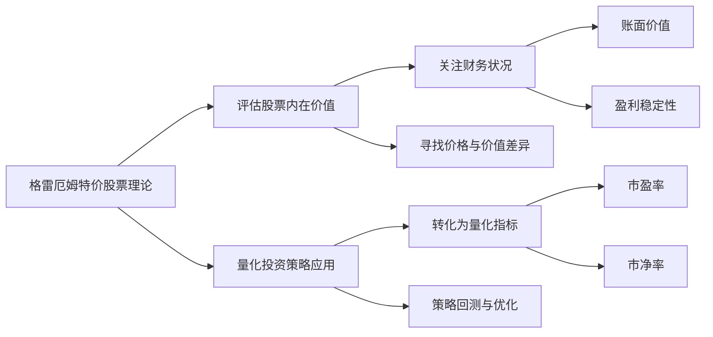

# 格雷厄姆特价股票理论对量化投资策略的影响

> 关键词：格雷厄姆特价股票理论、量化投资策略、价值投资、财务指标、市场效率

> 摘要：本文深入探讨了格雷厄姆特价股票理论对量化投资策略的影响。首先介绍了格雷厄姆特价股票理论的背景和核心概念，接着分析了该理论与量化投资策略的联系，阐述了基于该理论构建量化投资策略的核心算法原理和具体操作步骤，并通过数学模型和公式进行详细讲解。通过项目实战案例展示了如何将理论应用于实际投资中，同时探讨了该理论在不同实际应用场景中的作用。还推荐了相关的学习资源、开发工具框架和论文著作。最后总结了该理论在量化投资领域的未来发展趋势与挑战，并对常见问题进行了解答，提供了扩展阅读和参考资料。

## 1. 背景介绍 
### 1.1 目的和范围
本部分旨在全面分析格雷厄姆特价股票理论对量化投资策略的影响。范围涵盖该理论的核心概念、如何融入量化投资策略、实际应用案例以及相关的工具和资源等方面。通过深入研究，为投资者和研究者提供关于该理论在量化投资领域应用的全面理解和实践指导。

### 1.2 预期读者
本文预期读者包括量化投资领域的专业人士，如量化分析师、投资经理等，他们希望深入了解格雷厄姆特价股票理论在量化策略中的应用；也包括对量化投资感兴趣的研究者，如金融专业的学生和学者，希望通过本文获取相关理论和实践的知识；同时，对于有一定投资经验，想要尝试量化投资的个人投资者也具有参考价值。

### 1.3 文档结构概述
本文共分为十个部分。第一部分为背景介绍，包括目的和范围、预期读者、文档结构概述和术语表。第二部分阐述核心概念与联系，介绍格雷厄姆特价股票理论和量化投资策略的核心概念及其相互关系，并通过示意图和流程图展示。第三部分讲解核心算法原理和具体操作步骤，使用 Python 代码详细阐述。第四部分通过数学模型和公式对相关原理进行详细讲解并举例说明。第五部分进行项目实战，包括开发环境搭建、源代码实现和代码解读。第六部分探讨实际应用场景。第七部分推荐相关的学习资源、开发工具框架和论文著作。第八部分总结未来发展趋势与挑战。第九部分为附录，解答常见问题。第十部分提供扩展阅读和参考资料。

### 1.4 术语表
#### 1.4.1 核心术语定义
- **格雷厄姆特价股票理论**：由本杰明·格雷厄姆提出，该理论认为股票存在内在价值，当股票价格低于其内在价值一定程度时，即为特价股票，具有投资价值。
- **量化投资策略**：利用数学模型和计算机算法，基于大量历史数据进行分析和回测，制定投资决策的策略。
- **价值投资**：一种投资理念，强调关注股票的内在价值，通过分析公司的基本面，寻找被低估的股票进行投资。

#### 1.4.2 相关概念解释
- **内在价值**：股票的真实价值，通常通过对公司的财务状况、盈利能力、行业前景等因素进行综合分析得出。
- **财务指标**：用于衡量公司财务状况和经营业绩的指标，如市盈率（P/E）、市净率（P/B）等。
- **市场效率**：市场价格反映资产真实价值的程度。有效市场假说认为市场价格能够迅速反映所有可用信息。

#### 1.4.3 缩略词列表
- **P/E**：市盈率（Price-to-Earnings Ratio）
- **P/B**：市净率（Price-to-Book Ratio）
- **ROE**：净资产收益率（Return on Equity）

## 2. 核心概念与联系 

### 2.1 格雷厄姆特价股票理论核心概念
格雷厄姆特价股票理论的核心在于寻找被市场低估的股票。格雷厄姆认为，股票的价格和内在价值之间存在差异，当股票价格显著低于其内在价值时，就形成了投资机会。他提出了一系列评估股票内在价值的方法，主要基于公司的财务状况和盈利能力。例如，他强调关注公司的账面价值、盈利稳定性等因素。

### 2.2 量化投资策略核心概念
量化投资策略是利用计算机技术和数学模型，对大量历史数据进行分析和处理，以寻找投资机会和制定投资决策的过程。量化投资策略通常包括数据采集、模型构建、回测和优化等步骤。通过量化分析，可以减少人为因素的干扰，提高投资决策的科学性和准确性。

### 2.3 两者的联系
格雷厄姆特价股票理论为量化投资策略提供了重要的理论基础。量化投资可以通过计算机算法，将格雷厄姆的投资理念转化为具体的量化指标和规则。例如，可以通过计算股票的市盈率、市净率等指标，筛选出符合格雷厄姆特价股票标准的股票。同时，量化投资的数据分析和回测功能可以对基于格雷厄姆理论构建的策略进行验证和优化，提高策略的有效性和稳定性。

### 2.4 文本示意图
```plaintext
格雷厄姆特价股票理论
|-- 评估股票内在价值
|   |-- 关注财务状况
|   |   |-- 账面价值
|   |   |-- 盈利稳定性
|   |-- 寻找价格与价值差异
|
|-- 量化投资策略应用
|   |-- 转化为量化指标
|   |   |-- 市盈率
|   |   |-- 市净率
|   |-- 策略回测与优化
```

### 2.5 Mermaid 流程图


## 3. 核心算法原理 & 具体操作步骤 

### 3.1 核心算法原理
基于格雷厄姆特价股票理论构建量化投资策略的核心算法原理是通过计算一系列财务指标，筛选出符合特价股票标准的股票。主要步骤包括数据采集、指标计算和股票筛选。

### 3.2 具体操作步骤
#### 3.2.1 数据采集
使用 Python 的第三方库，如 `pandas-datareader` 或 `tushare` 来获取股票的历史价格数据和财务数据。以下是使用 `pandas-datareader` 获取股票价格数据的示例代码：
```python
import pandas as pd
import pandas_datareader.data as web

# 设置时间范围
start_date = '2020-01-01'
end_date = '2023-12-31'

# 获取股票数据
stock_symbol = 'AAPL'
df = web.DataReader(stock_symbol, 'yahoo', start_date, end_date)
print(df.head())
```
#### 3.2.2 指标计算
计算关键的财务指标，如市盈率（P/E）、市净率（P/B）等。以下是计算市盈率和市净率的示例代码：
```python
# 假设已经获取了每股收益（EPS）和每股净资产（BVPS）数据
eps = 5.0
bvps = 20.0
price = df['Close'].iloc[-1]

# 计算市盈率和市净率
pe_ratio = price / eps
pb_ratio = price / bvps

print(f"市盈率: {pe_ratio}")
print(f"市净率: {pb_ratio}")
```
#### 3.2.3 股票筛选
根据格雷厄姆的标准，筛选出市盈率和市净率低于一定阈值的股票。以下是筛选股票的示例代码：
```python
# 设定阈值
pe_threshold = 15
pb_threshold = 1.5

# 筛选股票
if pe_ratio < pe_threshold and pb_ratio < pb_threshold:
    print(f"{stock_symbol} 符合特价股票标准")
else:
    print(f"{stock_symbol} 不符合特价股票标准")
```

## 4. 数学模型和公式 & 详细讲解 & 举例说明 

### 4.1 市盈率（P/E）
#### 4.1.1 公式
市盈率的计算公式为：
$$P/E = \frac{股价}{每股收益}$$
#### 4.1.2 详细讲解
市盈率反映了投资者为获取公司每股收益所愿意支付的价格。较低的市盈率通常意味着股票被低估，具有较高的投资价值。但需要注意的是，不同行业的市盈率水平可能存在较大差异，因此在使用市盈率进行比较时，应选择同行业的公司进行对比。

#### 4.1.3 举例说明
假设某公司的股价为 50 元，每股收益为 5 元，则该公司的市盈率为：
$$P/E = \frac{50}{5} = 10$$
如果同行业的平均市盈率为 15，那么该公司的股票可能被低估。

### 4.2 市净率（P/B）
#### 4.2.1 公式
市净率的计算公式为：
$$P/B = \frac{股价}{每股净资产}$$
#### 4.2.2 详细讲解
市净率反映了公司的市场价值与账面价值之间的关系。较低的市净率通常意味着股票的价格相对其账面价值较低，可能存在投资机会。但同样需要注意不同行业的市净率水平差异。

#### 4.2.3 举例说明
假设某公司的股价为 30 元，每股净资产为 20 元，则该公司的市净率为：
$$P/B = \frac{30}{20} = 1.5$$
如果同行业的平均市净率为 2，那么该公司的股票可能被低估。

### 4.3 综合评估
在实际应用中，通常需要综合考虑市盈率和市净率等多个指标，以更准确地评估股票的投资价值。例如，可以设定一个综合评分系统，根据不同指标的权重计算股票的综合得分，得分越高的股票越具有投资价值。

## 5. 项目实战：代码实际案例和详细解释说明 

### 5.1  开发环境搭建
#### 5.1.1 安装 Python
首先需要安装 Python 开发环境，建议使用 Python 3.7 及以上版本。可以从 Python 官方网站（https://www.python.org/downloads/）下载并安装。

#### 5.1.2 安装必要的库
使用 `pip` 命令安装所需的第三方库，包括 `pandas`、`pandas-datareader`、`numpy` 等。示例命令如下：
```sh
pip install pandas pandas-datareader numpy
```

### 5.2  源代码详细实现和代码解读
以下是一个完整的基于格雷厄姆特价股票理论的量化投资策略的 Python 代码示例：
```python
import pandas as pd
import pandas_datareader.data as web
import numpy as np

# 定义函数获取股票数据
def get_stock_data(symbol, start_date, end_date):
    try:
        df = web.DataReader(symbol, 'yahoo', start_date, end_date)
        return df
    except Exception as e:
        print(f"获取 {symbol} 数据时出错: {e}")
        return None

# 定义函数计算财务指标
def calculate_financial_metrics(df, eps, bvps):
    price = df['Close'].iloc[-1]
    pe_ratio = price / eps
    pb_ratio = price / bvps
    return pe_ratio, pb_ratio

# 定义函数筛选股票
def screen_stocks(symbols, start_date, end_date, pe_threshold, pb_threshold):
    selected_stocks = []
    for symbol in symbols:
        df = get_stock_data(symbol, start_date, end_date)
        if df is not None:
            # 假设每股收益和每股净资产数据已知
            eps = 5.0
            bvps = 20.0
            pe_ratio, pb_ratio = calculate_financial_metrics(df, eps, bvps)
            if pe_ratio < pe_threshold and pb_ratio < pb_threshold:
                selected_stocks.append(symbol)
    return selected_stocks

# 主程序
if __name__ == "__main__":
    # 设置时间范围
    start_date = '2020-01-01'
    end_date = '2023-12-31'
    # 设定阈值
    pe_threshold = 15
    pb_threshold = 1.5
    # 股票列表
    symbols = ['AAPL', 'GOOG', 'MSFT']
    # 筛选股票
    selected_stocks = screen_stocks(symbols, start_date, end_date, pe_threshold, pb_threshold)
    print("符合特价股票标准的股票: ", selected_stocks)
```
### 5.3  代码解读与分析
- **`get_stock_data` 函数**：该函数用于从雅虎财经获取指定股票在指定时间范围内的历史价格数据。如果获取数据过程中出现错误，会打印错误信息并返回 `None`。
- **`calculate_financial_metrics` 函数**：该函数根据股票的收盘价、每股收益和每股净资产计算市盈率和市净率。
- **`screen_stocks` 函数**：该函数遍历股票列表，对每只股票计算财务指标，并根据设定的阈值筛选出符合特价股票标准的股票。
- **主程序**：设置时间范围、阈值和股票列表，调用 `screen_stocks` 函数进行股票筛选，并打印符合标准的股票。

## 6. 实际应用场景 
### 6.1 个人投资者
对于个人投资者来说，基于格雷厄姆特价股票理论的量化投资策略可以帮助他们更科学地选择投资标的。个人投资者可以使用上述代码示例，结合自己的投资偏好和风险承受能力，筛选出符合条件的股票进行投资。例如，一位风险偏好较低的个人投资者可以设定较为严格的市盈率和市净率阈值，选择被低估且具有稳定基本面的股票。

### 6.2 机构投资者
机构投资者可以利用该理论和量化策略进行大规模的资产配置。通过自动化的量化系统，对大量股票进行筛选和分析，提高投资决策的效率和准确性。例如，基金公司可以使用量化策略构建投资组合，分散风险并追求长期稳定的收益。

### 6.3 金融研究机构
金融研究机构可以利用该理论和量化策略进行市场研究和分析。通过对不同时期和不同市场环境下的股票数据进行回测和分析，验证格雷厄姆特价股票理论的有效性，并探索其在不同市场条件下的应用。同时，研究机构还可以根据研究结果为投资者提供投资建议和策略。

## 7. 工具和资源推荐
### 7.1 学习资源推荐
#### 7.1.1 书籍推荐
- 《聪明的投资者》（The Intelligent Investor）：本杰明·格雷厄姆的经典著作，详细阐述了价值投资的理念和方法，是学习格雷厄姆特价股票理论的必读之书。
- 《证券分析》（Security Analysis）：同样是格雷厄姆的重要著作，对证券的分析和估值方法进行了深入探讨。
- 《量化投资：策略与技术》：全面介绍了量化投资的基本概念、策略和技术，适合想要深入学习量化投资的读者。

#### 7.1.2 在线课程
- Coursera 上的“Quantitative Investing”：由知名教授授课，系统讲解量化投资的理论和实践。
- edX 上的“Financial Markets”：提供金融市场的基础知识和投资策略的讲解，对理解量化投资有很大帮助。

#### 7.1.3 技术博客和网站
- Seeking Alpha：提供大量的金融分析和投资建议，包括对价值投资和量化投资的讨论。
- QuantNet：专注于量化投资领域的社区，有很多专业人士分享经验和交流技术。

### 7.2 开发工具框架推荐
#### 7.2.1 IDE和编辑器
- PyCharm：一款功能强大的 Python 集成开发环境，提供代码编辑、调试、版本控制等功能，适合开发量化投资策略。
- Jupyter Notebook：一种交互式的开发环境，适合进行数据分析和模型验证，方便展示代码和结果。

#### 7.2.2 调试和性能分析工具
- PDB：Python 自带的调试器，可以帮助开发者定位代码中的问题。
- cProfile：用于分析 Python 代码的性能，找出性能瓶颈。

#### 7.2.3 相关框架和库
- Pandas：用于数据处理和分析，提供了高效的数据结构和数据操作方法。
- NumPy：用于科学计算，提供了高效的数组操作和数学函数。
- Scikit-learn：用于机器学习和数据分析，提供了各种机器学习算法和工具。

### 7.3 相关论文著作推荐
#### 7.3.1 经典论文
- “The Superinvestors of Graham-and-Doddsville”：沃伦·巴菲特撰写的论文，介绍了格雷厄姆价值投资方法的成功案例。
- “Common Stocks as Long-Term Investments”：埃德加·劳伦斯·史密斯的经典论文，为价值投资理论提供了重要的理论基础。

#### 7.3.2 最新研究成果
- 可以关注《Journal of Financial Economics》、《Review of Financial Studies》等金融领域的顶级学术期刊，获取关于量化投资和价值投资的最新研究成果。

#### 7.3.3 应用案例分析
- 一些金融研究机构和咨询公司会发布关于量化投资策略应用的案例分析报告，可以通过他们的官方网站获取相关资料。

## 8. 总结：未来发展趋势与挑战
### 8.1 未来发展趋势
- **数据驱动的深化**：随着大数据和人工智能技术的发展，量化投资策略将更加依赖于海量的金融数据和先进的数据分析方法。可以利用更多维度的数据，如社交媒体数据、卫星图像数据等，来挖掘投资机会。
- **多因子模型的完善**：未来的量化投资策略将不仅仅依赖于市盈率和市净率等传统因子，还会结合更多的因子，如动量因子、质量因子等，构建更加复杂和有效的多因子模型。
- **与其他领域的融合**：量化投资将与人工智能、机器学习、区块链等技术深度融合，创造出更加智能化、自动化的投资策略。例如，利用深度学习算法对金融市场进行预测和分析。

### 8.2 挑战
- **数据质量和可靠性**：量化投资依赖于大量的历史数据，但数据的质量和可靠性可能存在问题。不准确或不完整的数据可能导致模型的偏差和错误的投资决策。
- **市场变化的适应性**：金融市场是不断变化的，过去有效的量化策略在未来可能不再适用。因此，需要不断调整和优化策略，以适应市场的变化。
- **监管和合规问题**：随着量化投资的发展，监管机构对其监管力度也在加强。量化投资策略需要遵守相关的法律法规和监管要求，这对策略的开发和实施带来了一定的挑战。

## 9. 附录：常见问题与解答
### 9.1 如何获取准确的财务数据？
可以通过专业的金融数据提供商，如 Wind、Bloomberg 等获取准确的财务数据。也可以使用一些免费的数据源，如雅虎财经、新浪财经等，但需要注意数据的准确性和完整性。

### 9.2 量化投资策略一定能盈利吗？
量化投资策略并不能保证一定盈利。金融市场具有不确定性和复杂性，策略的有效性受到多种因素的影响，如市场环境、数据质量、模型假设等。因此，在使用量化投资策略时，需要进行充分的回测和风险评估。

### 9.3 如何优化量化投资策略？
可以通过以下方法优化量化投资策略：调整参数、增加因子、改进模型结构、进行多策略组合等。同时，需要不断进行回测和实盘验证，根据市场变化及时调整策略。

## 10. 扩展阅读 & 参考资料
### 10.1 扩展阅读
- 《漫步华尔街》（A Random Walk Down Wall Street）：介绍了有效市场假说和随机漫步理论，对理解金融市场的运行机制有很大帮助。
- 《黑天鹅》（The Black Swan）：探讨了极端事件对金融市场的影响，提醒投资者注意市场的不确定性。

### 10.2 参考资料
- 本杰明·格雷厄姆的著作和论文。
- 相关金融学术期刊上的研究论文。
- 量化投资领域的专业书籍和在线课程。