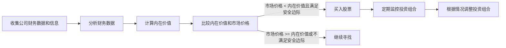

# 格雷厄姆特价股票策略在不同国家市场的应用

> 关键词：格雷厄姆特价股票策略、不同国家市场、价值投资、财务分析、市场差异

> 摘要：本文聚焦于格雷厄姆特价股票策略在不同国家市场的应用。首先介绍了格雷厄姆特价股票策略的背景和基本原理，接着分析了不同国家市场的特点和差异。通过核心算法原理和数学模型的阐述，详细讲解了该策略的实施步骤。结合项目实战案例，深入剖析了在不同市场中运用该策略的代码实现和效果。探讨了该策略在不同国家市场的实际应用场景，推荐了相关的学习资源、开发工具和研究论文。最后总结了该策略的未来发展趋势与挑战，并提供常见问题解答和参考资料，旨在为投资者和研究人员全面了解和应用格雷厄姆特价股票策略提供有价值的参考。

## 1. 背景介绍 
### 1.1 目的和范围
本研究的目的在于深入探讨格雷厄姆特价股票策略在不同国家市场的适用性、有效性和应用方法。通过对该策略在多个国家市场的研究，分析其在不同市场环境下的表现和潜在问题，为投资者提供更具针对性的投资建议，同时也为学术研究提供实证数据和理论支持。研究范围涵盖了全球多个具有代表性的国家市场，包括美国、中国、日本、英国等，对比不同市场的特点和该策略的应用效果。

### 1.2 预期读者
本文预期读者包括专业投资者、金融分析师、投资机构从业者、学术研究人员以及对价值投资和股票市场感兴趣的普通投资者。专业投资者可以从中获取在不同国家市场应用格雷厄姆特价股票策略的实践经验和优化建议；金融分析师能够借助文中的分析方法和数据对市场进行更深入的研究；投资机构从业者可以将其作为制定投资策略和风险管理的参考；学术研究人员可以在理论和实证方面得到启发；普通投资者可以通过通俗易懂的讲解了解该策略的基本原理和应用方法，提升投资知识和技能。

### 1.3 文档结构概述
本文共分为十个部分。第一部分为背景介绍，阐述了研究的目的、预期读者和文档结构概述，并对相关术语进行了定义和解释。第二部分介绍了格雷厄姆特价股票策略的核心概念与联系，包括原理和架构的文本示意图以及 Mermaid 流程图。第三部分详细讲解了核心算法原理和具体操作步骤，通过 Python 源代码进行了阐述。第四部分给出了数学模型和公式，并进行详细讲解和举例说明。第五部分是项目实战，包括开发环境搭建、源代码详细实现和代码解读以及代码分析。第六部分探讨了该策略在不同国家市场的实际应用场景。第七部分推荐了相关的学习资源、开发工具框架和论文著作。第八部分总结了该策略的未来发展趋势与挑战。第九部分为附录，提供常见问题与解答。第十部分列出了扩展阅读和参考资料。

### 1.4 术语表
#### 1.4.1 核心术语定义
- **格雷厄姆特价股票策略**：由本杰明·格雷厄姆（Benjamin Graham）提出的一种价值投资策略，该策略通过对股票的财务指标进行分析，寻找被市场低估的股票，以获取长期投资收益。
- **价值投资**：一种投资理念，强调通过对公司内在价值的评估，寻找价格低于其内在价值的股票进行投资，注重公司的基本面和长期发展潜力。
- **安全边际**：指股票的市场价格低于其内在价值的幅度，是格雷厄姆价值投资理论的核心概念之一，用于降低投资风险。
- **财务比率**：用于评估公司财务状况和经营绩效的一系列指标，如市盈率（P/E）、市净率（P/B）、股息率等。

#### 1.4.2 相关概念解释
- **内在价值**：公司的真实价值，是基于公司的资产、盈利能力、现金流等因素综合评估得出的价值。内在价值是价值投资的核心依据，投资者通过分析公司的基本面来估算其内在价值。
- **市场效率**：指市场价格反映所有可用信息的程度。在有效市场中，股票价格能够迅速、准确地反映公司的基本面信息，而在无效市场中，股票价格可能会偏离其内在价值，为价值投资者提供投资机会。
- **投资组合**：由多种资产组成的集合，通过分散投资可以降低风险。在应用格雷厄姆特价股票策略时，投资者通常会构建一个包含多只被低估股票的投资组合，以实现风险分散和收益最大化。

#### 1.4.3 缩略词列表
- **P/E**：市盈率（Price-to-Earnings Ratio），是股票价格与每股收益的比率，用于衡量股票的估值水平。
- **P/B**：市净率（Price-to-Book Ratio），是股票价格与每股净资产的比率，反映了股票价格相对于公司净资产的倍数。
- **ROE**：净资产收益率（Return on Equity），是净利润与股东权益的比率，衡量了公司运用自有资本的效率。

## 2. 核心概念与联系 
### 格雷厄姆特价股票策略的原理
格雷厄姆特价股票策略的核心思想是寻找被市场低估的股票，即股票的市场价格低于其内在价值。该策略基于以下几个基本原理：
1. **公司基本面分析**：通过对公司的财务报表、经营状况、行业前景等进行深入分析，评估公司的内在价值。格雷厄姆认为，公司的内在价值是由其资产、盈利能力和现金流等因素决定的。
2. **安全边际原则**：为了降低投资风险，格雷厄姆强调在投资时要留有足够的安全边际。即购买股票的价格要显著低于其内在价值，这样即使公司的经营出现一些问题，投资者也不会遭受重大损失。
3. **长期投资理念**：格雷厄姆认为，股票市场短期内可能会受到各种因素的影响而波动，但从长期来看，股票价格会回归其内在价值。因此，投资者应该采取长期投资的策略，耐心等待股票价格的上涨。

### 原理和架构的文本示意图
格雷厄姆特价股票策略的原理和架构可以用以下文本示意图表示：

首先，投资者需要收集公司的财务数据和相关信息，包括资产负债表、利润表、现金流量表等。然后，通过对这些数据的分析，计算出公司的内在价值。接着，将公司的内在价值与市场价格进行比较，如果市场价格低于内在价值，且满足一定的安全边际要求，则认为该股票是被低估的，可以考虑买入。最后，投资者需要对投资组合进行定期的监控和调整，以确保投资组合的合理性和有效性。

### Mermaid 流程图


## 3. 核心算法原理 & 具体操作步骤 
### 核心算法原理
格雷厄姆特价股票策略的核心算法主要包括以下几个步骤：
1. **财务指标计算**：计算公司的一系列财务指标，如市盈率（P/E）、市净率（P/B）、股息率等。这些指标可以反映公司的估值水平、盈利能力和分红情况。
2. **内在价值估算**：根据公司的财务指标和行业平均水平，估算公司的内在价值。常见的内在价值估算方法包括股息折现模型（DDM）、自由现金流折现模型（DCF）等。
3. **安全边际计算**：计算股票的安全边际，即内在价值与市场价格的差值。安全边际越大，说明股票的投资风险越低。
4. **股票筛选**：根据财务指标和安全边际的要求，筛选出符合条件的股票。

### 具体操作步骤
以下是使用 Python 实现格雷厄姆特价股票策略的具体操作步骤和源代码：

```python
import pandas as pd
import yfinance as yf

# 步骤 1: 收集公司财务数据
def get_financial_data(ticker):
    stock = yf.Ticker(ticker)
    financials = stock.financials
    balance_sheet = stock.balance_sheet
    cashflow = stock.cashflow
    return financials, balance_sheet, cashflow

# 步骤 2: 计算财务指标
def calculate_financial_ratios(financials, balance_sheet):
    # 计算市盈率（P/E）
    earnings_per_share = financials.loc['Net Income'] / balance_sheet.loc['Common Stock']
    market_price = yf.Ticker(ticker).history(period='1d')['Close'].iloc[-1]
    pe_ratio = market_price / earnings_per_share.iloc[-1]

    # 计算市净率（P/B）
    book_value_per_share = balance_sheet.loc['Total Stockholder Equity'] / balance_sheet.loc['Common Stock']
    pb_ratio = market_price / book_value_per_share.iloc[-1]

    # 计算股息率
    dividends = yf.Ticker(ticker).dividends
    dividend_yield = dividends.sum() / market_price

    return pe_ratio, pb_ratio, dividend_yield

# 步骤 3: 估算内在价值（简单示例，使用股息折现模型）
def estimate_intrinsic_value(dividend_yield, growth_rate, required_return):
    intrinsic_value = dividend_yield * (1 + growth_rate) / (required_return - growth_rate)
    return intrinsic_value

# 步骤 4: 计算安全边际
def calculate_safety_margin(intrinsic_value, market_price):
    safety_margin = (intrinsic_value - market_price) / intrinsic_value
    return safety_margin

# 步骤 5: 股票筛选
def screen_stocks(tickers, pe_threshold=15, pb_threshold=1.5, safety_margin_threshold=0.3):
    selected_stocks = []
    for ticker in tickers:
        try:
            financials, balance_sheet, cashflow = get_financial_data(ticker)
            pe_ratio, pb_ratio, dividend_yield = calculate_financial_ratios(financials, balance_sheet)
            # 简单假设增长率和要求回报率
            growth_rate = 0.05
            required_return = 0.1
            intrinsic_value = estimate_intrinsic_value(dividend_yield, growth_rate, required_return)
            safety_margin = calculate_safety_margin(intrinsic_value, yf.Ticker(ticker).history(period='1d')['Close'].iloc[-1])

            if pe_ratio < pe_threshold and pb_ratio < pb_threshold and safety_margin > safety_margin_threshold:
                selected_stocks.append(ticker)
        except:
            continue
    return selected_stocks

# 示例使用
tickers = ['AAPL', 'MSFT', 'GOOG']
selected_stocks = screen_stocks(tickers)
print("Selected stocks:", selected_stocks)
```

### 代码解释
1. **get_financial_data 函数**：使用 `yfinance` 库获取公司的财务数据，包括利润表、资产负债表和现金流量表。
2. **calculate_financial_ratios 函数**：根据财务数据计算公司的市盈率（P/E）、市净率（P/B）和股息率。
3. **estimate_intrinsic_value 函数**：使用股息折现模型估算公司的内在价值。
4. **calculate_safety_margin 函数**：计算股票的安全边际。
5. **screen_stocks 函数**：根据财务指标和安全边际的要求，筛选出符合条件的股票。

## 4. 数学模型和公式 & 详细讲解 & 举例说明 
### 数学模型和公式
#### 市盈率（P/E）
市盈率是股票价格与每股收益的比率，计算公式为：
$$P/E = \frac{Market\ Price\ per\ Share}{Earnings\ per\ Share}$$
其中，$Market\ Price\ per\ Share$ 是股票的市场价格，$Earnings\ per\ Share$ 是每股收益。

#### 市净率（P/B）
市净率是股票价格与每股净资产的比率，计算公式为：
$$P/B = \frac{Market\ Price\ per\ Share}{Book\ Value\ per\ Share}$$
其中，$Market\ Price\ per\ Share$ 是股票的市场价格，$Book\ Value\ per\ Share$ 是每股净资产。

#### 股息率
股息率是股息与股票价格的比率，计算公式为：
$$Dividend\ Yield = \frac{Annual\ Dividends\ per\ Share}{Market\ Price\ per\ Share}$$
其中，$Annual\ Dividends\ per\ Share$ 是每年的每股股息，$Market\ Price\ per\ Share$ 是股票的市场价格。

#### 股息折现模型（DDM）
股息折现模型是一种估算公司内在价值的方法，假设公司的股息以固定增长率 $g$ 增长，投资者要求的回报率为 $r$，则公司的内在价值 $V$ 计算公式为：
$$V = \frac{D_1}{r - g}$$
其中，$D_1$ 是下一期的股息，$r$ 是投资者要求的回报率，$g$ 是股息的固定增长率。

### 详细讲解
- **市盈率（P/E）**：市盈率反映了市场对公司盈利能力的预期。一般来说，市盈率较低的股票可能被低估，具有投资价值。但不同行业的市盈率水平可能存在较大差异，因此在使用市盈率进行估值时，需要结合行业平均水平进行分析。
- **市净率（P/B）**：市净率反映了股票价格相对于公司净资产的倍数。市净率较低的股票可能被低估，说明公司的资产价值较高。但市净率也受到行业特点和公司资产质量的影响，例如一些轻资产行业的市净率可能较高。
- **股息率**：股息率反映了公司的分红情况。较高的股息率说明公司能够为投资者提供稳定的现金流回报。股息率也可以作为衡量股票投资价值的一个指标。
- **股息折现模型（DDM）**：股息折现模型基于公司的股息分配情况来估算公司的内在价值。该模型的前提是公司的股息以固定增长率增长，且投资者要求的回报率稳定。但在实际应用中，公司的股息增长率和投资者要求的回报率可能会发生变化，因此需要对模型进行适当的调整。

### 举例说明
假设某公司的股票市场价格为 $50$ 美元，每股收益为 $5$ 美元，每股净资产为 $20$ 美元，每年的每股股息为 $2$ 美元，股息增长率为 $5\%$，投资者要求的回报率为 $10\%$。

- **市盈率（P/E）**：
$$P/E = \frac{50}{5} = 10$$
- **市净率（P/B）**：
$$P/B = \frac{50}{20} = 2.5$$
- **股息率**：
$$Dividend\ Yield = \frac{2}{50} = 0.04 = 4\%$$
- **股息折现模型（DDM）估算内在价值**：
首先计算下一期的股息 $D_1 = 2\times(1 + 0.05) = 2.1$ 美元。
然后计算内在价值 $V = \frac{2.1}{0.1 - 0.05} = 42$ 美元。

通过计算可以看出，该公司的市盈率为 $10$，市净率为 $2.5$，股息率为 $4\%$，内在价值为 $42$ 美元。如果市场价格高于内在价值，则该股票可能被高估；如果市场价格低于内在价值，则该股票可能被低估。

## 5. 项目实战：代码实际案例和详细解释说明 
### 5.1  开发环境搭建
在进行格雷厄姆特价股票策略的项目实战之前，需要搭建相应的开发环境。以下是具体的步骤：

#### 安装 Python
首先，需要安装 Python 编程语言。可以从 Python 官方网站（https://www.python.org/downloads/） 下载适合自己操作系统的 Python 安装包，并按照安装向导进行安装。

#### 安装必要的库
在项目中，需要使用一些 Python 库来获取和处理股票数据。可以使用 `pip` 命令来安装这些库：
```sh
pip install pandas yfinance
```
- `pandas`：用于数据处理和分析。
- `yfinance`：用于获取股票的财务数据和市场数据。

### 5.2  源代码详细实现和代码解读
以下是一个完整的项目实战代码示例，用于筛选符合格雷厄姆特价股票策略的股票：

```python
import pandas as pd
import yfinance as yf

# 步骤 1: 收集公司财务数据
def get_financial_data(ticker):
    stock = yf.Ticker(ticker)
    financials = stock.financials
    balance_sheet = stock.balance_sheet
    cashflow = stock.cashflow
    return financials, balance_sheet, cashflow

# 步骤 2: 计算财务指标
def calculate_financial_ratios(financials, balance_sheet):
    # 计算市盈率（P/E）
    earnings_per_share = financials.loc['Net Income'] / balance_sheet.loc['Common Stock']
    market_price = yf.Ticker(ticker).history(period='1d')['Close'].iloc[-1]
    pe_ratio = market_price / earnings_per_share.iloc[-1]

    # 计算市净率（P/B）
    book_value_per_share = balance_sheet.loc['Total Stockholder Equity'] / balance_sheet.loc['Common Stock']
    pb_ratio = market_price / book_value_per_share.iloc[-1]

    # 计算股息率
    dividends = yf.Ticker(ticker).dividends
    dividend_yield = dividends.sum() / market_price

    return pe_ratio, pb_ratio, dividend_yield

# 步骤 3: 估算内在价值（简单示例，使用股息折现模型）
def estimate_intrinsic_value(dividend_yield, growth_rate, required_return):
    intrinsic_value = dividend_yield * (1 + growth_rate) / (required_return - growth_rate)
    return intrinsic_value

# 步骤 4: 计算安全边际
def calculate_safety_margin(intrinsic_value, market_price):
    safety_margin = (intrinsic_value - market_price) / intrinsic_value
    return safety_margin

# 步骤 5: 股票筛选
def screen_stocks(tickers, pe_threshold=15, pb_threshold=1.5, safety_margin_threshold=0.3):
    selected_stocks = []
    for ticker in tickers:
        try:
            financials, balance_sheet, cashflow = get_financial_data(ticker)
            pe_ratio, pb_ratio, dividend_yield = calculate_financial_ratios(financials, balance_sheet)
            # 简单假设增长率和要求回报率
            growth_rate = 0.05
            required_return = 0.1
            intrinsic_value = estimate_intrinsic_value(dividend_yield, growth_rate, required_return)
            safety_margin = calculate_safety_margin(intrinsic_value, yf.Ticker(ticker).history(period='1d')['Close'].iloc[-1])

            if pe_ratio < pe_threshold and pb_ratio < pb_threshold and safety_margin > safety_margin_threshold:
                selected_stocks.append(ticker)
        except:
            continue
    return selected_stocks

# 示例使用
tickers = ['AAPL', 'MSFT', 'GOOG', 'AMZN', 'FB']
selected_stocks = screen_stocks(tickers)
print("Selected stocks:", selected_stocks)
```

### 代码解读
1. **get_financial_data 函数**：使用 `yfinance` 库的 `Ticker` 类获取指定股票的财务数据，包括利润表、资产负债表和现金流量表。
2. **calculate_financial_ratios 函数**：根据财务数据计算股票的市盈率（P/E）、市净率（P/B）和股息率。
3. **estimate_intrinsic_value 函数**：使用股息折现模型估算股票的内在价值。
4. **calculate_safety_margin 函数**：计算股票的安全边际，即内在价值与市场价格的差值占内在价值的比例。
5. **screen_stocks 函数**：遍历给定的股票列表，对每只股票进行财务指标计算、内在价值估算和安全边际计算。如果股票的市盈率低于阈值、市净率低于阈值且安全边际高于阈值，则将该股票添加到选中股票列表中。
6. **示例使用**：定义一个股票列表，调用 `screen_stocks` 函数进行股票筛选，并打印出选中的股票列表。

### 5.3  代码解读与分析
#### 优点
- **简单易懂**：代码结构清晰，各个函数的功能明确，易于理解和修改。
- **可扩展性**：可以根据需要对代码进行扩展，例如添加更多的财务指标计算、改进内在价值估算方法等。
- **数据获取方便**：使用 `yfinance` 库可以方便地获取股票的财务数据和市场数据，减少了数据收集的工作量。

#### 缺点
- **数据准确性**：`yfinance` 库获取的数据可能存在一定的误差，需要进行数据验证和清洗。
- **模型局限性**：股息折现模型是一种简化的内在价值估算方法，假设条件较为严格，可能无法准确反映公司的真实价值。
- **市场适应性**：该策略是基于格雷厄姆的价值投资理念，可能在不同的市场环境下表现不同，需要根据市场情况进行调整。

## 6. 实际应用场景 
### 美国市场
在美国市场，格雷厄姆特价股票策略有着广泛的应用。美国股票市场是全球最大、最成熟的股票市场之一，市场效率较高，但仍然存在一些被低估的股票。投资者可以通过运用该策略，筛选出那些具有较低市盈率、市净率和较高安全边际的股票。例如，在一些传统行业，如制造业、公用事业等，可能存在一些被市场忽视的优质公司，其股票价格可能低于其内在价值。投资者可以通过深入分析这些公司的财务报表和行业前景，选择合适的投资标的。

### 中国市场
中国股票市场是新兴市场，市场波动较大，投资者结构较为复杂。在这种市场环境下，格雷厄姆特价股票策略也有一定的应用价值。中国市场存在大量的中小市值公司，其中一些公司可能由于市场关注度较低、行业竞争激烈等原因，股票价格被低估。投资者可以通过对这些公司的财务分析和基本面研究，挖掘出潜在的投资机会。同时，中国政府对一些战略性新兴产业的支持力度较大，这些产业中的一些公司可能具有较高的成长潜力，即使当前的财务指标不是非常理想，但从长期来看，可能会有较好的投资回报。

### 日本市场
日本股票市场具有独特的特点，其经济结构以制造业和服务业为主，企业的国际化程度较高。在日本市场，格雷厄姆特价股票策略可以帮助投资者寻找那些具有稳定现金流和较低估值的公司。日本的一些大型企业，如汽车制造、电子电器等行业的公司，具有较强的竞争力和品牌优势，但由于市场环境和行业竞争的影响，其股票价格可能被低估。投资者可以通过对这些公司的财务分析和行业研究，判断其投资价值。

### 英国市场
英国股票市场是欧洲最大的股票市场之一，其金融行业发达，市场规则较为完善。在英国市场，格雷厄姆特价股票策略可以应用于金融、能源、消费等多个行业。英国的金融机构在全球具有重要地位，一些银行、保险等金融企业可能由于宏观经济环境、监管政策等因素，股票价格出现波动，投资者可以通过分析其财务状况和盈利能力，寻找被低估的投资机会。同时，英国的能源行业也具有一定的投资价值，如石油、天然气等公司，其股票价格可能受到国际油价、地缘政治等因素的影响，投资者可以通过对这些因素的分析，结合格雷厄姆特价股票策略，选择合适的投资时机。

## 7. 工具和资源推荐
### 7.1 学习资源推荐
#### 7.1.1 书籍推荐
- 《聪明的投资者》（The Intelligent Investor）：本杰明·格雷厄姆的经典著作，被誉为价值投资的圣经。书中详细阐述了格雷厄姆的投资理念和方法，包括如何分析公司的财务报表、如何评估股票的内在价值等。
- 《证券分析》（Security Analysis）：同样是本杰明·格雷厄姆的著作，是价值投资领域的权威书籍。该书对证券分析的基本原理和方法进行了系统的介绍，对投资者深入理解价值投资具有重要的指导意义。
- 《财务报表分析》（Financial Statement Analysis）：帮助投资者了解如何解读公司的财务报表，掌握财务分析的基本方法和技巧。通过学习财务报表分析，投资者可以更好地评估公司的财务状况和经营绩效。

#### 7.1.2 在线课程
- Coursera 上的“投资学原理”（Principles of Investing）：该课程由知名教授授课，系统地介绍了投资学的基本原理和方法，包括价值投资、成长投资等不同的投资策略。
- Udemy 上的“股票投资分析实战课程”：通过实际案例分析，帮助学员掌握股票投资分析的方法和技巧，包括财务分析、技术分析等。

#### 7.1.3 技术博客和网站
- Seeking Alpha：一个专业的投资研究网站，提供大量的股票分析文章和投资观点。投资者可以在该网站上获取不同分析师对股票的研究报告和投资建议。
- ValueInvestorsClub：一个价值投资者的社区，会员可以分享自己的投资研究和经验。该网站汇聚了众多价值投资领域的专业人士和爱好者，是学习价值投资的重要资源。

### 7.2 开发工具框架推荐
#### 7.2.1 IDE和编辑器
- PyCharm：一款专业的 Python 集成开发环境，具有强大的代码编辑、调试和分析功能。PyCharm 提供了丰富的插件和工具，可以提高开发效率。
- Jupyter Notebook：一种交互式的开发环境，适合进行数据探索和分析。Jupyter Notebook 可以将代码、文本、图表等整合在一起，方便用户进行数据可视化和结果展示。

#### 7.2.2 调试和性能分析工具
- pdb：Python 自带的调试工具，可以帮助开发者逐行调试代码，查找代码中的错误。
- cProfile：Python 的性能分析工具，可以分析代码的运行时间和资源占用情况，帮助开发者优化代码性能。

#### 7.2.3 相关框架和库
- pandas：用于数据处理和分析的 Python 库，提供了高效的数据结构和数据操作方法。pandas 可以方便地处理股票的财务数据和市场数据。
- yfinance：用于获取股票的财务数据和市场数据的 Python 库。yfinance 可以从雅虎财经获取股票的历史数据、财务报表等信息。

### 7.3 相关论文著作推荐
#### 7.3.1 经典论文
- Benjamin Graham and David Dodd, "Security Analysis"：格雷厄姆和多德的经典论文，奠定了价值投资的理论基础。该论文对证券分析的基本原理和方法进行了深入的探讨，对后世的投资理论和实践产生了深远的影响。
- Eugene F. Fama and Kenneth R. French, "The Cross - Section of Expected Stock Returns"：该论文提出了著名的 Fama - French 三因子模型，对股票的预期收益率进行了深入的研究。该模型在资产定价和投资组合管理领域具有重要的应用价值。

#### 7.3.2 最新研究成果
- 关注《Journal of Finance》、《Review of Financial Studies》等金融领域的顶级学术期刊，这些期刊会发表关于价值投资、股票市场等方面的最新研究成果。

#### 7.3.3 应用案例分析
- 一些金融研究机构和投资公司会发布关于格雷厄姆特价股票策略在不同市场应用的案例分析报告。这些报告可以帮助投资者了解该策略在实际应用中的效果和问题，为投资者提供参考。

## 8. 总结：未来发展趋势与挑战
### 未来发展趋势
- **与科技融合**：随着科技的不断发展，人工智能、大数据等技术将越来越多地应用于格雷厄姆特价股票策略中。通过大数据分析，可以更全面、准确地获取公司的财务数据和市场信息；利用人工智能算法，可以对数据进行更深入的分析和挖掘，提高股票筛选的效率和准确性。
- **国际化发展**：随着全球经济一体化的加速，投资者的投资范围将越来越广泛。格雷厄姆特价股票策略将在更多的国家和地区得到应用，投资者可以通过跨市场投资，实现风险分散和收益最大化。
- **多元化策略组合**：未来，投资者可能会将格雷厄姆特价股票策略与其他投资策略相结合，如成长投资策略、动量投资策略等，构建多元化的投资组合，以适应不同的市场环境和投资目标。

### 挑战
- **市场环境变化**：不同国家的市场环境和经济政策不断变化，这可能会影响格雷厄姆特价股票策略的有效性。例如，市场效率的提高可能会导致被低估的股票越来越少；宏观经济政策的调整可能会对某些行业和公司的业绩产生重大影响。
- **数据质量和可靠性**：准确、可靠的数据是应用格雷厄姆特价股票策略的基础。但在实际应用中，数据可能存在误差、缺失等问题，这会影响财务指标的计算和内在价值的估算。
- **模型局限性**：现有的内在价值估算模型，如股息折现模型、自由现金流折现模型等，都存在一定的局限性。这些模型的假设条件较为严格，可能无法准确反映公司的真实价值。

## 9. 附录：常见问题与解答
### 1. 格雷厄姆特价股票策略适用于所有市场吗？
不是。虽然格雷厄姆特价股票策略具有一定的普遍性，但不同国家的市场环境、经济政策、投资者结构等存在差异，该策略在不同市场的适用性和效果也会有所不同。在应用该策略时，需要结合当地市场的特点进行调整和优化。

### 2. 如何确定财务指标的阈值？
财务指标的阈值可以根据市场情况、行业特点和个人投资目标来确定。一般来说，可以参考历史数据、行业平均水平和其他投资者的经验。例如，市盈率的阈值可以设定为 15 - 20 倍，市净率的阈值可以设定为 1 - 1.5 倍。但这些阈值并不是固定不变的，需要根据实际情况进行调整。

### 3. 内在价值估算方法有哪些局限性？
现有的内在价值估算方法，如股息折现模型、自由现金流折现模型等，都存在一定的局限性。这些模型的假设条件较为严格，例如假设股息或自由现金流以固定增长率增长，投资者要求的回报率稳定等。但在实际应用中，公司的经营状况和市场环境是不断变化的，这些假设条件可能无法满足，从而导致内在价值估算的误差。

### 4. 如何降低投资风险？
可以通过以下方法降低投资风险：
- **分散投资**：构建包含多只股票的投资组合，分散投资风险。
- **控制仓位**：合理控制每只股票的投资仓位，避免过度集中投资。
- **定期监控**：定期对投资组合进行监控和调整，及时发现和处理潜在的风险。
- **深入研究**：在投资前，对公司的基本面和行业前景进行深入研究，降低信息不对称带来的风险。

## 10. 扩展阅读 & 参考资料
### 扩展阅读
- 《漫步华尔街》（A Random Walk Down Wall Street）：该书介绍了不同的投资理论和方法，包括有效市场假说、随机漫步理论等，对投资者了解股票市场的运行机制和投资策略具有重要的参考价值。
- 《战胜华尔街》（One Up On Wall Street）：彼得·林奇的著作，分享了他的投资经验和选股方法。林奇强调通过实地调研和对公司的深入了解来选择股票，对投资者具有启发意义。

### 参考资料
- Benjamin Graham, "The Intelligent Investor"
- Benjamin Graham and David Dodd, "Security Analysis"
- Eugene F. Fama and Kenneth R. French, "The Cross - Section of Expected Stock Returns"
- Yahoo Finance website (https://finance.yahoo.com/)
- Seeking Alpha website (https://seekingalpha.com/)
- ValueInvestorsClub website (https://www.valueinvestorsclub.com/)